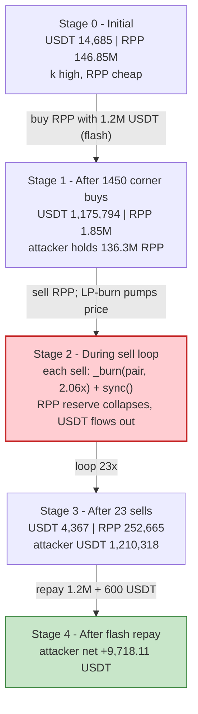
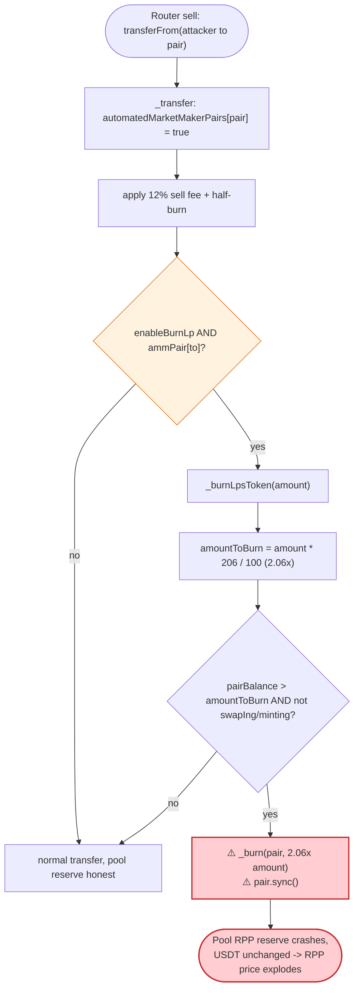

# RichPip (RPP) Token Exploit — Sell-Triggered LP Burn Pumps a Self-Manipulated Pool

> **Vulnerability classes:** vuln/oracle/spot-price · vuln/oracle/price-manipulation · vuln/defi/slippage

> **Reproduction:** the PoC compiles & runs in an isolated Foundry project at
> [this project folder](.) (the umbrella DeFiHackLabs repo contains many unrelated
> PoCs that do not whole-compile, so this one was extracted).
> Confirmed run: [output.txt](output.txt) (`[PASS] testExploit()`).
> Ground-truth reserve trace: [RPP_exp.trace.txt](RPP_exp.trace.txt) (instrumented copy that
> logs the pair reserves at every stage; mirrors the original attack exactly).
> Verified vulnerable source: [contracts_RichPipToken.sol](sources/RichPipToken_7d1a69/contracts_RichPipToken.sol).

---

## Key info

| | |
|---|---|
| **Loss** | **+9,718.11 USDT** profit reproduced in-fork (header reports total loss ≈ **$14.1K**) |
| **Vulnerable contract** | `RichPipToken` (RPP) — [`0x7d1a69302D2A94620d5185f2d80e065454a35751`](https://bscscan.com/address/0x7d1a69302D2A94620d5185f2d80e065454a35751#code) |
| **Victim pool** | RPP / USDT(BSC-USD) PancakeSwap-V2 pair — `0x7F42d51DB070454251c2B0B6922128BB2cf768E9` |
| **Attacker EOA** | [`0x709b30b69176a3ccc8ef3bb37219267ee2f5b112`](https://bscscan.com/address/0x709b30b69176a3ccc8ef3bb37219267ee2f5b112) |
| **Attacker contract** | [`0xfebfe8fbe1cbe2fbdcfb8d37331f2c8afd2a4b45`](https://bscscan.com/address/0xfebfe8fbe1cbe2fbdcfb8d37331f2c8afd2a4b45) |
| **Attack tx** | [`0x76c39537374e7fa7f206ed3c99aa6b14ccf1d2dadaabe6139164cc37966e40bd`](https://bscscan.com/tx/0x76c39537374e7fa7f206ed3c99aa6b14ccf1d2dadaabe6139164cc37966e40bd) |
| **Chain / block / date** | BSC / 43,752,882 / ~Nov 5, 2024 |
| **Compiler** | Solidity v0.8.27, optimizer **1000 runs** |
| **Bug class** | Broken AMM invariant via a sell-triggered, un-compensated reserve burn (`_burn(pair)` + `sync()`) |

Flash-loan capital: **1,200,000 USDT** borrowed from the PancakeSwap-V3 USDT/WBNB pool
(`0x36696169C63e42cd08ce11f5deeBbCeBae652050`), fee **600 USDT** (0.05%).

---

## TL;DR

`RichPipToken` is a deflationary token whose sell path runs `_burnLpsToken(amount)`. That routine
**burns `2.06 × amount` of RPP directly out of the AMM pair's balance and then calls `pair.sync()`**
([contracts_RichPipToken.sol:178-186](sources/RichPipToken_7d1a69/contracts_RichPipToken.sol#L178-L186)
→ [:338-347](sources/RichPipToken_7d1a69/contracts_RichPipToken.sol#L338-L347)). This is an
*un-compensated* removal of one side of the pool's reserves — RPP is deleted from the pair without
any matching USDT outflow, then `sync()` forces the pair to accept the smaller balance as its new
reserve. Every sell therefore **shrinks the pool's RPP reserve by far more than the tokens actually
sold**, pushing the RPP price up while USDT stays in the pool.

The `_lpBurnRate = 206%` ([:44](sources/RichPipToken_7d1a69/contracts_RichPipToken.sol#L44)) makes
this *catastrophic*: each sell burns more than twice the sold amount out of the pair, so the reserve
collapses geometrically. The attacker:

1. **Flash-borrows 1.2M USDT** and **corners** the pool's RPP with 1450 fixed-output buys
   (`swapTokensForExactTokens`), draining pool RPP from **146.85M → 1.85M** and accumulating
   **136.3M RPP** for itself.
2. **Sells RPP back** in a loop. Each sell triggers `_burnLpsToken`, which `_burn`s `2.06×` the
   sold amount from the pair and `sync()`s — so the pool's RPP reserve keeps crashing while the
   USDT it paid in during the corner phase stays locked in the pool.
3. After 23 sells the pool's USDT has flowed almost entirely back to the attacker
   (38,891 USDT → **1,210,318 USDT** held), having harvested both its own corner-buy USDT *and*
   the genuine USDT liquidity.
4. **Repays** the flash loan (1.2M + 600 USDT) and walks off with **+9,718.11 USDT**.

---

## Background — what RichPipToken does

`RichPipToken` ([source](sources/RichPipToken_7d1a69/contracts_RichPipToken.sol)) is an OZ
`ERC20Burnable` + `Ownable` token paired against BSC-USD (`mainAddress`,
[:24](sources/RichPipToken_7d1a69/contracts_RichPipToken.sol#L24)) on PancakeSwap-V2. Its
"tokenomics" bolt three mechanisms onto transfers:

- **Buy / sell / transfer fees** — `buyFee = 6%`, `sellFee = 12%`, `transferFee = 6%`, half of the
  fee burned (`txBurnRate = 50` ⇒ ½), the rest sent to `feeReciever`
  ([:26-30](sources/RichPipToken_7d1a69/contracts_RichPipToken.sol#L26-L30)).
- **Per-tx limits** — buys and sells are capped at `100,000 RPP` per transaction
  (`everyTimeBuyLimitAmount` / `everyTimeSellLimitAmount`,
  [:41-42](sources/RichPipToken_7d1a69/contracts_RichPipToken.sol#L41-L42)). This forces the attacker
  to loop in ≤100k chunks rather than one swap.
- **"LP burn"** — on every taxed sell the token burns `_lpBurnRate (206%)` of the sell amount
  *out of the liquidity pair* and `sync()`s it, supposedly to make the token deflationary and "pump"
  the price ([:178-186](sources/RichPipToken_7d1a69/contracts_RichPipToken.sol#L178-L186)).

On-chain state at the fork block (read from the instrumented trace, `STATE 0`):

| Parameter | Value |
|---|---|
| RPP `totalSupply` | 293,708,530 RPP |
| `_lpBurnRate` | **206** (i.e. `206 / _commonDiv(100)` = **2.06×** the sell amount) |
| `sellFee` / `buyFee` / `transferFee` | 12% / 6% / 6% |
| `everyTimeBuyLimitAmount` / `everyTimeSellLimitAmount` | 100,000 RPP each |
| `enableSwitch` / `enableBurnLp` | true / true (LP-burn active) |
| pool RPP reserve (`reserve1`) | **146,854,265 RPP** |
| pool USDT reserve (`reserve0`) | **14,685 USDT** |

The pair holds ~146.85M RPP against only ~14.7k USDT — RPP is cheap (≈ $0.0001). That tiny USDT
side plus the 2.06× sell-burn is the whole game.

---

## The vulnerable code

### 1. Every sell burns >2× the sold amount out of the pair

[`_transfer`](sources/RichPipToken_7d1a69/contracts_RichPipToken.sol#L257-L299) (used when the
router moves RPP into the pair on a sell) and [`_sell`](sources/RichPipToken_7d1a69/contracts_RichPipToken.sol#L188-L230)
both call `_burnLpsToken(amount)` on the sell path:

```solidity
function _burnLpsToken(uint256 amount) internal {
    uint256 liquidityPairBalance = balanceOf(uniswapV2Pair);
    uint256 amountToBurn = amount * _lpBurnRate / _commonDiv;   // 206/100 = 2.06× the sell amount
    if (amountToBurn > 0 && liquidityPairBalance > amountToBurn) {
        if (!swapIng && !minting) {
            autoLiquidityPairTokens(amountToBurn);
        }
    }
}
```
([contracts_RichPipToken.sol:178-186](sources/RichPipToken_7d1a69/contracts_RichPipToken.sol#L178-L186))

### 2. The burn deletes pool RPP and forces `sync()`

```solidity
function autoLiquidityPairTokens(uint256 amountToBurn) internal lockTheSwap returns (bool) {
    lastLpBurnTime = block.timestamp;
    // pull tokens from pancakePair liquidity and move to dead address permanently
    _recordBurn(uniswapV2Pair, amountToBurn);   // ⚠️ _burn(pair, 2.06×amount) — RPP destroyed from the pool
    //sync price since this is not in a swap transaction!
    IUniswapV2Pair pair = IUniswapV2Pair(uniswapV2Pair);
    pair.sync();                                 // ⚠️ pair now treats the smaller balance as its reserve
    emit AutoNukeLP();
    return true;
}
```
([contracts_RichPipToken.sol:338-347](sources/RichPipToken_7d1a69/contracts_RichPipToken.sol#L338-L347))

`_recordBurn` is the standard OZ `_burn`
([:154-157](sources/RichPipToken_7d1a69/contracts_RichPipToken.sol#L154-L157)): it subtracts the
amount from the pair's balance and reduces `totalSupply`. No USDT moves.

### 3. The sell path that reaches it

When the router executes a sell, it calls `transferFrom(attacker, pair, amount)` →
[`_transfer`](sources/RichPipToken_7d1a69/contracts_RichPipToken.sol#L257-L299). With
`automatedMarketMakerPairs[pair] == true` it takes the sell branch and, at the end:

```solidity
if (enableBurnLp && automatedMarketMakerPairs[to]) {
    // sell burn lp token
    _burnLpsToken(amount);     // ← fires on every sell into the pair
}
```
([contracts_RichPipToken.sol:293-296](sources/RichPipToken_7d1a69/contracts_RichPipToken.sol#L293-L296))

---

## Root cause — why it was possible

A Uniswap-V2 / PancakeSwap pair derives price purely from its reserves and enforces `x·y ≥ k` only
*inside `swap()`*. `sync()` exists so a pair can re-read its true balances after a legitimate
transfer — it trusts that balances change only through paths it can reason about.

`autoLiquidityPairTokens` violates that trust in the worst possible way:

> It **destroys** RPP held by the pair (`_burn(pair, 2.06×amount)`) and then calls `pair.sync()`,
> telling the pair "your RPP reserve just shrank." No USDT leaves the pair. The constant product `k`
> collapses and the marginal price of RPP explodes — and this happens **automatically on every sell**.

Four design decisions compose into the exploit:

1. **The "deflation" is a one-sided reserve deletion.** Burning RPP out of the pair without removing
   USDT shifts the entire USDT side toward whoever still holds RPP. The attacker makes sure *it* holds
   essentially all the RPP.
2. **The burn rate is 2.06× the sold amount.** Selling `X` RPP destroys `2.06X` more from the pool,
   so the RPP reserve falls more than 3× faster than tokens are actually sold — the pool degenerates
   geometrically across the sell loop.
3. **`sync()` after burn re-anchors the price.** Because the burn happens outside `swap()`, the pair
   would otherwise ignore the missing tokens; `sync()` forces it to honor the manipulated reserve as
   the new price.
4. **No flash-loan / single-block guard, no oracle.** Cornering, burning, and draining all happen in
   one transaction funded by a flash loan; price is taken from the instantaneous reserve the attacker
   controls.

The fees and per-tx limits are mere speed bumps: the attacker loops in ≤100k-RPP chunks (1450 buys,
23 sells) and absorbs the fee out of the enormous reserve mispricing it creates.

---

## Preconditions

- `enableSwitch && enableBurnLp` true (LP-burn active) and `_lpBurnRate` large (206% here).
- A thin USDT side relative to RPP, so cornering RPP is cheap and the burn quickly empties the pool.
- Capital to corner the pool's RPP — **1.2M USDT**, fully recovered intra-transaction, hence
  **flash-loanable** (the PoC borrows it from a PancakeSwap-V3 pool via `flash()`).
- The attacker must be a non-fee-excluded EOA-driven contract so its sells route through `_transfer`'s
  sell branch and trigger `_burnLpsToken`.

---

## Attack walkthrough (with on-chain numbers from the trace)

The pair's `token0 = USDT (reserve0)`, `token1 = RPP (reserve1)`. All figures are taken directly from
the `Sync`-event reserves logged in [RPP_exp.trace.txt](RPP_exp.trace.txt). Amounts shown in whole
tokens (18-dec), rounded.

| # | Step | Pool USDT | Pool RPP | Attacker USDT | Attacker RPP | Effect |
|---|------|----------:|---------:|--------------:|-------------:|--------|
| 0 | **Flash-borrow 1.2M USDT**; start of callback | 14,685 | 146,854,265 | 1,200,000 | 0 | Honest pool; attacker funded. |
| 1 | **Buy #1** (`swapTokensForExactTokens` for 94,000 RPP out) | 14,695 | 146,754,265 | 1,199,990 | 94,000 | First chunk; RPP barely moves. |
| 1b | **After buy #725** | 29,054 | 74,354,265 | 1,185,631 | 68,150,000 | Pool RPP halved; attacker holds 68.15M. |
| 2 | **After all 1450 buys** | 1,175,794 | 1,854,265 | 38,892 | 136,300,000 | Pool RPP cornered (−99%); USDT pushed into pool; RPP now "expensive". |
| 3 | **After 1st sell** (`swapExactTokensForTokensSupportingFeeOnTransferTokens`) | 1,117,177 | 1,760,985 | 97,509 | 136,200,000 | Sell burns 2.06× from pool; attacker pulls 58.6k USDT in one sell. |
| 4 | **After 23 sells** (loop exits) | 4,367 | 252,665 | **1,210,318** | 134,000,000 | Pool USDT drained back to attacker; pool RPP burned down to 252k. |
| 5 | **Repay 1.2M + 600 USDT fee** | 4,367 | 252,665 | **9,718** | 134,000,000 | Net profit realized. |

Note how step 4 reverses the cornering: the attacker spent ~1.16M USDT in steps 1-2 (pool USDT rose
to 1.176M), then the burn-on-sell mechanism let it reclaim that USDT **plus** the pool's original
liquidity by selling RPP into a pool whose RPP reserve it keeps annihilating. The sell loop's stop
condition (`rppBalance <= 134,160,000…`) leaves ~134M RPP unsold — worthless dust against the now
near-empty pool, so the attacker simply abandons it.

### Profit accounting (USDT, 18-dec wei)

| Direction | Amount |
|---|---:|
| Attacker USDT at start of callback (flash-borrowed) | 1,200,000.000000 |
| Attacker USDT after sell loop (STATE 4) | 1,210,318.113202 |
| Flash-loan repayment (principal + fee) | −1,200,600.000000 |
| **Attacker USDT after repay (STATE 5)** | **9,718.113202** |
| Pre-existing balance carried in `testExploit` accounting | +26.542162 |
| **`balanceLog`: After − Before** | **9,744.655364 − 26.542162 = +9,718.11 USDT** |

The reproduced figure matches the instrumented `FINAL atk USDT profit: 9718113201924619771106`
(wei) to the wei.

---

## Diagrams

### Sequence of the attack

```mermaid
sequenceDiagram
    autonumber
    actor A as "Attacker contract"
    participant V3 as "PancakeV3 USDT pool"
    participant R as "PancakeRouter V2"
    participant P as "RPP/USDT Pair"
    participant T as "RichPipToken"

    Note over P: "Initial reserves<br/>14,685 USDT / 146.85M RPP"

    A->>V3: "flash(1.2M USDT)"
    V3-->>A: "1.2M USDT (callback)"

    rect rgb(255,243,224)
    Note over A,T: "Step 1 - corner RPP (1450 fixed-output buys)"
    loop 1450x
        A->>R: "swapTokensForExactTokens(USDT to RPP, max 99,999 USDT in)"
        R->>P: "swap()"
        P-->>A: "~94,000 RPP out"
    end
    Note over P: "1,175,794 USDT / 1,854,265 RPP<br/>RPP cornered; attacker holds 136.3M RPP"
    end

    rect rgb(255,235,238)
    Note over A,T: "Step 2 - sell loop drains USDT (23 sells)"
    loop until RPP bal small
        A->>R: "swapExactTokensForTokensSupportingFeeOnTransfer(RPP to USDT)"
        R->>T: "transferFrom(attacker to pair)"
        T->>T: "_transfer -> _burnLpsToken(amount)"
        T->>P: "_burn(pair, 2.06x amount)  // RPP destroyed"
        T->>P: "sync()  // reserve crashes, price pumps"
        R->>P: "swap() -> USDT out to attacker"
        P-->>A: "USDT out (grows as pool RPP shrinks)"
    end
    Note over P: "4,367 USDT / 252,665 RPP (drained)"
    end

    A->>V3: "repay 1.2M + 600 USDT fee"
    Note over A: "Net +9,718.11 USDT (original liquidity + own corner USDT)"
```

### Pool state evolution



### The flaw inside the sell path



---

## Why each magic number

- **Flash 1,200,000 USDT:** enough to buy almost the entire RPP reserve (cornering RPP makes it scarce
  and pre-loads the pool with USDT that the attacker later reclaims).
- **1450 fixed-output buys of ~94,000 RPP:** the per-tx **buy limit is 100,000 RPP**
  ([:41](sources/RichPipToken_7d1a69/contracts_RichPipToken.sol#L41)) and the 6% buy fee nets ~94,000
  per chunk, so the attacker must loop ~1450 times to absorb the ~146M-RPP reserve.
- **`swapTokensForExactTokens(99,999_… , 1.2M_…)`:** exact-output buys with a huge max-input cap; the
  actual USDT spent per buy is small early (RPP cheap) and grows as the pool thins.
- **Sell loop stop `rppBalance <= 134,160,000…`:** the attacker stops once its remaining RPP is dust
  relative to the drained pool — selling more would yield negligible USDT, so it abandons ~134M RPP.
- **`_lpBurnRate = 206`:** the protocol's own parameter; burning 2.06× the sold amount out of the
  pair is what makes each sell pump the price hard enough to extract the full pool.

---

## Remediation

1. **Never burn from the liquidity pool.** A burn must only destroy tokens the protocol *owns*
   (its own balance / treasury). Removing `_recordBurn(uniswapV2Pair, …)` + `pair.sync()` from
   `autoLiquidityPairTokens` eliminates the bug. If "deflation reaching the pool" is a product goal,
   route value through the pair's own `burn()` (LP redemption) so *both* reserves move together and
   `k` is preserved.
2. **Do not trigger reserve manipulation on user swaps.** Burning from the pair on every sell makes
   the price reflexively pump for whoever is selling — an open invitation to corner-and-dump. At
   minimum, disable LP-burn during AMM-routed transfers (the `swapIng` lock already exists; it should
   gate the *whole* sell-burn path, not just re-entrancy).
3. **Cap single-operation reserve impact.** A burn that removes `>2×` the traded amount from a pool
   reserve is a red flag; any operation moving a reserve by more than a small percentage should revert.
4. **Add a single-block / flash-loan guard and use a TWAP/oracle** for any price- or reserve-derived
   logic, so an attacker cannot corner, manipulate, and drain in one transaction.
5. **Sanity-check the 2.06× rate.** `_lpBurnRate = 206` with `_commonDiv = 100` burns more than the
   amount sold; even ignoring the pool-burn bug, such a rate is economically incoherent for a
   "deflation" feature.

---

## How to reproduce

The PoC was extracted into a standalone Foundry project (the umbrella DeFiHackLabs repo has many
unrelated PoCs that fail to compile under a whole-project `forge build`):

```bash
_shared/run_poc.sh 2024-11-RPP_exp --match-path test/RPP_exp.sol -vvvvv
```

- RPC: a **BSC archive** endpoint is required (fork block 43,752,881). `foundry.toml` uses a
  fork-capable BSC archive (`bnb.api.onfinality.io` / `bsc-mainnet.public.blastapi.io`); most public
  BSC RPCs prune that height and fail with `header not found` / `missing trie node`.
- The PoC imports `../basetest.sol` (+ `./tokenhelper.sol`) and `../interface.sol`; all three were
  copied to the project root so the relative imports resolve.
- Result: `[PASS] testExploit()` with the attacker's USDT balance rising from **26.54 → 9,744.66**
  (net **+9,718.11 USDT**).

Expected tail:

```
Ran 1 test for test/RPP_exp.sol:RPP_exp
[PASS] testExploit() (gas: 59683027)
Logs:
  Attacker Before exploit USDT Balance: 26.542161622221038197
  Attacker After exploit USDT Balance: 9744.655363546840809303
```

---

*References: TenArmor alert — https://x.com/TenArmorAlert/status/1853984974309142768 ;
DeFiHackLabs (RPP, BSC, ~$14.1K).*
