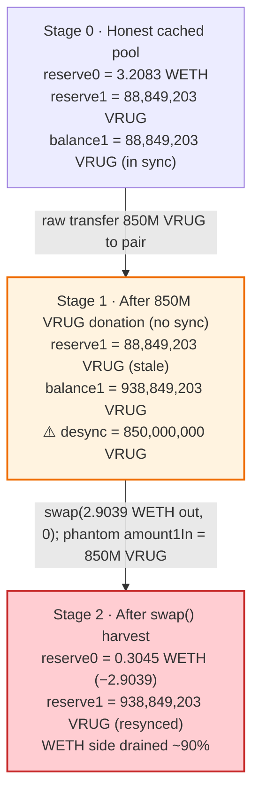
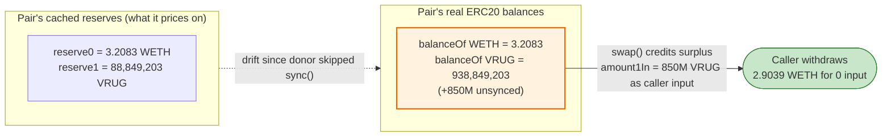

# VRUG ("Vitalik's Rug") Exploit — Unsynced UniswapV2 Reserve Donation Harvest

> **Vulnerability classes:** vuln/defi/slippage · vuln/oracle/spot-price

> **Reproduction:** the PoC compiles & runs in an isolated Foundry project at
> [this project folder](.) (the umbrella DeFiHackLabs repo does not whole-compile,
> so this PoC was extracted into a standalone project).
> Full verbose trace: [output.txt](output.txt).
> Verified vulnerable source: [UniswapV2Pair.sol](sources/UniswapV2Pair_8Cc0c4/UniswapV2Pair.sol) ·
> [VRUG.sol](sources/VRUG_C27397/src_VRUG.sol).

---

## Key info

| | |
|---|---|
| **Loss** | ~$8.4K — **2.9038726878518077 WETH** harvested out of the VRUG/WETH pair |
| **Vulnerable contract** | `UniswapV2Pair` (VRUG/WETH) — [`0x8Cc0c46000A6a4097F9C62293CE62eE5B81E6dfd`](https://etherscan.io/address/0x8Cc0c46000A6a4097F9C62293CE62eE5B81E6dfd#code) |
| **Token** | `VRUG` ("Vitalik's Rug") — [`0xC273979bd37AD379D0a274956c49BFe0B9eD88D9`](https://etherscan.io/address/0xC273979bd37AD379D0a274956c49BFe0B9eD88D9#code) |
| **Victim pool** | VRUG/WETH pair (`0x8Cc0c460…`); the 850M VRUG donor lost the WETH |
| **Attacker EOA** | `0x080086911D8c78008800FAE75871a657b77d0082` (caller / `tx.origin`) |
| **Beneficiary contract** | `0x0000E0Ca771e21bD00057F54A68C30D400000000` (MEV bot — receives the WETH) |
| **Attack tx** | [`0x5e151627dc06ec4f2db5be2f48248f320ad3450aba42b1bbd00131bcbaa4f0ae`](https://etherscan.io/tx/0x5e151627dc06ec4f2db5be2f48248f320ad3450aba42b1bbd00131bcbaa4f0ae) |
| **Chain / block / date** | Ethereum mainnet / 21,138,659 / Nov 7, 2024 (22:09 UTC) |
| **Compiler (pair)** | Solidity v0.5.16, optimizer **999999 runs** (stock UniswapV2) |
| **Bug class** | Stale AMM reserve vs. actual balance — untracked token donation harvested via `swap()` |

---

## TL;DR

Someone (the VRUG deployer / a holder) transferred **850,000,000 VRUG** directly into the VRUG/WETH
UniswapV2 pair **without calling `sync()` or trading through it**. A UniswapV2 pair stores its
reserves separately from its real token balances and only reconciles them inside `swap()`, `mint()`,
`burn()`, or `sync()` ([UniswapV2Pair.sol:368-381](sources/UniswapV2Pair_8Cc0c4/UniswapV2Pair.sol#L368-L381)).
After the donation the pair's **stored `reserve1` (88,849,203 VRUG) lagged its actual VRUG balance
(938,849,203 VRUG)** by exactly the 850M donation.

Inside `swap()`, the amount of token "deposited" is inferred as
`amount1In = balance1 − (reserve1 − amount1Out)`
([:472](sources/UniswapV2Pair_8Cc0c4/UniswapV2Pair.sol#L472)). Because `balance1` already contained
the 850M phantom donation, the pair believed the swapper had deposited 850M VRUG **when in fact they
deposited nothing**, and the constant-product `K`-check
([:477](sources/UniswapV2Pair_8Cc0c4/UniswapV2Pair.sol#L477)) passed on that phantom input.

A passing MEV bot (`0x0000E0Ca…`) simply called
`pair.swap(2903872687851807969, 0, mev, "")` — asking for **2.90 WETH out and supplying nothing** —
and walked away with **2.9038726878518077 WETH** (the entire profit), draining ~90% of the pool's
WETH reserve. No flash loan, no capital, no contract was needed; the donated value was free to anyone
who noticed.

---

## Background — what VRUG is

[`VRUG`](sources/VRUG_C27397/src_VRUG.sol) is a joke/rug memecoin literally headed with the comment
*"VITALIK WILL RUG YOU, DON'T BUY THIS TOKEN"*. It is a **completely vanilla OpenZeppelin ERC20** —
no fee-on-transfer, no rebasing, no transfer hooks
([VRUG.sol:16-39](sources/VRUG_C27397/src_VRUG.sol#L16-L39)):

```solidity
contract VRUG is Ownable, ERC20 {
    uint256 _totalSupply = 1_000_000_000 * 10 ** _decimals; // 1 billion
    constructor() ERC20("Vitalik's Rug", "VRUG") Ownable(msg.sender) {
        _mint(msg.sender, _totalSupply);
    }
    // vitalikMint(), burn(), receive() — nothing that touches AMM accounting
}
```

The token itself is **not** the bug. The bug lives entirely in the **stock UniswapV2 pair** that
trades VRUG against WETH, combined with the fact that a large VRUG balance was sitting in the pair
**unaccounted for** in the pair's stored reserves.

On-chain facts at the fork block (read via `cast`, block 21,138,659):

| Parameter | Value |
|---|---|
| `token0` | WETH `0xC02aaA39…` |
| `token1` | VRUG `0xC273979b…` |
| **stored `reserve0` (WETH)** | 3,208,323,423,502,347,412 wei = **3.2083 WETH** |
| **stored `reserve1` (VRUG)** | 88,849,203,688,029,037,326,840,863 = **88,849,203 VRUG** |
| actual WETH balance of pair | **3.2083 WETH** (matches `reserve0`) |
| **actual VRUG balance of pair** | **938,849,203 VRUG** ← 850M *more* than `reserve1` |
| VRUG `totalSupply` | 1,000,000,000 VRUG |
| pair owner (VRUG `owner`) | `0x0` (renounced) |

That last pair of rows is the whole game: the pair's VRUG **balance** exceeds its stored **reserve**
by exactly **850,000,000 VRUG**, an untracked donation waiting to be claimed.

---

## The vulnerable code

A UniswapV2 pair keeps two notions of liquidity that can drift apart:

- **`reserve0` / `reserve1`** — packed cached values, only ever written by `_update()`.
- **`IERC20(token).balanceOf(pair)`** — the live ERC20 balances, which *anyone* can change by simply
  transferring tokens to the pair.

### 1. `swap()` infers "input" from the gap between live balance and cached reserve

```solidity
function swap(uint amount0Out, uint amount1Out, address to, bytes calldata data) external lock {
    require(amount0Out > 0 || amount1Out > 0, 'UniswapV2: INSUFFICIENT_OUTPUT_AMOUNT');
    (uint112 _reserve0, uint112 _reserve1,) = getReserves();
    require(amount0Out < _reserve0 && amount1Out < _reserve1, 'UniswapV2: INSUFFICIENT_LIQUIDITY');
    ...
    if (amount0Out > 0) _safeTransfer(_token0, to, amount0Out); // optimistically send WETH out
    ...
    balance0 = IERC20(_token0).balanceOf(address(this));
    balance1 = IERC20(_token1).balanceOf(address(this));
    ...
    uint amount0In = balance0 > _reserve0 - amount0Out ? balance0 - (_reserve0 - amount0Out) : 0;
    uint amount1In = balance1 > _reserve1 - amount1Out ? balance1 - (_reserve1 - amount1Out) : 0; // ⚠️
    require(amount0In > 0 || amount1In > 0, 'UniswapV2: INSUFFICIENT_INPUT_AMOUNT');
    {
    uint balance0Adjusted = balance0.mul(1000).sub(amount0In.mul(3));
    uint balance1Adjusted = balance1.mul(1000).sub(amount1In.mul(3));
    require(balance0Adjusted.mul(balance1Adjusted) >= uint(_reserve0).mul(_reserve1).mul(1000**2), 'UniswapV2: K'); // ⚠️
    }
    _update(balance0, balance1, _reserve0, _reserve1);
    emit Swap(msg.sender, amount0In, amount1In, amount0Out, amount1Out, to);
}
```
[UniswapV2Pair.sol:454-482](sources/UniswapV2Pair_8Cc0c4/UniswapV2Pair.sol#L454-L482)

The crucial line is
[:472](sources/UniswapV2Pair_8Cc0c4/UniswapV2Pair.sol#L472): `amount1In` is computed from the **live
balance** `balance1`, not from anything the caller actually transferred *during this transaction*.
Any VRUG already sitting in the pair above the cached `reserve1` is silently attributed to the caller
as a free input.

### 2. The reserve only catches up on `sync()` (or the next reserve-touching op)

```solidity
// force reserves to match balances
function sync() external lock {
    _update(IERC20(token0).balanceOf(address(this)), IERC20(token1).balanceOf(address(this)), reserve0, reserve1);
}
```
[UniswapV2Pair.sol:493-495](sources/UniswapV2Pair_8Cc0c4/UniswapV2Pair.sol#L493-L495)

Until someone calls `sync()` (or `swap`/`mint`/`burn`), the 850M-VRUG donation is **not** part of the
priced reserve. The first person to call `swap()` captures it.

---

## Root cause — why it was possible

UniswapV2's `K`-invariant only requires that, **relative to the cached reserves**, the post-swap
adjusted balances still satisfy `x·y ≥ k`. It implicitly assumes that the only way `balance1` can
exceed `reserve1` is because the caller deposited that token *in the same transaction*. That
assumption breaks the moment tokens are pushed to the pair out-of-band:

> 850,000,000 VRUG was transferred into the pair without `sync()`. The pair's cached `reserve1` stayed
> at 88,849,203 VRUG while its real balance became 938,849,203 VRUG. `swap()` then credits the
> 850M-VRUG surplus as the caller's "input," so the caller can withdraw the WETH that input is worth —
> **for free.**

Plugging the trace numbers into the swap math (token0 = WETH out):

```
reserve0 = 3,208,323,423,502,347,412   (3.2083 WETH, cached)
reserve1 = 88,849,203 × 1e18           (cached VRUG)
balance1 = 938,849,203 × 1e18          (live VRUG, incl. 850M donation)
amount0Out = 2,903,872,687,851,807,969 (2.9039 WETH requested)

amount0In = 0                          (no WETH deposited)
amount1In = balance1 − (reserve1 − 0)  = 850,000,000 × 1e18 VRUG  ← phantom, never sent by attacker
K-check:  balance0Adjusted · balance1Adjusted  ≥  reserve0·reserve1·1000²   →  ratio = 1.0  ✓ (passes exactly)
```

So the donated 850M VRUG is exactly enough "input" to justify pulling 2.9039 WETH out while keeping
`x·y ≥ k`. The pool's WETH side collapses from 3.2083 → 0.3045 WETH.

The composing factors:

1. **Reserve/balance desync is fundamental to UniswapV2.** Cached reserves and live balances diverge
   the instant tokens are sent to the pair without a reserve-touching call. This is *by design* — and
   it is why "donations" to a pair are first-come-first-served free money.
2. **`swap()` attributes the entire surplus to the caller.** There is no record of *who* donated the
   850M VRUG; whoever calls `swap()` first claims it.
3. **A large, unsynced donation existed.** Whether an operational mistake by the VRUG team (seeding
   liquidity by raw `transfer` instead of `mint`/router add-liquidity) or a deliberate-but-fumbled
   move, 850M VRUG sat in the pair untracked — a standing arbitrage bounty.
4. **Permissionless and capital-free.** `swap()` is public; the harvester supplies nothing. A
   generic MEV/sandwich bot scanning for `balanceOf(pair) > reserve` mismatches scoops it instantly.

This is the same class as the canonical "skim/donation arbitrage" against UniswapV2 pairs: any value
sitting in a pair above its cached reserve belongs to the first caller of `swap()` / `skim()`.

---

## Preconditions

- A UniswapV2 pair whose **live token balance exceeds its cached reserve** for some token
  (here: +850M VRUG on `reserve1`). Achieved by a raw `transfer` to the pair without `sync()`.
- The mispriced token (VRUG) must be worth enough relative to the other side (WETH) that pulling out
  the WETH satisfies the `K`-check — i.e., the surplus input ≥ the value of the output requested.
- No prior `sync()` / `swap()` / `mint` / `burn` consumed the donation first (it's a race; the
  fastest caller wins). In practice an MEV bot (`0x0000E0Ca…`) won the race.
- **Zero attacker capital.** The PoC's `deal(weth, univ2, 3208323423502347412)` only re-asserts the
  pool's WETH balance to equal its cached `reserve0` at the fork block (it already does — the deal is
  a defensive no-op); the attacker contributes no tokens of its own.

---

## Attack walkthrough (with on-chain numbers from the trace)

The pair's `token0 = WETH`, `token1 = VRUG`, so `reserve0 = WETH`, `reserve1 = VRUG`.
All figures are taken directly from the storage diffs and `Sync`/`Swap` events in
[output.txt](output.txt).

| # | Step | Pair WETH (bal / reserve0) | Pair VRUG (bal / reserve1) | Effect |
|---|------|---:|---:|--------|
| 0 | **Initial state at fork** | 3.2083 / **3.2083** | **938,849,203** / **88,849,203** | Pair holds 850M *unsynced* VRUG. `balance1 ≫ reserve1`. |
| 1 | **(PoC setup)** `deal(WETH, pair, 3.2083e18)` | 3.2083 / 3.2083 | 938,849,203 / 88,849,203 | No-op alignment of WETH balance to cached reserve0. |
| 2 | **Harvest** `pair.swap(2.9039e18 WETH out, 0, mev, "")` — *no input sent* | → **0.3045** / 0.3045 | 938,849,203 / **938,849,203** | Pool ships 2.9039 WETH to `mev`; infers `amount1In = 850,000,000 VRUG` from the surplus; K-check passes (ratio 1.0); `_update` resyncs both reserves. |

Decoded `Sync` after the swap: `reserve0 = 304,450,735,650,539,443` (0.3045 WETH),
`reserve1 = 938,849,203,688,029,037,326,840,863` (938,849,203 VRUG). The `Swap` event reports
`amount1In = 850,000,000 × 1e18` and `amount0Out = 2,903,872,687,851,807,969` — the bot put in nothing
and took out 2.9039 WETH.

### Profit accounting (WETH)

| Direction | Amount (WETH) |
|---|---:|
| Attacker WETH supplied to pool (`amount0In`) | **0** |
| VRUG supplied by attacker | **0** (the 850M was pre-donated by someone else) |
| WETH pulled out (`amount0Out`) | **2.9038726878518077** |
| `mev` WETH balance before | 10.2478534550 |
| `mev` WETH balance after | 13.1517261429 |
| **Net profit** | **+2.9038726878518077 WETH** (~$8.4K) |

The profit equals the WETH `amount0Out` to the wei — the bot extracted ~90% of the pool's WETH for
free, leaving only 0.3045 WETH behind. The value it captured is the WETH-denominated worth of the
850M-VRUG donation that the donor accidentally left exposed.

---

## Diagrams

### Sequence of the attack

```mermaid
sequenceDiagram
    autonumber
    actor D as "Donor (VRUG team/holder)"
    actor A as "Attacker EOA 0x0800…"
    participant P as "VRUG/WETH Pair"
    participant W as "WETH"
    participant M as "MEV bot 0x0000E0Ca…"

    Note over P: "Cached reserves<br/>3.2083 WETH / 88,849,203 VRUG"

    rect rgb(255,243,224)
    Note over D,P: "Earlier — out-of-band donation (the mistake)"
    D->>P: "transfer 850,000,000 VRUG (no sync)"
    Note over P: "live VRUG balance = 938,849,203<br/>cached reserve1 still = 88,849,203<br/>⚠️ desync of 850M VRUG"
    end

    rect rgb(255,235,238)
    Note over A,M: "Harvest (zero capital)"
    A->>P: "swap(2.9039 WETH out, 0, mev, '')"
    P->>W: "transfer 2.9039 WETH to mev (optimistic)"
    W-->>M: "+2.9039 WETH"
    Note over P: "balance1=938,849,203; reserve1=88,849,203<br/>amount1In = 938,849,203 − 88,849,203 = 850,000,000 VRUG (phantom)"
    P->>P: "K-check: x·y ≥ k → ratio 1.0 ✓"
    P->>P: "_update() resyncs: 0.3045 WETH / 938,849,203 VRUG"
    end

    Note over M: "Net +2.9039 WETH — donor's WETH walked off"
```

### Pool state evolution



### Why the donation is free money: balance vs. cached reserve



---

## Why each number

- **850,000,000 VRUG (the desync):** the difference between the pair's live VRUG balance
  (938,849,203) and its cached `reserve1` (88,849,203). This is the donor's mistake — a raw
  `transfer` of 850M VRUG into the pair without ever calling `sync()` / adding liquidity through the
  router, so it never became priced reserve.
- **`amount0Out = 2,903,872,687,851,807,969` (2.9039 WETH):** the largest WETH withdrawal the
  attacker can take while the `K`-check still passes given an 850M-VRUG inferred input. The PoC uses
  the exact on-chain value; pushing higher would fail `'UniswapV2: K'`. The K-ratio comes out to
  exactly 1.0, i.e., the bot extracted essentially all the value the donation justified.
- **`deal(WETH, pair, 3,208,323,423,502,347,412)`:** re-asserts the pair's WETH balance equals its
  cached `reserve0` at the fork block. On this block they already match, so it is a defensive no-op
  ensuring deterministic replay; the attacker injects **no** capital of its own.

---

## Remediation

The pair contract is stock UniswapV2 and is not itself "fixable" — donation/desync arbitrage is an
inherent property. The fixes belong to **whoever manages liquidity**:

1. **Never seed or move pool liquidity with a raw `transfer`.** Always add liquidity through the
   router (`addLiquidity`) or, at minimum, follow any direct transfer with an immediate `sync()` in
   the **same transaction** so no block elapses with `balanceOf(pair) > reserve`. The gap between
   transfer and sync is exactly the window an MEV bot harvests.
2. **Treat any pair balance above its cached reserve as already lost.** If tokens must be parked in a
   pair, do it atomically; an unsynced surplus is first-come-first-served to any caller of `swap()` or
   `skim()`.
3. **Use `skim(to)` deliberately, not by accident.** If a donation is intentional, the recipient
   should `skim()` it to a controlled address rather than leaving it for the public to `swap()`.
4. **For protocols that programmatically push tokens into pairs** (auto-LP, deflation, reflections),
   route balance changes through the pair's own `mint`/`burn`/`swap` so both reserves move together
   and `k` is preserved — never leave one side of `balanceOf` ahead of `reserve` across blocks.
5. **Monitoring.** Alert on `balanceOf(token, pair) − reserve(token)` exceeding a threshold; this is
   the canonical signal that free value is exposed in a pair.

---

## How to reproduce

The PoC was extracted into a standalone Foundry project (the umbrella DeFiHackLabs repo has many
unrelated PoCs that fail to compile under a single `forge test` build):

```bash
_shared/run_poc.sh 2024-11-VRug_exp -vvvvv
```

- RPC: an **Ethereum mainnet archive** endpoint is required (fork block 21,138,659). `foundry.toml`
  uses an Infura archive endpoint; if it returns `401 invalid project id`, rotate the `/v3/<key>` to a
  different key (the default ships several).
- Result: `[PASS] testPoC()` — `mev` WETH balance rises from 10.247853… to 13.151726… (+2.9039 WETH).

Expected tail:

```
Ran 1 test for test/VRug_exp.sol:ContractTest
[PASS] testPoC() (gas: 259561)
  before attack: balance of mev: 10.247853455040299455
  after attack: balance of mev: 13.151726142892107424
```

(net gain = 13.151726… − 10.247853… = **2.9038726878518077 WETH**)

---

*Reference: TenArmor post-mortem — https://x.com/TenArmorAlert/status/1854702463737380958 (VRUG, Ethereum mainnet, ~$8.4K).*
