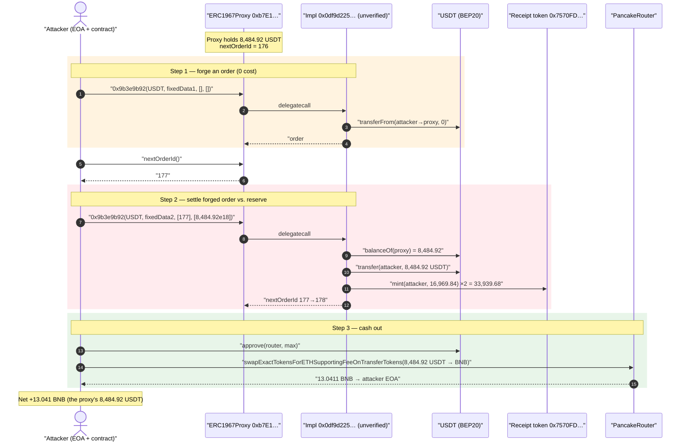
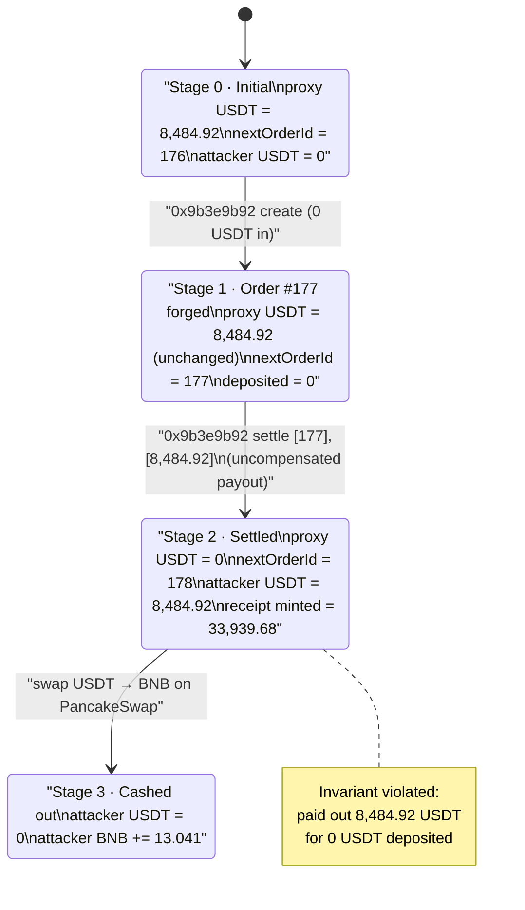
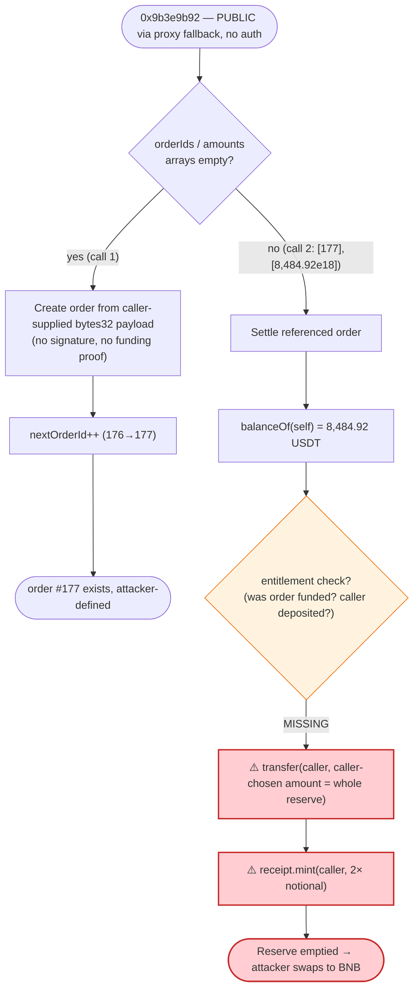

# ERC1967Proxy (0xb7E1…) Exploit — Unauthenticated "Order Settlement" Drains Proxy Reserves

> One-line summary: A permissionless settlement function (`selector 0x9b3e9b92`) on an
> upgradeable order/escrow contract lets anyone forge an order and "settle" it against the
> contract's own token reserves — the attacker created a fake order, matched it against the
> proxy's USDT balance, drained all **8,484.92 USDT**, and walked away with ~**13.04 BNB**.

> **Reproduction:** the PoC compiles & runs in an isolated Foundry project at
> [this project folder](.). Full verbose trace:
> [output.txt](output.txt). The proxy itself is a vanilla OpenZeppelin ERC1967Proxy
> ([verified source](sources/ERC1967Proxy_b7E1D1/openzeppelin_contracts_proxy_ERC1967_ERC1967Proxy.sol));
> the vulnerable logic lives in the **unverified** implementation it delegates to (see
> [Root cause](#root-cause--why-it-was-possible)).

---

## Key info

| | |
|---|---|
| **Loss** | ~$8.5k — **8,484.92 BEP20-USDT** drained from the proxy, sold for **13.04 BNB** |
| **Vulnerable contract** | ERC1967Proxy — [`0xb7E1D1372f2880373d7C5a931cDbAA73C38663C6`](https://bscscan.com/address/0xb7E1D1372f2880373d7C5a931cDbAA73C38663C6#code) (logic delegated to **unverified** impl [`0x0df9d225CcfAa21cEB0b2ab6855b13Dffa78d253`](https://bscscan.com/address/0x0df9d225CcfAa21cEB0b2ab6855b13Dffa78d253)) |
| **Victim / drained reserve** | The proxy's own 8,484.92 USDT balance |
| **Receipt/share token** | [`0x7570FDAd10010A06712cae03D2fC2B3A53640aa4`](https://bscscan.com/address/0x7570FDAd10010A06712cae03D2fC2B3A53640aa4) (impl `0x28221c…`) — minted 2× to the attacker as a side effect |
| **Attacker EOA** | [`0x9f2eceC0145242c094b17807f299Ce552A625ac5`](https://bscscan.com/address/0x9f2ecec0145242c094b17807f299ce552a625ac5) |
| **Attacker contract** | [`0x9b78b5d9feBCE2B8868Ea6EE2822cb482a85AD74`](https://bscscan.com/address/0x9b78b5d9febce2b8868ea6ee2822cb482a85ad74) |
| **Attack tx** | [`0x864d33d006e5c39c9ee8b35be5ae05a2013e556be3e078e2881b0cc6281bb265`](https://bscscan.com/tx/0x864d33d006e5c39c9ee8b35be5ae05a2013e556be3e078e2881b0cc6281bb265) |
| **Chain / block / date** | BSC / 44,294,726 / Nov 24, 2024 |
| **Compiler** | Proxy: Solidity v0.8.20, optimizer 200 runs (impl unverified) |
| **Bug class** | Missing access control + unvalidated user-supplied accounting (forged-order settlement) |

> Post-mortem reference: [TenArmorAlert](https://x.com/TenArmorAlert/status/1860867560885150050).

---

## TL;DR

The contract at `0xb7E1…` is an upgradeable order/escrow contract (an "order" data structure with a
monotonic `nextOrderId`, per-order `bytes32` payload, and a receipt/share token). It exposes a single
fat entry point — function **selector `0x9b3e9b92`** — that both **creates orders** and **settles**
them. That function:

- has **no access control** (anyone can call it through the proxy), and
- **trusts the caller-supplied order payload and the caller-supplied "amount" array verbatim** — there
  is no signature, no on-chain verification that a referenced order was funded, and no check that the
  payout is backed by anything the caller actually deposited.

The attacker exploited it in **two calls**:

1. **Forge an order** — call `0x9b3e9b92` with an empty amounts array and an attacker-chosen `bytes32`
   payload (`fixedData1`). This mints order **#177** entirely from attacker-controlled data while
   transferring **0** USDT in. ([trace L25-L47](output.txt#L25))
2. **Settle the forged order against the vault** — call `0x9b3e9b92` again, this time passing
   `[orderId = 177]` and `[amount = 8,484.92e18]` (the proxy's *entire* USDT balance, read live).
   The contract reads its own USDT balance, **transfers all 8,484.92 USDT out to the attacker**, and
   mints **16,969.84 receipt tokens twice** (= 33,939.68) to the attacker as accounting "shares."
   ([trace L52-L111](output.txt#L52))

The attacker then `approve`s PancakeRouter and dumps the 8,484.92 USDT for **13.04 BNB**, forwarded to
the EOA. The receipt-token balance (33,939.68) is left dangling on the attacker contract.

Net theft = the proxy's full **8,484.92 USDT** reserve.

---

## Background — what the contract does

The vulnerable implementation is **not verified** on BscScan, so its exact Solidity is unavailable.
However, the runtime trace + storage diffs fully expose its behavior. Reconstructed from the trace, the
contract is an **order-settlement / escrow** system with these observable pieces:

- A global counter **`nextOrderId`** living in storage **slot 0** (it ticks `176 → 177 → 178` across the
  two calls — [L42](output.txt#L42), [L106](output.txt#L106)). It is publicly readable via
  `nextOrderId()` ([L48-L51](output.txt#L48)).
- Per-order records keyed by a hash of the order id (the `0xec34d1…0899…` and `0x7ff6d9…865e…`
  storage families written in [L38-L45](output.txt#L38) and [L102-L109](output.txt#L102)), storing the
  order's `bytes32` payload, the token address, an owner, a flag, and a timestamp.
- A **receipt/share token** at `0x7570FD…` (also an ERC1967Proxy → impl `0x28221c…`) whose `mint()` the
  settlement path calls ([L79-L94](output.txt#L79)).
- It custodies real assets — at the fork block it held exactly **8,484.92 BEP20-USDT**
  (verified on-chain: `USDT.balanceOf(0xb7E1…) = 8484920000000000000000`).

The single multiplexed entry point `0x9b3e9b92` takes:

```
0x9b3e9b92(
    address token,        // BEP20-USDT
    bytes32 payload,      // attacker-chosen order data ("fixedData1"/"fixedData2")
    uint256 a, uint256 b, // flags (0, 1 here)
    uint256[] orderIds,   // dynamic array — orders to reference/settle
    uint256[] amounts     // dynamic array — payout amounts
)
```

The two calls differ **only** in `payload` and in whether the `orderIds`/`amounts` arrays are populated
— which is exactly what lets one call create and the next call drain.

---

## The vulnerable code

The vulnerable logic contract `0x0df9d225…` is unverified, so REAL Solidity snippets are not
recoverable. What *is* recoverable and load-bearing is the proxy that blindly forwards every call to it,
and the on-chain behavior. The proxy is a stock OZ ERC1967Proxy whose entire job is an unconditional
`delegatecall`:

```solidity
// sources/ERC1967Proxy_b7E1D1/openzeppelin_contracts_proxy_Proxy.sol
function _delegate(address implementation) internal virtual {
    assembly {
        calldatacopy(0, 0, calldatasize())
        let result := delegatecall(gas(), implementation, 0, calldatasize(), 0, 0)
        returndatacopy(0, 0, returndatasize())
        switch result
        case 0 { revert(0, returndatasize()) }
        default { return(0, returndatasize()) }
    }
}
```
[Proxy.sol:22-44](sources/ERC1967Proxy_b7E1D1/openzeppelin_contracts_proxy_Proxy.sol#L22-L44) —
the proxy enforces no authorization; whatever the implementation lacks, the system lacks.

The implementation registered at *verification time* was `0x0bb985…`
([`_meta.json`](sources/ERC1967Proxy_b7E1D1/_meta.json)), but the **runtime implementation slot
(`0x3608…2bbc`) resolves to the unverified `0x0df9d225…`** at the fork block (verified via
`cast storage`), i.e. the proxy had been upgraded to the exploited logic.

### What the trace proves the implementation does (the actual bug surface)

**Settlement transfers the contract's reserves out with no entitlement check.** In call 2, the
implementation reads its own USDT balance and immediately pays the full amount to the caller:

```
# output.txt L65-L72  (inside delegatecall to 0x0df9d225…)
USDT.balanceOf(0xb7E1…)            → 8,484,920000000000000000      // reads its own reserve
USDT.transfer(AttackerC, 8,484.92e18)                              // ⚠️ pays it ALL to caller
  storage @ …a12: 8484.92e18 → 0     // an internal "balance" accounting slot zeroed
  storage @ …e9b: 0 → 8484.92e18     // moved to the attacker's accounting slot
```
[L65-L72](output.txt#L65)

**…and mints receipt/share tokens to the caller for the same notional, twice:**

```
# output.txt L79-L94
0x7570FD….mint(AttackerC, 16,969.84e18)   // 2 × 8,484.92
0x7570FD….mint(AttackerC, 16,969.84e18)   // again
# → final receipt balance 33,939.68e18  (L166-L169)
```
[L79-L94](output.txt#L79)

The decisive fact: **the payout amount (`8,484.92e18`) and the referenced order id (`177`) are both
attacker-supplied function arguments** ([PoC L64-L80](test/proxy_b7e1_exp.sol#L64-L80)), and order #177
was itself created by the attacker one call earlier from attacker-chosen data. Nothing in between
verified that order #177 was funded or that the caller was entitled to the contract's USDT.

---

## Root cause — why it was possible

The settlement path of `0x9b3e9b92` combines three failures, each of which alone would be a finding and
which together are critical:

1. **No access control.** The function is reachable by anyone through the proxy fallback. There is no
   `onlyOwner` / `onlyOperator` / keeper restriction on the order-settlement entry point, so an
   arbitrary EOA can drive the full create→settle lifecycle. (The proxy admin slot is `0x0`, and the
   call originates straight from the attacker contract — [L22-L25](output.txt#L22).)

2. **Order data is fully attacker-controlled and unauthenticated.** The `bytes32 payload`
   (`fixedData1`/`fixedData2`) is written into the order record verbatim
   ([storage diff L41,L103](output.txt#L41)). There is **no signature** over the order, **no
   verification** that the order corresponds to a real, funded counterparty position. The attacker
   literally hand-crafts the order that will later "owe" them money.

3. **Payout is taken from the contract's reserves with no backing/entitlement check.** The settlement
   reads `USDT.balanceOf(self)` and pays the **caller-supplied amount** straight out
   ([L65-L72](output.txt#L65)). There is no invariant that "USDT paid out ≤ USDT this caller actually
   deposited for this order." Because the caller also chose the amount (= the whole balance) and the
   order (= their own forged #177), the check that should have failed simply does not exist.

In short: the contract treats *caller-supplied accounting* as ground truth. An order/escrow system must
never pay out reserves on the basis of data the beneficiary themselves provided — entitlement must be
proven (deposits actually escrowed, signatures from the funding party, or a matched, independently-funded
counter-order). Here the "match" was forged and self-referential.

The receipt-token double `mint` ([L79-L94](output.txt#L79)) is a secondary accounting bug (shares minted
for value the attacker never contributed) but is irrelevant to the cash theft — the loss is the 8,484.92
USDT, not the dangling receipt tokens.

---

## Preconditions

- The proxy must hold a non-zero balance of the settled token (here **8,484.92 USDT**) — that balance is
  the entire prize, read live at settlement time, so the attacker simply takes 100% of whatever is there.
- The exploited implementation `0x0df9d225…` must be the active logic (it was, at block 44,294,726).
- **No capital required.** The forged order is created with a **0-USDT** transfer
  ([L29-L32](output.txt#L29)), and the settlement *pays out* before anything is taken in — the attack is
  pure profit and needs no flash loan. The PoC even leaves the `deal(...)` line commented out
  ([test/proxy_b7e1_exp.sol:35](test/proxy_b7e1_exp.sol#L35)).

---

## Attack walkthrough (with on-chain numbers from the trace)

All figures are taken directly from [output.txt](output.txt).

| # | Step | Call / effect | Ground-truth numbers |
|---|------|---------------|----------------------|
| 0 | **Read prize** | `USDT.balanceOf(0xb7E1…)` | proxy holds **8,484.92 USDT** ([L23-L24](output.txt#L23)) |
| 1 | **Forge order #177** | `0x9b3e9b92(USDT, fixedData1, 0,1, [], [])` → delegatecall to `0x0df9d225…` | `transferFrom(attacker → proxy, 0)`; order record written with attacker payload; `nextOrderId` **176 → 177** ([L25-L46](output.txt#L25)) |
| 2 | **Read new id** | `nextOrderId()` | returns **177** ([L48-L51](output.txt#L48)) |
| 3 | **Settle forged order vs. reserve** | `0x9b3e9b92(USDT, fixedData2, 0,1, [177], [8,484.92e18])` | reads own balance, **`transfer(attacker, 8,484.92 USDT)`**; `nextOrderId` **177 → 178** ([L52-L72,L106](output.txt#L52)) |
| 4 | **Mint receipt shares** | inside settlement | `0x7570FD….mint(attacker, 16,969.84)` **twice** → **33,939.68** receipt tokens ([L79-L94](output.txt#L79)) |
| 5 | **Cash out** | `USDT.approve(router, max)` then `swapExactTokensForETHSupportingFeeOnTransferTokens(8,484.92 USDT → BNB)` to the EOA | pair reserves `9,962,054 USDT / 15,362.83 WBNB`; swap yields **13.0411 WBNB**, unwrapped and sent to attacker EOA ([L114-L160](output.txt#L114)) |

**Balances before/after** ([output.txt L6-L8](output.txt#L6)):
- Attacker EOA BNB: `0.0984` → `13.1395` (Δ ≈ **+13.041 BNB** = the swapped USDT)
- Attacker contract receipt-token balance: `0` → **33,939.68** (worthless side-effect)

### Profit / loss accounting

| Item | Amount |
|---|---:|
| USDT taken in by attacker (deposited) | **0** |
| USDT paid out of proxy to attacker | **8,484.92 USDT** |
| USDT sold on PancakeSwap → BNB | 8,484.92 USDT → **13.0411 BNB** |
| Attacker EOA BNB gain (net of gas) | **+13.041 BNB** (~$8.5k) |
| Receipt tokens minted to attacker (no market value here) | 33,939.68 |
| **Protocol loss** | **8,484.92 USDT (100% of the proxy reserve)** |

The protocol loss equals the proxy's entire USDT balance to the wei — the attacker emptied the reserve.

---

## Diagrams

### Sequence of the attack



### Proxy / reserve state evolution



### Where the access/validation gap sits



---

## Remediation

1. **Authenticate settlement.** Either gate the settlement entry point behind a trusted operator/keeper
   role, or require a signature from the order's *funding* party. A beneficiary must never be able to
   create-and-settle their own order in two unprivileged calls.
2. **Track real entitlements, not caller-supplied amounts.** Maintain per-order escrowed balances that
   are incremented only by *actually-received* `transferFrom` amounts, and enforce
   `payout ≤ escrowedForThisOrder`. The amount paid out must never be a free function argument validated
   against the contract's *total* balance.
3. **Separate "create order" from "settle order" and validate state transitions.** A freshly created
   order must start in an unfunded/unsettleable state; settlement should require an independently-funded,
   matched counter-order — not a self-reference to an order the caller just minted.
4. **Don't read `balanceOf(self)` as an entitlement source.** Pricing/payouts off the contract's raw
   token balance lets anyone who can reach the payout path take the whole pot.
5. **Mint receipt/share tokens only against contributed value**, and only once — the double 2× mint
   indicates the share-accounting is also detached from real deposits.
6. **Lock down proxy upgrades.** The active logic (`0x0df9d225…`) was an *unverified* upgrade away from
   the verified `0x0bb985…`. Upgrades to escrow logic should go through a timelock + audit, and
   implementations should be source-verified before they custody funds.

---

## How to reproduce

The PoC was extracted into a standalone Foundry project (the umbrella DeFiHackLabs repo has several
unrelated PoCs that fail to compile under a single `forge test` build):

```bash
_shared/run_poc.sh 2024-11-proxy_b7e1_exp -vvvvv
```

- **`via_ir = true`** is set in `foundry.toml` — the PoC's `attack()` packs many locals into one frame
  and hits "Stack too deep" without the IR pipeline.
- RPC: a **BSC archive** endpoint is required (block 44,294,726). `foundry.toml` uses
  `https://bsc-mainnet.public.blastapi.io`, which serves historical state at that block; most public BSC
  RPCs prune it and fail with `header not found` / `missing trie node`.
- Result: `[PASS] testPoC()`, attacker EOA BNB `0.098 → 13.139` (≈ +13.04 BNB).

Expected tail:

```
Ran 1 test for test/proxy_b7e1_exp.sol:ContractTest
[PASS] testPoC() (gas: 869665)
Logs:
  before attack: balance of attacker: 0.098371945900000000
  after attack: balance of attacker: 13.139470651667818172
  after attack: balance of address(attC): 33939.680000000000000000

Suite result: ok. 1 passed; 0 failed; 0 skipped
```

---

*Reference: TenArmorAlert post-mortem — https://x.com/TenArmorAlert/status/1860867560885150050 (BSC, ~$8.5K).*
