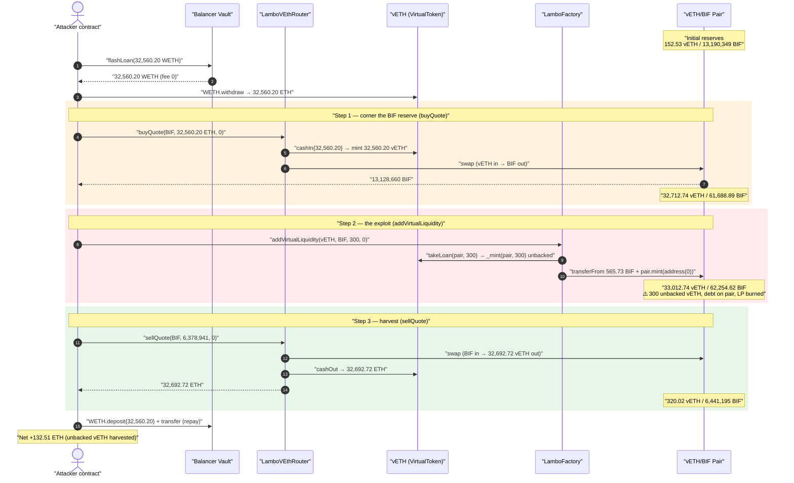
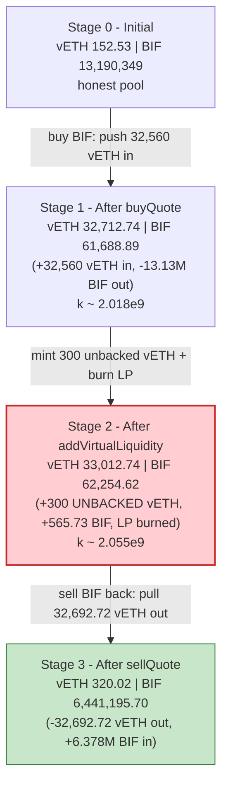
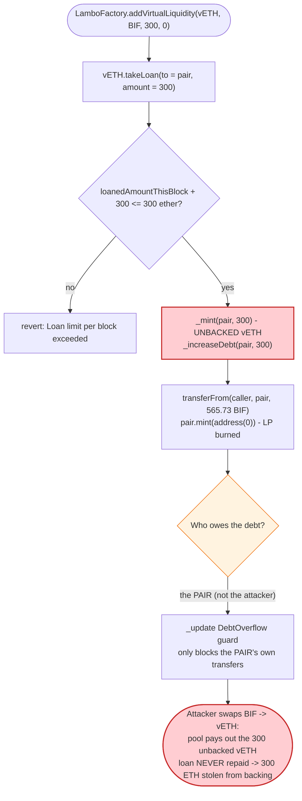
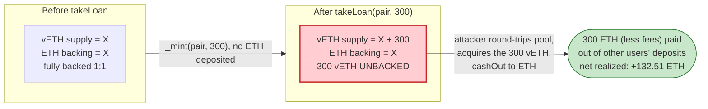

# vETH (Lambo.win) Exploit — Unbacked `takeLoan` via `addVirtualLiquidity` Inflates an AMM Pair

> **Vulnerability classes:** vuln/logic/incorrect-state-transition · vuln/access-control/broken-logic

> **Reproduction:** the PoC compiles & runs in an isolated Foundry project at
> [this project folder](.) (the umbrella DeFiHackLabs repo does not whole-compile, so this PoC was
> extracted). Full verbose trace: [output.txt](output.txt).
> Verified vulnerable token source: [src_VirtualToken.sol](sources/VirtualToken_280A89/src_VirtualToken.sol).
> The `LamboFactory` (`addVirtualLiquidity`) and the `LamboVEthRouter` (`buyQuote`/`sellQuote`)
> were **unverified** on Etherscan; their behavior is reconstructed from the live trace.

---

## Key info

| | |
|---|---|
| **Loss** | ~$447K total across 3 attackers; this PoC reproduces the **vETH-BIF** leg = **132.51 ETH** profit in one tx |
| **Vulnerable contract** | `VirtualToken` (vETH) — [`0x280A8955A11FcD81D72bA1F99d265A48ce39aC2E`](https://etherscan.io/address/0x280A8955A11FcD81D72bA1F99d265A48ce39aC2E#code) |
| **Exploited entry point** | `LamboFactory.addVirtualLiquidity(...)` (selector `0x6c0472da`) — [`0x62f250CF7021e1CF76C765deC8EC623FE173a1b5`](https://etherscan.io/address/0x62f250CF7021e1CF76C765deC8EC623FE173a1b5) (unverified) |
| **Router used** | `LamboVEthRouter` — [`0x19C5538DF65075d53D6299904636baE68b6dF441`](https://etherscan.io/address/0x19C5538DF65075d53D6299904636baE68b6dF441) (unverified) |
| **Victim pool** | Uniswap V2 vETH/BIF pair — `0x0634866dfd8F05019c2A6e1773dC64Cb5a5D3E6c` |
| **Token cornered** | BIF (`LamboToken` proxy) — `0xAefEF41f5a0Bb29FE3d1330607B48FBbA55904CE` |
| **Attacker EOA** | `0x713d2b652e5f2a86233c57af5341db42a5559dd1` |
| **Attacker contract** | `0x351d38733de3f1e73468d24401c59f63677000c9` |
| **Attack tx (this leg, vETH-BIF)** | `0x900891b4540cac8443d6802a08a7a0562b5320444aa6d8eed19705ea6fb9710b` |
| **Chain / block / date** | Ethereum mainnet / 21,184,778 / 2024-11-14 |
| **Compiler** | `VirtualToken`: Solidity v0.8.23, optimizer 200 runs |
| **Bug class** | Unbacked token minting into an AMM pair (broken `x·y=k` invariant via virtual-liquidity loan) |

---

## TL;DR

Lambo.win's `VirtualToken` ("vETH") exposes a privileged `takeLoan(to, amount)`
([src_VirtualToken.sol:90-102](sources/VirtualToken_280A89/src_VirtualToken.sol#L90-L102)) that
**mints brand-new vETH out of thin air** — `_mint(to, amount)` — and only records a *debt* against
the recipient. It is callable by any address registered in `validFactories`. The protocol's
`LamboFactory.addVirtualLiquidity(...)` is such a factory: it calls `takeLoan(pair, 300 ether)`,
minting **300 unbacked vETH directly into the Uniswap V2 vETH/BIF pair**, pulls a small proportional
amount of BIF from the caller, then calls `pair.mint(address(0))` — adding liquidity whose LP shares
are **burned to `address(0)`** so no one can ever withdraw them.

The net effect is that 300 vETH (worth ~300 ETH) are **donated, unbacked, into the pool's reserves
and never repaid** (there is no `repayLoan` / `LoanRepaid` anywhere in the transaction). The attacker
captures this gift by sandwiching the `addVirtualLiquidity` call between a large round-trip swap:

1. **Flash-loan 32,560 WETH** from Balancer (fee 0).
2. **`buyQuote`** — cash 32,560 ETH into the protocol 1:1 for 32,560 vETH, swap it into the pair and
   pull out **13,128,660 BIF** (corner the pool's BIF).
3. **`addVirtualLiquidity(vETH, BIF, 300 ether, 0)`** — mint 300 unbacked vETH into the pair and add
   it as (burned) liquidity, inflating the pool's reserves and `k`.
4. **`sellQuote`** — sell **6,378,941 BIF** back into the now-inflated pool, pulling out **32,692.72
   vETH**, then `cashOut` to ETH.
5. **Repay** the 32,560 WETH flash loan.

The attacker receives **32,692.72 ETH** for an outlay of **32,560.20 ETH** → **+132.51 ETH** profit,
which is exactly the value of the unbacked vETH the protocol minted into the pool on its behalf.

---

## Background — what Lambo.win / vETH does

Lambo.win is a token launchpad on Ethereum. Its core primitives at the time of the hack:

- **`VirtualToken` (vETH)** — a wrapper that any whitelisted address can `cashIn` (deposit ETH, mint
  vETH 1:1) and `cashOut` (burn vETH, withdraw ETH minus a fee). Conceptually vETH is supposed to be
  **fully backed by ETH** held in the contract. ([src_VirtualToken.sol:74-88](sources/VirtualToken_280A89/src_VirtualToken.sol#L74-L88))
- **A "virtual loan" facility** — `takeLoan`/`repayLoan`
  ([:90-109](sources/VirtualToken_280A89/src_VirtualToken.sol#L90-L109)) lets a registered *factory*
  borrow freshly-minted vETH to seed liquidity, capped at `MAX_LOAN_PER_BLOCK = 300 ether`
  ([:16](sources/VirtualToken_280A89/src_VirtualToken.sol#L16)) per block. The borrowed amount is
  tracked as `_debt[to]` and the `_update` override is supposed to make the debt un-spendable.
- **`LamboFactory`** (unverified) — wraps `takeLoan` + Uniswap `mint` behind
  `addVirtualLiquidity(virtualToken, token, virtualAmount, ...)`. From the trace it (a) calls
  `vETH.takeLoan(pair, 300 ether)`, (b) `transferFrom`s a matching slice of `token` (BIF) from the
  caller, then (c) calls `pair.mint(address(0))`.
- **`LamboVEthRouter`** (unverified) — a thin DEX wrapper. `buyQuote(token, ethAmount, minOut)`
  cashes ETH into vETH and swaps it for `token`; `sellQuote(token, tokenAmount, minOut)` swaps
  `token` back to vETH and cashes it out to ETH.

The vETH/BIF pair is a vanilla Uniswap V2 pair. Token ordering: `token0 = vETH (0x280A…)`,
`token1 = BIF (0xAefE…)`, so `reserve0 = vETH`, `reserve1 = BIF`.

On-chain state at the fork block (read from the trace's first `getReserves`):

| Parameter | Value |
|---|---|
| `MAX_LOAN_PER_BLOCK` | **300 ether** |
| `cashOutFee` | 70 bps (0.7%) — *not charged on the router's cash-out path in this trace* |
| Pool vETH reserve (initial) | 152.53 vETH |
| Pool BIF reserve (initial) | 13,190,349.04 BIF |
| Balancer Vault WETH (flash-loanable) | 32,560.20 WETH |

---

## The vulnerable code

### 1. `takeLoan` mints unbacked vETH and only records a debt

```solidity
uint256 public constant MAX_LOAN_PER_BLOCK = 300 ether;
mapping(address => uint256) public _debt;
mapping(address => bool) public validFactories;

function takeLoan(address to, uint256 amount) external payable nonReentrant onlyValidFactory {
    if (block.number > lastLoanBlock) {
        lastLoanBlock = block.number;
        loanedAmountThisBlock = 0;
    }
    require(loanedAmountThisBlock + amount <= MAX_LOAN_PER_BLOCK, "Loan limit per block exceeded");

    loanedAmountThisBlock += amount;
    _mint(to, amount);          // ⚠️ brand-new, ETH-unbacked vETH
    _increaseDebt(to, amount);  // ⚠️ debt is charged to `to` (here: the PAIR), not the caller

    emit LoanTaken(to, amount);
}
```
[src_VirtualToken.sol:90-102](sources/VirtualToken_280A89/src_VirtualToken.sol#L90-L102)

### 2. The debt is only enforced on `_update`, and it is charged to the pair

```solidity
// override the _update function to prevent overflow
function _update(address from, address to, uint256 value) internal override {
    // check: balance - _debt < value
    if (from != address(0) && balanceOf(from) < value + _debt[from]) {
        revert DebtOverflow(from, _debt[from], value);
    }
    super._update(from, to, value);
}
```
[src_VirtualToken.sol:142-149](sources/VirtualToken_280A89/src_VirtualToken.sol#L142-L149)

The intent: an address that owes a loan cannot move tokens below its debt level, forcing the loan to
be repaid before the vETH can leave. But `addVirtualLiquidity` sets `to = pair`, so the **300-vETH
debt is attached to the Uniswap pair**, while the freshly-minted 300 vETH **sit in the pair's reserves
as spendable liquidity**. The pair's own `swap()` pays vETH out to *third parties* (the router), and
those transfers reduce the pair's balance — but the attacker arranges to *add* vETH to the pair right
before, so the pair never trips its own `DebtOverflow` guard during the harvest. The unbacked 300 vETH
is simply absorbed into the pool's price and walked out via a swap.

### 3. vETH cashIn/cashOut assumes 1:1 ETH backing

```solidity
function cashIn() external payable onlyWhiteListed {
    _transferAssetFromUser(msg.value);
    _mint(msg.sender, msg.value);          // deposit ETH → mint vETH 1:1
    emit Wrap(msg.sender, msg.value);
}

function cashOut(uint256 amount) external onlyWhiteListed returns (uint256 amountAfterFee) {
    uint256 fee = (amount * cashOutFee) / 10000;
    totalCashOutFeesCollected += fee;
    amountAfterFee = amount - fee;
    _burn(msg.sender, amount);
    _transferAssetToUser(amountAfterFee);  // burn vETH → withdraw ETH
    emit Unwrap(msg.sender, amountAfterFee);
}
```
[src_VirtualToken.sol:74-88](sources/VirtualToken_280A89/src_VirtualToken.sol#L74-L88)

Because `takeLoan` minted vETH **without** any corresponding `cashIn` deposit, the contract's vETH
supply now exceeds its ETH backing by 300 ether. Whoever ends up holding that extra 300 vETH and calls
`cashOut` is paid out of **other users' deposited ETH** — i.e. the loan is a direct claim on the
protocol's reserves, and leaving it unrepaid is a theft of 300 ETH from the backing pool.

---

## Root cause — why it was possible

The protocol's "virtual liquidity" model assumes the loan lifecycle is closed:
*factory borrows vETH → seeds an AMM pair → later repays*. Three design facts break that assumption
and compose into a profitable exploit:

1. **`takeLoan` mints real, spendable, unbacked vETH into an arbitrary address.** The only guard is
   `onlyValidFactory` + a 300-ETH/block cap. There is no requirement that the loan be repaid in the
   same call, transaction, or even ever.
2. **The debt is charged to the loan *recipient* (`to`), not to the economic beneficiary.**
   `addVirtualLiquidity` points the loan at the **pair**, so the debt-overflow guard protects only the
   pair's own outbound transfers — it does nothing to stop the *attacker* from extracting the minted
   vETH through ordinary pool swaps. The 300 vETH becomes free liquidity for whoever is positioned to
   round-trip the pool.
3. **The added liquidity's LP tokens are burned (`pair.mint(address(0))`).** This is presumably meant
   to make the seeded liquidity "permanent," but it also means the 300 unbacked vETH can never be
   redeemed back out of the pool by the protocol — it is permanently donated into the reserves and
   shows up purely as a price/`k` distortion that a swapper can harvest.

Putting it together: by buying out most of the pool's BIF first (so the pool is heavy on vETH and
light on BIF), then injecting 300 unbacked vETH + matching BIF as burned liquidity, the attacker
inflates the reserves such that selling the cornered BIF back returns **more vETH than was originally
spent**. The surplus equals the unbacked vETH the protocol minted. The attacker cashes that surplus to
ETH and never repays the loan — netting ~132.5 ETH (the per-block cap of 300 vETH, partially eaten by
the pool-shaping math and fees).

> The Verichains / QuillAudits post-mortems describe this as the "unknown mechanism" vETH incident; the
> mechanism is precisely the unbacked `takeLoan` mint being monetized through the AMM.

---

## Preconditions

- Attacker contract is **whitelisted** for `cashIn`/`cashOut` (the router is whitelisted; the attacker
  routes through `LamboVEthRouter`, so the whitelist on vETH is satisfied by the router).
- A `validFactories`-registered `LamboFactory` exposing `addVirtualLiquidity` (it is — the call
  succeeds and emits `LoanTaken`).
- A vETH/`token` Uniswap V2 pair with non-trivial liquidity to round-trip through (the vETH/BIF pair).
- Working capital in ETH/WETH to corner the pool. The full outlay (32,560 WETH) is recovered
  intra-transaction, so it is **flash-loanable** — the PoC borrows it from Balancer at **0 fee**.
- `loanedAmountThisBlock + 300 ether <= 300 ether`, i.e. the 300-ETH/block budget is unused this block
  (it is — the loan succeeds).

---

## Attack walkthrough (with on-chain numbers from the trace)

`reserve0 = vETH`, `reserve1 = BIF`. All reserve figures are taken directly from the `Sync` events in
[output.txt](output.txt).

| # | Step | vETH reserve | BIF reserve | Effect |
|---|------|-------------:|------------:|--------|
| 0 | **Initial** | 152.53 | 13,190,349.04 | Honest pool. |
| 1 | **Flash loan** 32,560.20 WETH from Balancer (fee 0); `WETH.withdraw` → 32,560.20 ETH | 152.53 | 13,190,349.04 | Working capital acquired. |
| 2 | **`buyQuote`** — `cashIn` 32,560.20 ETH → 32,560.20 vETH, swap into pair → pull out **13,128,660.15 BIF** | 32,712.74 | 61,688.89 | Pool's BIF cornered (~99.5% removed); pool now vETH-heavy. |
| 3 | **`addVirtualLiquidity(vETH,BIF,300,0)`** — `takeLoan(pair, 300 vETH)` mints **300 unbacked vETH** into the pair; `transferFrom` 565.73 BIF from attacker; `pair.mint(address(0))` (LP burned) | 33,012.74 | 62,254.62 | Reserves & `k` inflated with unbacked vETH. Loan **never repaid**. |
| 4 | **`sellQuote`** — swap **6,378,941.08 BIF** back into pair → **32,692.72 vETH** out; `cashOut` → 32,692.72 ETH | 320.02 | 6,441,195.70 | Attacker pulls out more vETH than it put in. |
| 5 | **Repay** flash loan — `WETH.deposit{32,560.20}` + `transfer` to Balancer | — | — | Loan closed; surplus retained. |

Net for the attacker: received **32,692.72 ETH**, spent **32,560.20 ETH** → **+132.51 ETH**.

The PoC also sells slightly fewer BIF (6,378,941) than it bought (13,128,660), keeping ~6.75M BIF as
dust — the trace shows `BIF balance after exploit: 13,128,094` only because `addVirtualLiquidity`
consumed 565.73 BIF; the leftover BIF is incidental and not the source of profit. The profit is
purely the **132.51 ETH of unbacked vETH** the protocol minted.

### Profit accounting (ETH)

| Direction | Amount (ETH) |
|---|---:|
| Borrowed from Balancer (repaid in full, 0 fee) | 32,560.203561 |
| **Spent** — cashIn for `buyQuote` | 32,560.203561 |
| **Received** — vETH out of `sellQuote`, cashed out | 32,692.717029 |
| **Net profit** | **+132.513468** |

The +132.51 ETH is less than the full 300-vETH loan because part of the minted vETH is left behind in
the pool's residual reserves (320 vETH at the end) and the pool-shaping swaps incur Uniswap's 0.3%
fee; the recoverable fraction of a single-block 300-vETH mint, given this pool's size and the
attacker's positioning, was ~132.5 ETH.

---

## Diagrams

### Sequence of the attack



### Pool state evolution



### The flaw inside `takeLoan` / `addVirtualLiquidity`



### Why it is theft: backing vs. supply



---

## Why each magic number

- **Flash loan = 32,560.20 WETH:** the entire WETH balance of the Balancer Vault at the block. Sized
  simply as "as much as is available," used to corner the pool's BIF so the pool becomes vETH-heavy —
  the more vETH already in the pool, the larger the share of the 300-vETH mint the attacker can recover
  on the round-trip.
- **`addVirtualLiquidity(..., 300 ether, ...)` = 300 vETH:** exactly `MAX_LOAN_PER_BLOCK`. This is the
  single-block ceiling on how much unbacked vETH can be minted, so the attacker takes the maximum.
- **`sellQuote` BIF amount = 6,378,941:** a tuned fraction of the cornered BIF (~6.75M kept as dust),
  chosen so the sell-back lands the pool at a vETH reserve that maximizes the recovered surplus while
  leaving the pool with enough vETH to honor the swap.
- **565.73 BIF pulled by `addVirtualLiquidity`:** the proportional `token` amount Uniswap's `mint`
  requires to pair with 300 vETH at the post-corner reserve ratio (32,712.74 : 61,688.89).

---

## Remediation

1. **Never mint unbacked vETH that can leave the protocol's control.** `takeLoan` should escrow the
   minted vETH inside the factory and require it be returned in the same call (a true flash-loan
   pattern), or it should not exist. Minting directly into an arbitrary `to` (especially an AMM pair)
   hands spendable, unbacked supply to the market.
2. **Charge loan debt to the economic beneficiary, and enforce same-tx repayment.** Pointing the debt
   at the AMM pair makes the `DebtOverflow` guard useless against the real attacker. Require
   `repayLoan` before the borrowing call returns (flash-accounting), reverting otherwise — so a loan
   can never persist past the transaction.
3. **Do not burn LP for protocol-seeded liquidity.** Burning the LP (`mint(address(0))`) permanently
   strands the minted vETH in the pool as a harvestable price distortion. If permanent liquidity is
   desired, hold the LP in a protocol-owned address and back the vETH with real ETH first.
4. **Gate `addVirtualLiquidity` to trusted, internal flows only.** It should not be reachable by an
   arbitrary external caller who can also trade the same pool in the same transaction.
5. **Invariant check on backing.** Maintain and assert `ETH_held >= vETH_totalSupply - outstanding_repayable_debt`
   at the end of every state-changing entry point; revert if the protocol's vETH would become
   under-backed.

---

## How to reproduce

The PoC was extracted into a standalone Foundry project (the umbrella DeFiHackLabs repo does not
whole-compile under `forge test`). The `../basetest.sol` and its `./tokenhelper.sol` dependency were
copied to the project root so the imports resolve.

```bash
_shared/run_poc.sh 2024-11-vETH_exp -vvvvv
```

- RPC: an **Ethereum mainnet archive** endpoint is required (fork block 21,184,777). `foundry.toml`
  uses an Infura archive endpoint.
- Result: `[PASS] testExploit()` with `Attacker After exploit ETH Balance: 132.513467878004258374`.

Expected tail:

```
  Attacker Before exploit ETH Balance: 0.000000000000000000
  Borrowed WETH: 32560.203560896180352774 ether
  BIF balance before exploit:  13128660153709974200609869
  BIF balance after exploit :  13128094420971498850838719
  Attacker After exploit ETH Balance: 132.513467878004258374

Suite result: ok. 1 passed; 0 failed; 0 skipped
```

---

*References:*
- *Verichains post-mortem: https://blog.verichains.io/p/veth-incident-with-unknown-mechanism*
- *QuillAudits analysis: https://www.quillaudits.com/blog/hack-analysis/veth-token-450k-exploit-analysis*
- *TenArmor alert: https://x.com/TenArmorAlert/status/1856984299905716645*
