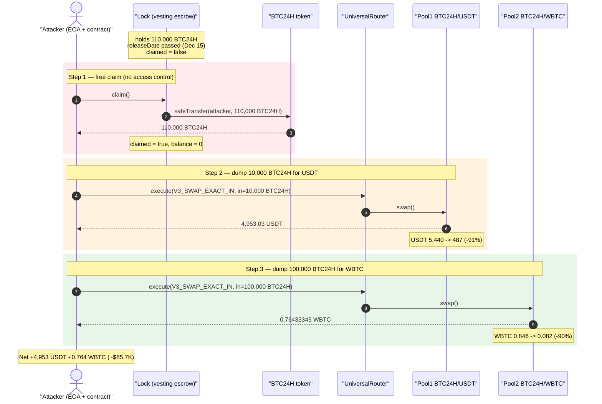
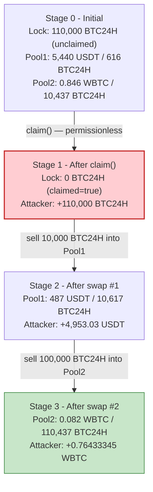
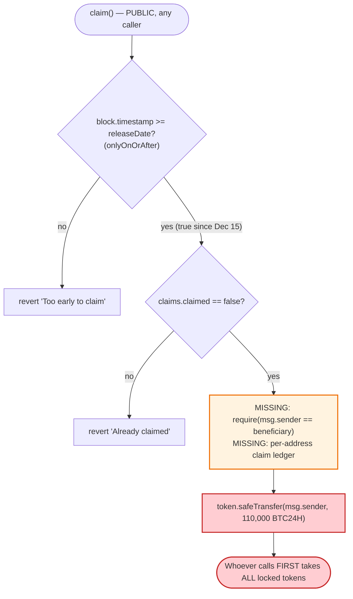

# BTC24H `Lock` Exploit — Access-Control-Free `claim()` Drains a Token Vesting Lock

> **Vulnerability classes:** vuln/access-control/missing-auth · vuln/access-control/missing-modifier

> **Reproduction:** the PoC compiles & runs in an isolated Foundry project at
> [this project folder](.) (the umbrella DeFiHackLabs repo
> bundles many unrelated PoCs that do not whole-compile, so this one was extracted).
> Full verbose trace: [output.txt](output.txt).
> Verified vulnerable source: [contracts_Lock.sol](sources/Lock_968e1c/contracts_Lock.sol).

---

## Key info

| | |
|---|---|
| **Loss** | ~$85.7K — **4,953.03 USDT + 0.76433345 WBTC** drained from two BTC24H Uniswap-V3 pools |
| **Vulnerable contract** | `Lock` — [`0x968e1c984A431F3D0299563F15d48C395f70F719`](https://polygonscan.com/address/0x968e1c984A431F3D0299563F15d48C395f70F719#code) |
| **Drained tokens come from** | the `Lock` vesting contract (110,000 BTC24H); cashed out via the BTC24H/USDT pool [`0xd06cD277CD01A630dcB8C7D678529d8a4111A02A`](https://polygonscan.com/address/0xd06cD277CD01A630dcB8C7D678529d8a4111A02A) and the BTC24H/WBTC pool [`0x495e8f82F3941C1Fd661151E5c794745e1e31027`](https://polygonscan.com/address/0x495e8f82F3941C1Fd661151E5c794745e1e31027) |
| **BTC24H token** | [`0xea4b5C48a664501691B2ECB407938ee92D389a6f`](https://polygonscan.com/address/0xea4b5C48a664501691B2ECB407938ee92D389a6f) (vanilla ERC20, 21M supply, 18 decimals) |
| **Attacker EOA** | [`0xDE0A99Fb39E78eFd3529e31D78434f7645601163`](https://polygonscan.com/address/0xde0a99fb39e78efd3529e31d78434f7645601163) |
| **Attacker contract** | `0x3cb2452c615007b9ef94d5814765eb48b71ae520` (the PoC deploys an equivalent helper at runtime) |
| **Attack tx** | [`0x554c9e4067e3bc0201ba06fc2cfeeacd178d7dd9c69f9b211bc661bb11296fde`](https://polygonscan.com/tx/0x554c9e4067e3bc0201ba06fc2cfeeacd178d7dd9c69f9b211bc661bb11296fde) |
| **Chain / block / date** | Polygon / 65,560,669 / Dec 16, 2024 |
| **Compiler** | Solidity v0.8.28, optimizer **disabled** (200 runs) |
| **Bug class** | Missing access control + missing per-beneficiary accounting on a vesting/lock withdrawal |

---

## TL;DR

`Lock` is a one-shot token-vesting contract that holds **110,000 BTC24H** to be released to a beneficiary on
**Dec 15, 2024 (`releaseDate = 1734220800`)**. The release function is:

```solidity
function claim() external onlyOnOrAfter(claims.releaseDate) {
    require(!claims.claimed, 'Already claimed');
    claims.claimed = true;
    uint256 claimAmount = claims.amount;
    token.safeTransfer(msg.sender, claimAmount);   // ← sends ALL locked tokens to whoever calls
}
```

There is **no `onlyOwner`/beneficiary check** and **no per-address claim mapping** — `claims` is a single global
struct. The only gates are "is it after the release date" (which had passed) and "has it been claimed before"
(it hadn't). So **anyone** who called `claim()` first walked off with the entire 110,000 BTC24H.

The attacker:

1. Calls `Lock.claim()` → receives **110,000 BTC24H** for free.
2. Sells **10,000 BTC24H** into the thin BTC24H/USDT V3 pool → **4,953.03 USDT** (≈ 91% of the pool's USDT).
3. Sells **100,000 BTC24H** into the thin BTC24H/WBTC V3 pool → **0.76433345 WBTC** (≈ 90% of the pool's WBTC).

Net profit ≈ **4,953 USDT + 0.764 WBTC ≈ $85.7K**, the cost being only gas. The remaining ~10,437 BTC24H the
attacker still held had effectively dumped both pools' liquidity, so it was left in the contract.

---

## Background — what `Lock` does

`Lock` ([source](sources/Lock_968e1c/contracts_Lock.sol)) is a minimal single-claim vesting escrow:

- **`deposit()`** ([:35-49](sources/Lock_968e1c/contracts_Lock.sol#L35-L49)) pulls a hard-coded **110,000 ×
  1 ether** of `token` (BTC24H) from the caller into the contract and records a `Claim{ amount: 110000 ether,
  releaseDate: 1734220800, claimed: false }`.
- **`claim()`** ([:51-57](sources/Lock_968e1c/contracts_Lock.sol#L51-L57)) is meant to release that locked amount
  to its rightful owner once the release date passes.
- **`timeUntilClaim()` / `getClaimDetails()`** are view helpers.

The data model is a single struct, `Claim private claims;` ([:18](sources/Lock_968e1c/contracts_Lock.sol#L18)),
intended for one beneficiary. The contract *does* have an `owner` and an `onlyOwner` modifier
([:17,20-23](sources/Lock_968e1c/contracts_Lock.sol#L20-L23)) — but neither is used to guard `claim()`.

On-chain state read at the fork block (via `cast`, block 65,560,668):

| Parameter | Value |
|---|---|
| `token()` | `0xea4b…89a6f` (BTC24H) |
| `owner()` | `0x88538ab036824F5B8B904f3e3c6015D125AA629E` (the depositor — **not** the attacker) |
| `getClaimDetails()` → amount | `110000 ether` (1.1e23) |
| `getClaimDetails()` → releaseDate | `1734220800` = **2024-12-15 00:00 UTC** |
| `getClaimDetails()` → claimed | `false` |
| `Lock` BTC24H balance | **110,000 BTC24H** |

The attack tx landed on **2024-12-16** — one day *after* the release date — so the time gate was already open and
the lock was still unclaimed.

---

## The vulnerable code

### The release function has no caller restriction

[contracts_Lock.sol:51-57](sources/Lock_968e1c/contracts_Lock.sol#L51-L57):

```solidity
function claim() external onlyOnOrAfter(claims.releaseDate) {
    require(!claims.claimed, 'Already claimed');

    claims.claimed = true;
    uint256 claimAmount = claims.amount;
    token.safeTransfer(msg.sender, claimAmount);
}
```

Compare with the modifiers the contract *did* define but **never applied** to `claim()`
([:20-28](sources/Lock_968e1c/contracts_Lock.sol#L20-L28)):

```solidity
modifier onlyOwner() {
    require(msg.sender == owner, 'Not authorized');
    _;
}

modifier onlyOnOrAfter(uint256 date) {
    require(block.timestamp >= date, 'Too early to claim');
    _;
}
```

`claim()` uses only `onlyOnOrAfter` — the time gate — and the one-time `claimed` flag. The destination is
`msg.sender`, blindly. Whoever calls it first receives `claims.amount` in full.

### There is no per-beneficiary accounting

[contracts_Lock.sol:10-18](sources/Lock_968e1c/contracts_Lock.sol#L10-L18):

```solidity
struct Claim {
    uint256 amount;
    uint256 releaseDate;
    bool claimed;
}

IERC20 public token;
address public owner;
Claim private claims;          // ← a single global claim, not mapping(address => Claim)
```

Because `claims` is a single struct (not `mapping(address => Claim)`), the contract cannot even express "this
amount belongs to address X." The release is intrinsically a race to call `claim()`.

---

## Root cause — why it was possible

The contract intends to release pre-deposited tokens to a beneficiary, but:

1. **Missing access control on `claim()`.** No `onlyOwner`, no `require(msg.sender == beneficiary)`, no allowlist.
   The author wrote an `onlyOwner` modifier but forgot to apply it (or to track a beneficiary at all). The funds
   are sent to `msg.sender`, so the "beneficiary" is simply the first caller after the release date.
2. **No per-address claim ledger.** With a single global `Claim`, there is no notion of *who* is owed the tokens.
   Even with an access check, only one identity could ever be the recipient — and that identity was never
   recorded.
3. **The token had no protective transfer logic.** BTC24H is a plain OpenZeppelin ERC20
   ([contracts_BTC24H.sol](sources/BTC24H_ea4b5C/contracts_BTC24H.sol)) — no tax, no transfer restrictions, no
   trading gate — so the freely-claimed tokens were immediately sellable on AMMs.
4. **Thin downstream liquidity made the stolen tokens cashable.** The two Uniswap-V3 pools holding USDT/WBTC
   against BTC24H were tiny (5,440 USDT and 0.846 WBTC respectively), so dumping a fraction of the 110,000 stolen
   BTC24H emptied ~90% of each pool's real-asset side.

The "fix" is one line of access control plus correct beneficiary accounting; everything downstream is just the
attacker monetizing the freely-acquired tokens.

---

## Preconditions

- `block.timestamp >= claims.releaseDate` (1734220800). True from Dec 15, 2024 onward; the attack ran Dec 16.
- `claims.claimed == false` — the legitimate beneficiary had not yet claimed (front-runnable / first-come).
- `Lock` still held the 110,000 BTC24H (it did).
- Liquidity pools to convert BTC24H into real assets (the BTC24H/USDT and BTC24H/WBTC V3 pools).

No flash loan, no capital, no privileged role required — a single permissionless `claim()` followed by two swaps.

---

## Attack walkthrough (with on-chain numbers from the trace)

All figures below are taken directly from the `Transfer` / `Swap` events and storage diffs in
[output.txt](output.txt). The PoC re-deploys an `AttackContract` and runs `start()`
([test/BTC24H_exp.sol:68-87](test/BTC24H_exp.sol#L68-L87)).

| # | Step | Token in | Got out | Pool / state effect |
|---|------|----------|---------|---------------------|
| 0 | **Initial** — attacker holds 1,052.71 USDT + 0.00114574 WBTC | — | — | `Lock` holds 110,000 BTC24H, unclaimed. Pool1 (USDT/BTC24H): 5,440.10 USDT / 616.54 BTC24H. Pool2 (WBTC/BTC24H): 0.84643629 WBTC / 10,437.45 BTC24H. |
| 1 | **`Lock.claim()`** ([:71](test/BTC24H_exp.sol#L71)) | — | **110,000 BTC24H** | `Lock` BTC24H balance 110,000 → 0; `claims.claimed` set to `true` (storage slot 4: `0 → 1`). |
| 2 | **Swap #1** — send 10,000 BTC24H to UniversalRouter, swap into Pool1 ([:72-78](test/BTC24H_exp.sol#L72-L78)) | 10,000 BTC24H | **4,953.025389 USDT** | Pool1 USDT 5,440.10 → 487.08 (**−91.0%**); Pool1 BTC24H 616.54 → 10,616.54. |
| 3 | **Swap #2** — send 100,000 BTC24H to UniversalRouter, swap into Pool2 ([:79-84](test/BTC24H_exp.sol#L79-L84)) | 100,000 BTC24H | **0.76433345 WBTC** | Pool2 WBTC 0.84643629 → 0.08210284 (**−90.3%**); Pool2 BTC24H 10,437.45 → 110,437.45. |
| 4 | **End** | — | — | Attacker holds 6,005.74 USDT + 0.76547919 WBTC. |

Both swaps use the same UniversalRouter `execute(commands=0x00, inputs, deadline)` pattern — `0x00` is the
`V3_SWAP_EXACT_IN` command. The encoded input path for swap #1 is `BTC24H → (0x2710 = 10000 fee) → USDT`, and for
swap #2 `BTC24H → (0x2710 fee) → WBTC`, recipient = the attacker EOA, `amountIn = 10,000e18` and `100,000e18`
respectively, `amountOutMin = 0`.

### Profit accounting

| Asset | Before | After | Gain |
|---|---:|---:|---:|
| USDT (6 dec) | 1,052.711368 | 6,005.736757 | **+4,953.025389** |
| WBTC (8 dec) | 0.00114574 | 0.76547919 | **+0.76433345** |

The USDT gain equals swap #1's output to the wei (`4,953,025,389` / 1e6) and the WBTC gain equals swap #2's
output to the wei (`76,433,345` / 1e8) — i.e., 100% of the realized swap proceeds were net new value to the
attacker, sourced entirely from the freely-claimed BTC24H. Total ≈ **$85.7K** (matching the PoC header).

---

## Diagrams

### Sequence of the attack



### Pool / lock state evolution



### The flaw inside `claim()`



---

## Remediation

1. **Add access control to `claim()`.** Restrict it to the intended beneficiary, e.g. store a `beneficiary`
   address at `deposit()`/construction and `require(msg.sender == beneficiary)`. (The contract already defines an
   `onlyOwner` modifier — applying that, or a dedicated beneficiary check, would have prevented the theft.)
2. **Track claims per address.** Use `mapping(address => Claim)` so the escrow records *who* is owed *what*, and
   release only to that address. A single global `Claim` cannot safely represent an ownership relationship.
3. **Consider a pull-to-named-address pattern.** If `claim()` must be callable by anyone (e.g., a relayer), still
   send funds to the recorded beneficiary, never to `msg.sender`.
4. **Add events and tests for the claim path.** A unit test asserting "a non-beneficiary cannot claim" would have
   caught this immediately; the contract emits no events on claim, making detection harder.
5. **(Defense in depth) Use a timelock + multisig for the deployer/owner** so a misconfiguration is recoverable
   before funds are at risk.

---

## How to reproduce

The PoC was extracted into a standalone Foundry project (the umbrella DeFiHackLabs repo bundles many unrelated
PoCs that fail to compile under a single `forge build`):

```bash
_shared/run_poc.sh 2024-12-BTC24H_exp -vvvvv
```

- RPC: a **Polygon archive** endpoint is required (fork block 65,560,668). `foundry.toml` uses an Infura archive
  endpoint; most public Polygon RPCs prune that depth and fail with `header not found` / `missing trie node`.
- Result: `[PASS] testExploit()`.

Expected tail:

```
[PASS] testExploit() (gas: 892727)
  [Before] USDT: 1052.711368
  [Before] WBTC: 0.00114574
  [After] USDT: 6005.736757
  [After] WBTC: 0.76547919

Suite result: ok. 1 passed; 0 failed; 0 skipped
```

---

*Reference: TenArmor alert — https://x.com/TenArmorAlert/status/1868845296945426760 (BTC24H `Lock`, Polygon, ~$85.7K).*
