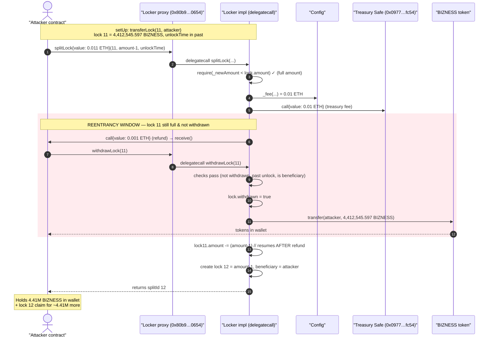
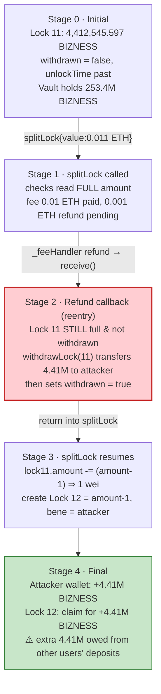
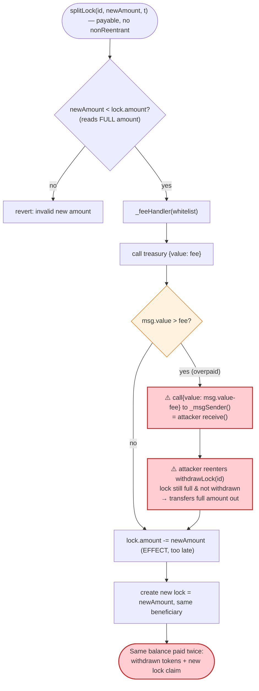

# Bizness Locker Exploit — Reentrancy in `splitLock` Refund Drains Locked Tokens

> **Vulnerability classes:** vuln/reentrancy/single-function

> **Reproduction:** the PoC compiles & runs in an isolated Foundry project at
> [this project folder](.) (the umbrella DeFiHackLabs repo does not whole-compile,
> so this PoC was extracted). Full verbose trace: [output.txt](output.txt).
> Verified vulnerable source: [sources/Locker_D6A7Cf/src_Locker.sol](sources/Locker_D6A7Cf/src_Locker.sol).

---

## Key info

| | |
|---|---|
| **Loss** | ~$15.7k — **4,412,545.597 BIZNESS** double-claimed out of the shared Locker vault |
| **Vulnerable contract** | `Locker` (impl) — [`0xD6A7Cfa86A41b8f40B8DFeb987582A479EB10693`](https://basescan.org/address/0xd6a7cfa86a41b8f40b8dfeb987582a479eb10693#code) — behind ERC1967 proxy [`0x80b9C9C883e376c4aA43d72413aB1Bd6A64A0654`](https://basescan.org/address/0x80b9C9C883e376c4aA43d72413aB1Bd6A64A0654) |
| **Victim / pool** | The Locker vault itself — held **253,392,136 BIZNESS** of many users' locks; the attacker drained one extra lock's worth from this shared pool |
| **BIZNESS token** | [`0xF3a605573B93Fd22496f471A88AE45F35C1df5A7`](https://basescan.org/address/0xF3a605573B93Fd22496f471A88AE45F35C1df5A7) (impl `0xF3c514E04f83166E80718f29f0d34F206be40A0A`) |
| **Attacker EOA** | [`0x3cc1edd8a25c912fcb51d7e61893e737c48cd98d`](https://basescan.org/address/0x3cc1edd8a25c912fcb51d7e61893e737c48cd98d) |
| **Attacker contract** | [`0x0F30AE8f41a5d3Cc96abd07Adf1550A9A0E557b5`](https://basescan.org/address/0x0f30ae8f41a5d3cc96abd07adf1550a9a0e557b5) |
| **Attack tx** | [`0x984cb29cdb4e92e5899e9c94768f8a34047d0e1074f9c4109364e3682e488873`](https://basescan.org/tx/0x984cb29cdb4e92e5899e9c94768f8a34047d0e1074f9c4109364e3682e488873) |
| **Chain / block / date** | Base / 24,282,214 (forked at 24,282,213) / Dec 28, 2024 |
| **Compiler** | Solidity v0.8.26, optimizer **1 run** |
| **Bug class** | Reentrancy via ETH-refund callback — checks-effects-interactions violation in `splitLock` |

---

## TL;DR

The Bizness `Locker` lets anyone lock ERC20/NFT tokens until an `unlockTime`. `splitLock` is supposed to
carve a portion of an existing lock into a new lock. But `splitLock` charges a flat ETH fee through
`_feeHandler`, and `_feeHandler` **refunds any overpaid ETH to the caller with a raw `.call`** *before*
`splitLock` has updated the original lock's `amount`
([src_Locker.sol:118-119](sources/Locker_D6A7Cf/src_Locker.sol#L118-L119),
[:158-160](sources/Locker_D6A7Cf/src_Locker.sol#L158-L160)). The Locker has **no reentrancy guard**.

The attacker:

1. Owns an already-unlocked lock (id 11) holding **4,412,545.597 BIZNESS** (the PoC seeds this by
   `transferLock`-ing the live lock to the attack contract).
2. Calls `splitLock(11, amount-1, unlockTime)` and **overpays the 0.01 ETH fee by 0.001 ETH**.
3. `_feeHandler` pays 0.01 ETH to the treasury, then refunds 0.001 ETH back to the attacker — invoking
   the attacker's `receive()`.
4. Inside `receive()`, while lock 11 still shows its **full** `amount` and `withdrawn == false`, the
   attacker reenters **`withdrawLock(11)`**, which passes all checks (lock already past `unlockTime`,
   caller is beneficiary) and **transfers the full 4,412,545.597 BIZNESS** out to the attacker, then
   marks lock 11 withdrawn.
5. The refund call returns and `splitLock` resumes at the line it was paused on:
   `_lock.amount -= _newAmount`, then it **creates a brand-new lock (id 12)** crediting the attacker
   with `amount-1` BIZNESS.

Net result: the attacker received `amount` BIZNESS in hand **and** still holds a fresh lock (id 12) for
another `amount-1` BIZNESS — a claim backed by the deposits of every other user in the shared Locker.
The duplicated value is ~4.41M BIZNESS (~$15.7k).

---

## Background — what the Locker does

The Bizness `Locker` ([source](sources/Locker_D6A7Cf/src_Locker.sol)) is a UUPS-upgradeable token/NFT
time-lock vault shared by all users. Each lock is a struct
([src_Locker.sol:17-24](sources/Locker_D6A7Cf/src_Locker.sol#L17-L24)):

```solidity
struct Lock {
    address token;
    uint256 tokenId;     // 0 for ERC20
    address beneficiary;
    uint256 amount;      // 0 for NFT
    uint256 unlockTime;
    bool withdrawn;
}
mapping (uint256 => Lock) public locks;
```

Operations: `createLock`, `withdrawLock` (after `unlockTime`), `extendLock`, `transferLock`,
`splitLock`, `collectLPFees`. Every mutating call charges a flat ETH fee read from a separate `Config`
contract, handled by `_feeHandler`.

On-chain facts at the fork block (read with `cast`):

| Parameter | Value |
|---|---|
| Locker BIZNESS balance (all users' locks) | **253,392,136.597 BIZNESS** |
| Lock 11 `amount` (attacker's lock) | **4,412,545.597397598114138189 BIZNESS** |
| Lock 11 `unlockTime` | 1735353747 (Dec 28 2024 02:42:27 UTC) |
| Block 24,282,213 `timestamp` | 1735353773 (Dec 28 2024 02:42:53 UTC) — **lock already unlocked** |
| Locker `paused()` | false |
| Locker `lockId` counter | 12 (next id) |
| Config locker fee (`fees()` second slot) | **0.01 ETH** |
| Config `hodl` threshold | 1,000,000 BIZNESS |
| BIZNESS token decimals / total supply | 18 / 1,000,000,000 BIZNESS |

The two facts that matter: the lock was **already past its `unlockTime`** (so `withdrawLock` would
succeed at any time), and `splitLock` issues an **ETH refund callback before it finalizes the original
lock's accounting**.

---

## The vulnerable code

### 1. `splitLock` — fee handling (interaction) happens before state update (effect)

[src_Locker.sol:109-131](sources/Locker_D6A7Cf/src_Locker.sol#L109-L131):

```solidity
function splitLock(uint256 _id, uint256 _newAmount, uint256 _newUnlockTime)
    external payable whenNotPaused returns (uint256 _splitId)
{
    Lock storage _lock = locks[_id];
    require(!_lock.withdrawn, "Locker: lock already withdrawn");
    require(_newUnlockTime >= _lock.unlockTime, "...");
    require(_newAmount > 0 && _newAmount < _lock.amount, "Locker: invalid new amount"); // ← checks FULL amount
    require(!_isNFT(_lock.token), "...");
    address[] memory _whitelist = new address[](2);
    _whitelist[0] = _lock.token;
    _whitelist[1] = _lock.beneficiary;
    _feeHandler(_whitelist);          // ⚠️ INTERACTION: refunds excess ETH → attacker receive()
    _lock.amount -= _newAmount;       // ⚠️ EFFECT happens AFTER the external call
    _splitId = lockId;
    ++lockId;
    locks[_splitId] = Lock({          // ← brand-new lock crediting beneficiary _newAmount
        token: _lock.token, tokenId: 0, beneficiary: _lock.beneficiary,
        amount: _newAmount, unlockTime: _newUnlockTime, withdrawn: false
    });
    emit LockSplit(_id, _splitId);
}
```

### 2. `_feeHandler` — refund via raw `.call` to the caller

[src_Locker.sol:152-162](sources/Locker_D6A7Cf/src_Locker.sol#L152-L162):

```solidity
function _feeHandler(address[] memory _whitelist) internal {
    uint256 _f = _fee(_whitelist);
    if (_f > 0) {
        (bool _success, ) = config.treasury().call{value: _f}("");
        require(_success, "Locker: fee transfer failed");
    }
    if (msg.value > _f) {
        (bool _success, ) = payable(_msgSender()).call{value: msg.value - _f}(""); // ⚠️ reentrancy entry
        require(_success, "Locker: refund failed");
    }
}
```

### 3. `withdrawLock` — itself CEI-safe, but operates on lock 11 whose state `splitLock` hasn't touched

[src_Locker.sol:76-88](sources/Locker_D6A7Cf/src_Locker.sol#L76-L88):

```solidity
function withdrawLock(uint256 _id) external whenNotPaused {
    Lock storage _lock = locks[_id];
    require(!_lock.withdrawn, "Locker: lock already withdrawn");      // ← still false during reentry
    require(block.timestamp >= _lock.unlockTime, "Locker: lock not yet unlocked"); // ← past unlock ✓
    require(_msgSender() == _lock.beneficiary, "Locker: not the beneficiary");     // ← attacker is bene ✓
    _lock.withdrawn = true;                                          // CEI here, but on lock 11 only
    if (_isNFT(_lock.token)) { ... } else {
        IERC20(_lock.token).safeTransfer(_lock.beneficiary, _lock.amount); // ⚠️ sends FULL 4.41M BIZNESS
    }
    emit LockWithdrawn(_id);
}
```

There is **no `ReentrancyGuard`** anywhere in `Locker`, `Configurable`, or `Recoverable` (grep confirms
zero `nonReentrant` usages). `withdrawLock` locally follows checks-effects-interactions, but that does
not help: `splitLock` re-enters with the original lock’s `withdrawn`/`amount` still pristine, so the
guard inside `withdrawLock` never sees a conflicting state.

---

## Root cause — why it was possible

`splitLock` is meant to be an internal book-keeping operation: shrink lock A by `X`, create lock B
holding `X`. Total locked tokens are conserved, so the protocol never needs to move any ERC20 during a
split.

But `splitLock` charges an ETH fee, and the fee handler **refunds the caller's overpayment via a raw
external call** *before* it has decremented the source lock's `amount`. That external call is fully
attacker-controlled (it lands in the attacker's `receive()`), and the Locker has no reentrancy guard.

Three design decisions compose into the bug:

1. **Interaction-before-effect (CEI violation).** `_feeHandler(...)` is called on
   [line 118](sources/Locker_D6A7Cf/src_Locker.sol#L118), but the lock-shrinking effect
   `_lock.amount -= _newAmount` only happens on
   [line 119](sources/Locker_D6A7Cf/src_Locker.sol#L119). During the gap, lock 11 still reports its
   full `amount` and `withdrawn == false`.
2. **The refund goes to `_msgSender()`** — an arbitrary contract — via `.call`
   ([line 159](sources/Locker_D6A7Cf/src_Locker.sol#L159)). Any overpayment, even 1 wei above the fee,
   hands control to the attacker mid-operation.
3. **No reentrancy guard** protects `splitLock`/`withdrawLock` cross-function, so the reentrant
   `withdrawLock(11)` is fully serviceable: it withdraws the entire 4.41M BIZNESS and only then marks
   lock 11 as withdrawn.

The consequence: the same locked balance is paid out **twice** — once to the attacker's wallet (via the
reentrant `withdrawLock`), and once as a freshly minted lock entitlement (lock 12). Because the Locker is
a **shared vault** holding 253M BIZNESS of other users' deposits, that second claim is collateralized by
everyone else's funds. When the attacker later withdraws lock 12, the deficit falls on the other lockers.

---

## Preconditions

- The attacker controls a lock whose `beneficiary` is the attacker contract and whose `unlockTime` is in
  the past (so the reentrant `withdrawLock` passes its time check). In the live attack the attacker's
  lock 11 was already mature; the PoC mirrors this by `transferLock`-ing the on-chain lock 11 to the
  attack contract in `setUp()` ([test/Bizness_exp.sol:34-41](test/Bizness_exp.sol#L34-L41)).
- `splitLock`'s caller is not fee-exempt — i.e. not whitelisted and holding `< hodl` (1M) BIZNESS — so a
  fee is charged and, more importantly, an **overpayment refund** is triggered. The attacker overpays by
  0.001 ETH to guarantee the refund callback fires.
- The Locker is not paused (it was not).
- A tiny amount of ETH for the fee + overpayment (0.011 ETH total). No flash loan needed — the value
  drained is in BIZNESS tokens, not the caller's own capital.

---

## Attack walkthrough (with on-chain numbers from the trace)

All figures are taken directly from [output.txt](output.txt). The vulnerable contract is reached through
the ERC1967 proxy `0x80b9…0654` (delegatecall into impl `0xD6A7…0693`).

| # | Step | Call | Concrete numbers | State of lock 11 |
|---|------|------|------------------|------------------|
| 0 | **Seed** | `transferLock(11, attacker)` (in `setUp`) | lock 11 beneficiary → attacker | amount 4,412,545.597…189; withdrawn=false; unlockTime past |
| 1 | **Read** | `locks(11)` | `amount = 4412545597397598114138189` | unchanged |
| 2 | **Split** | `splitLock{value: 0.011 ETH}(11, amount-1, 1735353747)` | `_newAmount = 4412545597397598114138188` | passes `_newAmount < _lock.amount` ✓ |
| 3 | **Fee** | `_feeHandler`: pay treasury `0.01 ETH` → Gnosis Safe `0x0977…fc54` | `_f = 10000000000000000` | unchanged |
| 4 | **Refund (reentry)** | `_feeHandler` refunds `msg.value - _f = 0.001 ETH` to attacker `receive()` | `1000000000000000` wei | **still full, not withdrawn** |
| 5 | **Reenter** | inside `receive()` → `withdrawLock(11)` | `safeTransfer(attacker, 4412545597397598114138189)` | now `withdrawn = true`, but tokens already sent |
| 6 | **Resume** | back in `splitLock`: `_lock.amount -= _newAmount`; create lock 12 | lock 12 `amount = 4412545597397598114138188`, beneficiary = attacker | lock 11 amount → 1 |
| 7 | **Result** | attacker balance | **4,412,545.597397598114138189 BIZNESS** in wallet **+** lock 12 worth 4,412,545.597…188 | — |

Trace evidence of the nested reentry (indentation shows `splitLock` → refund → `receive` →
`withdrawLock` all inside the **same** outer call):

```
splitLock{value: 11000000000000000}(11, 4412545597397598114138188, 1735353747)
├─ 0x0977…fc54::fallback{value: 10000000000000000}()        // treasury fee
├─ Bizness::receive{value: 1000000000000000}()              // refund → attacker
│  ├─ console::log("received 0.001 ether", 1000000000000000)
│  └─ withdrawLock(11)                                      // ⚠️ REENTRY
│     └─ BIZNESS::transfer(attacker, 4412545597397598114138189) // full lock out
│        └─ emit LockWithdrawn(11)
└─ emit LockSplit(11, 12)                                   // new lock created afterwards
```

Logged balances ([output.txt](output.txt) Logs section):

```
Attacker Before exploit BIZNESS Balance: 0.000000000000000000
lockBefore.amount  4412545597397598114138189
received 0.001 ether 1000000000000000
lockAfter.amount  4412545597397598114138188
Attacker After exploit BIZNESS Balance: 4412545.597397598114138189
```

### Profit / loss accounting

| Item | Amount |
|---|---:|
| ETH fee paid to treasury | 0.01 ETH |
| ETH refund returned to attacker | 0.001 ETH |
| Net ETH cost | ~0.01 ETH (+ gas) |
| **BIZNESS withdrawn to attacker wallet** | **+4,412,545.597397598114138189** |
| **BIZNESS held in new lock 12 (still claimable)** | **+4,412,545.597397598114138188** |
| BIZNESS in original lock 11 after attack | 1 wei (drained, withdrawn) |
| **Value double-claimed from the shared vault** | **≈ 4,412,545.597 BIZNESS ≈ $15.7k** |

The legitimate position was one lock of ~4.41M BIZNESS. After the attack the attacker holds that amount
**in hand** *and* an equivalent lock entitlement — the extra ~4.41M is taken from the 253M BIZNESS of
other users pooled in the Locker.

---

## Diagrams

### Sequence of the attack



### Lock-state evolution (the double-claim)



### The flaw inside `splitLock` / `_feeHandler`



---

## Remediation

1. **Apply checks-effects-interactions in `splitLock`.** Update `_lock.amount -= _newAmount` and create
   the split lock **before** calling `_feeHandler`. Then a reentrant `withdrawLock` sees the already-
   reduced source amount and cannot double-spend.
2. **Add a `ReentrancyGuard`.** Mark every payable / token-moving entry point (`createLock`,
   `withdrawLock`, `splitLock`, `collectLPFees`) `nonReentrant`. OpenZeppelin's
   `ReentrancyGuardUpgradeable` is already in the dependency tree and would have blocked the cross-
   function reentry outright.
3. **Avoid pushing ETH refunds to arbitrary callers mid-operation.** Prefer a pull pattern (credit the
   overpayment to a withdrawable balance) or require exact payment (`require(msg.value == _f)`), removing
   the attacker-controlled callback entirely.
4. **Treat shared-vault accounting as an invariant.** A split must conserve total locked tokens; add an
   assertion that the sum of resulting locks equals the original and that no tokens leave the vault during
   a split.

---

## How to reproduce

The PoC was extracted into a standalone Foundry project (the umbrella DeFiHackLabs repo has several
unrelated PoCs that fail to compile under a whole-project `forge build`):

```bash
_shared/run_poc.sh 2024-12-Bizness_exp -vvvvv
```

- RPC: a **Base archive** endpoint is required (fork block 24,282,213). `foundry.toml` uses the project's
  configured Base Infura archive endpoint.
- Result: `[PASS] testExploit()` with the attacker ending at **4,412,545.597 BIZNESS** from a starting
  balance of 0.

Expected tail:

```
Ran 1 test for test/Bizness_exp.sol:Bizness
[PASS] testExploit() (gas: 308126)
Logs:
  hello
  Attacker Before exploit BIZNESS Balance: 0.000000000000000000
  lockBefore.amount  4412545597397598114138189
  received 0.001 ether 1000000000000000
  lockAfter.amount  4412545597397598114138188
  Attacker After exploit BIZNESS Balance: 4412545.597397598114138189

Suite result: ok. 1 passed; 0 failed; 0 skipped
```

---

*References: PoC header — Total Lost ~$15.7k; TenArmor alert
https://x.com/TenArmorAlert/status/1872857132363645205 ; verified vulnerable source on BaseScan.*
