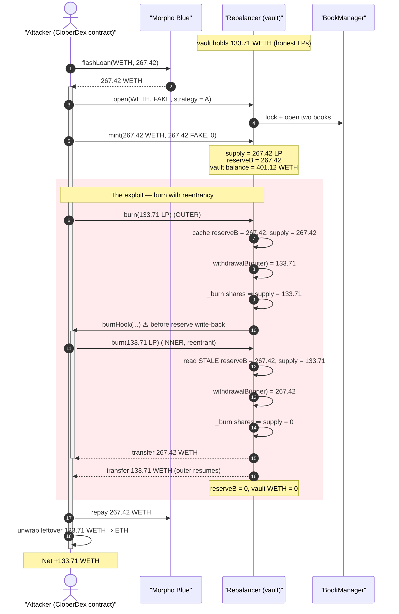
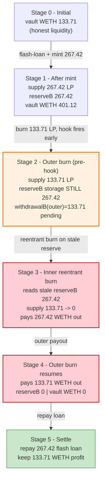
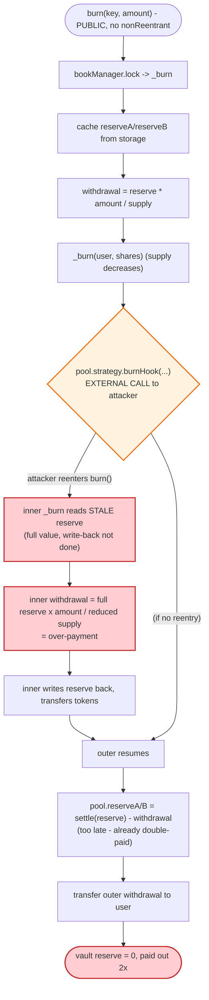

# Clober DEX Exploit — `Rebalancer._burn` Reentrancy via Attacker-Controlled `burnHook`

> **Vulnerability classes:** vuln/reentrancy/single-function · vuln/logic/incorrect-order-of-operations

> **Reproduction:** the PoC compiles & runs in an isolated Foundry project at
> [this project folder](.) (the umbrella DeFiHackLabs repo
> contains many unrelated PoCs that do not whole-compile, so this one was extracted).
> Full verbose trace: [output.txt](output.txt).
> Verified vulnerable source: [src_Rebalancer.sol](sources/Rebalancer_6A0b87/src_Rebalancer.sol).

---

## Key info

| | |
|---|---|
| **Loss** | ~$501K — **133.71 WETH** drained from the Clober `Rebalancer` vault |
| **Vulnerable contract** | `Rebalancer` — [`0x6A0b87D6b74F7D5C92722F6a11714DBeDa9F3895`](https://basescan.org/address/0x6A0b87D6b74F7D5C92722F6a11714DBeDa9F3895#code) |
| **Victim pool** | The single WETH/quote pool whose entire `reserveB` (133.71 WETH) sat in the Rebalancer |
| **Attacker EOA** | [`0x012Fc6377F1c5CCF6e29967Bce52e3629AaA6025`](https://basescan.org/address/0x012Fc6377F1c5CCF6e29967Bce52e3629AaA6025) |
| **Attacker contract** | [`0x32Fb1BedD95BF78ca2c6943aE5AEaEAAFc0d97C1`](https://basescan.org/address/0x32Fb1BedD95BF78ca2c6943aE5AEaEAAFc0d97C1) |
| **Flash-loan source** | Morpho Blue — `0xBBBBBbbBBb9cC5e90e3b3Af64bdAF62C37EEFFCb` |
| **Attack tx** | [`0x8fcdfcded45100437ff94801090355f2f689941dca75de9a702e01670f361c04`](https://basescan.org/tx/0x8fcdfcded45100437ff94801090355f2f689941dca75de9a702e01670f361c04) |
| **Chain / block / date** | Base / 23,514,451 / Dec 10, 2024 |
| **Compiler** | Solidity v0.8.25, optimizer **1000 runs** |
| **Bug class** | Reentrancy — stale cached reserves; external hook to a fully attacker-controlled `strategy` fires before pool state is written back |

---

## TL;DR

Clober's `Rebalancer` is an LP-vault that wraps two Clober order-books. When you `burn()` your LP
shares it computes your payout from the pool reserves, burns your shares, **calls
`pool.strategy.burnHook(...)`, and only *afterwards* writes the decremented reserves back to storage**
([src_Rebalancer.sol:259-291](sources/Rebalancer_6A0b87/src_Rebalancer.sol#L259-L291)).

The `strategy` is an arbitrary address the *caller* supplies when opening a pool via `open(...)`
([:104-116](sources/Rebalancer_6A0b87/src_Rebalancer.sol#L104-L116)). There is no allow-list, no
`nonReentrant`, and the hook is invoked *before* the reserve write-back. So the attacker opens a pool
with `strategy = own contract`, and re-enters `burn()` from inside `burnHook` while
`pool.reserveA/reserveB` still hold the *pre-burn* (full) values.

Both the outer burn and the re-entrant inner burn therefore divide their withdrawal against the
**same un-decremented reserve**, so the vault pays out far more than the shares are worth.

The attacker:

1. **Flash-loans** `2 × rebalancerWETH = 267.42 WETH` from Morpho Blue, plus deploys a worthless
   `FakeToken` (free supply).
2. **Opens** a fresh WETH ⇄ FakeToken pool with `strategy = attacker contract`.
3. **Mints** LP with `267.42 WETH + 267.42 FAKE`, receiving `267.42` LP shares. The vault now holds
   its original `133.71 WETH` **plus** the deposited `267.42 WETH` = `401.12 WETH`.
4. **Burns** `133.71` LP. The reentrancy makes the vault pay `267.42 WETH` to the *inner* burn and
   `133.71 WETH` to the *outer* burn = **401.12 WETH total** — emptying it.
5. **Repays** the `267.42 WETH` flash loan and unwraps the leftover `133.71 WETH` to ETH.

Net result: the attacker walks off with the Rebalancer's entire `133.71 WETH` of honest liquidity,
having returned exactly the flash-loaned principal.

---

## Background — what the Rebalancer does

`Rebalancer` ([source](sources/Rebalancer_6A0b87/src_Rebalancer.sol)) is an automated market-making
vault on top of Clober's `BookManager` (a central-limit-order-book engine,
[`0x382CCccbD3b142D7DA063bF68cd0c89634767F76`](https://basescan.org/address/0x382CCccbD3b142D7DA063bF68cd0c89634767F76)).
It is an `ERC6909` multi-token where each pool's LP position is one token id (`uint256(key)`).

A pool is a *pair* of opposite order-books (`bookKeyA` = base→quote, `bookKeyB` = quote→base). The
vault tracks two reserves per pool, `reserveA` (the A-book quote currency) and `reserveB` (the
A-book base currency), inside its `Pool` struct
([IRebalancer:13-18](sources/Rebalancer_6A0b87/src_interfaces_IRebalancer.sol#L13-L18)):

```solidity
struct Pool {
    BookId bookIdA;
    BookId bookIdB;
    IStrategy strategy;   // ← caller-supplied at open()
    uint256 reserveA;
    uint256 reserveB;
    ...
}
```

Every state-mutating action delegates to a `strategy` contract through hooks (`mintHook`,
`burnHook`, `rebalanceHook`, `computeOrders`) so external "strategy" logic can react to pool changes
([IStrategy:30-39](sources/Rebalancer_6A0b87/src_interfaces_IStrategy.sol#L30-L39)).

The on-chain facts at the fork block (read from the trace):

| Fact | Value |
|---|---|
| Rebalancer WETH balance (the prize) | **133.707875556674808577 WETH** |
| Flash-loan size (`rebalancerWETH × 2`) | 267.415751113349617154 WETH |
| LP shares minted by attacker | 267.415751113349617154 |
| FakeToken supply minted for free | 1000 FAKE (only ~267 used) |

The entire game is that `strategy` is **not trusted** yet is called mid-state-update.

---

## The vulnerable code

### 1. `open()` lets the caller pick the `strategy` — no validation beyond non-zero

```solidity
function open(
    IBookManager.BookKey calldata bookKeyA,
    IBookManager.BookKey calldata bookKeyB,
    bytes32 salt,
    address strategy            // ← attacker passes its own contract
) external returns (bytes32 key) { ... }
```
([src_Rebalancer.sol:104-116](sources/Rebalancer_6A0b87/src_Rebalancer.sol#L104-L116))

`_open` only checks `strategy != address(0)`
([:240](sources/Rebalancer_6A0b87/src_Rebalancer.sol#L240)) and that the pool isn't already open.
There is no registry, no owner-gating: **anyone can register an arbitrary contract as the strategy
for a pool they create.**

### 2. `_burn()` — payout math runs, then the *untrusted* hook fires, then reserves are written

```solidity
function _burn(bytes32 key, address user, uint256 burnAmount)
    public
    selfOnly
    returns (uint256 withdrawalA, uint256 withdrawalB)
{
    Pool storage pool = _pools[key];
    uint256 supply = totalSupply[uint256(key)];

    (uint256 canceledAmountA, uint256 canceledAmountB, uint256 claimedAmountA, uint256 claimedAmountB) =
        _clearPool(key, pool, burnAmount, supply);

    uint256 reserveA = pool.reserveA;                 // ← (1) cache CURRENT reserves
    uint256 reserveB = pool.reserveB;

    withdrawalA = (reserveA + claimedAmountA) * burnAmount / supply + canceledAmountA;  // ← (2) payout from cache
    withdrawalB = (reserveB + claimedAmountB) * burnAmount / supply + canceledAmountB;

    _burn(user, uint256(key), burnAmount);            // ← (3) shares destroyed (supply decreases)
    pool.strategy.burnHook(msg.sender, key, burnAmount, supply);  // ⚠️ (4) EXTERNAL CALL to attacker BEFORE reserve write-back
    emit Burn(user, key, withdrawalA, withdrawalB, burnAmount);

    IBookManager.BookKey memory bookKeyA = bookManager.getBookKey(pool.bookIdA);

    pool.reserveA = _settleCurrency(bookKeyA.quote, reserveA) - withdrawalA;   // ← (5) reserves finally updated
    pool.reserveB = _settleCurrency(bookKeyA.base, reserveB) - withdrawalB;

    if (withdrawalA > 0) { bookKeyA.quote.transfer(user, withdrawalA); }       // ← (6) tokens sent
    if (withdrawalB > 0) { bookKeyA.base.transfer(user, withdrawalB); }
}
```
([src_Rebalancer.sol:259-291](sources/Rebalancer_6A0b87/src_Rebalancer.sol#L259-L291))

The fatal ordering is **(4) before (5)**: `pool.reserveB` in storage is still the *full* pre-burn
value when the attacker re-enters `burn()` from inside `burnHook`. `burn()` itself has no
`nonReentrant` guard ([:200-209](sources/Rebalancer_6A0b87/src_Rebalancer.sol#L200-L209)) — it only
goes through `bookManager.lock`, which is re-entered cleanly here.

---

## Root cause — why it was possible

The reserves are read into local variables at the top of `_burn`, used to compute the payout, and
written back to storage **only after** an external call to a contract the attacker fully controls.
Three design decisions compose into a critical, fully self-funding theft:

1. **Untrusted external hook mid-update.** `pool.strategy.burnHook(...)` is an external call to a
   caller-chosen address, placed *between* the share-burn and the reserve write-back. This is the
   textbook reentrancy "interaction before effect" — the storage `reserveA/reserveB` are still stale
   (full) when control returns to the attacker.
2. **No reentrancy guard.** `burn()` / `_burn()` carry no `nonReentrant` modifier; the only
   serialization is `bookManager.lock`, which happily re-acquires for a nested `burn`.
3. **Permissionless `strategy`.** `open()` accepts any non-zero `strategy`, so the attacker is the
   strategy. There is no expectation that `burnHook` is benign.

The arithmetic of the theft:

- Outer `burn(133.71 LP)`: `supply = 267.42`, cached `reserveB = 267.42` (133.71 original + 267.42
  deposited... actually the *vault balance* is 401.12, but `reserveB` accounting tracks the
  attacker's deposit of 267.42 plus the pre-existing reserve; see numbers below). `withdrawalB =
  reserveB × 133.71 / 267.42 = 133.71 WETH`. Shares burned → `supply = 133.71`.
- **Re-entrant** `burn(133.71 LP)` from `burnHook`: `supply = 133.71`, but `pool.reserveB` storage is
  **still the stale full value** (the outer call's write-back at line 282-283 hasn't run).
  `withdrawalB = reserveB × 133.71 / 133.71 = 267.42 WETH` — the *entire* cached reserve for half the
  shares. Shares burned → `supply = 0`. The inner call writes the reserve back first.
- Total paid out: `267.42 + 133.71 = 401.12 WETH`, exactly the vault's whole balance. The attacker
  deposited only `267.42 WETH`, so the surplus `133.71 WETH` is pure profit = the vault's original
  honest liquidity.

In short: the second (inner) burn is valued as if no shares had been burned and no reserve removed,
because the outer burn's effect on storage hadn't landed yet.

---

## Preconditions

- A Rebalancer pool whose reserve the attacker wants to drain holds real value (here `133.71 WETH`).
- `open()` is callable by anyone with an arbitrary `strategy` → attacker controls `burnHook`.
  ([:104-116](sources/Rebalancer_6A0b87/src_Rebalancer.sol#L104-L116))
- Working capital to mint LP at a ratio that dominates the pool — supplied by a **Morpho Blue flash
  loan** (`2× rebalancerWETH`), fully repaid intra-transaction, so the attack costs only gas.
- The quote token can be a **worthless attacker-minted token** (the `FakeToken` here), since the
  attacker controls both sides of the freshly-opened pool; only the WETH side carries value.

---

## Attack walkthrough (with on-chain numbers from the trace)

All figures are taken directly from [output.txt](output.txt) (events + storage diffs). `reserveB` is
the WETH side of the pool.

| # | Step | Trace ref | WETH movement | Effect |
|---|------|-----------|--------------:|--------|
| 0 | **Initial** — Rebalancer holds the honest liquidity | [L1596](output.txt#L1596) | 133.71 in vault | The prize. |
| 1 | **Flash-loan** `267.42 WETH` from Morpho Blue → attacker | [L1599-1607](output.txt#L1599) | +267.42 to attacker | Working capital. |
| 2 | **`open()`** WETH⇄FAKE pool, `strategy = attacker` | [L1608-1648](output.txt#L1608) | — | Attacker now owns `burnHook`. |
| 3 | **`mint(267.42 WETH, 267.42 FAKE)`** → `267.42` LP | [L1659-1696](output.txt#L1659) | −267.42 attacker / vault now **401.12** | `supply = 267.42`, `reserveB = 267.42`. |
| 4 | **`burn(133.71 LP)`** (outer) — caches `reserveB=267.42`, burns shares → `supply=133.71`, fires `burnHook` | [L1697-1712](output.txt#L1697) | (pending) | Reserve write-back **deferred** past the hook. |
| 5 | **Re-entrant `burn(133.71 LP)`** from `burnHook` — reads stale `reserveB=267.42`, `supply=133.71` ⇒ `withdrawalB = 267.42 WETH`; burns shares → `supply=0` | [L1713-1764](output.txt#L1713) | **−267.42 → attacker** | The over-payment. |
| 6 | Outer burn resumes: `withdrawalB = 133.71 WETH` transferred | [L1786-1799](output.txt#L1786) | **−133.71 → attacker** | Vault `reserveB → 0`. |
| 7 | **Repay** Morpho `267.42 WETH`; unwrap & send `133.71 WETH`→ETH to attacker | [L1803-1834](output.txt#L1803) | net **+133.71** kept | Vault WETH balance = **0**. |

Final reads: Exploit-contract WETH after = `133.71` ([L1817-1819](output.txt#L1817)); Rebalancer WETH
after = `0` ([L1820-1822](output.txt#L1822)).

### Profit accounting (WETH)

| Direction | Amount |
|---|---:|
| Flash-loan borrowed | 267.415751 |
| Deposited into vault via `mint` | −267.415751 |
| Received — re-entrant (inner) burn | +267.415751 |
| Received — outer burn | +133.707876 |
| Flash-loan repaid | −267.415751 |
| **Net profit (the vault's original liquidity)** | **+133.707876** |

The profit equals the Rebalancer's starting `133.707875556674808577 WETH` to the wei — the attacker
simply walked off with all the honest liquidity, recovering 100% of the flash-loaned capital.

---

## Diagrams

### Sequence of the attack



### Pool state evolution



### The flaw inside `_burn`



---

## Why each magic number

- **Flash-loan = `rebalancerWETH × 2` = 267.42 WETH:** sized so that the attacker's `mint` dominates
  the pool and the cached `reserveB` (267.42) is exactly `2×` the burn amount (133.71). With
  `supply = 267.42` and two burns of `133.71` each, the inner burn (on a halved `supply` but full
  `reserveB`) pays out `267.42`, and the outer pays `133.71` — together draining the `401.12` vault to
  zero while leaving the attacker the original `133.71` after repayment.
- **`FakeToken`:** the quote side of the freshly-opened pool has no real value, so the attacker mints
  it for free; only the WETH side is ever the target. `transfer()` on the fake token is a no-op stub.
- **`reEntry` boolean guard in the PoC's `burnHook`:** ensures exactly *one* level of reentrancy.
  A second reentrant burn would find `supply = 0` and revert on the division, so the attack reenters
  precisely once.
- **`makerPolicy / takerPolicy` fee values (8888608 / 8888708):** arbitrary valid `FeePolicy`
  encodings to open the books; they do not affect the drain because the attacker controls both books
  and never trades through them.

---

## Remediation

1. **Apply checks-effects-interactions.** Write the decremented `pool.reserveA/reserveB` to storage
   **before** calling `pool.strategy.burnHook(...)` (and `mintHook`). The external hook must never
   observe stale reserves. Likewise move token transfers after all state is settled.
2. **Add a reentrancy guard.** Mark `mint`, `burn`, and `rebalance` (and the `lockAcquired`-dispatched
   internals) `nonReentrant`. The `bookManager.lock` re-acquisition is not a substitute for a guard on
   the vault's own accounting.
3. **Do not call out to an untrusted, caller-chosen `strategy` during a state mutation.** Either
   restrict `strategy` to an allow-list / owner-approved set, or treat strategy hooks as fully
   adversarial and never invoke them while invariants (reserve ↔ share accounting) are temporarily
   broken.
4. **Snapshot-and-validate.** After the hook returns, re-read reserves/supply and assert they match
   the values the payout was computed against; revert on any mismatch caused by reentrancy.

---

## How to reproduce

The PoC was extracted into a standalone Foundry project (the umbrella DeFiHackLabs repo has many
unrelated PoCs that fail to compile under a whole-project `forge build`):

```bash
_shared/run_poc.sh 2024-12-CloberDEX_exp --match-test testExploit -vvvvv
```

- RPC: a **Base archive** endpoint is required (fork block 23,514,450). `foundry.toml` uses an Infura
  Base archive endpoint; `evm_version = 'cancun'` (the PoC notes this requirement).
- Result: `[PASS] testExploit()` with the attacker ending up holding `133.71 WETH` and the Rebalancer
  drained to `0`.

Expected tail:

```
  Rebalancer WETH Balance Before exploit:: 133.707875556674808577
  --- Flash Loan and Exploit ---
  Exploit Contract WETH Balance After exploit:: 133
  Rebalancer WETH Balance After exploit:: 0.000000000000000000
  --- Withdrawn WETH to ETH ---
  Attacker ETH Balance After exploit:: 134

Suite result: ok. 1 passed; 0 failed; 0 skipped
```

---

*References: CertiK incident analysis — https://www.certik.com/resources/blog/clober-dex-incident-analysis ·
PeckShield — https://x.com/peckshield/status/1866443215186088048 ·
SolidityScan — https://blog.solidityscan.com/cloberdex-liquidity-vault-hack-analysis-f22eb960aa6f
(Clober DEX, Base, ~$501K).*
