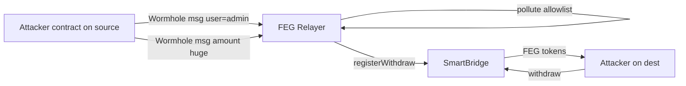

# FEG SmartBridge — Wormhole relayer allowlist pollution → forged withdraw

> **Vulnerability classes:** vuln/bridge/message-spoofing · vuln/bridge/missing-validation · vuln/access-control/broken-logic
>
> **Reproduction:** offline via [`_shared/run_poc.sh 2024-12-FEGSmartBridge_exp -vvvvv`](.) · see [`output.txt`](output.txt)

## Key info

| Field | Value |
|-------|--------|
| **Loss** | ~$1M+ multi-chain (ETH ~96 ETH, Base ~73 ETH, BSC ~712 BNB after dump) |
| **Vulnerable contract** | SmartBridge `0x8d5c8d2856d518a5edc7473a3127341492b56243` (all chains) |
| **Vulnerable relayer** | `0x3A3709b8c67270A84Fe96291B7E384044160C6b1` (unverified) |
| **Attacker EOA** | `0xCB96ddE53F43035f7395D8DbdB652987F7630b3c` |
| **Attack contract (ETH)** | `0xEf7Bd1543bDAcAdD7e42822e3F15Dd0af0410fDa` |
| **Attack txs** | ETH `0x6c3cf48e…` · BSC `0x3de4f358…` · Base `0x60fd436d…` |
| **Chain · block · date** | Ethereum (PoC) · 21506153 · 2024-12-29 |
| **Bug class** | Cross-chain message validation: admin-field allowlist pollution |

## TL;DR

FEG’s Wormhole-based SmartBridge only lets the **relayer** call `registerWithdraw`. The relayer maintained a `sourceAddress` allowlist but **updated that allowlist from bridge message payloads** when `user` equaled a known admin — without proving the source was trusted. The attacker (1) sent a message with `user=admin` and `sourceAddress=attackContract` to join the allowlist, then (2) sent a second message registering a huge withdraw balance, then (3) called `withdraw()`. Same pattern on Ethereum, BSC, and Base.

## Background

FEG used Wormhole messaging plus a custom relayer to move FEG between EVM chains. SmartBridge holds FEG and credits users after validated messages.

## The vulnerable code

SmartBridge itself correctly gates registration:

```solidity
function registerWithdraw(address ad, uint256 amount, uint16 sourceChain, uint256 id)
    external nonReentrant
{
    require(msg.sender == relayer, "not relayer");
    // ...
    balance[ad] += amount;
}
```

```solidity
function withdraw(address to, uint256 withdrawID) external payable nonReentrant {
    require(balance[msg.sender] > 0, "no balance");
    require(wd[withdrawID].user == msg.sender, "not user");
    // ...
    SafeTransfer.safeTransfer(IERC20(SD), to, tot);
}
```

The bug is **upstream in the unverified relayer**: payload-driven allowlist updates with `user == admin` bypass source authenticity, so a spoofed message can call `registerWithdraw` for arbitrary amounts.

## Root cause

- Message verification reduced to “source on allowlist” after allowlist became attacker-writable via an admin-flagged payload field.  
- No binding between deposit proofs / burned inventory on the source chain and withdraw credits on the destination.  
- Relayer composability was out of SmartBridge audit scope (Halborn/CertiK notes).

## Preconditions

- Knowledge of datareader/admin address used in payload check.  
- Ability to publish Wormhole messages from attacker contract on a source chain (Base used in CertiK BSC walkthrough).  
- Liquidity remaining in destination SmartBridge.

## Attack walkthrough (BSC example from CertiK)

1. **Message 01** (Base → BSC): `sourceAddress=attack`, `user=admin`, `amount=0` → relayer adds attack contract to whitelist.  
2. **Message 02**: same source, `user=attack`, large `amount` → `registerWithdraw`.  
3. **Withdraw** on BSC SmartBridge → dump FEG for BNB.

ETH PoC forks at block 21506153 (credit already registered) and calls:

- `withdraw(attack, 176)` with fee `838204870000001` wei  
- Gains **57,532,022,461 FEG** (~bridge inventory).

Secondary test `testRelayerForgedRegister` pranks the relayer to show `registerWithdraw` end-state without Wormhole.

## Diagrams



## Remediation

- Never mutate trust roots (peers/allowlists) from unauthenticated message fields.  
- Require independent deposit proofs / accounting, not payload-declared amounts alone.  
- Verify Wormhole emitter against immutable peer set; multi-sig config changes only.  
- Pause bridges when relayer is unverified or out of audit scope.

## How to reproduce

```bash
cd ~/RustroverProjects/audits/evm-hack-registry
_shared/run_poc.sh 2024-12-FEGSmartBridge_exp -vvvvv
```

*Reference: https://www.certik.com/blog/feg-bridge-exploit-technical-analysis · https://x.com/TenArmorAlert/status/1873254265294106791*
