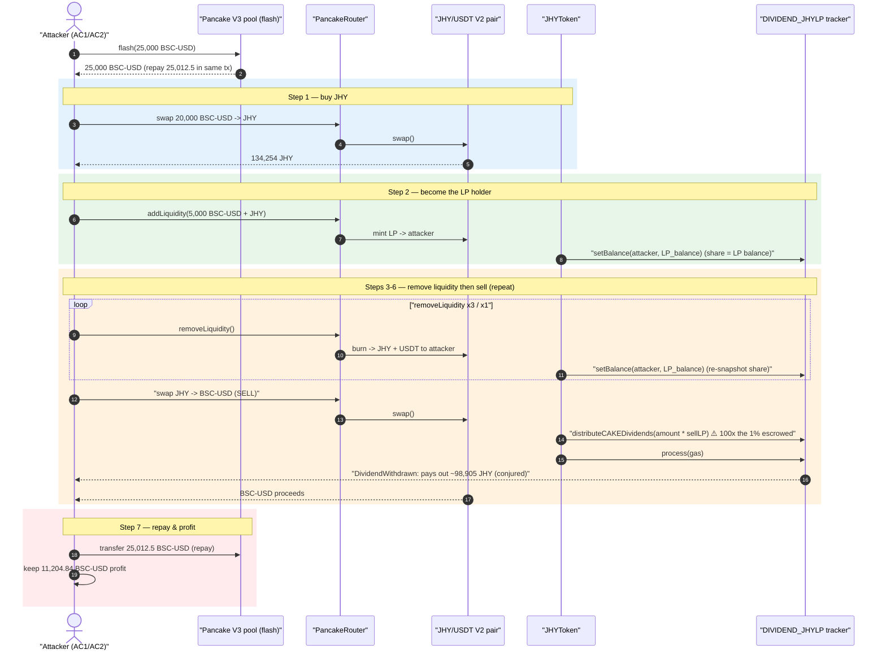
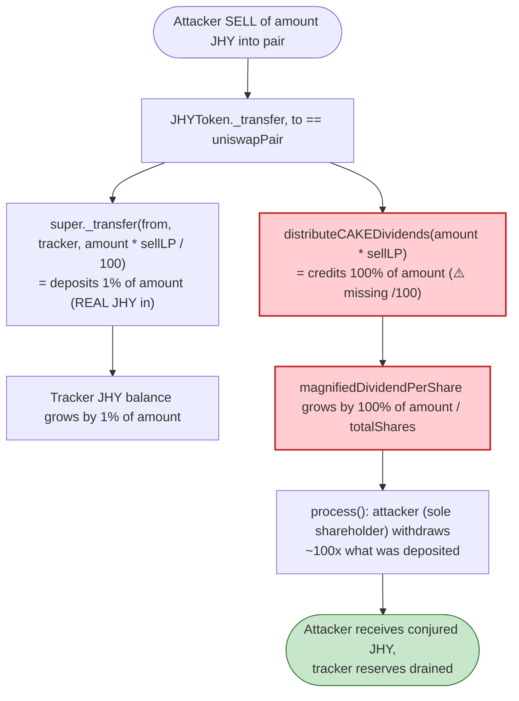

# JHY Token Exploit — Dividend Pool Drained via 100× Over-Credited `distributeCAKEDividends`

> **Vulnerability classes:** vuln/logic/reward-calculation · vuln/arithmetic/decimal-mismatch

> One-line summary: JHY's sell-tax routine credits its LP-dividend tracker with **100× the JHY it actually deposits**, so an attacker who corners the dividend share (by inflating their LP-token balance) claims out far more JHY than was ever paid in, then dumps it for ~11.2k USDT of pure profit.

> **Reproduction:** the PoC compiles & runs in an isolated Foundry project at [this project folder](.) (the umbrella DeFiHackLabs repo does not whole-compile, so this PoC was extracted). Full verbose trace: [output.txt](output.txt). Verified JHY token source: [sources/JHYToken_30Bea8/JHYToken.sol](sources/JHYToken_30Bea8/JHYToken.sol). The dividend tracker `0x40Cd735D…` is **unverified** on BscScan, so its exact `setBalance`/`distributeCAKEDividends` bytecode is reconstructed from on-chain behavior in the trace.

---

## Key info

| | |
|---|---|
| **Loss** | ~$11.2k — **11,231.38 BSC-USD (USDT)** extracted (started with 26.54, ended with 11,231.38) |
| **Vulnerable contract (token)** | `JHYToken` — [`0x30Bea8Ce5CD1BA592eb13fCCd8973945Dc8555c5`](https://bscscan.com/address/0x30Bea8Ce5CD1BA592eb13fCCd8973945Dc8555c5#code) |
| **Vulnerable contract (dividend tracker)** | `DIVIDEND_JHYLP` — [`0x40Cd735D49e43212B5cb0b19773Ec2A648aAA96c`](https://bscscan.com/address/0x40Cd735D49e43212B5cb0b19773Ec2A648aAA96c#code) (unverified) |
| **Victim pool** | JHY/BSC-USD PancakeSwap V2 pair — `0x086Ecf61469c741a6f97D80F2F43342af3dBDB9B` |
| **Flash-loan source** | PancakeSwap V3 pool `0x36696169C63e42cd08ce11f5deeBbCeBae652050` (25,000 BSC-USD, 0.05% fee) |
| **Attacker EOA** | [`0x00000000dd0412366388639b1101544fff2dce8d`](https://bscscan.com/address/0x00000000dd0412366388639b1101544fff2dce8d) |
| **Attacker contract** | `0x802a389072c4310cf78a2e654fa50fac8bdc1a55` |
| **Attack tx** | [`0xb6a9055e3ce7f006391760fbbcc4e4bc8df8228dc47a8bb4ff657370ccc49256`](https://bscscan.com/tx/0xb6a9055e3ce7f006391760fbbcc4e4bc8df8228dc47a8bb4ff657370ccc49256) |
| **Chain / block / date** | BSC / 44,857,310 (fork) / December 14, 2024 |
| **Compiler** | Solidity v0.8.26, optimizer disabled (200 runs) |
| **Bug class** | Broken reward/dividend accounting — distribution credited 100× the deposited amount, combined with LP-balance-driven dividend share |

---

## TL;DR

`JHYToken` charges a 3% tax on every sell into the Pancake pair: 2% burned to dead, **1% sent to a "dividend tracker"** (`dividendLPTracker`, the `DIVIDEND_JHYLP` contract) so LP providers can earn JHY rewards proportional to their LP-token holdings.

The accounting is broken in two reinforcing ways, both in `JHYToken._transfer` ([JHYToken.sol:968-979](sources/JHYToken_30Bea8/JHYToken.sol#L968-L979)):

1. **100× over-distribution.** The contract physically transfers `amount * sellLP / 100` (= **1%** of the sell) of JHY into the tracker, but then tells the tracker that `amount * sellLP` (= **100%** of the sell, `sellLP = 1`) of dividends are available:
   ```solidity
   super._transfer(from, address(dividendLPTracker), amount.mul(sellLP).div(100)); // deposits 1%
   TokenDividendTracker(dividendLPTracker).distributeCAKEDividends(amount.mul(sellLP)); // credits 100%
   ```
   The `.div(100)` is missing on the `distributeCAKEDividends` argument. Every sell inflates the claimable dividend pool by 100× the JHY actually escrowed.

2. **Dividend share = your LP-token balance, set on every pool interaction.** Both buy and sell legs call `setBalance(holder, pancakePair.balanceOf(holder))` ([JHYToken.sol:974](sources/JHYToken_30Bea8/JHYToken.sol#L974) and [:978](sources/JHYToken_30Bea8/JHYToken.sol#L978)), so the attacker can become essentially the **sole** dividend shareholder simply by holding LP tokens (`addLiquidity`), and re-snapshot it at will.

The attacker flash-loans 25,000 BSC-USD, buys JHY, mints LP, and then performs a sequence of `removeLiquidity` + sell cycles. Each sell both (a) re-snapshots the attacker as the dominant LP holder and (b) credits the dividend pool 100× the sold amount; the attacker then immediately claims that pool in JHY via the tracker's `process()`. JHY is conjured out of the tracker's accounting far in excess of the 1% fee actually paid, sold for USDT, the flash loan is repaid, and ~11.2k USDT is left over.

---

## Background — what JHY does

`JHYToken` ([source](sources/JHYToken_30Bea8/JHYToken.sol)) is a standard OpenZeppelin-style ERC20 (`_mint` of 10,000,000,000 JHY to the owner) with a sell-tax + LP-dividend feature:

- **Pair & router are fixed at construction** ([:930-945](sources/JHYToken_30Bea8/JHYToken.sol#L930-L945)): PancakeSwap V2 router `0x10ED…6024E`, and a JHY/USDT pair created via the factory (`uniswapPair`, the victim pool `0x086E…DB9B`).
- **Tax parameters** ([:903-904](sources/JHYToken_30Bea8/JHYToken.sol#L903-L904)): `sellDead = 2` (2% burned to the dead wallet on sells), `sellLP = 1` (1% routed to LP dividends on sells).
- **Dividend tracker** (`dividendLPTracker`, settable by owner via `setAddress(1, …)` [:1068-1074](sources/JHYToken_30Bea8/JHYToken.sol#L1068-L1074)) is a separate `DIVIDEND_JHYLP` contract. It is a "dividend-paying token" pattern (à la the well-known `DividendPayingToken`): each holder has an internal *dividend balance*, the pool accumulates `magnifiedDividendPerShare`, and `process()` pushes accrued JHY out to holders (events `DividendsDistributed`, `DividendWithdrawn`, `Claim`, `ProcessedDividendTracker` are all visible in the trace).

The intended design: when someone sells JHY, 1% is escrowed in the tracker and distributed to LP holders proportional to their LP-token balance. The fatal implementation error is that the *distributed* number is 100× the *escrowed* number.

The relevant on-chain state at the fork block (from the trace):

| Parameter | Value |
|---|---|
| `sellDead` | 2 (% burned to dead on sell) |
| `sellLP` | 1 (% to LP dividends on sell) |
| Pool reserves (start) | ~3,197,240 JHY / ~440,901 BSC-USD ([output.txt L1632](output.txt)) |
| JHY held by the dividend tracker | enough to satisfy the inflated claims (it accumulates 1% of every sell across the protocol's lifetime) |

---

## The vulnerable code

### 1. Sell tax: deposit 1%, distribute 100%

[JHYToken.sol:957-990](sources/JHYToken_30Bea8/JHYToken.sol#L957-L990):

```solidity
function _transfer(address from, address to, uint256 amount) internal override {
    if (_excludedFees[from] || _excludedFees[to]) { super._transfer(from, to, amount); return; }

    if (to == uniswapPair) {                                                   // a SELL
        super._transfer(from, _deadWalletAddress, amount.mul(sellDead).div(100)); // 2% burned
        super._transfer(from, address(dividendLPTracker), amount.mul(sellLP).div(100)); // 1% escrowed  ✅
        TokenDividendTracker(dividendLPTracker).distributeCAKEDividends(amount.mul(sellLP)); // 100% credited ⚠️ missing .div(100)
        try TokenDividendTracker(dividendLPTracker).setBalance(payable(from),
            IERC20(uniswapPair).balanceOf(address(from))) {} catch {}          // share = LP balance ⚠️
    }
    if (from == uniswapPair) {                                                 // a BUY
        try TokenDividendTracker(dividendLPTracker).setBalance(payable(to),
            IERC20(uniswapPair).balanceOf(address(to))) {} catch {}            // share = LP balance ⚠️
    }
    amount = amount.sub(amount.mul(sellLP + sellDead).div(100));               // net of 3% fee
    super._transfer(from, to, amount);

    if (from == uniswapPair || uniswapPair == to) {
        try TokenDividendTracker(dividendLPTracker).process(gas) returns (...) { ... } catch {} // pushes JHY out
    }
}
```

The defect is on the single line:

```solidity
TokenDividendTracker(dividendLPTracker).distributeCAKEDividends(amount.mul(sellLP)); // should be amount.mul(sellLP).div(100)
```

The line immediately above it (`super._transfer(..., amount.mul(sellLP).div(100))`) does include `.div(100)`. So the tracker is told "100 units of JHY were just deposited as dividends" while only "1 unit" was actually transferred in — a clean 100× over-credit on every sell.

Confirmed in the trace ([output.txt L1916-1917](output.txt)): selling `101,964.224…` JHY emits
`distributeCAKEDividends(101964224351023876573954)` — the **full** 101,964 JHY — while only `1,019.642…` JHY (`1019642243510238765739`, exactly 1%) was transferred into the tracker on the line before.

### 2. Dividend share is the LP-token balance, snapshotted on every interaction

`setBalance(holder, pancakePair.balanceOf(holder))` overwrites the holder's dividend share with their current LP-token (PancakePair) balance on both the buy and sell legs. So the attacker only needs to *hold LP tokens* to own the dividend share, and any pool interaction re-snapshots it. There is no time-lock, no vesting, and no check that the share was held while the dividends accrued.

### 3. `process()` pays the (inflated) dividends out in JHY

When a sell happens (`to == uniswapPair`), `_transfer` calls `process(gas)`. The tracker computes the holder's withdrawable amount from `magnifiedDividendPerShare × share` and transfers that much **real JHY** to the holder ([output.txt L1932-1933](output.txt)): `DividendWithdrawn(to: attacker, 101,964.22… JHY)` followed by the tracker `transfer`ing `98,905.29… JHY` (post its own 3% sell-fee) to the attacker. That JHY is far more than the 1% the attacker paid in.

---

## Root cause — why it was possible

The protocol's invariant *should* be: **total JHY paid out as dividends ≤ total JHY escrowed as the 1% sell fee.** That invariant is violated by construction.

1. **100× distribution credit (the core arithmetic bug).** `distributeCAKEDividends(amount.mul(sellLP))` credits 100× the JHY that `super._transfer(..., amount.mul(sellLP).div(100))` actually escrowed. The dividend tracker is a `DividendPayingToken` whose `magnifiedDividendPerShare` increases by `received / totalShares` — feeding it a number 100× larger than the real receipt means the per-share accumulator (and thus everyone's withdrawable JHY) is 100× too large. The tracker pays this out of the JHY balance it has accumulated from *all* historical sells, so it is effectively a slow-draining honeypot of JHY that any LP holder can over-withdraw.

2. **Share = manipulable LP balance, instantly re-snapshotted.** Because `setBalance` keys the dividend share off the *current* LP-token balance, the attacker becomes the dominant (effectively sole) shareholder by minting LP, and each subsequent pool touch (`addLiquidity` / `removeLiquidity` / swap) re-snapshots the share to the latest LP balance. There is no "you must have held the share before the distribution" guard, so the attacker captures distributions credited by their *own* sells.

3. **Permissionless, self-feeding loop.** The whole mechanism is reachable by anyone via ordinary `swapExactTokensForTokensSupportingFeeOnTransferTokens` / `addLiquidity` / `removeLiquidity` calls on the public router. The attacker's own sell both credits the inflated pool *and* triggers the `process()` payout to themselves in the same transaction. Repeating buy→LP→removeLiquidity→sell cycles compounds the conjured JHY.

4. **Flash-loan-funded, zero capital at risk.** The 25,000 BSC-USD working capital comes from a PancakeSwap V3 flash loan, repaid in the same transaction (25,000 + 12.5 fee = 25,012.5 BSC-USD). The attacker risks nothing.

---

## Preconditions

- A live JHY/USDT PancakeSwap V2 pool with non-trivial reserves (so swaps and LP mint/burn work) — present at the fork block.
- The dividend tracker (`DIVIDEND_JHYLP`) holds enough JHY (accumulated from prior 1% sell fees) to honor the inflated claims — present, as the trace shows real JHY being paid out via `DividendWithdrawn`.
- Working capital in BSC-USD to seed the buy/LP cycle. The PoC uses a **25,000 BSC-USD flash loan** from the V3 pool `0x3669…2050`, fully repaid intra-transaction, so the attack is effectively capital-free.
- The attacker (a normal address, not fee-excluded) is subject to the tax path — i.e. NOT in `_excludedFees`, so the dividend logic actually fires on their swaps.

---

## Attack walkthrough (with on-chain numbers from the trace)

The pair's `token0 = JHY`, `token1 = BSC-USD`, so `reserve0 = JHY`, `reserve1 = BSC-USD`. Two attack contracts are used: `AttackContract2` takes the flash loan and forwards funds; `AttackContract1.callback()` runs the actual exploit. All figures are from [output.txt](output.txt).

| # | Step | Trace ref | Concrete numbers |
|---|------|-----------|------------------|
| 0 | **Flash loan** 25,000 BSC-USD from V3 pool `0x3669…2050` | [L1593-1607](output.txt) | +25,000 BSC-USD to `AttackContract1`; repay obligation = 25,012.5 BSC-USD |
| 1 | **Buy** — swap 20,000 BSC-USD → JHY (with the fee-on-transfer path) | [L1620-1672](output.txt) | received **134,254.48 JHY**; left holding 5,000 BSC-USD |
| 2 | **Add liquidity** — pair 5,000 BSC-USD with 127,541.76 JHY desired | [L1677-1733](output.txt) | LP minted; pair `Mint(amount0=32,231.35 JHY, amount1=5,000 BSC-USD)`; attacker now the dominant LP holder. Note JHY's own 3% fee fires on the JHY leg of `addLiquidity`. |
| 3 | **removeLiquidity ×3** (122.93 LP each) | [L1735-1907](output.txt) | each `burn` returns JHY+USDT and re-snapshots `setBalance(attacker, LP_balance)` (e.g. `setBalance(attacker, 12,170.52…)` at [L1753](output.txt)); JHY balance grows to **101,964 JHY** |
| 4 | **Sell #1** — swap 101,964 JHY → BSC-USD | [L1911-1978](output.txt) | `distributeCAKEDividends(101,964.22 JHY)` credits 100× the 1,019.64 JHY escrowed ([L1916](output.txt)); `process()` pays out `DividendWithdrawn(attacker, 101,964.22 JHY)` → tracker transfers **98,905.29 JHY** back to attacker ([L1932-1933](output.txt)); net BSC-USD out from the swap ≈ 14,391.31 |
| 5 | **removeLiquidity #4** (11,924.65 LP) | [L1980-2037](output.txt) | JHY balance climbs to **130,201 JHY** |
| 6 | **Sell #2** — swap 130,201 JHY → BSC-USD | [L2040-2104](output.txt) | `distributeCAKEDividends(130,201.03 JHY)` again credits 100× the 1,302.01 JHY escrowed ([L2045-2046](output.txt)); swap yields **17,119.93 BSC-USD** |
| 7 | **Repay & profit** | [L2105-2122](output.txt) | transfer 25,012.5 BSC-USD back to V3 pool; remaining 11,204.84 BSC-USD swept to the test/attacker harness |

Console checkpoints ([output.txt L1564-1569](output.txt)):

```
Attacker Before exploit USDT Balance: 26.542161622221038197
bsc balance after 1st swap 5000
jhy balance after 1st swap 134254
jhy balance after 3 removeLiquidity operations 101964
jhy balance after 4th removeLiquidity 130201
Attacker After exploit USDT Balance: 11231.383963535113704166
```

The repeated `removeLiquidity` operations exist to keep re-snapshotting the attacker's dividend share (`setBalance` is called inside the JHY-token transfer that the pair's `burn` performs) and to keep the attacker holding JHY to sell — each sell is what triggers the 100×-inflated `distributeCAKEDividends` and the immediate `process()` payout.

### Profit / loss accounting (BSC-USD)

| Direction | Amount (BSC-USD) |
|---|---:|
| Flash-loan principal received | 25,000.00 |
| **— spent: buy JHY** | 20,000.00 |
| — kept after buy | 5,000.00 |
| **+ received: sell #1 (101,964 JHY)** | ~14,391.31 |
| **+ received: sell #2 (130,201 JHY)** | ~17,119.93 |
| Attacker BSC-USD balance before repay | 36,217.34 |
| **— repay flash loan (25,000 + 12.5 fee)** | 25,012.50 |
| **Net profit (swept to attacker)** | **11,204.84** |
| (Harness end-balance incl. starting 26.54) | **11,231.38** |

The ~11.2k USDT profit equals (sell proceeds − buy cost − flash fee). The "value" extracted is the JHY that the dividend tracker over-paid: the attacker sold ~232k JHY total while only ever buying 134k and contributing tiny fees — the surplus JHY (~98.9k from a single `DividendWithdrawn` alone) was conjured by the 100×-inflated dividend accounting and dumped into the pool for USDT.

---

## Diagrams

### Sequence of the attack



### Dividend accounting: deposit vs. credit (the core bug)



### State evolution of the attacker's JHY balance

```mermaid
stateDiagram-v2
    [*] --> Funded : "flash loan 25,000 BSC-USD"
    Funded --> Bought : "buy -> 134,254 JHY (5,000 USDT left)"
    Bought --> LPHolder : "addLiquidity -> sole dividend shareholder"
    LPHolder --> Remove3 : "removeLiquidity x3 -> 101,964 JHY"
    Remove3 --> Sell1 : "SELL 101,964 JHY -> +14,391 USDT<br/>distributeCAKEDividends 100x; claim ~98,905 JHY"
    Sell1 --> Remove4 : "removeLiquidity #4 -> 130,201 JHY"
    Remove4 --> Sell2 : "SELL 130,201 JHY -> +17,119 USDT<br/>distributeCAKEDividends 100x"
    Sell2 --> Repaid : "repay 25,012.5 USDT"
    Repaid --> Profit : "net +11,204.84 USDT"
    Profit --> [*]
```



---

## Why each magic number

- **25,000 BSC-USD flash loan:** working capital to fund the 20,000-USDT buy plus LP seed, with headroom; repaid as 25,012.5 (0.05% V3 fee).
- **20,000 BSC-USD buy → 134,254 JHY:** acquires enough JHY both to seed the LP position and to have inventory to dump on the inflated-dividend sells.
- **`amountBDesired = 127,541.76 JHY` in `addLiquidity`:** sized so the LP `mint` consumes the attacker's JHY proportionally to the pool (pair `Mint(amount0 = 32,231.35 JHY, amount1 = 5,000 USDT)`), maximizing the attacker's LP-token balance — which directly becomes their dividend share via `setBalance`.
- **`removeLiquidity` of `122.93` LP, three times, then `11,924.65` LP:** each `burn` is a JHY-token transfer that re-runs `setBalance(attacker, LP_balance)`, keeping the attacker as the dominant dividend shareholder and returning JHY to sell. Splitting it into multiple operations re-snapshots the share at successively chosen LP balances.
- **The two sells (101,964 and 130,201 JHY):** each sell is the trigger that calls `distributeCAKEDividends(amount * sellLP)` (100× the 1% escrowed) and then `process()` to push the over-credited JHY back to the attacker, before the JHY is swapped out to USDT.

---

## Remediation

1. **Fix the arithmetic — distribute exactly what is escrowed.** Change
   `distributeCAKEDividends(amount.mul(sellLP))` to `distributeCAKEDividends(amount.mul(sellLP).div(100))` so the credited dividends equal the JHY actually transferred into the tracker. This alone removes the 100× inflation that makes the attack profitable.
2. **Pass the realized receipt, not a derived figure.** Better still, have the tracker read its *own* received balance delta (`balanceOf(tracker)` before/after the escrow transfer) and distribute that, eliminating any chance of the deposited and distributed numbers diverging.
3. **Decouple dividend share from instantaneously-snapshotted LP balance.** Tying `setBalance` to the live `pancakePair.balanceOf(holder)` lets an attacker become the sole shareholder right before claiming. Use a share that is time-weighted, or that only accrues to LP held across the distribution, or require a cooldown between becoming a holder and claiming.
4. **Enforce the solvency invariant.** The tracker must never pay out more JHY than it actually holds from real fees; add an explicit check that withdrawable ≤ tracker JHY balance and that cumulative distributed ≤ cumulative received.
5. **Guard against same-transaction self-dealing.** Disallow the same address from both crediting the dividend pool (via its own sell) and claiming it within the same block/transaction, or process dividends on a delay so a flash-loan-funded self-feeding loop cannot close in one tx.

---

## How to reproduce

The PoC was extracted into a standalone Foundry project (the umbrella DeFiHackLabs repo has several unrelated PoCs that fail to compile under `forge test`'s whole-project build):

```bash
_shared/run_poc.sh 2024-12-JHY_exp -vvvvv
```

- RPC: a **BSC archive** endpoint is required (fork block 44,857,310). `foundry.toml` uses `https://bsc-mainnet.public.blastapi.io`, which serves historical state at that block; most pruned public BSC RPCs fail with `header not found` / `missing trie node`.
- Result: `[PASS] testExploit()` with the attacker ending at **11,231.38 BSC-USD** (from a 26.54 start).

Expected tail:

```
  Attacker Before exploit USDT Balance: 26.542161622221038197
  ...
  Attacker After exploit USDT Balance: 11231.383963535113704166

Suite result: ok. 1 passed; 0 failed; 0 skipped
Ran 1 test suite: 1 tests passed, 0 failed, 0 skipped (1 total tests)
```

---

*References: PoC header in [test/JHY_exp.sol](test/JHY_exp.sol); analysis tweet — https://x.com/TenArmorAlert/status/1867950089156575317 . The dividend tracker `0x40Cd735D…` is unverified on BscScan; its behavior is reconstructed from the verbose trace.*
