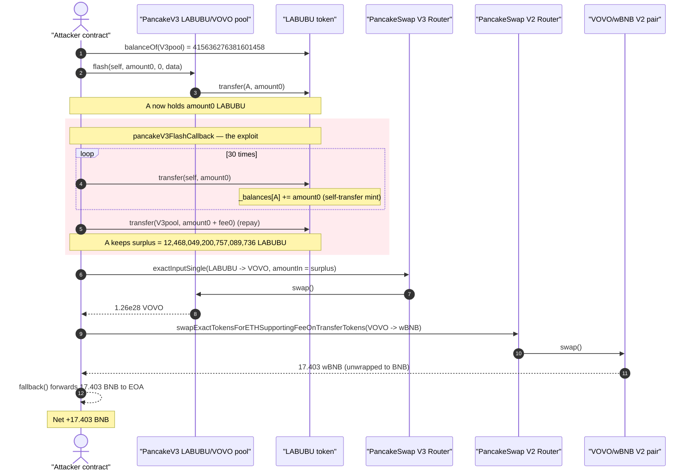
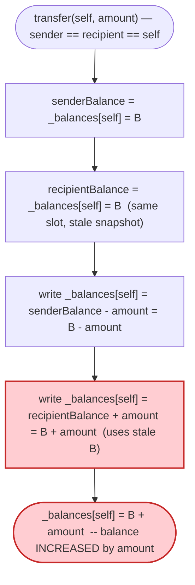
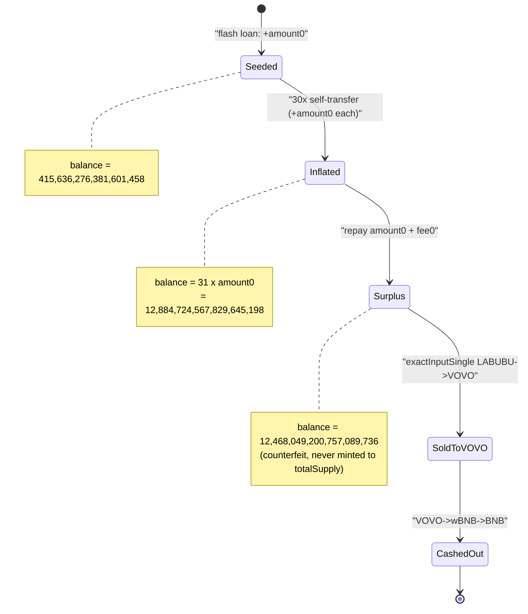

# LABUBU Exploit — Self-Transfer Balance Inflation via Stale Cached Balances

> One-liner: a `transfer(self, amount)` on the LABUBU token **mints** `amount` to the
> caller because `_transfer` caches the sender and recipient balances into local
> variables *before* writing them, so the recipient write (which overwrites the
> sender write when `sender == recipient`) uses the stale pre-debit value.

> **Reproduction:** the PoC compiles & runs in an isolated Foundry project at
> [this project folder](.). Full verbose trace: [output.txt](output.txt).
> Verified vulnerable source: [LABUBU.sol](sources/LABUBU_2fF960/LABUBU.sol).

---

## Key info

| | |
|---|---|
| **Loss** | **17.40 BNB (~$12,048)** — drained from the VOVO/wBNB PancakeSwap V2 pair |
| **Vulnerable contract** | `LABUBU` — [`0x2fF960F1D9AF1A6368c2866f79080C1E0B253997`](https://bscscan.com/address/0x2fF960F1D9AF1A6368c2866f79080C1E0B253997#code) |
| **Pools used** | LABUBU/VOVO PancakeSwap **V3** pool `0xe70294c3D81ea914A883ad84fD80473C048C028C` (flash + swap); VOVO/wBNB PancakeSwap **V2** pair `0xb98f5322a91019311af43cf1d938AD0c59A6148a` (cash-out) |
| **Attacker EOA** | [`0x27441c62dbe261fdf5e1feec7ed19cf6820d583b`](https://bscscan.com/address/0x27441c62dbe261fdf5e1feec7ed19cf6820d583b) |
| **Attacker contract** | [`0x2ff0cc42e513535bd56be20c3e686a58608260ca`](https://bscscan.com/address/0x2ff0cc42e513535bd56be20c3e686a58608260ca) |
| **Attack tx** | [`0xb06df371029456f2bf2d2edb732d1f3c8292d4271d362390961fdcc63a2382de`](https://bscscan.com/tx/0xb06df371029456f2bf2d2edb732d1f3c8292d4271d362390961fdcc63a2382de) |
| **Chain / block / date** | BSC / 44,751,945 / December 10, 2024 (~13:19 UTC) |
| **Compiler** | Solidity v0.8.28, optimizer **off** (0 runs) |
| **Bug class** | Self-transfer balance inflation (read-before-write of a cached balance) |

---

## TL;DR

LABUBU's `_transfer` ([LABUBU.sol:119-141](sources/LABUBU_2fF960/LABUBU.sol#L119-L141))
reads **both** the sender's and the recipient's balance into local variables at the top of
the function, then writes them back independently. When `sender == recipient` the two writes
target the *same* storage slot, and the recipient write — which runs second and uses the stale
pre-debit snapshot — overwrites the sender write. The net effect of `transfer(self, amount)` is:

```
_balances[self] = senderBalance - amount   // first write
_balances[self] = recipientBalance + amount // second write, recipientBalance == old senderBalance
                = old balance + amount       // => balance INCREASED by `amount`
```

So every self-transfer **credits** the caller with `amount` LABUBU out of thin air, while
`totalSupply` is never touched. The attacker turned this into cash with a single transaction:

1. **Flash-borrow** the entire LABUBU reserve of the V3 pool (415636276381601458 raw) so they
   start holding `amount0 = 415636276381601458` LABUBU.
2. **Self-transfer 30 times** inside the flash callback (`transfer(address(this), amount0)`),
   each call inflating their own balance by `amount0`. They end the callback holding
   `31 × amount0 = 12,884,724,567,829,645,198` LABUBU.
3. **Repay** the flash loan (`amount0 + fee0 = 416,675,367,072,555,462`), leaving a free
   surplus of **12,468,049,200,757,089,736** LABUBU.
4. **Swap** the surplus LABUBU → VOVO on the V3 pool (`exactInputSingle`), getting
   ~1.26e28 VOVO.
5. **Swap** the VOVO → wBNB on the V2 pair and unwrap to BNB.

Net profit: **17.403082890323102166 BNB**, all of it real liquidity stolen from the
VOVO/wBNB pool (and the VOVO drawn out of the V3 pool), funded by counterfeit LABUBU.

---

## Background — what LABUBU is

`LABUBU` ([source](sources/LABUBU_2fF960/LABUBU.sol)) is a small hand-rolled BEP20 token (it
does **not** inherit OpenZeppelin's ERC20). It declares 8 decimals, a fixed
`totalSupply = _maxSupply = 1.6e18`, a `SafeMath` library, and the usual
`transfer` / `transferFrom` / `approve` / `burn` surface.

Two non-standard quirks in `_transfer` are the whole story:

- **Conditional writes against a cached value.** Instead of unconditionally writing
  `_balances[sender] -= amount; _balances[recipient] += amount;`, it snapshots both balances
  first and only writes back if the value changed.
- **A "dust floor" of 16.** If a balance hits zero after a transfer it is reset to `16` wei
  (lines 136-138). This is cosmetic to the exploit but explains the `16` you see in the pool's
  storage in the trace.

At the fork block the LABUBU/VOVO V3 pool held only `415636276381601458` raw LABUBU — a tiny
amount — which the attacker borrows and then multiplies via the self-transfer bug.

---

## The vulnerable code

### `_transfer` caches balances, then writes them back independently

[LABUBU.sol:119-141](sources/LABUBU_2fF960/LABUBU.sol#L119-L141):

```solidity
function _transfer(address sender, address recipient, uint256 amount) internal {
    require(sender != address(0), "Xfer from zero addr");
    require(recipient != address(0), "Xfer to zero addr");

    uint256 senderBalance    = _balances[sender];     // (1) snapshot sender
    uint256 recipientBalance = _balances[recipient];  // (2) snapshot recipient  ← SAME slot if sender==recipient

    uint256 newSenderBalance = SafeMath.sub(senderBalance, amount);
    if (newSenderBalance != senderBalance) {
        _balances[sender] = newSenderBalance;         // (3) write sender = bal - amount
    }

    uint256 newRecipientBalance = recipientBalance.add(amount);
    if (newRecipientBalance != recipientBalance) {
        _balances[recipient] = newRecipientBalance;   // (4) write recipient = bal + amount  ← OVERWRITES (3)
    }

    if (_balances[sender] == 0) {
        _balances[sender] = 16;                        // dust floor (explains the "16" in the trace)
    }

    emit Transfer(sender, recipient, amount);
}
```

When `sender == recipient`:

- `senderBalance` and `recipientBalance` both equal the pre-transfer balance `B`.
- Step (3) writes `B - amount`.
- Step (4) recomputes from the **stale** `recipientBalance = B` (not the freshly-written
  `B - amount`) and writes `B + amount`, clobbering step (3).
- Final balance is `B + amount` — the self-transfer **created** `amount` tokens.

A correct ERC20 (e.g. OpenZeppelin) either no-ops on `from == to` net-of-effect, or
debits-then-credits the *same live storage slot* so the two operations cancel. LABUBU instead
operates on two independent local snapshots of one slot, so a self-transfer is a free mint.

---

## Root cause — why it was possible

The bug is a **read-before-write aliasing error**. The function assumes `sender` and
`recipient` are distinct storage locations and reads them both up front. That assumption holds
for ordinary transfers but breaks for the aliased case `sender == recipient`, where the two
"independent" writes race on one slot and the later write wins with a value computed from a
snapshot taken *before* the earlier write.

The defects, in order of importance:

1. **No `from == to` handling.** There is no early return, no same-slot mutation, and no guard
   forbidding self-transfers. The aliased path is fully reachable by anyone.
2. **Local caching of mutable state.** `recipientBalance` is read once and then used to compute
   the credit *after* the debit has already been applied to the same slot. The debit is
   effectively undone.
3. **Conditional writes hide nothing.** The `if (new != old)` guards are pure noise here — both
   deltas are nonzero, so both writes execute; the second simply overwrites the first.
4. **Hand-rolled token, no audited base.** Using a standard, audited ERC20 implementation would
   have made this impossible — the canonical implementations are immune to the self-transfer
   case.

`totalSupply` is never updated by `_transfer`, so the inflation is purely a per-account balance
fabrication; it shows up as the token contract's accounting no longer summing to `totalSupply`,
but nothing on-chain enforces that, so the fake balance is freely swappable.

---

## Preconditions

- **A liquid market for LABUBU.** The attacker needs somewhere to dump the counterfeit balance.
  Here the LABUBU/VOVO V3 pool provides both the seed LABUBU (via flash loan) and the venue to
  swap fabricated LABUBU into VOVO, and the VOVO/wBNB V2 pair converts VOVO to BNB.
- **Any starting LABUBU balance > 0.** The exploit needs a nonzero `amount` to self-transfer.
  A flash loan supplies it with zero up-front capital, making the attack **flash-loanable** and
  capital-free. The attacker borrows the pool's full LABUBU balance, inflates it, repays, and
  keeps the inflated surplus.
- **No access control / no warp needed.** `transfer` is permissionless and the whole sequence
  executes atomically in one transaction.

---

## Attack walkthrough (with on-chain numbers from the trace)

All figures are raw token units taken directly from
[output.txt](output.txt). The V3 pool's `token0 = LABUBU`, `token1 = VOVO`.

| # | Step | Trace ref | LABUBU held by attacker | Effect |
|---|------|-----------|------------------------:|--------|
| 0 | Read pool LABUBU reserve = `415636276381601458` | [L32-33](output.txt#L32) | 0 | Determines flash amount `amount0`. |
| 1 | `flash(self, amount0, 0, …)` — pool sends `amount0` LABUBU to attacker | [L34-44](output.txt#L34) | 415,636,276,381,601,458 | Loan funded; attacker now holds `amount0`. |
| 2 | **Self-transfer #1** `transfer(self, amount0)` | [L46-50](output.txt#L46) | 831,272,552,763,202,916 | Balance += amount0 (slot `0xa632…` doubles). |
| 3 | **Self-transfers #2–#30** (29 more) | [L51-195](output.txt#L51) | 12,884,724,567,829,645,198 | Each adds `amount0`; total = `31 × amount0`. |
| 4 | Repay loan `transfer(pool, amount0 + fee0)` where `fee0 = 1039090690954004` | [L196-201](output.txt#L196) | **12,468,049,200,757,089,736** | Surplus retained = counterfeit LABUBU. |
| 5 | `approve` + `exactInputSingle` LABUBU → VOVO on V3 | [L216-258](output.txt#L221) | 0 LABUBU / **12,608,287,525,767,706,916,530,637,084 VOVO** | Sells fake LABUBU; only `444,202,760,808,574,918` LABUBU actually consumed by the pool, rest discarded. |
| 6 | `approve` + `swapExactTokensForETHSupportingFeeOnTransferTokens` VOVO → wBNB on V2, then unwrap | [L259-302](output.txt#L264) | — | Receives **17,403,082,890,323,102,166** wei wBNB → BNB. |
| 7 | `fallback()` forwards BNB to attacker EOA | [L303-308](output.txt#L300) | — | Profit booked. |

The `Flash` event at [L207](output.txt#L207) confirms `amount0 = 415636276381601458`,
`paid0 = 1039090690954020` (loan repaid in full with fee). The final log line:

```
Profit in BNB: 17.403082890323102166
```

### Balance-math verification

```
seed (flash)          =                 415,636,276,381,601,458
after 30 self-xfers   = 31 × seed     = 12,884,724,567,829,645,198
repay (seed + fee0)   =                   416,675,367,072,555,462
surplus kept          = 12,884,724,567,829,645,198 - 416,675,367,072,555,462
                      =                12,468,049,200,757,089,736   ← matches trace L213 exactly
```

### Profit / loss accounting

| Item | Amount |
|---|---:|
| Up-front capital | **0** (flash-loaned) |
| Counterfeit LABUBU created (net of repayment) | 12,468,049,200,757,089,736 raw LABUBU |
| VOVO obtained from V3 pool | 12,608,287,525,767,706,916,530,637,084 raw VOVO |
| wBNB obtained from V2 pair | 17,403,082,890,323,102,166 wei |
| Flash-loan fee paid (in LABUBU, absorbed) | 1,039,090,690,954,004 raw LABUBU |
| **Net profit** | **17.403082890323102166 BNB (~$12,048)** |

The loss falls on the liquidity providers of the LABUBU/VOVO V3 pool (drained of VOVO) and
the VOVO/wBNB V2 pair (drained of wBNB); the bridge between them is the fabricated LABUBU.

---

## Diagrams

### Sequence of the attack



### How the self-transfer fabricates balance



### Attacker LABUBU balance evolution



---

## Remediation

1. **Use an audited ERC20 base.** OpenZeppelin's `ERC20._update` (and the legacy
   `_transfer`) mutates the *live* `_balances` slot for both the debit and the credit, so the
   `from == to` case is a net no-op. Replacing this hand-rolled token with OZ eliminates the bug.
2. **Never cache a balance you are about to mutate, then write it back.** If you must keep the
   current pattern, recompute `_balances[recipient]` *after* the sender write, or operate
   directly on storage:
   ```solidity
   _balances[sender]    -= amount;   // reverts on underflow in 0.8.x
   _balances[recipient] += amount;   // reads the just-updated value when recipient == sender
   ```
   This is self-correcting for self-transfers (the slot is debited then credited by the same
   `amount`, netting to zero change).
3. **Add an explicit self-transfer guard** if a no-op is desired:
   `if (sender == recipient) { emit Transfer(sender, recipient, amount); return; }` after the
   balance/zero-address checks.
4. **Enforce a supply invariant in tests/fuzzing.** A simple invariant — "sum of all balances
   == totalSupply" — would have flagged this immediately, since a self-transfer breaks it.
5. **Drop the magical `= 16` dust floor.** Silently resetting a zero balance to 16 wei is its
   own accounting hazard (it creates tokens that were never minted) and obscures real balance
   tracking; remove it.

---

## How to reproduce

The PoC was extracted into a standalone Foundry project (the umbrella DeFiHackLabs repo has
many unrelated PoCs that fail to compile under a whole-project `forge test` build):

```bash
_shared/run_poc.sh 2024-12-LABUBU_exp -vvvvv
```

- RPC: a **BSC archive** endpoint is required (fork block 44,751,944). `foundry.toml` uses
  `https://bsc-mainnet.public.blastapi.io`, which serves historical state at that block; the
  default `bnb.api.onfinality.io/public` was rate-limited (HTTP 429) during this run and was
  swapped out.
- Result: `[PASS] testPoC()` with `Profit in BNB: 17.403082890323102166`.

Expected tail:

```
Ran 1 test for test/LABUBU_exp.sol:LABUBU_exp
[PASS] testPoC() (gas: 2018771)
Logs:
  Profit in BNB: 17.403082890323102166

Suite result: ok. 1 passed; 0 failed; 0 skipped
```

---

*References: PoC header comments in [test/LABUBU_exp.sol](test/LABUBU_exp.sol); analysis thread
by TenArmor — https://x.com/TenArmorAlert/status/1866481066610958431.*
