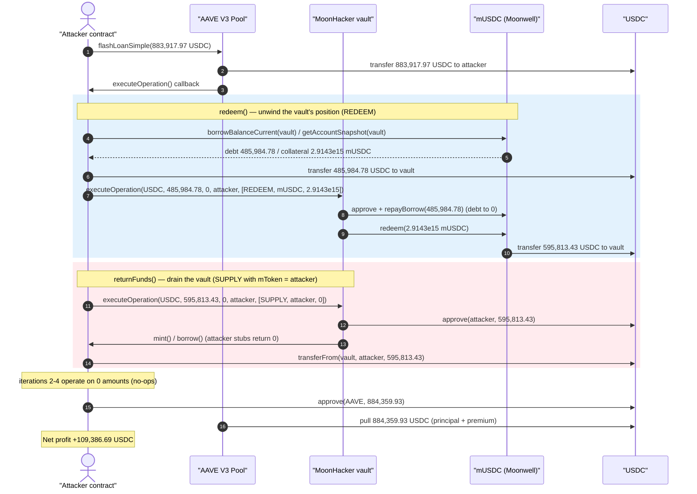
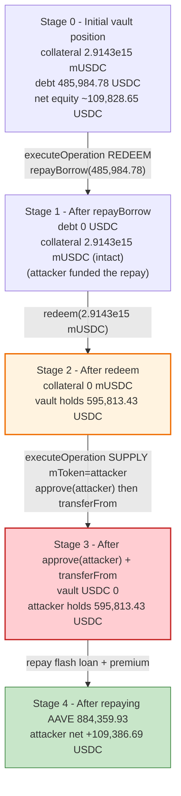
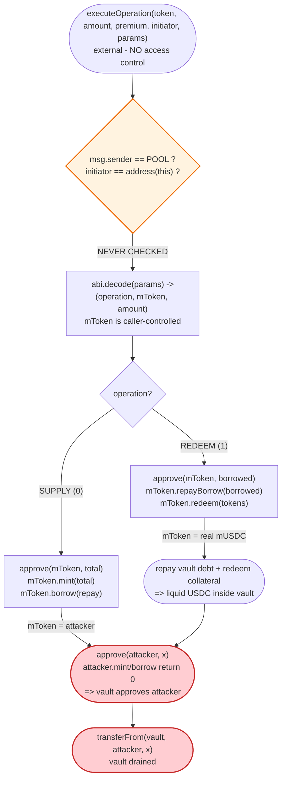

# MoonHacker Vault Exploit — Unauthenticated AAVE Flash-Loan Callback Drains the Vault

> **Reproduction:** the PoC compiles & runs in an isolated Foundry project at
> [this project folder](.) (the umbrella DeFiHackLabs repo contains many unrelated PoCs that do not
> compile together, so this one was extracted).
> Full verbose trace: [output.txt](output.txt).
> Verified vulnerable source: [contracts_MoonHacker.sol](sources/MoonHacker_D9B45e/contracts_MoonHacker.sol).

---

## Key info

| | |
|---|---|
| **Loss** | ~$318.9K total across the attacker's full campaign; **109,386.69 USDC** drained from the mUSDC vault position in this single reproduced transaction |
| **Vulnerable contract** | `MoonHacker` — [`0xD9B45e2c389b6Ad55dD3631AbC1de6F2D2229847`](https://optimistic.etherscan.io/address/0xd9b45e2c389b6ad55dd3631abc1de6f2d2229847#code) |
| **Victim asset** | The vault's Moonwell position in mUSDC — [`0x8E08617b0d66359D73Aa11E11017834C29155525`](https://optimistic.etherscan.io/address/0x8E08617b0d66359D73Aa11E11017834C29155525#code) (USDC underlying) |
| **Attacker EOA** | [`0x36491840ebcf040413003df9fb65b6bc9a181f52`](https://optimistic.etherscan.io/address/0x36491840ebcf040413003df9fb65b6bc9a181f52) |
| **Attacker contracts** | [`0x4e258f1705822c2565d54ec8795d303fdf9f768e`](https://optimistic.etherscan.io/address/0x4e258f1705822c2565d54ec8795d303fdf9f768e), [`0x3a6eaaf2b1b02ceb2da4a768cfeda86cff89b287`](https://optimistic.etherscan.io/address/0x3a6eaaf2b1b02ceb2da4a768cfeda86cff89b287) |
| **Attack tx** | [`0xd12016b25d7aef681ade3dc3c9d1a1cc12f35b2c99953ff0e0ee23a59454c4fe`](https://optimistic.etherscan.io/tx/0xd12016b25d7aef681ade3dc3c9d1a1cc12f35b2c99953ff0e0ee23a59454c4fe) |
| **Chain / block / date** | Optimism / 129,697,250 (forked at block − 1) / December 23, 2024 |
| **Compiler** | Solidity v0.8.27, optimizer **disabled** (runs 200) |
| **Bug class** | Missing access control on an external flash-loan callback (`executeOperation`) + caller-controlled call targets |

---

## TL;DR

`MoonHacker` is a "smart leverage" helper vault that wraps Moonwell (a Compound-fork lending market)
positions behind AAVE V3 flash loans. The vault's AAVE callback,
[`executeOperation(...)`](sources/MoonHacker_D9B45e/contracts_MoonHacker.sol#L106-L159), is declared
`external` with **no access control whatsoever** — it does not verify that the caller is the AAVE Pool,
nor that the flash-loan `initiator` is the vault itself. Worse, it `abi.decode`s the `mToken` *target*
and the operation type **directly from caller-supplied `params`**, then performs `approve` /
`repayBorrow` / `redeem` / `mint` / `borrow` against that attacker-chosen target.

Because anyone can call `executeOperation` with any `params`, the attacker uses it as a
"do-anything-on-behalf-of-the-vault" primitive:

1. **REDEEM branch** with `mToken = real mUSDC`: the attacker hands the vault enough USDC to repay its
   own Moonwell debt, the vault `repayBorrow`s, then `redeem`s its entire mUSDC collateral back into
   USDC that now sits inside the vault.
2. **SUPPLY branch** with `mToken = the attacker's own contract`: the vault calls
   `IERC20(USDC).approve(attacker, amount)` and `attacker.mint()` / `attacker.borrow()` (both attacker
   stubs that just `return 0` to satisfy the vault's `require(... == 0)` checks). The vault has now
   approved the attacker to spend its USDC, and the attacker `transferFrom`s it all out.

The whole thing is wrapped in a single AAVE V3 flash loan of **883,917.97 USDC** (premium 441.96 USDC),
so the attacker needs no capital. Net profit in this transaction: **+109,386.69 USDC**.

---

## Background — what MoonHacker does

`MoonHacker` ([source](sources/MoonHacker_D9B45e/contracts_MoonHacker.sol)) is an owner-operated helper
contract for managing leveraged Moonwell positions on Optimism. Its *intended* flows are:

- **`smartSupply` / `smartRedeem` / `smartRedeemAmount`** ([:62-103](sources/MoonHacker_D9B45e/contracts_MoonHacker.sol#L62-L103)) —
  owner-only entry points that initiate an AAVE V3 `flashLoanSimple`, encoding a `SmartOperation`
  (`SUPPLY` or `REDEEM`), the target `mToken`, and an amount into the flash-loan `params`.
- **`executeOperation`** ([:106-159](sources/MoonHacker_D9B45e/contracts_MoonHacker.sol#L106-L159)) —
  the AAVE V3 callback that AAVE invokes mid-flash-loan. It decodes `params` and either:
  - **SUPPLY**: `approve(mToken, amount)` → `mToken.mint(amount)` → `mToken.borrow(repay)` → repay AAVE.
  - **REDEEM**: `approve(mToken, borrowed)` → `mToken.repayBorrow(borrowed)` → `mToken.redeem(tokens)`
    → claim rewards → repay AAVE.

The design intent is that `executeOperation` is *only ever* called by the AAVE Pool, as the callback of
a flash loan that the vault itself started (so the `mToken` in `params` is always a legitimate Moonwell
market the owner chose). That assumption is never enforced in code.

On-chain state of the vault's mUSDC position at the fork block (read from the trace's
`getAccountSnapshot`):

| Quantity | Value |
|---|---|
| Vault mUSDC collateral (mTokens) | 2,914,299,300,544,423 (2.914e15) |
| Vault Moonwell USDC debt (`borrowBalance`) | 485,984,777,954 USDC (≈ 485,984.78) |
| Vault exchange-rate mantissa | 204,444,832,291,007 |
| USDC redeemable for the full collateral | 595,813,431,745 USDC (≈ 595,813.43) |

The "prize" is the difference between what the collateral redeems for and what it costs to clear the
debt: `595,813.43 − 485,984.78 ≈ 109,828.65 USDC` of net equity locked in the vault.

---

## The vulnerable code

### 1. The flash-loan callback has no caller/initiator check

```solidity
function executeOperation(
    address token,
    uint256 amountBorrowed,
    uint256 premium,
    address initiator,
    bytes calldata params
) external returns (bool) {                                   // ⚠️ external, NO access control

    (SmartOperation operation, address mToken, uint256 amountToSupplyOrReedem)
        = abi.decode(params, (SmartOperation, address, uint256));   // ⚠️ mToken from caller params
    uint256 totalAmountToRepay = amountBorrowed + premium;

    if (operation == SmartOperation.SUPPLY) {
        uint256 totalSupplyAmount = amountBorrowed + amountToSupplyOrReedem;
        IERC20(token).approve(mToken, totalSupplyAmount);     // ⚠️ approve to attacker-chosen target
        require(IMToken(mToken).mint(totalSupplyAmount) == 0, "mint failed");   // ⚠️ calls attacker stub
        require(IMToken(mToken).borrow(totalAmountToRepay) == 0, "borrow failed");
        IERC20(token).approve(address(POOL), totalAmountToRepay);
    } else if (operation == SmartOperation.REDEEM) {
        IERC20(token).approve(mToken, amountBorrowed);
        require(IMToken(mToken).repayBorrow(amountBorrowed) == 0, "repay borrow failed");
        require(IMToken(mToken).redeem(amountToSupplyOrReedem) == 0, "redeem failed");
        COMPTROLLER.claimReward(address(this));
    } else {
        revert("invalid op");
    }
    ...
    IERC20(token).approve(address(POOL), totalAmountToRepay);
    return true;
}
```
[contracts_MoonHacker.sol:106-159](sources/MoonHacker_D9B45e/contracts_MoonHacker.sol#L106-L159)

Compare with the `onlyOwner` modifier that *every other* state-changing function uses
([:51-54](sources/MoonHacker_D9B45e/contracts_MoonHacker.sol#L51-L54)):

```solidity
modifier onlyOwner {
    require(msg.sender == owner || (address(this) == msg.sender && tx.origin == owner), "not auth");
    _;
}
```

`executeOperation` is the one privileged action that **omits** this modifier — and it is the most
dangerous one, because it moves the vault's tokens.

### 2. The two attacker primitives this exposes

- **SUPPLY primitive → "approve me".** With `mToken` set to the attacker's own contract, line 123
  becomes `IERC20(USDC).approve(attackerContract, amount)`. The subsequent `mToken.mint()` /
  `mToken.borrow()` calls land on the attacker's contract, whose
  [`mint`/`borrow` stubs](test/Moonhacker_exp.sol#L128-L135) simply `return 0` so the `require(... == 0)`
  guards pass. Net effect: **the vault approves the attacker to spend its USDC.**
- **REDEEM primitive → "unwind my Moonwell position".** With `mToken = mUSDC` and the attacker
  pre-funding the vault with USDC, lines 137-140 repay the vault's debt and redeem its collateral,
  converting locked equity into liquid USDC inside the vault — which the SUPPLY primitive then siphons.

---

## Root cause — why it was possible

The single defect is **a privileged callback that trusts its caller and its arguments implicitly.**
A correct AAVE flash-loan receiver must enforce, at the top of `executeOperation`:

```solidity
require(msg.sender == address(POOL),  "caller not pool");
require(initiator == address(this),   "initiator not self");
```

Neither check exists. That alone would have blocked the attack, because the attacker invoked
`executeOperation` directly (it is `msg.sender = attacker`, and the AAVE flash loan the attacker took
was started by the *attacker's* contract, so `initiator = attacker`, not the vault).

Layered on top, a second design smell makes the missing guard catastrophic rather than merely unsafe:

1. **The action target (`mToken`) is decoded from caller-controlled `params`.** Even an authenticated
   callback should treat `mToken` as untrusted unless it is validated against an allow-list of real
   Moonwell markets. Here the vault will `approve` and call arbitrary code at whatever address the
   caller names — turning the callback into a generic `approve(attacker, x)` gadget.
2. **The vault holds real, redeemable equity.** Because the vault has live Moonwell collateral worth
   more than its debt, an attacker who can puppet its `repayBorrow`/`redeem`/`approve` calls can crack
   the position open and walk away with the spread.
3. **The economics are flash-loan-funded.** The attacker needs no capital: AAVE supplies the USDC to
   repay the vault's debt, and the redeemed collateral repays AAVE plus premium, leaving the spread as
   profit.

In short: *missing `onlyPool`/`onlyInitiator` access control on an external callback that performs token
approvals and external calls to a caller-supplied address.*

---

## Preconditions

- The vault `MoonHacker` holds a Moonwell position whose **redeemable collateral exceeds its debt**
  (here, ≈109.8K USDC of net equity). This is the value the attacker extracts.
- `executeOperation` is callable by anyone (always true — it has no access control).
- The attacker can source the debt-repayment USDC. A flash loan satisfies this with zero capital; the
  PoC uses AAVE V3 `flashLoanSimple` of 883,917.97 USDC ([Moonhacker_exp.sol:74](test/Moonhacker_exp.sol#L74)).
- AAVE V3 USDC liquidity on Optimism large enough for the flash loan (it was).

---

## Attack walkthrough (with on-chain numbers from the trace)

All figures are pulled directly from [output.txt](output.txt). USDC has 6 decimals. The attacker's
`executeOperation` loop runs 4 times ([Moonhacker_exp.sol:86-89](test/Moonhacker_exp.sol#L86-L89)), but
only **iteration 1** moves value — after it, the vault's mUSDC collateral and debt are both 0, so
iterations 2-4 operate on zero amounts and are no-ops.

| # | Step (iteration 1) | Concrete values | Effect |
|---|--------------------|-----------------|--------|
| 0 | **Flash loan** `aaveV3.flashLoanSimple(attacker, USDC, 883_917_967_954, …)` | borrow 883,917.967954 USDC, premium 441.958984 | Attacker holds 883,917.97 USDC, owes 884,359.93. |
| 1 | `mUSDC.borrowBalanceCurrent(vault)` / `getAccountSnapshot(vault)` | debt = 485,984.777954 USDC; collateral = 2.9143e15 mUSDC | Reads the vault's live position. |
| 2 | `USDC.transfer(vault, 485_984_777_954)` | +485,984.78 USDC to the vault | Pre-funds the vault to repay its own debt. |
| 3 | **REDEEM** `vault.executeOperation(USDC, 485_984_777_954, 0, attacker, [REDEEM, mUSDC, 2.9143e15])` | — | Vault: `approve(mUSDC, 485,984.78)` → `repayBorrow(485,984.78)` → debt → 0. |
| 4 | …same call continues: `mUSDC.redeem(2_914_299_300_544_423)` | redeems → **595,813.431745 USDC** to the vault | Vault collateral → 0; vault now holds 595,813.43 USDC. |
| 5 | `USDC.balanceOf(vault)` | 595,813.431745 | Liquid USDC now sits in the vault. |
| 6 | **SUPPLY** `vault.executeOperation(USDC, 595_813_431_745, 0, attacker, [SUPPLY, attacker, 0])` | — | Vault: `approve(attacker, 595,813.43)`; `attacker.mint()`/`attacker.borrow()` return 0. |
| 7 | `USDC.transferFrom(vault, attacker, 595_813_431_745)` | −595,813.43 from vault → attacker | Vault fully drained of the redeemed USDC. |
| 8 | iterations 2-4 | all amounts = 0 | No-ops (collateral/debt already 0). |
| 9 | **Repay AAVE** `USDC.approve(aaveV3, 884_359_926_938)`; AAVE pulls 884,359.93 | −884,359.93 | Flash loan + premium repaid. |
| 10 | `getProfit()` | attacker holds **109,386.694807 USDC** | Profit swept to the PoC test contract. |

### Profit accounting (USDC)

| Direction | Amount (USDC) |
|---|---:|
| Flash loan received | 883,917.967954 |
| Sent to vault to repay its debt | −485,984.777954 |
| Redeemed collateral pulled out of vault | +595,813.431745 |
| Flash-loan repayment to AAVE (principal + 0.05% premium) | −884,359.926938 |
| **Net profit** | **+109,386.694807** |

Cross-check: vault equity extracted = `595,813.431745 − 485,984.777954 = 109,828.653791`; minus the AAVE
premium `441.958984` = **109,386.694807 USDC** — matches the balance log to the wei.

```
Attacker Before exploit USDC Balance: 0.000000
Attacker After  exploit USDC Balance: 109386.694807
```

---

## Diagrams

### Sequence of the attack



### Vault position state evolution



### The flaw inside `executeOperation`



---

## Why each magic number

- **Flash loan = 883,917.967954 USDC** ([Moonhacker_exp.sol:74](test/Moonhacker_exp.sol#L74)): only
  needs to cover the vault's debt (485,984.78) with comfortable headroom; the redeemed collateral
  (595,813.43) repays it. The exact size is not critical as long as it exceeds the debt; the surplus is
  returned to AAVE.
- **485,984.777954 USDC transferred to the vault**: equals the vault's exact `borrowBalanceCurrent`, so
  `repayBorrow` fully clears the debt and unlocks 100% of the collateral.
- **`redeem(2,914,299,300,544,423)`**: the vault's full mUSDC collateral balance from
  `getAccountSnapshot`, redeeming the entire position into 595,813.43 USDC.
- **`operationType = 0` (SUPPLY) with `mToken = attacker`** in `returnFunds`
  ([Moonhacker_exp.sol:116-122](test/Moonhacker_exp.sol#L116-L122)): routes the vault's `approve` to the
  attacker and routes `mint`/`borrow` to attacker stubs that return 0 — the access-control bypass that
  hands the attacker spending rights.

---

## Remediation

1. **Authenticate the callback (the actual fix).** At the top of `executeOperation`:
   ```solidity
   require(msg.sender == address(POOL), "caller not pool");
   require(initiator == address(this), "initiator not self");
   ```
   This alone blocks the attack: the exploit calls `executeOperation` directly (`msg.sender = attacker`)
   and/or via an attacker-initiated flash loan (`initiator = attacker`).
2. **Never trust the action target from `params`.** Validate `mToken` against an allow-list of known,
   real Moonwell markets the vault is configured to use, rather than `approve`-ing and calling arbitrary
   caller-supplied addresses.
3. **Apply the same access discipline as every other mutating function.** Every other state-changing
   method already uses `onlyOwner`; the privileged callback that moves funds must not be the exception.
   Add a re-entrancy guard for good measure.
4. **Minimize standing approvals.** Approve the exact amount needed for the immediate operation and
   reset to 0 afterward, so a residual allowance can never be drained later.
5. **Hold no idle equity in the helper.** Helper/flash-loan-router contracts should end every operation
   flat (no leftover collateral or token balance), so that even a logic bug has nothing to steal.

---

## How to reproduce

The PoC was extracted into a standalone Foundry project (the umbrella DeFiHackLabs repo has many
unrelated PoCs that fail to compile under a single `forge test` build):

```bash
_shared/run_poc.sh 2024-12-Moonhacker_exp -vvvvv
```

- RPC: an **Optimism archive** endpoint is required (fork block 129,697,250 − 1). `foundry.toml` uses an
  Infura Optimism archive endpoint; public OP endpoints such as `https://optimism.drpc.org` or
  `https://mainnet.optimism.io` also serve historical state at that block. The default key shipped with
  the template returned HTTP 401 for Optimism and was swapped for a working archive key.
- Result: `[PASS] testExploit()` with the attacker ending on **109,386.694807 USDC**.

Expected tail:

```
  Attacker Before exploit USDC Balance: 0.000000
  Attacker After exploit USDC Balance: 109386.694807

Ran 1 test for test/Moonhacker_exp.sol:Moonhacker
[PASS] testExploit() (gas: 8384716)
Suite result: ok. 1 passed; 0 failed; 0 skipped
```

---

*References:*
- *Post-mortem: https://blog.solidityscan.com/moonhacker-vault-hack-analysis-ab122cb226f6*
- *On-chain analysis: https://app.blocksec.com/explorer/tx/optimism/0xd12016b25d7aef681ade3dc3c9d1a1cc12f35b2c99953ff0e0ee23a59454c4fe*
