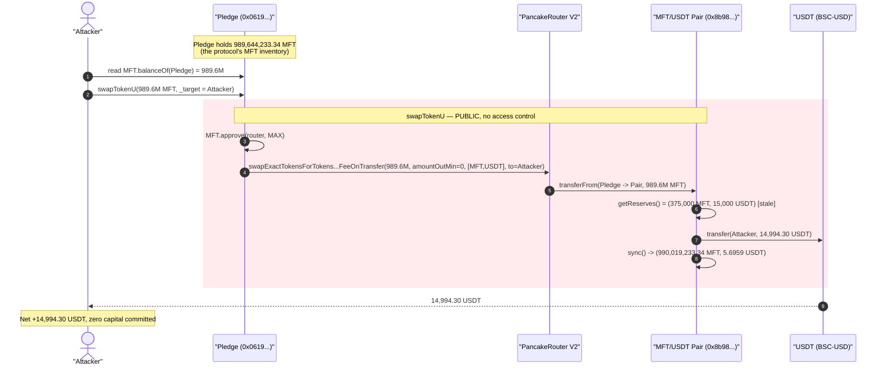
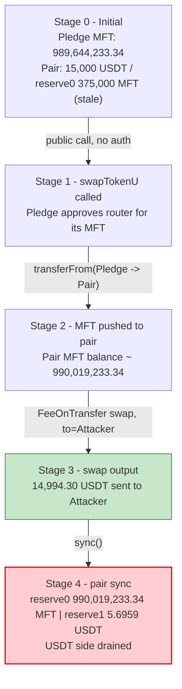
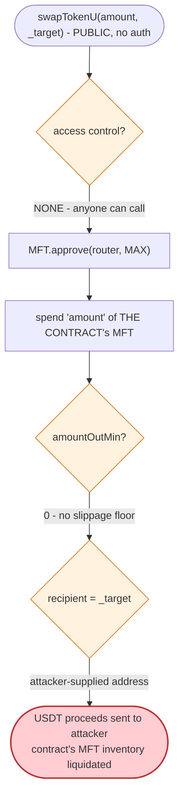

# Pledge Exploit — Permissionless `swapTokenU()` Drains the Contract's Token Holdings

> One unprotected public function lets anyone spend the Pledge contract's entire
> MFT balance on a swap and send the USDT proceeds to an attacker-chosen address.

> **Reproduction:** the PoC compiles & runs in an isolated Foundry project at
> [this project folder](.) (the umbrella DeFiHackLabs repo contains many unrelated
> PoCs that do not compile together, so this one was extracted).
> Full verbose trace: [output.txt](output.txt).
> Verified vulnerable source: [sources/Pledge_061944/Pledge.sol](sources/Pledge_061944/Pledge.sol).

---

## Key info

| | |
|---|---|
| **Loss** | ~$15K — **14,994.30 USDT** swapped out to the attacker |
| **Vulnerable contract** | `Pledge` — [`0x061944c0f3c2d7DABafB50813Efb05c4e0c952e1`](https://bscscan.com/address/0x061944c0f3c2d7DABafB50813Efb05c4e0c952e1#code) |
| **Victim pool** | MFT/USDT PancakeSwap pair — `0x8b98e36dFF7E5aD41b304FFF2aCf1D3D2368384A` |
| **Tokens** | MFT `0x4E5A19335017D69C986065B21e9dfE7965f84413` → USDT (BSC-USD) `0x55d398326f99059fF775485246999027B3197955` |
| **Attacker EOA** | `0x59367b057055fd5d38ab9c5f0927f45dc2637390` |
| **Attacker contract** | `0x4aa0548019bfecd343179d054b1c7fa63e1e0b6c` |
| **Attack tx** | [`0x63ac9bc4e53dbcfaac3a65cb90917531cfdb1c79c0a334dda3f06e42373ff3a0`](https://bscscan.com/tx/0x63ac9bc4e53dbcfaac3a65cb90917531cfdb1c79c0a334dda3f06e42373ff3a0) |
| **Chain / block / date** | BSC / 44,555,337 / December 2024 |
| **Compiler** | Solidity v0.8.26, optimizer **200 runs** |
| **Bug class** | Missing access control on an asset-spending function (arbitrary recipient) |

---

## TL;DR

`Pledge` is a staking/referral ("pledge") front-end contract that holds a large
balance of its own project token, **MFT**. To convert its MFT holdings into USDT
it exposes a helper, `swapTokenU(uint256 amount, address _target)`
([Pledge.sol:1510-1522](sources/Pledge_061944/Pledge.sol#L1510-L1522)).

That helper is **`public`, has no access control, hard-codes `amountOutMin = 0`,
and routes the swap output to an arbitrary `_target` passed by the caller.** It
approves PancakeRouter for the contract's MFT and swaps `amount` MFT → USDT,
delivering the USDT to whatever address the caller names.

The attack is a single call. The attacker:

1. Reads the Pledge contract's MFT balance — **989,644,233.34 MFT** (essentially the
   entire MFT supply was parked in this contract).
2. Calls `swapTokenU(989,644,233.34 MFT, attacker)`.
3. Pledge approves the router and swaps **its own** 989.6M MFT into USDT, sending the
   **14,994.30 USDT output straight to the attacker**.

No flash loan, no price manipulation, no capital. The attacker spends nothing of its
own — it simply tells the contract to sell the protocol's assets and hand the
attacker the proceeds.

---

## Background — what Pledge does

`Pledge` ([source](sources/Pledge_061944/Pledge.sol)) is a thin front-end /
adapter around an external "MainPledge" staking contract (`cc`). Its job:

- Accept USDT stakes (`pledgeU`, [:1163-1181](sources/Pledge_061944/Pledge.sol#L1163-L1181)),
  split them across treasury addresses, and forward bookkeeping to `cc`.
- Distribute MFT rewards (`getReward`, [:1233-1237](sources/Pledge_061944/Pledge.sol#L1233-L1237)).
- Hold a large inventory of MFT and convert between MFT and USDT on PancakeSwap via a
  set of internal swap helpers (`swapToken`, `swapTokenU`, `swapTokenForFund`,
  `addLiquidityUsdt`).

The contract wires PancakeRouter V2 (`0x10ED43...`) in its constructor and pre-approves
USDT to it ([:1154-1161](sources/Pledge_061944/Pledge.sol#L1154-L1161)).

At the fork block the relevant balances were:

| Holder | Token | Balance |
|---|---|---:|
| **Pledge contract** | **MFT** | **989,644,233.34** |
| MFT/USDT pair `0x8b98e3…` | MFT (`balanceOf`) | 990,019,233.34 |
| MFT/USDT pair `0x8b98e3…` | MFT (stale `reserve0`) | 375,000.00 |
| MFT/USDT pair `0x8b98e3…` | USDT (`reserve1`) | 15,000.00 |

The whole game is the first row: the Pledge contract held essentially the entire MFT
float, and anyone could order it sold.

---

## The vulnerable code

### `swapTokenU` — public, no auth, attacker-chosen recipient

```solidity
function swapTokenU(uint256 amount, address _target) public {        // ⚠️ public, no onlyOwner
    IERC20(_token).approve(address(_swapRouter), MAX);               //    approve router for MFT
    address[] memory path = new address[](2);
    path[0] = _token;                                                //    MFT
    path[1] = _USDT;                                                 //    USDT
    _swapRouter.swapExactTokensForTokensSupportingFeeOnTransferTokens(
            amount,                                                  // ⚠️ caller-supplied amount of THE CONTRACT's MFT
            0,                                                       // ⚠️ amountOutMin = 0 (no slippage floor)
            path,
            _target,                                                 // ⚠️ caller-supplied recipient of the USDT
            block.timestamp
    );
}
```
[Pledge.sol:1510-1522](sources/Pledge_061944/Pledge.sol#L1510-L1522)

Three independent failures stack up in five lines:

1. **No access control.** The function is `public` with no `onlyOwner`/role check, so
   any address can invoke it. (Compare with the genuinely privileged setters like
   `withdraw`, which correctly carry `onlyOwner` — [:1312-1315](sources/Pledge_061944/Pledge.sol#L1312-L1315).)
2. **Spends the contract's own assets.** The swap uses `_token = MFT` from
   `balanceOf(address(this))`; the caller supplies `amount`, so the caller decides how
   much of the protocol's MFT to liquidate.
3. **Arbitrary recipient.** `_target` is forwarded as the swap's `to`, so the USDT
   output is sent wherever the caller says — i.e., to the attacker.

The internal caller `pledgeU` invokes it benignly with a tiny fixed amount and a
treasury recipient (`swapTokenU(100000000000000, _5uAddress)`,
[:1178](sources/Pledge_061944/Pledge.sol#L1178)). That intended usage shows the
function was meant to be *internal plumbing* — but it was left `public`.

### Sibling functions with the same flaw

The same "public, unprotected, spends contract funds" pattern repeats:

- `swapToken(uint256, address)` — [:1524-1538](sources/Pledge_061944/Pledge.sol#L1524-L1538) (sells the contract's USDT for MFT to any recipient)
- `swapTokenForFund(uint256)` — [:1497-1508](sources/Pledge_061944/Pledge.sol#L1497-L1508)
- `addLiquidityUsdt(uint256, uint256)` — [:1540-1553](sources/Pledge_061944/Pledge.sol#L1540-L1553)
- `withdrawTokens()` — [:1300-1303](sources/Pledge_061944/Pledge.sol#L1300-L1303) (sends all contract USDT to `_uAddress`; `require(balance >= 0)` is always true)

`swapTokenU` was the one most directly profitable because the contract's MFT inventory
dwarfed everything else.

---

## Root cause — why it was possible

A function that **moves the protocol's own assets must be permissioned** (or
internal). `swapTokenU` is neither. It is the textbook "missing access control on a
fund-moving function" bug, made worse by an attacker-controlled output recipient:

> Anyone can call `swapTokenU(contractMFTBalance, attacker)` and the contract will
> dutifully approve the router, swap its entire MFT inventory, and forward the USDT to
> the attacker. The contract is, in effect, a public faucet for its own treasury.

The two design decisions that compose into the loss:

1. **Visibility error.** The helper was intended as internal plumbing for `pledgeU`
   (called there with a hard-coded small amount and a treasury recipient). Marking it
   `public` instead of `internal`/`private` exposed it as an entry point. There is no
   modifier guarding it.
2. **Caller-controlled recipient.** Even an unauthenticated swap that *kept the USDT
   inside the contract* would merely convert MFT→USDT in place (recoverable by the
   owner). By forwarding `_target` straight to the router's `to`, the proceeds leave
   the contract to an arbitrary address — turning a visibility bug into direct theft.

The economics of the surrounding pool made the payout immediate: the MFT/USDT pair
held 15,000 USDT against a (stale-synced) reserve, and dumping the contract's ~990M MFT
into it returned 14,994.30 USDT — ~99.96% of the pool's USDT. `amountOutMin = 0` meant
there was no slippage floor to stop the dump from being executed at any price.

---

## Preconditions

- The Pledge contract holds a non-trivial MFT balance (it held ~989.6M MFT — the bulk
  of the MFT float).
- A PancakeSwap MFT→USDT route exists with USDT liquidity to receive the proceeds
  (the MFT/USDT pair held 15,000 USDT).
- Nothing else. The function is permissionless, takes no fee from the caller, and the
  caller commits zero capital. No flash loan, no timing window.

---

## Attack walkthrough (with on-chain numbers from the trace)

All figures are taken directly from [output.txt](output.txt) (the `testExploit`
trace at [output.txt:1600-1660](output.txt)). The pair's `token0 = MFT`,
`token1 = USDT`.

| # | Step | Source | Effect |
|---|------|--------|--------|
| 0 | **Read target balance** — `IERC20(MFT).balanceOf(pledge)` → **989,644,233.34 MFT** | [trace:1608-1609](output.txt) | Attacker learns the exact amount to drain. |
| 1 | **Call `swapTokenU(989,644,233.34 MFT, attacker)`** | [trace:1610](output.txt) | Single permissionless entry. |
| 2 | Pledge `approve(router, MAX)` for MFT | [trace:1611-1615](output.txt) | Contract authorizes the router to pull its MFT. |
| 3 | Router `swapExactTokensForTokensSupportingFeeOnTransferTokens(989.6M, 0, [MFT,USDT], attacker, …)` | [trace:1616](output.txt) | `amountOutMin = 0`, recipient = attacker. |
| 4 | `transferFrom(pledge → pair, 989,644,233.34 MFT)` | [trace:1617-1624](output.txt) | Contract's entire MFT inventory pushed into the pair. |
| 5 | Pair `getReserves()` → `reserve0 = 375,000 MFT`, `reserve1 = 15,000 USDT` (stale); pair MFT `balanceOf` = 990,019,233.34 | [trace:1627-1630](output.txt) | Pool was heavily desynced (huge MFT balance vs. tiny synced reserve). |
| 6 | Pair `swap(0, 14,994.30 USDT out, to = attacker)` | [trace:1631-1648](output.txt) | USDT delivered to attacker. |
| 7 | Pair `Sync(reserve0 = 990,019,233.34 MFT, reserve1 = 5.6959 USDT)` | [trace:1642](output.txt) | Pool's USDT drained to ~5.70 USDT. |
| 8 | Attacker USDT balance | [trace:1655-1659](output.txt) | **14,994.30 USDT** (started at 0). |

Because the `SupportingFeeOnTransfer` variant computes the output from the *actual*
MFT balance delta the pair received (≈989.6M MFT) against its USDT reserve (15,000),
the swap returned almost the entire 15,000 USDT: `15,000 − 5.6959 = 14,994.30 USDT`.
The attacker put in **zero** of its own funds.

### Profit accounting (USDT)

| Direction | Amount |
|---|---:|
| Attacker capital committed | 0.00 |
| MFT spent — **belonged to the Pledge contract**, not the attacker | 989,644,233.34 MFT |
| USDT received by attacker | **14,994.30** |
| **Net profit** | **+14,994.30 USDT (~$15K)** |

The loss is borne by the Pledge protocol (its MFT inventory was sold off) and the
MFT/USDT liquidity providers (their USDT was drained to dust).

---

## Diagrams

### Sequence of the attack



### Pool / contract state evolution



### The flaw inside `swapTokenU`



---

## Remediation

1. **Restrict the function.** `swapTokenU`, `swapToken`, `swapTokenForFund`, and
   `addLiquidityUsdt` move the protocol's own assets and must not be public entry
   points. Mark them `internal`/`private`, or gate them with `onlyOwner` / a trusted
   keeper role. The intended call site (`pledgeU`) uses `swapTokenU` internally, so
   making it `internal` is sufficient and breaks nothing.
2. **Never let the caller pick the recipient.** For asset-spending swaps, hard-code the
   recipient to `address(this)` (or a fixed treasury). Forwarding a caller-supplied
   `_target` to the router's `to` turns any unauthenticated swap into outright theft.
3. **Set a real `amountOutMin`.** Passing `0` disables slippage protection entirely.
   Compute a minimum from an oracle/TWAP so a swap cannot be executed at an absurd
   price (also protects against sandwiching even in the benign path).
4. **Fix `withdrawTokens`.** `require(balance >= 0)` is always true; either remove the
   bogus guard and add `onlyOwner`, or delete the function. It currently lets anyone
   sweep all contract USDT to a fixed address.
5. **Audit visibility defaults.** Several helpers were left `public` that were clearly
   meant to be internal. Default to the most restrictive visibility and only widen with
   an explicit, reviewed reason.

---

## How to reproduce

The PoC was extracted into a standalone Foundry project (the umbrella DeFiHackLabs repo
has many unrelated PoCs that fail to compile under `forge test`'s whole-project build):

```bash
_shared/run_poc.sh 2024-12-Pledge_exp -vvvvv
```

- RPC: a **BSC archive** endpoint is required (fork block 44,555,337).
  `foundry.toml` uses `https://bsc-mainnet.public.blastapi.io`, which serves historical
  state at that block; most public BSC RPCs prune it and fail with `header not found` /
  `missing trie node`.
- The PoC's `BUSD` constant `0x55d398…` is actually **BSC-USD (Binance-Peg USDT)** — the
  `balanceLog` modifier reports it as "USDT".
- Result: `[PASS] testExploit()` with the attacker ending holding ~14,994 USDT.

Expected tail:

```
Ran 1 test for test/Pledge_exp.sol:Pledge
[PASS] testExploit() (gas: 200804)
  Attacker Before exploit USDT Balance: 0.000000000000000000
  Attacker After exploit USDT Balance: 14994.304057738361451515

Suite result: ok. 1 passed; 0 failed; 0 skipped
```

---

*Reference: DeFiHackLabs — Pledge, BSC, ~$15K, December 2024. PoC header:
[test/Pledge_exp.sol](test/Pledge_exp.sol).*
