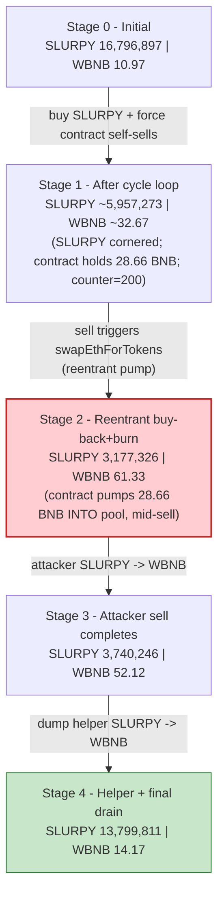
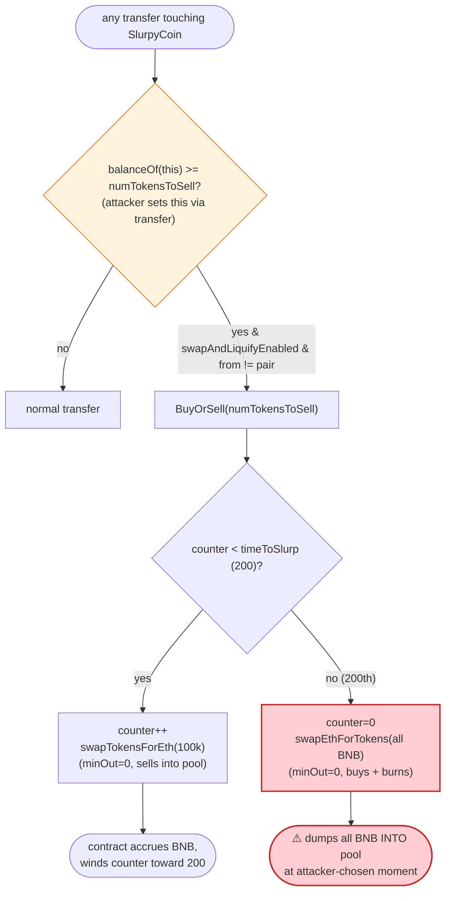

# SlurpyCoin Exploit — Attacker-Timed Token-Owned `BuyOrSell` Pool Manipulation

> One-liner: SLURPY's tokenomics contract performs *its own* swaps against the SLURPY/WBNB pool on every
> transfer once it holds enough SLURPY; an attacker fed the contract SLURPY to control **when** that
> self-swap fires, wrapped the contract's reentrant "buy-back-and-burn" inside their own sell, and walked
> off with the pool's WBNB.

> **Reproduction:** the PoC compiles & runs in this isolated Foundry project at
> [this project folder](.) (the umbrella DeFiHackLabs repo contains several unrelated PoCs that do not
> whole-compile, so this one was extracted).
> Full verbose trace: [output.txt](output.txt).
> Verified vulnerable source: [sources/SlurpyCoin_72c114/SlurpyCoin.sol](sources/SlurpyCoin_72c114/SlurpyCoin.sol).
> PoC test: [test/SlurpyCoin_exp.sol](test/SlurpyCoin_exp.sol).

---

## Key info

| | |
|---|---|
| **Loss** | ~$3K (reported). PoC nets **7.4118 BNB** of pool WBNB, intra-transaction, off a 40 WBNB flash loan |
| **Vulnerable contract** | `SlurpyCoin` — [`0x72c114A1A4abC65BE2Be3E356eEde296Dbb8ba4c`](https://bscscan.com/address/0x72c114A1A4abC65BE2Be3E356eEde296Dbb8ba4c#code) |
| **Victim pool** | SLURPY/WBNB PancakeSwap V2 pair — `0x76A5a2Ef4AE2DdEAD0c8D5b704808637B414113C` |
| **Flash-loan source** | DODO `DPP` pool — `0x6098A5638d8D7e9Ed2f952d35B2b67c34EC6B476` |
| **Attacker EOA** | [`0x132d9bbdbe718365af6cc9e43bac109a9a53b138`](https://bscscan.com/address/0x132d9bbdbe718365af6cc9e43bac109a9a53b138) |
| **Attacker contract** | [`0x051e057ea275caf9a73578a97af6e8965e5a2349`](https://bscscan.com/address/0x051e057ea275caf9a73578a97af6e8965e5a2349) |
| **Attack tx** | [`0x6c729ee778332244de099ba0cb68808fcd7be4a667303fcdf2f54dd4b3d29051`](https://bscscan.com/tx/0x6c729ee778332244de099ba0cb68808fcd7be4a667303fcdf2f54dd4b3d29051) |
| **Chain / block / date** | BSC / fork at 44,990,634 (attack at 44,990,635) / ~Dec 18, 2024 |
| **Compiler** | Solidity v0.6.12, optimizer **200 runs** |
| **Bug class** | Token-owned AMM self-swap with attacker-controlled timing + reentrant reserve manipulation |

---

## TL;DR

`SlurpyCoin` is a "reflection + auto-liquidity" meme token. Its `_transfer` hook contains a
`BuyOrSell()` routine ([SlurpyCoin.sol:1123-1138](sources/SlurpyCoin_72c114/SlurpyCoin.sol#L1123-L1138))
that fires automatically whenever the **token contract's own SLURPY balance** reaches `numTokensToSell`
(100,000 SLURPY). For the first `timeToSlurp = 200` firings it *sells* 100k SLURPY into the pool for BNB
(`swapTokensForEth`); on the 200th firing it flips to *buying* SLURPY back with the accumulated BNB and
**burning** it (`swapEthForTokens`).

Two design facts make this exploitable:

1. **The attacker controls when `BuyOrSell` fires** — anyone can credit the contract with SLURPY simply by
   calling `slurpy.transfer(SLURPY_ADDR, amount)`; the *next* transfer then trips the
   `contractTokenBalance >= numTokensToSell` gate and runs the self-swap.
2. **The self-swap runs *inside* the caller's transaction, against live reserves** — so the attacker can
   sandwich their own trades around it, and can force the expensive "buy-back-and-burn" to fire **reentrantly
   in the middle of their own sell**, inflating the pool's WBNB reserve exactly when they are selling.

The attacker:

1. **Flash-borrows 40 WBNB** from DODO's `DPP` pool.
2. **Repeatedly buys 1.3M SLURPY** from the pool (16 rounds) while, between buys, feeding the contract 100k
   SLURPY at a time so its `BuyOrSell` keeps **selling 100k SLURPY into the pool for BNB** — done **194 times**,
   driving the internal `counter` up to the `timeToSlurp = 200` threshold. The contract quietly accrues
   **28.66 BNB**.
3. When `counter` hits 200, the next `BuyOrSell` flips to **`swapEthForTokens`** and spends the contract's
   28.66 BNB to buy 2.78M SLURPY (sent to the owner) and **burn 2.64M** of it — and this fires **reentrantly
   while the attacker's own 574k-SLURPY sell is in flight**, pumping the pool's WBNB reserve from 32.67 → 61.33
   right under the attacker's sell.
4. **Dumps all remaining SLURPY** (its own + 8 helper contracts' holdings) into the WBNB-rich pool.
5. **Repays the 40 WBNB loan**, unwraps the rest → **+7.4118 BNB**.

---

## Background — what SlurpyCoin does

`SlurpyCoin` ([source](sources/SlurpyCoin_72c114/SlurpyCoin.sol)) is a Solidity-0.6 SafeMoon-style token:

- **Reflection accounting** (`_rOwned`/`_tOwned`, `_getRate`) with a configurable tax + liquidity fee.
- **`maxTxAmount` / `whaleCap`** anti-whale limits ([:784-789](sources/SlurpyCoin_72c114/SlurpyCoin.sol#L784-L789)).
- **An "auto-liquidity" engine** (`BuyOrSell`) bolted into `_transfer`. This is the vulnerable part.

The on-chain state at the fork block:

| Item | Value |
|---|---|
| `numTokensToSell` | `100,000 SLURPY` — the contract-balance trigger for `BuyOrSell` |
| `_maxTxAmount` | `5,000,000 SLURPY` |
| `timeToSlurp` | `200` — # of sell-firings before a buy-back-and-burn |
| `_taxFee` / `_liquidityFee` (after `endPresale`) | `3% / 2%` ⇒ **5% fee-on-transfer** |
| `swapAndLiquifyEnabled` | `true` |
| Pool `token0 = SLURPY`, `token1 = WBNB` | reserves below |
| **Initial pool reserves** | **16,796,897.21 SLURPY / 10.9657 WBNB** ([output.txt:33](output.txt)) |

Because the 5% liquidity fee on every pool sell sends SLURPY to the token contract
(`_takeLiquidity`, [:1030-1036](sources/SlurpyCoin_72c114/SlurpyCoin.sol#L1030-L1036)), the contract *naturally*
accumulates SLURPY during trading — but the attacker doesn't need to wait: a direct
`transfer(SLURPY_ADDR, 100_000e18)` credits the contract instantly.

---

## The vulnerable code

### 1. `_transfer` auto-fires `BuyOrSell` on the contract's own balance

```solidity
function _transfer(address from, address to, uint256 amount) private {
    ...
    uint256 contractTokenBalance = balanceOf(address(this));          // ← contract's own SLURPY
    if (contractTokenBalance >= _maxTxAmount) contractTokenBalance = _maxTxAmount;

    bool overMinTokenBalance = contractTokenBalance >= numTokensToSell; // ≥ 100k SLURPY ?
    if (
        overMinTokenBalance &&
        !inSwapAndLiquify &&
        from != uniswapV2Pair &&        // ← only blocks pair-as-sender; attacker is the sender
        swapAndLiquifyEnabled
    ) {
        contractTokenBalance = numTokensToSell;
        BuyOrSell(contractTokenBalance);   // ⚠️ fires on a balance the attacker can set
    }
    ...
    _tokenTransfer(from, to, amount, takeFee);
}
```

[SlurpyCoin.sol:1077-1121](sources/SlurpyCoin_72c114/SlurpyCoin.sol#L1077-L1121)

### 2. `BuyOrSell` — sells into the pool, then buys-and-burns

```solidity
function BuyOrSell(uint256 contractTokenBalance) private lockTheSwap {
    if (counter < timeToSlurp) {           // first 200 firings
        counter++;
        swapTokensForEth(contractTokenBalance);   // ⚠️ contract dumps 100k SLURPY into pool for BNB
    } else {                               // 200th firing
        counter = 0;
        uint256 bal = address(this).balance;
        removeAllFee();
        swapEthForTokens(bal);             // ⚠️ contract spends ALL its BNB to buy SLURPY + burn
        restoreAllFee();
    }
}
```

[SlurpyCoin.sol:1123-1138](sources/SlurpyCoin_72c114/SlurpyCoin.sol#L1123-L1138)

```solidity
function swapTokensForEth(uint256 tokenAmount) private {
    address[] memory path = new address[](2);
    path[0] = address(this); path[1] = uniswapV2Router.WETH();
    _approve(address(this), address(uniswapV2Router), tokenAmount);
    uniswapV2Router.swapExactTokensForETHSupportingFeeOnTransferTokens(
        tokenAmount, 0 /* any */, path, address(this), block.timestamp);   // ⚠️ minOut = 0
}

function swapEthForTokens(uint256 ethAmount) private {
    address[] memory path = new address[](2);
    path[0] = uniswapV2Router.WETH(); path[1] = address(this);
    uint256 ownerBal = balanceOf(owner());
    uniswapV2Router.swapExactETHForTokens{value: ethAmount}(
        0 /* any */, path, owner(), block.timestamp);                      // ⚠️ minOut = 0, buys at any price
    uint256 amountBurn = balanceOf(owner()).sub(ownerBal);
    _transferStandard(owner(), address(0), amountBurn);                    // burn the bought SLURPY
}
```

[SlurpyCoin.sol:1140-1176](sources/SlurpyCoin_72c114/SlurpyCoin.sol#L1140-L1176)

Both swaps pass `0` as `amountOutMin`, so the contract trades against the pool at **whatever price the
attacker has manipulated it to** — there is no slippage protection, and the trade is executed at a moment of
the attacker's choosing inside the attacker's own transaction.

---

## Root cause — why it was possible

A token must not perform **unbounded, externally-timed swaps against its own liquidity pool using the
pool's price.** SlurpyCoin does exactly that, and hands the trigger to anyone:

1. **Attacker-chosen trigger.** `BuyOrSell` fires when `balanceOf(address(this)) >= numTokensToSell`. Anyone
   can satisfy that with a single `transfer(SLURPY_ADDR, 100_000e18)`. The only "guard"
   (`from != uniswapV2Pair`) blocks the *pair* from being the sender, not the attacker.
2. **Self-swap runs against live, manipulable reserves with `minOut = 0`.** `swapTokensForEth` and
   `swapEthForTokens` route through PancakeSwap at the current price. The attacker first skews that price
   (by cornering SLURPY) and then lets the contract trade at the skewed price.
3. **`counter`/`timeToSlurp` is a free reserve pump the attacker can schedule.** By firing the cheap "sell"
   path 194 times the attacker (a) loads the contract with 28.66 BNB and (b) winds `counter` up to 200, so
   the *next* fire is the expensive **buy-back-and-burn**. The attacker then triggers that fire **reentrantly,
   in the middle of its own large SLURPY→WBNB sell**, so the contract dumps 28.66 BNB *into* the pool — pushing
   the WBNB reserve from 32.67 → 61.33 — exactly while the attacker is selling SLURPY for that WBNB.
4. **No reentrancy isolation around the pool.** `lockTheSwap` only sets `inSwapAndLiquify` to prevent
   *recursive* `BuyOrSell`; it does nothing to stop the self-swap from executing *within* an attacker's
   PancakeSwap call and altering the reserves the attacker is mid-trade against.

In short, the attacker turned SlurpyCoin's own "auto-liquidity" engine into a programmable price-pump that
they could fire at the precise instant it benefited them.

---

## Preconditions

- `swapAndLiquifyEnabled == true` and presale ended (both true on-chain after `endPresale`).
- The attacker can credit the token contract with ≥ `numTokensToSell` SLURPY (trivially, via `transfer`),
  and can buy SLURPY from the pool to corner it.
- Working WBNB capital to corner the pool and feed the cycles; it is fully recovered intra-transaction,
  hence **flash-loanable** (the PoC borrows 40 WBNB from DODO `DPP`).
- The 5% fee-on-transfer and the `counter`/`timeToSlurp` cadence are exploited as designed — no admin action
  is required.

---

## Attack walkthrough (with on-chain numbers from the trace)

Pair `token0 = SLURPY` (`reserve0`), `token1 = WBNB` (`reserve1`). All figures below come from the `Sync`
events in [output.txt](output.txt).

| # | Step | SLURPY reserve | WBNB reserve | Effect |
|---|------|---------------:|-------------:|--------|
| 0 | **Initial** ([output.txt:33](output.txt)) | 16,796,897.21 | 10.9657 | Honest pool. |
| 1 | **Flash loan**: borrow 40 WBNB from DODO `DPP` | 16,796,897.21 | 10.9657 | Working capital acquired. |
| 2 | **Cycle loop** (16× buy 1.3M SLURPY + 194× contract self-sells of 100k SLURPY) | ~5,957,273 | ~32.67 ([output.txt:12117](output.txt)) | Attacker corners SLURPY; contract self-sells dump SLURPY in & pull BNB out → contract holds **28.66 BNB**; `counter` reaches 200. |
| 3 | **Attacker sells 574,574 SLURPY** → triggers reentrant `BuyOrSell` (now buy-back path) | — | — | Sell of SLURPY *also* trips the contract-balance gate mid-swap. |
| 3a | ↳ contract `swapEthForTokens(28.66 BNB)`: buys 2,779,946 SLURPY → owner, **burns 2,640,949** ([output.txt:12153-12171](output.txt)) | 3,177,326 | **61.33** ([output.txt:12165](output.txt)) | ⚠️ Contract pumps 28.66 BNB **into** the pool, WBNB reserve nearly doubles, mid-attacker-sell. |
| 3b | ↳ attacker's sell completes: receives **9.2113 WBNB** ([output.txt:12191-12203](output.txt)) | 3,740,246 | 52.12 | Attacker sells at the inflated WBNB reserve. |
| 4 | **Helper drain loop**: 8 helper contracts (each pre-bought 1.3M SLURPY) `widthdraw()` to attacker, who sells each batch | rising | falling | Each ~1.2M-SLURPY sell pulls ~1.35 WBNB; reserves walk toward SLURPY-heavy. |
| 5 | **Final sells** of remaining SLURPY ([output.txt:12856-12911](output.txt)) | **13,799,811** | **14.1698** ([output.txt:12910](output.txt)) | Pool left SLURPY-heavy, WBNB drained to the attacker. |
| 6 | **Repay 40 WBNB** to DODO ([output.txt:12923](output.txt)); unwrap remainder | 13,799,811 | 14.1698 | Contract holds 47.4118 WBNB → repay 40 → **7.4118 WBNB** kept → unwrap to BNB. |

The attacker's per-round corner-buy cost rose from **0.922 WBNB → 5.875 WBNB** for the same 1.3M SLURPY
([output.txt buy inputs](output.txt)) as SLURPY became scarce — confirming the pool was being progressively
cornered before the reentrant pump.

### Profit accounting (WBNB)

| Item | Amount (WBNB) |
|---|---:|
| Flash loan in (DODO) | 40.0000 |
| Token-contract balance at end (pre-repay) | 47.4118 |
| Flash loan repaid | −40.0000 |
| **Net profit (unwrapped to BNB)** | **+7.4118** |

`testExploit` balance log: attacker BNB `0 → 7.411804202305118343` ([output.txt:5-7](output.txt)).

---

## Diagrams

### Sequence of the attack

```mermaid
sequenceDiagram
    autonumber
    actor A as "Attacker contract"
    participant D as "DODO DPP pool"
    participant R as PancakeRouter
    participant P as "SLURPY/WBNB pair"
    participant T as "SlurpyCoin (token)"

    Note over P: Initial reserves<br/>16,796,897 SLURPY / 10.9657 WBNB

    A->>D: flashLoan(40 WBNB)
    D-->>A: 40 WBNB

    rect rgb(255,243,224)
    Note over A,T: Cycle loop — corner SLURPY + load the contract with BNB
    loop 16 rounds
        A->>R: swapTokensForExactTokens(WBNB -> 1.3M SLURPY)
        R->>P: swap()
        loop up to 15 inner
            A->>T: transfer(SLURPY_ADDR, 100k SLURPY)
            A->>T: transfer(self, 1 wei)  // trip the gate
            T->>T: _transfer -> BuyOrSell (counter<200)
            T->>R: swapTokensForEth(100k SLURPY)
            R->>P: swap() -> BNB to token contract
        end
    end
    Note over T: contract holds ~28.66 BNB; counter == 200
    Note over P: ~5,957,273 SLURPY / ~32.67 WBNB
    end

    rect rgb(255,235,238)
    Note over A,T: The pump — buy-back-and-burn fires inside the attacker's sell
    A->>R: swapExactTokensForTokens(574,574 SLURPY -> WBNB)
    R->>P: transferFrom(attacker -> pair)
    P->>T: token _transfer hook
    T->>T: BuyOrSell (counter==200) -> swapEthForTokens(28.66 BNB)
    T->>R: swapExactETHForTokens(28.66 BNB -> SLURPY -> owner)
    R->>P: swap()  // 28.66 BNB INTO pool
    Note over P: 3,177,326 SLURPY / 61.33 WBNB  (WBNB pumped)
    T->>P: burn 2,640,949 SLURPY (owner -> 0x0)
    R-->>A: 9.2113 WBNB for the 574,574 SLURPY sell
    end

    rect rgb(243,229,245)
    Note over A,T: Drain
    loop 8 helpers + final sells
        A->>R: sell SLURPY -> WBNB
        R->>P: swap()
        P-->>A: WBNB out
    end
    Note over P: 13,799,811 SLURPY / 14.1698 WBNB
    end

    A->>D: repay 40 WBNB
    Note over A: keep +7.4118 WBNB -> unwrap to BNB
```

### Pool state evolution



### The flaw inside `_transfer` / `BuyOrSell`



---

## Why each magic number

- **40 WBNB flash loan** — working capital to corner the pool and cover the cycle; the pool only had ~11
  WBNB initially, so the attacker also *injects* WBNB by buying, then recovers it.
- **16 outer × ~15 inner cycles** — sized so the contract self-sells fire **194 times**, pushing `counter`
  from its on-chain start to exactly `timeToSlurp = 200`, so the **next** `BuyOrSell` is the buy-back-and-burn.
- **100,000 SLURPY per transfer** — exactly `numTokensToSell`, the minimum to trip the `BuyOrSell` gate each
  cycle while loading the contract with BNB.
- **1.3M SLURPY corner buys** — large enough to make SLURPY scarce in the pool (corner-buy cost climbs
  0.92 → 5.87 WBNB) so the contract's self-sells return more BNB and the later pump is more violent.
- **574,574 SLURPY first sell** — the sell that, combined with the fee-accrued contract balance, trips the
  200th `BuyOrSell`, firing the 28.66-BNB buy-back-and-burn *while the attacker is selling*.

---

## Remediation

1. **Do not let a token swap against its own pool on user-triggered transfers.** Remove the `BuyOrSell` hook
   from `_transfer`, or restrict the auto-liquidity engine to a trusted keeper/owner call that runs in its own
   transaction (never reentrantly inside a user's PancakeSwap call).
2. **Never use `amountOutMin = 0` for protocol-owned swaps.** `swapTokensForEth` / `swapEthForTokens` must set
   a slippage bound derived from a manipulation-resistant price (TWAP/oracle), so the engine cannot be made to
   trade at an attacker-skewed spot price.
3. **Don't key the trigger on the contract's own, externally-creditable balance.** `balanceOf(address(this)) >=
   numTokensToSell` is satisfiable by anyone via a direct `transfer`. Track the swappable amount via internal
   accounting that only increases through fee accrual, and/or gate the engine behind time/role checks the
   attacker cannot schedule.
4. **Isolate the engine from reentrancy into the AMM.** A real `nonReentrant` guard on the whole transfer path
   (not just an `inSwapAndLiquify` recursion flag) prevents the self-swap from executing within an attacker's
   in-flight swap and mutating the reserves they are trading against.
5. **Cap single-operation reserve impact.** Any protocol action that can move a pool reserve by more than a few
   percent in one call should revert — a 28.66-BNB pump into a ~33-WBNB pool is a clear red flag.

---

## How to reproduce

The PoC was extracted into a standalone Foundry project (the umbrella DeFiHackLabs repo has several unrelated
PoCs that fail under a whole-project `forge build`):

```bash
_shared/run_poc.sh 2024-12-SlurpyCoin_exp --match-test testExploit -vvvvv
```

- RPC: a **BSC archive** endpoint is required (fork block 44,990,634). `foundry.toml` uses
  `https://bsc-mainnet.public.blastapi.io`, which serves historical state at that block; most public BSC RPCs
  prune it and fail with `header not found` / `429` rate limits (the rotated `onfinality` default was swapped
  for `blastapi` here).
- Result: `[PASS] testExploit()` with attacker BNB `0 → 7.4118`.

Expected tail:

```
Ran 1 test for test/SlurpyCoin_exp.sol:SlurpyCoin
[PASS] testExploit() (gas: 33791644)
Logs:
  Attacker Before exploit BNB Balance: 0.000000000000000000
  Attacker After exploit BNB Balance: 7.411804202305118343

Suite result: ok. 1 passed; 0 failed; 0 skipped
```

---

*Reference: CertiK Alert — https://x.com/CertiKAlert/status/1869580379675590731 (SLURPY, BSC, ~$3K).*
