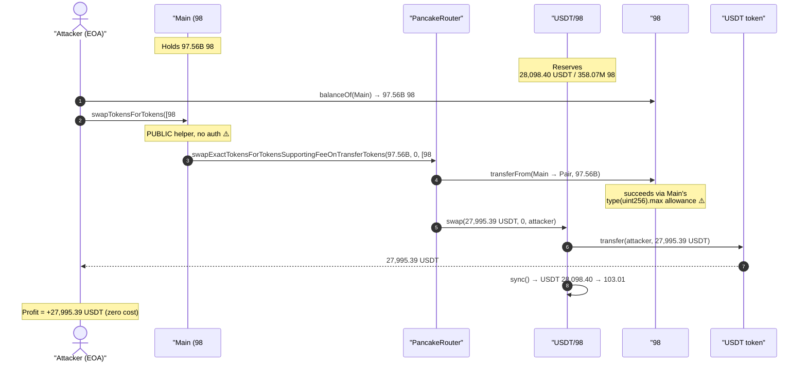
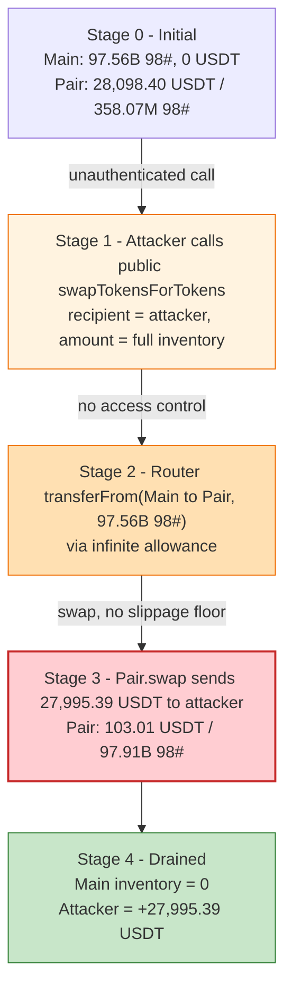
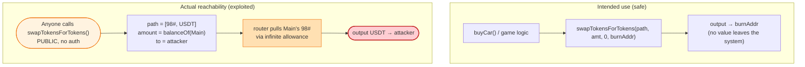

# 98Token ("98#") Exploit — Unprotected `public swapTokensForTokens()` Drains the Contract's Token Reserve

> **One-liner:** A helper that swaps the contract's *own* tokens was left `public`, so anyone could
> point the swap output at themselves and drain ~28K USDT worth of the project's pre-approved 98# tokens.

> **Reproduction:** the PoC compiles & runs in an isolated Foundry project at
> [this project folder](.) (the umbrella DeFiHackLabs repo does not whole-compile, so this PoC was
> extracted). Full verbose trace: [output.txt](output.txt).
> Verified vulnerable source: [sources/Main_B040D8/Main_extracted.sol](sources/Main_B040D8/Main_extracted.sol)
> (extracted from the Etherscan standard-json [Main.sol](sources/Main_B040D8/Main.sol)).

---

## Key info

| | |
|---|---|
| **Loss** | ~$28K — **27,995.39 USDT** swept out of the USDT/98# PancakeSwap pair |
| **Vulnerable contract** | `Main` ("98#" GameFi) — [`0xB040D88e61EA79a1289507d56938a6AD9955349C`](https://bscscan.com/address/0xB040D88e61EA79a1289507d56938a6AD9955349C#code) |
| **Drained asset** | 97,555,900,794.95 **98#** ([`0xc0dDfD66420ccd3a337A17dD5D94eb54ab87523F`](https://bscscan.com/address/0xc0dDfD66420ccd3a337A17dD5D94eb54ab87523F#code), symbol `98#`) held by `Main`, swapped → 27,995.39 USDT |
| **Victim pool** | USDT/98# PancakeSwap V2 pair — [`0xa0ad4B45dc432e950f9e62AAA46995CE40ef4a11`](https://bscscan.com/address/0xa0ad4B45dc432e950f9e62AAA46995CE40ef4a11) (token0 = USDT, token1 = 98#) |
| **Router** | PancakeRouter `0x10ED43C718714eb63d5aA57B78B54704E256024E` (pre-approved `type(uint256).max` by `Main`) |
| **Attacker** | reporter / tx by TenArmor — see [@TenArmorAlert](https://x.com/TenArmorAlert/status/1875462686353363435) |
| **Attack tx** | [`0x61da5b502a62d7e9038d73e31ceb3935050430a7f9b7e29b9b3200db3095f91d`](https://app.blocksec.com/explorer/tx/bsc/0x61da5b502a62d7e9038d73e31ceb3935050430a7f9b7e29b9b3200db3095f91d) |
| **Chain / block / date** | BSC / 45,462,898 (fork at 45,462,897) / 2025-01-04 ~05:50 UTC |
| **Compiler** | Solidity v0.8.25, optimizer **1 run** |
| **Bug class** | Missing access control — internal helper exposed as `public` (unprotected function) |

---

## TL;DR

The `Main` contract is a "car-racing / guild" GameFi app whose reward token is **98#**. To run its
game economy it embeds thin wrappers around the PancakeSwap router and, in its constructor,
**pre-approves the router for `type(uint256).max`** on both USDT and 98#
([Main_extracted.sol:120-121](sources/Main_B040D8/Main_extracted.sol#L120-L121)). It also keeps a
huge inventory of 98# inside itself (≈ **97.56 billion** 98# at the fork block) to pay out game rewards.

One of those router wrappers, `swapTokensForTokens(path, tokenAmount, tokenOutMin, to)`, is declared
**`public`** ([Main_extracted.sol:41-49](sources/Main_B040D8/Main_extracted.sol#L41)). It takes a
**caller-controlled swap path, amount, and recipient**, and executes
`swapExactTokensForTokensSupportingFeeOnTransferTokens` spending the **contract's** balance (because
the router pulls tokens from `msg.sender` of the router call, which is `Main`, via `Main`'s standing
max approval).

Internally the protocol only ever calls this helper with `to = burnAddr`
([Main_extracted.sol:184](sources/Main_B040D8/Main_extracted.sol#L184)). But because it's public and
unguarded, the attacker simply called it directly:

```solidity
swapTokensForTokens(
    [98#, USDT],                    // path: sell the contract's own 98#
    Token.balanceOf(swapContract),  // 97,555,900,794.95 98#  (the entire inventory)
    0,                              // no slippage floor
    address(attacker)               // send the USDT to me
);
```

`Main` dumped its entire 98# inventory into the USDT/98# pair and the **27,995.39 USDT** that came out
was sent straight to the attacker. The whole exploit is a **single external call** — no flash loan,
no capital, no setup.

---

## Background — what the protocol does

`Main` ([source](sources/Main_B040D8/Main_extracted.sol)) is a USDT-priced GameFi "racing club":

- **`buyCar`/`raceCar`/`addGuild`** ([:161-240](sources/Main_B040D8/Main_extracted.sol#L161-L240)) —
  users pay USDT to buy cars, race, or join guilds and receive 98# rewards via `sendToken`.
- **`sendToken`** ([:265-274](sources/Main_B040D8/Main_extracted.sol#L265-L274)) — transfers 98# out
  of the contract's own balance, priced from a live `getAmountsOut` quote. This is why `Main` keeps a
  massive 98# inventory on hand.
- **Router wrappers** — `Main` inherits a `PancakeRouter` base contract
  ([:31-63](sources/Main_B040D8/Main_extracted.sol#L31-L63)) that wraps the real PancakeRouter so the
  game logic can swap and add liquidity. E.g. `buyCar` swaps half the paid USDT into 98# to the burn
  address ([:184](sources/Main_B040D8/Main_extracted.sol#L184)).
- **Constructor approvals** — to make those wrappers work without re-approving every call, the
  constructor grants the router an **infinite allowance** on both tokens
  ([:120-121](sources/Main_B040D8/Main_extracted.sol#L120-L121)).

On-chain state at the fork block (read via `cast`):

| Parameter | Value |
|---|---|
| 98# held by `Main` (the inventory) | **97,555,900,794.95** 98# (`9.7556e28` wei) |
| USDT held by `Main` | 0 |
| `Main` → PancakeRouter allowance on 98# | `type(uint256).max` |
| Pair USDT reserve (reserve0) | **28,098.40 USDT** ← the prize |
| Pair 98# reserve (reserve1) | 358,066,132.36 98# |

The contract holds a token inventory **and** a standing infinite approval to a swap router, and exposes
a public function that turns both into a withdrawal primitive for anyone.

---

## The vulnerable code

### 1. The public, unguarded swap helper

[sources/Main_B040D8/Main_extracted.sol:41-49](sources/Main_B040D8/Main_extracted.sol#L41-L49):

```solidity
contract PancakeRouter {
    IPancakeRouter public constant _IPancakeRouter =
        IPancakeRouter(0x10ED43C718714eb63d5aA57B78B54704E256024E);

    // ⚠️ PUBLIC — no onlyOwner / no internal — caller picks path, amount AND recipient
    function swapTokensForTokens(address[] memory path, uint256 tokenAmount, uint256 tokenOutMin, address to) public {
        _IPancakeRouter.swapExactTokensForTokensSupportingFeeOnTransferTokens(
            tokenAmount,
            tokenOutMin,   // ⚠️ caller can pass 0 → no slippage protection
            path,          // ⚠️ caller-controlled path (e.g. [98#, USDT])
            to,            // ⚠️ caller-controlled recipient → attacker
            block.timestamp + 60
        );
    }
    ...
    // ⚠️ same problem — addLiquidity wrapper is also public (:51-62)
    function addLiquidity(address tokenA, address tokenB, ...) public { ... }
}
```

`Main is PancakeRouter, Ownable` ([:65](sources/Main_B040D8/Main_extracted.sol#L65)), so both wrappers
are inherited as part of `Main`'s public ABI.

### 2. The standing infinite approval that arms it

[sources/Main_B040D8/Main_extracted.sol:116-121](sources/Main_B040D8/Main_extracted.sol#L116-L121):

```solidity
constructor(address initialOwner, uint256 time_) Ownable(initialOwner) {
    ...
    USDT.approve(address(_IPancakeRouter), type(uint256).max);   // infinite
    Token.approve(address(_IPancakeRouter), type(uint256).max);  // infinite ⚠️
    ...
}
```

### 3. The only legitimate use — always to `burnAddr`

[sources/Main_B040D8/Main_extracted.sol:179-185](sources/Main_B040D8/Main_extracted.sol#L179-L185):

```solidity
// inside buyCar(...)
swapTokensForTokens(path, usdtAmount/2, 0, burnAddr);   // internal use → recipient is burnAddr, never the caller
```

The developer evidently intended `swapTokensForTokens` to be an *internal* helper (it's only ever
invoked internally with a hard-coded recipient). Declaring it `public` turned an internal mechanism
into a free, permissionless withdrawal of the contract's pre-approved inventory.

---

## Root cause — why it was possible

The exploit composes three independent design facts that are each harmless alone:

1. **A swap helper spending the contract's own balance is `public`.** `swapTokensForTokens`
   has no `onlyOwner`, no `internal`, no `msg.sender` check. Anyone can call it.
2. **The recipient is fully caller-controlled.** The `to` argument is forwarded verbatim to the router,
   so the swap proceeds — `Main`'s tokens go in, the attacker's address comes out.
3. **The contract pre-approved the router for `type(uint256).max` and holds a large inventory.** The
   router's `transferFrom(Main → pair, amount)` succeeds for *any* amount because the allowance is
   infinite, so the attacker can specify `tokenAmount = balanceOf(Main)` and move the entire inventory
   in one call. (No `tokenOutMin` floor is enforced either — the attacker passed `0`.)

In short: the contract holds value + an infinite approval, and offers a public function that lets a
stranger direct that value through the approval to themselves. This is the canonical
**"unprotected function / missing access control"** bug, identical in shape to the classic
unprotected `transferFrom`/`approve`-and-swap drains.

The damage is bounded only by how much output liquidity the pool has: the attacker fed in 97.56 billion
98# but only realized **27,995.39 USDT** because that is essentially all the USDT the pair held
(28,098.40 → 103.01 USDT). The attacker effectively spent the contract's worthless-per-unit inventory
to vacuum the pool's entire USDT reserve.

---

## Preconditions

- The vulnerable `Main` contract holds a non-trivial 98# balance (it does: 97.56B 98#, used to pay game
  rewards). ✔
- `Main` has a live allowance to the router for that token (it does: `type(uint256).max` from the
  constructor). ✔
- The USDT/98# pair has USDT liquidity to extract (it does: 28,098 USDT). ✔
- **No attacker capital, no flash loan, no special role.** A single unauthenticated call drains it.

---

## Step-by-step attack walkthrough (with on-chain numbers from the trace)

The pair `0xa0ad4B45` has `token0 = USDT`, `token1 = 98#`, so `reserve0 = USDT`, `reserve1 = 98#`.
All numbers below are taken directly from the [trace](output.txt) (lines 1610-1654).

| # | Step | Call / Event | Value |
|---|------|--------------|------:|
| 0 | **Read inventory** | `token_98.balanceOf(swapContract)` ([output.txt:1614-1615](output.txt#L1614)) | 97,555,900,794.95 98# |
| 1 | **Attacker call** | `swapContract.swapTokensForTokens([98#,USDT], 9.7556e28, 0, attacker)` ([:1616](output.txt#L1616)) | — |
| 2 | **Wrapper → router** | `swapExactTokensForTokensSupportingFeeOnTransferTokens(9.7556e28, 0, …, attacker)` ([:1617](output.txt#L1617)) | — |
| 3 | **Router pulls `Main`'s 98#** | `98#.transferFrom(Main → pair, 9.7556e28)` succeeds via infinite allowance ([:1618-1623](output.txt#L1618)) | 97,555,900,794.95 98# in |
| 4 | **Pair swaps** | `pair.swap(27995.39 USDT, 0, attacker, 0x)` → `USDT.transfer(attacker, …)` ([:1630-1632](output.txt#L1630)) | 27,995.39 USDT out |
| 5 | **`Sync`** | reserves updated: USDT 28,098.40 → **103.01**, 98# inflated ([:1641-1642](output.txt#L1641)) | — |
| 6 | **Attacker balance** | `USDT.balanceOf(attacker)` ([:1652-1653](output.txt#L1652)) | **27,995.39 USDT** |

PancakeSwap `getAmountOut` check (fee 0.25% ⇒ ×9975/10000):

```
out = (97,555,900,794.95e18 · 9975 · 28,098.40e18)
      ─────────────────────────────────────────────  = 27,995.389614557975 USDT
      (358,066,132.36e18 · 10000 + 97,555,900,794.95e18 · 9975)
```

This equals the trace's `27,995.389614557976722846` to the wei — the attacker drained ~99.6% of the
pair's USDT reserve in a single swap.

### Profit / loss accounting

| Party | Asset | Before | After | Δ |
|---|---|---:|---:|---:|
| **Attacker** | USDT | 0 | 27,995.39 | **+27,995.39** |
| `Main` contract | 98# inventory | 97,555,900,794.95 | 0 | −97.56B 98# |
| USDT/98# pair | USDT reserve | 28,098.40 | 103.01 | **−27,995.39** |
| USDT/98# pair | 98# reserve | 358,066,132.36 | 97,913,966,927.31 | +97.56B (now worthless dust) |

Net: the attacker received **27,995.39 USDT (≈ $28K)** at zero cost. The protocol's 98# inventory
became the pool's now-near-worthless 98# reserve, and the pool's real USDT liquidity left with the
attacker.

---

## Diagrams

### Sequence of the attack



### Pool & contract state evolution



### The flaw — intended vs. actual reachability



---

## Remediation

1. **Make the helper non-public.** `swapTokensForTokens` (and the sibling `addLiquidity` wrapper at
   [:51](sources/Main_B040D8/Main_extracted.sol#L51)) spend the contract's own funds and should be
   `internal`, or guarded with `onlyOwner` / a keeper role. It is only ever used internally with a
   hard-coded `burnAddr` recipient, so `internal` is the correct visibility.
2. **Never expose a caller-controlled recipient on functions that move contract-owned assets.** If a
   public swap entry point is genuinely needed, force `to = address(this)` (or a fixed sink) rather than
   forwarding an arbitrary address.
3. **Avoid standing infinite approvals to a router that is reachable from public code.** Approve the
   exact amount immediately before each swap and reset to zero after, so a missing access-control check
   cannot be amplified into a full-inventory drain.
4. **Enforce slippage.** Forwarding `tokenOutMin = 0` lets the swap proceed against an empty/manipulated
   pool. Compute a real minimum from a trusted quote.
5. **Don't hold large liquid inventories in the same contract as swap primitives.** Keep reward
   inventory in a separate vault that only the game-logic contract (not the public) can pull from.

---

## How to reproduce

The PoC was extracted into a standalone Foundry project (the umbrella DeFiHackLabs repo has many
unrelated PoCs that fail to compile under a single `forge test` build):

```bash
_shared/run_poc.sh 2025-01-98Token_exp -vvvvv
```

- RPC: a **BSC archive** endpoint is required (fork block 45,462,897). `foundry.toml` uses
  `https://bsc-mainnet.public.blastapi.io`, which serves historical state at that block; most public
  BSC RPCs prune it and fail with `header not found` / `missing trie node`.
- Result: `[PASS] testExploit()` — attacker USDT goes 0 → 27,995.39.

Expected tail:

```
Ran 1 test for test/98Token_exp.sol:ContractTest
[PASS] testExploit() (gas: 120016)
  [Begin] Attacker USDT before exploit: 0.000000000000000000
  [End] Attacker USDT after exploit: 27995.389614557976722846
Suite result: ok. 1 passed; 0 failed; 0 skipped
```

---

*Reference: TenArmor alert — https://x.com/TenArmorAlert/status/1875462686353363435 (98#, BSC, ~$28K).*
