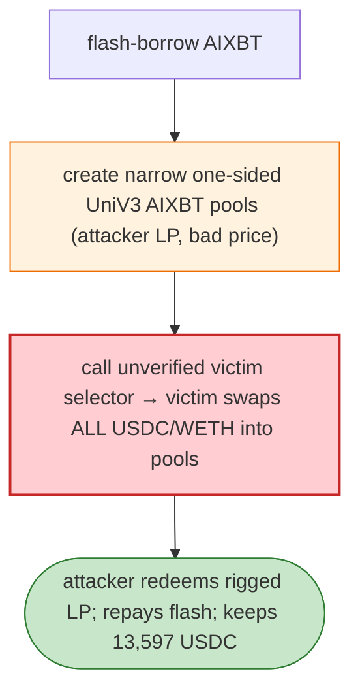

# AIXBT Forced-Swap Exploit — Unverified Victim Selector Swaps Full Balances into Attacker Pools

> **Reproduction:** the PoC compiles & runs in an isolated Foundry project at
> [this project folder](.). Full verbose trace: [output.txt](output.txt).
> Verified vulnerable source: [AgentToken (AIXBT)](sources/AgentToken_4F9Fd6).

---

## Key info

| | |
|---|---|
| **Loss** | 13,597.36 USDC (+ WETH); tx `0x5a7462b7…` |
| **Vulnerable contract** | AIXBT victim contract `0x32cd8541…` (Base) |
| **Attacker** | `0x312b559b…` (contract `0x4f3a1aeb…`) |
| **Chain / block / date** | Base / Jan 2025 |
| **Bug class** | Trust/forced-swap — an unverified victim selector, when called, swaps the victim's full USDC/WETH balances into attacker-controlled narrow Uniswap-V3 AIXBT pools. |

---

## TL;DR

Per the embedded analysis: the attacker flash-borrows AIXBT, creates **narrow one-sided Uniswap V3
AIXBT pools** (ticks set so the attacker is the only LP at a terrible price), then calls an
**unverified victim selector** on the AIXBT contract that makes the victim swap its **full USDC and
WETH balances** into those pools. The swaps execute at the attacker's rigged price, sending the victim's
USDC/WETH to the attacker; the flash loan is repaid.

---

## Root cause

A **permissionless victim-side "swap my whole balance" selector** routed to attacker-chosen pools.
Combined with the ability to create adversarial narrow-range V3 pools first, this is a forced-swap
drain. The victim contract should not swap whole balances to caller-supplied pools without a price
floor / whitelist.

---

## Diagrams



---

## Remediation

1. Remove/whitelist the "swap whole balance" selector; never route to caller-supplied pools.
2. Enforce a price floor (minOut) / TWAP guard on any protocol-initiated swap.
3. Verify pool addresses against a registry before swapping.

---

## How to reproduce

```bash
_shared/run_poc.sh 2025-01-AIXBTForcedSwap_exp -vvvvv
```

- RPC: Base archive. Result: `[PASS]` — victim USDC/WETH swapped into rigged pools.

---

*Reference: AIXBT forced-swap into attacker V3 pools, Base, Jan 2025 (13,597.36 USDC).*
