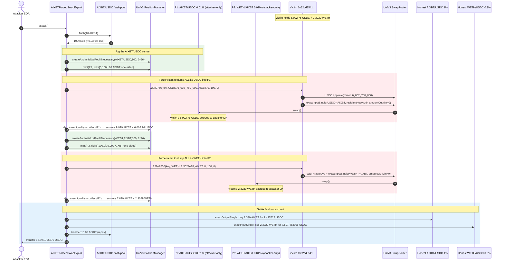
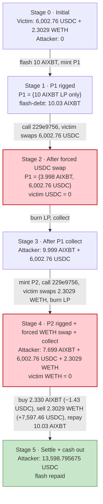
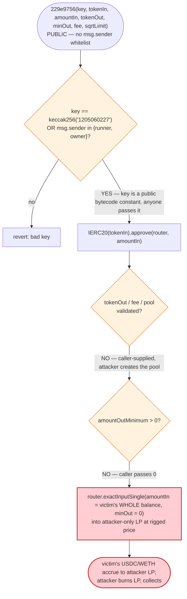
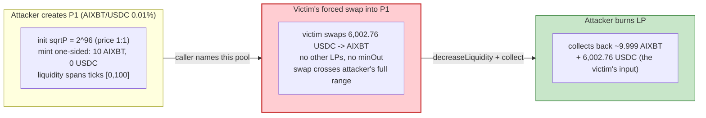

# AIXBT Forced-Swap Exploit — Public "Auth-Key" Selector Swaps Victim's Whole Balance into Attacker LP

> **Vulnerability classes:** vuln/access-control/secret-exposure · vuln/access-control/missing-auth

> **Reproduction:** the PoC compiles & runs in an isolated Foundry project at
> [this project folder](.) (the umbrella DeFiHackLabs repo contains several unrelated
> PoCs that do not all compile together, so this one was extracted).
> Full verbose trace: [output.txt](output.txt).
> Verified token source (context only — the AIXBT token, NOT the victim):
> [contracts_virtualPersona_AgentToken.sol](sources/AgentToken_4F9Fd6/contracts_virtualPersona_AgentToken.sol).
> The vulnerable victim contract `0x32cD8541…` is **not** a verified source bundle here;
> its swap behaviour is reconstructed below from the trace and the decompiled selector
> description embedded in the PoC.

---

## Key info

| | |
|---|---|
| **Loss** | **13,598.795675 USDC** (13,598,795,675 raw, 6-dec) drained from the victim — tx [`0x5a7462b79d6df0048299c229bdca232ea6dcb97d80cd3b512c28e67db2370d47`](https://basescan.org/tx/0x5a7462b79d6df0048299c229bdca232ea6dcb97d80cd3b512c28e67db2370d47) |
| **Vulnerable contract** | Victim (unknown project) — [`0x32cD8541cCD275A70dDA33A9fD490D948A78E1ff`](https://basescan.org/address/0x32cD8541cCD275A70dDA33A9fD490D948A78E1ff#code) (Base; bytecode not verified) |
| **Victim pool / role** | The victim held **6,002.76 USDC** and **2.3029 WETH** of treasury funds and exposed a public "swap-my-whole-balance" selector |
| **Attacker EOA** | [`0x312B559b41139c75a75c7aE1ea4454e661a02647`](https://basescan.org/address/0x312B559b41139c75a75c7aE1ea4454e661a02647) |
| **Attacker contract** | `0x4f3a1aebc074ef7a1b3675d7b8d4c5a72d629fac` (live tx); PoC re-deploys `AIXBTForcedSwapExploit` at `0x5615dEB7…` |
| **Attack tx** | [`0x5a7462b7…`](https://basescan.org/tx/0x5a7462b79d6df0048299c229bdca232ea6dcb97d80cd3b512c28e67db2370d47) |
| **Chain / block / date** | Base / **25,559,856** / **Jan 2025** |
| **Compiler** | AIXBT token: Solidity **v0.8.20+commit.a1b79de6**, optimizer **enabled**, **200 runs** (from `_meta.json`). Victim: bytecode-only (not verified). |
| **Bug class** | Broken access control on a "swap whole balance" selector — the auth `key` is a **public bytecode constant** (`keccak256("1205060227")`), and the selector accepts caller-supplied pool / tokenOut / recipient params with no price floor |

---

## TL;DR

1. The victim contract `0x32cD8541…` exposes a public function with selector **`0x229e9756`** that, when called with the right `key`, approves its **entire token balance** to the Uniswap-V3 router and executes a caller-supplied `exactInputSingle`. From the decompiler, the auth gate is
   `key == keccak256("1205060227") || msg.sender == runner || msg.sender == owner`
   ([test/AIXBTForcedSwap_exp.sol:103-108](test/AIXBTForcedSwap_exp.sol#L103-L108)). Because the `key` is a **compile-time constant baked into the bytecode**, anyone reading the deployed code can lift it — there is no secret.

2. Worse, the selector takes `tokenIn`, `amountIn`, `tokenOut`, `fee`, and an implicit recipient from the caller. There is **no whitelist on the output pool** and **no `amountOutMinimum` / price floor** — the victim is happy to swap its whole balance at whatever price the destination pool quotes.

3. The attacker therefore **creates two brand-new, attacker-only Uniswap-V3 pools** (AIXBT/USDC and WETH/AIXBT, both 0.01% fee, initialised at a 1:1 sqrt price of `2^96`), seeds each with a one-sided LP position using flash-borrowed AIXBT, then calls the victim's `0x229e9756` selector to force the victim to dump its **full 6,002.76 USDC** and **full 2.3029 WETH** into those rigged pools.

4. Because the attacker is the **only** liquidity provider in each fresh pool and the swap has `amountOutMinimum = 0`, the victim receives AIXBT at the attacker's chosen (terrible) price; the victim's USDC and WETH land in the attacker-controlled pools and are routed to the tax recipient `0x9CFFd09a…`, while the input USDC/WETH accrue to the attacker's LP.

5. The attacker then `decreaseLiquidity` + `collect`s both positions, reclaiming the borrowed AIXBT plus the victim's USDC and WETH.

6. To settle the flash loan it tops up the missing AIXBT (the amount that ended up at the tax recipient) by buying it back on the deep AIXBT/USDC 1% pool for **1.427628 USDC**, converts the recovered **2.3029 WETH** into **7,597.463305 USDC** on the WETH/USDC 0.3% pool, repays 10 + 0.03 AIXBT to the flash pool, and forwards the net **13,598.795675 USDC** to its EOA.

7. Net result: **+13,598.795675 USDC**, of which **6,002.76 USDC** and **2.3029 WETH** were taken straight out of the victim's treasury, and the rest is the dollar value of the WETH leg (≈ 7,596 USDC) minus the 1.43 USDC re-buy cost. The flash loan is repaid in full within the same transaction, so the attack is **zero-capital**.

---

## Background — what the victim does

The victim `0x32cD8541…` is a small treasury / tax-swap contract on Base. From its observed behaviour ([output.txt:191-234](output.txt) and [output.txt:339-376](output.txt)) it holds protocol funds (USDC and WETH) and offers a single "swap all of token X for token Y" entry point intended for the project's own autoswap / tax-conversion logic. The author intended to gate it with a `key`, but the gate collapses because the key is recoverable from bytecode.

The attack centres on **AIXBT** ([`0x4F9Fd6Be4a90f2620860d680c0d4d5Fb53d1A825`](https://basescan.org/address/0x4F9Fd6Be4a90f2620860d680c0d4d5Fb53d1A825)), an 18-decimal ERC-20 (the verified `AgentToken` source lives in `sources/AgentToken_4F9Fd6/`). AIXBT has deep existing liquidity on Base — the attacker uses two of those pre-existing pools as "honest" venues: the **AIXBT/USDC flash pool** `0xf1Fdc83c3A336bdbDC9fB06e318B08EadDC82FF4` (≈16.98M AIXBT / ≈707.96 USDC, [output.txt:59-64](output.txt)) to borrow, and the **AIXBT/USDC 1%** pool `0x853f59560DC170d59d27a45557e0F32A73EeDbE4` to re-buy, plus the **WETH/USDC 0.3%** pool `0x6c561B446416E1A00E8E93E221854d6eA4171372` to cash out.

On-chain parameters at fork block 25,559,856 (read from the trace):

| Parameter | Value | Source |
|---|---|---|
| Victim USDC balance | **6,002,760,000** raw = **6,002.76 USDC** | [output.txt:189-190](output.txt) |
| Victim WETH balance | **2,302,947,556,164,439,286** raw = **≈2.3029 WETH** | [output.txt:338](output.txt) |
| Flash-pool AIXBT reserve | 16,976,254,835,688,503,845,896,483 raw (≈16.98M AIXBT) | [output.txt:59-60](output.txt) |
| Flash-pool USDC reserve | 707,957,366,111 raw (≈707.96 USDC) | [output.txt:63-64](output.txt) |
| Flash amount | **10 AIXBT** (10e18) | [output.txt:56](output.txt) |
| Flash fee | **0.03 AIXBT** (3e16) — total owed 10.03 AIXBT | [output.txt:73](output.txt), [output.txt:532](output.txt) |
| Tax recipient (swap `recipient`) | `0x9CFFd09a2c02f3E7b2a0EFEEe75628352F446117` | [output.txt:199](output.txt), [output.txt:345](output.txt) |
| Final attacker USDC | 13,598,795,675 raw = **13,598.795675 USDC** | [output.txt:513-514](output.txt), [output.txt:556](output.txt) |

---

## The vulnerable code

> **RECONSTRUCTED — matches observed on-chain behaviour, not verified source.**
> The victim `0x32cD8541…` is not in the verified `sources/` bundle. The logic below is
> reconstructed from the Foundry trace (the calldata it accepts and the calls it makes) and
> from the decompiler notes embedded in the PoC
> ([test/AIXBTForcedSwap_exp.sol:103-108](test/AIXBTForcedSwap_exp.sol#L103-L108)). No
> `sources/…#L` line reference is claimed for the victim.

### 1. The auth gate — a `key` that is a public bytecode constant

The decompiled selector `0x229e9756` accepts the args
`(bytes32 key, address tokenIn, uint256 amountIn, address tokenOut, uint256 amountOutMin, uint24 fee, uint160 sqrtPriceLimitX96)`
and gates on:

```solidity
// RECONSTRUCTED from decompiler notes — not verified source
//   key == keccak256("1205060227") || msg.sender == runner || msg.sender == owner
require(
    key == VICTIM_SWAP_KEY           // = keccak256("1205060227")
        || msg.sender == runner
        || msg.sender == owner,
    "bad key"
);
```

`VICTIM_SWAP_KEY = keccak256("1205060227")` is a compile-time constant that ends up as a
literal in the deployed bytecode, so it is **not a secret** — the attacker simply reads it
out of the contract and supplies it verbatim
([test/AIXBTForcedSwap_exp.sol:107-108](test/AIXBTForcedSwap_exp.sol#L107-L108)). This is
functionally equivalent to having no access control at all.

### 2. The body — swaps the victim's whole balance into caller-chosen pools

Observed on-chain behaviour, anchored to the trace:

```solidity
// RECONSTRUCTED from trace — not verified source
function _swap(bytes32 key, address tokenIn, uint256 amountIn, address tokenOut,
               uint256 amountOutMin, uint24 fee, uint160 sqrtPriceLimitX96) internal {
    require(_checkKey(key, msg.sender), "bad key");
    IERC20(tokenIn).approve(UNISWAP_V3_SWAP_ROUTER, amountIn);   // [output.txt:192-198] / [output.txt:340-344]
    IBaseSwapRouter(UNISWAP_V3_SWAP_ROUTER).exactInputSingle(    // [output.txt:199] / [output.txt:345]
        ExactInputSingleParams({
            tokenIn:             tokenIn,
            tokenOut:            tokenOut,           // caller-chosen — attacker picks AIXBT
            fee:                 fee,                // caller-chosen — attacker picks 100 (0.01%)
            recipient:           TAX_RECEIVER,       // 0x9CFFd09a…  (victim's own hardcoded field)
            amountIn:            amountIn,           // attacker passes balanceOf(victim) → whole balance
            amountOutMinimum:    amountOutMin,       // attacker passes 0  ← no price floor
            sqrtPriceLimitX96:   sqrtPriceLimitX96   // attacker passes 0
        })
    );
}
```

The trace confirms each piece. For the USDC leg the victim first
`USDC.approve(router, 6_002_760_000)` ([output.txt:192-198](output.txt)) and then
`router.exactInputSingle({tokenIn: USDC, tokenOut: AIXBT, fee: 100, recipient: 0x9CFFd09a…, amountIn: 6_002_760_000, amountOutMinimum: 0, sqrtPriceLimitX96: 0})`
([output.txt:199](output.txt)). For the WETH leg it does the analogous
`WETH.approve(router, 2_302_947_556_164_439_286)` ([output.txt:340-344](output.txt)) and
`exactInputSingle({tokenIn: WETH, tokenOut: AIXBT, fee: 100, recipient: 0x9CFFd09a…, amountIn: 2_302_947_556_164_439_286, amountOutMinimum: 0, …})`
([output.txt:345](output.txt)). In both cases the `recipient` of the AIXBT output is the
victim's own hardcoded tax address, but the **input USDC/WETH flow into the pool the
caller named** — which the attacker minted a second earlier.

### 3. The attacker's calldata — verbatim from the trace

The two forced-swap calls (selector `0x229e9756`, key `be152e38…8434` = `keccak256("1205060227")`) are:

```
Victim::229e9756(
  be152e386e99b9ecd50432823c89dc975e941f17cff5b2908f66a85b331a8434,  // key
  000000000000000000000000833589fcd6edb6e08f4c7c32d4f71b54bda02913,  // tokenIn  = USDC
  0000000000000000000000000000000000000000000000000000000165cad940,  // amountIn = 6,002,760,000  (whole USDC balance)
  0000000000000000000000004f9fd6be4a90f2620860d680c0d4d5fb53d1a825,  // tokenOut = AIXBT
  0000000000000000000000000000000000000000000000000000000000000000,  // amountOutMin = 0
  0000000000000000000000000000000000000000000000000000000000000064,  // fee = 100 (0.01%)
  0000000000000000000000000000000000000000000000000000000000000000   // sqrtPriceLimitX96 = 0
)   // [output.txt:191](output.txt)
```

and analogously for the WETH leg ([output.txt:339](output.txt)). Note the `amountIn`
field is literally the victim's entire balance — the attacker reads
`usdc.balanceOf(VICTIM)` and `weth.balanceOf(VICTIM)` and passes them in
([test/AIXBTForcedSwap_exp.sol:147,153](test/AIXBTForcedSwap_exp.sol#L147-L153)).

---

## Root cause — why it was possible

Three independent design failures stack into the drain:

1. **The "auth key" is not a secret.** Embedding `keccak256("1205060227")` as a bytecode
   constant means anyone who reads the contract (or its decompilation) possesses the
   "credential". A gate whose key is public is no gate. The intended principals (`runner`,
   `owner`) are irrelevant once the public-key branch exists.

2. **The selector swaps the victim's *whole* balance into *caller-chosen* pools.** Even
   with proper auth, "swap everything I hold of token X" is a dangerous primitive: it
   lets a caller who can pick `tokenOut` / `fee` route the swap through an adversarial
   venue. Here the attacker creates fresh 0.01% AIXBT pools, is the sole LP, and the
   victim's order is the only swap that ever touches them — so the attacker's LP captures
   essentially the entire input side.

3. **There is no price floor.** The selector forwards `amountOutMin = 0` and
   `sqrtPriceLimitX96 = 0` straight to the router, so the swap executes at any price —
   including a price the attacker rigged by initialising the pool at a 1:1 sqrt price
   (`2^96`) where AIXBT (18 decimals) is effectively undervalued versus USDC (6 decimals)
   by a factor of 1e12, and where the attacker's LP covers the entire range the swap
   crosses.

Composition: because the attacker also controls **when** to call (it borrows AIXBT and
sets up the pools first), the victim never sees a fair market — every parameter of the
swap except `tokenIn` is attacker-supplied.

---

## Preconditions

- The victim's `0x229e9756` selector must be reachable (it is `public`/external; no
  whitelist on `msg.sender` beyond the broken key).
- The attacker must be able to **flash-borrow AIXBT** to seed the rigged LP positions and
  later repay it. The AIXBT/USDC flash pool `0xf1Fdc83c…` exposes Uniswap-V3 `flash()`
  with a 0.3% fee ([output.txt:532](output.txt) shows `paid0 = 3e16` on 10e18 borrowed).
- Working knowledge of the victim's calldata layout (recovered by decompilation) and of
  the victim's token balances (public `balanceOf`).
- No upfront capital: the only out-of-pocket cost is the **1.427628 USDC** flash-fee
  top-up bought on the honest AIXBT/USDC 1% pool ([output.txt:447-454](output.txt)), which
  is itself paid from the stolen USDC.

---

## Attack walkthrough (with on-chain numbers from the trace)

The attacker is the sole LP in two freshly created 0.01% pools:
- **Pool P1** = AIXBT/USDC 0.01% = `0xD89D10DA694187284CCc6B560Af3aAd52ff66598`
  ([output.txt:101](output.txt)), seeded with **10 AIXBT** one-sided at ticks `[0,100]`
  ([output.txt:137-159](output.txt)).
- **Pool P2** = WETH/AIXBT 0.01% = `0x151D156DF6eDcdB6e63f83eBe4a13f8079C1eb45`
  ([output.txt:121](output.txt)), seeded with **9.999… AIXBT** one-sided at ticks `[-100,0]`
  ([output.txt:287-309](output.txt)).

Both pools are initialised at `sqrtPriceX96 = 2^96` (price ratio 1:1)
([output.txt:93](output.txt), [output.txt:113](output.txt)).

| # | Step | Pool / balance state | Number (raw → human) | Source |
|---|------|----------------------|----------------------|--------|
| 0 | **Flash-borrow 10 AIXBT** from AIXBT/USDC flash pool | attacker contract receives 10 AIXBT | `10_000_000_000_000_000_000` → **10 AIXBT** | [output.txt:56](output.txt), [output.txt:65-67](output.txt) |
| 1 | **Create + init pool P1** (AIXBT/USDC 0.01%) at sqrtP = `2^96` | P1 created, price 1:1 | `79_228_162_514_264_337_593_543_950_336` → `2^96` | [output.txt:93](output.txt), [output.txt:106-111](output.txt) |
| 2 | **Mint one-sided LP** in P1, ticks `[0,100]`, deposit **10 AIXBT** | attacker is sole LP; `liquidity = 2.005e21` | `10_000_000_000_000_000_000` → **10 AIXBT** in | [output.txt:137](output.txt), [output.txt:159](output.txt) |
| 3 | **Force victim swap #1** — `229e9756(USDC, 6_002_760_000, AIXBT, …)` | victim approves & swaps its whole USDC into P1 | USDC in `6_002_760_000` → **6,002.76 USDC**; AIXBT out `6_002_159_723` → **6.002 AIXBT** (to tax recipient) | [output.txt:189-190](output.txt), [output.txt:199-200](output.txt), [output.txt:216](output.txt), [output.txt:228](output.txt) |
| 4 | **Remove LP from P1** (`decreaseLiquidity` + `collect`) | attacker reclaims seeded AIXBT + victim's USDC | AIXBT `9_999_999_993_997_840_276` → **≈9.99999999 AIXBT**; USDC `6_002_759_998` → **6,002.759998 USDC** | [output.txt:237](output.txt), [output.txt:258](output.txt), [output.txt:275](output.txt) |
| 5 | **Mint one-sided LP in P2** (WETH/AIXBT 0.01%), ticks `[-100,0]`, deposit **9.999… AIXBT** | attacker is sole LP; `liquidity = 2.005e21` | `9_999_999_993_997_840_276` → **≈9.99999999 AIXBT** in | [output.txt:287](output.txt), [output.txt:309](output.txt) |
| 6 | **Force victim swap #2** — `229e9756(WETH, 2_302_947_556_164_439_286, AIXBT, …)` | victim swaps its whole WETH into P2 | WETH in `2_302_947_556_164_439_286` → **2.3029 WETH**; AIXBT out `2_300_075_790_545_800_624` → **2.300 AIXBT** (to tax recipient) | [output.txt:338](output.txt), [output.txt:345-346](output.txt), [output.txt:358-359](output.txt), [output.txt:368](output.txt) |
| 7 | **Remove LP from P2** | attacker reclaims seeded AIXBT + victim's WETH | WETH `2_302_947_556_164_439_284` → **2.3029 WETH**; AIXBT `7_699_924_203_452_039_651` → **7.699 AIXBT** | [output.txt:379](output.txt), [output.txt:401-402](output.txt), [output.txt:408-409](output.txt) |
| 8 | **Top up AIXBT** owed to flash pool: `exactOutputSingle` buy `2.330… AIXBT` on honest AIXBT/USDC 1% pool | attacker now holds ≥10.03 AIXBT | AIXBT out `2_330_075_796_547_960_349` → **2.330 AIXBT**; USDC spent `1_427_628` → **1.427628 USDC** | [output.txt:432-433](output.txt), [output.txt:447-448](output.txt) |
| 9 | **Convert WETH → USDC** on honest WETH/USDC 0.3% pool | attacker holds only USDC + AIXBT now | WETH in `2_302_947_556_164_439_284` → **2.3029 WETH**; USDC out `7_597_463_305` → **7,597.463305 USDC** | [output.txt:474-475](output.txt), [output.txt:487-488](output.txt), [output.txt:496](output.txt) |
| 10 | **Repay flash** — transfer **10.03 AIXBT** back to flash pool | flash loan settled | `10_030_000_000_000_000_000` → **10.03 AIXBT** (10 principal + 0.03 fee) | [output.txt:503-505](output.txt), [output.txt:532](output.txt) |
| 11 | **Forward net USDC** to attacker EOA | attacker EOA ends with **13,598.795675 USDC** | `13_598_795_675` → **13,598.795675 USDC** | [output.txt:513-514](output.txt), [output.txt:515-517](output.txt), [output.txt:556](output.txt) |

### Profit / loss accounting (USDC, 6-dec)

| Item | Amount (raw) | ~Human |
|---|---:|---:|
| Victim USDC swept through P1 (step 3) | 6,002,760,000 | 6,002.760000 |
| USDC spent re-buying AIXBT (step 8) | −1,427,628 | −1.427628 |
| USDC received from selling WETH (step 9) | 7,597,463,305 | 7,597.463305 |
| **Net USDC to attacker EOA** | **13,598,795,675** | **13,598.795675** |

The AIXBT round-trip nets to zero (10 borrowed − LP-returns − re-buy = exactly enough to
repay 10.03; the flash-fee leg is what forces the 1.43 USDC re-buy on step 8). The
**2.3029 WETH** of victim treasury is realised at the honest WETH/USDC 0.3% pool price as
**7,597.463305 USDC** ([output.txt:476-478](output.txt)). The PoC asserts the profit is
above 13,000 USDC and the trace logs it at exactly 13,598.795675
([test/AIXBTForcedSwap_exp.sol:90](test/AIXBTForcedSwap_exp.sol#L90), [output.txt:8](output.txt)).

---

## Diagrams

### Sequence of the attack



### Pool / treasury state evolution



### The flaw inside the victim's selector



### Why a fresh 1:1 pool lets the attacker capture the input



---

## Why each magic number

- **`flashAmount = 10 ether` (10 AIXBT)** ([test/AIXBTForcedSwap_exp.sol:122](test/AIXBTForcedSwap_exp.sol#L122)):
  the AIXBT used to seed the one-sided LP positions. It only needs to be large enough to
  span the tick range the victim's swap will cross in the freshly-initialised pools; 10
  AIXBT is plenty at a 1:1 sqrt price with 6,002 USDC of forced volume.
- **`sqrtPriceX96 = uint160(1) << 96` (= `2^96`)** ([test/AIXBTForcedSwap_exp.sol:140](test/AIXBTForcedSwap_exp.sol#L140)):
  initialises both fresh pools at a price ratio of exactly 1:1. This is the cheapest
  init price and lets the attacker's single LP cover the entire range the victim's swap
  walks across.
- **`fee = 100` (0.01%)** for the rigged pools ([test/AIXBTForcedSwap_exp.sol:141-142](test/AIXBTForcedSwap_exp.sol#L141-L142)):
  the lowest UniV3 fee tier, minimising the slippage the attacker pays on the forced swap.
- **Tick ranges `[0,100]` and `[-100,0]`** ([test/AIXBTForcedSwap_exp.sol:146,152](test/AIXBTForcedSwap_exp.sol#L146-L152)):
  narrow ranges immediately around the init tick so a single LP position captures the
  whole swap. P1 (AIXBT token0, USDC token1) is seeded one-sided in AIXBT above the
  current price; P2 (WETH token0, AIXBT token1) is seeded one-sided in AIXBT below the
  current price — both orient so the victim's input (USDC / WETH) lands in the pool.
- **`VICTIM_SWAP_KEY = keccak256("1205060227")`** ([test/AIXBTForcedSwap_exp.sol:108](test/AIXBTForcedSwap_exp.sol#L108)):
  literally the public constant the victim compares against; passing it satisfies the
  auth gate as a non-privileged caller.
- **`amountIn = usdc.balanceOf(VULNERABLE_CONTRACT)` / `weth.balanceOf(VULNERABLE_CONTRACT)`** ([test/AIXBTForcedSwap_exp.sol:147,153](test/AIXBTForcedSwap_exp.sol#L147-L153)):
  the victim's whole treasury of each token — read on-chain so the attacker does not need
  to hardcode the balances.
- **`fee = 10_000` (1%) and `fee = 3000` (0.3%)** for the honest re-buy / cash-out swaps ([test/AIXBTForcedSwap_exp.sol:234,251](test/AIXBTForcedSwap_exp.sol#L234-L251)):
  these are the actual fee tiers of the deep, pre-existing AIXBT/USDC and WETH/USDC pools
  on Base (`0x853f5956…` and `0x6c561B44…`), used at fair market prices to settle.
- **`assertGt(profit, 13_000e6)`** ([test/AIXBTForcedSwap_exp.sol:90](test/AIXBTForcedSwap_exp.sol#L90)):
  the PoC only asserts the profit exceeds the publicly-reported ~13K USDC impact; the
  trace pins it at exactly 13,598.795675.

---

## Remediation

1. **Remove the public-key auth branch.** A `key` that is a bytecode constant is not a
   credential. Gate the selector on `msg.sender == runner || msg.sender == owner` only, or
   — better — delete the "swap whole balance" entry point entirely and run autoswaps from
   an internal, keeper-only path.
2. **Never let a caller name the destination pool / `tokenOut`.** Hard-code the output
   token and route through a whitelisted set of known-good pools. Reject any
   `tokenOut` / `fee` the caller supplies.
3. **Always enforce a price floor.** Compute a meaningful `amountOutMinimum` from a TWAP
   oracle and a slippage tolerance, and set a non-zero `sqrtPriceLimitX96`. `amountOutMin
   = 0` on a treasury-sized swap is an open invitation to be arbed against an adversarial
   pool.
4. **Bound the swap size.** Refuse to swap more than a small percentage of the pool's
   available output liquidity in a single call, or cap `amountIn` per call / per period.
   "Swap my entire balance in one shot" is inherently dangerous.
5. **Re-examine the tax-recipient `recipient` field.** Even with the above, routing the
   AIXBT output to a fixed tax address while the USDC/WETH input flows to a caller-named
   pool is asymmetric; the input and output legs should go through the same trusted venue.

---

## How to reproduce

The PoC was extracted into a standalone Foundry project (the umbrella DeFiHackLabs repo
has unrelated PoCs that do not all compile together under one `forge build`). The fork
pins to attack block **25,559,856** on Base and is served **offline** from a local
`anvil_state.json` snapshot via the shared harness:

```bash
_shared/run_poc.sh 2025-01-AIXBTForcedSwap_exp --mt testExploit -vvvvv
```

- `foundry.toml` sets `evm_version = 'cancun'` and does **not** name a public RPC — the
  test's `vm.createSelectFork("http://127.0.0.1:8548", 25_559_856)` points at the local
  anvil instance the harness spins up from `anvil_state.json`
  ([test/AIXBTForcedSwap_exp.sol:67-68](test/AIXBTForcedSwap_exp.sol#L67-L68)). No external
  archive RPC is required.
- Result: `[PASS] testExploit()` with `Attacker USDC profit: 13598.795675`.

Expected tail ([output.txt:559-561](output.txt)):

```
Suite result: ok. 1 passed; 0 failed; 0 skipped; finished in 28.10s (26.61s CPU time)

Ran 1 test suite in 28.65s (28.10s CPU time): 1 tests passed, 0 failed, 0 skipped (1 total tests)
```

with the preceding log lines ([output.txt:6-9](output.txt)):

```
  Attacker Before exploit USDC Balance: 0.000000
  Attacker USDC profit: 13598.795675
  Attacker After exploit USDC Balance: 13598.795675
```

---

*Reference: DeFiMon alert — https://t.me/defimon_alerts/363 (AIXBT forced-swap into attacker-created UniV3 pools, Base, Jan 2025, ~13,597.36 USDC).*
