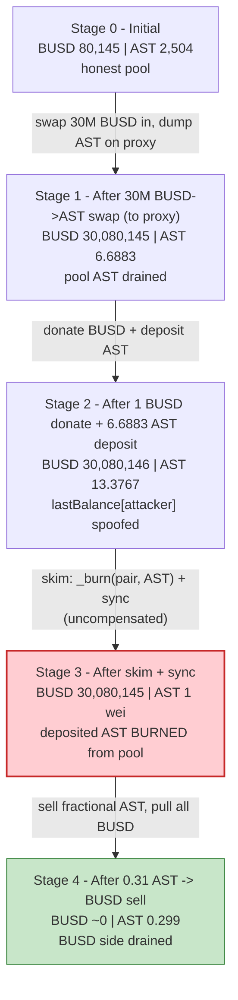
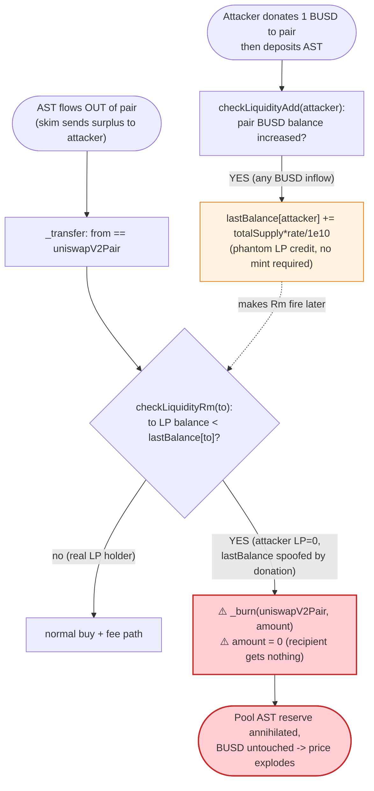

# AST Token Exploit — Faulty `transfer` Liquidity-Tracking Burns Pool Reserves Twice

> **Reproduction:** the PoC compiles & runs in an isolated Foundry project at
> [this project folder](.) (the umbrella DeFiHackLabs repo contains many unrelated
> PoCs that do not whole-compile, so this one was extracted).
> Full verbose trace: [output.txt](output.txt).
> Verified vulnerable source: [sol1_ASTToken.sol](sources/AST_c10E03/sol1_ASTToken.sol).

---

## Key info

| | |
|---|---|
| **Loss** | ~$65,000 — **65,145 BUSD** drained from the BUSD/AST PancakeSwap pair |
| **Vulnerable contract** | `AST` token — [`0xc10E0319337c7F83342424Df72e73a70A29579B2`](https://bscscan.com/address/0xc10e0319337c7f83342424df72e73a70a29579b2#code) |
| **Victim pool** | BUSD/AST PancakeSwap-V2 pair — `0x5ffEc8523A42BE78B1Ad1244fA526f14B64bA47a` |
| **Attacker EOA** | `0x56f77AdC522BFfebB3AF0669564122933AB5EA4f` |
| **Attacker contract** | `0xaaE196b6E3f3Ee34405e857e7bfb05D74c5cf775` |
| **Attack tx** | [`0x80dd9362d211722b578af72d551f0a68e0dc1b1e077805353970b2f65e793927`](https://bscscan.com/tx/0x80dd9362d211722b578af72d551f0a68e0dc1b1e077805353970b2f65e793927) |
| **Chain / block / date** | BSC / 45,964,640 / **2025-01-21** (fork pinned to 45,964,639) |
| **Compiler** | Solidity v0.8.28, optimizer **200 runs** |
| **Bug class** | Broken AMM invariant via faulty fee-on-transfer "liquidity tracking" that burns pool reserves on `skim` |

---

## TL;DR

`AST` is a fee-on-transfer token that tries to detect liquidity adds/removes by watching balances
inside its own `_transfer` hook. The detection logic is broken in two compounding ways:

1. **A spoofable add-counter.** `checkLiquidityAdd` ([sol1_ASTToken.sol:692-705](sources/AST_c10E03/sol1_ASTToken.sol#L692-L705))
   credits `lastBalance[from]` whenever the pair's **USDT (BUSD) balance increases** — it never checks
   that `from` actually minted LP tokens. A 1-wei BUSD donation is enough to inflate the attacker's
   `lastBalance`.
2. **A burn-on-"remove" path.** When AST flows **out of the pair** (`from == uniswapV2Pair`),
   `checkLiquidityRm` ([:677-690](sources/AST_c10E03/sol1_ASTToken.sol#L677-L690)) compares the
   recipient's *current* LP-token balance against its inflated `lastBalance`. Because the attacker's
   LP balance is **0** (it never minted any LP), the comparison says "liquidity removed" and
   `_transfer` **burns the transferred amount straight out of the pair** and zeroes the recipient's
   credit ([:486-490](sources/AST_c10E03/sol1_ASTToken.sol#L486-L490)).

The fatal interaction is with PancakeSwap's permissionless `skim()`. The attacker manually deposits
AST into the pair, then calls `skim()`. `skim` transfers the surplus AST out of the pair toward the
attacker — but that very transfer is intercepted by AST's `_transfer`, which sees "liquidity removal,"
**burns the entire skimmed amount out of the pair**, and gives the attacker **0**. So the AST that the
attacker just deposited is destroyed *from the pool* instead of being returned. A follow-up `sync()`
locks in the now-degenerate reserve: **AST reserve = 1 wei, BUSD reserve ≈ 30.08M**. The attacker then
sells a fraction of an AST and walks off with essentially the entire BUSD reserve.

The whole thing is wrapped in a 30,000,000-BUSD PancakeSwap-V3 flash loan, so the attacker needed
almost no capital. Net profit: **~65,145 BUSD (~$65K)**.

---

## Background — what AST does

`AST` ([source](sources/AST_c10E03/sol1_ASTToken.sol)) is an ERC20 with a homemade fee-on-transfer +
"liquidity tracking" layer bolted into `_transfer`:

- **Buy/sell fees.** When AST moves to/from its registered `uniswapV2Pair`, a `buyFeeRate` /
  `saleFeeRate` (both 100% by config, but bypassed on the paths the attacker uses) can be skimmed to
  fee receivers ([:475-501](sources/AST_c10E03/sol1_ASTToken.sol#L475-L501)).
- **Whitelist (`wList`).** Whitelisted senders/recipients pay no fee and skip the liquidity logic
  ([:471-474](sources/AST_c10E03/sol1_ASTToken.sol#L471-L474)).
- **Liquidity tracking.** Two helpers, `checkLiquidityAdd` and `checkLiquidityRm`, try to infer LP
  mint/burn by watching the pair's BUSD balance and the recipient's LP-token balance, storing per-user
  state in `lastBalance` and `pool_usdt`.

The token registers its pair in the constructor:
`uniswapV2Pair = factory.createPair(AST, USDT)` ([:233](sources/AST_c10E03/sol1_ASTToken.sol#L233)),
which on BSC resolves to the BUSD/AST pair `0x5ffEc8...A47a`.

On-chain state at the fork block (read via `cast`):

| Parameter | Value |
|---|---|
| `uniswapV2Pair` | `0x5ffEc8523A42BE78B1Ad1244fA526f14B64bA47a` (BUSD/AST) |
| `pool_usdt` (cached pair BUSD balance) | 80,145.198 |
| Pool reserves `(BUSD, AST)` | `(80,145.198 BUSD, 2,504.017 AST)` |
| `saleFeeRate` / `buyFeeRate` | 100 / 100 (%) |

> The `ERC1967Proxy` at `0xc8B981…` referenced in the PoC is **not** part of the vulnerability — it is
> just an arbitrary, non-whitelisted contract the attacker uses as a throwaway recipient for the first
> swap (its verified source is plain OpenZeppelin proxy boilerplate,
> [ERC1967Proxy.sol](sources/ERC1967Proxy_c8B981/ERC1967Proxy.sol)).

---

## The vulnerable code

### 1. `_transfer` burns from the pair when it thinks liquidity was removed

```solidity
// sol1_ASTToken.sol:447-503
function _transfer(address from, address to, uint256 amount) internal virtual {
    ...
    if (from != uniswapV2Pair && !wList[from] && !wList[to] && to != uniswapV2Pair){
        _balances[to] += (amount);                         // plain transfer
        emit Transfer(from, to,(amount));
    }else if (wList[from] || wList[to]) {
        _balances[to] += amount;                           // whitelisted, no fee
        emit Transfer(from, to, amount);
    } else{
        uint feeAmount;
        if (to == uniswapV2Pair){
            if (! checkLiquidityAdd(from)){                // ⚠️ side-effect: inflates lastBalance[from]
                ... sale fee ...
            }
        }
        if (from == uniswapV2Pair){
            if (checkLiquidityRm(to)){                     // ⚠️ "is this a liquidity removal?"
                _burn(from, amount);                       // ⚠️ burns OUT OF THE PAIR
                amount = 0;                                //    recipient gets nothing
            }else{ ... buy fee ... }
        }
        _balances[to] += (amount - feeAmount);
        emit Transfer(from, to,(amount-feeAmount));
    }
    ...
}
```

### 2. The add-detector trusts any BUSD inflow — no LP mint required

```solidity
// sol1_ASTToken.sol:692-705
function checkLiquidityAdd(address user) internal returns (bool) {
    IERC20 lpToken = IERC20(usdtAddress);
    IERC20 lp = IERC20(uniswapV2Pair);
    uint256 currentBalance = lpToken.balanceOf(uniswapV2Pair); // pair's BUSD balance
    if (currentBalance >  pool_usdt) {                          // ⚠️ ANY BUSD inflow counts
        emit LiquidityAdded(user, pool_usdt);
        uint rate = (currentBalance - pool_usdt) * 1e10 / currentBalance;
        pool_usdt = currentBalance;
        lastBalance[user] += lp.totalSupply() * rate / 1e10;    // ⚠️ credits user with phantom "LP"
        return true;
    }
    return false;
}
```

### 3. The remove-detector keys off LP-balance *decrease* vs. the phantom credit

```solidity
// sol1_ASTToken.sol:677-690
function checkLiquidityRm(address user) internal returns (bool) {
    IERC20 lpToken = IERC20(uniswapV2Pair);
    uint256 currentBalance = lpToken.balanceOf(user); // user's REAL LP balance (== 0 for attacker)
    uint256 previousBalance = lastBalance[user];      // inflated by checkLiquidityAdd
    if (currentBalance < previousBalance) {           // 0 < inflated  ⇒ TRUE
        emit LiquidityRemoved(user, previousBalance - currentBalance);
        lastBalance[user] = currentBalance;           // reset to 0
        return true;                                  // ⇒ _transfer burns from the pair
    }
    return false;
}
```

---

## Root cause — why it was possible

The token tries to re-implement LP accounting from inside an ERC20 transfer hook, but it conflates
**three unrelated things**:

> A token contract cannot reliably tell "this transfer is a liquidity removal" by looking at balances.
> `checkLiquidityAdd` increments `lastBalance[user]` on *any* BUSD inflow to the pair (not on an actual
> LP mint by `user`), and `checkLiquidityRm` then declares a "removal" whenever `user`'s LP balance is
> below that phantom number — which is trivially true for a user who never minted LP.

The consequence is a primitive that lets anyone **burn AST out of the pair for free**:

1. **Spoofable credit.** Donate a tiny bit of BUSD to the pair (or let any normal swap raise its BUSD
   balance) → `pool_usdt` rises → `lastBalance[attacker]` is credited with phantom LP, *without the
   attacker ever owning a single LP token*.
2. **Uncompensated burn.** Any subsequent AST outflow from the pair to the attacker is reclassified as
   a "removal," so `_transfer` executes `_burn(uniswapV2Pair, amount)` and hands the recipient `0`.
   AST is deleted from the pool; no BUSD moves, no LP is redeemed.
3. **`skim()` is the delivery vehicle.** PancakeSwap's `skim(to)` is permissionless and pushes
   `balance − reserve` of each token to `to`. The attacker first deposits AST directly into the pair
   (raising its AST balance), then calls `skim`. The skim's AST transfer triggers the burn path: the
   surplus AST is **burned out of the pair instead of being skimmed to the attacker**.
4. **`sync()` finalizes the broken state.** After the burn the pair holds 1 wei of AST; `sync()` writes
   that as `reserve1`. The constant product `k` collapses and one AST is now "worth" the entire
   30.08M-BUSD reserve.

Because the burn destroys the AST the attacker *itself* deposited (rather than skimming it back), the
deposit is a sacrifice that wipes the pool's AST reserve. The 30,000,000-BUSD flash loan is only there
to first stuff the pair full of BUSD (so the final dust-sell pays out a large absolute amount) and is
repaid in full at the end.

---

## Preconditions

- The attacker (and its swap recipient `proxy`) are **not** whitelisted in `wList`, so AST's fee /
  liquidity-tracking branch executes for their transfers (whitelisted addresses bypass it entirely,
  [:471-474](sources/AST_c10E03/sol1_ASTToken.sol#L471-L474)).
- The attacker holds a small AST seed to deposit into the pair (the PoC `deal`s **7 AST** and **1 BUSD**;
  [Ast_exp.sol:54-55](test/Ast_exp.sol#L54-L55)).
- Access to a large BUSD flash loan to inflate the pair's BUSD reserve. The PoC borrows
  **30,000,000 BUSD** from the PancakeSwap-V3 BUSD/WBNB pool `0x3669…2050`
  ([Ast_exp.sol:64](test/Ast_exp.sol#L64)); the 0.05% fee (15,000 BUSD) is paid back from profit.
- `skim()` / `sync()` are public on any Uniswap-V2/PancakeSwap pair — no special access needed.

---

## Attack walkthrough (with on-chain numbers from the trace)

The pair's `token0 = BUSD`, `token1 = AST`, so `reserve0 = BUSD`, `reserve1 = AST`.
All figures are taken directly from the `Sync` / `Transfer` events in
[output.txt](output.txt).

| # | Step | Pool BUSD | Pool AST | Effect |
|---|------|----------:|---------:|--------|
| 0 | **Initial** (reserves at fork block) | 80,145.198 | 2,504.017 | Honest pool. |
| 1 | **Flash-borrow 30,000,000 BUSD** from PancakeV3 pool `0x3669…2050` ([:64](test/Ast_exp.sol#L64)) | — | — | Attacker now holds 30,000,001 BUSD. |
| 2 | **Swap all 30M BUSD → AST**, recipient = `proxy` (non-whitelisted) ([:80-82](test/Ast_exp.sol#L80-L82)) | 30,080,145.198 | 6.688e-18 → 6.6883 | Pool BUSD ballooned; pool AST drained to **6.6883 AST**; `proxy` got 2,497.33 AST. |
| 3 | **Transfer 1 BUSD → pair** ([:87](test/Ast_exp.sol#L87)) | 30,080,146.198 | 6.6883 | BUSD inflow → `checkLiquidityAdd(attacker)` will credit phantom LP. |
| 4 | **Transfer 6.68835e18 wei AST → pair** ([:88](test/Ast_exp.sol#L88)) | 30,080,146.198 | 13.3767 | `checkLiquidityAdd` fires: `lastBalance[attacker]` set to **469,518,900,360,273** (phantom). Pool AST now = 6.6883 + 6.6883 = **13.3767**. |
| 5 | **`skim(attacker)`** ([:93](test/Ast_exp.sol#L93)) | 30,080,145.198 | **1 wei** | skim pushes surplus out. AST transfer (pair→attacker) hits `checkLiquidityRm`: attacker LP=0 < phantom ⇒ "removal" ⇒ `_burn(pair, 6.68835e18)`. **AST burned out of pool**; attacker gets 0. 1 BUSD surplus skimmed back. |
| 6 | **`sync()`** ([:94](test/Ast_exp.sol#L94)) | 30,080,145.198 | **1 wei** | Locks in degenerate reserves: `reserve1 = 1`. **Invariant broken.** |
| 7 | **Sell 0.31165 AST → BUSD** (the leftover seed), recipient = attacker ([:102-104](test/Ast_exp.sol#L102-L104)) | ~0.0000001 | 0.299 | 0.31165 AST sold pulls out **30,080,145.198 BUSD** — essentially the whole reserve. |
| 8 | **Repay flash loan** 30,015,000 BUSD ([:108](test/Ast_exp.sol#L108)) | — | — | 30,000,000 principal + 15,000 fee. |

After step 8 the attacker holds **65,146.198 BUSD**; subtracting the 1-BUSD seed leaves
**≈ 65,145 BUSD** of pure profit.

**Why 0.31 AST drains 30M BUSD:** PancakeSwap's `getAmountOut` is
`out = (in·9975·reserveOut) / (reserveIn·10000 + in·9975)`. With `reserveIn = 1 wei` of AST and a 30.08M-BUSD
`reserveOut`, even a fractional-AST input dwarfs the 1-wei reserve, so the swap returns essentially the
entire BUSD side of the pool.

### Profit accounting (BUSD)

| Direction | Amount |
|---|---:|
| Seed (dealt in PoC) | 1.00 |
| Flash-borrowed | 30,000,000.00 |
| **Total available** | **30,000,001.00** |
| Received — final dust sell | 30,080,145.198 |
| Plus — skimmed-back surplus | 1.00 |
| **Attacker BUSD before repay** | **30,080,146.198** (≈ 1 BUSD seed + 30,080,145.198) |
| Repay — flash principal + 0.05% fee | 30,015,000.00 |
| **Final attacker BUSD** | **65,146.198** |
| **Net profit (minus 1-BUSD seed)** | **≈ 65,145.198** |

The drained 30.08M BUSD is the pool's own balance (mostly the attacker's own flash-loaned BUSD that it
swapped in at step 2, *plus* the pool's original liquidity); netting the flash repayment isolates the
real theft at ~$65K — the value the broken pool gave up versus a fair swap.

---

## Diagrams

### Sequence of the attack

```mermaid
sequenceDiagram
    autonumber
    actor A as Attacker
    participant V3 as "PancakeV3 BUSD/WBNB (flash)"
    participant R as PancakeRouter
    participant P as "BUSD/AST Pair"
    participant T as "AST token (_transfer hook)"

    Note over P: Initial reserves<br/>80,145 BUSD / 2,504 AST

    A->>V3: flash(30,000,000 BUSD)
    V3-->>A: 30,000,000 BUSD

    rect rgb(255,243,224)
    Note over A,T: Step 2 — swap all BUSD to AST, dump on proxy
    A->>R: swapExactTokens(30M BUSD -> AST, to = proxy)
    R->>P: swap()
    P-->>A: pool AST drained to 6.6883 AST<br/>pool BUSD = 30,080,145
    end

    rect rgb(232,245,233)
    Note over A,T: Step 3-4 — donate + deposit, spoof the add-counter
    A->>P: transfer 1 BUSD (direct)
    A->>T: transfer 6.68835e18 AST -> pair
    T->>T: checkLiquidityAdd(attacker): BUSD up<br/>⇒ lastBalance[attacker] += phantom LP
    Note over P: pool AST = 13.3767
    end

    rect rgb(255,235,238)
    Note over A,T: Step 5-6 — the exploit
    A->>P: skim(attacker)
    P->>T: transfer surplus AST (pair -> attacker)
    T->>T: checkLiquidityRm(attacker): LP 0 < phantom<br/>⇒ _burn(pair, 6.68835e18); recipient gets 0
    A->>P: sync()
    Note over P: 30,080,145 BUSD / 1 wei AST<br/>⚠️ invariant broken
    end

    rect rgb(243,229,245)
    Note over A,T: Step 7 — drain
    A->>R: swap 0.31165 AST -> BUSD (to = attacker)
    R->>P: swap()
    P-->>A: 30,080,145 BUSD
    end

    A->>V3: repay 30,015,000 BUSD
    Note over A: Net +65,145 BUSD
```

### Pool state evolution



### The flaw inside `_transfer` + liquidity tracking



---

## Remediation

1. **Do not infer liquidity events from inside an ERC20 transfer hook.** Watching the pair's token
   balance (`checkLiquidityAdd`) and the recipient's LP-token balance (`checkLiquidityRm`) cannot
   distinguish a swap, a donation, or a `skim` from an actual `mint`/`burn`. Remove this logic entirely,
   or react only to the pair's own `Mint`/`Burn` events off-chain.
2. **Never `_burn` from the pair as a side-effect of a transfer.** The line
   `_burn(uniswapV2Pair, amount)` ([:489](sources/AST_c10E03/sol1_ASTToken.sol#L489)) destroys one side
   of the AMM reserves with no matching outflow, breaking `x·y = k`. A token must only ever burn tokens
   it owns, never tokens sitting in a third-party pool.
3. **Require a real LP mint before crediting `lastBalance`.** `checkLiquidityAdd` must verify that
   `user` actually received LP tokens (its LP balance increased) in the same operation, not merely that
   the pair's BUSD balance went up — otherwise any donation spoofs the counter.
4. **Treat `skim`/`sync` as adversarial.** Because both are permissionless, any token logic that fires
   on transfers to/from the pair must remain safe when those transfers originate from `skim`. The
   simplest safe design is a plain ERC20 with no transfer-time pool bookkeeping.
5. **Whitelist consistency.** The fee/liquidity branch is bypassed for whitelisted addresses; the bug
   shows the *non-whitelisted* path is the dangerous one. Rather than patching around whitelists,
   eliminate the balance-sniffing logic so there is nothing to bypass.

---

## How to reproduce

The PoC was extracted into a standalone Foundry project (the umbrella DeFiHackLabs repo has many
unrelated PoCs that fail to compile under a whole-project `forge test`):

```bash
_shared/run_poc.sh 2025-01-Ast_exp -vvvvv
```

- RPC: a **BSC archive** endpoint is required (fork block 45,964,639). `foundry.toml` uses
  `https://bsc-mainnet.public.blastapi.io`, which serves historical state at that block; most public
  BSC RPCs prune it and fail with `header not found` / `missing trie node`.
- The PoC's header note about `evm_version = 'shanghai'` is **not needed** here — it compiles and runs
  fine under the project's default `cancun`.
- Result: `[PASS] testExploit()` with the attacker's final BUSD balance ≈ **65,146 BUSD**.

Expected tail:

```
Ran 1 test for test/Ast_exp.sol:ContractTest
[PASS] testExploit() (gas: 370856)
  [Start] Attacker BUSD balance before flash: 1.000000000000000000
  [Info] Attacker BUSD balance after flash: 30000001.000000000000000000
  [Info] LP BUSD balance after skim: 30080145.197852789777147003
  [Info] LP AST balance after skim: 0.000000000000000001
  [Info] Attacker BUSD balance after exploit: 65146.197852789676322046
```

---

*References: SlowMist / SolidityScan AST Token Hack analysis —
https://blog.solidityscan.com/ast-token-hack-analysis-7a2f0400436a ;
https://medium.com/@joichiro.sai/ast-token-hack-how-a-faulty-transfer-logic-led-to-a-65k-exploit-da75aed59a43*
