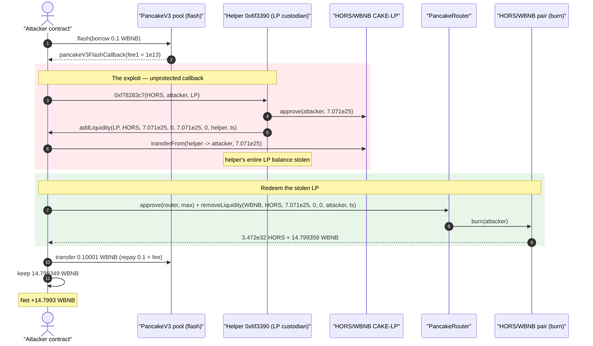
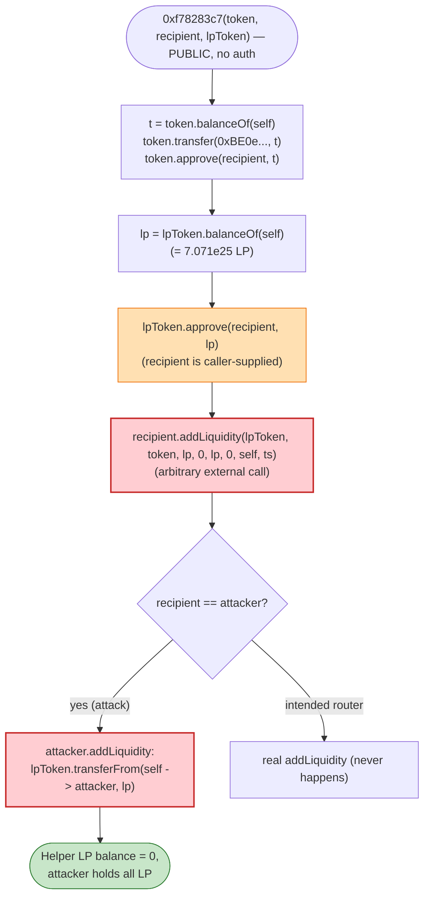
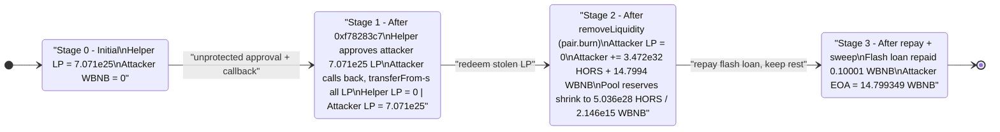

# HORS Exploit — Unprotected, Attacker-Callback `0xf78283c7` Drains the Pool's LP Tokens

> **Reproduction:** the PoC compiles & runs in an isolated Foundry project at
> [this project folder](.) (the umbrella DeFiHackLabs repo contains many
> unrelated PoCs that do not compile together, so this one was extracted).
> Full verbose trace: [output.txt](output.txt).
> The vulnerable contract is **UNVERIFIED** on BscScan — its behavior was
> reconstructed from the on-chain execution trace and its raw bytecode
> ([sources/UNVERIFIED_VulnContract_6f3390/](sources/UNVERIFIED_VulnContract_6f3390/)).

---

## Key info

| | |
|---|---|
| **Loss** | **14.799349453861436868 WBNB** (~$10.4K at ~$700/BNB on the day) — the entire HORS/WBNB liquidity |
| **Vulnerable contract** | UNVERIFIED helper at [`0x6f3390c6C200e9bE81b32110CE191a293dc0eaba`](https://bscscan.com/address/0x6f3390c6C200e9bE81b32110CE191a293dc0eaba#code) (held the project's CAKE-LP tokens) |
| **Victim pool** | PancakeSwap v2 HORS/WBNB pair — [`0xd5868B2e2B510A91964AbaFc2D683295586A8C70`](https://bscscan.com/address/0xd5868B2e2B510A91964AbaFc2D683295586A8C70) |
| **HORS token** | "Horse Coin" — [`0x1Bb30f2AD8Ff43BCD9964a97408B74f1BC6C8bc0`](https://bscscan.com/address/0x1Bb30f2AD8Ff43BCD9964a97408B74f1BC6C8bc0#code) |
| **Attacker EOA** | [`0x8Efb9311700439d70025d2B372fb54c61a60d5DF`](https://bscscan.com/address/0x8Efb9311700439d70025d2B372fb54c61a60d5DF) |
| **Attacker contract** | [`0x75ff620FF0e63243e86b99510cDbaD1D5e76524E`](https://bscscan.com/address/0x75ff620FF0e63243e86b99510cDbaD1D5e76524E) |
| **Attack tx** | [`0xc8572846ed313b12bf835e2748ff37dacf6b8ee1bab36972dc4ace5e9f25fed7`](https://bscscan.com/tx/0xc8572846ed313b12bf835e2748ff37dacf6b8ee1bab36972dc4ace5e9f25fed7) |
| **Chain / block / date** | BSC / 45,587,949 (forked at 45,587,948) / Wed 8 Jan 2025 14:04:41 UTC |
| **Flash-loan source** | PancakeSwap v3 pool [`0x172fcD41E0913e95784454622d1c3724f546f849`](https://bscscan.com/address/0x172fcD41E0913e95784454622d1c3724f546f849) (0.1 WBNB) |
| **Compiler (PoC)** | Solidity ^0.8.0 (test), `cancun` EVM |
| **Bug class** | Missing access control + arbitrary external callback into an attacker-supplied address that is first granted token approval (asset theft) |

---

## TL;DR

The HORS project deployed a helper contract at `0x6f3390…eaba` that **custodied the
LP tokens** of the HORS/WBNB PancakeSwap v2 pair. That contract exposes a function with
selector **`0xf78283c7`** that takes three caller-supplied addresses — `(token, recipient, lpToken)` —
and, with **no access control and no validation of who the caller or `recipient` is**:

1. approves `recipient` to spend the helper's **entire** `lpToken` balance, then
2. calls **`recipient.addLiquidity(lpToken, token, lpBalance, 0, lpBalance, 0, helper, deadline)`** —
   an external call into a **fully attacker-controlled** address.

The attacker passes its own contract as `recipient`. Its `addLiquidity` is just a hook that
uses the approval the helper *just granted* to `transferFrom(helper → attacker, lpBalance)`,
walking off with all the LP tokens. The attacker then redeems those LP tokens via the
PancakeRouter (`removeLiquidity` → `pair.burn`) to receive the underlying HORS + **14.8 WBNB**,
repays a tiny 0.1-WBNB flash loan it used as gas/working capital, and keeps the rest.

No price manipulation, no math bug — just a custody contract that hands its assets to whoever
asks and then calls back into the asker.

---

## Background — what the pieces are

- **HORS / "Horse Coin"** ([sources/HORS_1Bb30f/HORS.sol](sources/HORS_1Bb30f/HORS.sol)) is a
  bare-bones ERC20 (a hand-rolled `transfer` / `approve` / `transferFrom`,
  [HORS.sol:46-68](sources/HORS_1Bb30f/HORS.sol#L46-L68)). It is **not** where the bug lives.
- The **HORS/WBNB pair** ([sources/PancakePair_d5868B/PancakePair.sol](sources/PancakePair_d5868B/PancakePair.sol))
  is a standard PancakeSwap v2 pair. Its `burn(to)` redeems LP tokens for the underlying reserves
  pro-rata ([PancakePair.sol:427-449](sources/PancakePair_d5868B/PancakePair.sol#L427-L449)).
  `token0 = HORS`, `token1 = WBNB`.
- The **vulnerable helper** `0x6f3390…eaba` is **UNVERIFIED**. From its bytecode it has exactly three
  external selectors (`0x7494d122`, `0xc1459c03`, `0xf78283c7`). It **holds the project's CAKE-LP
  tokens** for the HORS/WBNB pair (`lpToken.balanceOf(helper) = 70,710,678,118,654,752,440,083,436`
  ≈ 7.07e25 wei of LP). The exploited entry point is `0xf78283c7`.

---

## The vulnerable code

The helper at `0x6f3390…eaba` is unverified, so there is no Solidity to quote. Its `0xf78283c7`
function was fully reconstructed from the execution trace
([output.txt:40-67](output.txt) — the `f78283c7(…)` subtree). In pseudo-Solidity it is equivalent
to:

```solidity
// selector 0xf78283c7 — NO access control, NO validation of caller or `recipient`
function exploitable(address token, address recipient, address lpToken) external {
    // 1. drain the project token to a fixed address (HORS balance was 0 here → no-op)
    uint256 t = IERC20(token).balanceOf(address(this));     // HORS.balanceOf(helper) = 0
    IERC20(token).transfer(0xBE0eB53F46cd790Cd13851d5EFf43D12404d33E8, t);
    IERC20(token).approve(recipient, t);                    // approve recipient for 0

    // 2. ⚠️ approve the caller-supplied `recipient` for the FULL LP balance
    uint256 lp = IERC20(lpToken).balanceOf(address(this));  // 7.071e25 LP tokens
    IERC20(lpToken).approve(recipient, lp);                 // ⚠️ unbounded approval to attacker

    // 3. ⚠️ call BACK into the attacker-controlled `recipient`
    IRouterLike(recipient).addLiquidity(
        lpToken, token, lp, 0, lp, 0, address(this), block.timestamp
    );                                                       // ⚠️ arbitrary external call
}
```

The two fatal lines are step 2 (granting an unbounded approval over its own LP balance to an
address the caller chose) and step 3 (immediately invoking a method on that same caller-chosen
address). The helper assumes `recipient` is a *real* PancakeRouter that will responsibly
`addLiquidity`; nothing enforces that. In the live attack `recipient` is the attacker contract,
whose `addLiquidity` is purely a thief:

```solidity
// AttackContract.addLiquidity — the malicious "router" hook (test/HORS_exp.sol:77-89)
function addLiquidity(address tokenA, address tokenB, uint256, uint256, uint256, uint256, address, uint256)
    public returns (uint256, uint256, uint256)
{
    uint256 horsBalance = IERC20(CAKE_LP).balanceOf(VULN_CONTRACT);   // 7.071e25
    IERC20(CAKE_LP).transferFrom(VULN_CONTRACT, address(this), horsBalance); // uses the fresh approval
}
```

See [test/HORS_exp.sol:57-89](test/HORS_exp.sol#L57-L89) for the full attacker callback.

---

## Root cause — why it was possible

Three independent design failures compose into outright theft:

1. **No access control.** `0xf78283c7` is callable by anyone. A function that moves/approves the
   contract's own LP assets must be restricted to a trusted owner/keeper.
2. **Attacker-chosen call target with a pre-granted approval.** The function approves a
   *caller-supplied* `recipient` for its full LP balance and then *calls that same address*. This is
   the classic "arbitrary external call + arbitrary approval" anti-pattern — the contract hands the
   keys to a stranger and then asks the stranger to act. Even without the callback, the unbounded
   `approve(recipient, lp)` alone would let the attacker `transferFrom` the LP tokens out in a later
   transaction.
3. **No invariant / no re-check after the callback.** The helper never verifies its LP balance is
   intact after `recipient.addLiquidity(...)` returns, so the drained tokens are gone with no revert.

The flash loan is **incidental** — the attacker only borrows 0.1 WBNB
([test/HORS_exp.sol:54](test/HORS_exp.sol#L54)) as throw-away working capital/gas and repays it
within the same callback. The value comes entirely from the LP tokens the helper gives away.

---

## Preconditions

- The helper holds the HORS/WBNB LP tokens (it did: 7.071e25 LP at the fork block).
- `0xf78283c7` is reachable permissionlessly (it is — no modifier).
- The attacker can present any contract as `recipient`; that contract exposes an `addLiquidity`
  signature matching what the helper calls (it does — see the malicious hook above).
- A trivial amount of WBNB to seed the round-trip (here 0.1 WBNB, flash-borrowed and repaid).

---

## Attack walkthrough (with on-chain numbers from the trace)

All figures are taken directly from [output.txt](output.txt). LP = the HORS/WBNB CAKE-LP token
(`0xd5868B…8C70`). Amounts are wei.

| # | Step | Trace ref | Concrete numbers |
|---|------|-----------|------------------|
| 0 | **Flash-borrow** 0.1 WBNB from PancakeV3 pool `0x172f…849` | [output.txt:28-34](output.txt) | borrow `100000000000000000` (0.1) WBNB; fee `10000000000000` (1e13) |
| 1 | In `pancakeV3FlashCallback`, call **`VULN.0xf78283c7(HORS, attacker, LP)`** | [output.txt:40](output.txt) | args: `HORS`, attacker `0x5615…b72f`, `LP` |
| 2 | Helper reads its HORS balance (=0), transfers 0 to `0xBE0e…33E8`, approves attacker 0 | [output.txt:41-47](output.txt) | HORS balance `0` |
| 3 | Helper reads its **LP balance** and **approves attacker for the full amount** | [output.txt:49-52](output.txt) | LP balance `70710678118654752440083436` (7.071e25) |
| 4 | Helper calls **`attacker.addLiquidity(LP, HORS, lp, 0, lp, 0, helper, ts)`** | [output.txt:56](output.txt) | passes lp `7.071e25` |
| 5 | Attacker's hook does **`LP.transferFrom(helper → attacker, lp)`** — steals all LP | [output.txt:59-65](output.txt) | moved `70710678118654752440083436` LP |
| 6 | Attacker `approve(PancakeRouter, max)` LP, then **`removeLiquidity(WBNB, HORS, lp, 0, 0, attacker, ts)`** | [output.txt:68-75](output.txt) | router → `pair.burn(attacker)` |
| 7 | `pair.burn` redeems LP → pays out underlying HORS + WBNB to attacker | [output.txt:82-117](output.txt) | out: `347242535196129895429273744913820` HORS + `14799359453861436868` (≈14.7994) WBNB; pool `Sync` → reserves `5.036e28` HORS / `2.146e15` WBNB |
| 8 | **Repay** flash loan: transfer 0.10001 WBNB back to PancakeV3 pool | [output.txt:119-124](output.txt) | repaid `100010000000000000` (0.1 + fee) |
| 9 | Sweep remaining WBNB to attacker EOA | [output.txt:127-132](output.txt) | swept `14799349453861436868` (14.799349…) WBNB |

The PoC's `addLiquidity` returns `(0,0,0)` and ignores the desired amounts — the helper does not
check the return value, so the theft (step 5) is the only thing that happened inside the callback.

### Profit / loss accounting (WBNB)

| Direction | Amount (WBNB) | wei |
|---|---:|---:|
| Flash-borrowed (working capital) | 0.1 | `100000000000000000` |
| WBNB received from `pair.burn` | 14.799359453861436868 | `14799359453861436868` |
| Flash-loan repayment (0.1 + 1e13 fee) | 0.10001 | `100010000000000000` |
| **Net profit to attacker** | **14.799349453861436868** | `14799349453861436868` |

The attacker also received `3.472e32` HORS units from the burn, but HORS is the project's own
worthless token and was not the prize — the **14.8 WBNB** of real liquidity was. The PoC's
`balanceLog` confirms the attacker EOA went from **0 WBNB → 14.799349453861436868 WBNB**
([output.txt:6-7, 150](output.txt)).

---

## Diagrams

### Sequence of the attack



### Helper-contract control flow (the flaw)



### Asset / state evolution



---

## Remediation

1. **Add access control.** `0xf78283c7` (and the other helper entry points that touch the project's
   LP / token assets) must be `onlyOwner` / restricted to a trusted keeper. A permissionless
   function should never move or approve contract-owned assets.
2. **Never approve or call a caller-supplied address.** If the helper needs to interact with the
   PancakeRouter, hard-code the router address (an immutable constant), not a parameter. Approving an
   arbitrary `recipient` for the contract's full balance is equivalent to giving away the funds.
3. **Eliminate the arbitrary external callback.** Do the `addLiquidity` (or whatever the intended
   flow is) *inline* against the known router rather than calling back into an externally-provided
   contract. There is no legitimate reason to invoke `recipient.addLiquidity(...)` on an address the
   caller controls.
4. **Use bounded, just-in-time approvals.** Approve the exact amount needed for one operation and
   reset to 0 afterward; never `approve(spender, fullBalance)` and leave it standing.
5. **Re-check invariants after external interactions.** After any external call, assert the
   contract's critical balances (LP holdings) are unchanged or changed only as intended; revert
   otherwise.

---

## How to reproduce

The PoC was extracted into a standalone Foundry project (the umbrella DeFiHackLabs repo has many
unrelated PoCs that fail to compile together under `forge test`):

```bash
_shared/run_poc.sh 2025-01-HORS_exp -vvvvv
```

- RPC: a **BSC archive** endpoint is required (fork block 45,587,948). `foundry.toml` uses
  `https://bsc-mainnet.public.blastapi.io`, which serves historical state at that block; the
  default `onfinality` public endpoint rate-limits (HTTP 429) and was swapped out.
- Result: `[PASS] testExploit()` with the attacker's WBNB balance rising from `0` to
  `14.799349453861436868`.

Expected tail:

```
Ran 1 test for test/HORS_exp.sol:HORS
[PASS] testExploit() (gas: 1170818)
  Attacker Before exploit WBNB Balance: 0.000000000000000000
  Attacker After exploit WBNB Balance: 14.799349453861436868
Suite result: ok. 1 passed; 0 failed; 0 skipped
```

---

*References: PoC header (`@KeyInfo`) and TenArmor's thread —
https://x.com/TenArmorAlert/status/1877032470098428058 . Vulnerable helper
`0x6f3390c6C200e9bE81b32110CE191a293dc0eaba` is unverified on BscScan; its logic was reconstructed
from the execution trace and bytecode in this project.*
