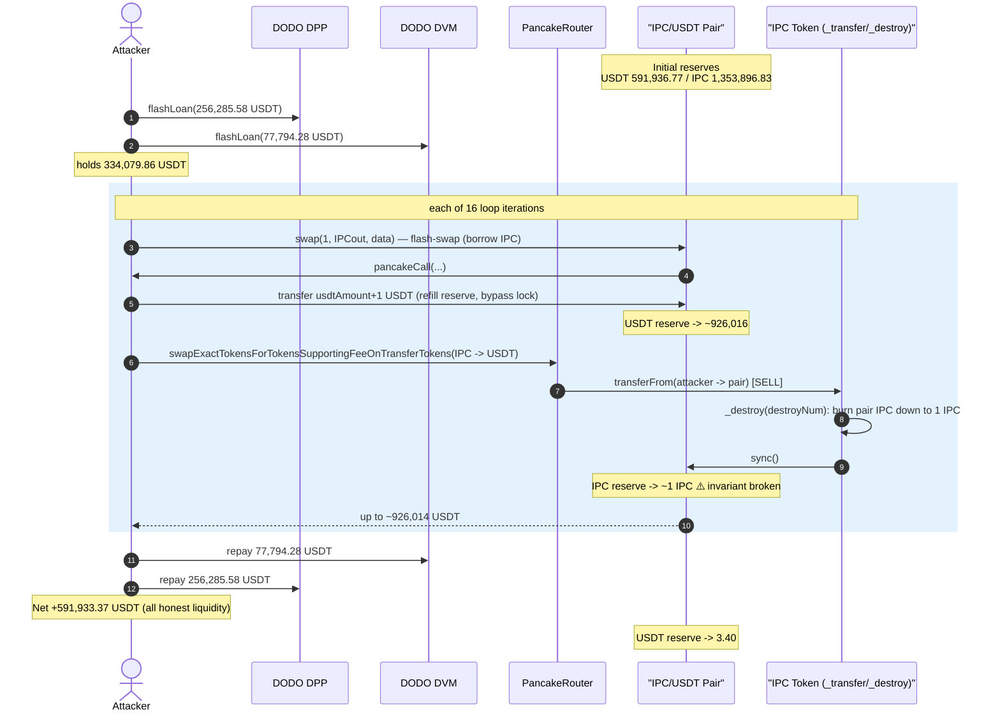
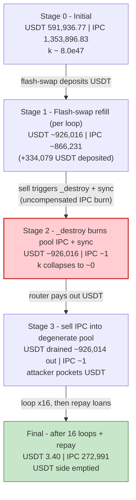
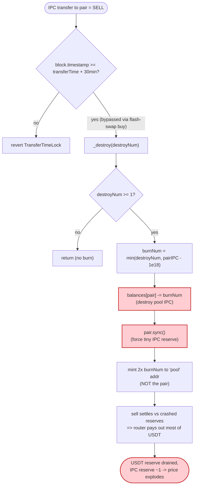

# AI IPC Token Exploit — Sell-Triggered Pool Burn (`_destroy`) Drains the AMM Reserve

> **Vulnerability classes:** vuln/logic/incorrect-state-transition · vuln/oracle/price-manipulation

> One-line summary: every IPC **sell** first burns the pair's own IPC down to a 1-token floor and
> `sync()`s the pool, so an attacker who repeatedly sells crashes the IPC reserve to ~1 wei-token and
> walks off with the entire USDT side of the pool — ~**591,933 USDT (~$590K)**.

> **Reproduction:** the PoC compiles & runs in an isolated Foundry project at
> [this project folder](.). The umbrella DeFiHackLabs repo does not whole-compile, so this PoC was
> extracted. Full verbose trace: [output.txt](output.txt).
> Verified vulnerable source: [sources/Token_EAb0d4/Token_extracted.sol](sources/Token_EAb0d4/Token_extracted.sol).

---

## Key info

| | |
|---|---|
| **Loss** | ~**591,933 USDT** (~$590K) drained from the IPC/USDT PancakeSwap pair |
| **Vulnerable contract** | `Token` ("AI IPC", symbol `IPC`) — [`0xEAb0d46682Ac707A06aEFB0aC72a91a3Fd6Fe5d1`](https://bscscan.com/address/0xEAb0d46682Ac707A06aEFB0aC72a91a3Fd6Fe5d1#code) |
| **Victim pool** | IPC/USDT PancakeV2 pair — [`0xDe3595a72f35d587e96d5C7B6f3E6C02ed2900AB`](https://bscscan.com/address/0xDe3595a72f35d587e96d5C7B6f3E6C02ed2900AB) |
| **Capital source** | DODO flash loans — DPP [`0x6098…B476`](https://bscscan.com/address/0x6098A5638d8D7e9Ed2f952d35B2b67c34EC6B476) + DVM [`0x0e15…55A7`](https://bscscan.com/address/0x0e15e47C3DE9CD92379703cf18251a2D13E155A7) (0% fee) |
| **Attack tx (front-run)** | `0x5ef1edb9749af6cec511741225e6d47103e0b647d1e41e08649caaff66942a91` |
| **Victim tx (poor guys)** | `0x3a3683119e1801821faa15c319cb9c8fb3fcf6ee92b1904a829d82c432e09a44` |
| **Chain / block / date** | BSC / 45,561,316 (forked at −1) / 2025‑01‑07 |
| **Compiler** | Solidity v0.8.6, optimizer 1 run |
| **Bug class** | Broken AMM invariant — token `_transfer` hook burns from the pool and `sync()`s on every sell |
| **Reference** | TenArmor: https://x.com/TenArmorAlert/status/1876663900663370056 |

---

## TL;DR

`Token` ("AI IPC") is a deflationary token with a "destroy → reproduce" mechanic. On **every sell**
(an IPC transfer **into** the IPC/USDT pair), the token's `_transfer` hook calls
`_destroy(destroyNum)` ([Token_extracted.sol:225](sources/Token_EAb0d4/Token_extracted.sol#L225)),
which:

1. **Burns IPC directly out of the pair's balance** down to a fixed `1e18` floor
   ([:279-283](sources/Token_EAb0d4/Token_extracted.sol#L279-L283)), and
2. **Calls `pair.sync()`** ([:284](sources/Token_EAb0d4/Token_extracted.sol#L284)), forcing the pair
   to accept the shrunken IPC balance as its real reserve.

This is an *un-compensated* deletion of one side of the pool: IPC is annihilated, no USDT leaves, so
the constant product `k = reserveUSDT · reserveIPC` collapses and IPC's marginal price explodes.
Critically the burn happens **before** the seller's own IPC arrives at the pair, so the router's
fee-on-transfer sell then prices the seller's IPC against a reserve of ~1 IPC and pays out almost the
entire USDT reserve.

The attacker:

1. Takes two **DODO flash loans** totalling **334,079.86 USDT** (0% fee).
2. Loops 16 times. In each loop it (a) does a `pair.swap(1, …)` flash-swap that deposits the USDT back
   into the pair (refilling the USDT reserve to ~926,016 and bypassing the 30-min sell time-lock), then
   (b) sells its IPC through the router. The `_destroy` burn crushes the IPC reserve to ~1 IPC right
   before each sell, so each sell pulls out up to ~**926,014 USDT**.
3. Repays both flash loans and keeps the difference.

Net: the pool's USDT reserve goes from **591,936 → 3.4 USDT**; the attacker ends with
**591,933.37 USDT** (started from 0). Profit = the entire honest USDT liquidity.

---

## Background — what AI IPC does

`Token` ([source](sources/Token_EAb0d4/Token_extracted.sol)) is an ERC20 with a "play-to-deflate"
gimmick wired into its transfer hook:

- **Trading gate** — transfers revert with `NoOpenSwap` unless `isOpenSwap == true`
  ([:194-198](sources/Token_EAb0d4/Token_extracted.sol#L194-L198)); at the fork block trading was open.
- **Buy/Sell taxes** — buys pay `MARKET_TAX = 1.5%`; sells pay `MARKET_TAX + PUBLISH_TAX = 3.5%`
  ([:215](sources/Token_EAb0d4/Token_extracted.sol#L215), [:224](sources/Token_EAb0d4/Token_extracted.sol#L224)),
  split to fee wallets.
- **30-minute sell time-lock** — a seller cannot sell within `TRANSFER_LOCK = 30 minutes` of receiving
  tokens ([:223](sources/Token_EAb0d4/Token_extracted.sol#L223)).
- **"Destroy & reproduce"** — on each sell, `destroyNum` accumulates `(amount − fee)/2`
  ([:226](sources/Token_EAb0d4/Token_extracted.sol#L226)); on the *next* sell `_destroy(destroyNum)`
  burns that many IPC **from the pool** and mints `2×` new IPC to a separate `pool` address
  ([:290-296](sources/Token_EAb0d4/Token_extracted.sol#L290-L296)).

The pair's token ordering matters: `USDT (0x55d3…)` < `IPC (0xEAb0…)`, so **`token0 = USDT`,
`token1 = IPC`** (`reserve0 = USDT`, `reserve1 = IPC`).

On-chain state at the fork block (from the trace):

| Parameter | Value |
|---|---|
| Pool **USDT** reserve (`reserve0`) | **591,936.77 USDT** ← the prize |
| Pool **IPC** reserve (`reserve1`) | 1,353,896.83 IPC |
| Sell fee | 3.5% |
| `_destroy` pool-IPC floor | `1e18` = **1 IPC** |
| Flash-loan fee (DODO DPP/DVM) | 0% |

---

## The vulnerable code

### 1. Every sell calls `_destroy` *before* the sale settles

```solidity
} else if (recipient == pair && sender != address(this)) {
    if (_isAddLP(pair)) {
        lastSellIsAdd = true;
    } else {
        //sell
        if (block.timestamp < transferTime[sender] + TRANSFER_LOCK) revert TransferTimeLock();
        fee = amount * (MARKET_TAX + PUBLISH_TAX) / 1000;
        _destroy(destroyNum);                 // ⚠️ burns POOL IPC + sync() BEFORE the sell lands
        destroyNum += (amount - fee) / 2;     // accumulates next burn
        lastDestroyNum = (amount - fee) / 2;
        _sell(fee);
    }
}
```
[Token_extracted.sol:218-229](sources/Token_EAb0d4/Token_extracted.sol#L218-L229)

### 2. `_destroy` deletes the pair's IPC and force-`sync()`s it

```solidity
function _destroy(uint256 burnNum) internal {
    if (burnNum < 1) return;
    address pair = IUniswapV2Factory(SWAP_V2_FACTORY).getPair(USDT, address(this));
    uint256 pairToken = IERC20(address(this)).balanceOf(pair);
    if (pairToken - 10**18 < burnNum) {
        burnNum = pairToken - 10**18;     // floor the pool's IPC down to 1 IPC
    }
    balances[pair] -= burnNum;            // ⚠️ destroy IPC held by the pair...
    balances[address(0)] += burnNum;
    IUniswapV2Pair(pair).sync();          // ⚠️ ...and force the pair to accept the new (tiny) reserve
    emit Transfer(pair, address(0), burnNum);
    destroyNum -= burnNum;
    lastDestroyNum = 0;

    // "produce" -> mint 2x to a SEPARATE pool address (not the pair)
    uint256 produceNum = burnNum * 2;
    if (totalSupply + produceNum > MAX_TOTAL_SUPPLY) {
        produceNum = MAX_TOTAL_SUPPLY - totalSupply;
    }
    totalSupply += produceNum;
    balances[pool] += produceNum;
    emit Transfer(address(0), pool, produceNum);
}
```
[Token_extracted.sol:275-297](sources/Token_EAb0d4/Token_extracted.sol#L275-L297)

The `burnNum = pairToken - 10**18` clamp means the burn always reduces the pair's IPC to exactly
**1 IPC**, no matter how large `destroyNum` is. The compensating mint goes to `pool` (a different
address), **not** to the pair — so the pair never gets its IPC back. One side of the pool is deleted
for free.

---

## Root cause — why it was possible

A Uniswap-V2/PancakeSwap pair prices assets from its reserves and enforces `x·y ≥ k` only **inside
`swap()`**. `sync()` exists so the pair can adopt its real token balances as reserves — it trusts that
balances only change through `mint`/`burn`/`swap` and ordinary transfers it can reason about.

`_destroy` violates that trust in the worst way:

> It **destroys** IPC held by the pair (`balances[pair] -= burnNum`) and then calls `pair.sync()`,
> telling the pair "your IPC reserve is now `1e18`." No USDT leaves the pair. `k` collapses and IPC's
> marginal price explodes — and this fires automatically on **every sell**, so anyone can drive it.

Four design decisions compose into the critical bug:

1. **The token mutates pool reserves from its own transfer hook.** Burning from `balances[pair]` and
   calling `sync()` inside `_transfer` makes the pair's reserves a function of token logic the pair
   can't see.
2. **The burn is taken 100% from the pool, clamped to a 1-IPC floor.** After a single big-enough sell
   the IPC reserve is pinned at 1 IPC, so subsequent sells price against ~0 reserve and pay out nearly
   the whole USDT side.
3. **`_destroy` runs *before* the sell transfer settles.** The router's
   `swapExactTokensForTokensSupportingFeeOnTransferTokens` measures the pair's USDT delta and pays the
   seller — but it does so against the already-crashed reserves, handing over the USDT.
4. **The "reproduce" mint never returns IPC to the pair** (it goes to `pool`), so the invariant damage
   is permanent within the transaction.

The 30-minute sell time-lock — the one friction that should stop instant sell-after-buy — is bypassed:
the attacker uses a `pair.swap(1, IPCout, …)` flash-swap whose router-buy path sets
`transferTime[recipient] = block.timestamp` ([:216](sources/Token_EAb0d4/Token_extracted.sol#L216)),
and repays in `pancakeCall` with USDT (the comment in the PoC literally reads *"为了绕过时间锁的检查，
同步换1 usdt出来"* — "to bypass the time-lock check, swap 1 unit out synchronously"). That same
flash-swap also **re-deposits the borrowed USDT into the pair**, refilling the USDT reserve to
~926,016 before each drain.

---

## Preconditions

- `isOpenSwap == true` (trading live) — satisfied at the fork block.
- `destroyNum ≥ 1` so the burn fires. `destroyNum` accumulates `(amount − fee)/2` on each sell, so even
  the attacker's own first sell seeds it; after the first loop the burn dominates.
- Working USDT capital to (a) refill the pair's USDT reserve via the flash-swap and (b) prime the sell.
  Fully recovered intra-transaction → **flash-loanable**. The PoC sources it from two DODO pools (0% fee):
  256,285.58 USDT (DPP) + 77,794.28 USDT (DVM) = **334,079.86 USDT** total.

---

## Attack walkthrough (with on-chain numbers from the trace)

`token0 = USDT (reserve0)`, `token1 = IPC (reserve1)`. All figures are from the `Sync`/`Swap` events in
[output.txt](output.txt).

| # | Step | USDT reserve | IPC reserve | Effect |
|---|------|-------------:|------------:|--------|
| 0 | **Initial honest pool** | 591,936.77 | 1,353,896.83 | `k ≈ 8.0e47` |
| 1 | Two DODO flash loans → attacker holds **334,079.86 USDT** | 591,936.77 | 1,353,896.83 | borrowed capital (0% fee) |
| 2a | **Flash-swap** `pair.swap(1, 487,665 IPC)` — borrow IPC out, `pancakeCall` deposits **334,079.86 USDT** back into the pair | **926,016.63** | 866,231.52 | USDT reserve refilled; sets `transferTime` to bypass lock |
| 2b | **Sell** 470,597 IPC via router → `_destroy` burns pool IPC to 1 IPC, `sync()`, then sale pays out | 926,016.63 | varies | IPC reserve crushed; attacker receives **325,452 USDT** |
| … | **Loop iterations 1–16** repeat (refill USDT → crash IPC → drain) | pinned ~926,016 each loop | pinned ~1 IPC | each sell pays up to **926,014 USDT** |
| 16 | Last sell | drained | — | attacker pulls the residual |
| 17 | **Repay** both flash loans (77,794.28 + 256,285.58 USDT) | — | — | loans closed |
| F | **Final pool** | **3.40** | 272,991.14 | USDT side emptied |

Per-iteration drain (router `IPC→USDT` sells):

| Iter | IPC sold | USDT received |
|-----:|---------:|--------------:|
| 1  | 470,597.02 | 325,452.44 |
| 2  | 452,654.07 | 385,723.85 |
| 3  | 435,537.13 | 477,855.28 |
| 4  | 419,276.25 | 635,974.24 |
| 5  | 403,967.65 | **926,014.33** |
| 6–16 | ≈ 273k–390k each | **≈ 926,013–926,014 each** |

From iteration 5 onward the IPC reserve is pinned at ~1 IPC, so each sell extracts essentially the
**entire** refilled USDT reserve (~926,014). The USDT is recycled through the flash-swap each loop; the
*net* taken across the loop is the pool's original 591,936 USDT of honest liquidity.

### Profit / loss accounting (USDT)

| Item | Amount |
|---|---:|
| Borrowed — DODO DPP flash loan | 256,285.58 |
| Borrowed — DODO DVM flash loan | 77,794.28 |
| **Total borrowed (repaid in full, 0% fee)** | **334,079.86** |
| Attacker USDT at start | 0.00 |
| Attacker USDT at end (after repaying both loans) | **591,933.37** |
| **Net profit** | **+591,933.37** |
| Pool USDT reserve before / after | 591,936.77 → **3.40** |

The profit (≈591,933 USDT) equals the pool's original USDT reserve (591,936.77) minus the ~3.4 USDT
dust left behind — the attacker simply walked off with all the honest USDT liquidity. Matches the
reported ~590K USDT loss.

---

## Diagrams

### Sequence of the attack



### Pool state evolution



### The flaw inside `_transfer` / `_destroy`



---

## Why each magic number

- **Flash-loan amounts (256,285.58 + 77,794.28 = 334,079.86 USDT):** exactly the working capital
  re-deposited into the pair each loop via the flash-swap. Refilling the USDT reserve to ~926,016
  maximises the USDT paid out by each subsequent crashed-reserve sell, and the same flash-swap path
  bypasses the 30-minute sell time-lock. The full amount is recovered, so the loan nets to zero.
- **`pair.swap(1, values[1], …)`:** borrows IPC out (and pulls `1` wei of USDT) so the attacker can sell
  IPC; the `pancakeCall` repays `usdtAmount + 1` USDT, refilling the USDT reserve. The "+1" repays the
  1 wei of USDT pulled out to make the flash-swap a valid `swap`.
- **16 loop iterations:** enough passes for the `_destroy` burn to fully pin the IPC reserve at ~1 IPC
  and drain the USDT side down to dust; each later iteration pulls ~926,014 USDT, of which only the net
  beyond the recycled capital is real profit.
- **`1e18` floor in `_destroy`:** the clamp `pairToken - 1e18` is the bug's amplifier — it guarantees
  the pool's IPC is reduced to exactly 1 IPC, so a sell of any size prices against ~0 reserve.

---

## Remediation

1. **Never burn from, or `sync()`, the liquidity pair inside a token transfer hook.** A token must
   only destroy balances it *owns* (treasury/own balance). Remove `balances[pair] -= burnNum` +
   `pair.sync()` from `_destroy` entirely. If deflation must reach LPs, do it by having the protocol buy
   and burn from its own funds, or by routing through the pair's own `burn()` (LP redemption) so both
   reserves move together and `k` is preserved.
2. **Do not mutate AMM reserves as a side effect of `_transfer`.** Any logic that changes
   `balances[pair]` and then `sync()`s makes the pool's price a function of arbitrary token logic and
   is trivially weaponizable.
3. **If a "destroy/reproduce" mechanic is a product requirement, keep it conserving.** Burned IPC must
   be returned to the *pair* (not a separate `pool` address) so the constant product is maintained, or
   the mechanic must operate outside the pool entirely.
4. **Cap single-operation reserve impact.** Any operation that can move a pool reserve by more than a
   small percentage in one call should revert; clamping the pool's IPC to a 1-token floor is a glaring
   red flag.
5. **Don't rely on a transfer-time-lock for sell protection.** It was bypassed with a flash-swap; the
   real fix is to stop the pool-reserve mutation, not to add more transfer gating.

---

## How to reproduce

The PoC was extracted into a standalone Foundry project (the umbrella DeFiHackLabs repo has several
unrelated PoCs that fail to compile under `forge test`'s whole-project build):

```bash
_shared/run_poc.sh 2025-01-IPC_exp -vvvvv
```

- RPC: a **BSC archive** endpoint is required (fork block 45,561,315). `foundry.toml` uses
  `https://bsc-mainnet.public.blastapi.io`, which serves historical state at that block; most public
  BSC RPCs prune it and fail with `header not found` / `missing trie node`.
- Result: `[PASS] testExploit()`.

Expected tail:

```
[PASS] testExploit() (gas: 2382390)
  [Begin] USDT balance before: 0.000000000000000000
  Pair balance 1353896825896647266100919
  USDT balance 334079859343840978338902
  [End] USDT balance after: 591933.365457689990081836

Suite result: ok. 1 passed; 0 failed; 0 skipped
```

---

*Reference: TenArmor — https://x.com/TenArmorAlert/status/1876663900663370056 (AI IPC, BSC, ~590K USDT).*
