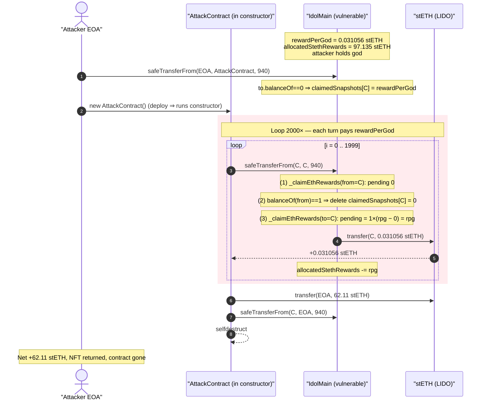
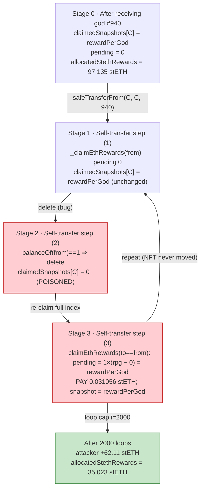
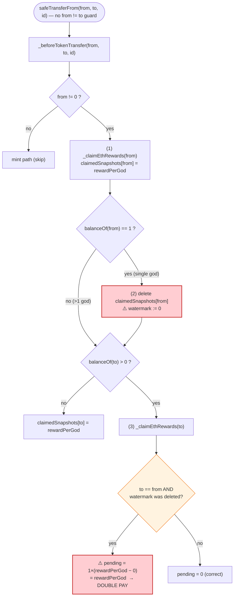

# The Idols NFT Exploit — Self-Transfer Reward Double-Claim via `delete claimedSnapshots`

> **Reproduction:** the PoC compiles & runs in an isolated Foundry project at
> [this project folder](.) (the umbrella DeFiHackLabs repo contains several unrelated
> PoCs that do not whole-compile, so this one was extracted).
> Full run log (passing): [output.txt](output.txt).
> Verified vulnerable source: [contracts_IdolMain.sol](sources/IdolMain_439cac/contracts_IdolMain.sol).

---

## Key info

| | |
|---|---|
| **Loss** | **97 stETH** total across ~15 repeated transactions (~$329K at the time). This PoC reproduces **one** drain transaction = **62.112824594370044737 stETH** (≈ $211K). |
| **Vulnerable contract** | `IdolMain` ("Idols / VIRTUE rewards") — [`0x439cac149B935AE1D726569800972E1669d17094`](https://etherscan.io/address/0x439cac149B935AE1D726569800972E1669d17094#code) |
| **Victim / reward pool** | The `IdolMain` contract's own stETH balance (god-owner reward pool). Pool stETH at fork block: **2,802.06 stETH**; `allocatedStethRewards`: **97.135 stETH** |
| **Reward token** | LIDO stETH — `0xae7ab96520DE3A18E5e111B5EaAb095312D7fE84` |
| **Attacker EOA** | [`0xE546480138D50Bb841B204691C39cC514858d101`](https://etherscan.io/address/0xe546480138d50bb841b204691c39cc514858d101) |
| **Attacker contract** | `0x22d22134612c0741EBDB3b74a58842D6e74E3b16` (deployed per-tx, self-destructs) |
| **Attack tx (one of ~15)** | [`0x5e989304b1fb61ea0652db4d0f9476b8882f27191c1f1d2841f8977cb8c5284c`](https://etherscan.io/tx/0x5e989304b1fb61ea0652db4d0f9476b8882f27191c1f1d2841f8977cb8c5284c) |
| **Chain / block / date** | Ethereum mainnet / fork at **21,624,138** (tx in 21,624,139) / Jan 16, 2025 |
| **Compiler** | Source `^0.8.9`; PoC built with Solc 0.8.34 |
| **Bug class** | Broken reward accounting — a single NFT used as both `from` and `to` of a transfer is paid its cumulative reward twice per transfer, because the per-holder claim snapshot is `delete`d mid-hook |

---

## TL;DR

`IdolMain` is an NFT ("god") that streams stETH rewards to its holders. It tracks a global
cumulative reward index `rewardPerGod` and, per holder, a `claimedSnapshots[addr]` watermark.
Pending reward = `balanceOf(addr) * (rewardPerGod − claimedSnapshots[addr])`.

The bug lives in the `_beforeTokenTransfer` hook
([contracts_IdolMain.sol:211-241](sources/IdolMain_439cac/contracts_IdolMain.sol#L211-L241)).
On every transfer it:

1. claims rewards for `from` (sets `claimedSnapshots[from] = rewardPerGod`), then
2. **if `balanceOf(from) == 1`, `delete claimedSnapshots[from]`** (resets the watermark to **0**), then
3. claims rewards for `to`.

When the attacker calls `safeTransferFrom(self, self, tokenId)` with a **single** god, `from == to`
and `balanceOf == 1`, so the three steps execute on the **same address**:

- Step 1 claims `0` (already up to date) and writes `claimedSnapshots[self] = rewardPerGod`.
- Step 2 **wipes** `claimedSnapshots[self]` to `0`.
- Step 3 now sees pending = `1 * (rewardPerGod − 0) = rewardPerGod` and **pays out the entire
  cumulative reward index again**, then re-sets the snapshot to `rewardPerGod`.

The NFT never actually moves (it's transferred to itself), so the attacker can repeat this in a
tight loop. Each iteration mints **`rewardPerGod` ≈ 0.031056 stETH** out of the contract's reward
pool for free. The PoC loops 2000 times in one transaction and walks away with
**2000 × rewardPerGod = 62.11 stETH**, draining `allocatedStethRewards` from 97.135 → 35.023 stETH.
Repeating the transaction ~15 times emptied the entire allocated-reward pool for **97 stETH** total.

---

## Background — what Idols / VIRTUE does

`IdolMain` ([source](sources/IdolMain_439cac/contracts_IdolMain.sol)) is an
`ERC721Enumerable` collection of 9,999 "god" NFTs. Holders earn a share of stETH staking yield that
the protocol accrues. The accounting is a classic "scaled reward per share" pattern:

- **`rewardPerGod`** ([:35-37](sources/IdolMain_439cac/contracts_IdolMain.sol#L35-L37)) — a global,
  monotonically-increasing cumulative reward index: total stETH ever distributed, per god.
- **`claimedSnapshots[addr]`** ([:39-40](sources/IdolMain_439cac/contracts_IdolMain.sol#L39-L40)) — the
  value of `rewardPerGod` the address has already been paid up to (its "watermark").
- **`getPendingStethReward`** ([:340-346](sources/IdolMain_439cac/contracts_IdolMain.sol#L340-L346)):
  `balanceOf(_user) * (rewardPerGod − claimedSnapshots[_user])`.
- **`allocatedStethRewards`** ([:16-17](sources/IdolMain_439cac/contracts_IdolMain.sol#L16-L17)) — the
  pool of stETH set aside for holders. Every claim subtracts from this.

New stETH yield is folded into the index by `updateRewardPerGod()`
([:288-316](sources/IdolMain_439cac/contracts_IdolMain.sol#L288-L316)):
`rewardPerGod += newRewards / totalSupply()`. Rewards are realized lazily — they are claimed
automatically whenever a god moves, via the `_beforeTokenTransfer` hook.

On-chain parameters at the fork block (read via `cast` against block 21,624,138):

| Parameter | Value |
|---|---|
| `totalSupply()` | **9,999** gods |
| `rewardPerGod()` | **31,056,412,297,185,023** (≈ **0.031056 stETH** / god, cumulative) |
| `allocatedStethRewards()` | **97,135,410,291,716,695,287** (≈ **97.135 stETH**) |
| stETH held by `IdolMain` | **2,802.06 stETH** |
| `ownerOf(940)` | `0xE546…d101` (attacker EOA) |
| attacker `balanceOf` | **1** god (token id 940) |
| attacker `claimedSnapshots` | `rewardPerGod` (already up to date) |

The decisive fact: the attacker holds exactly **one** god, so the `balanceOf(from) == 1` branch in
the transfer hook fires on **every** transfer — and that branch is what deletes the watermark.

---

## The vulnerable code

### 1. `safeTransferFrom` allows self-transfer of a held token

```solidity
function safeTransferFrom(address from, address to, uint256 tokenId, bytes memory _data)
  public virtual override {
  // Skip approval check for the marketplace address.
  if (msg.sender != marketplaceAddress) {
    require(_isApprovedOrOwner(_msgSender(), tokenId), "ERC721: transfer caller is not owner nor approved");
  }
  _safeTransfer(from, to, tokenId, _data);
}
```
[contracts_IdolMain.sol:120-131](sources/IdolMain_439cac/contracts_IdolMain.sol#L120-L131)

There is no `require(from != to)`. The owner can transfer a god to itself, which still runs the full
`_beforeTokenTransfer` hook.

### 2. The hook — the actual bug

```solidity
function _beforeTokenTransfer(address _from, address _to, uint256 _tokenId)
  internal virtual override
  onlyAllowedContracts(_to)
{
  super._beforeTokenTransfer(_from, _to, _tokenId);
  if (_from != address(0x0)) {
    if (lockedGods[_tokenId]) {
      require(deployTime + 365 days < block.timestamp, 'Token can only be transferred when lock has expired');
    }
    _claimEthRewards(_from);                       // (1) claim for from → snapshot[from] = rewardPerGod

    // If the user will have 0 NFTs left after this transfer, delete them from claimedSnapshots entirely.
    if (balanceOf(_from) == 1) {
      delete claimedSnapshots[_from];              // (2) ⚠️ snapshot[from] := 0
    }
  }

  // If the _to user already has NFTs, claim their rewards.
  if (balanceOf(_to) > 0) {
    _claimEthRewards(_to);                          // (3) claim for to → if to==from, pending = rewardPerGod!
  } else {
    claimedSnapshots[_to] = rewardPerGod;
  }
}
```
[contracts_IdolMain.sol:211-241](sources/IdolMain_439cac/contracts_IdolMain.sol#L211-L241)

### 3. The payout helper

```solidity
function _claimEthRewards(address _user) internal nonReentrant {
  uint256 currentRewards = getPendingStethReward(_user);       // balance * (rewardPerGod - snapshot)
  if (currentRewards > 0) {
    allocatedStethRewards = allocatedStethRewards - currentRewards;
    claimedSnapshots[_user] = rewardPerGod;
    require(steth.transfer(_user, currentRewards));            // ⚠️ stETH leaves the pool
  }
}
```
[contracts_IdolMain.sol:406-416](sources/IdolMain_439cac/contracts_IdolMain.sol#L406-L416)

`nonReentrant` here is irrelevant to the bug: each `_claimEthRewards` call in the hook is a
**separate** outer transfer call, not a re-entrant one. The double-payout happens by ordinary,
sequential execution of steps (1)→(2)→(3) within a single hook invocation.

---

## Root cause — why it was possible

The reward-snapshot pattern requires one invariant: **after a transfer settles, every involved
address's `claimedSnapshots` must equal the current `rewardPerGod`**, so that re-claiming yields 0.
The hook breaks this invariant for the `from == to` aliasing case.

The `delete claimedSnapshots[_from]` on line
[230-232](sources/IdolMain_439cac/contracts_IdolMain.sol#L230-L232) was intended as a *cleanup* for a
user who is sending away their **last** god — "you'll have 0 NFTs left, so forget your watermark." It
assumes `from` and `to` are different addresses, so that zeroing `from`'s watermark is harmless (it has
no more gods). But:

1. **The `balanceOf(from) == 1` check is evaluated *before* the actual transfer**, so for a real
   "send my last god away" it is correct. For a **self-transfer**, `from` will still own the god after
   the no-op move, yet the watermark is reset anyway.
2. **`from` and `to` are the same storage slot.** Setting `claimedSnapshots[from]` to `0` in step (2)
   directly poisons the value that step (3)'s `getPendingStethReward(to)` reads. The address is paid
   `rewardPerGod − 0 = rewardPerGod` for a balance it never lost.
3. **No `from != to` guard** on `safeTransferFrom` / the hook, so the aliasing is reachable
   permissionlessly by any single-god owner.
4. **The payout is real stETH**, drawn from a shared pool (`allocatedStethRewards`) funded by other
   holders' yield. The attacker's gain is every other holder's loss.

The net effect each self-transfer: the contract pays out `1 × rewardPerGod` and subtracts the same
amount from `allocatedStethRewards`, with **no corresponding change in NFT ownership**. It is an
infinite faucet bounded only by the size of the allocated-reward pool and the per-tx gas limit.

A secondary, defense-in-depth failure: the `onlyAllowedContracts` modifier
([:457-467](sources/IdolMain_439cac/contracts_IdolMain.sol#L457-L467)) only checks
`Address.isContract(_to)`, which returns **false while a contract is still inside its constructor**
(runtime code size is 0). The PoC runs the entire exploit inside the attack contract's `constructor`,
so even a blacklist would have been bypassed — though here `allowAllContracts = true` by default
([:94](sources/IdolMain_439cac/contracts_IdolMain.sol#L94)) makes this moot.

---

## Preconditions

- Own (or borrow) **exactly one** god NFT so the `balanceOf(from) == 1` branch fires. (A holder of
  >1 god would not trip the `delete`; that is why the attacker funneled a single token id 940 into the
  attack contract each round.)
- `allocatedStethRewards > 0` and `rewardPerGod > 0` (there must be a non-empty reward pool and a
  non-zero index). At the fork block both held (97.135 stETH allocated, 0.031 stETH/god index).
- The loop self-terminates only when `rewardPerGod > allocatedStethRewards`
  ([PoC:56-57](test/IdolsNFT_exp.sol#L56-L57)) — i.e. when the pool is nearly empty. With 97 stETH
  allocated and 0.031 stETH per iteration, that requires ~3,100 iterations, so a single 2000-iteration
  transaction does not exhaust it; the attacker simply repeated the tx ~15 times.
- No flash loan or capital needed — the only "input" is a single NFT, which is returned at the end.

---

## Attack walkthrough (with on-chain numbers from the run)

The PoC's `setUp` forks mainnet at block **21,624,138** and tracks the attacker's stETH balance.
`testExploit` ([test/IdolsNFT_exp.sol:37-47](test/IdolsNFT_exp.sol#L37-L47)) precomputes the attack
contract's address, transfers god #940 into it, then deploys it — the entire drain happens in the
`AttackContract` constructor ([test/IdolsNFT_exp.sol:50-74](test/IdolsNFT_exp.sol#L50-L74)).

All figures below were confirmed by an instrumented re-run that logged per-iteration payouts and the
final pool state (then removed); the headline `62.112824594370044737 stETH` is from the canonical
[output.txt](output.txt).

| # | Step | What happens on-chain | Numbers |
|---|------|----------------------|---------|
| 0 | **Setup** | Attacker EOA transfers god #940 → attack contract. In the hook, `to` (contract) had `balanceOf==0`, so `claimedSnapshots[contract] = rewardPerGod`. | `rewardPerGod = 0.031056412297185023 stETH`; `allocatedStethRewards = 97.135 stETH` |
| 1 | **Self-transfer (iter 0)** | `safeTransferFrom(contract, contract, 940)`. Step (1) claims 0 (watermark already = rpg). Step (2) `delete` watermark → 0. Step (3) pending = `1 × (rpg − 0) = rpg` → **paid out**. | +0.031056412297185022 stETH this iter |
| 2 | **Self-transfer (iter 1)** | Identical. Watermark was reset to `rpg` by step (3) of iter 0, deleted again in step (2), re-paid in step (3). | +0.031056412297185022 stETH |
| 3 | **Self-transfer (iter 2…1999)** | Loop continues; `rewardPerGod (0.031) > allocatedStethRewards` never becomes true within 2000 iters (pool only drops to 35 stETH). | +0.031056… per iter |
| 4 | **Loop ends at iter 2000** | Hard loop cap `i < 2000` reached. | total = `2000 × rpg` = **62.112824594370044738 stETH** |
| 5 | **Exit** | Contract transfers all stETH + god #940 back to attacker, approves accomplices, `selfdestruct`s. | Attacker net **+62.11 stETH** this tx |

Per-iteration mechanism (verified by instrumentation):

```
iter 0  stETH gained: 31056412297185022   snapshot now: 31056412297185023 (= rewardPerGod)
iter 1  stETH gained: 31056412297185022   snapshot now: 31056412297185023
iter 2  stETH gained: 31056412297185023   snapshot now: 31056412297185023
...
total iterations: 2000
final stETH balance:        62112824594370044738   (= 2000 × rewardPerGod)
final allocatedStethRewards: 35022585697346649287   (97.135 − 62.11 = 35.02 stETH)
```

The exact identity `received = 2000 × rewardPerGod` and the matching `allocatedStethRewards` decrease
(`97.135 − 62.11 = 35.02`) prove the attacker drew the stETH directly from the shared holder-reward
pool, one full reward index per loop turn.

### Profit / loss accounting (single transaction)

| Party | Δ stETH | Note |
|---|---:|---|
| Attacker | **+62.112824594370044737** | All from the reward pool; NFT returned, no capital spent |
| `IdolMain` reward pool (`allocatedStethRewards`) | **−62.112824594370046** | 97.135 → 35.023 stETH |
| Honest god holders (collectively) | **−62.11** (claims now under-collateralized) | Their pending rewards are no longer backed |

| Across the full incident | stETH |
|---|---:|
| Total stolen (~15 repeated txs) | **≈ 97** (the entire `allocatedStethRewards`) |

---

## Diagrams

### Sequence of one drain transaction



### State evolution of the snapshot vs. the reward pool



### The flaw inside `_beforeTokenTransfer`



---

## Remediation

1. **Reject self-transfers (or handle aliasing explicitly).** Add `require(from != to, "self-transfer")`
   to `safeTransferFrom`/`transferFrom`, or in the hook short-circuit when `_from == _to`. This alone
   closes the exploit.
2. **Do not `delete` the snapshot inside the transfer hook based on a pre-transfer balance.** The
   "user has 0 gods left" cleanup must run **after** the transfer completes and must read the
   post-transfer balance — and must never zero a watermark for an address that still holds gods. A
   correct cleanup is: `if (balanceOf(from) == 0) delete claimedSnapshots[from];` placed in
   `_afterTokenTransfer`. Zeroing a *non-zero-balance* address's watermark is always a payout bug.
3. **Settle `to` before mutating `from`'s storage when they can alias.** If `from` and `to` may be the
   same key, never write one then read the other expecting independence. Compute and pay both
   pending amounts from snapshotted values captured at the top of the hook.
4. **Make `claimedSnapshots` monotonic.** A claim watermark should only ever increase to
   `rewardPerGod`; an operation that resets it to `0` for an address that has already been paid is a
   red flag. Consider asserting `claimedSnapshots[addr] <= rewardPerGod` and never decreasing it.
5. **Fix the contract-gate bypass (defense in depth).** `Address.isContract()` returns false during
   construction; do not rely on it for access control. Use `tx.origin == msg.sender` checks sparingly,
   an explicit allowlist of EOAs, or accept that contract gating is unenforceable and design rewards to
   be safe regardless of caller type.

---

## How to reproduce

The PoC was extracted into a standalone Foundry project (the umbrella DeFiHackLabs repo has several
unrelated PoCs that fail to compile under `forge test`'s whole-project build). It imports the repo's
shared `basetest.sol` + `tokenhelper.sol` (copied into the project) and `interface.sol`.

```bash
_shared/run_poc.sh 2025-01-IdolsNFT_exp -vvvvv
```

- RPC: an **Ethereum mainnet archive** endpoint is required (fork block 21,624,138).
  `foundry.toml` uses an Infura archive endpoint.
- Note: forge 1.5.0 does not print call traces for passing tests, so [output.txt](output.txt) shows
  compiler warnings + the result; the attacker's before/after stETH balance is logged by the
  `balanceLog` modifier.

Expected tail:

```
Ran 1 test for test/IdolsNFT_exp.sol:IdolsNFT
[PASS] testExploit() (gas: 120742844)
Logs:
  Attacker Before exploit stETH Balance: 0.000000000000000000
  Attacker After exploit stETH Balance: 62.112824594370044737
```

---

*References: rekt — https://rekt.news/theidolsnft-rekt · TenArmor —
https://x.com/TenArmorAlert/status/1879376744161132981*
