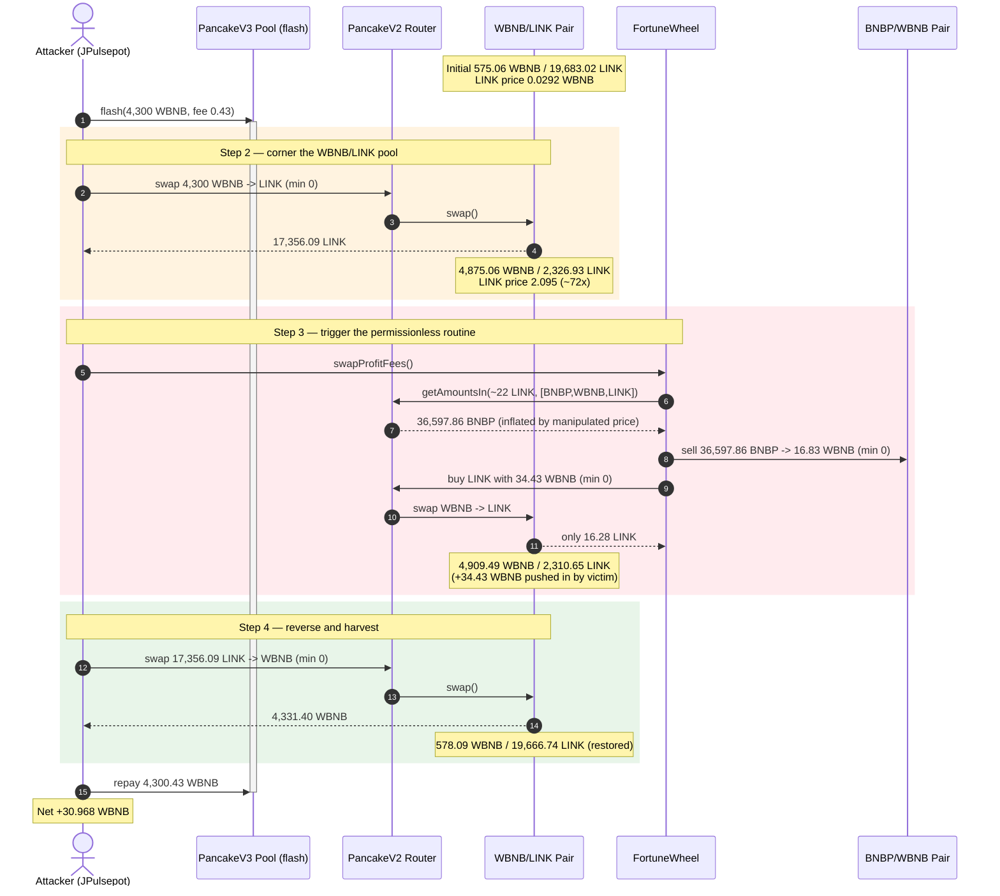
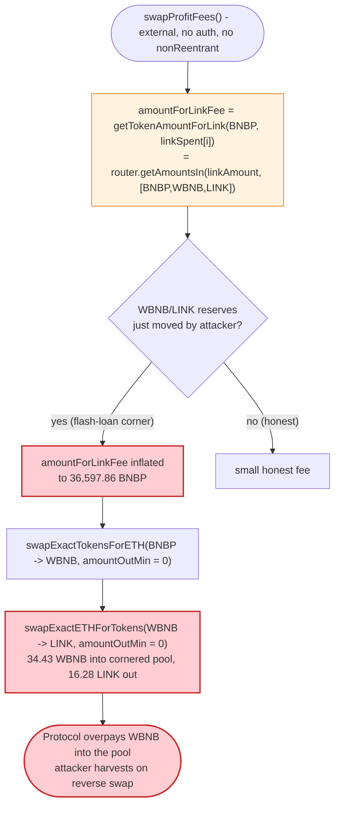

# JPulsepot / FortuneWheel Exploit — Permissionless `swapProfitFees()` + Spot-Price Fee Sizing

> One-liner: a permissionless, slippage-blind fee-conversion routine reads a **live, flash-loan-manipulable** PancakeSwap spot price to size how much of the casino's reserves it dumps for LINK — letting an attacker force the protocol to overpay into a pool the attacker controls and harvest the difference.

> **Reproduction:** the PoC compiles & runs in an isolated Foundry project at
> [this project folder](.) (the umbrella DeFiHackLabs repo contains many unrelated PoCs that do
> not whole-compile, so this one was extracted). Full verbose trace:
> [output.txt](output.txt). Verified vulnerable source:
> [contracts_FortuneWheel_FortuneWheel.sol](sources/FortuneWheel_384b9f/contracts_FortuneWheel_FortuneWheel.sol).

---

## Key info

| | |
|---|---|
| **Loss** | ~$21.5K — **30.968 WBNB** profit, extracted from the FortuneWheel casino's accumulated fees / liquidity |
| **Vulnerable contract** | `FortuneWheel` — [`0x384b9fb6E42dab87F3023D87ea1575499A69998E`](https://bscscan.com/address/0x384b9fb6E42dab87F3023D87ea1575499A69998E#code) |
| **Victim pool** | WBNB/LINK PancakeV2 pair — [`0x824eb9faDFb377394430d2744fa7C42916DE3eCe`](https://bscscan.com/address/0x824eb9faDFb377394430d2744fa7C42916DE3eCe) |
| **Fee token sold** | `BNBP` — [`0x4D9927a8Dc4432B93445dA94E4084D292438931F`](https://bscscan.com/address/0x4D9927a8Dc4432B93445dA94E4084D292438931F) |
| **Flash-loan source** | PancakeV3 pool — `0x172fcD41E0913e95784454622d1c3724f546f849` (WBNB/USDT) |
| **Attacker EOA** | [`0xf1e73123594cb0f3655d40e4dd6bde41fa8806e8`](https://bscscan.com/address/0xf1e73123594cb0f3655d40e4dd6bde41fa8806e8) |
| **Attacker contract** | [`0xe40ab156440804c3404bb80cbb6b47dddd3abfd7`](https://bscscan.com/address/0xe40ab156440804c3404bb80cbb6b47dddd3abfd7) |
| **Attack tx** | [`0xd6ba15ecf3df9aaae37450df8f79233267af41535793ee1f69c565b50e28f7da`](https://bscscan.com/tx/0xd6ba15ecf3df9aaae37450df8f79233267af41535793ee1f69c565b50e28f7da) |
| **Chain / block / date** | BSC / 45,640,245 / January 10, 2025 |
| **Compiler** | Solidity v0.8.19, optimizer **5 runs** |
| **Bug class** | Flash-loan price manipulation feeding an un-protected, permissionless internal swap (no slippage, no access control, spot price as oracle) |

---

## TL;DR

`FortuneWheel` is an on-chain casino. House profit accumulates per game in various tokens. A
maintenance routine, **`swapProfitFees()`** ([contracts_FortuneWheel_FortuneWheel.sol:737-846](sources/FortuneWheel_384b9f/contracts_FortuneWheel_FortuneWheel.sol#L737-L846)),
periodically liquidates that profit: it sells each casino token to BNB, then buys LINK to top up the
Chainlink VRF subscription and buys BNBP for the lottery pool. Two design flaws combine fatally:

1. **It is `external` with no access control and no reentrancy / pricing guard** — anyone can call it
   at any moment.
2. **It sizes how much token to sell from a live spot price.** The amount of fee it converts for LINK,
   `amountForLinkFee`, is computed by `getTokenAmountForLink()`
   ([:665-680](sources/FortuneWheel_384b9f/contracts_FortuneWheel_FortuneWheel.sol#L665-L680)), which
   calls `router.getAmountsIn(linkAmount, [token, WBNB, LINK])` against the *current* PancakeSwap
   reserves. Every subsequent swap uses `amountOutMin = 0` (zero slippage protection).

The attacker simply **inflates the WBNB→LINK price ~72×** with a flash-loaned swap, *then* calls
`swapProfitFees()`. Because LINK now looks ~72× more expensive, `getTokenAmountForLink` returns a
massively inflated `amountForLinkFee` (**36,597.86 BNBP** to "cover" a ~22 LINK fee). The casino dutifully
sells that huge BNBP slug for WBNB and then buys LINK with it at the manipulated price — **dumping
~34.4 WBNB into the very pool the attacker has cornered**. The attacker reverses its position and walks
off with the WBNB the protocol overpaid.

All of this happens inside a single PancakeV3 flash-loan callback, so the attacker needs **no capital**:

1. Flash-loan **4,300 WBNB**.
2. Swap 4,300 WBNB → **17,356.09 LINK** in the WBNB/LINK pair — emptying LINK out, making it ~72×
   pricier.
3. Call **`swapProfitFees()`** — the casino, seeing the distorted price, sells **36,597.86 BNBP**,
   converts ~16.83 WBNB to ~16.28 LINK (overpaying), pushing **34.43 WBNB into the cornered pool**.
4. Swap the **17,356.09 LINK back → 4,331.40 WBNB** (now worth more, thanks to the protocol's injected
   WBNB).
5. Repay **4,300.43 WBNB** (loan + 0.43 fee). Keep the **30.968 WBNB** difference.

---

## Background — what FortuneWheel does

`FortuneWheel` ([source](sources/FortuneWheel_384b9f/contracts_FortuneWheel_FortuneWheel.sol)) is a
multi-token roulette ("casino") contract on BSC:

- Each "casino" (a `Casino` struct, [:66-81](sources/FortuneWheel_384b9f/contracts_FortuneWheel_FortuneWheel.sol#L66-L81))
  has a `tokenAddress`, accumulated `liquidity`, `profit`, and a `fee` rate. Users bet a token, an
  outcome is drawn via Chainlink VRF, and the house's edge accrues as `profit`.
- Running the VRF costs LINK. The contract tracks LINK spent per casino in `linkSpent[i]`
  ([:58](sources/FortuneWheel_384b9f/contracts_FortuneWheel_FortuneWheel.sol#L58)) and must keep its
  Chainlink subscription funded.
- **`swapProfitFees()`** is the housekeeping function that turns accrued token profit into (a) LINK to
  refill the VRF subscription, and (b) BNBP for the lottery pot. To do that it leans entirely on the
  PancakeSwap router for both pricing (`getAmountsIn` / `getAmountsOut`) and execution
  (`swapExactTokensForETH` / `swapExactETHForTokens`), all with `amountOutMin = 0`.

Relevant constants (from the verified source):

| Parameter | Value |
|---|---|
| `pancakeRouterAddr` | `0x10ED43C718714eb63d5aA57B78B54704E256024E` (PancakeV2 Router) |
| `linkTokenAddr` (ERC20 LINK) | `0xF8A0BF9cF54Bb92F17374d9e9A321E6a111a51bD` |
| `link677TokenAddr` (ERC677 LINK) | `0x404460C6A5EdE2D891e8297795264fDe62ADBB75` |
| `pegSwapAddr` | `0x1FCc3B22955e76Ca48bF025f1A6993685975Bb9e` |
| `coordinatorAddr` (VRF) | `0xc587d9053cd1118f25F645F9E08BB98c9712A4EE` |
| `subscriptionId` | 675 |
| `linkPerBet` | 0.045 LINK |
| Casino token in this attack | `BNBP` `0x4D9927…931F` |

The whole game is that `swapProfitFees()` reads **the same WBNB/LINK pool the attacker can move** in
order to decide how many BNBP to liquidate — and then liquidates and re-buys at that moved price.

---

## The vulnerable code

### 1. Fee size is read from a live, manipulable spot price

```solidity
function getTokenAmountForLink(address tokenAddr, uint256 linkAmount) public view returns (uint256) {
    IPancakeRouter02 router = IPancakeRouter02(pancakeRouterAddr);
    address[] memory path;
    if (tokenAddr == address(0) || tokenAddr == wbnbAddr) {
        path = new address[](2);
        path[0] = wbnbAddr;
        path[1] = linkTokenAddr;
    } else {
        path = new address[](3);
        path[0] = tokenAddr;     // BNBP
        path[1] = wbnbAddr;      // WBNB
        path[2] = linkTokenAddr; // LINK  ← reserves the attacker just moved
    }
    return router.getAmountsIn(linkAmount, path)[0];   // ⚠️ spot-price quote, no TWAP/oracle
}
```

[contracts_FortuneWheel_FortuneWheel.sol:665-680](sources/FortuneWheel_384b9f/contracts_FortuneWheel_FortuneWheel.sol#L665-L680)

### 2. The permissionless, slippage-blind conversion routine

```solidity
function swapProfitFees() external {               // ⚠️ no onlyOwner / keeper, no nonReentrant
    IPancakeRouter02 router = IPancakeRouter02(pancakeRouterAddr);
    ...
    for (uint256 i = 1; i <= length; ++i) {
        Casino memory casinoInfo = tokenIdToCasino[i];
        ...
        uint256 gameFee = (availableProfit * casinoInfo.fee) / 100;
        uint256 amountForLinkFee = getTokenAmountForLink(casinoInfo.tokenAddress, linkSpent[i]); // ⚠️ manipulated
        ...
        token.approve(address(router), gameFee + amountForLinkFee);
        uint256[] memory swappedAmounts = router.swapExactTokensForETH(
            gameFee + amountForLinkFee,
            0,                                          // ⚠️ amountOutMin = 0 — no slippage guard
            path,                                       // [BNBP, WBNB]
            address(this),
            block.timestamp
        );
        ...
    }
    ...
    if (totalBNBForLink > 0) {
        path[1] = linkTokenAddr;
        uint256 linkAmount = router.swapExactETHForTokens{ value: totalBNBForLink }(
            0,                                          // ⚠️ amountOutMin = 0 — buys LINK at any price
            path,                                       // [WBNB, LINK] ← into the cornered pool
            address(this),
            block.timestamp
        )[1];
        ...
    }
    ...
}
```

[contracts_FortuneWheel_FortuneWheel.sol:737-830](sources/FortuneWheel_384b9f/contracts_FortuneWheel_FortuneWheel.sol#L737-L830)

The chain of decisions that the attacker hijacks:

- `amountForLinkFee = getTokenAmountForLink(BNBP, linkSpent[i])` → with LINK priced ~72× too high, this
  becomes **36,597.86 BNBP**.
- The casino then **sells those 36,597.86 BNBP for WBNB** (`swapExactTokensForETH`, `amountOutMin = 0`).
- It then **spends that WBNB buying LINK** (`swapExactETHForTokens{value: totalBNBForLink}`,
  `amountOutMin = 0`) — pushing **34.43 WBNB into the WBNB/LINK pool the attacker controls** while
  getting back only ~16.28 LINK.

---

## Root cause — why it was possible

A constant-product AMM's instantaneous price is *not* an oracle. `getAmountsIn` / `getAmountsOut`
return the price implied by the pool's **current** reserves, which any actor can shift within a single
transaction (here, with a flash loan). `swapProfitFees()` makes three compounding mistakes:

1. **Permissionless trigger.** `swapProfitFees()` is `external` with no `onlyOwner`, keeper allowlist,
   or `nonReentrant` guard. The attacker chooses *exactly when* it runs — i.e. immediately after they
   have distorted the WBNB/LINK price and while their flash loan is open.
2. **Spot price used to size a value transfer.** `amountForLinkFee` comes from
   `router.getAmountsIn(linkAmount, [BNBP, WBNB, LINK])`. Because LINK appears ~72× more expensive after
   the attacker's swap, the routine concludes it must liquidate **36,597.86 BNBP** to buy ~22 LINK of
   fees — far more BNBP than any honest run would touch. The protocol's own reserves are dumped on the
   attacker's terms.
3. **Zero slippage protection on every leg.** Both `swapExactTokensForETH` (BNBP→WBNB) and
   `swapExactETHForTokens` (WBNB→LINK) pass `amountOutMin = 0`. The WBNB→LINK leg therefore buys LINK at
   the manipulated price without complaint, donating ~34.43 WBNB into the cornered pool — which is the
   attacker's payday on the reverse swap.

The net effect: the attacker round-trips WBNB→LINK→WBNB (a trade that, alone, would *lose* fees), but
the protocol's forced, mispriced WBNB→LINK buy *in between the two legs* shifts the pool far enough in
the attacker's favor that the reverse swap returns **more** WBNB than the loan + fee. The protocol
literally pays the attacker's flash-loan fee and profit out of its accumulated house edge.

---

## Preconditions

- The WBNB/LINK PancakeV2 pair has enough depth to be manipulated profitably but is thin relative to the
  flash loan (initial reserves **575.06 WBNB / 19,683.02 LINK** — small enough that 4,300 WBNB moves the
  price ~72×).
- At least one casino has accrued profit / liquidity in a swappable token (here **BNBP**) and a non-zero
  `linkSpent[i]`, so `swapProfitFees()` actually performs the BNBP→WBNB→LINK conversion.
- `swapProfitFees()` is callable by anyone (it is — `external`, no guard).
- A flash-loan source for WBNB (PancakeV3 WBNB/USDT pool `0x172fcD41…f849`), making the attack
  **zero-capital**. Peak outlay is 4,300 WBNB, fully recovered intra-transaction.

---

## Step-by-step attack walkthrough (with on-chain numbers from the trace)

The WBNB/LINK pair `0x824eb9…` has `token0 = WBNB`, `token1 = LINK`, so `reserve0 = WBNB`,
`reserve1 = LINK`. All reserve figures are taken directly from the `getReserves` / `Sync` records in
[output.txt](output.txt).

| # | Step | WBNB reserve | LINK reserve | LINK price (WBNB/LINK) | Effect |
|---|------|-------------:|-------------:|-----------------------:|--------|
| 0 | **Initial** ([:1608](output.txt#L1608)) | 575.060 | 19,683.020 | 0.0292 | Honest pool. |
| 1 | **Flash-loan 4,300 WBNB** ([:1581](output.txt#L1581)) from PancakeV3, fee = 0.43 WBNB | — | — | — | Attacker now holds 4,300 WBNB. |
| 2 | **Swap 4,300 WBNB → 17,356.09 LINK** ([:1611-1623](output.txt#L1611)) | 4,875.060 | 2,326.931 | **2.0951** | LINK ~**72× pricier**; pool cornered. |
| 3 | **Call `swapProfitFees()`** ([:1632](output.txt#L1632)) — `getAmountsIn` quotes **36,597.86 BNBP** for the LINK fee ([:1641-1646](output.txt#L1641)) | | | | Distorted price feeds fee sizing. |
| 3a | Casino **sells 36,597.86 BNBP → 16.83 WBNB** (BNBP/WBNB pair) ([:1658-1671](output.txt#L1658)) | | | | House BNBP liquidated. |
| 3b | Casino **buys LINK with 34.43 WBNB → only 16.28 LINK** ([:1699-1713](output.txt#L1699)) at the manipulated price | 4,909.491 | 2,310.652 | 2.1247 | **34.43 WBNB pushed into the cornered pool** (overpayment). |
| 3c | Casino PegSwaps LINK→ERC677 LINK & funds VRF sub ([:1735-1772](output.txt#L1735)) | | | | Protocol completes "maintenance," none the wiser. |
| 4 | **Swap 17,356.09 LINK → 4,331.40 WBNB** ([:1790-1817](output.txt#L1790)) | 578.093 | 19,666.741 | 0.0294 | Reverse leg now worth more thanks to step 3b. |
| 5 | **Repay 4,300.43 WBNB** to PancakeV3 ([:1824-1835](output.txt#L1824)) | — | — | — | Loan + 0.43 fee returned. |
| 6 | **Profit retained** ([:1843](output.txt#L1843)) | — | — | — | **30.968 WBNB**. |

### Why the protocol overpaid

At the manipulated reserves (4,875 WBNB / 2,327 LINK), `getAmountsIn(linkAmount=~22 LINK,
[BNBP,WBNB,LINK])` returns **36,597.86 BNBP** — orders of magnitude more BNBP than an honest price would
imply. The casino then sells all of it and uses the proceeds to buy LINK at that same inflated price,
receiving only **16.28 LINK** for **34.43 WBNB**. That 34.43 WBNB lands in the pool the attacker has
cornered; the attacker's reverse LINK→WBNB swap scoops it up.

### Profit accounting (WBNB)

| Direction | Amount (WBNB) |
|---|---:|
| Borrowed (flash loan) | 4,300.000 |
| Swapped out — WBNB → LINK (leg 1) | −4,300.000 |
| Swapped in — LINK → WBNB (leg 2) | +4,331.398 |
| Flash-loan repayment (principal + 0.43 fee) | −4,300.430 |
| **Net profit** | **+30.968** |

The 30.968 WBNB equals, to the wei, the attacker's final reported WBNB balance
(`30968120414037532669` wei, [:1843](output.txt#L1843)). The gain is funded by the protocol's mispriced
WBNB→LINK purchase in step 3b (34.43 WBNB in for 16.28 LINK out), net of PancakeSwap trading fees and
the 0.43 WBNB flash-loan fee. The header's quoted loss of ~$21.5K is the dollar value of that profit at
the time of the attack.

---

## Diagrams

### Sequence of the attack



### Pool state / price evolution

```mermaid
stateDiagram-v2
    [*] --> S0
    S0: "Stage 0 - Initial<br/>WBNB 575.06 | LINK 19,683.02<br/>price 0.0292 WBNB/LINK"
    S1: "Stage 1 - After attacker WBNB->LINK<br/>WBNB 4,875.06 | LINK 2,326.93<br/>price 2.095 (~72x) - CORNERED"
    S2: "Stage 2 - After victim WBNB->LINK<br/>WBNB 4,909.49 | LINK 2,310.65<br/>+34.43 WBNB overpaid in"
    S3: "Stage 3 - After attacker LINK->WBNB<br/>WBNB 578.09 | LINK 19,666.74<br/>price restored; attacker took the WBNB"
    S0 --> S1: "swap 4,300 WBNB in (flash)"
    S1 --> S2: "swapProfitFees(): victim buys LINK at inflated price"
    S2 --> S3: "swap 17,356.09 LINK back out"
    S3 --> [*]: "repay 4,300.43, keep 30.968 WBNB"

    note right of S1
        Inflated LINK price makes
        getTokenAmountForLink return
        36,597.86 BNBP to liquidate
    end note
```



### The flaw inside `swapProfitFees`



---

## Remediation

1. **Gate `swapProfitFees()`.** Restrict it to the owner or a trusted keeper/automation role. A
   housekeeping function that moves protocol reserves through AMMs must never be permissionless.
2. **Do not size value transfers from spot prices.** `getTokenAmountForLink` / `getLinkAmountForToken`
   read `router.getAmountsIn/Out` against live reserves. Replace with a manipulation-resistant oracle
   (Chainlink price feed, or a Pancake TWAP observed over multiple blocks), or fix `amountForLinkFee`
   from configured, non-price-derived parameters.
3. **Enforce slippage on every swap.** Every `swapExact*` call passes `amountOutMin = 0`. Compute a
   minimum-out from an independent oracle and revert if the realized rate deviates beyond a tight band.
4. **Add reentrancy / single-block guards.** Mark the routine `nonReentrant` and consider a
   "not-in-flash-loan" check (e.g., disallow when the caller pattern indicates an open flash-loan
   callback), so the function cannot be invoked while a pool it depends on is mid-manipulation.
5. **Bound per-call liquidation size.** Cap how much of any casino's reserves a single `swapProfitFees()`
   call can sell, so a mispriced quote can never trigger a mass dump.

---

## How to reproduce

The PoC was extracted into a standalone Foundry project (the umbrella DeFiHackLabs repo has many
unrelated PoCs that fail to whole-compile under `forge test`):

```bash
_shared/run_poc.sh 2025-01-JPulsepot_exp -vvvvv
```

- RPC: a **BSC archive** endpoint is required (fork block 45,640,245). `foundry.toml` uses
  `https://bsc-mainnet.public.blastapi.io`, which serves historical state at that block; most public
  BSC RPCs prune it and fail with `header not found` / `missing trie node`.
- The PoC imports `../basetest.sol` (copied to the project root alongside `tokenhelper.sol` and the
  shared `interface.sol`), then runs entirely inside a single `pancakeV3FlashCallback`.
- Result: `[PASS] testExploit()` with the attacker's WBNB balance going from 0 → **30.968 WBNB**.

Expected tail:

```
[PASS] testExploit() (gas: 724232)
  Attacker Before exploit WBNB Balance: 0.000000000000000000
  Attacker After exploit WBNB Balance: 30.968120414037532669

Suite result: ok. 1 passed; 0 failed; 0 skipped; finished in 33.04s
```

---

*Reference: CertiK Alert — https://x.com/CertiKAlert/status/1877662352834793639 (Jupiter/Pulsepot FortuneWheel, BSC, ~$21.5K).*
