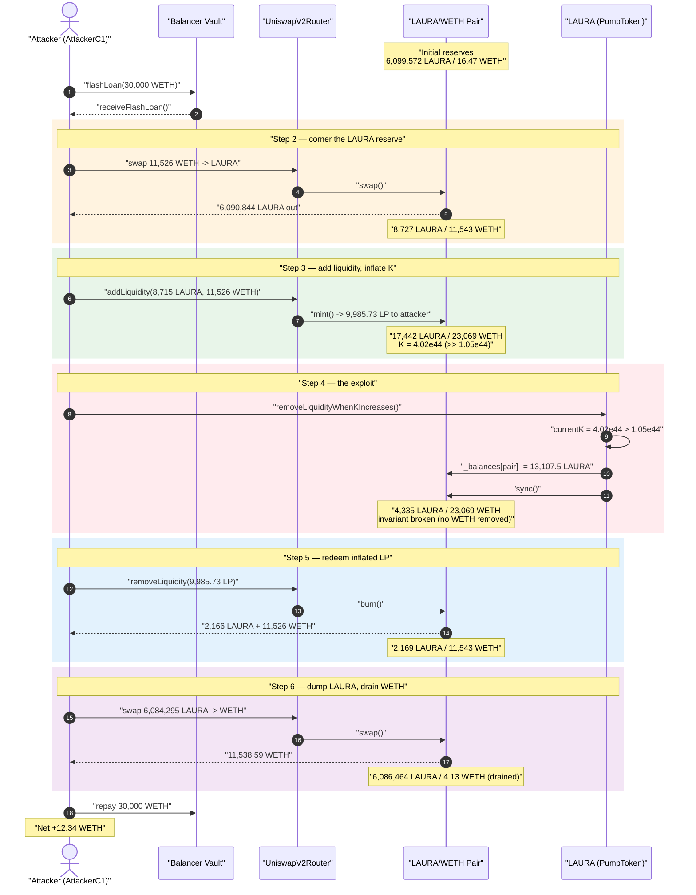
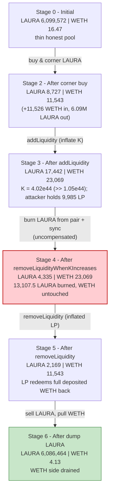
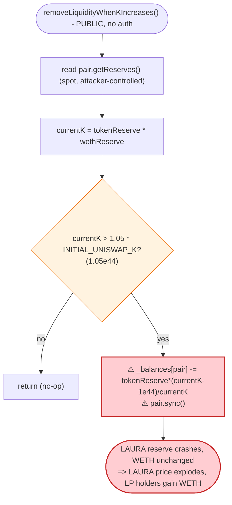
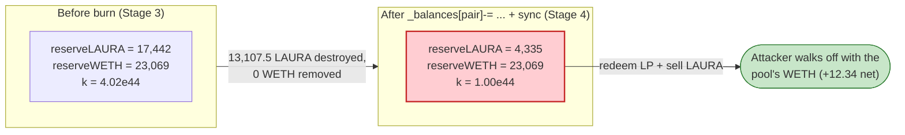

# LAURA Token Exploit — Permissionless `removeLiquidityWhenKIncreases()` Reserve Burn

> **Vulnerability classes:** vuln/access-control/missing-auth · vuln/logic/incorrect-state-transition

> **Reproduction:** the PoC compiles & runs in an isolated Foundry project at
> [this project folder](.) (the umbrella DeFiHackLabs repo does not whole-compile, so this
> PoC was extracted standalone).
> Full verbose trace: [output.txt](output.txt).
> Verified vulnerable source: [contracts_PumpToken.sol](sources/PumpToken_05641e/contracts_PumpToken.sol).

---

## Key info

| | |
|---|---|
| **Loss** | **12.340357077284305206 ETH** (~$41.2K) drained from the LAURA/WETH Uniswap-V2 pair |
| **Vulnerable contract** | `LAURA` (`PumpToken`) — [`0x05641e33fd15baf819729df55500b07b82eb8e89`](https://etherscan.io/token/0x05641e33fd15baf819729df55500b07b82eb8e89#code) |
| **Victim pool** | LAURA/WETH Uniswap-V2 pair — [`0xb292678438245Ec863F9FEa64AFfcEA887144240`](https://etherscan.io/address/0xb292678438245Ec863F9FEa64AFfcEA887144240) |
| **Attacker EOA** | [`0x25869347f7993c50410a9b9b9c48f37d79e12a36`](https://etherscan.io/address/0x25869347f7993c50410a9b9b9c48f37d79e12a36) |
| **Attacker contracts** | [`0x2cad84c3d2e31bc6d630229901f421e6da5557ef`](https://etherscan.io/address/0x2cad84c3d2e31bc6d630229901f421e6da5557ef), [`0x55877cf2f24286dba2acb64311beca39728fbd10`](https://etherscan.io/address/0x55877cf2f24286dba2acb64311beca39728fbd10) |
| **Attack tx** | [`0xef34f4fdf03e403e3c94e96539354fb4fe0b79a5ec927eacc63bc04108dbf420`](https://etherscan.io/tx/0xef34f4fdf03e403e3c94e96539354fb4fe0b79a5ec927eacc63bc04108dbf420) |
| **Chain / block / date** | Ethereum mainnet / 21,529,888 / Jan 1, 2025 |
| **Compiler** | Solidity v0.8.27, optimizer **200 runs** |
| **Bug class** | Broken AMM invariant via a permissionless, un-compensated reserve burn (`_balances[pair] -= …; pair.sync()`) |
| **PoC author** | [rotcivegaf](https://twitter.com/rotcivegaf) |

---

## TL;DR

`LAURA` (deployed by a pump.fun-style launchpad as a `PumpToken`) has a public, unprotected function
[`removeLiquidityWhenKIncreases()`](sources/PumpToken_05641e/contracts_PumpToken.sol#L217-L227). It reads the
LAURA/WETH pair's reserves, computes a "constant-product" `currentK = tokenReserve · wethReserve`, and if
`currentK` exceeds 105% of a hard-coded `INITIAL_UNISWAP_K`, it **deletes LAURA tokens directly out of the
pair's balance and then calls `pair.sync()`**:

```solidity
_balances[uniswapV2Pair] -= tokenReserve * (currentK - INITIAL_UNISWAP_K) / currentK;
pair.sync();
```

This is an *un-compensated* removal of one side of the pool: it destroys LAURA held by the pair, no WETH
leaves the pair, and `sync()` forces the pair to accept the smaller LAURA balance as its new reserve. The
constant-product invariant `x·y = k` is broken in whoever-holds-LAURA's favor.

The attacker:

1. **Flash-borrows 30,000 WETH** from Balancer Vault.
2. **Buys 6.09M LAURA** from the thin pool (only 16.47 WETH of liquidity), draining its LAURA reserve.
3. **Adds liquidity** (≈8,715 LAURA + 11,526 WETH), pushing `K` far above the 105% threshold.
4. **Calls `removeLiquidityWhenKIncreases()`** — the contract burns **13,107.5 LAURA** out of the pair (token
   reserve 17,442 → 4,335) while WETH reserve stays at 23,069. The LP tokens the attacker minted in step 3 now
   redeem for far more WETH than they're worth.
5. **Removes its liquidity** and **dumps all LAURA back**, pulling WETH out of the now-overpriced pool.
6. **Repays the 30,000 WETH** flash loan and keeps **12.34 WETH** profit.

---

## Background — what `PumpToken` does

`LAURA` is an instance of `PumpToken` ([source](sources/PumpToken_05641e/contracts_PumpToken.sol)), a
pump.fun-style launch token. Its lifecycle:

- During launch it sits on a **bonding curve** (`bondingCurve = true`). Buys/sells routed through the
  Uniswap pair are re-priced by the curve inside `_transfer` (`handleCurveBuy` / `handleCurveSell`,
  [:229-267](sources/PumpToken_05641e/contracts_PumpToken.sol#L229-L267)), and the pool is "graduated" to a
  real AMM once enough ETH has been raised.
- A pile of hard-coded launch constants
  ([:36-48](sources/PumpToken_05641e/contracts_PumpToken.sol#L36-L48)) describe the *intended* graduated pool:

| Constant | Value |
|---|---|
| `ETH_TO_FILL` | `5e18` (5 ETH) |
| `TOKENS_IN_LP_AFTER_FILL` | `20,000,000e18` |
| `INITIAL_UNISWAP_K` | `TOKENS_IN_LP_AFTER_FILL · ETH_TO_FILL` = **1e44** |
| `REAL_LP_INITIAL_SUPPLY` | `INITIAL_UNISWAP_K / 1e15` |

- A "K maintenance" hook, [`removeLiquidityWhenKIncreases()`](sources/PumpToken_05641e/contracts_PumpToken.sol#L217-L227),
  is meant to keep the pool's constant product near `INITIAL_UNISWAP_K` by burning excess LAURA from the pool
  whenever `K` drifts more than 5% above target. It is called automatically on every non-AMM transfer
  (`handleTaxSellAndLpKValue`, [:174-199](sources/PumpToken_05641e/contracts_PumpToken.sol#L174-L199)) **and is
  also `public`** so anyone can call it directly.

The on-chain pool state at the fork block (read from the trace `getReserves` / `Sync` events):

| Parameter | Value |
|---|---|
| Pair `token0` | LAURA (`0x05641…`) |
| Pair `token1` | WETH |
| LAURA reserve | **6,099,572 LAURA** |
| WETH reserve | **16.466 WETH** ← extremely thin liquidity |
| `INITIAL_UNISWAP_K` | `1e44` |
| Trigger threshold (105%) | `1.05e44` |

The pool was wildly lopsided (6.1M LAURA vs 16.5 WETH), which is exactly what lets a single large buy + LP add
push `K` far above the trigger.

---

## The vulnerable code

### 1. The burn draws LAURA out of the pool and `sync()`s

[contracts_PumpToken.sol:217-227](sources/PumpToken_05641e/contracts_PumpToken.sol#L217-L227):

```solidity
function removeLiquidityWhenKIncreases() public {                  // ⚠️ PUBLIC, no access control
    (uint256 tokenReserve, uint256 wethReserve) = getReservesSorted();
    uint256 currentK = tokenReserve * wethReserve;

    if (currentK > (105 * INITIAL_UNISWAP_K / 100)) {              // INITIAL_UNISWAP_K = 1e44, threshold = 1.05e44
        IUniswapV2Pair pair = IUniswapV2Pair(uniswapV2Pair);

        _balances[uniswapV2Pair] -= tokenReserve * (currentK - INITIAL_UNISWAP_K) / currentK;  // ⚠️ deletes LAURA from the pair
        pair.sync();                                                                            // ⚠️ forces reduced balance as the new reserve
    }
}
```

`_balances` is the inherited ERC20 balance map
([contracts_imports_ERC20.sol:34](sources/PumpToken_05641e/contracts_imports_ERC20.sol#L34)); the line above
mutates the *pair's* balance directly, bypassing `_transfer`, and `sync()` makes the pair adopt it.

### 2. It is also reachable from every transfer — but the public entry point is what matters

[contracts_PumpToken.sol:174-199](sources/PumpToken_05641e/contracts_PumpToken.sol#L174-L199):

```solidity
function handleTaxSellAndLpKValue(address from) internal {
    if (!swapping && from != address(this) && !automatedMarketMakerPairs[from]) {
        ...
        if (bondingCurve) {
            removeLiquidityWhenKIncreases();   // called on every ordinary transfer too
        }
    }
}
```

Whether triggered as a side-effect of the attacker's `addLiquidity` transfer or called directly, the burn fires
the instant the attacker has inflated `K`.

### 3. `getReservesSorted` just reads spot reserves

[contracts_PumpToken.sol:341-352](sources/PumpToken_05641e/contracts_PumpToken.sol#L341-L352) reads
`pair.getReserves()` with no time-weighting — the reserves the attacker just manipulated are taken at face
value.

---

## Root cause — why it was possible

A Uniswap-V2 pair prices assets purely from its reserves and only enforces `x·y ≥ k` *inside* `swap()`.
`sync()` exists so a pair can re-baseline its reserves to its real token balances; it trusts that balances only
move via `mint` / `burn` / `swap` / honest transfers.

`removeLiquidityWhenKIncreases()` weaponizes that trust:

> It **destroys** LAURA that the pair holds (`_balances[pair] -= …`) and then calls `pair.sync()`, telling the
> pair "your LAURA reserve is now this much smaller." No WETH leaves the pair, so the constant product collapses
> and the marginal price of LAURA against WETH jumps — **for free, callable by anyone.** Any party holding LP
> tokens or LAURA at that instant captures the freed WETH.

The composing design flaws:

1. **Permissionless, parameter-free trigger.** `removeLiquidityWhenKIncreases()` is `public` with no role check
   and no reentrancy/anti-manipulation guard. The attacker decides *when* the reserve-shrinking burn happens —
   right after positioning to profit.
2. **`K` is computed from spot reserves the caller controls.** Because `currentK = tokenReserve · wethReserve`
   uses the live pool reserves, the attacker trivially pushes `K` above the 105% threshold by adding liquidity
   (which raises both reserves and hence the product).
3. **Burning from the pool is a value transfer to LAURA/LP holders.** Removing LAURA from the pair without
   removing WETH shifts the WETH side toward whoever holds the pool's LP / LAURA. The attacker first becomes
   the dominant LP holder (step 3) and the dominant LAURA holder (step 2), so the freed WETH flows to them.
4. **The pool was effectively unbacked.** With only 16.47 WETH and `INITIAL_UNISWAP_K = 1e44` baked in, the
   intended "K target" had nothing to do with the actual pool, so any meaningful trade pushed the trigger.

This is the same class as the BYToken hack (`_burn(pool, …) + pair.sync()` via a permissionless
`triggerAutoBurn()`): an un-compensated reserve deletion exposed through a public function.

---

## Preconditions

- `bondingCurve == true` on the token (so the burn hook is active) — true at the fork block.
- The attacker can move the pool's spot reserves so that `tokenReserve · wethReserve > 1.05 · INITIAL_UNISWAP_K`
  (`1.05e44`). With a thin pool this only requires a modest WETH outlay, which is **flash-loanable** — the PoC
  borrows 30,000 WETH from Balancer Vault and repays it in the same transaction.
- The attacker holds LP tokens / LAURA at the moment of the burn so the freed WETH accrues to them; achieved by
  the buy (step 2) and the `addLiquidity` (step 3).

---

## Attack walkthrough (with on-chain numbers from the trace)

The pair's `token0 = LAURA`, `token1 = WETH` (so `reserve0 = LAURA`, `reserve1 = WETH`). All figures below are
the `Sync`/`getReserves` values from [output.txt](output.txt).

| # | Step | LAURA reserve | WETH reserve | Effect |
|---|------|-------------:|-------------:|--------|
| 0 | **Initial** (start of `receiveFlashLoan`) | 6,099,572.13 | 16.466 | Honest, ultra-thin pool. |
| 1 | **Flash loan** 30,000 WETH from Balancer | — | — | Working capital. |
| 2 | **Buy** — swap **11,526.249 WETH → 6,090,844.74 LAURA** (to attacker) | 8,727.39 | 11,542.715 | Pool's LAURA reserve drained ~99.9%; WETH side built up. |
| 3 | **Add liquidity** — 8,714.939 LAURA + 11,526.249 WETH; mints **9,985.73 LP** | 17,442.328 | 23,068.965 | `K = 1.744e22 · 2.307e22 = 4.024e44` ≫ `1.05e44` threshold. |
| 4 | **`removeLiquidityWhenKIncreases()`** — burns **13,107.50 LAURA** from the pair + `sync()` | **4,334.828** | 23,068.965 | **Invariant broken**: LAURA reserve cut to ¼, WETH untouched. |
| 5 | **Remove liquidity** — burn 9,985.73 LP → receives 2,165.87 LAURA + **11,526.249 WETH** | 2,168.961 | 11,542.715 | LP redeems for the full WETH it deposited *plus* a share of the freed WETH. |
| 6 | **Sell** — swap **6,084,295.67 LAURA → 11,538.59 WETH** (dumps all LAURA) | 6,086,464.63 | 4.126 | Empties almost all WETH from the pool. |
| 7 | **Repay** 30,000 WETH to Balancer; withdraw remainder as ETH | — | — | Net profit realized. |

### Why the burn is profitable

After step 3 the attacker owns **9,985.73 of the pool's LP** (the pool's only meaningful LP). When step 4 burns
13,107.5 LAURA out of the pair *for free*, the WETH side (23,068.965 WETH) is now backed by far less LAURA, so
each LP token is worth more WETH. The attacker's `removeLiquidity` in step 5 therefore returns the full
11,526.249 WETH it deposited in step 3 (rather than the ~half it would normally lose to price impact), and step
6 sells the cornered LAURA back into the still-WETH-heavy pool to scoop the rest. The freed WETH is exactly the
honest liquidity that was sitting in the pool.

### Arithmetic check of the burn

`removeLiquidityWhenKIncreases()` burn at step 4 (verified to the wei against the trace):

```
INITIAL_UNISWAP_K = 20,000,000e18 · 5e18                       = 1.000000e44
threshold         = 105 · INITIAL_UNISWAP_K / 100              = 1.050000e44
tokenReserve      = 17,442.327956960784747337 LAURA
wethReserve       = 23,068.964517278041866222 WETH
currentK          = tokenReserve · wethReserve                 = 4.023764e44   (> 1.05e44 ⇒ fires)
burn              = tokenReserve · (currentK − 1e44) / currentK = 13,107.499667416073916022 LAURA
pool LAURA after  = 17,442.3280 − 13,107.4997                  = 4,334.828289544710831315  ✓ (matches Sync)
```

### Profit accounting (WETH)

| Direction | Amount (WETH) |
|---|---:|
| Borrowed (flash loan) | 30,000.000000 |
| Spent — buy LAURA (step 2) | 11,526.249223 |
| Spent — addLiquidity WETH (step 3) | 11,526.249223 |
| Received — removeLiquidity WETH (step 5) | 11,526.249223 |
| Received — sell LAURA (step 6) | 11,538.589581 |
| Attacker WETH after step 6 | **30,012.340357** |
| Repaid to Balancer | 30,000.000000 |
| **Net profit** | **+12.340357077284305206** |

The PoC's final line — `Final balance in ETH : 12340357077284305206` — equals this profit to the wei and matches
the header's reported loss.

---

## Diagrams

### Sequence of the attack



### Pool state evolution



### The flaw inside `removeLiquidityWhenKIncreases()`



### Why the burn is theft: constant-product before vs. after



---

## Why each magic number

- **`LOAN_AMOUNT = 30,000 WETH`** — flash-loan headroom from Balancer Vault; only ~12.34 WETH is genuine profit,
  the rest is recycled within the transaction (and fully repaid).
- **`MAGIC_NUMBER = 11,526.249223479392795400 WETH`** — sized so that the corner buy + `addLiquidity` push the
  pool's `K` over the `1.05e44` trigger, *and* so the LAURA burned in step 4 is large enough that redeeming the
  attacker's LP (step 5) plus dumping LAURA (step 6) recovers all injected WETH plus the pool's honest WETH. The
  PoC comment notes it is "enough so that … the LAURA balance of the WETH/LAURA pair will go down enough to be
  able to steal all the WETH from the pair."
- **`105 / 100` threshold & `INITIAL_UNISWAP_K = 1e44`** — protocol constants, not attacker-chosen; they only
  determine *how much* of an inflated-K is needed before the burn fires (a mere 5% over a target unrelated to
  the real pool).

---

## Remediation

1. **Never destroy tokens held by the liquidity pool.** A burn must only ever touch tokens the protocol *owns*
   (its own balance / treasury). Deleting `_balances[uniswapV2Pair]` and calling `pair.sync()` is an
   un-compensated, single-sided reserve removal that hands WETH to LAURA/LP holders for free. Remove the
   `_balances[pair] -= …; pair.sync()` mechanism entirely.
2. **If "K maintenance" is a product requirement, do it symmetrically.** Route any pool rebalancing through the
   pair's own `burn()` (LP redemption), so *both* reserves move together and the price/invariant is preserved.
3. **Gate or remove the public entry point.** `removeLiquidityWhenKIncreases()` should never be externally
   callable. At minimum restrict it to a trusted keeper and add a `nonReentrant` / `swapping`-style lock so it
   cannot be invoked inside an attacker-controlled trade.
4. **Do not derive trust decisions from spot reserves.** `currentK` is computed from `pair.getReserves()`, which
   an attacker manipulates with a flash loan in the same transaction. Use a TWAP/oracle or compare against the
   pool's own minted-LP accounting, not instantaneous reserves.
5. **Cap single-operation reserve impact.** Any operation that can move a pool reserve by more than a small
   percentage in one call should revert; here a single call cut the LAURA reserve by 75%.

---

## How to reproduce

The PoC was extracted into a standalone Foundry project (the umbrella DeFiHackLabs repo has several unrelated
PoCs that fail to compile under a whole-project build):

```bash
_shared/run_poc.sh 2025-01-LAURAToken_exp -vvvvv
```

- RPC: an **Ethereum mainnet archive** endpoint is required (fork block 21,529,887). `foundry.toml` is
  pre-configured with an Infura archive endpoint.
- Result: `[PASS] testPoC()` with `Final balance in ETH : 12340357077284305206` (= 12.34 ETH profit).

Expected tail:

```
  Final balance in ETH : 12340357077284305206
Suite result: ok. 1 passed; 0 failed; 0 skipped; finished in 10.83s
Ran 1 test suite: 1 tests passed, 0 failed, 0 skipped (1 total tests)
```

---

*Reference: SlowMist Hacked — https://hacked.slowmist.io/ (LAURA, Ethereum, ~$41.2K). PoC by [rotcivegaf](https://twitter.com/rotcivegaf).*
