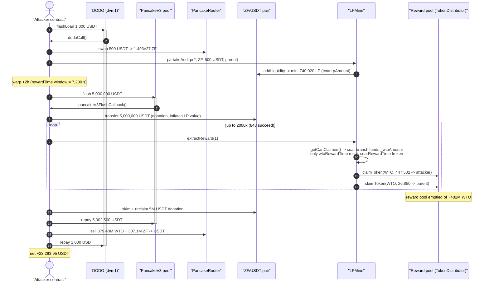
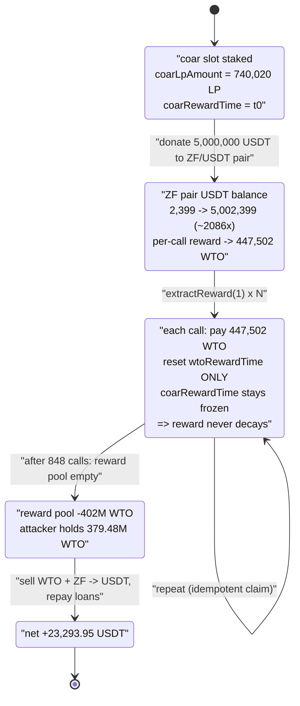
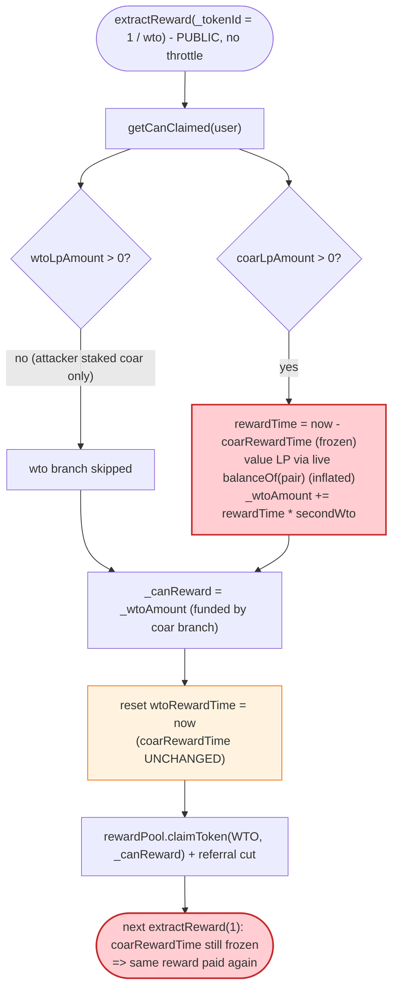

# LPMine Exploit — Reward-Time Desync + Pool-Balance Reward Valuation Drains the Reward Pool

> **Vulnerability classes:** vuln/logic/reward-calculation · vuln/oracle/price-manipulation

> **Reproduction:** the PoC compiles & runs in an isolated Foundry project at
> [this project folder](.) (the umbrella DeFiHackLabs repo does not whole-compile, so this PoC was
> extracted into a standalone project).
> Full verbose trace: [output.txt](output.txt).
> Verified vulnerable source: [sources/LPMine_6BBeF6/LPMine.sol](sources/LPMine_6BBeF6/LPMine.sol).

---

## Key info

| | |
|---|---|
| **Loss** | ~$24k — net **+23,293.95 USDT** to the attacker; the LPMine reward pool was drained of **≈402.25M WTO** (379.48M to the attacker, 22.77M to a "parent" address) |
| **Vulnerable contract** | `LPMine` — [`0x6BBeF6DF8db12667aE88519090984e4F871e5feb`](https://bscscan.com/address/0x6BBeF6DF8db12667aE88519090984e4F871e5feb#code) |
| **Reward pool drained** | `TokenDistributor` — `0x3200Be834b791D09017Bd924c71174e47959b087` (LPMine's `rewardPool`) |
| **Reward token** | `WTO` — `0x692097F0D3Bd0dFBbbbb0EE35000729F05d598f5` |
| **Pool LP'd / staked token** | `ZF` (`coar` slot, tokenId 2) — `0x259A9FB74d6A81eE9b3a3D4EC986F08fbb42121A`; ZF/USDT pair `0xBE2F4D0C39416C7C4157eBFdccB65cc2FF5fb2C4` |
| **Attacker contract** | the PoC `ContractTest` deployed at `0x7FA9385bE102ac3EAc297483Dd6233D62b3e1496` (test harness address) |
| **"Parent" recipient** | `0x114FAA79157c6Ba61818CE2A383841e56B20250B` (passed as `_oldUser`, receives referral reward) |
| **Attack txs** | add-LP `0x11c1ef2c61f5a2e41d570a1547d2d891bf916853ddd94e32097e86bcdd21cb4c`; claim-reward `0x00c5a772a58b117f142b2cbc8721b80d145ef7a910043ad08439863d0e78e300` |
| **Chain / block / date** | BSC / 45,583,892 / 2025-01-08 |
| **Compiler** | LPMine: Solidity v0.8.12, optimizer 200 runs |
| **Bug class** | Broken reward accounting — (1) reward-timestamp desynchronization across stake "slots" and (2) reward valuation read from live, flash-manipulable pool balances |
| **Credit** | [@TenArmorAlert](https://x.com/TenArmorAlert/status/1877030261067571234) |

---

## TL;DR

LPMine is a "stake-LP, earn-tokens" farm. A staker's claimable reward is computed in
[`getCanClaimed()`](sources/LPMine_6BBeF6/LPMine.sol#L446-L468) as

```
reward = (block.timestamp - lastRewardTime) × rewardRatePerSecond
```

Two independent flaws compose into a full drain of the reward pool:

1. **Reward-time desync.** A user can have two independent stake slots — `wto` (tokenId 1) and `coar`
   (tokenId 2) — but [`extractReward(_tokenId)`](sources/LPMine_6BBeF6/LPMine.sol#L414-L430) computes
   the *combined* reward of **both** slots in `getCanClaimed`, yet only resets the **one** timestamp
   matching `_tokenId`. The attacker stakes in the **coar** slot, then calls `extractReward(1)` (the
   **wto** slot). Each call pays out the coar slot's accrued reward (denominated in WTO, tokenId 1's
   token) but only resets `wtoRewardTime` — **never** `coarRewardTime`. So `block.timestamp -
   coarRewardTime` stays frozen at the full elapsed window, and **every call re-pays the same reward**.
   The PoC loops `extractReward(1)` up to 2000 times.

2. **Reward valued from live pool balances.** The size of that per-call reward is derived from
   [`getRemoveTokens()`](sources/LPMine_6BBeF6/LPMine.sol#L480-L486), which reads the **instantaneous**
   `balanceOf(pair)` of USDT to value the staked LP. The attacker flash-borrows 5,000,000 USDT and
   transfers it straight into the ZF/USDT pair *before* the loop, inflating the LP's apparent USD value
   ~2600× and thus inflating the per-call WTO reward to ~447,502 WTO.

The attacker bankrolls everything with two nested flash loans (DODO for the seed USDT, PancakeV3 for
the 5M USDT donation), drains the reward pool, sells the ill-gotten WTO + ZF back to USDT, repays both
loans, and keeps **23,293.95 USDT**.

---

## Background — what LPMine does

`LPMine` ([source](sources/LPMine_6BBeF6/LPMine.sol)) is a yield farm with a referral tree:

- **Stake via `partakeAddLp`** ([:275-318](sources/LPMine_6BBeF6/LPMine.sol#L275-L318)). A user supplies
  one of the supported tokens + USDT; LPMine adds them as liquidity to that token's PancakeSwap pair and
  records the minted LP amount against the user. There are two token "slots":
  - `wtoTokenId = 1` → token **WTO**, pair USDT/WTO `0x6F9070…`
  - `coarTokenId = 2` → token **ZF**, pair USDT/ZF `0xBE2F4D…`
  Each slot has its own `LpAmount` and `RewardTime` in the per-user `PledgeInfo` struct
  ([:234-242](sources/LPMine_6BBeF6/LPMine.sol#L234-L242)).
- **Claim via `extractReward(_tokenId)`** ([:414-430](sources/LPMine_6BBeF6/LPMine.sol#L414-L430)). Pays
  rewards out of a `TokenDistributor` "reward pool" and propagates a referral cut to up to 6 parents
  (`rewardParent`, [:433-443](sources/LPMine_6BBeF6/LPMine.sol#L433-L443)).
- **Reward formula** ([`getCanClaimed`](sources/LPMine_6BBeF6/LPMine.sol#L446-L468)). For each slot the
  user holds LP in, it values the LP in USD via the live pool balances, takes `monthFee%` of `2×` that
  value as the monthly emission budget, converts it to the reward token via the AMM, divides by `30 days`
  to get a per-second rate, and multiplies by the elapsed seconds since the slot's last claim.

On-chain parameters at the fork block:

| Parameter | Value |
|---|---|
| `monthFee` | **7** (7% — back-solved from the trace) |
| reward seconds per "month" | `30 days` = 2,592,000 s |
| ZF/USDT pair reserves (pre-attack) | ZF 4,202,432,310 / USDT 1,899.19 |
| ZF/USDT pair `totalSupply` (LP) | 3,559,348.79 |
| WTO/USDT pair reserves | USDT 41,668.65 / WTO 207,319,392 |
| reward-pool WTO balance (drainable) | ≈ 402.25M WTO |

---

## The vulnerable code

### 1. `extractReward` resets only the slot it is called with

```solidity
function extractReward(uint256 _tokenId) external {
    Token memory _token = tokens[_tokenId];
    (uint256 _wtoAmount,uint256 _coarAmount) = getCanClaimed(_msgSender()); // ← BOTH slots summed
    PledgeInfo storage _pledge = userPledge[_msgSender()];
    uint256 _canReward;
    if(_tokenId == wtoTokenId){
        _canReward = _wtoAmount;
        _pledge.wtoRewardTime = block.timestamp;   // ← only wto time reset
    }
    if(_tokenId == coarTokenId){
        _canReward = _coarAmount;
        _pledge.coarRewardTime = block.timestamp;   // ← only coar time reset
    }
    rewardPool.claimToken(_token.tokenAddress,_canReward,_msgSender());
    rewardParent(_tokenId,_token.tokenAddress,_canReward,_msgSender());
    emit ReceiveRewird(_msgSender(),_token.tokenAddress,_canReward,block.timestamp);
}
```

[LPMine.sol:414-430](sources/LPMine_6BBeF6/LPMine.sol#L414-L430)

The fatal asymmetry: `getCanClaimed` returns the reward accrued in **both** slots, but only
`_pledge.{x}RewardTime` for the *called* `_tokenId` is advanced. The attacker stakes only in the **coar**
slot, then repeatedly calls `extractReward(1)` (the **wto** slot):

- `_canReward = _wtoAmount` — and `_wtoAmount` is **non-zero** because `getCanClaimed`'s *coar branch*
  adds emission into `_wtoAmount` too (see below).
- only `wtoRewardTime` is reset — `coarRewardTime` is left untouched forever.

So on the next call, the coar branch again computes `block.timestamp - coarRewardTime` over the *same*
elapsed window and pays the *same* reward. Replaying the call replays the reward.

### 2. `getCanClaimed` — coar branch credits the WTO total

```solidity
function getCanClaimed(address _user) public view returns(uint256 _wtoAmount,uint256 _coarAmount) {
    PledgeInfo memory _pledge = userPledge[_user];
    ...
    if(_pledge.coarLpAmount > 0){
        (uint256 _removeUsdt,) = getRemoveTokens(_coarToken.pair,usdtAddress,_coarToken.tokenAddress,_pledge.coarLpAmount);
        uint256 _valueU = _removeUsdt.mul(2);
        uint256 _rewardTime = block.timestamp.sub(_pledge.coarRewardTime);   // ← never advances
        (uint256 _secondWtoAmount,uint256 _secondCoarAmount) = getEachReward(_valueU,monthFee,...);
        _wtoAmount += _rewardTime.mul(_secondWtoAmount);   // ← credited into the WTO bucket
        _coarAmount += _rewardTime.mul(_secondCoarAmount);
    }
}
```

[LPMine.sol:446-468](sources/LPMine_6BBeF6/LPMine.sol#L446-L468)

Because the coar branch increments **both** `_wtoAmount` and `_coarAmount`, a coar-only staker can claim
through the *wto* path: `extractReward(1)` pays `_wtoAmount` (funded by the coar branch) in WTO tokens
while only touching `wtoRewardTime`.

### 3. `getRemoveTokens` / `getEachReward` — reward valued from live pool balances

```solidity
function getRemoveTokens(address _pair,address _usdtAddress,address _tokenAddress,uint256 _liquidity)
    private view returns(uint256 _removeUsdt,uint256 _removeToken){
    uint _usdtAmount = IERC20(_usdtAddress).balanceOf(_pair);   // ⚠️ live, manipulable balance
    uint _tokenAmount = IERC20(_tokenAddress).balanceOf(_pair);
    uint _totalSupply = IERC20(_pair).totalSupply();
    _removeUsdt = _liquidity.mul(_usdtAmount) / _totalSupply;
    _removeToken = _liquidity.mul(_tokenAmount) / _totalSupply;
}

function getEachReward(uint256 _valueU,uint256 _monthFee, ... ) public view returns(uint256,uint256){
    uint256 _monthFeeAmount = calculateFee(_valueU,_monthFee);   // _valueU * monthFee / 100
    (,uint256 _outWtoAmount) = getAmountOut(_usdtAddress,_wtoAddress,_monthFeeAmount);
    ...
    uint256 _secondWtoAmount = _outWtoAmount / 30 days;          // per-second emission
    return (_secondWtoAmount,_secondCoarAmount);
}
```

[LPMine.sol:480-486](sources/LPMine_6BBeF6/LPMine.sol#L480-L486) /
[LPMine.sol:471-478](sources/LPMine_6BBeF6/LPMine.sol#L471-L478)

`_removeUsdt` (the USD value of the staked LP) is computed from `balanceOf(pair)` of USDT — the **current**
balance, not a stored snapshot. Anyone can transfer USDT into the pair to inflate it. The attacker dumps
5,000,000 USDT into the ZF/USDT pair, multiplying `_removeUsdt` and hence the per-second reward rate.

---

## Root cause — why it was possible

Three composing decisions:

1. **Per-slot timestamps, but a combined-slot payout.** `getCanClaimed` sums emission from *both* the
   wto and coar branches into both return values, yet `extractReward` only advances the timestamp of the
   `_tokenId` it was called with. Claiming via the *opposite* slot id leaves the producing slot's
   timestamp frozen, so the time delta — and the reward — never decays. **The claim is idempotent
   against its own funding clock.** This is the "not update the time correctly" half called out in the
   PoC header.
2. **Reward valued from live pool balances.** `getRemoveTokens` trusts `IERC20(usdt).balanceOf(pair)` as
   the instantaneous USD value of the staked LP. A donation/flash transfer into the pair inflates that
   value with no cost to the attacker (the donated USDT is reclaimed afterward via `skim`/swap). This is
   the "use pair balance to calculate the reward" half.
3. **Unbounded, permissionless claim loop with referral leakage.** `extractReward` is public and
   un-throttled; combined with (1) it can be hammered thousands of times in one transaction until the
   reward pool is empty. `rewardParent` additionally leaks a referral cut to the attacker-chosen
   `_oldUser` on every iteration.

Either flaw alone is bad; together they turn a tiny, briefly-staked LP position into a complete drain of
the reward `TokenDistributor`.

---

## Preconditions

- Attacker holds an LP position in **one** slot (here the `coar`/ZF slot via `partakeAddLp(2, …)`).
  Reachable permissionlessly; binding to a referral parent is free.
- Some reward window has elapsed since the slot's last claim, so `block.timestamp - coarRewardTime > 0`.
  The PoC manufactures a 2-hour window with `cheats.warp(block.timestamp + 2 hours)`.
- Liquidity to (a) buy a little ZF and seed the LP and (b) donate USDT into the pair to inflate the LP
  valuation. Both are intra-transaction and fully recovered, hence **flash-loanable**. The PoC uses a
  DODO flash loan (1,000 USDT seed) nested with a PancakeV3 flash loan (5,000,000 USDT donation).
- A non-empty reward `TokenDistributor` holding WTO to drain (≈402M WTO here).

---

## Attack walkthrough (with on-chain numbers from the trace)

All figures are from [output.txt](output.txt). The attacker contract is the test harness
`0x7FA9385bE102ac3EAc297483Dd6233D62b3e1496`.

| # | Step (trace ref) | Concrete numbers |
|---|------------------|------------------|
| 0 | **DODO flash loan** of 1,000 USDT into `dodoCall` ([:50](test/LPMine_exp.sol#L50)) | +1,000 USDT working capital |
| 1 | **Swap 500 USDT → ZF** on Pancake ([output:67](output.txt)) | receives 1.493e27 ZF (1,493,494,283 ZF) |
| 2 | **`partakeAddLp(2, ZF, 500 USDT, parent)`** stakes into the **coar** slot ([output:119](output.txt)) | mints **740,020.13 LP** to LPMine; `coarLpAmount = 740,020.13`, `coarRewardTime = t₀` |
| 3 | **`warp(+2 hours)`** ([output:195](output.txt)) | reward window frozen at **7,200 s** |
| 4 | **PancakeV3 flash loan** of 5,000,000 USDT ([output:197](output.txt)); in callback transfer all 5M USDT into the ZF/USDT pair ([output:211](output.txt)) | ZF pair USDT balance 2,399.19 → **5,002,399.19** (≈2086× inflation) |
| 5 | **Loop `extractReward(1)` ×2000** ([output:217](output.txt) …) | each successful call pays **447,502.65 WTO** to attacker + **26,850.16 WTO** to parent; coar branch funds it, only `wtoRewardTime` advances |
| 6 | reward pool runs dry after **848** successful claims ([output:38403](output.txt) first `transfer amount exceeds balance`); remaining ~1,152 iters `catch{continue}` | attacker accrues **379,482,246 WTO**; parent gets **22,768,934 WTO** |
| 7 | repay PancakeV3: send 5M USDT donation back via `skim` + reclaim ([output:70641](output.txt)) then `transfer(v3pool, 5,002,500)` ([output:70750](output.txt)) | 5,000,000 + 0.05% fee (2,500) repaid |
| 8 | **Sell ZF + WTO → USDT** ([output:70667](output.txt), [output:70712](output.txt)) | 387.1M ZF → +162.32 USDT (degenerate); 379.48M WTO → +26,631.63 USDT |
| 9 | repay DODO 1,000 USDT ([test:59](test/LPMine_exp.sol#L59)) | — |
| 10 | **final balance** ([output tail](output.txt)) | **23,293.95 USDT** profit |

**Why the per-call reward is exactly 447,502.65 WTO** (verified against the trace):

```
_removeUsdt  ≈ coarLpAmount × usdt_in_pair / LP_totalSupply  (USDT side, inflated)
_valueU       = _removeUsdt × 2
monthFeeAmt   = _valueU × 7 / 100                 = 145,606.03 USDT   (trace getAmountsOut input)
outWtoAmount  = AMM(USDT→WTO, monthFeeAmt)        = 161,100,953 WTO   (trace getAmountsOut output)
secondWto     = outWtoAmount / (30 days)          = 62.153 WTO/s
perCall       = rewardTime(7,200 s) × secondWto   = 447,502.65 WTO     ✓ exact
```

Because `coarRewardTime` never advances, `rewardTime` stays 7,200 s on every one of the 848 paying calls.

### Profit / loss accounting

| Item | Amount |
|---|---:|
| WTO drained from reward pool — to attacker | 379,482,246 WTO |
| WTO drained — to referral parent `0x114F…250B` | 22,768,934 WTO |
| **Total reward pool drained** | **≈402,251,181 WTO** |
| USDT from selling 379.48M WTO | +26,631.63 USDT |
| USDT from selling 387.1M ZF (LP unwind + skim) | +162.32 USDT |
| DODO flash loan repaid | −1,000 USDT |
| PancakeV3 flash loan + fee repaid | −5,002,500 USDT (donation recovered via `skim`) |
| Initial ZF buy (500 USDT) / LP seed | net-recovered intra-tx |
| **Net attacker profit** | **+23,293.95 USDT** |

The USDT "loss" to the protocol is indirect: the reward pool's ~402M WTO was sold into the WTO/USDT pool,
and the attacker walked off with ~23.3k USDT of realizable value. (The PoC header rounds this to "24k usdt".)

---

## Diagrams

### Sequence of the attack



### Reward-pool / state evolution



### The flaw inside `extractReward` / `getCanClaimed`



---

## Remediation

1. **Reset the timestamp of the slot you actually pay for.** `extractReward(_tokenId)` must only pay the
   reward of `_tokenId`'s slot, and `getCanClaimed` must not credit the coar branch's emission into the
   wto return value (and vice versa). Compute and settle each slot independently, advancing exactly the
   timestamp whose emission was paid. As written, claiming slot 1 pays slot 2's accrual without ever
   advancing slot 2's clock — the core idempotency bug.
2. **Snapshot the staked value; never read live pool balances for reward math.** `getRemoveTokens` must
   not use `IERC20(usdt).balanceOf(pair)`. Use a TWAP oracle or the LP value recorded at stake time, so a
   one-block balance donation cannot inflate rewards. Pair-balance reads are trivially manipulable by a
   direct transfer or flash loan.
3. **Throttle / cap claims.** Enforce a minimum interval between `extractReward` calls per user, and cap a
   single claim to the time genuinely elapsed since the last *settled* claim. An un-throttled public loop
   should never be able to exceed the protocol's real emission schedule.
4. **Cap emission against a real budget.** Bound total reward emission to a scheduled rate independent of
   instantaneous pool valuation, so even a mis-valuation cannot pay more than the protocol's funded
   budget. The reward pool should debit a committed allowance, not an attacker-controllable formula.
5. **Validate the claim path against the stake path.** A user who only ever staked in the coar slot
   should not be able to draw rewards through the wto entry point at all; gate `extractReward(_tokenId)`
   on `_pledge.{slot}LpAmount > 0` for that exact `_tokenId`.

---

## How to reproduce

```bash
_shared/run_poc.sh 2025-01-LPMine_exp -vvvvv
```

- RPC: a **BSC archive** endpoint is required (fork block 45,583,892). `foundry.toml` uses
  `https://bsc-mainnet.public.blastapi.io`, which serves historical state at that block; most public BSC
  RPCs prune it and fail with `header not found` / `missing trie node`. Forking this block is slow
  (~15 min on the public endpoint).
- Result: `[PASS] testExploit()` ending with `[End] USDT balance after: 23293.95…`.

Expected tail:

```
Ran 1 test for test/LPMine_exp.sol:ContractTest
[PASS] testExploit() (gas: 88121508)
Logs:
  [Begin] USDT balance before: 0.000000000000000000
  USDT borrow 1000000000000000000000
  [End] USDT balance after: 23293.951753999377441523

Suite result: ok. 1 passed; 0 failed; 0 skipped
```

---

*Reference: TenArmor alert — https://x.com/TenArmorAlert/status/1877030261067571234 (LPMine, BSC, ~$24K).*
