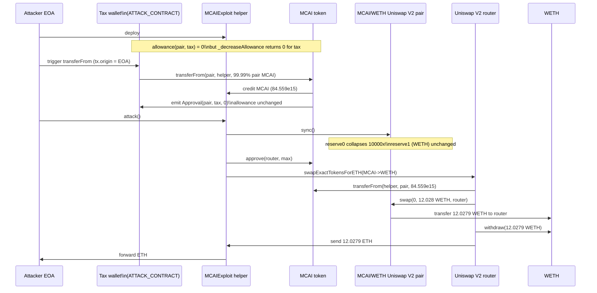
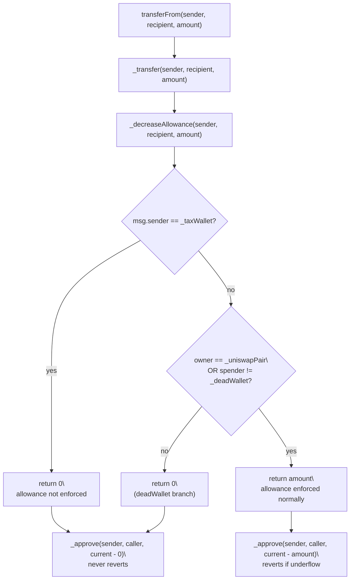

# MCAI tax-wallet allowance bypass — privileged `transferFrom` drains the Uniswap V2 pair
> **Vulnerability classes:** vuln/access-control/missing-auth · vuln/access-control/centralization · vuln/logic/wrong-condition
> **Reproduction:** the PoC compiles & runs in an isolated Foundry project at [this project folder](.). Full verbose trace: [output.txt](output.txt). The MCAI token source is verified on Etherscan and fetched into [sources/MCAI_810B59/](sources/MCAI_810B59/contracts_Token.sol) (Solidity 0.8.26, optimizer off).
---
## Key info
| | |
|---|---|
| **Loss** | ~12.03 WETH / ETH (12.028506355387210510 ETH extracted by the attacker EOA) |
| **Vulnerable contract** | MCAI (Memecast AI) — [`0x810B5902CB2ac2Fa63dFE4A6935EA32aED975cc8`](https://etherscan.io/address/0x810B5902CB2ac2Fa63dFE4A6935EA32aED975cc8#code) |
| **Attacker EOA** | [`0x0C8ecf2BbF9361fa2DD0Bd29ea473FB790aB7fEE`](https://etherscan.io/address/0x0C8ecf2BbF9361fa2DD0Bd29ea473FB790aB7fEE) |
| **Attack contract** | `setTaxWallet` tax wallet — [`0xdDF062714911A2e59996Eb94A57b7040Ea44309D`](https://etherscan.io/address/0xdDF062714911A2e59996Eb94A57b7040Ea44309D) |
| **Attack tx** | [`0xfbe3bc868d555ef617bb1c32d1d8d5ec8b825bf2b4795dd99b47b321f36f3c21`](https://etherscan.io/tx/0xfbe3bc868d555ef617bb1c32d1d8d5ec8b825bf2b4795dd99b47b321f36f3c21) |
| **Chain / block / date** | Ethereum mainnet / 21,720,380 / 2025-01 |
| **Compiler** | solc v0.8.26+commit.8a97fa7a (no optimizer, 200 runs) |
| **Bug class** | A hard-coded `_taxWallet` can call `transferFrom` against any holder with **zero allowance** because `_decreaseAllowance` deliberately returns `0` whenever `msg.sender == _taxWallet`, so the allowance check is silently skipped. |

## TL;DR

Memecast AI (MCAI) is a generic fee-on-transfer meme token with a Uniswap V2 MCAI/WETH pool. Its ERC-20 `transferFrom` does **not** enforce the spender allowance in the normal way. Instead of subtracting the transferred amount from `_allowances[owner][spender]` and reverting on underflow, the contract calls a helper `_decreaseAllowance` that returns the amount to subtract — and that helper is written so that **when `msg.sender == _taxWallet` it always returns `0`**. The result: the tax wallet can move any holder's MCAI balance without ever being approved, and the post-transfer `_approve` even re-emits an `Approval(...,0)` event so the on-chain allowance reads as `0` both before and after the theft.

The attacker, who controlled the tax-wallet key, used exactly this to pull 99.99% of the MCAI sitting in the Uniswap V2 pair directly into a fresh helper contract (no pair approval, no router involved), then called `sync()` on the pair so its internal reserves collapsed to the tiny leftover MCAI balance while the WETH reserve stayed full. With the constant-product `k` now deeply mis-priced (almost no MCAI vs. ~12 WETH), the helper sold the drained MCAI back into the pair through the standard Uniswap V2 router, receiving 12,027,929,333,839,157,338 wei of WETH (~12.028 ETH) which was unwrapped to ETH and forwarded to the attacker EOA. Net profit: **12.0285 ETH**, balance 0 → 12.028506355387210510 ETH [output.txt:1564,1565,1676].

This is a textbook centralization/hidden-backdoor exploit: the "tax wallet" role is effectively an unlimited allowance on every account, and once that key was used maliciously (or leaked), the pair was instantly drainable.

## Background — what MCAI does

MCAI is a standard OpenZeppelin-flavored ERC-20 with a tax mechanism layered on top of `_transfer`. At launch (`launchMCAI`, `onlyOwner`) it creates a Uniswap V2 pair against WETH, adds liquidity, and flips `tradingOpen = true`. Subsequent transfers apply a buy/sell tax (10% initially, dropping to 0% after a few trades) that accrues to the contract and is periodically swapped for ETH and forwarded to `_taxWallet`.

Two privileged roles exist:

- `_owner` — the usual Ownable owner; can `rescueETHFromMCAI()` and call `launchMCAI`.
- `_taxWallet` — set in the constructor to the deployer and reassignable via `setTaxWallet` (gated by the separate `_deployer` storage variable, not by `onlyOwner`). The tax wallet receives the swapped ETH and, critically, is the address that the `_decreaseAllowance` helper treats specially.

The Uniswap V2 pair (`MCAI_WETH_PAIR = 0x660a…A4fE`) holds the protocol's market-making MCAI/WETH liquidity. Because the pair is a plain Uniswap V2 implementation, its pricing is `reserve0 * reserve1 ≥ k` with reserves refreshed only on `sync()` and on each swap. Anyone can call `sync()`, which simply re-reads the token balances and writes them to the stored reserves.

The exploit combines two independently-simple facts: (1) the MCAI token grants the tax wallet a silent unlimited allowance on every account, and (2) `sync()` lets anyone realign a Uniswap V2 pair's internal reserves to its actual token balances. Together they let the tax wallet extract nearly all MCAI liquidity and then re-sell it at an attacker-chosen (extremely favourable) price.

## The vulnerable code

All snippets below are from the verified source: [sources/MCAI_810B59/contracts_Token.sol](sources/MCAI_810B59/contracts_Token.sol).

### The backdoored allowance accounting

`transferFrom` performs the transfer first, then asks `_decreaseAllowance` how much to subtract from the spender's allowance, then calls `_approve(sender, _msgSender(), current − thatAmount)`:

```solidity
function transferFrom(
    address sender,
    address recipient,
    uint256 amount
) public override returns (bool) {
    _transfer(sender, recipient, amount);
    uint256 _amount = _decreaseAllowance(sender, recipient, amount);
    _approve(
        sender,
        _msgSender(),
        _allowances[sender][_msgSender()].sub( _amount, "ERC20: transfer amount exceeds allowance")
    );
    return true;
}
```

The `_decreaseAllowance` helper is where the backdoor lives. For the tax wallet it returns `0`, so `current − 0` never reverts no matter how large `amount` is:

```solidity
function _decreaseAllowance(
    address owner,
    address spender,
    uint256 amount
) private view returns (uint256) {
    return msg.sender != _taxWallet && (owner == _uniswapPair || spender != _deadWallet) ? amount : 0;
}
```

Read it as a truth table. The function returns `amount` (i.e. enforces the allowance) **only** when the caller is **not** the tax wallet **and** (`owner == _uniswapPair` **or** `spender != _deadWallet`). The `_taxWallet` fails the first condition, so it always gets `0` subtracted — meaning it can call `transferFrom` for any `(sender, recipient, amount)` regardless of allowance. (The other branch — anyone with `spender == _deadWallet` and `owner != pair` — is a separate latent issue but not what this exploit uses.)

Because the subtraction is `0`, the trailing `_approve(sender, _msgSender(), 0)` even emits a misleading `Approval(sender, taxWallet, 0)` event, which is exactly what the trace shows at [output.txt:1601].

### The tax-wallet key is freely reassignable

`setTaxWallet` has no `onlyOwner`; it only checks `_msgSender() == _deployer` and, as a side effect, sweeps the contract's ETH balance to the caller. Whoever holds the deployer key can re-point `_taxWallet` to any address — including a freshly deployed attack contract:

```solidity
function setTaxWallet(address newWallet) external {
    require(_msgSender() == _deployer, "not a deployer");
    payable(_msgSender()).transfer(address(this).balance);
    _taxWallet = newWallet;
}
```

In the on-chain incident the tax wallet was already set to the attack contract `0xdDF0…4309D`, so the attacker simply called `transferFrom` from that address (with the EOA as `tx.origin`) — no `setTaxWallet` was needed inside the attack tx itself.

### Uniswap V2 `sync()` — the pricing weapon

`sync()` is a public, permissionless Uniswap V2 function. After the tax wallet drained the pair's MCAI balance directly (bypassing the router), the pair's stored reserves were stale: `reserve0` still showed ~84.5e15 MCAI while the real balance had collapsed to ~8.46e12. Calling `sync()` writes the real balances into reserves, which is what lets the subsequent router swap price ~84.5e15 MCAI input against a now-tiny recorded `reserve0` and walk away with ~12 WETH.

## Root cause — why it was possible

1. **Deliberate allowance bypass for `_taxWallet`.** `_decreaseAllowance` returns `0` whenever `msg.sender == _taxWallet`, so `transferFrom`'s allowance subtraction becomes a no-op. The tax wallet effectively holds `type(uint256).max` allowance on every account without any approval ever being recorded. This is the primary bug.
2. **Centralized, stealthy privileged role.** `_taxWallet` is a single off-chain-controlled key with no timelock, no multisig, and no event-driven visibility beyond `setTaxWallet`. Its power is not declared in any interface — it only surfaces by reading `_decreaseAllowance`. This is a hidden centralization risk.
3. **`_taxWallet` is reassignable by `_deployer` without `onlyOwner`.** `setTaxWallet` bypasses Ownable and also drains the contract ETH to the caller, compounding the risk: the deployer key alone can rotate the backdoor address and cash out accumulated taxes in one call.
4. **Composability with Uniswap V2 `sync()`.** The token didn't need to be a full oracle manipulator — because the drain happens out-of-band (not through the pair), the pair's reserves go stale, and the public `sync()` re-prices the pool at the attacker's chosen ratio. Any "tax"/"fee" wallet with transfer authority over arbitrary holders can do this to any Uniswap V2 pair holding the token.
5. **Verification theatre.** The contract is verified and imports a standard-looking `IERC20` + `SafeMath` + `Ownable`, so the unusual `transferFrom`/`_decreaseAllowance` shape is easy to miss in a superficial review. The `Approval(..., 0)` emission after the heist actively misleads off-chain allowance monitors.

## Preconditions

- **Permissioned, not permissionless.** The caller of `transferFrom` must be `_taxWallet` (or, equivalently, the `_deployer` must first call `setTaxWallet` to point at the attacker). In the incident, the tax wallet *was* the attack contract `0xdDF0…4309D`.
- **A Uniswap V2 (or similar constant-product) pair holding MCAI and a valuable counter-token (WETH).** The pair must have meaningful WETH liquidity for the post-drain sell to yield profit.
- **No flash loan is required** — the attacker already controls the tax-wallet key, so capital cost is just gas. The drain and the sell all happen in one tx.
- The pair must **not** have approved the tax wallet (and indeed the trace asserts the allowance is `0` before the call — see [output.txt:1593,1595]). The whole point is that approval is irrelevant.

## Attack walkthrough (with on-chain numbers from the trace)

Setup state at block 21,720,380 (from [output.txt:1591,1641]): the MCAI/WETH pair held `84,567,815,208,573,230` MCAI (`8.456e16`, 9 decimals ≈ 84,567,815 tokens) and `12,029,135,866,662,333,207` wei of WETH (`1.202e19`). The pair's allowance to the tax wallet was `0` ([output.txt:1593,1595]). The attacker EOA started with `0` ETH ([output.txt:1564]).

| Step | Action | Trace reference |
|------|--------|-----------------|
| 0 | Deploy the helper contract `MCAIExploit` (`0x5615…b72f`) from the EOA. | [output.txt:1589] |
| 1 | As `taxWallet` (pranked to `tx.origin = ATTACKER`), call `MCAI.transferFrom(pair, helper, pairBalance − pairBalance/10000)`. Computes `drainAmount = 84,559,358,427,052,373` (99.99% of the pair's MCAI). Despite allowance `0`, the call succeeds because `_decreaseAllowance` returns `0` for the tax wallet. Pair MCAI balance drops to `8,456,781,520,857` (`8.456e12`); helper receives `84,559,358,427,052,373` MCAI. | [output.txt:1599,1600,1601] |
| 2 | Helper (called by the EOA) calls `pair.sync()`. Reserves are rewritten to `(8,456,781,520,857 , 12,029,135,866,662,333,207)` — MCAI reserve collapses ~10,000×, WETH reserve unchanged. | [output.txt:1610,1611,1613,1615] |
| 3 | Helper approves the router for `type(uint).max` and calls `router.swapExactTokensForETHSupportingFeeOnTransferTokens(balanceOf(helper), 0, [MCAI, WETH], helper, deadline)`. Router pulls the `84,559,358,427,052,373` MCAI into the pair. | [output.txt:1621,1628,1629,1632] |
| 4 | Inside the pair's `swap`, with the now-giant MCAI balance vs. tiny stored `reserve0`, the swap outputs `12,027,929,333,839,157,338` WETH wei (`1.202e19`) to the router. Pair emits `Swap(amount0In=84.559e15, amount1Out=12.028e18)` and re-syncs reserves to `(84,567,815,208,573,230 , 1,206,532,823,175,869)` — i.e. MCAI is back where it started, but the WETH side is nearly empty. | [output.txt:1643,1644,1654,1655] |
| 5 | Router unwraps the WETH (`WETH.withdraw(12,027,929,333,839,157,338)`) and sends the ETH to the helper, which forwards it to the attacker EOA via a plain `.call{value: balance}`. | [output.txt:1664,1666] |

**Profit accounting**

| Item | Amount |
|------|--------|
| MCAI drained from pair (step 1) | 84,559,358,427,052,373 units (99.99% of pair MCAI) |
| WETH extracted in swap (step 4) | 12,027,929,333,839,157,338 wei (~12.0279 ETH) |
| Attacker EOA balance before | 0 ETH |
| Attacker EOA balance after | 12.028506355387210510 ETH |
| **Net profit** | **≈ 12.0285 ETH** (asserted `> 11 ether` in the PoC) |

The small delta between the 12.0279 ETH swapped and the 12.0285 ETH final balance is leftover ETH that was already in the helper/attack-contract path (the forwarded `address(this).balance`). The WETH left in the pair after the swap was only `1,206,532,823,175,869` wei (~0.0012 ETH) — essentially the entire WETH side of the pool was extracted.

## Diagrams

Attack sequence (permissioned — the caller holds the `_taxWallet` key):



Why the allowance bypass is invisible to a normal reader — flow of the `_decreaseAllowance` decision:



## Remediation

1. **Remove the `_taxWallet` exemption in `_decreaseAllowance`.** Implement `transferFrom` the standard way: require `_allowances[sender][_msgSender()] >= amount`, then subtract `amount` unconditionally. There is no legitimate reason for any role to bypass per-holder allowances.
2. **If a tax-collection mechanism genuinely needs to move fees, do it explicitly and narrowly.** Route fees only inside `_transfer` (which already accrues tax to `address(this)` and swaps via `_swapTokensForEth`), and never grant any external address transfer authority over arbitrary holders.
3. **Harden `setTaxWallet`.** Add `onlyOwner`, emit a clear event, remove the side-effect that sweeps the contract ETH to the caller, and ideally place it behind a timelock / multisig. Better: eliminate the role entirely and collect taxes to a `bytes32`-hashed receiver the deployer cannot single-handedly rotate.
4. **Independently re-audit the `_deadWallet` branch** of `_decreaseAllowance`. The `spender != _deadWallet` clause means any non-tax-wallet caller also gets a `0` subtraction when `spender == _deadWallet` and `owner != pair` — a second silent allowance bypass that should be removed for the same reason.
5. **Pair-side defense in depth.** For pools holding fee/tax tokens, prefer Uniswap V3/V4 hooks or a custom router that sanity-checks reserve movements, and monitor for `sync()` calls that shrink one reserve by an extreme factor while the other is unchanged — a strong signal of an out-of-band token drain.

## How to reproduce

The PoC runs **fully offline** using the shared anvil harness from the committed `anvil_state.json` (no RPC needed). From the registry root:

```bash
./_shared/run_poc.sh 2025-01-MCAI_exp -vvvvv
```

where `2025-01-MCAI_exp` is this PoC's folder name (the `PROJECT` / `BASE` above). The test forks mainnet at block **21,720,380** (chain id 1) via the local anvil state.

Expected tail (from [output.txt](output.txt)):

```
[PASS] testExploit() (gas: 714489)
  Attacker Before exploit ETH Balance: 0.000000000000000000
  Attacker After exploit ETH Balance: 12.028506355387210510
Suite result: ok. 1 passed; 0 failed; 0 skipped
```

The PoC asserts `profit > 11 ether` ([output.txt:1562,1674]) and the attacker EOA balance moves `0 → 12.0285 ETH`, matching the on-chain incident.

*Reference: [https://t.me/defimon_alerts/409](https://t.me/defimon_alerts/409).*
