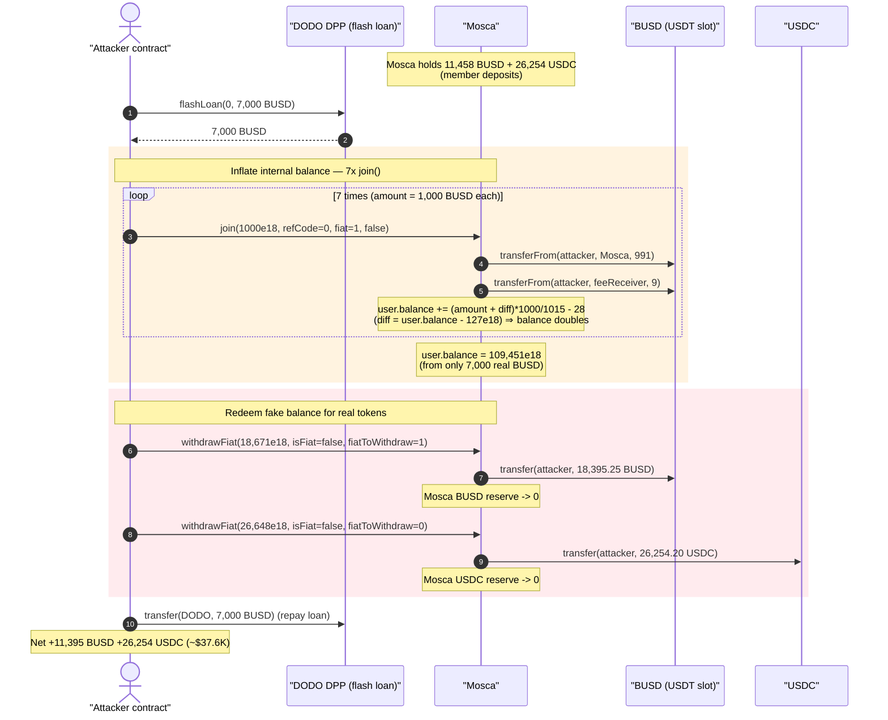
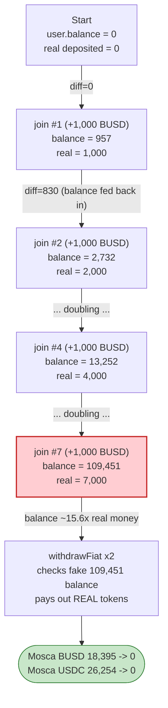
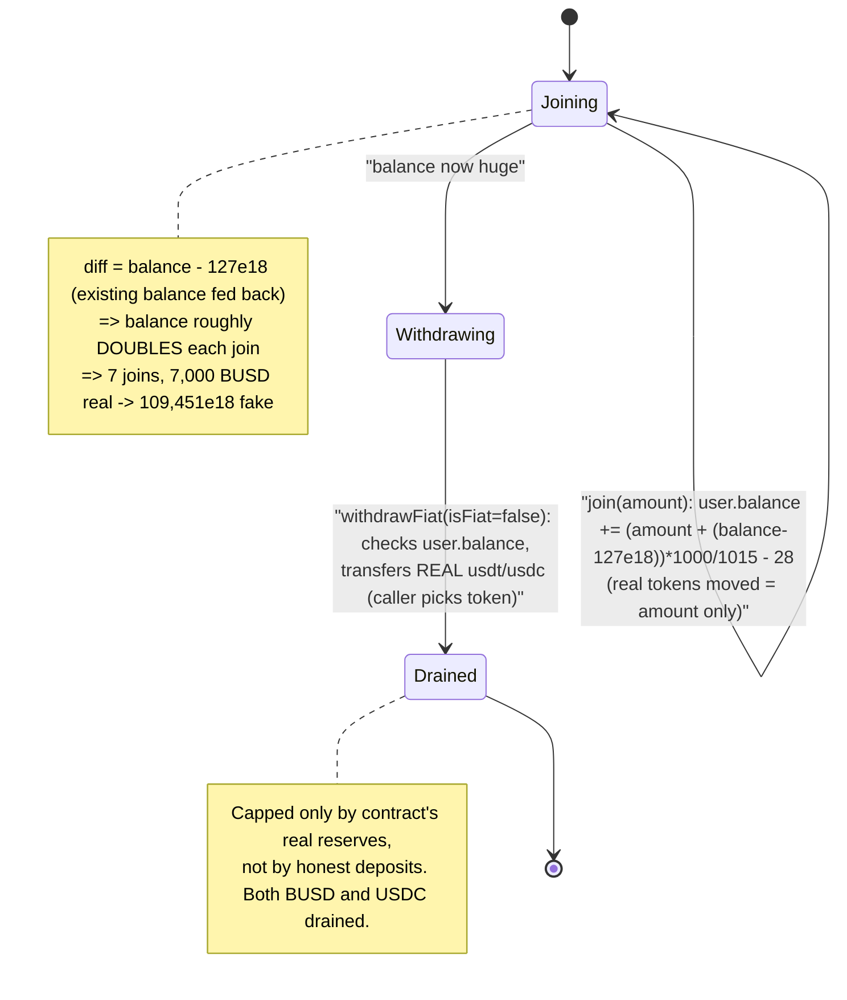

# Mosca Exploit — Self-Compounding `join()` Balance Inflation Drains the Treasury

> **Vulnerability classes:** vuln/arithmetic/overflow · vuln/logic/state-update

> **Reproduction:** the PoC compiles & runs in an isolated Foundry project at
> [this project folder](.) (the umbrella DeFiHackLabs repo contains many unrelated
> PoCs that do not compile together, so this one was extracted).
> Full verbose trace: [output.txt](output.txt).
> Verified vulnerable source: [Mosca.sol](sources/Mosca_d8791F/Mosca.sol).

---

## Key info

| | |
|---|---|
| **Loss** | ~$37.6K — **11,395.25 BUSD** + **26,254.20 USDC** drained from the Mosca contract |
| **Vulnerable contract** | `Mosca` — [`0xd8791F0C10B831B605C5D48959EB763B266940B9`](https://bscscan.com/address/0xd8791F0C10B831B605C5D48959EB763B266940B9#code) |
| **Victim** | The `Mosca` treasury itself (held member deposits in BUSD + USDC) |
| **Attacker EOA** | [`0xe763da20e25103da8e6afa84b6297f87de557419`](https://bscscan.com/address/0xe763da20e25103da8e6afa84b6297f87de557419) |
| **Attacker contract** | [`0xedcfa34e275120e7d18edbbb0a6171d8ad3ccf54`](https://bscscan.com/address/0xedcfa34e275120e7d18edbbb0a6171d8ad3ccf54) |
| **Attack tx** | [`0xf13d281d4aa95f1aca457bd17f2531581b0ce918c90905d65934c9e67f6ae0ec`](https://bscscan.com/tx/0xf13d281d4aa95f1aca457bd17f2531581b0ce918c90905d65934c9e67f6ae0ec) |
| **Chain / block / date** | BSC / 45,722,243 / Jan 13, 2025 (block ts `1736748000` = 2025-01-13 06:00 UTC) |
| **Compiler** | Solidity v0.8.20, optimizer 200 runs |
| **Bug class** | Accounting logic error — internal balance self-compounds on every `join()`, then redeemed for real tokens |

---

## TL;DR

`Mosca` is an on-chain MLM / "membership" program. Members `join()` by paying USDT (BUSD on
BSC) or USDC, in exchange for an internal credit (`users[me].balance`) that they can later cash
out for real tokens via `withdrawFiat()`.

The `join()` function computes the credit using this line
([Mosca.sol:342-345](sources/Mosca_d8791F/Mosca.sol#L342-L345)):

```solidity
uint256 diff = user.balance > 127 * 10 ** 18 ? user.balance - 127 * 10 ** 18 : 0;
uint256 baseAmount = ((amount + diff) * 1000) / 1015;
...
user.balance += enterpriseJoin ? baseAmount - ENTERPRISE_JOIN_FEE : baseAmount - JOIN_FEE;
```

The crediting amount is `(amount + diff)`, where `diff` is **the member's own existing balance**
minus a 127e18 floor. So each new `join()` re-credits the user with (almost) their entire current
balance *on top of* the new deposit. The internal balance therefore **roughly doubles every join**,
while the real tokens deposited are only ~991 per join.

Calling `join(1000e18)` **seven times** (paying ~7,000 BUSD total via a DODO flash loan) inflates
`users[attacker].balance` from 0 to **109,451e18** — a ~15.6× inflation versus the real money paid in.
The attacker then calls `withdrawFiat()` against this fake balance and walks away with **every real
BUSD and USDC token the contract was holding** (member deposits): the withdrawals are bounded only by
the contract's physical token balance, not by anything honest the attacker deposited.

---

## Background — what Mosca does

`Mosca` ([source](sources/Mosca_d8791F/Mosca.sol)) is a referral / pyramid membership contract on BSC:

- **`join(amount, refCode, fiat, enterpriseJoin)`** — a member pays `amount` of USDT/USDC and is
  credited an internal "Mosca" balance (`users[me].balance`), minus join fees/taxes. Joining also
  pays cascading tier rewards up a referral chain
  ([Mosca.sol:340-475](sources/Mosca_d8791F/Mosca.sol#L340-L475)).
- **`withdrawFiat(amount, isFiat, fiatToWithdraw)`** — a member redeems their internal balance for
  real tokens. With `isFiat = false` it spends `users[me].balance` and pays out USDT or USDC
  depending on `fiatToWithdraw` ([Mosca.sol:802-842](sources/Mosca_d8791F/Mosca.sol#L802-L842)).
- Three internal ledgers exist per user: `balance` (generic Mosca credit), `balanceUSDT`, and
  `balanceUSDC` ([Mosca.sol:185-197](sources/Mosca_d8791F/Mosca.sol#L185-L197)).

On-chain state at the fork block (read via `cast`):

| Fact | Value |
|---|---|
| `JOIN_FEE` | 28 BUSD |
| `TAX` | 3 BUSD (charged `TAX * 3 = 9` per join) |
| `users[attacker].balance` before attack | **0** |
| `referrers[0]` (the `_refCode` the attacker passes) | `0x0` — no referral rewards reach the attacker |
| **BUSD held by Mosca** before attack | **11,458.25 BUSD** ← member deposits |
| **USDC held by Mosca** before attack | **26,254.20 USDC** ← member deposits |

The two token balances in that last block are the prize: legitimate members' funds parked inside the
contract, redeemable by anyone who can fabricate a large enough `users[me].balance`.

---

## The vulnerable code

### 1. `join()` re-credits the user with their own balance (`diff`)

```solidity
function join(uint256 amount, uint256 _refCode, uint8 fiat, bool enterpriseJoin) external nonReentrant{
    User storage user = users[msg.sender];
    uint256 diff = user.balance > 127 * 10 ** 18 ? user.balance - 127 * 10 ** 18 : 0;   // ⚠️ existing balance
    uint256 tax_remainder;
    uint256 baseAmount = ((amount + diff) * 1000) / 1015;                                // ⚠️ amount + existing balance
    ...
    require(amount >= JOIN_FEE, "Insufficient amount sent");
    require(usdt.transferFrom(msg.sender, address(this), amount - (TAX * 3)), "Transfer failed"); // only `amount` moves
    require(usdt.transferFrom(msg.sender, feeReceiver, TAX * 3), "Transfer failed");
    ...
    totalRevenue += amount;
    user.balance += enterpriseJoin ? baseAmount - ENTERPRISE_JOIN_FEE : baseAmount - JOIN_FEE;     // ⚠️ credit includes diff
    ...
}
```
[Mosca.sol:340-475](sources/Mosca_d8791F/Mosca.sol#L340-L475)

The token movement is keyed off `amount` (the deposit). The **credit** is keyed off `amount + diff`,
where `diff ≈ user.balance`. So a member who already has a non-trivial `balance` is credited their
own balance *again* on the next join, even though they only deposit `amount` of real tokens.

### 2. `withdrawFiat()` pays real tokens for the fake balance

```solidity
function withdrawFiat(uint256 amount, bool isFiat, uint8 fiatToWithdraw) external nonReentrant {
    require(!isBlacklisted[msg.sender], "Blacklisted user");
    User storage user = users[msg.sender];
    uint limit = user.enterprise ? 127 * 10 ** 18 : 28 * 10 ** 18;
    uint balance;
    uint256 baseAmount = (amount * 1000) / 1015;
    if(!isFiat) {
        balance = user.balance;                                  // ← the inflated ledger
    } else {
        balance = fiatToWithdraw == 1 ? user.balanceUSDT : user.balanceUSDC;
    }

    require(amount <= balance - limit, "Insufficient balance");  // ← only checks the fake ledger

    if (!isFiat){
        user.balance -= amount;
    } else {
        fiatToWithdraw == 1 ? user.balanceUSDT -= amount : user.balanceUSDC -= amount;
    }

    fiatToWithdraw == 1 ? usdt.transfer(msg.sender, baseAmount)  // ⚠️ pays REAL USDT/BUSD ...
                        : usdc.transfer(msg.sender, baseAmount); // ⚠️ ... or REAL USDC
    ...
}
```
[Mosca.sol:802-842](sources/Mosca_d8791F/Mosca.sol#L802-L842)

`withdrawFiat` validates the request against `user.balance` (with `isFiat = false`) but transfers
out real ERC-20 tokens (`usdt`/`usdc`). There is no check that the contract's real token holdings
correspond to honest deposits, no per-token segregation between what a user paid and what they can
take, and the `balance` ledger that gates the withdrawal is exactly the one that `join()` lets the
attacker inflate for free.

---

## Root cause — why it was possible

Two independent flaws compose into a critical, fully-permissionless drain:

1. **`join()` is a balance multiplier.** The intended behavior was presumably to top-up a member's
   balance by the newly-deposited `amount`. Instead, the `diff` term feeds the member's *existing*
   balance back into the credit calculation:
   `user.balance += ((amount + (user.balance − 127e18)) × 1000 / 1015) − 28e18`.
   For a balance well above the 127e18 floor this is ≈ `2 × user.balance + 0.985 × amount`, i.e. the
   internal balance **roughly doubles every call** regardless of how little real money is added. Seven
   calls turn 7,000 real BUSD into a 109,451e18 internal credit.

2. **`withdrawFiat()` honors that fake credit with real tokens, across token types.** The
   `isFiat = false` branch spends `user.balance` (the inflatable ledger) yet pays out actual USDT/USDC.
   Worse, `fiatToWithdraw` lets the caller choose *which* real token to receive (`1 = USDT/BUSD`,
   `0/2 = USDC`) while still spending the single generic `balance` ledger — so the same fabricated
   credit can be cashed out in **both** BUSD and USDC. The contract holds member deposits with no
   solvency invariant tying internal credits to actual reserves, so a single inflated account can take
   everything.

In short: `join()` lets you mint unlimited internal balance for a few thousand dollars, and
`withdrawFiat()` lets you redeem that balance for whatever real BUSD/USDC the contract is custodying.
The flash loan is purely working capital to satisfy the 7 joins; it is repaid within the same tx.

---

## Preconditions

- The attacker's `users[me].balance` must climb above the `127 * 10 ** 18` floor for `diff` to be
  non-zero — achieved automatically after the first `join` (957e18 > 127e18), after which every
  subsequent join compounds.
- The Mosca contract must physically hold the BUSD/USDC to be drained (member deposits). At the fork
  block it held 11,458.25 BUSD and 26,254.20 USDC.
- `amount >= JOIN_FEE` (28e18) per join — trivially met with `amount = 1000e18`.
- Working capital in BUSD to fund the 7 joins (~7,000 BUSD). Fully recovered intra-transaction, hence
  flash-loanable: the PoC borrows 7,000 BUSD from DODO's DPP pool and repays it at the end.

---

## Attack walkthrough (with on-chain numbers from the trace)

All figures below come directly from the storage-diff and `Transfer`/`Joined`/`WithdrawFiat` events in
[output.txt](output.txt). The attacker contract is the foundry test address
`0x7FA9385bE102ac3EAc297483Dd6233D62b3e1496` in the replay.

| # | Step | Real BUSD moved | Internal `user.balance` (BUSD-equiv) | Note |
|---|------|----------------:|-------------------------------------:|------|
| 0 | **Flash loan** 7,000 BUSD from DODO DPP | +7,000 in | 0 | working capital |
| 1 | `approve` BUSD & USDC to Mosca (∞) | — | 0 | |
| 2 | `join(1000e18, fiat=1)` #1 | −1,000 (991 to Mosca, 9 fee) | **957.22** | `diff=0`, base=985.22 |
| 3 | `join` #2 | −1,000 | **2,732.40** | `diff=830.22` |
| 4 | `join` #3 | −1,000 | **6,256.51** | `diff=2,605.40` |
| 5 | `join` #4 | −1,000 | **13,252.66** | `diff=6,129.51` |
| 6 | `join` #5 | −1,000 | **27,141.56** | `diff=13,125.66` |
| 7 | `join` #6 | −1,000 | **54,714.11** | `diff=27,014.56` |
| 8 | `join` #7 | −1,000 | **109,451.74** | `diff=54,587.11` |
| 9 | `withdrawFiat(18,671.18e18, isFiat=false, fiatToWithdraw=1)` | **+18,395.25 BUSD out** | 90,780.56 | drains Mosca's entire BUSD (`baseAmount = 18671.18×1000/1015`) |
| 10 | `withdrawFiat(26,648.01e18, isFiat=false, fiatToWithdraw=0)` | — (USDC) | 64,132.55 | **+26,254.20 USDC out** — drains Mosca's entire USDC |
| 11 | Repay flash loan: `transfer(DODO, 7,000 BUSD)` | −7,000 | 64,132.55 | |

**Total internal balance fabricated:** 109,451.74e18 from only ~7,000 BUSD of real deposits — a 15.6×
inflation. The attacker only redeems a fraction of it (18,671 + 26,648) because the **withdrawals are
capped by the contract's real token holdings**, not by the fake ledger: Mosca held only 18,395.25 BUSD
(11,458.25 pre-existing + 6,937 just deposited) and 26,254.20 USDC, and both were drained to exactly 0.

### Profit accounting

| Token | In (attacker pays) | Out (attacker receives) | Net |
|---|---:|---:|---:|
| BUSD | 7,000 (7 joins) + 7,000 (loan repay) = 14,000 | 7,000 (loan) + 18,395.25 (withdraw1) = 25,395.25 | **+11,395.25 BUSD** |
| USDC | 0 | 26,254.20 (withdraw2) | **+26,254.20 USDC** |
| **Total** | | | **≈ $37,649** |

This matches the `~37.6K` figure in the PoC header and the closing balance log
(`Attacker After exploit USDC Balance: 26254.20`, plus the 11,395.25 BUSD profit).

---

## Diagrams

### Sequence of the attack



### Internal balance vs. real deposits per join



### The flaw inside `join()` / `withdrawFiat()`



---

## Why each magic number

- **7 joins of `1000e18`:** each join roughly doubles `user.balance`. Seven iterations
  (957 → 2,732 → 6,256 → 13,252 → 27,141 → 54,714 → **109,451**) push the fake balance far above the
  contract's combined real holdings (~$37.6K), guaranteeing both subsequent withdrawals succeed against
  the `balance - limit` check.
- **`withdrawFiat(18,671,180,855,284,200,248,407, false, 1)`:** chosen so that
  `baseAmount = amount × 1000 / 1015 = 18,395.25 BUSD` equals the contract's *entire* BUSD balance at
  that moment (11,458.25 pre-existing + 6,937 deposited via the joins). Draining BUSD to exactly 0.
- **`withdrawFiat(26,648,013,000,000,000,000,000, false, 0)`:** `baseAmount = 26,254.20 USDC`, exactly
  the contract's full USDC balance. `fiatToWithdraw = 0` selects the USDC payout branch while still
  spending the same generic `user.balance` ledger — the second token siphoned from one fake credit.
- **Flash loan 7,000 BUSD:** the exact working capital for 7 × 1,000-BUSD joins; repaid in full at the
  end, so the attacker needs no upfront capital.

---

## Remediation

1. **Fix the `join()` credit formula.** Remove the `diff` self-feedback term entirely. The credit must
   be a pure function of the *newly deposited* `amount` (e.g. `baseAmount = amount * 1000 / 1015;
   user.balance += baseAmount - JOIN_FEE;`). Feeding the user's existing balance back into the credit is
   the core mint-from-nothing bug.
2. **Enforce a solvency invariant on withdrawals.** A withdrawal must never pay out more real tokens
   than the user has *demonstrably deposited* into that token's ledger. Segregate accounting so
   `withdrawFiat` can only return value that was actually contributed, not an abstract "balance" that
   other mechanics (joins, referral rewards) inflate.
3. **Don't let one ledger redeem multiple real tokens.** `isFiat = false` spends `user.balance` but
   lets the caller choose USDT or USDC via `fiatToWithdraw`. Tie each redeemable ledger to a single
   underlying token, and require `isFiat`/`fiatToWithdraw` to be consistent with the ledger being spent.
4. **Add a per-account / per-block withdrawal cap and reconcile against real reserves.** Any redemption
   that would move a material fraction of the contract's token reserves should be rate-limited or
   require that internal credits be backed 1:1 by deposits.
5. **Add unit/invariant tests asserting `Σ user.balance` is backed by real reserves** and that
   `join(amount)` increases the user's balance by at most ~`amount`. Property-based fuzzing of
   repeated `join()` calls would have surfaced the doubling immediately.

---

## How to reproduce

The PoC was extracted into a standalone Foundry project (the umbrella DeFiHackLabs repo has many
unrelated PoCs that fail to compile under a whole-project `forge build`):

```bash
_shared/run_poc.sh 2025-01-Mosca2_exp -vvvvv
```

- The PoC imports `../basetest.sol` (which pulls in `./tokenhelper.sol`) and `../interface.sol`;
  copies of all three were placed at the project root so the relative imports resolve.
- RPC: a **BSC archive** endpoint is required (fork block 45,722,243). `foundry.toml` uses
  `https://bsc-mainnet.public.blastapi.io`, which serves historical state at that block; most public
  BSC RPCs prune it and fail with `header not found` / `missing trie node`.
- Result: `[PASS] testExploit()` with `Attacker After exploit USDC Balance: 26254.20` (plus 11,395.25
  BUSD of profit, not shown in the USDC-denominated balance log).

Expected tail:

```
  Attacker Before exploit USDC Balance: 0.000000000000000000
  Attacker After exploit USDC Balance: 26254.200000000000000000

Suite result: ok. 1 passed; 0 failed; 0 skipped; finished in 14.91s (13.71s CPU time)

Ran 1 test suite: 1 tests passed, 0 failed, 0 skipped (1 total tests)
```

---

*Reference: SlowMist Hacked — https://hacked.slowmist.io/ (Mosca, BSC, ~$37.6K).*
