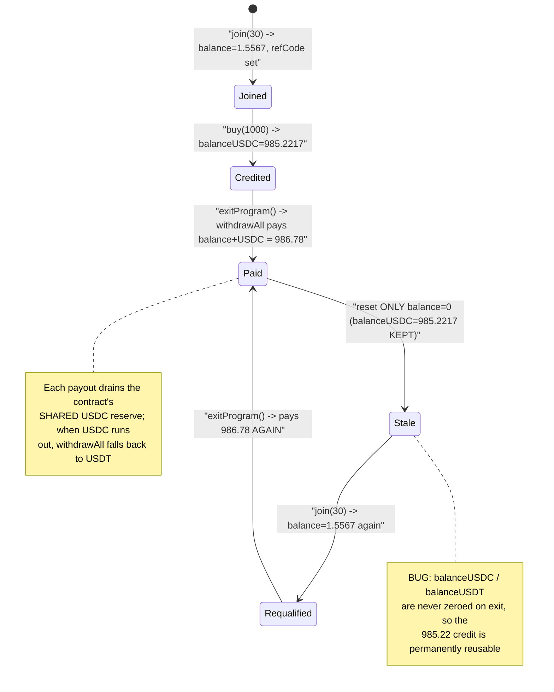
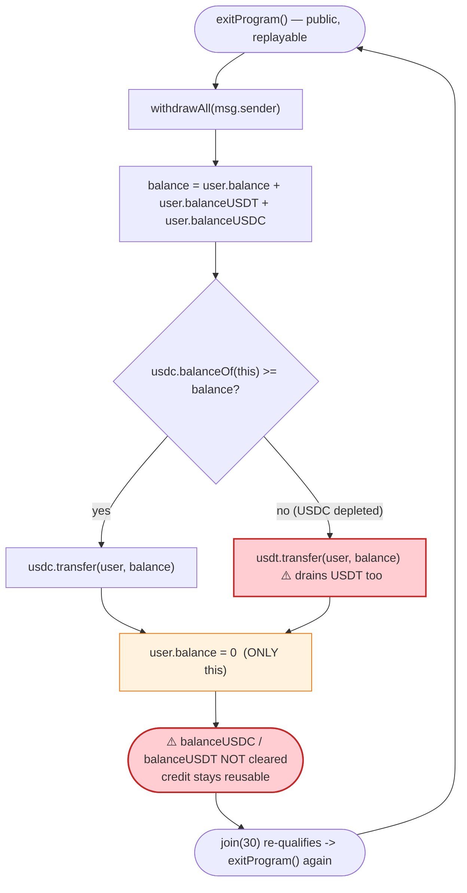

# Mosca Exploit — `exitProgram()` Pays Out Internal Credit That Was Never Backed by a Deposit

> **One-liner:** Mosca's `buy()` credits the caller a large internal `balanceUSDC`, `exitProgram()`/`withdrawAll()` pays that credit out in real USDC/USDT, but `exitProgram()` only zeroes `user.balance` — it **never clears `balanceUSDC`/`balanceUSDT`** — so the same credit can be withdrawn over and over, draining both stablecoin reserves of the contract.

> **Reproduction:** the PoC compiles & runs in an isolated Foundry project at
> [this project folder](.) (the umbrella DeFiHackLabs repo contains many unrelated PoCs that do not
> whole-compile, so this one was extracted).
> Full verbose trace: [output.txt](output.txt).
> Verified vulnerable source: [sources/Mosca_1962b3/Mosca.sol](sources/Mosca_1962b3/Mosca.sol).

---

## Key info

| | |
|---|---|
| **Loss** | ~**$19K** combined — both stablecoin sides of the contract were drained. The PoC's USDC-only balance log shows **30 → 11,228 USDC** (≈ +11,198 USDC) and the contract also bled ~7.9K of USDT in the same transaction. |
| **Vulnerable contract** | `Mosca` — [`0x1962b3356122d6A56f978e112d14f5E23a25037D`](https://bscscan.com/address/0x1962b3356122d6A56f978e112d14f5E23a25037D#code) |
| **Victim / drained reserves** | Mosca's own USDC (`0x8AC7…580d`) and USDT/BSC-USD (`0x55d398…7955`) balances |
| **Flash-loan source** | PancakeSwap V3 pool `0x92b7807bF19b7DDdf89b706143896d05228f3121` (USDC side) |
| **Attacker EOA** | [`0xb7d7240c207e094a9be802c0f370528a9c39fed5`](https://bscscan.com/address/0xb7d7240c207e094a9be802c0f370528a9c39fed5) |
| **Attacker contract** | [`0x851288dcfb39330291015c82a5a93721cc92507a`](https://bscscan.com/address/0x851288dcfb39330291015c82a5a93721cc92507a) |
| **Attack tx** | [`0x4e5bb7e3f552f5ee6ee97db9a9fcf07287aae9a1974e24999690855741121aff`](https://bscscan.com/tx/0x4e5bb7e3f552f5ee6ee97db9a9fcf07287aae9a1974e24999690855741121aff) |
| **Chain / block / date** | BSC / 45,519,929 / 2025-01-06 (`Joined` event timestamp `1736140963`) |
| **Compiler** | Solidity v0.8.20, optimizer 200 runs |
| **Bug class** | Broken accounting — withdrawal does not clear the credited balance (double/infinite withdrawal of unbacked internal credit) |

---

## TL;DR

Mosca is an MLM-style "citizenship" program that keeps per-user **internal balances** in three fields
— `balance` (MOSCA credit), `balanceUSDT`, `balanceUSDC`
([Mosca.sol:175-187](sources/Mosca_1962b3/Mosca.sol#L175-L187)). Users top up these internal balances
via `join()` and `buy()`, and cash out via `exitProgram()`.

The exit path is broken:

- `exitProgram()` → `withdrawAll(addr)` pays the user
  **`user.balance + user.balanceUSDT + user.balanceUSDC`** in real USDC (or USDT if USDC is short)
  ([Mosca.sol:918-934](sources/Mosca_1962b3/Mosca.sol#L918-L934)).
- After paying, `exitProgram()` resets **only `user.balance = 0`** and `user.enterprise = false`
  ([Mosca.sol:823-824](sources/Mosca_1962b3/Mosca.sol#L823-L824)). It **never zeroes `balanceUSDC` or
  `balanceUSDT`**.

So the attacker calls `buy(1000 USDC, fiat)` once to mint a `balanceUSDC` credit of **985.22e18**
([Mosca.sol:493-496](sources/Mosca_1962b3/Mosca.sol#L493-L496)), then loops `join()` + `exitProgram()`.
Each `exitProgram()` keeps paying out the **same ~986.78 USDC** because the 985.22 `balanceUSDC` credit
is never deleted, while each cheap `join()` just re-tops the small `balance` field. The attacker pays
30 USDC per join (≈21 stays in the contract, 9 goes to the owner) and receives ~986.78 stablecoin each
exit — a ~32× return per cycle — repeated until the contract's USDC and USDT reserves are empty.

---

## Background — what Mosca does

`Mosca` ([source](sources/Mosca_1962b3/Mosca.sol)) is a referral / matrix ("citizenship") program
denominated in BSC stablecoins. Each user has a `User` struct
([Mosca.sol:175-187](sources/Mosca_1962b3/Mosca.sol#L175-L187)):

```solidity
struct User {
    uint256 balance;       // "MOSCA" credit (tier rewards, join leftovers, transfer fees)
    uint256 balanceUSDT;   // internal USDT credit
    uint256 balanceUSDC;   // internal USDC credit
    uint256 nextDeadline;  // subscription renewal deadline
    ...
    address walletAddress;
    bool enterprise;
}
```

The two real tokens the contract custodies:

| Symbol in code | BSC address | Real identity |
|---|---|---|
| `usdc` | `0x8AC76a51cc950d9822D68b83fE1Ad97B32Cd580d` | Binance-Peg USDC |
| `usdt` | `0x55d398326f99059fF775485246999027B3197955` | BSC-USD / USDT |

The relevant entry points:

- **`join(amount, refCode, fiat, enterpriseJoin)`** — pays a `JOIN_FEE` (`28e18`) to activate
  citizenship, pulling stablecoins in and crediting the leftover to the user's `balance`
  ([Mosca.sol:349-475](sources/Mosca_1962b3/Mosca.sol#L349-L475)).
- **`buy(amount, buyFiat, fiat)`** — top up a *fiat* internal balance: pulls `amount` of the chosen
  stablecoin and credits `baseAmount = amount·1000/1015` to `balanceUSDC`/`balanceUSDT`
  ([Mosca.sol:476-512](sources/Mosca_1962b3/Mosca.sol#L476-L512)).
- **`exitProgram()`** — leave the program and withdraw all internal balances
  ([Mosca.sol:805-832](sources/Mosca_1962b3/Mosca.sol#L805-L832)).

The on-chain economic constants at the fork block:

| Constant | Value |
|---|---|
| `JOIN_FEE` | `28e18` |
| `TAX` | `3e18` (non-enterprise join sends `TAX*3 = 9e18` to `owner`) |
| `TRANSFER_FEE` | `50` (bps, used by `distributeFees`) |
| `buy`/`join` base divisor | `×1000/1015` (≈ a 1.5% intake skim) |

---

## The vulnerable code

### 1. `buy()` mints a large internal `balanceUSDC` credit

```solidity
function buy(uint256 amount, bool buyFiat, uint8 fiat) external nonReentrant{
    require(refByAddr[msg.sender] != 0, "Cannot buy before activating citizenship");
    User storage user = users[msg.sender];
    uint256 baseAmount = (amount * 1000)/1015;          // 1000e18 → 985.2216e18
    ...
    if(!buyFiat){ user.balance += baseAmount; ... }
    else {
        if(fiat == 1) { user.balanceUSDT += baseAmount; ... }
        else          { user.balanceUSDC += baseAmount;   // ← credit recorded here
                        emit BoughtUSDC(msg.sender, block.timestamp, baseAmount); }
    }
    ...
    require(usdc.transferFrom(msg.sender, address(this), amount), "Transfer failed"); // pulls 1000 USDC
    distributeFees(msg.sender, amount);
}
```
([Mosca.sol:476-512](sources/Mosca_1962b3/Mosca.sol#L476-L512))

### 2. `exitProgram()` pays everything out — but only resets `balance`

```solidity
function exitProgram() external nonReentrant {
    require(!isBlacklisted[msg.sender], "Blacklisted user");
    User storage user = users[msg.sender];
    ...
    for (uint256 i = 0; i < rewardQueue.length; i++) {
        address userAddr = rewardQueue[i];
        if (userAddr == msg.sender) {
            withdrawAll(msg.sender);            // ← pays balance + balanceUSDT + balanceUSDC

            refByAddr[userAddr] = 0;
            referrers[user.refCode] = 0x...dEaD;
            user.balance = 0;                   // ⚠️ ONLY balance is cleared
            user.enterprise = false;            // ⚠️ balanceUSDC / balanceUSDT NOT cleared

            rewardQueue[i] = rewardQueue[rewardQueue.length - 1];
            rewardQueue.pop();
            emit ExitProgram(msg.sender, block.timestamp);
        }
    }
}
```
([Mosca.sol:805-832](sources/Mosca_1962b3/Mosca.sol#L805-L832))

### 3. `withdrawAll()` sums all three balances and pays real tokens

```solidity
function withdrawAll(address addr) private {
    User storage user = users[addr];
    require(msg.sender == user.walletAddress, "Wallet addresses do not match");
    uint balance = user.balance + user.balanceUSDT + user.balanceUSDC;   // ← sum of all credits

    if(usdc.balanceOf(address(this)) >= balance){
        usdc.transfer(user.walletAddress, balance);     // pay in USDC if enough...
        emit WithdrawAll(user.walletAddress, block.timestamp, balance, 2);
    } else {
        usdt.transfer(user.walletAddress, balance);     // ...else pay in USDT
        emit WithdrawAll(user.walletAddress, block.timestamp, balance, 1);
    }
}
```
([Mosca.sol:918-934](sources/Mosca_1962b3/Mosca.sol#L918-L934))

---

## Root cause — why it was possible

`exitProgram()` is supposed to be a one-time, fully-settling withdrawal: pay out everything, then zero
the account. But the settlement is incomplete.

> `withdrawAll()` pays `balance + balanceUSDT + balanceUSDC`, yet `exitProgram()` only writes back
> `user.balance = 0`. The `balanceUSDC`/`balanceUSDT` fields keep their pre-withdrawal values forever.

That single missing reset turns a withdrawal into a **reusable credit voucher**:

1. **Unbacked persistence.** The 985.22e18 `balanceUSDC` credit minted by one `buy()` survives every
   `exitProgram()`. Each exit re-pays it out of the contract's *shared reserves* (other users' money),
   even though the attacker only ever deposited 1000 USDC once.
2. **`exitProgram()` is replayable.** It is not gated to "must currently be in the queue" in a way that
   blocks re-entry — `join()` simply pushes the caller back onto `rewardQueue`
   ([Mosca.sol:463](sources/Mosca_1962b3/Mosca.sol#L463)), so the attacker can re-join → re-exit
   indefinitely.
3. **Cheap re-qualification.** A non-enterprise `join(30e18)` costs only 30 USDC (21 to the contract,
   9 to the owner) yet re-establishes citizenship and re-tops `balance`
   ([Mosca.sol:422-447](sources/Mosca_1962b3/Mosca.sol#L422-L447)). The persistent `balanceUSDC` does
   the heavy lifting on every exit.
4. **USDC→USDT fallback widens the blast radius.** When the contract's USDC runs out, `withdrawAll`
   silently pays the same credit in USDT ([Mosca.sol:923-928](sources/Mosca_1962b3/Mosca.sol#L923-L928)),
   so the bug drains *both* reserves, not just the one the attacker deposited.

The exact arithmetic per exit:

```
baseAmount(buy 1000)  = 1000e18 * 1000/1015 = 985.221674876847290640e18  (→ balanceUSDC, persistent)
balance(after join 30)= 30e18*1000/1015 - 28e18 = 1.556650246305418719e18 (re-added every join)
withdrawAll payout    = 1.556650246305418719e18 + 985.221674876847290640e18
                      = 986.778325123152709359e18   (matches the on-chain transfer to the wei)
```

---

## Preconditions

- Caller must hold a referral code (`refByAddr[msg.sender] != 0`) before calling `buy()`
  ([Mosca.sol:477](sources/Mosca_1962b3/Mosca.sol#L477)). The first `join()` establishes this via
  `generateRefCode()` ([Mosca.sol:465-467](sources/Mosca_1962b3/Mosca.sol#L465-L467)).
- The contract must hold enough USDC/USDT reserves to satisfy the inflated payouts — it did
  (≈12.9K USDC + a USDT cushion at the fork block).
- Working capital to fund the single `buy(1000 USDC)` and the repeated `join(30 USDC)` calls. This is
  trivially **flash-loanable**: the PoC borrows 1000 USDC from a PancakeSwap V3 pool inside
  `flash()`/`pancakeV3FlashCallback` and repays it (1000 + 0.1 fee) at the end
  ([test/Mosca_exp.sol:44-73](test/Mosca_exp.sol#L44-L73)).

---

## Attack walkthrough (with on-chain numbers from the trace)

All figures are pulled directly from [output.txt](output.txt). Token decimals = 18 throughout.

| # | Step | Attacker pays | Mosca credits / pays | Net effect |
|---|------|--------------:|---------------------:|------------|
| 0 | **Fund + first `join(30, ref=0, fiat=2, ent=false)`** (outside flash) | 30 USDC (21 → contract, 9 → owner `0x2fE7…74a`) | `balance += 1.5567`; gets a referral code | Citizenship activated; enables later `buy()`. |
| 1 | **Flash-borrow 1000 USDC** from Pancake V3 pool `0x92b7…3121` | — | 1000 USDC sent to attacker contract | Working capital for the cycle. |
| 2 | **`buy(1000, buyFiat=true, fiat=2)`** | 1000 USDC pulled into Mosca | `balanceUSDC += 985.2217` (event `BoughtUSDC`) | The persistent, unbacked credit is minted. |
| 3 | **`exitProgram()` #1** | — | pays **986.778325 USDC** to attacker; resets only `balance` | `balanceUSDC` survives → 985.22 still credited. |
| 4 | **Loop ×20: `join(30)` then `exitProgram()`** | 30 USDC per join | pays **986.778325** stablecoin per exit | Each cycle nets ≈ **+956.78** to the attacker. |
| 5 | **Repay flash** | 1000 + 0.1 USDC to pool | — | Loan closed. |

Trace facts confirming the mechanism:

- **21 `join`s**, **1 `buy`**, **21 `exitProgram` payouts** of exactly `986778325123152709359` each.
- The contract's USDC ran dry mid-loop, so **13 exits paid in USDC** (`0x8AC7…580d`) and the remaining
  **8 exits paid in USDT** (`0x55d398…7955`) via the `withdrawAll` fallback — draining *both* reserves.
- Final attacker USDC balance (from the PoC's `balanceLog`): **11,228.018226600985221667 USDC**, up
  from the 30 USDC starting stake.

### Profit / loss accounting

> The PoC's `balanceLog` modifier only tracks the funding token (USDC), so it reports the USDC leg.
> The contract additionally lost ~7.9K USDT (8 exits × 986.78) paid out through the fallback branch,
> which is why the publicly reported total loss is **~$19K** across both stablecoins.

| Item | USDC |
|---|---:|
| Attacker USDC before | 30.000000 |
| Attacker USDC after | 11,228.018227 |
| **USDC profit (measured)** | **+11,198.018227** |
| USDT additionally drained (8 × 986.78, fallback branch) | ≈ 7,894 USDT |
| **Combined reported loss** | **≈ $19K** |

The flash loan of 1000 USDC is fully repaid (1000 + 0.1 fee), so the attacker's only real cost is the
gas plus the net of joins vs. payouts — which is hugely positive.

---

## Diagrams

### Sequence of the attack

```mermaid
sequenceDiagram
    autonumber
    actor A as "Attacker contract"
    participant POOL as "PancakeV3 USDC pool"
    participant M as "Mosca"
    participant USDC as "USDC token"
    participant USDT as "USDT token"

    Note over M: Holds real USDC + USDT reserves (other users' deposits)

    rect rgb(232,245,233)
    Note over A,M: Setup (before flash)
    A->>M: join(30 USDC, ref=0, fiat=2)
    M->>USDC: pull 21 to contract, 9 to owner
    M-->>A: balance += 1.5567; referral code assigned
    end

    rect rgb(227,242,253)
    Note over A,M: Borrow working capital
    A->>POOL: flash(1000 USDC)
    POOL-->>A: 1000 USDC
    end

    rect rgb(255,243,224)
    Note over A,M: Mint the unbacked credit (once)
    A->>M: buy(1000, fiat=2)
    M->>USDC: pull 1000 into Mosca
    M-->>A: balanceUSDC += 985.2217  (persistent!)
    end

    rect rgb(255,235,238)
    Note over A,M: Drain loop (x21 exits)
    A->>M: exitProgram()
    M->>USDC: transfer 986.78 to attacker
    Note over M: only user.balance reset to 0<br/>balanceUSDC = 985.22 SURVIVES
    loop 20x
        A->>M: join(30 USDC)
        M-->>A: balance += 1.5567 (re-qualified)
        A->>M: exitProgram()
        alt contract still has USDC
            M->>USDC: transfer 986.78 to attacker
        else USDC depleted
            M->>USDT: transfer 986.78 to attacker (fallback)
        end
    end
    end

    A->>POOL: repay 1000.1 USDC
    Note over A: Net: ~11,198 USDC + ~7,894 USDT extracted
```

### Account-state evolution (why each exit keeps paying)



### The flaw inside the exit path



---

## Why each magic number

- **`buy(1000 USDC)`:** mints `balanceUSDC = 1000·1000/1015 = 985.2217e18`. This is the persistent,
  unbacked credit that every subsequent `exitProgram()` re-pays. One `buy` is enough — it is never
  consumed.
- **`join(30 USDC)`:** the minimum cheap way to re-activate citizenship after each exit. `JOIN_FEE` is
  `28e18`; with the `×1000/1015` intake skim, `30e18` leaves `balance += 1.5567e18` and pushes the
  attacker back onto `rewardQueue` so the next `exitProgram()` finds them. Cost: 30 USDC (9 of which
  goes to the owner), payout: 986.78 stablecoin — a ~32× per-cycle return.
- **20 loop iterations (21 exits total):** enough cycles to exhaust the contract's USDC reserve and
  spill into the USDT reserve via the fallback, maximizing extraction in one transaction.
- **Flash loan of 1000 USDC:** only needed so the attacker can fund the single `buy()` without
  committing its own capital; repaid (1000 + 0.1 fee) before the transaction ends.

---

## Remediation

1. **Clear *all* balances on exit.** In `exitProgram()`, after `withdrawAll`, set
   `user.balanceUSDT = 0` and `user.balanceUSDC = 0` in addition to `user.balance = 0`. This single fix
   eliminates the reusable-credit bug. (Equivalently, have `withdrawAll` itself zero each field as it
   pays it.)
2. **Settle from per-user funds, not shared reserves.** Internal credits must be backed 1:1 by the
   user's own deposits and accounted globally (e.g., a `totalLiabilities` figure) so a single user can
   never withdraw more than they put in. Right now `buy()` credits `985.22` for a `1000` deposit but the
   payout is repeatable, so the realized liability is unbounded.
3. **Make `exitProgram()` non-replayable.** Require the user to be currently active before paying
   (e.g., a `require(user.walletAddress == msg.sender && !exited[msg.sender])` latch), and do not allow
   `join()` to silently re-qualify an account that still holds stale fiat credits.
4. **Don't silently switch payout token.** The USDC→USDT fallback in `withdrawAll`
   ([Mosca.sol:923-928](sources/Mosca_1962b3/Mosca.sol#L923-L928)) lets one accounting error drain a
   second, unrelated reserve. Pay each credit only in its own token, and revert if the matching reserve
   is insufficient instead of substituting another asset.
5. **Add a global invariant check.** Assert that the sum of all outstanding internal balances never
   exceeds the contract's actual token holdings; any operation that would break it should revert.

---

## How to reproduce

The PoC was extracted into a standalone Foundry project (the umbrella DeFiHackLabs repo has many
unrelated PoCs that fail to whole-compile under `forge test`):

```bash
_shared/run_poc.sh 2025-01-Mosca_exp -vvvvv
```

- RPC: a **BSC archive** endpoint is required (fork block 45,519,929). `foundry.toml` uses
  `https://bsc-mainnet.public.blastapi.io`, which serves historical state at that block; most public
  BSC RPCs prune it and fail with `header not found` / `missing trie node`.
- Result: `[PASS] testExploit()` with the attacker's USDC balance growing 30 → 11,228.

Expected tail:

```
[PASS] testExploit() (gas: 3612361)
  Attacker Before exploit USDC Balance: 30.000000000000000000
  Attacker After exploit USDC Balance: 11228.018226600985221667

Suite result: ok. 1 passed; 0 failed; 0 skipped
```

---

*Reference: DeFiHackLabs — Mosca, BSC, ~$19K. Vulnerable source verified on BscScan at
`0x1962b3356122d6A56f978e112d14f5E23a25037D`.*
