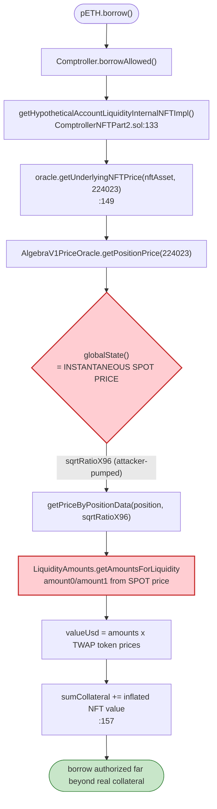
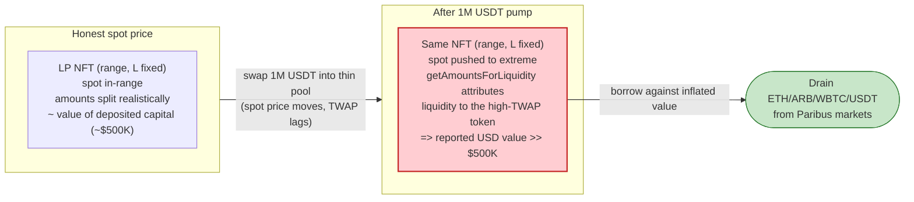

# Paribus Exploit — Algebra/Camelot LP-NFT Collateral Priced from Manipulable Spot Price

> **Reproduction:** the PoC compiles & runs in an isolated Foundry project at
> [this project folder](.) (the umbrella DeFiHackLabs repo contains many unrelated PoCs that do
> not whole-compile, so this one was extracted).
> Full verbose trace: [output.txt](output.txt).
> Verified vulnerable source: [contracts_PriceOracle_Impl_AlgebraV1PriceOracle.sol](sources/ArbitrumPriceOracle_a185a8/contracts_PriceOracle_Impl_AlgebraV1PriceOracle.sol)
> and its parent [contracts_PriceOracle_Impl_UniV3PriceOracle.sol](sources/ArbitrumPriceOracle_a185a8/contracts_PriceOracle_Impl_UniV3PriceOracle.sol).

---

## Key info

| | |
|---|---|
| **Loss** | ~$86K — borrowed assets (ETH + ARB + WBTC + USDT) drained from the Paribus lending markets against a worthless-on-paper LP-NFT |
| **Vulnerable contract** | Paribus `ArbitrumPriceOracle` / `AlgebraV1PriceOracle` (NFT position pricing) — [`0xa185a8c0929D473f2d0d2A132c4464fc01380bCe`](https://arbiscan.io/address/0xa185a8c0929D473f2d0d2A132c4464fc01380bCe#code) |
| **Borrow market hit first** | pETH (native-ETH market) — [`0xAffd437801434643B734D0B2853654876F66f7D7`](https://arbiscan.io/address/0xaffd437801434643b734d0b2853654876f66f7d7#code) (proxy → impl `0x738b6098…`) |
| **Comptroller (NFT collateral)** | [`0x712E2B12D75fe092838A3D2ad14B6fF73d3fdbc9`](https://arbiscan.io/address/0x712E2B12D75fe092838A3D2ad14B6fF73d3fdbc9) (delegates to `0x1983e765…`) |
| **Manipulated pool** | Camelot/Algebra V1 PBX/USDT pair — `0x25874cC60cBF7495b7Cd1FA724178d251CfAD5a8` |
| **Attacker EOA** | [`0x56190CAC88b8D4b5D5Ed668ef81828913932e7Ed`](https://arbiscan.io/address/0x56190CAC88b8D4b5D5Ed668ef81828913932e7Ed) |
| **Attack tx** | [`0xf5e753d3da60db214f2261343c1e1bc46e674d2fa4b7a953eaf3c52123aeebd2`](https://arbiscan.io/tx/0xf5e753d3da60db214f2261343c1e1bc46e674d2fa4b7a953eaf3c52123aeebd2) |
| **Chain / block / date** | Arbitrum One / 296,699,666 / Jan 18, 2025 |
| **Compiler** | Oracle: Solidity 0.5.17; PoC: ^0.8.10 |
| **Bug class** | Spot-price oracle manipulation of LP-NFT collateral (Uniswap-V3/Algebra position valuation from instantaneous `globalState()`/`slot0`) |

---

## TL;DR

Paribus is a Compound-fork lending protocol on Arbitrum that, beyond ordinary ERC-20 markets, accepts
**concentrated-liquidity LP NFTs (Camelot/Algebra V1 and Uniswap V3 positions) as collateral**. To value
such an NFT it calls `AlgebraV1PriceOracle.getPositionPrice(tokenId)`, which reads the pool's
**current spot price** `sqrtRatioX96` directly from `globalState()`
([AlgebraV1PriceOracle.sol:38](sources/ArbitrumPriceOracle_a185a8/contracts_PriceOracle_Impl_AlgebraV1PriceOracle.sol#L38)),
then uses that spot price to split the position's liquidity into token0/token1 amounts via
`LiquidityAmounts.getAmountsForLiquidity`
([UniV3PriceOracle.sol:46-60](sources/ArbitrumPriceOracle_a185a8/contracts_PriceOracle_Impl_UniV3PriceOracle.sol#L46-L60)).

The spot price of an on-chain AMM pool is **trivially manipulable inside one transaction**. By dumping
1,000,000 USDT into the thin PBX/USDT Camelot pool, the attacker pushed the pool's spot tick to an extreme,
minted a full-range LP NFT, and deposited it as collateral. The oracle then valued that position far above
the ≈$500K of capital actually inside it, so the comptroller granted a borrowing power large enough to drain
**four** Paribus markets (ETH, ARB, WBTC, USDT). The attacker then swapped the borrowed/leftover tokens back
to USDT, repaid the Aave flash loan, and walked away — abandoning the now-worthless LP-NFT and the bad debt
in the protocol.

The attacker:

1. **Flash-borrows 3,093,209.81 USDT** from Aave V3.
2. **Pumps** the Camelot PBX/USDT pool by swapping 1,000,000 USDT → 31,170,612.93 PBX, moving the spot price.
3. **Mints** a wide-range Camelot LP position (NFT #224023) holding ≈136,766 PBX + 500,000 USDT.
4. **Deposits** that NFT as collateral in Paribus (`enterNFTMarkets` + `PNFTToken.mint`).
5. **Borrows** against the spot-inflated NFT value: 12.59996 ETH, 6,510.27 ARB, 0.36729789 WBTC, 3,924.21 USDT.
6. **Unwinds**: PBX → USDT and WBTC → USDT, **repays the flash loan** (3,094,756.41 USDT incl. premium), and keeps the borrowed ETH/ARB plus residual USDT.

Net realized profit at the fork block: **12.5999 ETH + 6,510.27 ARB + 10,283.19 USDT** (≈$86K per the
post-mortem), at the cost of the ≈$500K LP-NFT left behind as bad-debt collateral.

---

## Background — what Paribus does

Paribus ([oracle source tree](sources/ArbitrumPriceOracle_a185a8/)) is a Compound-V2-style money market.
Each asset has a `pToken` (cToken analogue); users supply collateral and borrow other assets up to a
collateral-factor-scaled fraction of their collateral's USD value. Paribus extends Compound with a notion of
**NFT collateral** — `PNFTToken` markets that accept Uniswap-V3 / Camelot-Algebra LP NFTs.

The comptroller's account-liquidity routine adds NFT collateral like this
([ComptrollerNFTPart2.sol:133-166](sources/ComptrollerNFTPart2_1983e7/contracts_Comptroller_ComptrollerNFTPart2.sol#L133-L166)):

```solidity
// Get the normalized price of the tokenId
vars.oraclePriceMantissa = IOracleNFT(oracle).getUnderlyingNFTPrice(nftAsset, tokenId);   // ← spot-priced
require(vars.oraclePriceMantissa > 0, "price error");
vars.oraclePrice = Exp({mantissa : vars.oraclePriceMantissa});
vars.tokensToDenom = mul_(mul_(vars.collateralFactor, Exp({mantissa : 1e36})), vars.oraclePrice);
vars.sumCollateral = add_(truncate(vars.tokensToDenom), vars.sumCollateral);               // ← drives borrow power
```

`getUnderlyingNFTPrice` routes Camelot/Algebra positions to the `AlgebraV1PriceOracle`
([AggregatorOracle.sol:102-109](sources/ArbitrumPriceOracle_a185a8/contracts_PriceOracle_Impl_AggregatorOracle.sol#L102-L109)).

On-chain facts at the fork block (from the trace):

| Parameter | Value |
|---|---|
| PBX/USDT Camelot pool | `0x25874cC60cBF7495b7Cd1FA724178d251CfAD5a8` (Algebra V1; `token0 = PBX(18d)`, `token1 = USDT(6d)`) |
| Per-token PBX price source | Algebra TWAP single-asset oracle `0x03Ae45A78…` (uses `getTimepoints([1800,0])`, a 30-min window) |
| Per-token USDT price | Chainlink-backed, ≈$1.00 |
| ETH price used | $3,313.19 |
| pETH market liquidity at borrow | enough to lend 12.59996 ETH |
| LP-NFT actually deposited (#224023) | ≈136,766 PBX + 500,000 USDT |

The decisive asymmetry: the **token amounts** in the LP NFT are derived from the **manipulable spot price**,
while the **per-token prices** come from a (lagging) TWAP. Pump the spot price and the position's liquidity is
attributed almost entirely to the token the TWAP still values highly — inflating the position's USD value far
beyond the capital inside it.

---

## The vulnerable code

### 1. Position value is computed from the live spot price

[`AlgebraV1PriceOracle.getPositionPrice`](sources/ArbitrumPriceOracle_a185a8/contracts_PriceOracle_Impl_AlgebraV1PriceOracle.sol#L33-L41):

```solidity
function getPositionPrice(uint tokenId) public view returns (uint price) {
    require(isPositionSupported(tokenId), "Position not supported");
    (,, address token0, address token1, int24 tickLower, int24 tickUpper, uint128 liquidity,,, uint128 tokensOwed0, uint128 tokensOwed1)
        = AlgebraNFPManagerInterface(nfpManager).positions(tokenId);
    // Fetch price from pool — ⚠️ INSTANTANEOUS SPOT PRICE, no TWAP
    (uint160 sqrtRatioX96,,,,,,) =
        IAlgebraV1Pool(IAlgebraV1Factory(AlgebraNFPManagerInterface(nfpManager).factory()).poolByPair(token0, token1)).globalState();

    price = getPriceByPositionData(
        PositionData(token0, token1, tickLower, tickUpper, liquidity, tokensOwed0, tokensOwed1),
        sqrtRatioX96   // ← attacker-controlled
    );
}
```

(The Uniswap-V3 variant has the identical flaw, reading `slot0()` —
[UniV3PriceOracle.sol:93-101](sources/ArbitrumPriceOracle_a185a8/contracts_PriceOracle_Impl_UniV3PriceOracle.sol#L93-L101).)

### 2. Spot price splits liquidity into token amounts, then prices them

[`NFPOracle.getPriceByPositionData`](sources/ArbitrumPriceOracle_a185a8/contracts_PriceOracle_Impl_UniV3PriceOracle.sol#L46-L60):

```solidity
function getPriceByPositionData(PositionData memory positionData, uint160 sqrtRatioX96) internal view returns (uint price) {
    uint160 sqrtRatioAX96 = TickMath.getSqrtRatioAtTick(positionData.tickLower);
    uint160 sqrtRatioBX96 = TickMath.getSqrtRatioAtTick(positionData.tickUpper);

    // ⚠️ token amounts are a function of the (manipulated) sqrtRatioX96
    (uint amount0, uint amount1) =
        LiquidityAmounts.getAmountsForLiquidity(sqrtRatioX96, sqrtRatioAX96, sqrtRatioBX96, positionData.liquidity);
    require(amount0 > 0 || amount1 > 0, "liquidity error");

    uint price0 = aggregateOracle.getTokenPrice(positionData.token0, 18);   // PBX via lagging TWAP
    uint price1 = aggregateOracle.getTokenPrice(positionData.token1, 18);   // USDT ≈ $1

    uint valueUsd0 = (amount0.add(positionData.tokens0Owed)).mul(price0).div(10 ** uint(ERC20Detailed(positionData.token0).decimals()));
    uint valueUsd1 = (amount1.add(positionData.tokens1Owed)).mul(price1).div(10 ** uint(ERC20Detailed(positionData.token1).decimals()));

    price = valueUsd0.add(valueUsd1);   // ← inflated USD value of the NFT
}
```

### 3. The inflated NFT value directly grants borrow power

[`ComptrollerNFTPart2.getHypotheticalAccountLiquidityInternalNFTImpl`](sources/ComptrollerNFTPart2_1983e7/contracts_Comptroller_ComptrollerNFTPart2.sol#L149-L157)
adds the oracle's NFT price straight into `sumCollateral`, against which `borrowAllowed`
([same file, borrow path](sources/ComptrollerNFTPart2_1983e7/contracts_Comptroller_ComptrollerNFTPart2.sol)) checks shortfall.

---

## Root cause — why it was possible

A concentrated-liquidity position is a function of three things: its tick range, its liquidity `L`, and the
**current price**. For a *fixed* `L` and range, the amount of `token0` vs `token1` the position represents is
entirely determined by where the spot price sits within the range. Uniswap-V3/Algebra expose this current price
via `slot0()` / `globalState()` — values that move with **every swap** and therefore can be pushed anywhere by a
single large trade or flash-loan-funded swap.

Paribus's NFT oracle reads exactly that instantaneous price and uses it to decide "this position is mostly the
expensive token." Combined with a **lagging TWAP for the per-token prices**, the manipulation is one-directional
and free of cost:

> Pump the pool's spot price so `getAmountsForLiquidity` attributes the bulk of the position's liquidity to the
> token whose TWAP price has not yet caught up. The position's reported USD value balloons, even though the actual
> tokens locked inside it are worth a fraction of that.

The four design decisions that compose into a critical bug:

1. **Spot price, not TWAP, drives the amount split.** `globalState()`/`slot0()` is the cheapest possible value to
   manipulate; any oracle that consumes it for collateral valuation is manipulable by construction.
2. **Mismatched price sources.** The amount split uses spot; the per-token price uses a 30-min TWAP
   ([AggregatorOracle.sol:86-94](sources/ArbitrumPriceOracle_a185a8/contracts_PriceOracle_Impl_AggregatorOracle.sol#L86-L94)).
   The two are inconsistent within a transaction, and the attacker exploits the gap.
3. **Thin pool.** The PBX/USDT Camelot pool is small enough that 1M USDT moves the price dramatically, so the
   manipulation is cheap relative to the borrowable value it unlocks.
4. **No re-pricing / no manipulation guard on deposit-and-borrow.** Collateral is valued at the moment of the
   borrow, inside the same transaction in which the attacker manipulated the pool.

---

## Preconditions

- Paribus must accept the Camelot/Algebra PBX/USDT LP NFT as collateral (`supportedPairs[pool] == true` and both
  tokens supported — [AlgebraV1PriceOracle.sol:22-26](sources/ArbitrumPriceOracle_a185a8/contracts_PriceOracle_Impl_AlgebraV1PriceOracle.sol#L22-L26)). True at the fork block.
- The PBX/USDT pool must be thin enough that a ~1M USDT swap meaningfully moves its spot price. True.
- The four Paribus markets (pETH, pARB, pWBTC, pUSDT) must hold enough lendable liquidity to satisfy the borrows.
- Working capital to fund the pump — supplied by an **Aave V3 flash loan** of 3,093,209.81 USDT, fully repaid
  intra-transaction (so the attack is self-funding).
- The attacker contract must be able to receive native ETH (the pETH market sends ETH via a low-level call). The
  on-chain attacker contract was payable; the extracted PoC needed a `receive()` added — see *How to reproduce*.

---

## Attack walkthrough (with on-chain numbers from the trace)

All figures are taken directly from the call/`Transfer`/`globalState` data in [output.txt](output.txt).
`token0 = PBX (18d)`, `token1 = USDT (6d)`.

| # | Step | Amount in | Amount out / effect |
|---|------|-----------|---------------------|
| 0 | **Aave flash loan** of USDT ([output.txt:1607](output.txt)) | — | +3,093,209.807085 USDT (premium 1,546.604904) |
| 1 | **Pump** Camelot pool: swap USDT → PBX ([output.txt:1688](output.txt)) | 1,000,000 USDT | 31,170,612.93 PBX; pool spot price pushed up |
| 2 | **Mint** Camelot LP NFT #224023, range `[-870000, 870000]` ([output.txt:1770](output.txt)) | 136,766.22 PBX + 500,000 USDT | `liquidity = 261,501,642,958,000,974`; NFT minted to attacker |
| 3 | **Enter NFT market** + `PNFTToken.mint(224023)` ([output.txt:1852](output.txt), [:2152](output.txt)) | NFT #224023 | NFT deposited as Paribus collateral |
| 4 | **Borrow pETH** ([output.txt:2249](output.txt)) | — | 12.599960598441767978 ETH |
| 5 | **Borrow pARB** ([output.txt:2480](output.txt)) | — | 6,510.273280264926258675 ARB |
| 6 | **Borrow pWBTC** ([output.txt:2781](output.txt)) | — | 0.36729789 WBTC (36,729,789 sats) |
| 7 | **Borrow pUSDT** ([output.txt:3142](output.txt)) | — | 3,924.210566 USDT |
| 8 | **Unwind PBX** → USDT on Camelot ([output.txt:3541](output.txt)) | 31,033,846.71 PBX | 1,469,993.322718 USDT |
| 9 | **Unwind WBTC** → USDT on Uniswap V3 ([output.txt:3608](output.txt)) | 0.36729789 WBTC | 37,912.265247 USDT |
| 10 | **Repay flash loan** ([output.txt:~3674](output.txt)) | 3,094,756.411989 USDT | loan + premium repaid |

The borrow in step 4 (pETH) is the moment the oracle is consulted: the comptroller calls
`getUnderlyingNFTPrice(#224023)` → `getPositionPrice` → reads the pumped `globalState()` spot price → values the
LP-NFT high enough to authorize the borrow ([output.txt:2331](output.txt) onward; the manipulated
`sqrtPriceX96 = 151486930671013550450503` is visible in the pool's `globalState()` return at
[output.txt:2370](output.txt)).

### Profit / loss accounting

USDT leg (6 decimals):

| Direction | Amount (USDT) |
|---|---:|
| Flash-loan principal received | +3,093,209.807085 |
| Spent — pump swap (USDT → PBX) | −1,000,000.000000 |
| Spent — LP mint (USDT side, locked in NFT) | −500,000.000000 |
| Received — PBX → USDT unwind | +1,469,993.322718 |
| Received — WBTC → USDT unwind | +37,912.265247 |
| Received — direct pUSDT borrow | +3,924.210566 |
| Spent — flash-loan repay (principal + premium) | −3,094,756.411989 |
| **Net realized USDT** | **+10,283.193627** ✓ (matches the logged final balance) |

Assets kept by the attacker (in addition to the residual USDT):

| Asset | Amount | ≈ USD |
|---|---:|---:|
| ETH | 12.599960598441767978 | ≈ $41,746 (@ $3,313) |
| ARB | 6,510.273280264926258675 | (token) |
| USDT (residual) | 10,283.193627 | $10,283 |

The 500,000 USDT locked into LP-NFT #224023 is **abandoned** inside the protocol as the (now worthless after
re-pricing) collateral backing the bad debt — this is the protocol's loss alongside the borrowed ETH/ARB/WBTC.
The post-mortem headline figure is **~$86K** total.

---

## Diagrams

### Sequence of the attack

```mermaid
sequenceDiagram
    autonumber
    actor A as Attacker contract
    participant AV as Aave V3
    participant CAM as Camelot PBX/USDT pool
    participant NFP as Camelot NFP Manager
    participant CMP as Paribus Comptroller
    participant ORA as Paribus NFT Oracle
    participant MKT as pETH / pARB / pWBTC / pUSDT

    A->>AV: flashLoanSimple(USDT, 3,093,209.81)
    AV-->>A: 3,093,209.81 USDT

    rect rgb(255,243,224)
    Note over A,CAM: Step 1 — pump pool spot price
    A->>CAM: swap 1,000,000 USDT -> PBX
    CAM-->>A: 31,170,612.93 PBX
    Note over CAM: globalState() spot price pushed up
    end

    rect rgb(232,245,233)
    Note over A,NFP: Step 2-3 — mint LP NFT, deposit as collateral
    A->>NFP: mint(PBX/USDT, range [-870000,870000], 136,766 PBX + 500,000 USDT)
    NFP-->>A: LP-NFT #224023 (liquidity 2.615e17)
    A->>CMP: enterNFTMarkets + PNFTToken.mint(224023)
    end

    rect rgb(227,242,253)
    Note over A,MKT: Step 4-7 — borrow against spot-inflated NFT
    A->>MKT: borrow(...)
    MKT->>CMP: borrowAllowed()
    CMP->>ORA: getUnderlyingNFTPrice(#224023)
    ORA->>CAM: globalState() (manipulated spot)
    ORA-->>CMP: inflated USD value
    CMP-->>MKT: OK
    MKT-->>A: 12.60 ETH, 6,510 ARB, 0.367 WBTC, 3,924 USDT
    end

    rect rgb(243,229,245)
    Note over A,CAM: Step 8-10 — unwind and repay
    A->>CAM: swap 31,033,847 PBX -> 1,469,993 USDT
    A->>CAM: swap 0.367 WBTC -> 37,912 USDT (Uniswap V3)
    A->>AV: repay 3,094,756.41 USDT (principal + premium)
    end

    Note over A: Keeps 12.60 ETH + 6,510 ARB + 10,283 USDT; abandons LP-NFT bad debt
```

### NFT collateral valuation — the flawed price path



### Why pumping spot inflates the LP-NFT value



---

## Remediation

1. **Never price LP-NFT collateral from `slot0()` / `globalState()`.** The amount split in
   `getAmountsForLiquidity` must use a **manipulation-resistant price** — a TWAP-derived `sqrtRatioX96` over a
   sufficiently long window, or an independent oracle-derived price — not the instantaneous pool price.
   Replace the `globalState()` read in
   [AlgebraV1PriceOracle.sol:38](sources/ArbitrumPriceOracle_a185a8/contracts_PriceOracle_Impl_AlgebraV1PriceOracle.sol#L38)
   (and the `slot0()` read in
   [UniV3PriceOracle.sol:98](sources/ArbitrumPriceOracle_a185a8/contracts_PriceOracle_Impl_UniV3PriceOracle.sol#L98))
   with a TWAP tick → `sqrtRatioX96`.
2. **Use one consistent price basis.** Derive both the amount split and the per-token USD prices from the **same**
   TWAP source so an attacker cannot exploit a spot-vs-TWAP gap within a single transaction.
3. **Cross-check spot vs TWAP and revert on divergence.** Before valuing a position, compare the current spot
   price to the TWAP; if they diverge beyond a tight bound (evidence of in-transaction manipulation), revert or
   fall back to the TWAP value.
4. **Bound or stage LP-NFT collateral.** Apply conservative collateral factors to LP-NFT positions, cap the total
   borrowable value per position, and consider a deposit-to-borrow delay so collateral is re-priced in a later
   block after any manipulation has decayed.
5. **Whitelist only deep, liquid pools** for LP-NFT collateral; thin pools like PBX/USDT make spot manipulation
   cheap relative to the borrowable value unlocked.

---

## How to reproduce

The PoC was extracted into a standalone Foundry project (the umbrella DeFiHackLabs repo does not whole-compile
under `forge test`). The PoC imports `../basetest.sol` and `../interface.sol`; both, plus `tokenhelper.sol`
(pulled in by `basetest.sol`), were copied into the project root so the relative imports resolve.

**One required test-setup fix:** the original PoC contract has no `receive()`/payable `fallback()`. The pETH
(native-ETH) market sends the borrowed 12.6 ETH to the borrower via a low-level call, which reverts with
`Transfer failed` if the recipient cannot accept ETH. The on-chain attacker contract was payable; a
`receive() external payable {}` was added to the extracted PoC at
[test/Paribus_exp.sol:188-191](test/Paribus_exp.sol#L188-L191) — this is a harness fix only and does not change
the exploit logic.

```bash
_shared/run_poc.sh 2025-01-Paribus_exp -vvvvv
```

- RPC: an **Arbitrum archive** endpoint is required (fork block 296,699,666). `foundry.toml` uses an Infura
  Arbitrum archive endpoint.
- Result: `[PASS] testExploit()`.

Expected tail:

```
Ran 1 test for test/Paribus_exp.sol:ParibusExploit
[PASS] testExploit() (gas: 7690000)
  Exploiter ETH balance before attack: 79228162514.264337593543950335
  Exploiter USDT balance before attack: 0.000000
  Exploiter ARB_DAO balance before attack: 0.000000000000000000
  Exploiter ETH balance after attack: 79228162526.864298191985718313
  Exploiter USDT balance after attack: 10283.193627
  Exploiter ARB_DAO balance after attack: 6510.273280264926258675
Suite result: ok. 1 passed; 0 failed; 0 skipped
```

(The ETH "balance" base of ~7.92e28 is Foundry's default account balance; the meaningful figure is the
**+12.5999 ETH delta**, equal to the pETH borrow.)

---

*References: BitFinding post-mortem — https://bitfinding.com/blog/paribus-hack-interception ;
https://x.com/BitFinding/status/1882880682512527516 . Verified vulnerable source:
[Arbiscan](https://arbiscan.io/address/0xa185a8c0929D473f2d0d2A132c4464fc01380bCe#code).*
