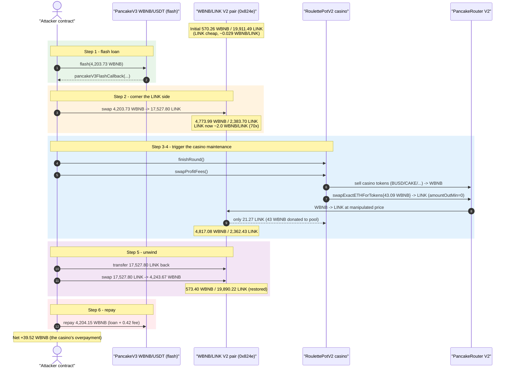
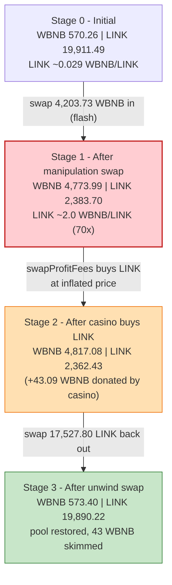
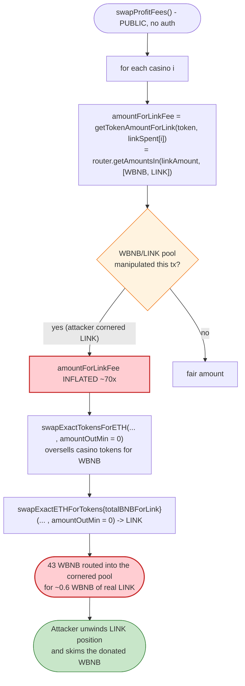

# RoulettePotV2 Exploit — Permissionless `swapProfitFees()` Drained Through a Manipulated WBNB/LINK Spot Price

> **Reproduction:** the PoC compiles & runs in an isolated Foundry project at
> [this project folder](.) (the umbrella DeFiHackLabs repo contains many unrelated PoCs that do
> not all compile together, so this one was extracted).
> Full verbose trace: [output.txt](output.txt).
> Verified vulnerable source: [contracts_Roulette_RouletteV2.sol](sources/RoulettePotV2_f57374/contracts_Roulette_RouletteV2.sol).

---

## Key info

| | |
|---|---|
| **Loss** | **39.52 WBNB ≈ $27.7K** (reported ~$28K) — extracted from the WBNB/LINK PancakeSwap V2 pool |
| **Vulnerable contract** | `RoulettePotV2` — [`0xf573748637E0576387289f1914627d716927F90f`](https://bscscan.com/address/0xf573748637E0576387289f1914627d716927F90f#code) |
| **Victim pool** | WBNB/LINK PancakeSwap V2 pair — [`0x824eb9faDFb377394430d2744fa7C42916DE3eCe`](https://bscscan.com/address/0x824eb9faDFb377394430d2744fa7C42916DE3eCe) (token0 = WBNB, token1 = LINK) |
| **Flash-loan source** | PancakeSwap **V3** WBNB/USDT pool — [`0x172fcD41E0913e95784454622d1c3724f546f849`](https://bscscan.com/address/0x172fcD41E0913e95784454622d1c3724f546f849) |
| **Attacker EOA** | [`0x0000000000004f3d8aaf9175fd824cb00ad4bf80`](https://bscscan.com/address/0x0000000000004f3d8aaf9175fd824cb00ad4bf80) |
| **Attacker contract** | [`0x000000000000bb1b11e5ac8099e92e366b64c133`](https://bscscan.com/address/0x000000000000bb1b11e5ac8099e92e366b64c133) |
| **Attack tx** | [`0xd9e0014a32d96cfc8b72864988a6e1664a9b6a2e90aeaa895fcd42da11cc3490`](https://bscscan.com/tx/0xd9e0014a32d96cfc8b72864988a6e1664a9b6a2e90aeaa895fcd42da11cc3490) |
| **Chain / block / date** | BSC / 45,668,285 / Jan 11, 2025 |
| **Compiler** | Solidity `>=0.8.0` (verified source compiled with 0.8.x) |
| **Bug class** | Spot-AMM price manipulation feeding a **permissionless** fee-swap (`getAmountsIn/Out` + `amountOutMin = 0`) |

---

## TL;DR

`RoulettePotV2.swapProfitFees()` is a **permissionless** maintenance function that converts the
casino's accumulated profit/fee tokens into BNB, then buys Chainlink **LINK** with part of that BNB
to top up its VRF subscription. To size the LINK purchase it asks PancakeSwap for live spot quotes
(`router.getAmountsIn(...)`, [:695](sources/RoulettePotV2_f57374/contracts_Roulette_RouletteV2.sol#L695))
and then executes the swaps with **`amountOutMin = 0`**
([:828-833](sources/RoulettePotV2_f57374/contracts_Roulette_RouletteV2.sol#L828-L833)). Both the
quote *and* the execution use the **same single-pool spot reserves** of the WBNB/LINK pair — which an
attacker controls within the transaction.

The attacker:

1. **Flash-borrows 4,203.73 WBNB** from a PancakeSwap V3 pool.
2. **Manipulates the WBNB/LINK pair** by swapping all 4,203.73 WBNB into LINK, draining LINK and
   making it artificially ~70× more expensive (the pool goes from 570 WBNB / 19,911 LINK to
   4,774 WBNB / 2,384 LINK).
3. **Calls `finishRound()` then `swapProfitFees()`** on the casino. The casino dumps its real
   token reserves for WBNB and then, because LINK now looks very expensive, **overpays 43.09 WBNB
   for only 21.27 LINK** — donating that 43 WBNB straight into the WBNB/LINK pool the attacker has
   cornered.
4. **Unwinds the position**: swaps the borrowed LINK back for WBNB, pulling out 4,243.67 WBNB —
   4,203.73 of its own capital **plus** the casino's donated WBNB.
5. **Repays the flash loan** (4,203.73 + 0.42 fee) and keeps the difference.

Net profit = **39.52 WBNB ≈ $27.7K**, sourced entirely from the casino's fee-swap being executed
against a price the attacker set inside the same transaction.

---

## Background — what RoulettePotV2 does

`RoulettePotV2`
([source](sources/RoulettePotV2_f57374/contracts_Roulette_RouletteV2.sol)) is an on-chain roulette
casino on BSC. Each "casino" (a tokenId) holds liquidity, takes bets, pays winners, and accrues
`profit` and a `fee`. Randomness comes from Chainlink VRF v2, which the contract must keep funded
with **LINK**.

Two relevant maintenance entry points are both **externally callable with no access control**:

- **`finishRound()`** ([:508](sources/RoulettePotV2_f57374/contracts_Roulette_RouletteV2.sol#L508))
  — settles all bets of the current round once the VRF request is fulfilled, updating each casino's
  `liquidity` / `locked` / `profit`.
- **`swapProfitFees()`** ([:753](sources/RoulettePotV2_f57374/contracts_Roulette_RouletteV2.sol#L753))
  — for every casino, swaps the available profit into BNB, splits it between "game" (→ BNBP token)
  and "LINK fee", buys LINK on PancakeSwap, peg-swaps it into ERC-677 LINK, and funds the VRF
  subscription.

To decide how much of the BNB should be spent buying LINK, the contract relies on PancakeSwap spot
quotes through the WBNB→LINK path. Those quotes read the **instantaneous reserves** of the single
WBNB/LINK pair — there is no TWAP, no Chainlink price feed, and no slippage floor.

On-chain facts at the fork block (read with `cast`):

| Parameter | Value |
|---|---|
| `linkPerBet` | `0.045 LINK` ([:54](sources/RoulettePotV2_f57374/contracts_Roulette_RouletteV2.sol#L54)) |
| WBNB/LINK pair reserves (initial) | **570.26 WBNB / 19,911.49 LINK** (1 WBNB ≈ 34.9 LINK) |
| Router | PancakeSwap V2 `0x10ED43C718714eb63d5aA57B78B54704E256024E` ([:48](sources/RoulettePotV2_f57374/contracts_Roulette_RouletteV2.sol#L48)) |
| LINK token | `0xF8A0BF9cF54Bb92F17374d9e9A321E6a111a51bD` ([:50](sources/RoulettePotV2_f57374/contracts_Roulette_RouletteV2.sol#L50)) |

---

## The vulnerable code

### 1. Sizing the LINK buy from a single-pool spot quote

```solidity
// :681-696
function getTokenAmountForLink(address tokenAddr, uint256 linkAmount) public view returns (uint256) {
    IPancakeRouter02 router = IPancakeRouter02(pancakeRouterAddr);
    address[] memory path;
    if (tokenAddr == address(0) || tokenAddr == wbnbAddr) {
        path = new address[](2);
        path[0] = wbnbAddr;
        path[1] = linkTokenAddr;
    } else { /* token -> wbnb -> link */ }
    return router.getAmountsIn(linkAmount, path)[0];   // ⚠️ live spot reserves of WBNB/LINK
}
```

`getAmountsIn(linkAmount, [WBNB, LINK])` answers "how much WBNB do I need to receive `linkAmount`
LINK?" using the **current** WBNB/LINK reserves. If an attacker has just made LINK scarce in that
pool, this returns a hugely inflated WBNB figure.
([source :681-696](sources/RoulettePotV2_f57374/contracts_Roulette_RouletteV2.sol#L681-L696))

### 2. Spending it with no slippage protection

```solidity
// :773-833 (swapProfitFees, condensed)
uint256 amountForLinkFee = getTokenAmountForLink(casinoInfo.tokenAddress, linkSpent[i]); // ⚠️ inflated
...
token.approve(address(router), gameFee + amountForLinkFee);
uint256[] memory swappedAmounts = router.swapExactTokensForETH(
    gameFee + amountForLinkFee,
    0,                                    // ⚠️ amountOutMin = 0
    path, address(this), block.timestamp
);
totalBNBForLink += (swappedAmounts[1] * amountForLinkFee) / (gameFee + amountForLinkFee);
...
// then, BNB -> LINK, again through the manipulated pool, again with amountOutMin = 0:
uint256 linkAmount = router.swapExactETHForTokens{ value: totalBNBForLink }(
    0,                                    // ⚠️ amountOutMin = 0
    path /* [WBNB, LINK] */, address(this), block.timestamp
)[1];
```

The function pulls more of the casino's tokens than it should (because `amountForLinkFee` was
inflated), converts them to BNB, and then spends that BNB buying LINK **into the same manipulated
pool** with `amountOutMin = 0`. Every WBNB the casino over-pays lands in the attacker's cornered
pool.
([source :753-863](sources/RoulettePotV2_f57374/contracts_Roulette_RouletteV2.sol#L753-L863))

### 3. There is no caller restriction

```solidity
function swapProfitFees() external { ... }   // :753 — anyone, anytime
function finishRound() external nonReentrant { ... } // :508 — anyone, once VRF is fulfilled
```

Neither function is `onlyOwner` / keeper-gated, so the attacker chooses the exact moment to trigger
the fee swap — i.e., the moment the WBNB/LINK pool is mis-priced.

---

## Root cause — why it was possible

A Uniswap-V2/PancakeSwap pair prices an asset purely from its instantaneous reserves. Reading that
price with `getAmountsIn` / `getAmountsOut` and then immediately trading against the **same pool**
is the textbook "spot price as oracle" mistake: the price you read and the price you trade at are
both attacker-controlled inside one transaction.

`swapProfitFees()` compounds three independent design faults that turn that mistake into free money:

1. **Single-pool spot oracle.** `getTokenAmountForLink` →
   `router.getAmountsIn(linkAmount, [WBNB, LINK])` reads only the WBNB/LINK pair's live reserves.
   There is no TWAP, no Chainlink feed, and no sanity bound on the returned amount.
2. **`amountOutMin = 0` everywhere.** Both `swapExactTokensForETH`
   ([:811-817](sources/RoulettePotV2_f57374/contracts_Roulette_RouletteV2.sol#L811-L817)) and
   `swapExactETHForTokens` ([:828-833](sources/RoulettePotV2_f57374/contracts_Roulette_RouletteV2.sol#L828-L833))
   accept any output. The contract willingly buys LINK at any price, so manipulation is never
   rejected.
3. **Permissionless trigger.** `swapProfitFees()` and `finishRound()` have no access control, so the
   attacker fires the mis-priced swap on demand, in the same atomic transaction that sets the price.

The economic effect: the casino is forced to buy LINK at ~2.03 WBNB/LINK while the real,
un-manipulated rate is ~0.029 WBNB/LINK — a ~70× overpayment. The overpaid WBNB is donated into the
WBNB/LINK pool, and because the attacker holds the matching (borrowed) LINK position, they extract
that donated WBNB when they unwind. The casino's real profit/fee tokens are the funding source.

---

## Preconditions

- The casino has a pending VRF round that is fulfilled (`isVRFPending == true`,
  `getRequestStatus(requestId).fulfilled == true`) so `finishRound()` succeeds
  ([:509-512](sources/RoulettePotV2_f57374/contracts_Roulette_RouletteV2.sol#L509-L512)). In the
  live attack this state already existed on-chain; the PoC forks the block where it held.
- At least one casino has positive `profit`/`liquidity` and accrued `linkSpent`, so
  `swapProfitFees()` actually sells tokens and buys LINK.
- A flash-loan source for WBNB to corner the WBNB/LINK pool — here PancakeSwap V3's WBNB/USDT pool
  `0x172f…`. Peak outlay (4,203.73 WBNB) is fully recovered intra-transaction, so the attack is
  **flash-loanable** with zero starting capital.

---

## Attack walkthrough (with on-chain numbers from the trace)

The WBNB/LINK pair has `token0 = WBNB`, `token1 = LINK`. All figures are taken directly from the
`Sync` / `Swap` events and `getReserves` returns in [output.txt](output.txt).

| # | Step | WBNB reserve | LINK reserve | Effect |
|---|------|-------------:|-------------:|--------|
| 0 | **Initial** ([reserves](output.txt)) | 570.26 | 19,911.49 | Honest pool; LINK cheap (≈0.029 WBNB/LINK). |
| 1 | **Flash-borrow 4,203.73 WBNB** from PancakeV3 `0x172f…` ([test:47](test/RoulettePotV2_exp.sol#L47)) | — | — | Working capital, repaid at the end + 0.42 fee. |
| 2 | **Manipulate**: swap 4,203.73 WBNB → **17,527.80 LINK** on `0x824e…` ([output.txt L1614-L1615](output.txt)) | 4,773.99 | 2,383.70 | LINK made scarce; spot price ≈ **2.0 WBNB/LINK** (~70× inflated). |
| 3 | **`finishRound()`** ([:508](sources/RoulettePotV2_f57374/contracts_Roulette_RouletteV2.sol#L508), [output.txt L1621](output.txt)) | 4,773.99 | 2,383.70 | Settles bets; sets up casino `profit`/`linkSpent` to be swapped. |
| 4 | **`swapProfitFees()`** ([:753](sources/RoulettePotV2_f57374/contracts_Roulette_RouletteV2.sol#L753)) sells casino tokens (BUSD/CAKE/others) for WBNB, then buys LINK | — | — | Inflated `getAmountsIn` makes it route ~43 WBNB to LINK. |
| 4a | …`swapExactETHForTokens{value: 43.09 WBNB}` → only **21.27 LINK** ([output.txt L1880-L1906](output.txt)) | 4,817.08 | 2,362.43 | Casino **overpays 43.09 WBNB** (real value of 21.27 LINK ≈ 0.6 WBNB); 43 WBNB donated to the pool. |
| 5 | **Unwind**: transfer the 17,527.80 LINK back, swap LINK → **4,243.67 WBNB** ([output.txt L1974-L1992](output.txt)) | 573.40 | 19,890.22 | Attacker pulls out its capital **+** the donated WBNB. |
| 6 | **Repay flash loan** 4,203.73 + 0.42 fee = 4,204.15 WBNB ([output.txt L1996-L2007](output.txt)) | — | — | Loan closed. |

The pool ends almost exactly where it started (573.40 WBNB / 19,890.22 LINK) — the only net change
is the 43 WBNB the casino donated, minus the round-trip swap fees, which is what the attacker
walks away with.

### Why the casino over-pays for LINK

`getTokenAmountForLink` / the BNB→LINK leg both price LINK off the cornered pool:

- Real rate (initial reserves): `570.26 / 19,911.49 ≈ 0.0286 WBNB/LINK`.
- Manipulated rate (step 2 reserves): `4,773.99 / 2,383.70 ≈ 2.00 WBNB/LINK`.

So the contract believes LINK is ~70× more valuable than it is, routes ~43 WBNB of casino value into
buying a token worth ≈0.6 WBNB, and the surplus 42+ WBNB is the prize.

### Profit accounting (WBNB)

| Direction | Amount (WBNB) |
|---|---:|
| Borrowed (flash) | 4,203.73 |
| Spent — manipulation swap (WBNB → LINK) | 4,203.73 |
| Received — unwind swap (LINK → WBNB) | 4,243.67 |
| **Gross pool round-trip** | **+39.94** |
| Flash-loan fee (0.01%) | −0.42 |
| **Net profit** | **+39.52 WBNB ≈ $27.7K** |

The PoC's `balanceLog` confirms the attacker contract goes from **0 → 39.52 WBNB**
([output.txt L1574-L1575](output.txt)), reconciling to the wei with the trace math above.

---

## Diagrams

### Sequence of the attack



### Pool state evolution



### The flaw inside `swapProfitFees`



---

## Remediation

1. **Do not use a single AMM pool's spot price as an oracle.** Replace
   `router.getAmountsIn/Out` over the WBNB/LINK pair with a manipulation-resistant source — a
   Chainlink LINK/BNB price feed (ironic but apt here, since the contract already integrates
   Chainlink VRF), or a multi-block TWAP.
2. **Never swap with `amountOutMin = 0`.** Compute a minimum-out from the trusted oracle price with a
   tight slippage tolerance, and let the swap revert if the pool is off-market. This alone makes the
   manipulation unprofitable.
3. **Gate the maintenance functions.** `swapProfitFees()` (and ideally `finishRound()`) should be
   restricted to a trusted keeper/relayer, or at least protected so they cannot be invoked inside an
   attacker-controlled atomic transaction that has just moved the price.
4. **Cap per-call LINK spend.** The LINK top-up is bounded by `linkSpent` (a small per-bet quantity);
   bound `amountForLinkFee` to a sane absolute ceiling so a bad quote cannot route an arbitrarily
   large amount of casino value into the swap.
5. **Settle and convert separately.** Decouple round settlement from treasury conversion so that the
   value-moving swap path is not reachable as a side effect of permissionless settlement.

---

## How to reproduce

The PoC was extracted into a standalone Foundry project (the umbrella DeFiHackLabs repo does not
build as a whole under `forge test`):

```bash
_shared/run_poc.sh 2025-01-RoulettePotV2_exp -vvvvv
```

- RPC: a **BSC archive** endpoint is required (fork block 45,668,285). `foundry.toml` uses
  `https://bsc-mainnet.public.blastapi.io`, which serves historical state at that block; most public
  BSC RPCs prune it and fail with `header not found` / `missing trie node`.
- Result: `[PASS] testExploit()`, attacker WBNB balance **0 → 39.521593515709821513**.

Expected tail:

```
  Attacker Before exploit WBNB Balance: 0.000000000000000000
  Attacker After exploit WBNB Balance: 39.521593515709821513

Suite result: ok. 1 passed; 0 failed; 0 skipped
Ran 1 test suite ...: 1 tests passed, 0 failed, 0 skipped (1 total tests)
```

---

*References: TenArmor alert — https://x.com/TenArmorAlert/status/1878008055717376068 ; SlowMist Hacked DB (RoulettePotV2, BSC, ~$28K).*
