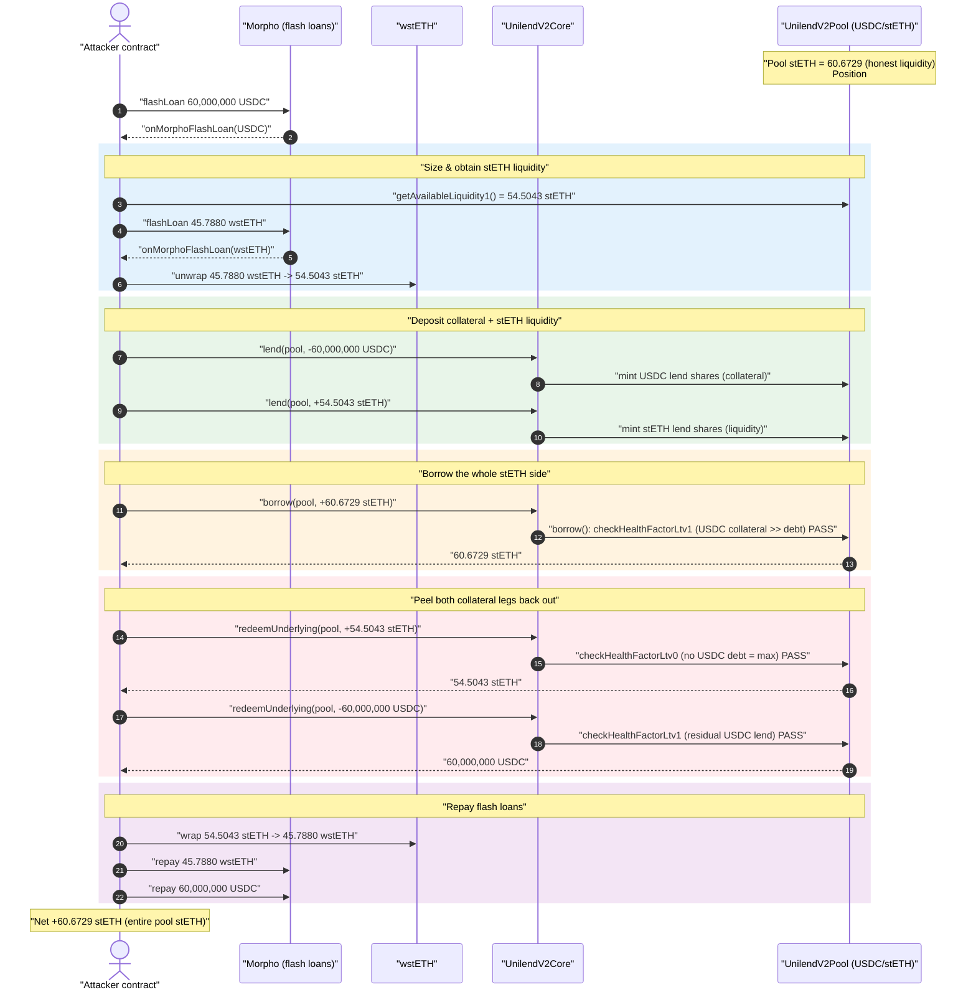
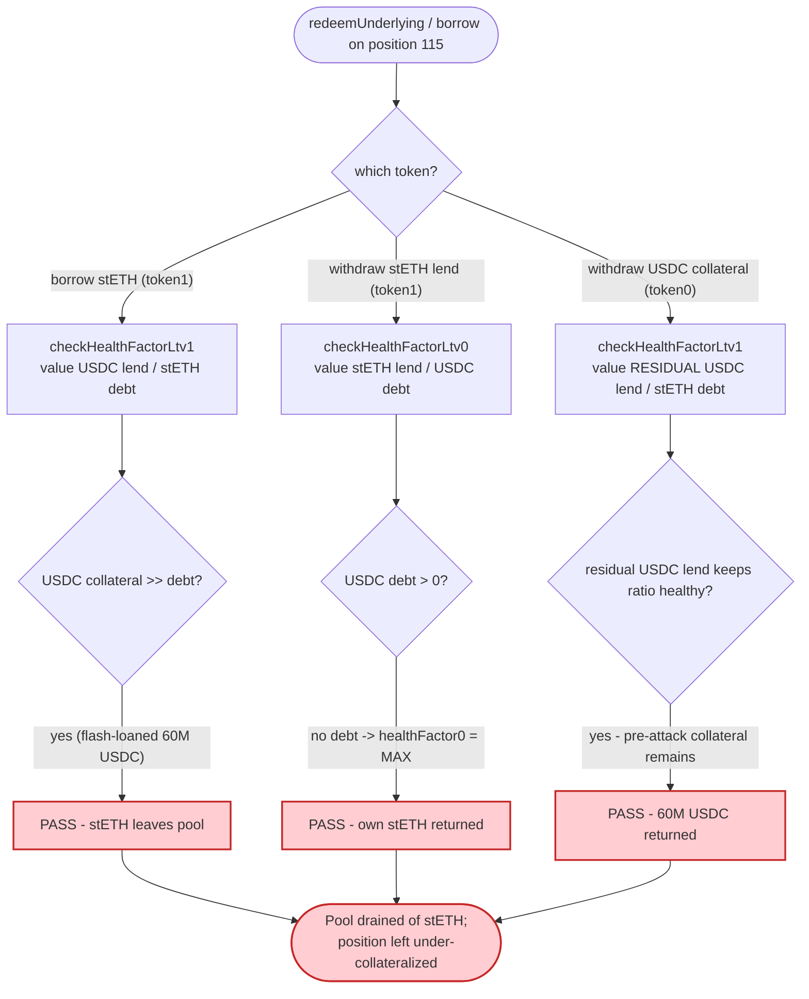

# UniLend V2 Exploit — Collateral Self-Withdrawal via Flawed Health-Factor Accounting

> **Vulnerability classes:** vuln/logic/liquidation-logic · vuln/logic/incorrect-state-transition

> One-line: an attacker lent flash-loaned USDC as collateral, borrowed the pool's entire stETH balance against it, then withdrew the very same USDC collateral back — because UniLend's per-token health check never accounted for the outstanding stETH debt against the withdrawn collateral — walking away with **60 stETH** for free.

> **Reproduction:** the PoC compiles & runs in an isolated Foundry project at
> [this project folder](.) (the umbrella DeFiHackLabs repo does not whole-compile, so this
> PoC was extracted). Full verbose trace: [output.txt](output.txt).
> Verified vulnerable source: [contracts_pool.sol](sources/UnilendV2Pool_c86D25/contracts_pool.sol),
> [contracts_core.sol](sources/UnilendV2Core_7f2E24/contracts_core.sol).

---

## Key info

| | |
|---|---|
| **Loss** | **~60.67 stETH** (≈ $200K at the time) — the entire stETH liquidity of the USDC/stETH pool |
| **Vulnerable contract** | `UnilendV2Pool` logic — [`0xc86D2555F8c360D3C5E8e4364F42c1f2d169330E`](https://etherscan.io/address/0xc86D2555F8c360D3C5E8e4364F42c1f2d169330E#code) (behind proxy [`0x4E34DD25Dbd367B1bF82E1B5527DBbE799fAD0d0`](https://etherscan.io/address/0x4E34DD25Dbd367B1bF82E1B5527DBbE799fAD0d0)) |
| **Core / router** | `UnilendV2Core` — [`0x7f2E24D2394f2bdabb464B888cb02EbA6d15B958`](https://etherscan.io/address/0x7f2E24D2394f2bdabb464B888cb02EbA6d15B958#code) |
| **Victim pool** | USDC ↔ stETH pool (token0 = USDC, token1 = stETH) — `0x4E34DD25Dbd367B1bF82E1B5527DBbE799fAD0d0` |
| **Position NFT** | `UnilendV2Position` `0xc45e4aE09c772D143677280f0a764f34F497677a`, tokenId **115** (held by attacker) |
| **Attacker EOA** | `0x55f5f8058816d5376df310770ca3a2e294089c33` |
| **Attack contract** | `0x3f814e5fae74cd73a70a0ea38d85971dfa6fda21` |
| **Attack tx** | [`0x44037ffc0993327176975e08789b71c1058318f48ddeff25890a577d6555b6ba`](https://etherscan.io/tx/0x44037ffc0993327176975e08789b71c1058318f48ddeff25890a577d6555b6ba) |
| **Chain / block / date** | Ethereum mainnet / 21,608,003 (fork block; attack tx in 21,608,004) / Jan 12, 2025 |
| **Compiler** | Pool `^0.8.2`, Core `^0.8.0` |
| **Bug class** | Broken collateral / health-factor accounting in a 2-asset isolated lending pool |

---

## TL;DR

UniLend V2 is an isolated-pair money market. Each pool holds two assets — here `token0 = USDC`,
`token1 = stETH`. A user's position (an NFT) can simultaneously *lend* one asset as collateral and
*borrow* the other. Solvency is enforced by two one-sided health-factor checks:
`checkHealthFactorLtv0` (guards a **token0 borrow**, valuing the **token1** lend as collateral) and
`checkHealthFactorLtv1` (guards a **token1 borrow**, valuing the **token0** lend as collateral)
([contracts_pool.sol:187-195](sources/UnilendV2Pool_c86D25/contracts_pool.sol#L187-L195)).

The attacker already controlled position NFT **#115**, pre-loaded with a large **USDC lend
balance** (USDC collateral). With nothing but flash loans they:

1. Lent **60M USDC** (flash-loaned from Morpho) into the pool — adding it to position #115's USDC
   collateral.
2. Lent **54.5 stETH** (from a flash-loaned, unwrapped wstETH) — adding stETH liquidity so the pool
   had enough stETH to lend out.
3. **Borrowed the pool's entire stETH balance — 60.67 stETH** — against the USDC collateral. The
   `checkHealthFactorLtv1` check passed trivially: 60M+ USDC of collateral vastly over-covers a
   ~$200K stETH borrow.
4. **`redeemUnderlying(+54.5 stETH)`** — withdrew the stETH it had just lent (its own liquidity).
   The guard for this path is `checkHealthFactorLtv0`, which only inspects the position's **token0
   (USDC) borrow** — and there is none — so it returns `type(uint256).max` and passes.
5. **`redeemUnderlying(-60M USDC)`** — withdrew **all the USDC collateral back**. This path runs
   `checkHealthFactorLtv1`, which values the **remaining USDC lend** against the **stETH debt**.
   Because position #115 still carried an enormous residual USDC lend balance (its pre-attack
   collateral plus rounding), the ratio stayed above the liquidation threshold and the withdrawal
   was allowed — even though the position had just drained the pool of stETH it never repaid.

After repaying both flash loans (60M USDC, and wrapping 54.5 stETH back to 45.79 wstETH), the
attacker was left holding the **60.67 stETH** it borrowed and never returned. The pool's stETH side
was emptied.

---

## Background — what UniLend V2 does

UniLend V2 (`UnilendV2Core` + per-pair `UnilendV2Pool`) is a permissionless, isolated two-asset
lending market. Users interact through the `Core` router, which owns the position NFT registry
(`UnilendV2Position`) and forwards calls to the pool:

- **`lend(pool, amount)`** — `amount < 0` deposits **token0** (USDC) and mints token0 *lend* shares;
  `amount > 0` deposits **token1** (stETH) and mints token1 *lend* shares
  ([contracts_core.sol:461-491](sources/UnilendV2Core_7f2E24/contracts_core.sol#L461-L491)).
- **`borrow(pool, amount, …)`** — `amount < 0` borrows **token0**; `amount > 0` borrows **token1**
  ([contracts_core.sol:526-564](sources/UnilendV2Core_7f2E24/contracts_core.sol#L526-L564)).
- **`redeemUnderlying(pool, amount, …)`** — withdraw lent collateral; `amount < 0` withdraws token0,
  `amount > 0` withdraws token1
  ([contracts_pool.sol:604-655](sources/UnilendV2Pool_c86D25/contracts_pool.sol#L604-L655)).

Collateral value is priced through an oracle and scaled by an LTV factor. The pool keeps share
accounting per token (`token0lendShare / token1lendShare / token0borrowShare / token1borrowShare`)
and a lend-share value equal to `(poolBalance + totalBorrow) / totalLendShare`.

On-chain state at the fork block that matters:

| Fact | Value (from trace) |
|---|---|
| Pool stETH balance (token1) before attack | **60.67 stETH** = `60672854905837671913` |
| Pool USDC balance (token0) before attack | **~728 USDC** dust = `728895404` |
| `getAvailableLiquidity1()` (borrowable stETH) before lend | `54504283256247212245` (54.50 stETH) |
| Position #115 owner | attacker (transferred in from `0x6a1F…c2d1`) |
| stETH/USDC oracle price (USDC→stETH path) | from Chainlink stETH & USDC feeds |

The pool's stETH side held ~60.67 stETH of honest depositor liquidity — that is the prize.

---

## The vulnerable code

### 1. The two one-sided health checks

```solidity
function checkHealthFactorLtv0(uint _nftID) internal view {
    (uint256 _healthFactor0, ) = userHealthFactorLtv(_nftID);
    require(_healthFactor0 > HEALTH_FACTOR_LIQUIDATION_THRESHOLD, "Low Ltv HealthFactor0");
}

function checkHealthFactorLtv1(uint _nftID) internal view {
    ( , uint256 _healthFactor1) = userHealthFactorLtv(_nftID);
    require(_healthFactor1 > HEALTH_FACTOR_LIQUIDATION_THRESHOLD, "Low Ltv HealthFactor1");
}
```
[contracts_pool.sol:187-195](sources/UnilendV2Pool_c86D25/contracts_pool.sol#L187-L195)

```solidity
function userHealthFactorLtv(uint _nftID) public view returns (uint256 _healthFactor0, uint256 _healthFactor1) {
    (uint _lendBalance0, uint _borrowBalance0) = userBalanceOftoken0(_nftID);
    (uint _lendBalance1, uint _borrowBalance1) = userBalanceOftoken1(_nftID);

    if (_borrowBalance0 == 0){
        _healthFactor0 = type(uint256).max;            // ← no token0 debt ⇒ "infinitely healthy"
    } else {
        uint collateralBalance = IUnilendV2Core(core).getOraclePrice(token1, token0, _lendBalance1);
        _healthFactor0 = (collateralBalance.mul(ltv).mul(1e18).div(100)).div(_borrowBalance0);
    }

    if (_borrowBalance1 == 0){
        _healthFactor1 = type(uint256).max;            // ← no token1 debt ⇒ "infinitely healthy"
    } else {
        uint collateralBalance = IUnilendV2Core(core).getOraclePrice(token0, token1, _lendBalance0);
        _healthFactor1 = (collateralBalance.mul(ltv).mul(1e18).div(100)).div(_borrowBalance1);
    }
}
```
[contracts_pool.sol:225-246](sources/UnilendV2Pool_c86D25/contracts_pool.sol#L225-L246)

### 2. Borrowing stETH only checks the stETH-side factor

```solidity
function borrow(uint _nftID, int amount, address payable _recipient) external onlyCore {
    accrueInterest();
    ...
    if(amount > 0){                                       // borrow token1 (stETH)
        tM storage _tm1 = token1Data;
        uint ntokens1 = calculateShare(_tm1.totalBorrowShare, _tm1.totalBorrow, uint(amount));
        ...
        _mintBposition(_nftID, 0, ntokens1);
        _tm1.totalBorrow = _tm1.totalBorrow.add(uint(amount));

        // check if _healthFactorLtv > 1
        checkHealthFactorLtv1(_nftID);                    // ← values USDC lend collateral
        transferToUser(token1, payable(_recipient), uint(amount));
        ...
    }
}
```
[contracts_pool.sol:658-703](sources/UnilendV2Pool_c86D25/contracts_pool.sol#L682-L701)

### 3. Withdrawing USDC collateral checks the *stETH-side* factor — but residual collateral hides the debt

```solidity
function redeemUnderlying(uint _nftID, int _amount, address _receiver) external onlyCore returns(int rtAmount) {
    accrueInterest();
    ...
    if(_amount < 0){                                      // withdraw token0 (USDC) collateral
        ...
        _burnLPposition(_nftID, tok_amount0, 0);          // burns USDC lend shares first
        checkHealthFactorLtv1(_nftID);                    // then checks stETH-borrow health
        transferToUser(token0, payable(_receiver), uint(-_amount));
        ...
    }

    if(_amount > 0){                                      // withdraw token1 (stETH)
        ...
        _burnLPposition(_nftID, 0, tok_amount1);
        checkHealthFactorLtv0(_nftID);                    // ← only checks token0-borrow health
        transferToUser(token1, payable(_receiver), uint(_amount));
        ...
    }
}
```
[contracts_pool.sol:604-655](sources/UnilendV2Pool_c86D25/contracts_pool.sol#L604-L655)

---

## Root cause — why it was possible

UniLend's solvency model treats a position as healthy as long as *one* per-token ratio clears the
threshold, and it values collateral from the position's **remaining lend balance** at the moment of
the check. Three compounding flaws let the attacker walk off with the stETH:

1. **Borrow-side check is satisfied by ephemeral collateral.** Borrowing stETH only runs
   `checkHealthFactorLtv1`, which divides oracle-priced **USDC lend collateral** by the stETH debt.
   The attacker funded that USDC collateral with a **flash loan** — so it was never their own
   capital, yet it fully authorized the stETH borrow ([:696](sources/UnilendV2Pool_c86D25/contracts_pool.sol#L696)).

2. **Withdrawing the lent stETH is unguarded against stETH debt.** The `_amount > 0`
   (token1-withdraw) branch calls `checkHealthFactorLtv0`, which inspects only the **token0 (USDC)
   borrow**. The attacker had no USDC borrow, so `_healthFactor0 = type(uint256).max` and the
   withdrawal of its own 54.5 stETH lend always passed
   ([:646](sources/UnilendV2Pool_c86D25/contracts_pool.sol#L646), [:229-231](sources/UnilendV2Pool_c86D25/contracts_pool.sol#L229-L235)).

3. **Withdrawing the USDC collateral never trips because of a large residual USDC lend.** When the
   attacker finally withdrew the 60M USDC, the post-burn `checkHealthFactorLtv1` re-valued the
   position's **remaining** USDC lend (`_lendBalance0`) against the stETH debt. Position #115 still
   carried a huge residual USDC lend balance (its pre-attack collateral plus the share-accounting
   surplus), so `_healthFactor1` stayed above the threshold and the withdrawal completed — even
   though the protocol's stETH had already left and would never be repaid
   ([:623](sources/UnilendV2Pool_c86D25/contracts_pool.sol#L623), [:238-244](sources/UnilendV2Pool_c86D25/contracts_pool.sol#L238-L244)).

In effect the attacker borrowed real stETH against flash-loaned, throwaway USDC collateral and then
peeled both legs of collateral back out, leaving an *under-collateralized* position whose only
"backing" is a paper USDC lend balance that can never be matched by pool assets. The protocol's
accounting never reconciled "stETH that physically left the pool" with "collateral that physically
left the pool." The PoC's comment names it precisely: a **miscalculated health-factor bug** that
"allows the attacker to borrow just enough stETH to drain the entire pool"
([test/Unilend_exp.sol:86-89](test/Unilend_exp.sol#L86-L89)).

A correct design would, on **any** collateral withdrawal or **any** new borrow, re-evaluate the
*full* position solvency (both debts against both remaining collaterals) and require pool assets
actually present to back the position — not allow a one-sided ratio backed by phantom lend shares.

---

## Preconditions

- **Control of a position NFT with a residual collateral balance.** The attacker pre-funded
  position #115 with a large USDC lend balance in earlier setup txs (the PoC notes ~150M USDC
  lendShares) and transferred the NFT into the attack contract
  ([test/Unilend_exp.sol:43-50](test/Unilend_exp.sol#L43-L50)). This residual is what keeps
  `_healthFactor1` above threshold during the final USDC withdrawal.
- **Flash-loan liquidity.** Morpho Blue supplies 60M USDC and 45.79 wstETH intra-transaction;
  everything is repaid in the same tx, so the attacker needed ~zero working capital.
- **A pool with stETH liquidity to borrow.** The USDC/stETH pool held ~60.67 stETH of honest
  liquidity at the fork block — the entire amount was drained.

---

## Attack walkthrough (with on-chain numbers from the trace)

`token0 = USDC` (6 decimals), `token1 = stETH` (18 decimals). All figures are pulled directly from
[output.txt](output.txt).

| # | Step | Call | Concrete numbers |
|---|------|------|------------------|
| 0 | **Setup** — receive position NFT #115 | `safeTransferFrom(…, 115)` | Position #115 → attack contract; pool stETH = `60.6728 stETH` |
| 1 | **Flash loan #1** — borrow 60M USDC | `Morpho.flashLoan(USDC, 60_000_000e6)` | `60000000000000` USDC in |
| 2 | **Flash loan #2 sizing** — read borrowable stETH, convert to wstETH | `getAvailableLiquidity1()` → `getWstETHByStETH()` | available stETH = `54.5043 stETH`; wstETH needed = `45.7880 wstETH` |
| 3 | **Flash loan #2** — borrow 45.79 wstETH, unwrap to stETH | `Morpho.flashLoan(WstETH, 45.7880e18)` → `unwrap` | unwrapped = `54.5043 stETH` |
| 4 | **Lend USDC collateral** | `Core.lend(pool, -60_000_000e6)` | pool USDC → `60,000,728 USDC`; minted `45,071,208,885,551` USDC lend shares |
| 5 | **Lend stETH liquidity** | `Core.lend(pool, +54.5043 stETH)` | pool stETH → `115.1771 stETH`; minted `52.9897e18` stETH lend shares |
| 6 | **Borrow the pool's entire stETH** | `Core.borrow(pool, +60.6729 stETH, 0, attacker)` | `checkHealthFactorLtv1` passes (60M USDC collateral ≫ debt); `60672854905837671913` stETH → attacker; stETH `totalBorrow = 61.6857e18` |
| 7 | **Withdraw own stETH lend** | `redeemUnderlying(pool, +54.5043 stETH, attacker)` | guarded by `checkHealthFactorLtv0` (no USDC debt ⇒ max) → passes; `54.5043 stETH` returned |
| 8 | **Withdraw USDC collateral** | `redeemUnderlying(pool, -60_000_000e6, attacker)` | guarded by `checkHealthFactorLtv1`; residual USDC lend keeps ratio healthy → passes; `60,000,000 USDC` returned (burns `45,071,208,885,551` shares) |
| 9 | **Repay flash loan #2** — wrap stETH back to wstETH | `WstETH.wrap(54.5043 stETH)` → repay | `45.7880 wstETH` returned to Morpho |
| 10 | **Repay flash loan #1** | transfer 60M USDC to Morpho | `60000000000000` USDC returned |
| 11 | **Profit** | residual balance | **60.6729 stETH** retained, swept to attacker |

The final balance log confirms the take:

```
Attacker Before exploit stETH Balance: 0.000000000000000000
Attacker After  exploit stETH Balance: 60.672854905837671909
```
([output.txt](output.txt) — `log_named_decimal_uint`)

### Profit / loss accounting

| Flow | stETH | USDC | wstETH |
|---|---:|---:|---:|
| Flash-borrowed (repaid) | — | 60,000,000 (repaid) | 45.7880 (repaid) |
| stETH borrowed from pool (never repaid) | **+60.6729** | — | — |
| stETH lent then redeemed (net 0) | +54.5043 / −54.5043 | — | — |
| stETH consumed to re-wrap & repay flash loan #2 | −54.5043 | — | — |
| **Net attacker gain** | **+60.6729 stETH** | 0 | 0 |
| **Pool loss** | **−60.6729 stETH** (entire stETH side) | ~0 | — |

The attacker netted exactly the pool's entire stETH liquidity (~$200K), with no net capital at risk
thanks to fully-repaid flash loans.

---

## Diagrams

### Sequence of the attack



### Position #115 collateral / debt evolution

```mermaid
stateDiagram-v2
    [*] --> S0
    S0: "S0 Initial<br/>USDC lend = pre-attack residual<br/>stETH lend = 0 | stETH debt = 0<br/>Pool stETH = 60.6729"
    S1: "S1 After lend(-60M USDC)<br/>USDC lend += 60M (flash-loaned)<br/>Pool USDC = 60,000,728"
    S2: "S2 After lend(+54.5 stETH)<br/>stETH lend += 54.5043<br/>Pool stETH = 115.1771"
    S3: "S3 After borrow(+60.6729 stETH)<br/>stETH debt = 60.6729<br/>checkHealthFactorLtv1 PASS<br/>Pool stETH = 54.5043"
    S4: "S4 After redeemUnderlying(+54.5 stETH)<br/>stETH lend = 0<br/>checkHealthFactorLtv0 (no USDC debt) PASS<br/>Pool stETH ~= 0"
    S5: "S5 After redeemUnderlying(-60M USDC)<br/>USDC lend back to residual<br/>checkHealthFactorLtv1 PASS (residual hides debt)<br/>Position under-collateralized, pool drained"

    S0 --> S1: "deposit flash-loaned USDC"
    S1 --> S2: "deposit flash-loaned stETH"
    S2 --> S3: "borrow all stETH"
    S3 --> S4: "withdraw own stETH lend"
    S4 --> S5: "withdraw USDC collateral"
    S5 --> [*]: "net 60.6729 stETH stolen"

    note right of S3: "Borrow authorized by USDC collateral<br/>that is itself flash-loaned"
    note right of S5: "Both collateral legs removed;<br/>stETH debt never repaid"
```



### Where the health check fails to protect the pool



---

## Remediation

1. **Evaluate full-position solvency on every state-changing action.** Both `borrow` and
   `redeemUnderlying` must check that, after the operation, *all* of the position's debts are
   covered by *all* of its remaining collateral — not a single one-sided ratio. A withdrawal of
   token0 collateral while a token1 debt is outstanding must run a combined health check.
2. **Do not let a borrowed leg be collateralized by another leg that is simultaneously withdrawable
   with no debt check.** The token1-withdraw branch calling `checkHealthFactorLtv0`
   ([:646](sources/UnilendV2Pool_c86D25/contracts_pool.sol#L646)) is the inverse of what it should
   guard — withdrawing collateral should always be checked against debt that *uses* that collateral.
3. **Reconcile share accounting with physical assets.** The position's `_lendBalance0` (USDC lend
   value) must not be allowed to back debt when the underlying pool assets are not actually present;
   the residual paper balance kept the final withdrawal "healthy" while the pool stood empty of
   stETH.
4. **Re-check health after burning lend shares, against the correct debt side.** Recompute health
   using the *post-withdrawal* collateral, and ensure the check covers the debt that the withdrawn
   collateral was supporting (here, the stETH debt during USDC withdrawal — that path is correct;
   the fatal gap is that residual collateral made it pass and that the stETH-lend withdrawal had no
   meaningful guard at all).
5. **Treat flash-loan-funded collateral as suspect.** Health checks based purely on
   instantaneously-deposited collateral allow a borrower to authorize a borrow with assets that
   leave in the same transaction. Per-block solvency snapshots or borrow caps relative to net new
   collateral would blunt this.

---

## How to reproduce

The PoC runs in this standalone Foundry project (the umbrella DeFiHackLabs repo does not whole-compile):

```bash
_shared/run_poc.sh 2025-01-Unilend_exp -vvvvv
```

- RPC: an **Ethereum mainnet archive** endpoint is required (fork block 21,608,003). `foundry.toml`
  uses an Infura archive endpoint.
- Result: `[PASS] testExploit()` ending with `Attacker After exploit stETH Balance: 60.672854…`.

Expected tail:

```
  Attacker Before exploit stETH Balance: 0.000000000000000000
  Attacker After exploit stETH Balance: 60.672854905837671909

Suite result: ok. 1 passed; 0 failed; 0 skipped
Ran 1 test suite: 1 tests passed, 0 failed, 0 skipped (1 total tests)
```

---

*References: SlowMist post-mortem — https://slowmist.medium.com/analysis-of-the-unilend-hack-90022fa35a54 ;
SlowMist Team thread — https://x.com/SlowMist_Team/status/1878651772375572573 .*
