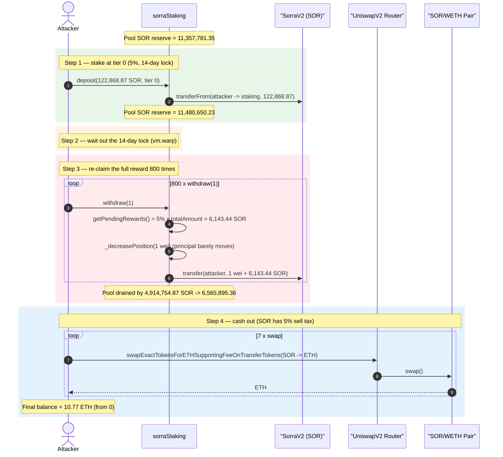
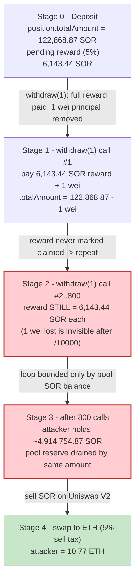
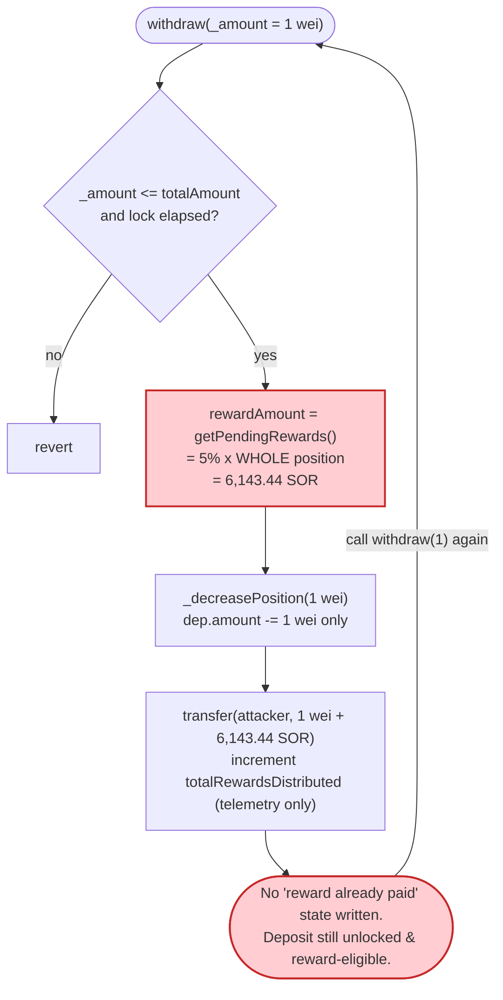

# Sorra Staking Exploit — Reward Recomputed In Full On Every Partial `withdraw`

> One-line summary: `sorraStaking.withdraw()` pays the position's **entire** pending reward on
> every call while only decrementing the principal you ask to withdraw, so withdrawing **1 wei**
> at a time lets an attacker re-claim the full reward hundreds of times and drain the reward pool.

> **Reproduction:** the PoC compiles & runs in an isolated Foundry project at
> [this project folder](.) (the umbrella DeFiHackLabs repo contains many unrelated PoCs that do not
> compile together, so this one was extracted).
> Full verbose trace: [output.txt](output.txt).
> Verified vulnerable source: [contracts_sorraStaking.sol](sources/sorraStaking_5d16b8/contracts_sorraStaking.sol).

---

## Key info

| | |
|---|---|
| **Loss** | **~8 ETH** across the victim's three deposit/attack cycles (PoC header: 4.8 + 2.4 + 0.8 ETH). The single reproduced cycle drains **4,914,754.87 SOR** from the staking pool, swapped to **≈10.77 ETH** after the token's 5% sell tax. |
| **Vulnerable contract** | `sorraStaking` — [`0x5d16b8Ba2a9a4ECA6126635a6FFbF05b52727d50`](https://etherscan.io/address/0x5d16b8Ba2a9a4ECA6126635a6FFbF05b52727d50#code) |
| **Reward / staked token** | `SorraV2` (SOR) — [`0xE021bAa5b70C62A9ab2468490D3f8ce0AfDd88dF`](https://etherscan.io/address/0xE021bAa5b70C62A9ab2468490D3f8ce0AfDd88dF#code) |
| **Victim** | The staking pool's reward reserve (held by `sorraStaking`; ~11.48M SOR after the attacker's deposit) |
| **Attacker EOA / contract** | PoC uses `ContractTest` `0x7FA9385bE102ac3EAc297483Dd6233D62b3e1496` (see attribution note below) |
| **Deposit tx** | [`0x72a252277e30ea6a37d2dc9905c280f3bc389b87f72b81a59aa8f50baebd8eaa`](https://etherscan.io/tx/0x72a252277e30ea6a37d2dc9905c280f3bc389b87f72b81a59aa8f50baebd8eaa) |
| **Attack tx** | [`0x6439d63cc57fb68a32ea8ffd8f02496e8abad67292be94904c0b47a4d14ce90d`](https://etherscan.io/tx/0x6439d63cc57fb68a32ea8ffd8f02496e8abad67292be94904c0b47a4d14ce90d) |
| **Chain / block / date** | Ethereum mainnet / fork at **21,450,734** / early January 2025 |
| **Compiler** | `sorraStaking` Solidity **v0.8.20** (optimizer); `SorraV2` v0.8.19 |
| **Bug class** | Broken accounting — reward computed on full principal but principal decremented per-call (re-claim / over-distribution) |

> Attribution: TenArmor flagged the incident ([tweet](https://x.com/TenArmorAlert/status/1875582709512188394)).
> Note that the deposit and attack are **separate transactions** (the attacker had to wait out the
> 14-day lock), so this is a patient, multi-day exploit rather than a single-tx flash attack.

---

## TL;DR

`sorraStaking` lets a user stake SOR in a tier (tier 0 = 14-day lock, **5% reward**) and later
`withdraw(_amount)` their principal plus a vesting reward. The reward is computed by
`getPendingRewards()` from the position's **entire** `totalAmount`
([:213-218](sources/sorraStaking_5d16b8/contracts_sorraStaking.sol#L213-L218)) — not from the amount
being withdrawn — and is paid out **in full** on every successful `withdraw` call
([:118-126](sources/sorraStaking_5d16b8/contracts_sorraStaking.sol#L118-L126)). There is no
"already claimed" bookkeeping that reduces future rewards.

Because `withdraw(1)` only removes **1 wei** of principal from the position but pays the full
`5% × totalAmount` reward, the attacker simply:

1. Deposits **122,868.87 SOR** at tier 0 (5%).
2. Waits 14 days (lock expires).
3. Calls `withdraw(1)` in a loop. Each call pays **6,143.44 SOR** (5% of 122,868.87) and only
   shrinks the principal by 1 wei, so the reward stays essentially constant.
4. After **800** iterations the attacker has pulled **4,914,754.87 SOR** out of the pool — far more
   than the genuine reward — and swaps it to **≈10.77 ETH** on Uniswap V2.

The principal would have to be withdrawn `122,868.87 × 1e18` times before the reward would drop, so
the loop is bounded only by how much reward SOR the pool holds.

---

## Background — what Sorra Staking does

`sorraStaking` ([source](sources/sorraStaking_5d16b8/contracts_sorraStaking.sol)) is a single-token
staking vault for the SOR token. Both the staked asset and the reward asset are the same token
(`rewardToken`). It defines three vesting tiers in the constructor
([:74-82](sources/sorraStaking_5d16b8/contracts_sorraStaking.sol#L74-L82)):

| Tier | Lock period | Reward (bps) |
|---|---|---|
| 0 | 14 days | 500 = **5%** |
| 1 | 30 days | 2000 = 20% |
| 2 | 60 days | 4000 = 40% |

A user's `Position` holds an array of `Deposit`s and a `totalAmount`
([:30-43](sources/sorraStaking_5d16b8/contracts_sorraStaking.sol#L30-L43)). When the lock period
on a deposit elapses, the deposit becomes both *withdrawable* (principal returnable) and
*reward-eligible* (`reward = amount × rewardBps / 10000`).

On-chain state at the fork block (read from the trace):

| Parameter | Value |
|---|---|
| Attacker SOR balance (dealt) | 122,868.871710593438486048 SOR |
| Deposit tier | 0 (5%, 14-day lock) |
| Pool SOR reserve **before** deposit | 11,357,781.35 SOR |
| Pool SOR reserve **after** deposit | 11,480,650.23 SOR |
| Reward per `withdraw` call | **6,143.44 SOR** (= 5% × 122,868.87) |
| Withdraw calls made | **800** |

The whole game: the reward is a flat 5% of the *position*, recomputed and **fully re-paid** on every
withdraw, while only the requested `_amount` (1 wei) leaves the position.

---

## The vulnerable code

### 1. `withdraw` pays the full position-level reward and only removes `_amount` of principal

```solidity
function withdraw(uint256 _amount) external nonReentrant {
    require(_amount > 0, "Amount must be greater than 0");
    Position storage position = positions[_msgSender()];
    require(_amount <= position.totalAmount, "Insufficient balance");

    uint256 withdrawableAmount = 0;
    for(uint256 i = 0; i < position.deposits.length; i++) {
        Deposit memory dep = position.deposits[i];
        if(block.timestamp > dep.depositTime + vestingTiers[dep.tier].period) {
            withdrawableAmount += dep.amount;
        }
    }
    require(withdrawableAmount >= _amount, "Lock period not finished");

    uint256 rewardAmount = getPendingRewards(_msgSender());   // ⚠️ full position reward, every call

    _updatePosition(_msgSender(), _amount, true, position.deposits[0].tier); // removes only _amount

    if (rewardAmount > 0) {
        userRewardsDistributed[_msgSender()] += rewardAmount;
        totalRewardsDistributed += rewardAmount;
        IERC20(rewardToken).safeTransfer(_msgSender(), _amount + rewardAmount); // ⚠️ pays full reward
        emit RewardDistributed(_msgSender(), rewardAmount);
    } else {
        IERC20(rewardToken).safeTransfer(_msgSender(), _amount);
    }
}
```
([contracts_sorraStaking.sol:104-130](sources/sorraStaking_5d16b8/contracts_sorraStaking.sol#L104-L130))

### 2. `getPendingRewards` / `_calculateRewards` always returns the gross reward of the *whole* position

```solidity
function getPendingRewards(address wallet) public view returns (uint256) {
    if (positions[wallet].totalAmount == 0) return 0;
    return _calculateRewards(positions[wallet].totalAmount, wallet);
}

function _calculateRewards(uint256 /* unusedParam */, address wallet) internal view returns (uint256) {
    Position storage pos = positions[wallet];
    ...
    for (uint256 i = 0; i < length; i++) {
        Deposit storage dep = pos.deposits[i];
        uint256 timeElapsed = currentTime - dep.depositTime;
        uint256 vestingTime = vestingTiers[dep.tier].period;
        if (timeElapsed >= vestingTime) {
            uint256 rewardAmount = (dep.amount * dep.rewardBps) / 10000; // 5% of remaining principal
            totalRewards += rewardAmount;
        }
    }
    return totalRewards;
}
```
([contracts_sorraStaking.sol:213-240](sources/sorraStaking_5d16b8/contracts_sorraStaking.sol#L213-L240))

### 3. `_decreasePosition` only shaves off `_amount` (1 wei) of principal

```solidity
function _decreasePosition(address wallet, uint256 amount) private {
    ...
    uint256 remaining = amount;                 // amount == 1 wei
    for (uint256 i = 0; i < position.deposits.length;) {
        Deposit storage dep = position.deposits[i];
        if (block.timestamp > dep.depositTime + vestingTiers[dep.tier].period) {
            uint256 withdrawAmount = remaining > dep.amount ? dep.amount : remaining; // 1 wei
            remaining -= withdrawAmount;
            dep.amount -= withdrawAmount;        // ⚠️ dep.amount drops by 1 wei only
            position.totalAmount -= withdrawAmount;
            ...
        } else { i++; }
    }
    ...
}
```
([contracts_sorraStaking.sol:175-211](sources/sorraStaking_5d16b8/contracts_sorraStaking.sol#L175-L211))

After a `withdraw(1)`, `dep.amount` is `122868871710593438486048 - 1` — so the very next call's
`_calculateRewards` produces `(dep.amount × 500) / 10000`, which is still **6,143.44 SOR** to the wei
(the −1 wei is invisible after the integer division by 10000). The reward is, for all practical
purposes, *constant* across the entire 800-call loop.

---

## Root cause — why it was possible

The protocol conflates two distinct accounting operations and never records that a reward has been
paid:

1. **Reward is principal-scaled but not withdrawal-scaled.** `withdraw(_amount)` computes the reward
   from `getPendingRewards()`, which uses the **entire** `position.totalAmount` (via
   `dep.amount`), independent of `_amount`. A correct design would either (a) pro-rate the reward to
   the fraction of principal being withdrawn, or (b) track accrued-vs-claimed rewards so a reward can
   only be paid once.

2. **No "rewards already claimed" bookkeeping reduces future payouts.** `userRewardsDistributed` and
   `totalRewardsDistributed` are *incremented* for accounting/telemetry
   ([:123-124](sources/sorraStaking_5d16b8/contracts_sorraStaking.sol#L123-L124)) but are **never
   subtracted from the next `getPendingRewards()` result**. There is no per-deposit "rewardPaid"
   flag and no reward-debt pattern (à la MasterChef). The same reward is therefore claimable again
   on the very next call.

3. **Principal barely moves, so reward eligibility never expires.** Withdrawing 1 wei keeps
   `dep.amount` essentially unchanged and the deposit still satisfies `timeElapsed >= vestingTime`,
   so it stays reward-eligible. The attacker can call `withdraw(1)` ~`dep.amount` (≈1.2e23) times
   before the principal is exhausted — the real cap is the pool's SOR balance.

In short: **`reward = 5% × principal` is paid every call, but the call only removes 1 wei of
principal and marks nothing as claimed.** Each call is a fresh full reward.

---

## Preconditions

- The pool must hold enough **reward SOR** to pay repeated full rewards (it held ~11.48M SOR after
  the deposit; the attacker pulled ~4.91M).
- One deposit at tier 0 whose 14-day lock has elapsed so `withdraw` passes the
  `withdrawableAmount >= _amount` and `timeElapsed >= vestingTime` checks. In the live attack this
  was a real 14-day wait between the deposit tx and the attack tx; the PoC reproduces it with
  `vm.warp(block.timestamp + 14 days + 1)` ([test/sorraStaking.sol:40](test/sorraStaking.sol#L40)).
- No flash loan needed — the attacker only needs the staked SOR (bought on the open market; the PoC
  `deal`s 122,868.87 SOR).

---

## Attack walkthrough (with on-chain numbers from the trace)

All figures are taken directly from the `Depositx`, `Withdraw`, `RewardDistributed`, `Transfer` and
`Sync` events in [output.txt](output.txt).

| # | Step | Action | Result |
|---|------|--------|--------|
| 0 | **Setup** | Attacker holds 122,868.871710593438486048 SOR, 0 ETH | Pool SOR reserve = 11,357,781.35 |
| 1 | **Approve + deposit** | `deposit(122868.87 SOR, tier 0)` | Principal staked; pool SOR = **11,480,650.23**; lock = 14 days |
| 2 | **Wait** | `vm.warp(+14 days + 1)` | Deposit now unlocked & reward-eligible |
| 3 | **Drain loop** | `withdraw(1)` × **800** | Each call pays **6,143.44 SOR** reward + 1 wei principal |
| 4 | **Total drained** | 800 × 6,143.44 SOR | **4,914,754.868423737539426360 SOR** out of the pool |
| 5 | **Pool after** | — | Pool SOR reserve = **6,565,895.36** (was 11,480,650.23) |
| 6 | **Cash out** | 7× `swapExactTokensForETHSupportingFeeOnTransferTokens` (SOR→WETH→ETH), SOR has a **5% sell tax** | Attacker ends with **10.772389157378987361 ETH** (from 0 ETH) |

Reward arithmetic (matches the trace exactly):

```
reward = dep.amount × rewardBps / 10000
       = 122868871710593438486048 × 500 / 10000
       = 6143443585529671924302  (= 6,143.4435855296715 SOR)   ✓ trace
```

The reward observed in the trace drifts by 1 wei per call (6143443585529671924262 → …4303) purely
because `dep.amount` ticks down 1 wei each iteration; it never changes the 6,143.44 SOR headline.

### Profit / loss accounting

| Quantity | Amount |
|---|---:|
| SOR principal staked by attacker | 122,868.87 SOR |
| SOR returned to attacker (800 × ~6,143.44 reward + 800 wei principal) | **4,914,754.87 SOR** |
| Net SOR extracted from pool (reward over-distribution) | **4,914,754.87 − 122,868.87 ≈ 4,791,886 SOR** of *other people's* reward reserve |
| Pool SOR reserve drained | 11,480,650.23 → 6,565,895.36 = **−4,914,754.87 SOR** |
| ETH realized after 5% SOR sell tax | **+10.772389157378987361 ETH** (started at 0) |

Per the PoC header, the attacker ran this cycle **three** times in the wild for a combined loss of
**4.8 + 2.4 + 0.8 = 8 ETH**. The single cycle reproduced here corresponds to the largest leg.

---

## Diagrams

### Sequence of the attack



### Position / reward state evolution



### The flaw inside `withdraw`



---

## Remediation

1. **Pro-rate the reward to the withdrawn fraction.** Pay
   `reward × _amount / position.totalAmount` instead of the full position reward, so partial
   withdrawals only release a proportional slice of the reward.
2. **Track claimed rewards (reward-debt pattern).** Adopt a MasterChef-style `rewardDebt` per
   position (or a per-deposit `rewardClaimed` flag) and compute
   `payable = accrued − alreadyClaimed`. `userRewardsDistributed` already exists — actually
   *subtract* it from `getPendingRewards()` so a reward can be paid at most once.
3. **Settle rewards on full close only, or per deposit.** Compute and pay a deposit's reward exactly
   once, at the moment that specific deposit's principal is fully withdrawn, and zero it out
   thereafter.
4. **Forbid dust withdrawals from re-triggering reward payout.** Even with (1)–(3), reject
   `withdraw` calls where the principal removed is negligible relative to the reward, or require the
   caller to withdraw an entire matured deposit at once.
5. **Reconcile rewards against an explicit reward budget.** Keep a separate `rewardReserve` accounting
   variable that is decremented as rewards are paid, so total payouts can never exceed funded rewards
   regardless of any logic bug.

---

## How to reproduce

The PoC was extracted into a standalone Foundry project (the umbrella DeFiHackLabs repo has many
unrelated PoCs that fail to compile under a single `forge test` build):

```bash
_shared/run_poc.sh 2025-01-sorraStaking -vvvvv
```

- RPC: an **Ethereum mainnet archive** endpoint is required (fork block 21,450,734). `foundry.toml`
  is pre-configured with an Infura archive endpoint; most pruned public RPCs fail with
  `missing trie node` at this block.
- Result: `[PASS] testExploit()` — attacker ETH balance goes **0 → 10.77 ETH**.

Expected tail:

```
Ran 1 test for test/sorraStaking.sol:ContractTest
[PASS] testExploit() (gas: 16491016)
Logs:
  [Begin] ETH balance before: 0.000000000000000000
  Current before block timestamp: 1734782291
  Current after block timestamp: 1735991892
  [End] ETH balance after: 10.772389157378987361

Suite result: ok. 1 passed; 0 failed; 0 skipped
```

---

*Reference: TenArmor alert — https://x.com/TenArmorAlert/status/1875582709512188394 (Sorra Staking, Ethereum, ~8 ETH).*
