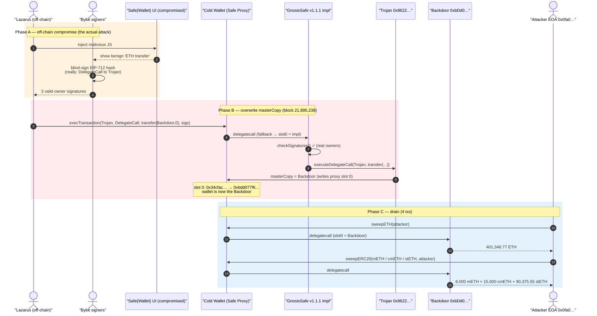
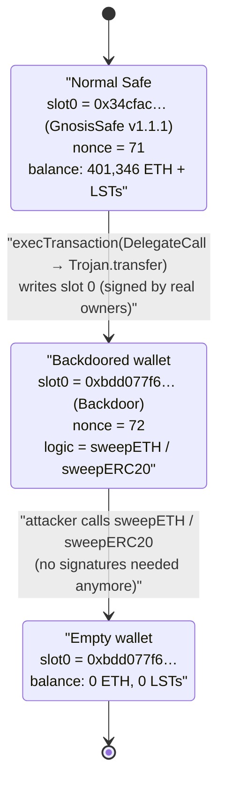
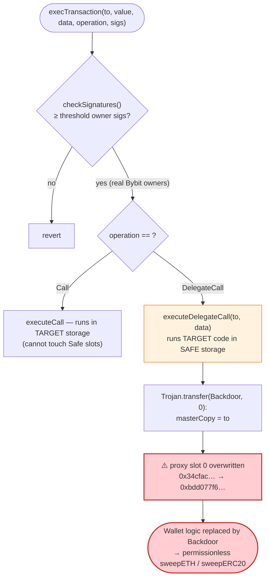

# Bybit Cold-Wallet Heist — `DelegateCall` masterCopy Overwrite of a Gnosis Safe

> **Vulnerability classes:** vuln/access-control/secret-exposure · vuln/dependency/unsafe-external-call

> **Reproduction:** the PoC compiles & runs in an isolated Foundry project at
> [this project folder](.) (the umbrella DeFiHackLabs repo contains many unrelated
> PoCs that do not compile together, so this one was extracted).
> Full verbose trace: [output.txt](output.txt).
> Verified vulnerable sources: [Proxy.sol](sources/Proxy_1Db92e/Proxy.sol) (the cold wallet) and
> [GnosisSafe.sol](sources/GnosisSafe_34CfAC/GnosisSafe.sol) (the v1.1.1 implementation).

---

## Key info

| | |
|---|---|
| **Loss** | **~$1.46–1.5B** — 401,346.77 ETH + 8,000 mETH + 15,000 cmETH + 90,375.55 stETH drained from Bybit's ETH multisig cold wallet (largest crypto theft ever recorded) |
| **Vulnerable contract** | Bybit cold wallet — a Gnosis Safe `Proxy` at [`0x1Db92e2EeBC8E0c075a02BeA49a2935BcD2dFCF4`](https://etherscan.io/address/0x1Db92e2EeBC8E0c075a02BeA49a2935BcD2dFCF4#code), delegating to the Safe v1.1.1 `GnosisSafe` implementation [`0x34CfAC646f301356fAa8B21e94227e3583Fe3F5F`](https://etherscan.io/address/0x34CfAC646f301356fAa8B21e94227e3583Fe3F5F#code) |
| **Victim** | Bybit exchange (its 3-of-? Ethereum multisig cold wallet) |
| **Attacker EOA** | [`0x0fa09C3A328792253f8dee7116848723b72a6d2e`](https://etherscan.io/address/0x0fa09c3a328792253f8dee7116848723b72a6d2e) (Lazarus / TraderTraitor — DPRK) |
| **Attack contract (Trojan / delegatecall payload)** | [`0x96221423681A6d52E184D440a8eFCEbB105C7242`](https://etherscan.io/address/0x96221423681a6d52e184d440a8efcebb105c7242) |
| **Attack contract (Backdoor / new masterCopy)** | [`0xbDd077f651EBe7f7b3cE16fe5F2b025BE2969516`](https://etherscan.io/address/0xbdd077f651ebe7f7b3ce16fe5f2b025be2969516) |
| **Attack tx (change masterCopy)** | [`0x46deef0f52e3a983b67abf4714448a41dd7ffd6d32d32da69d62081c68ad7882`](https://etherscan.io/tx/0x46deef0f52e3a983b67abf4714448a41dd7ffd6d32d32da69d62081c68ad7882) |
| **Drain txs** | ETH [`0xb61413…`](https://etherscan.io/tx/0xb61413c495fdad6114a7aa863a00b2e3c28945979a10885b12b30316ea9f072c) · mETH [`0xbcf316…`](https://etherscan.io/tx/0xbcf316f5835362b7f1586215173cc8b294f5499c60c029a3de6318bf25ca7b20) · cmETH [`0x847b84…`](https://etherscan.io/tx/0x847b8403e8a4816a4de1e63db321705cdb6f998fb01ab58f653b863fda988647) · stETH [`0xa284a1…`](https://etherscan.io/tx/0xa284a1bc4c7e0379c924c73fcea1067068635507254b03ebbbd3f4e222c1fae0) |
| **Chain / block / date** | Ethereum mainnet / forked at 21,895,237 (the change-masterCopy tx is in block 21,895,238) / **Feb 21, 2025** |
| **Compiler** | Safe contracts: Solidity **v0.5.14** (proxy `^0.5.3`); PoC harness `^0.8.15` |
| **Bug class** | (Not a smart-contract bug.) **Off-chain UI/signing compromise** weaponizing the Safe `DelegateCall` operation to overwrite the proxy's `masterCopy` storage slot |

---

## TL;DR

This was **not** an exploit of a flaw in the Gnosis Safe contracts. The Safe behaved exactly as designed.
It was a **supply-chain / signing-infrastructure compromise**: the attacker (Lazarus) compromised the
Safe{Wallet} front-end / signing flow so that Bybit's authorized signers were shown a benign transaction
while they actually signed a malicious one.

The malicious transaction was a single `execTransaction` with `operation = DelegateCall` to a
purpose-built **Trojan** contract. Because the Safe executes `DelegateCall` payloads **in the proxy's own
storage context**, the Trojan's one-line body — `masterCopy = to;` — wrote the **Backdoor** contract's
address into the proxy's storage slot 0. In a Gnosis Safe proxy, **slot 0 is `masterCopy`**: the
implementation address every future call delegates to.

After that single, fully-valid (correctly-signed) transaction, the cold wallet was no longer a Safe at
all — it was the attacker's `Backdoor` contract, which exposed `sweepETH()` and `sweepERC20()`. The
attacker then called those to drain **401,346.77 ETH, 8,000 mETH, 15,000 cmETH, and 90,375.55 stETH** —
roughly **$1.5 billion**, the largest single theft in crypto history.

The on-chain trace ([output.txt](output.txt)) shows the storage write
`slot 0: 0x…34cfac… → 0x…bdd077f6…` and then four clean transfers totaling the figures above.

---

## Background — Gnosis Safe proxy architecture

Bybit's cold wallet is a **Gnosis Safe v1.1.1 proxy**. The pattern is:

- A tiny [`Proxy`](sources/Proxy_1Db92e/Proxy.sol) contract holds only one storage variable,
  `masterCopy` (the implementation address), and forwards every call by `delegatecall` to it.
- The real logic — owners, threshold, `execTransaction`, signature checking — lives in the shared
  [`GnosisSafe`](sources/GnosisSafe_34CfAC/GnosisSafe.sol) singleton.

The owner-facing entry point is `execTransaction(...)`
([GnosisSafe.sol:774](sources/GnosisSafe_34CfAC/GnosisSafe.sol#L774)): the M owners EIP-712-sign a
transaction (to, value, data, **operation**, …, nonce); once ≥ `threshold` valid owner signatures are
supplied, the Safe executes the requested action — either a normal `Call` or, critically, a
**`DelegateCall`** — to an arbitrary target.

A `DelegateCall` runs the *target's code* against the *Safe's own storage*. This is a legitimate,
intentional Safe feature (used for batching libraries like `MultiSend`). It is also exactly the primitive
needed to overwrite any storage slot of the Safe — including slot 0.

---

## The vulnerable code

The relevant behavior is the composition of three pieces that are each individually correct.

### 1. The proxy: slot 0 is `masterCopy`, and the fallback delegatecalls to it

```solidity
// sources/Proxy_1Db92e/Proxy.sol
contract Proxy {
    // masterCopy always needs to be first declared variable, to ensure that it is
    // at the same location in the contracts to which calls are delegated.
    address internal masterCopy;                       // ← storage slot 0
    ...
    function () external payable {
        assembly {
            let masterCopy := and(sload(0), 0xffff...ffff)   // ← reads slot 0
            ...
            let success := delegatecall(gas, masterCopy, 0, calldatasize(), 0, 0)  // ← all logic
            ...
        }
    }
}
```
[Proxy.sol:10](sources/Proxy_1Db92e/Proxy.sol#L10), [Proxy.sol:28-35](sources/Proxy_1Db92e/Proxy.sol#L28-L35)

Whatever address sits in slot 0 *is* the wallet. Overwrite slot 0 → you replace the entire wallet logic.

### 2. The Safe: `execTransaction` will perform a `DelegateCall` once signatures check out

```solidity
// sources/GnosisSafe_34CfAC/GnosisSafe.sol:774
function execTransaction(address to, uint256 value, bytes calldata data,
    Enum.Operation operation, ... bytes calldata signatures) external returns (bool success)
{
    bytes32 txHash;
    {
        bytes memory txHashData = encodeTransactionData(to, value, data, operation, ..., nonce);
        nonce++;
        txHash = keccak256(txHashData);
        checkSignatures(txHash, txHashData, signatures, true);   // ← must pass owner sigs
    }
    ...
    success = execute(to, value, data, operation, ...);          // ← then executes
}
```
[GnosisSafe.sol:774-817](sources/GnosisSafe_34CfAC/GnosisSafe.sol#L774-L817)

```solidity
// sources/GnosisSafe_34CfAC/GnosisSafe.sol:82
function execute(address to, uint256 value, bytes memory data, Enum.Operation operation, uint256 txGas)
    internal returns (bool success)
{
    if (operation == Enum.Operation.Call)        success = executeCall(to, value, data, txGas);
    else if (operation == Enum.Operation.DelegateCall) success = executeDelegateCall(to, data, txGas);
    ...
}

function executeDelegateCall(address to, bytes memory data, uint256 txGas) internal returns (bool success) {
    assembly { success := delegatecall(txGas, to, add(data, 0x20), mload(data), 0, 0) }   // ← runs `to`'s
}                                                                                          //   code in Safe storage
```
[GnosisSafe.sol:82-112](sources/GnosisSafe_34CfAC/GnosisSafe.sol#L82-L112)

`checkSignatures` is sound — it recovers owners via `ecrecover` over the EIP-712 hash and requires
`threshold` distinct, increasing owner addresses
([GnosisSafe.sol:849-912](sources/GnosisSafe_34CfAC/GnosisSafe.sol#L849-L912)). It cannot tell a
"good" transaction from a "bad" one; it only verifies that the owners signed *this* hash.

### 3. The attacker's payload: a Trojan whose body writes slot 0

```solidity
// from the PoC (test/Bybit_exp.sol) — mirrors the on-chain Trojan 0x96221423…
contract Trojan {
    address public masterCopy;                 // slot 0, same layout as the proxy

    function transfer(address to, uint256 amount) public {
        masterCopy = to;                       // ← write the Backdoor addr into slot 0
    }
}
```
[test/Bybit_exp.sol:286-294](test/Bybit_exp.sol#L286-L294)

The signed transaction's `data` is `transfer(backdoor, 0)` and `operation = DelegateCall`. When the Safe
delegatecalls `Trojan.transfer`, the assignment `masterCopy = to` lands in the **proxy's** slot 0,
because delegatecall preserves the caller's (proxy's) storage. The function is named `transfer(address,uint256)`
purely to make the malicious payload look like an innocuous ERC-20 transfer in the Safe{Wallet} UI.

After execution slot 0 holds `0xbDd077f6…` (the Backdoor), so the wallet's logic is now:

```solidity
// from the PoC (test/Bybit_exp.sol) — mirrors the on-chain Backdoor 0xbDd077f6…
contract Backdoor {
    function sweepETH(address destination) public {
        (bool success, ) = destination.call{value: address(this).balance}("");
        require(success, "Failed to sweep ETH");
    }
    function sweepERC20(address token, address destination) public {
        IERC20(token).transfer(destination, IERC20(token).balanceOf(address(this)));
    }
}
```
[test/Bybit_exp.sol:296-307](test/Bybit_exp.sol#L296-L307)

No signatures, no threshold, no nonce — the Backdoor exposes raw drain functions callable by anyone (the
attacker called them from its EOA).

---

## Root cause — why it was possible

The contracts were not vulnerable. The **off-chain signing process** was:

1. **The signing UI was compromised.** Attribution (zachXBT, SlowMist, Sygnia/Verichains forensics)
   pins this on Lazarus injecting malicious JavaScript into the Safe{Wallet} infrastructure (an AWS S3
   bucket serving the dApp). Bybit's signers were shown a legitimate-looking ETH transfer in the UI while
   the device actually computed and signed the EIP-712 hash of the **malicious `DelegateCall`** transaction.
2. **"What you see is not what you sign."** Hardware wallets / signers blind-signed the structured Safe
   transaction hash without independently decoding that `operation = DelegateCall` to an unknown contract
   `0x96221423…` — a maximally dangerous combination — was being authorized.
3. **`DelegateCall` to an arbitrary target is, by design, total control of the wallet.** A single
   correctly-signed `execTransaction` with `operation = DelegateCall` can rewrite any storage slot of the
   Safe, including the `masterCopy` pointer that defines the wallet itself. The Safe's signature check
   guarantees *authorization*, not *intent*; nothing forced the signers to understand what they authorized.
4. **The `masterCopy` slot has no protection because it cannot have any.** It must be writable
   (upgrades), it is slot 0 by construction, and a delegatecall payload runs with full storage access.

So the on-chain transaction was perfectly valid: ≥ `threshold` real Bybit-owner signatures over the real
EIP-712 hash. The attack lived entirely in tricking those humans into producing those signatures.

---

## Preconditions

- **Compromised signing path** for ≥ `threshold` of the cold wallet's owners (achieved via the malicious
  Safe{Wallet} UI / blind signing). This is the entire attack; everything after is mechanical.
- The wallet is a Gnosis Safe proxy whose slot 0 is `masterCopy` (true for all Safe proxies).
- The Safe supports `Operation.DelegateCall` in `execTransaction` (true for v1.1.1).
- The cold wallet held the funds at the time (401k ETH + the LST/LRT positions).

> **Reproduction note:** the PoC's `testExploit()` is able to replay the *real* attack on a fork because
> it submits the **actual on-chain signatures** (the `signature` bytes copied from the real
> change-masterCopy transaction). It does **not** forge owner signatures — it cannot, since `ecrecover`
> recovers the genuine Bybit owners (`0x1F4EB0a9…`, `0x3Cc3A225…`, `0xe3dF2cCE…`, visible in the trace).
> The companion `testFakeExploit()` instead *demonstrates the mechanism* on a freshly-created Safe whose
> owners' private keys the PoC controls, signing the malicious `DelegateCall` itself.

---

## Step-by-step attack walkthrough (with on-chain numbers from the trace)

All numbers are taken directly from [output.txt](output.txt) (the `testExploit()` trace, which replays
the real signed transaction against a mainnet fork at block 21,895,237).

| # | Step | Mechanism | Ground-truth result |
|---|------|-----------|---------------------|
| 0 | **Initial state** | Cold wallet is a normal Safe v1.1.1 proxy | slot 0 = `0x34CfAC…` (Safe impl); nonce = **71** |
| 1 | **Submit signed `execTransaction`** | `to = Trojan 0x96221423…`, `value = 0`, `data = transfer(0xbDd077f6…, 0)`, `operation = DelegateCall (1)`, `safeTxGas = 45746`, `signatures = d0afef78…73c1f` | `checkSignatures` passes — `ecrecover` returns real owners `0x1F4EB0a9…`, `0x3Cc3A225…`, `0xe3dF2cCE…` |
| 2 | **Safe delegatecalls the Trojan** | `executeDelegateCall(Trojan, transfer(...))` runs `masterCopy = to` in the **proxy's** storage | **slot 0: `0x…34cfac…` → `0x…bdd077f6…`** (the Backdoor); nonce 71 → **72**; `ExecutionSuccess` emitted |
| 3 | **Wallet is now the Backdoor** | All future calls to the cold wallet delegatecall `0xbDd077f6…` | `vm.load(slot 0)` confirms Backdoor address |
| 4 | **Drain ETH** | attacker calls `sweepETH(attacker)` → Backdoor `destination.call{value: balance}` | **401,346.768858404671846374 ETH** sent to attacker (`401346768858404671846374` wei) |
| 5 | **Drain mETH** | `sweepERC20(mETH, attacker)` → `transfer(attacker, balanceOf(wallet))` | **8,000 mETH** (8.0e21 wei) |
| 6 | **Drain cmETH** | `sweepERC20(cmETH, attacker)` | **15,000 cmETH** (1.5e22 wei) |
| 7 | **Drain stETH** | `sweepERC20(stETH, attacker)` | **90,375.547907685258392043 stETH** (90375547907685258392043 wei; 75,654.96 shares) |

(In the real incident steps 4–7 were four separate transactions, listed in the Key-info table; the PoC
batches them into one test for convenience.)

---

## Profit / loss accounting

| Asset | Amount drained | Note |
|---|---:|---|
| ETH | **401,346.77** | `sweepETH` — entire wallet balance |
| mETH (Mantle Staked Ether) | **8,000** | `sweepERC20` |
| cmETH (Mantle Restaked Ether) | **15,000** | `sweepERC20` |
| stETH (Lido Staked ETH) | **90,375.55** | `sweepERC20` (75,654.96 stETH shares) |
| **Total** | **≈ 506,722 ETH-equivalent** | **≈ $1.46–1.5B at Feb 2025 prices** |

The attacker's *cost* was effectively just gas plus the off-chain operation; there was no capital outlay
on-chain. Net profit ≈ the entire loss above.

---

## Diagrams

### Sequence of the attack



### Proxy state evolution (slot 0 = masterCopy)



### Why the DelegateCall is fatal (control-flow)



---

## Remediation

This incident is fixed primarily in the **signing process**, not the contracts:

1. **Clear / verifiable signing ("WYSIWYS").** Signers must see and confirm the *decoded* intent —
   especially `operation = DelegateCall` and the target address — on a trusted device, not the
   (potentially compromised) dApp UI. Hardware wallets must decode and display Safe transaction fields
   (Ledger/Safe "clear signing") instead of blind-signing an opaque EIP-712 hash.
2. **Treat `DelegateCall` as maximum risk.** For cold wallets holding billions, disable `DelegateCall`
   entirely or whitelist only audited library targets (e.g., the official `MultiSend`). Later Safe
   versions support a `GuardManager`/Transaction Guard that can reject `DelegateCall` or unknown targets;
   deploy such a guard. A guard that reverts any `operation == DelegateCall` would have blocked this
   transaction outright.
3. **Independent transaction verification.** Out-of-band verification (a second, air-gapped tool that
   re-derives and human-readably decodes the Safe tx hash) before any signer approves, so a UI-only
   compromise cannot misrepresent the payload.
4. **Harden the signing supply chain.** The root compromise was a tampered Safe{Wallet} front-end. Pin
   and integrity-check dApp assets, isolate signing devices/networks, and never run the signer UI from an
   environment that can be silently updated by a third party.
5. **Operational controls for cold wallets.** Withdrawal allow-lists, value/velocity limits, timelocks on
   implementation/`masterCopy` changes, and monitoring/alerting on any `execTransaction` with
   `DelegateCall` or any change to slot 0.

---

## How to reproduce

The PoC was extracted into a standalone Foundry project (the umbrella DeFiHackLabs repo has many unrelated
PoCs that fail to compile together under `forge test`'s whole-project build):

```bash
_shared/run_poc.sh 2025-02-Bybit_exp -vvvvv
```

- **RPC:** an Ethereum **mainnet archive** endpoint is required (the fork block 21,895,237 is from Feb 2025).
  `foundry.toml` uses an Infura archive endpoint.
- **Two tests run:** `testExploit()` replays the *real* signed change-masterCopy transaction and then
  drains the wallet (proving the attack with genuine on-chain data); `testFakeExploit()` reproduces the
  *mechanism* on a self-created Safe whose owner keys the PoC controls.
- Result: both `[PASS]`. The real exploit reports the canonical loss figures.

Expected tail:

```
Ran 2 tests for test/Bybit_exp.sol:Bybit
[PASS] testExploit() (gas: 261763)
  Before attack, Bybit cold wallet 1 masterCopy: 0x34CfAC646f301356fAa8B21e94227e3583Fe3F5F
  After attack, Bybit cold wallet 1 masterCopy: 0xbDd077f651EBe7f7b3cE16fe5F2b025BE2969516
  Attacker ETH Balance After exploit: 401346 ETH
  Attacker mETH Balance After exploit: 8000 ETH
  Attacker cmETH Balance After exploit: 15000 ETH
  Attacker stETH Balance After exploit: 90375 ETH
[PASS] testFakeExploit() (gas: 884005)
Suite result: ok. 2 passed; 0 failed; 0 skipped
```

---

*References: zachXBT — https://x.com/zachxbt/status/1893211577836302365 · SlowMist —
https://x.com/SlowMist_Team/status/1892963250385592345 · Patrick Collins —
https://x.com/PatrickAlphaC/status/1893215304135618759. The largest crypto theft on record (~$1.5B),
attributed to DPRK's Lazarus Group; root cause was a compromised Safe{Wallet} signing UI, not a
Gnosis Safe contract vulnerability.*
