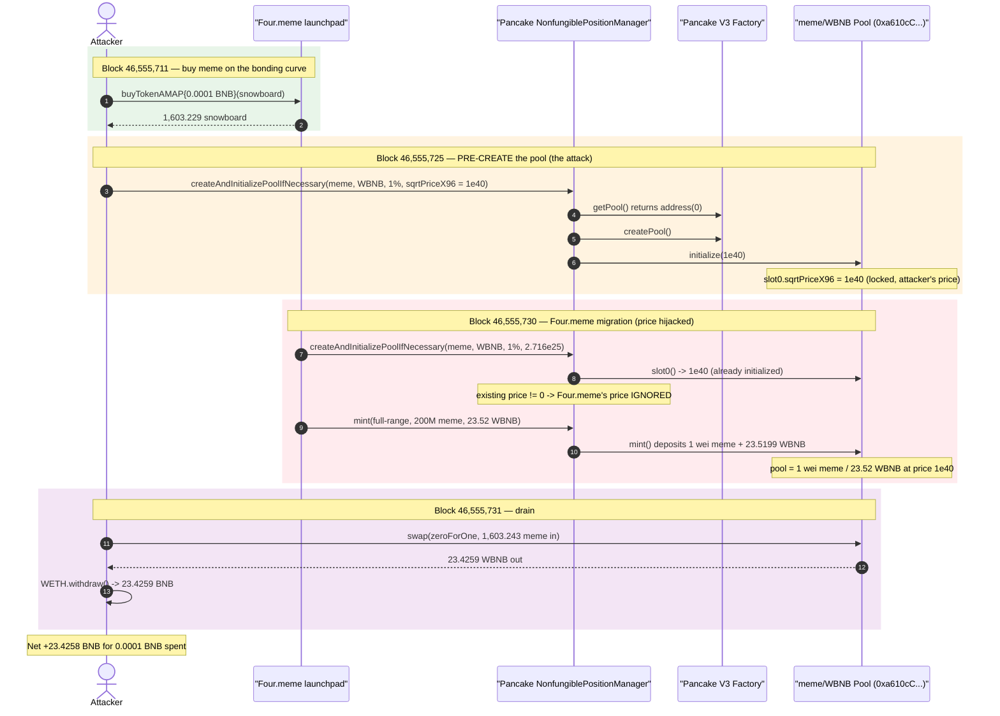
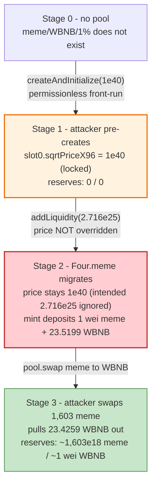
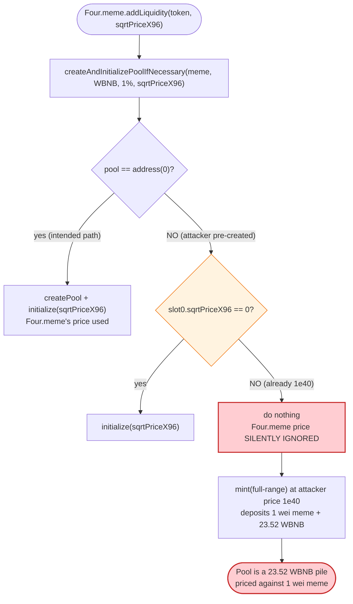

# Four.meme Launchpad Exploit — Liquidity Migration Front-Run via Pre-Initialized Pancake V3 Pool

> **Vulnerability classes:** vuln/defi/sandwich-attack · vuln/logic/incorrect-order-of-operations

> One-line: the attacker created the BNB↔meme PancakeSwap V3 pool *first* with a wildly inflated price, so when Four.meme's `addLiquidity` later "created and initialized" the pool it silently kept the attacker's price, depositing the launch BNB into a degenerate pool the attacker could drain for pennies.

> **Reproduction:** the PoC compiles & runs in an isolated Foundry project at
> [this project folder](.) (the umbrella DeFiHackLabs repo does not whole-compile,
> so this PoC was extracted). Full verbose trace: [output.txt](output.txt).
> PoC source: [test/FourMeme_exp.sol](test/FourMeme_exp.sol).
> Four.meme launchpad source is **closed-source / unverified** on BscScan; the
> peripheral PancakeSwap V3 contracts that the bug pivots on are verified and
> downloaded under [sources/](sources/).

---

## Key info

| | |
|---|---|
| **Loss** | ~$186K total across ~20 meme tokens. This PoC demonstrates **one** token (snowboard): **23.4259 WBNB** drained from a single migration. |
| **Vulnerable contract** | Four.meme launchpad (proxy) — [`0x5c952063c7fc8610FFDB798152D69F0B9550762b`](https://bscscan.com/address/0x5c952063c7fc8610FFDB798152D69F0B9550762b) (impl `0xb28723a16D3347cdC0ce035eb1C1Eb0B7406682F`), **unverified** |
| **Victim asset** | The 23.52 WBNB of launch liquidity Four.meme migrates into the Pancake V3 pool on graduation |
| **Pool (re)used** | PancakeV3Pool meme/WBNB 1% — [`0xa610cC0d657bbFe78c9D1eA638147984B2F3C05c`](https://bscscan.com/address/0xa610cC0d657bbFe78c9D1eA638147984B2F3C05c) (created **by the attacker**, not Four.meme) |
| **Meme token** | snowboard — [`0x4AbfD9a204344bd81A276C075ef89412C9FD2f64`](https://bscscan.com/address/0x4AbfD9a204344bd81A276C075ef89412C9FD2f64) |
| **Attacker EOAs** | `0x010Fc97...A53A`, `0x935d6cf...f4a5`, `0xf91848a...dc79`, `0x907004b...c33d`, `0x482b004...2fda` |
| **Attacker contracts** | buy `0x4FdEBcA823b7886c3A69fA5fC014104F646D9591`, create-pool `0xbf26e1...686c`, swap `0x06799F7b...D051` |
| **Attack tx (swap/profit)** | [`0x2902f93a0e0e32893b6d5c907ee7bb5dabc459093efa6dbc6e6ba49f85c27f61`](https://bscscan.com/tx/0x2902f93a0e0e32893b6d5c907ee7bb5dabc459093efa6dbc6e6ba49f85c27f61) |
| **Pre-tx (hacker create pool)** | [`0x4235b006...206dff`](https://bscscan.com/tx/0x4235b006b94a79219181623a173a8a6aadacabd01d6619146ffd6fbcbb206dff) |
| **Pre-tx (Four.meme add liquidity)** | [`0xe0daa3bf...feeb5`](https://bscscan.com/tx/0xe0daa3bf68c1a714f255294bd829ae800a381624417ed4b474b415b9d2efeeb5) |
| **Chain / blocks / date** | BSC / 46,555,711 → 46,555,732 / **Feb 11, 2025** |
| **Compiler** | PoC `^0.8.15`; Pancake periphery `v0.7.6`; meme token `v0.8.20` |
| **Bug class** | Trusted-state assumption on an external call — `createAndInitializePoolIfNecessary` does **not** re-initialize an already-initialized pool, enabling a price-setting front-run of the launchpad's liquidity migration |

---

## TL;DR

Four.meme is a "pump.fun"-style launchpad: users buy a meme token along a bonding curve, and once
market cap hits a graduation threshold (~24 BNB) the platform "migrates" the bonding-curve liquidity
into a real PancakeSwap V3 pool. To migrate, Four.meme's owner-only `addLiquidity(token, sqrtPriceX96)`
calls PancakeSwap's `NonfungiblePositionManager.createAndInitializePoolIfNecessary(...)` to create the
pool and set its starting price, then mints a full-range LP position with ~200M meme tokens and ~23.52
BNB.

The flaw is that **PancakeSwap's helper only initializes the price if the pool does not yet exist (or
its price is still 0)**:

```solidity
if (pool == address(0)) {
    pool = factory.createPool(...);
    IPancakeV3Pool(pool).initialize(sqrtPriceX96);   // fresh pool: our price is used
} else {
    (uint160 existing,,,,,, ) = IPancakeV3Pool(pool).slot0();
    if (existing == 0) IPancakeV3Pool(pool).initialize(sqrtPriceX96);  // already set? do nothing
}
```

The attacker simply **creates and initializes that exact pool one block before Four.meme migrates**,
using an absurd `sqrtPriceX96 = 1e40` (≈ `3.68e14` × the price Four.meme intends). When Four.meme then
calls `addLiquidity`, the pool already exists with a non-zero price, so Four.meme's intended price is
**silently discarded**. At the attacker-chosen price the pool values 1 meme token astronomically: the
mint of 200M meme tokens deposits only **1 wei** of meme but the full **23.52 WBNB**. The attacker, who
pre-bought ~1,603 meme tokens for **0.0001 BNB** from the bonding curve, then swaps those tokens through
the degenerate pool and pulls out **23.4259 WBNB**.

The PoC stitches together the four historical blocks (buy → hacker creates pool → Four.meme migrates →
attacker swaps) and ends with the attacker holding **23.425920040311988396 BNB**, having spent
**0.0001 BNB**.

---

## Background — what Four.meme does

Four.meme is a BSC meme-token launchpad. While a token is on its bonding curve:

- Users can only **buy/sell through the platform** (`buyTokenAMAP`, sell), priced by an internal curve
  (`calcBuyAmount` / `calcBuyCost`). Pancake/OTC trading of the token is blocked (the token enforces a
  transfer "mode" — `setMode(2)` during a platform buy, `setMode(1)` afterwards; see the `setMode`
  calls in [output.txt](output.txt) around the `buyTokenAMAP` frame).
- When the market cap reaches the graduation threshold (~24 BNB of curve reserves), the platform
  **migrates** the accumulated liquidity to PancakeSwap V3 via the owner-only `addLiquidity(token, sqrtPriceX96)`.

The migration step is supposed to be the moment the token "graduates" to a real, freely-tradable
market. In `addLiquidity`, Four.meme:

1. `setMode(0)` — lifts the transfer restriction so the token can live on Pancake.
2. Calls `createAndInitializePoolIfNecessary(meme, WBNB, fee, sqrtPriceX96)` to create the V3 pool and
   set its launch price.
3. Approves and `mint`s a full-range LP position (`tickLower=-887200, tickUpper=887200`) with the
   curve's meme tokens (200,000,000) and BNB (23.52), recipient = Four.meme.
4. Locks the LP NFT and `renounceOwnership()` on the token.

Concrete on-chain values for this migration (from [output.txt](output.txt)):

| Parameter | Value |
|---|---|
| Fee tier used | **10000** (1%) |
| Four.meme's *intended* `sqrtPriceX96` | `27,169,599,998,237,907,265,358,521` (≈ `2.716e25`, tick ≈ +511) |
| Meme balance Four.meme migrates | `200,000,000e18` |
| BNB Four.meme migrates | `23.519999999451199994` |
| Actual meme deposited into pool | **1 wei** |
| Actual BNB deposited into pool | **23.519999970521880780** |

That mismatch — 200M meme tokens "available" but only 1 wei accepted — is the symptom of the price
having been hijacked.

---

## The vulnerable code

The Four.meme launchpad is closed-source, so the literal vulnerable line lives in unverified bytecode.
But the entire exploit pivots on one verified function in the PancakeSwap periphery that Four.meme
trusts to set the price.

### `createAndInitializePoolIfNecessary` only initializes a *fresh* pool

[`sources/.../contracts_base_PoolInitializer.sol:13-31`](sources/NonfungiblePositionManager_46A15B/contracts_base_PoolInitializer.sol#L13-L31):

```solidity
function createAndInitializePoolIfNecessary(
    address token0,
    address token1,
    uint24 fee,
    uint160 sqrtPriceX96
) external payable override returns (address pool) {
    require(token0 < token1);
    pool = IPancakeV3Factory(factory).getPool(token0, token1, fee);

    if (pool == address(0)) {
        pool = IPancakeV3Factory(factory).createPool(token0, token1, fee);
        IPancakeV3Pool(pool).initialize(sqrtPriceX96);
    } else {
        (uint160 sqrtPriceX96Existing, , , , , , ) = IPancakeV3Pool(pool).slot0();
        if (sqrtPriceX96Existing == 0) {
            IPancakeV3Pool(pool).initialize(sqrtPriceX96);
        }
    }
}
```

The function name promises "create and initialize *if necessary*". The "if necessary" is doing a lot of
work: if the pool already exists **and is already initialized** (`sqrtPriceX96Existing != 0`), the
caller's `sqrtPriceX96` argument is **silently ignored** and no error is returned.

### The pool can be initialized exactly once

[`sources/.../contracts_PancakeV3Pool.sol:281-283`](sources/PancakeV3Pool_a610cC/contracts_PancakeV3Pool.sol#L281-L283):

```solidity
function initialize(uint160 sqrtPriceX96) external override {
    require(slot0.sqrtPriceX96 == 0, 'AI');   // "Already Initialized"
    ...
}
```

So whoever calls `initialize` **first** permanently fixes the pool's starting price; nobody can reset
it. Pool creation is permissionless (`factory.createPool`), and `initialize` is permissionless too.
There is nothing tying "who created the pool" to "who launches the token".

### Why the price hijack lets the attacker drain the migrated BNB

In Uniswap/Pancake V3, a full-range `mint` deposits token amounts proportional to the *current* price.
At the attacker's price (`sqrtPriceX96 = 1e40`, far above the valid max for a real meme/BNB ratio), the
pool treats meme as essentially infinitely valuable relative to WBNB — so the LP add takes **1 wei of
meme and all 23.52 WBNB**. The pool is now a giant pile of WBNB priced against a single wei of meme. A
trader with even ~1,603 meme tokens can sweep nearly the entire WBNB reserve.

---

## Root cause — why it was possible

The launchpad's migration logic assumes that `createAndInitializePoolIfNecessary` will set the price it
passes in. That assumption holds **only for a pool that doesn't exist yet**. Because pool creation and
initialization are permissionless and idempotent (initialize-once), an attacker can win the race:

1. **Permissionless pre-creation.** Anyone can call `factory.createPool` + `pool.initialize` (or the
   periphery wrapper) for the meme/WBNB/1% pool before Four.meme migrates. The attacker did exactly
   this one block earlier with `sqrtPriceX96 = 1e40`.
2. **Idempotent, silent initializer.** Four.meme's later `createAndInitializePoolIfNecessary` sees a
   pool with a non-zero price and **does nothing** — it neither reverts nor overrides. Four.meme has no
   way to know its price was ignored short of reading `slot0` afterward (which it doesn't).
3. **Price-dependent liquidity deposit.** Because the price is now the attacker's, the `mint` deposits
   essentially zero meme and all the BNB, manufacturing a pool whose entire WBNB reserve is claimable
   for a trivial amount of meme.
4. **Attacker pre-owns meme.** The attacker bought a small bag of the meme token from the bonding curve
   beforehand (legitimately, for 0.0001 BNB), so it holds the "key" needed to swap against the
   degenerate pool the instant migration completes.

This is the classic *trusted-external-state* bug (Plamen rule R8 / external-precondition): the
launchpad treats an external call's effect as guaranteed, but the effect is conditional on state an
attacker controls.

---

## Preconditions

- The meme token is **about to graduate** (Four.meme will call `addLiquidity` to migrate ~23.52 BNB).
- The attacker can call `createAndInitializePoolIfNecessary` (or factory `createPool`+`initialize`) for
  the **exact** `(token0=meme, token1=WBNB, fee=10000)` tuple **before** Four.meme's migration tx is
  mined — i.e., the attacker observes the imminent graduation and front-runs the pool creation. (In the
  live incident this was achieved across blocks 46,555,725 → 46,555,731.)
- The attacker holds some of the meme token (bought from the bonding curve for ~0.0001 BNB) to swap
  against the manipulated pool. The token's transfer-restriction "mode" must allow the post-migration
  Pancake swap (Four.meme's `addLiquidity` does `setMode(0)`, lifting the restriction).
- The fee tier and `token0 < token1` ordering Four.meme will use are known/deterministic, so the
  attacker can pre-create the identical canonical pool.

---

## Step-by-step attack walkthrough (with on-chain numbers from the trace)

All figures come from [output.txt](output.txt). The four phases are run on four sequential forks
mirroring the live blocks.

| # | Phase (fork block) | Call | Concrete numbers | Effect |
|---|---|---|---|---|
| 1 | **Buy meme** (46,555,711) | `buyTokenAMAP{value: 1e14}(snowboard, 1e14, 0)` | Spends `0.0001 BNB`; receives **1,603.229404857** snowboard (`calcBuyCost` ≈ `99,009,900,990,040` wei ≈ 0.000099 BNB) | Attacker acquires a meme bag from the bonding curve, legitimately. |
| 2 | **Hacker creates pool** (46,555,725) | `createAndInitializePoolIfNecessary(snowboard, WBNB, 10000, 1e40)` | Pool `0xa610cC…3C05c` created & initialized; `slot0.sqrtPriceX96 = 1e40`, tick `511251` | The meme/WBNB/1% pool now exists with the attacker's absurd price baked in. |
| 3 | **Four.meme migrates** (46,555,730) | owner calls `addLiquidity(snowboard, 27169599998237907265358521)` | Helper sees pool already initialized (`slot0 = 1e40`) → **price ignored**. `mint` deposits **amount0 = 1 wei meme, amount1 = 23.519999970521880780 WBNB**; liquidity `186,344,638` | Four.meme's 23.52 BNB lands in a pool priced by the attacker; only 1 wei of meme used. |
| 4 | **Attacker swaps** (46,555,731) | transfer 1,603.243002223 meme → `pool.swap(zeroForOne=true, amountSpecified=1603.243…e18, sqrtPriceLimit=4295128740)` | `amount0 = +1,603.243002223e18` meme in, `amount1 = −23.425920040311988396` WBNB out | Selling ~1,603 meme into the degenerate pool pulls out **23.4259 WBNB**. |
| 5 | **Withdraw** | `WETH(wbnb).withdraw(23.425920040311988396)` | Attacker BNB balance: `0 → 23.425920040311988396` | Profit realized as native BNB. |

> Note on the PoC's block choices: the PoC uses `vm.createFork(RPC, block)` snapshots and, in phase 4,
> transfers the pre-bought meme from the *real* attacker buy-contract
> (`0x4FdEBcA823b7886c3A69fA5fC014104F646D9591`, holding `1,603.243002223e18`) to the local `Swap`
> contract, because trading is restricted in that exact block for a freshly-deployed buyer. This is a
> faithful stand-in for the attacker's own pre-bought bag.

### Profit / loss accounting (this token)

| Direction | Amount (BNB / WBNB) |
|---|---:|
| Spent — buy meme on bonding curve | 0.0001 |
| Received — swap meme → WBNB and withdraw | 23.425920040311988396 |
| **Net profit (this token)** | **≈ +23.4258 BNB** |

The 23.42 BNB drained ≈ the 23.52 BNB of launch liquidity Four.meme migrated (minus the 1% swap fee and
the 1 wei meme left behind). Across the ~20 meme tokens hit the same way, total loss ≈ **287 BNB ≈ $186K**.

---

## Diagrams

### Sequence of the attack



### Pool price / reserve evolution



### The flaw inside `createAndInitializePoolIfNecessary`



---

## Why the magic numbers

- **`sqrtPriceX96 = 1e40`** (attacker's pool price): chosen far above any realistic meme/BNB price (it
  is ~`3.68e14` × Four.meme's intended `2.716e25`). At this price the V3 math values meme so highly that
  a full-range mint of 200M meme requires only **1 wei** of meme alongside all the BNB — so essentially
  100% of the migrated BNB enters the pool while almost no meme does.
- **`27169599998237907265358521` (≈ 2.716e25)**: Four.meme's *intended* launch price for the 200M-meme /
  23.52-BNB position. It is the value `addLiquidity` passes — and the value the helper throws away.
- **buy of `1e14` wei (0.0001 BNB) → 1,603.229 meme**: a trivially small bonding-curve purchase that
  nonetheless gives the attacker enough meme to sweep the entire post-migration WBNB reserve. The cost
  basis is negligible against the 23.42 BNB payout.
- **`sqrtPriceLimitX96 = 4295128740` (≈ MIN_SQRT_RATIO+1)**: the lower price bound for a
  `zeroForOne = true` swap, letting the attacker push the price all the way down (meme cheap → WBNB out)
  with no slippage protection getting in the way.

---

## Remediation

1. **Don't trust the periphery to set your price — verify it.** After calling
   `createAndInitializePoolIfNecessary`, read `pool.slot0()` and **require** that the actual
   `sqrtPriceX96` equals the intended value (within a tight tolerance). If it differs, revert the
   migration. This single check defeats the entire attack.
2. **Create the pool atomically inside the migration, and revert if it already exists.** If the launch
   pool is expected to be brand-new, treat a pre-existing pool as an attack: `require(factory.getPool(...) == address(0))` (or that its price is uninitialized) before migrating, and abort otherwise so an admin can investigate.
3. **Validate the deposited amounts.** After `mint`, assert that the meme amount actually deposited is
   within an expected range of the 200M intended (e.g., reject if `amount0` is dust like 1 wei). A pool
   that swallows all BNB and ~zero meme is a red flag the migration code can catch.
4. **Use a canonical, protocol-controlled pool address.** Deterministically derive and reserve the
   pool (or use a protocol-deployed pool factory that only the launchpad can initialize) so third
   parties cannot pre-seed the price.
5. **Bound the launch price.** Enforce that the `sqrtPriceX96` actually in effect at migration lies
   within a sane band implied by the bonding-curve reserves (meme supply vs. BNB), rejecting any pool
   whose price is orders of magnitude off.

---

## How to reproduce

The PoC was extracted into a standalone Foundry project (the umbrella DeFiHackLabs repo does not
whole-compile under `forge test`). `basetest.sol` + `tokenhelper.sol` were copied to the project root so
the PoC's `import "../basetest.sol"` resolves.

```bash
_shared/run_poc.sh 2025-02-FourMeme_exp -vvvvv
```

- RPC: a **BSC archive** endpoint is required (blocks ~46.55M, Feb 2025). `foundry.toml` uses
  `https://bsc-mainnet.public.blastapi.io`, which serves historical state at those blocks; most public
  BSC RPCs prune them and fail with `header not found` / `missing trie node`.
- Result: `[PASS] testExploit()` with the attacker ending on **23.4259 BNB**.

Expected tail:

```
[PASS] testExploit() (gas: 2971476)
  Attacker Before exploit ETH Balance: 0.000000000000000000
  Attacker After exploit BNB Balance: 23.425920040311988396

Suite result: ok. 1 passed; 0 failed; 0 skipped
```

---

*References: post-mortem — https://securrtech.medium.com/the-four-meme-exploit-a-deep-dive-into-the-183-000-hack-6f45369029be ; PeckShieldAlert — https://x.com/PeckShieldAlert/status/1889210001220423765 ; Four.meme statement — https://x.com/four_meme_/status/1889198796695044138. The Four.meme launchpad is closed-source; the PancakeSwap V3 periphery/pool that the bug pivots on are verified and included under [sources/](sources/).*
