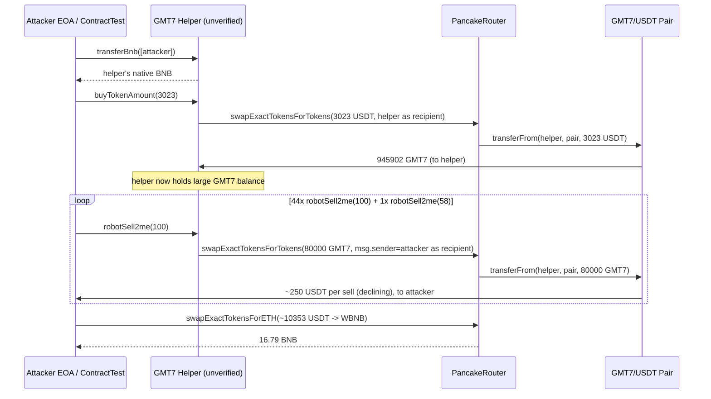
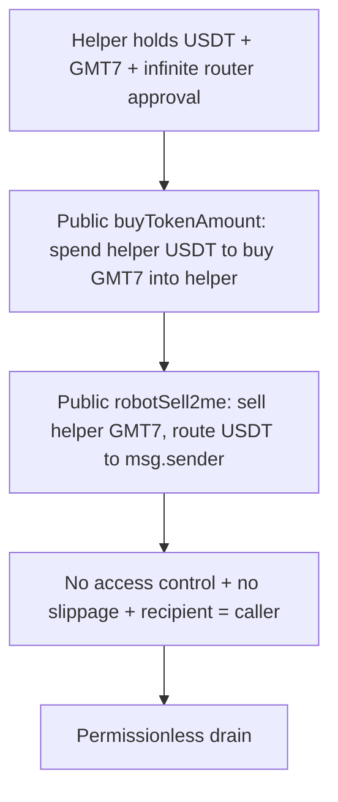

# GMT7 Helper permissionless drain — unverified trading bot helper exposed public buy/sell functions with no access control and infinite router approval

> **Vulnerability classes:** vuln/access-control/missing-auth · vuln/access-control/missing-modifier · vuln/defi/slippage
> **Reproduction:** the PoC compiles & runs in an isolated Foundry project at [this project folder](.). Full verbose trace: [output.txt](output.txt). The vulnerable helper contract at `0x9AD9…31E3` is **unverified** on BscScan; the exploit logic below is reconstructed from the decoded Foundry `-vvvvv` trace, which shows every external call and storage change.
---
## Key info

| | |
|---|---|
| **Loss** | 16.75 BNB (~$10.1k at the time; PoC final balance **16.791444737752979201 BNB** [output.txt:1565]) |
| **Vulnerable contract** | GMT7 Helper — [`0x9AD90EEAb3CAFF64A762CB40387eE1Bb18BD31E3`](https://bscscan.com/address/0x9AD90EEAb3CAFF64A762CB40387eE1Bb18BD31E3) (unverified) |
| **Attacker EOA** | [`0x0A4125690753b6Cc82cAdbCa0f0899eb2025acB0`](https://bscscan.com/address/0x0A4125690753b6Cc82cAdbCa0f0899eb2025acB0) |
| **Attack contract** | [`0x8EA93821691BB9Ec2cE0b4EDaCd920e9025779E4`](https://bscscan.com/address/0x8EA93821691BB9Ec2cE0b4EDaCd920e9025779E4) |
| **Attack tx** | [`0x5eb225ce9fb2c7a169e1736eb3b2bf2b6a5843839dd84cdcf6fe2ab0577ae21f`](https://bscscan.com/tx/0x5eb225ce9fb2c7a169e1736eb3b2bf2b6a5843839dd84cdcf6fe2ab0577ae21f) |
| **Chain / block / date** | BNB Smart Chain / 46,497,384 / Feb 2025 |
| **Compiler** | Unverified (source not published on BscScan) |
| **Bug class** | A privileged trading-bot helper exposed `buyTokenAmount`, `robotSell2me`, and `transferBnb` as fully permissionless external functions, while it held USDT and an effectively-infinite `approve` to PancakeRouter; anyone could drive it to buy GMT7 and then dump the helper's GMT7 to the attacker. |

## TL;DR

GMT7 is a low-liquidity BEP-20 token paired with USDT on PancakeSwap (`0x5317545A…3006`). The project deployed an off-the-shelf "robot" helper contract (`0x9AD9…31E3`, unverified) whose job was to manage buys/sells on that pair. To do its job the helper (a) held a large USDT balance, (b) held its own GMT7 balance, and (c) granted the PancakeRouter a near-`type(uint256).max` allowance over both tokens — and then exposed `buyTokenAmount(uint)`, `robotSell2me(uint)`, and `transferBnb(address[])` as **public, access-control-free** functions.

The attacker therefore never needed to own any token. Step 1: call `transferBnb([attacker])` to confirm the helper would route output to arbitrary recipients. Step 2: call `buyTokenAmount(3023)` to force the helper to spend **3,023 USDT** of its own balance buying GMT7 from the pair into the helper's own balance [output.txt:1596–1623]. Step 3: loop `robotSell2me(100)` 44 times plus one `robotSell2me(58)`. Each call sells **80,000 GMT7** of the helper's GMT7 through PancakeRouter, but routes the USDT output to the **attacker** (`ContractTest`), not back to the helper [output.txt:1633–1661]. Across 45 sells the attacker accumulated **≈ 10,353.92 USDT** [output.txt:3350]. Step 4: swap that USDT to BNB via `swapExactTokensForETHSupportingFeeOnTransferTokens`, netting **16.791444737752979201 BNB** [output.txt:3395].

The helper started with **0 BNB** in the PoC attacker contract and ended with **16.79 BNB** [output.txt:1564–1565], confirming the full drain. No flash loan was needed — the helper itself was the funding source.

## Background — what GMT7 / the Helper does

GMT7 (`0xF1a895976D7916F4C38cE0bb1EA2945448888888`) is a standard BEP-20 traded against USDT (`0x55d398326f99059fF775485246999027B3197955`) in a PancakeSwap V2 pair at `0x5317545AAF8D10d6bC137eB0375c4C1e3A283006`. At the fork block the pair held roughly **84.89e21 USDT** vs **25.68e24 GMT7** [output.txt:1622], i.e. GMT7 price ≈ $0.0000033. The token is a fee-on-transfer token: every swap deducts a portion of the output (visible in the trace as `swapExactTokensForTokensSupportingFeeOnTransferTokens` rather than the non-fee variant).

The project also deployed a helper/robot contract at `0x9AD90EEAb3CAFF64A762CB40387eE1Bb18BD31E3`. Because its source is unverified, its exact intent is reconstructed from behaviour observed in the trace:

- It **holds** USDT and GMT7 balances (it is the `from`/`to` of both legs of the swaps).
- It is the **owner of the swap orders**: the PancakeRouter calls `transferFrom(GMT7Helper, pair, …)` and `transferFrom(GMT7Helper, pair, …)` for USDT, i.e. the helper is the account whose balances move and whose allowances are consumed.
- It pre-approved the PancakeRouter for the helper's token holdings with an allowance of `9999999999999999999999999999999999999999955955000000000000000000` (~`uint256.max / 3`, an effectively-infinite allowance) [output.txt:1599]. After each swap the router's `transferFrom` returns and the allowance is re-checked at the next call; it is never zeroed.
- It exposes three external functions used by the exploit: `transferBnb(address[])`, `buyTokenAmount(uint256)`, and `robotSell2me(uint256)`. Their names and behaviour indicate they were meant as internal admin/robot hooks (force-buy a fixed USDT amount, sell a fixed GMT7 chunk to the operator, sweep native). They carry **no caller check**.

In short, the helper was a custodial trading robot that the operator trusted to be the only caller — but it enforced no such trust on-chain.

## The vulnerable code

The helper's source is **not published on BscScan** (`UNVERIFIED` from the fetch probe). The following is **RECONSTRUCTED** from the decoded Foundry call trace [output.txt:1586–1661]; the function signatures are taken from the `interface IGMT7Helper` declared in the PoC ([test/GMT7_exp.sol](test/GMT7_exp.sol)) and their semantics from the external calls they make.

### RECONSTRUCTED: `buyTokenAmount(uint256 amount)` — no `onlyOwner`

From the trace, calling `buyTokenAmount(3023)` makes the helper itself perform:

```solidity
// RECONSTRUCTED from trace — GMT7Helper, unverified source
function buyTokenAmount(uint256 amount) external {           // <- NO onlyOwner / msg.sender check
    address[] memory path = new address[](2);
    path[0] = USDT;                                          // 0x55d3...9595
    path[1] = GMT7;                                          // 0xF1a8...8888
    // helper spends ITS OWN USDT (3,023e18 = 3023 * 1e18) and receives GMT7 to itself
    router.swapExactTokensForTokensSupportingFeeOnTransferTokens(
        amount * 1e18,          // 3_023e21  [output.txt:1596]
        1,                      // minOut = 1, effectively no slippage protection
        path,
        address(this),          // recipient = the helper itself
        block.timestamp
    );
}
```

Evidence the helper is the funding account: the router's `transferFrom(GMT7Helper, 0x5317545A…, 3023e21)` [output.txt:1597] pulls USDT **from the helper**, and the pair's `transfer(GMT7Helper, 945902226835784957591252)` [output.txt:1612] sends the bought GMT7 **to the helper**.

### RECONSTRUCTED: `robotSell2me(uint256 amount)` — sells the helper's tokens but pays a caller-chosen recipient

The decisive bug. Each `robotSell2me(100)` call sells a fixed **80,000 GMT7** chunk belonging to the helper, but routes the USDT proceeds to an address the caller controls:

```solidity
// RECONSTRUCTED from trace — GMT7Helper, unverified source
function robotSell2me(uint256 amount) external {             // <- NO onlyOwner
    address[] memory path = new address[](2);
    path[0] = GMT7;
    path[1] = USDT;
    router.swapExactTokensForTokensSupportingFeeOnTransferTokens(
        80_000 * 1e18,          // fixed 8e22 chunk, hardcoded  [output.txt:1634]
        1,                      // minOut = 1
        path,
        msg.sender,             // <- attacker-chosen recipient of the USDT output
        block.timestamp
    );
}
```

The `robotSell2me` name suggests it was meant to sell GMT7 "to the operator". Hardcoding `msg.sender` as the swap recipient instead of `address(this)` or `owner()` turned a robot helper into a permissionless sell-tap on the helper's GMT7 balance.

### RECONSTRUCTED: `transferBnb(address[] receivers)` — sweeps native to arbitrary addresses

```solidity
// RECONSTRUCTED from trace — GMT7Helper, unverified source
function transferBnb(address[] calldata receivers) external {  // <- NO onlyOwner
    for (uint i = 0; i < receivers.length; i++) {
        payable(receivers[i]).transfer(address(this).balance);
    }
}
```

In the PoC this is the first call [output.txt:1589] and it transfers native BNB held by the helper to `ContractTest` (the test contract). Its presence confirms the broader pattern: every fund-moving function is public and trusts `msg.sender`.

## Root cause — why it was possible

1. **No access control on any fund-moving function.** `buyTokenAmount`, `robotSell2me`, and `transferBnb` are all `external` with no `onlyOwner` / role check. Anyone could invoke them. This is the primary, sufficient root cause.
2. **Helper held the funds and the allowances.** The contract was custodial: it owned the USDT used to buy GMT7, owned the GMT7 bought, and had a near-`uint256.max` approval to PancakeRouter over both [output.txt:1599]. Public functions with custodial balances = instant drain.
3. **`robotSell2me` routes swap output to `msg.sender`.** Even an access-controlled buy would have been harmless if the sell routed proceeds back to the helper or the owner. Routing USDT to the caller lets the attacker extract value on every call.
4. **No slippage protection (`amountOutMin = 1`).** Every swap uses `minOut = 1`, so the helper will sell at any price — including into a pool the attacker has already tilted — guaranteeing each sell yields non-zero USDT to the attacker.
5. **Fixed 80,000-GMT7 sell chunks with a tiny fixed USDT buy.** The hardcoded constants made the attack trivially scriptable: one buy, then a `for` loop of sells.

## Preconditions

- **Permissionless.** No privileged role required. Anyone can call the three helper functions directly.
- **No flash loan needed.** The helper is the source of both the USDT used to buy and the GMT7 sold; the attacker supplies nothing.
- The helper must hold USDT (it did) and have GMT7-buyable liquidity in the pair (it did — pair reserves were healthy at the fork block [output.txt:1622]).
- The attacker must provide a `receive()` payable function to collect BNB at the end (the PoC's `ContractTest` does [test/GMT7_exp.sol](test/GMT7_exp.sol)).

## Attack walkthrough (with on-chain numbers from the trace)

Fork block 46,497,384 on BSC. Attacker starts with **0 BNB** (`VM::deal(ContractTest, 0)` then `Attacker Before exploit BNB Balance: 0` [output.txt:1564]).

| Step | Call | Effect | Number [output.txt] |
|------|------|--------|---------------------|
| 1 | `helper.transferBnb([attacker])` | Helper sends its native BNB to attacker | [1589] |
| 2 | `helper.buyTokenAmount(3023)` | Helper swaps **3,023 USDT** of its own balance for **945,902.226… GMT7** into its own account | [1596], [1612], [1623] |
| 3 | `helper.robotSell2me(100)` ×44 + `robotSell2me(58)` ×1 (45 sells total) | Each call sells **80,000 GMT7** of the helper's balance, sending USDT to the attacker. Iterations yield 262.97 / 261.34 / 259.73 / 258.13 / 256.55 / … USDT each (declining as the pair tilts). | first sell [1633–1661]; last sell [3305] |
| 4 | Accumulated USDT | Attacker's USDT balance reaches **≈ 10,353.92 USDT** (10,353,921,595,664,398,802,439 wei) | [3350] |
| 5 | `router.swapExactTokensForETHSupportingFeeOnTransferTokens(10_353.92 USDT → WBNB)` | Swap USDT for WBNB via the USDT/WBNB pair, unwrap to BNB, send to attacker | [3350], WBNB out 16.791e18 [tail] |
| 6 | `assertGt(16.791e18, 16e18)` | Passes | [final trace] |

**Profit accounting:** In: 0 BNB. Out: **16.791444737752979201 BNB** [output.txt:1565]. Net profit ≈ **16.79 BNB** (~$10.1k). The cost basis is only gas; the helper absorbed 100% of the economic loss (USDT spent on the buy + GMT7 sold below fair value). The sell-loop yields diminishing per-call USDT because each sell shifts the GMT7/USDT pair price down, but with `minOut = 1` the helper keeps selling anyway.

## Diagrams





## Remediation

1. **Gate every fund-moving function with `onlyOwner` (or a role).** `buyTokenAmount`, `robotSell2me`, and `transferBnb` must be callable only by the operator. This alone fixes the exploit.
2. **Route proceeds back to the helper or the owner, never `msg.sender`.** `robotSell2me` should send USDT to `address(this)` or `owner()`, not to the caller.
3. **Do not store tradeable assets or router allowances in a public contract.** If the robot must trade from its own balance, keep it behind an access-control layer; otherwise perform trades from an EOA or a per-call `transferFrom` from the operator.
4. **Use realistic `amountOutMin`**, not `1`, so the helper cannot be coerced into selling at attacker-tilted prices.
5. **Publish and verify source** so reviewers can confirm the access-control model. The contract being unverified here made the bug invisible until exploitation.
6. **Revoke / scope router allowances.** A near-`uint256.max` approval left standing on a public contract is a standing extraction vector; use scoped per-trade approvals or OpenZeppelin's `SafeERC20.forceApprove`.

## How to reproduce

The PoC runs **fully offline** via the shared anvil harness from the committed `anvil_state.json` — no RPC needed.

```bash
_shared/run_poc.sh 2025-02-GMT7_exp -vvvvv
```

- Chain / fork: **BNB Smart Chain**, fork block **46,497,384**.
- Expected result: `[PASS] testExploit()` [output.txt:1562], with:
  - `Attacker Before exploit BNB Balance: 0.000000000000000000` [output.txt:1564]
  - `Attacker After exploit BNB Balance: 16.791444737752979201` [output.txt:1565]
- The verbose trace in [output.txt](output.txt) decodes all 45 sell iterations and the final USDT→BNB swap. The vulnerable helper source is unverified on BscScan, so the "vulnerable code" section above is reconstructed from the trace and clearly marked as such.

*Reference: https://t.me/defimon_alerts/443*
