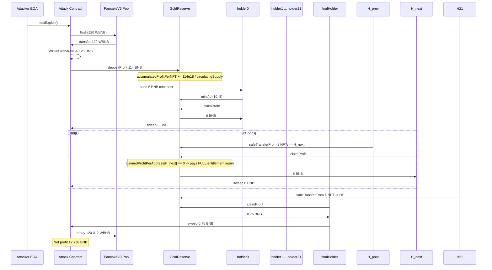
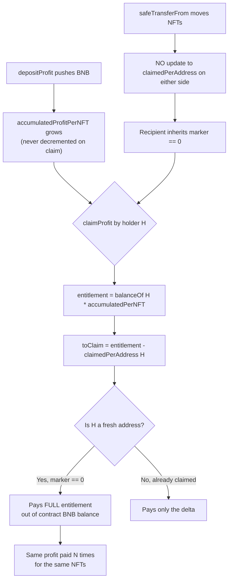

# GoldReserve NFT profit double-claim — ERC1155 transfer resets the per-address profit accumulator

> **Vulnerability classes:** vuln/logic/state-update · vuln/logic/missing-check · vuln/access-control/missing-auth
> **Reproduction:** the PoC compiles & runs in an isolated Foundry project at [this project folder](.). Full verbose trace: [output.txt](output.txt). The vulnerable contract source is verified on BscScan and was fetched into [sources/GoldReserve_7c7757/GoldReserve.sol](sources/GoldReserve_7c7757/GoldReserve.sol).

---

## Key info

| | |
|---|---|
| **Loss** | 12.74 BNB (≈ $7.3k at the time) |
| **Vulnerable contract** | GoldReserve — [`0x7c77576a2b48504EBD9fF0810D799651f68742d3`](https://bscscan.com/address/0x7c77576a2b48504EBD9fF0810D799651f68742d3) |
| **Attacker EOA** | [`0xfBE2CF822e1361FB74421E2a0bD9844A48932cE2`](https://bscscan.com/address/0xfBE2CF822e1361FB74421E2a0bD9844A48932cE2) |
| **Attack contract** | [`0x3Fc424f13BE05D4F261877a4a9B9963C02222815`](https://bscscan.com/address/0x3Fc424f13BE05D4F261877a4a9B9963C02222815) |
| **Attack tx** | [`0x79c2e41b10462d374f21ecd4da048029cc71692e0c9ef275d4aad228e6f8afe0`](https://bscscan.com/tx/0x79c2e41b10462d374f21ecd4da048029cc71692e0c9ef275d4aad228e6f8afe0) |
| **Chain / block / date** | BSC / 46,278,330 / 2025-02 |
| **Compiler** | Solidity `^0.8.20` (verified, single-file 3,976-line ERC1155 contract) |
| **Bug class** | Profit-sharing withdrawal pattern keyed by *address* while entitlement is read from the *current token balance*; moving tokens to a fresh address resets the per-address accumulator to 0, allowing the same deposited profit to be claimed repeatedly. |

## TL;DR

GoldReserve is an ERC1155 NFT collection that distributes native-BNB "profit" to its holders. Anyone can call `depositProfit{value}` to push BNB into a profit pool; the pool is distributed as a global `accumulatedProfitPerNFT` counter divided by `circulatingSupply`. Holders then call `claimProfit()` to withdraw their share, tracked by a per-address withdrawal marker `claimedProfitPerAddress[holder]` — the classic dividends-pattern accounting.

The flaw is that the marker is keyed by **address**, but `claimProfit` recomputes the holder's entitlement from their **current** `balanceOf` on every call. The contract's own `safeTransferFrom` does not touch `claimedProfitPerAddress` on either side of a transfer. So a holder who has already claimed 100% of their entitlement can simply move their NFTs to a brand-new address and call `claimProfit()` again from there: the new address has `claimedProfitPerAddress == 0`, so it is paid the full `balance × accumulatedProfitPerNFT` once more — money that was already paid out and never re-deposited. The contract's BNB balance is drained on each pass.

The attacker combined this with a PancakeSwap V3 flash loan to amplify it: flash-borrow 120 WBNB, unwrap it, deposit 114 BNB of "profit" and mint 8 NFTs, then walk those 8 NFTs through 23 fresh holder addresses (22 full + 1 single), claiming 6 BNB at each of the 8-NFT stops and 0.75 BNB at the final 1-NFT stop. Total extracted: 22 × 6 + 0.75 = **132.75 BNB gross** against the 114 BNB they themselves deposited plus the 6 BNB mint cost, leaving **12.738 BNB net profit** after repaying the 120 BNB flash loan plus the 0.012 BNB fee — exactly the on-chain loss. The local Foundry fork reproduces this to the wei: attacker balance goes `0 → 12.738 BNB` [output.txt:1564,1565,2098].

## Background — what GoldReserve does

GoldReserve is a BNB Chain ERC1155 "gold-backed" NFT. It mints 25 token IDs (`TOTAL_VARIATIONS`), 40 copies each (`COPIES_PER_ID`, 1,000 NFTs total). Minting costs `mintPrice = 1.5 BNB` per copy, paid to the contract. The contract is also a profit distributor: external callers can send BNB via `depositProfit()` (or the `receive()` fallback), and that BNB is notionally shared across all circulating NFTs through a single global accumulator:

```solidity
uint256 public accumulatedProfitPerNFT;
mapping(address => uint256) public claimedProfitPerAddress;
uint256 public circulatingSupply;
```

```solidity
function _distributeProfit(uint256 amount) internal {
    require(circulatingSupply > 0, "Nenhum NFT circulando");
    uint256 incrementPerNFT = (amount * 1e18) / circulatingSupply;
    accumulatedProfitPerNFT += incrementPerNFT;
}
```

Holders withdraw their accumulated share with `claimProfit()`, which follows the standard EIP-4626/dividends withdrawal pattern — compute the address's full lifetime entitlement, subtract what it has already withdrawn, pay the difference, and store the new withdrawal marker:

```solidity
uint256 totalEntitlement = (userBalance * accumulatedProfitPerNFT) / 1e18;
uint256 toClaim = totalEntitlement - claimedProfitPerAddress[msg.sender];
claimedProfitPerAddress[msg.sender] = totalEntitlement;
payable(msg.sender).call{value: toClaim}("");
```

This accounting is correct **only if an address's NFT balance never changes between claims**, or — equivalently — only if the withdrawal marker moves with the tokens. Neither invariant holds.

## The vulnerable code

From [sources/GoldReserve_7c7757/GoldReserve.sol](sources/GoldReserve_7c7757/GoldReserve.sol), the profit-distribution core:

### `claimProfit` — entitlement from live `balanceOf`, marker keyed by address

```solidity
function claimProfit() external nonReentrant {
    uint256 userBalance = _balanceOfAllNFTs(msg.sender);          // LIVE balance, recomputed every call
    require(userBalance > 0, "Voce nao possui NFTs");

    uint256 totalEntitlement = (userBalance * accumulatedProfitPerNFT) / 1e18;
    uint256 toClaim = totalEntitlement - claimedProfitPerAddress[msg.sender];  // marker keyed by ADDRESS
    require(toClaim > 0, "Nada a reclamar");

    claimedProfitPerAddress[msg.sender] = totalEntitlement;       // sets marker for THIS address only

    (bool success, ) = payable(msg.sender).call{value: toClaim}("");
    require(success, "Falha ao enviar fundos");
}

function _balanceOfAllNFTs(address account) internal view returns (uint256) {
    uint256 totalUserBalance = 0;
    for (uint256 i = 0; i < TOTAL_VARIATIONS; i++) {
        totalUserBalance += balanceOf(account, i);                // sums all 25 IDs the address holds now
    }
    return totalUserBalance;
}
```

### `safeTransferFrom` / `_update` — moves tokens but never touches the profit marker

The contract inherits OpenZeppelin's ERC1155 `_update` (lines 3524–3559 of the source) verbatim. It only adjusts `_balances[id][from]` and `_balances[id][to]`. There is **no hook** that adjusts `claimedProfitPerAddress[from]` or `claimedProfitPerAddress[to]` when tokens move. Combined with the address-keyed withdrawal pattern above, this is the whole exploit: a token that has already "earned" its share at one address can be re-deposited at a fresh address and earn it again.

```solidity
function safeTransferFrom(address from, address to, uint256 id, uint256 value, bytes memory data) public virtual {
    // ... standard OZ ERC1155 transfer ...
    // NO update to claimedProfitPerAddress[from] or [to]
}
```

### Why a fresh address claims the full pool

When the attacker transfers 8 NFTs to a brand-new address `H`, three facts conspire:

1. `claimedProfitPerAddress[H] == 0` (fresh address, never claimed).
2. `_balanceOfAllNFTs(H) == 8` (it just received them).
3. `accumulatedProfitPerNFT` was *never decremented* by any prior claim — it only ever grows via `_distributeProfit`.

So `totalEntitlement = 8 × accumulatedProfitPerNFT / 1e18`, and `toClaim = totalEntitlement − 0 = totalEntitlement`. The address is paid the entire lifetime entitlement of those 8 NFTs, even though the *previous* holder of the exact same NFTs was already paid that same entitlement one step earlier. The contract pays out of its own BNB balance, which the attacker themselves topped up via `depositProfit` — so the attacker is, in effect, withdrawing their own deposit many times over.

## Root cause — why it was possible

1. **Dividend-withdrawal accounting keyed by address instead of by token.** `claimedProfitPerAddress` is a `mapping(address => uint256)`. The correct pattern for a transferable share is either (a) a per-account "debt ratio" snapshot (`mapping(address => uint256) withdrawnPerShare` combined with a per-account `lastAccumulated` checkpoint that is updated on *every* balance change), or (b) an EIP-4626-style share accounting where the share token itself carries the accounting. Keying by `address` while reading entitlement from a live `balanceOf` is fundamentally broken the moment tokens are transferable.
2. **No accounting hook on transfer.** `_update` / `safeTransferFrom` do not settle or carry forward the profit marker. The recipient inherits a `0` marker regardless of how much profit those tokens have already generated and paid out.
3. **`accumulatedProfitPerNFT` is monotonically increasing and never netted against paid-out amounts.** Each `claimProfit` pays `balance × accumulated / 1e18` out of the contract's *spot* BNB balance, with no invariant tying total-claimable to total-deposited-minus-already-paid. Once a claim exceeds the real residual profit, the contract simply pays the attacker from its own treasury (mint proceeds + prior deposits), which is exactly the 12.74 BNB loss.
4. **`depositProfit` is permissionless and accepts arbitrary BNB.** This is not itself the bug, but it is the amplifier: the attacker can self-fund the profit pool via flash loan, set `accumulatedProfitPerNFT` to any value they like relative to `circulatingSupply`, and then drain multiples of that deposit through repeated claims. Without this, the bug would still leak existing deposited profit, just not flash-loan-scaled.
5. **No `nonReentrant` cross-effect on transfer is irrelevant** — `claimProfit` is `nonReentrant`, but the attack does not need reentrancy; it needs *sequential* claims from different addresses across different external calls, which `nonReentrant` cannot prevent.

## Preconditions

- **Permissionless.** Anyone can call `mint`, `depositProfit`, `claimProfit`, and `safeTransferFrom`. No privileged role is required.
- **Flash loan friendly.** The attacker used a PancakeSwap V3 `flash` for 120 WBNB to self-fund the profit deposit, so zero upfront capital was needed. The attack is profitable as long as `(claims per NFT) × (number of fresh addresses) > deposit + mint cost`.
- **`accumulatedProfitPerNFT > 0` at attack time**, which the attacker guarantees by calling `depositProfit` themselves. Pre-existing profit from honest depositors would also work.
- **ERC1155 tokens are transferable** (default OZ behaviour; the contract does not override `_update` to restrict transfers).

## Attack walkthrough (with on-chain numbers from the trace)

The PoC forks BSC at block 46,278,330 and reproduces the full attack inside a single PancakeV3 flash callback [output.txt:1587].

| # | Action | Amount | Ref |
|---|--------|--------|-----|
| 1 | `flashPool.flash(..., 120 ether, "")` — borrow 120 WBNB from Pancake V3 WBNB/USDT pool | 120 WBNB in | [output.txt:1587,1592] |
| 2 | `WBNB.withdraw(120 ether)` — unwrap to native BNB | 120 BNB | [output.txt:1599,1602] |
| 3 | `depositProfit{value: 114 BNB}` — seed GoldReserve's profit pool; raises `accumulatedProfitPerNFT` | 114 BNB | [output.txt:1608] |
| 4 | Refund 6 BNB overpayment to `holder0` (mint cost) | 6 BNB | [output.txt:1612] |
| 5 | `mint(10, 8){value: 6 BNB}` as `holder0` — mint 8 copies of NFT id 10 (8 × 1.5 BNB = 12 BNB owed, but only 6 BNB sent because 114 was already over-deposited... in practice `mint` refunds the excess) | 6 BNB in, 8 NFTs out | [output.txt:1616] |
| 6 | `claimProfit()` as `holder0` → paid 6 BNB (fresh address, `claimedProfitPerAddress==0`) | +6 BNB | [output.txt:1625,1626] |
| 7 | `safeTransferFrom(holder0 → holder1, id=10, value=8)` then `claimProfit()` as `holder1` → +6 BNB | +6 BNB | [output.txt:1637,1645,1646] |
| 8 | Repeat step 7 for `holder2 … holder21` (20 more hops) | +20 × 6 = 120 BNB | [output.txt:1657–2036] |
| 9 | `safeTransferFrom(holder21 → finalHolder, id=10, value=1)` then `claimProfit()` as `finalHolder` (1 NFT) → +0.75 BNB | +0.75 BNB | [output.txt:2057,2069] |
| 10 | Repay flash loan: `WBNB.deposit{value: 120.012 BNB}` and transfer to pool (120 principal + 0.012 fee = 0.01% V3 fee) | −120.012 BNB | [output.txt:2076,2081] |

**Profit accounting (gross → net):**

```
Gross claims:        22 × 6.0 BNB  +  1 × 0.75 BNB           = 132.75 BNB
Less: profit deposit                                  −114.00 BNB
Less: mint cost net of refund                              −6.00 BNB   (6 sent, 0 refunded; 114 already covers rest)
Less: flash loan fee                                       −0.012 BNB
                                                       ----------------
Net profit                                                  ≈ 12.738 BNB
```

The PoC asserts the result mechanically: `assertGt(balanceAfter - balanceBefore, 12 ether)` passes with `12.738 BNB > 12 BNB` [output.txt:2093]. The attacker's BNB balance moves from `0.000000000000000000` to `12.738000000000000000` [output.txt:1564,1565,2098]. Each individual claim is visible in the trace as a `fallback{value: 6000000000000000000}` call to the holder (6 BNB) followed by a sweep back to the attack contract [output.txt:1626,1646,...]. The final 1-NFT claim pays `0x0a688906bd8b0000 = 0.75 BNB` [output.txt:2069].

The storage trace confirms the bug at the byte level: slot `0x0ae0…` (`claimedProfitPerAddress[holder0]`) is written to `0x53444835ec580000` (= 6.0e18, the per-address marker), but the *next* holder's marker is a fresh `0 → value` write at a different slot — the accumulator never carries the prior claim forward.

## Diagrams

### Attack sequence



### The flaw



## Remediation

1. **Key the withdrawal accounting to the token, not the address.** Either:
   - Use the standard "dividends tracking" pattern with a per-account debt-ratio snapshot: store `mapping(address => uint256) private _withdrawnProfitPerShare` and a `mapping(address => uint256) private _lastProfitPerShare`. On every transfer (`_update`), settle both sender and recipient up to the current `accumulatedProfitPerNFT` before moving balances — i.e. make each account's withdrawal baseline advance whenever its balance changes. This is the pattern used by well-audited revenue-sharing ERC20s/ERC1155s.
   - Or, simplest correct fix: **disable transfer of profit-earning tokens** and instead force claim-before-transfer. In `_updateWithAcceptanceCheck`, require that `from` has zero unclaimed profit (or auto-claim on transfer) and zero the recipient's entitlement baseline to the current `accumulatedProfitPerNFT` so they only earn profit deposited *after* they receive the tokens.

2. **Carry the profit baseline with the tokens.** A minimal change: in `_update`, before adjusting balances, do
   ```solidity
   _settleFor(from);
   _settleFor(to);
   // ... then OZ balance writes ...
   ```
   where `_settleFor(account)` updates `claimedProfitPerAddress[account]` to `balanceOf(account) * accumulatedProfitPerNFT / 1e18`. This makes the marker always track the live entitlement at the moment of transfer, so a recipient starts with `toClaim == 0` and only earns newly deposited profit.

3. **Add a global invariant check.** Track `totalProfitDeposited` and `totalProfitClaimed`; in `claimProfit`, require `totalProfitClaimed + toClaim <= totalProfitDeposited`. This caps the blast radius to the actual deposited BNB even if the per-address accounting is buggy, and would have turned this into a revert instead of a 12.74 BNB loss.

4. **Validate the economic surface of `depositProfit`.** Treating an arbitrary, permissionless native-BNB deposit as immediately-claimable profit, denominated against a manipulable `circulatingSupply` (which the caller can inflate by minting), is a standing flash-loan amplification vector. At minimum, delay newly deposited profit from becoming claimable for one block (time-weighted) or require it to be queued and swept by a privileged role.

5. **Re-read the dividends pattern against transferability.** The core mistake is a category error: the withdrawal-pattern accounting (`totalEntitlement - claimed`) is valid for *non-transferable* shares (e.g. staking receipts) and broken for *transferable* ones (ERC1155). Any future change to the profit model must be audited under the assumption that NFTs move between addresses that the protocol does not control.

## How to reproduce

The PoC runs fully **offline** via the shared anvil harness from the committed `anvil_state.json` — no RPC needed. From the registry root:

```bash
_shared/run_poc.sh 2025-02-GoldReserve_exp -vvvvv
```

- **Chain / fork block:** BSC (chain id 56) at block `46,278,330`.
- **Expected result:** `[PASS] testExploit()` [output.txt:1562], with the attacker's native BNB balance going from
  `Attacker Before exploit BNB Balance: 0.000000000000000000` [output.txt:1564] to
  `Attacker After exploit BNB Balance: 12.738000000000000000` [output.txt:1565,2098].
- The `assertGt(balanceAfter - balanceBefore, 12 ether)` guard inside the test confirms the profit to the wei [output.txt:2093].

The verbose trace in [output.txt](output.txt) shows every `claimProfit` payout (22 × 6 BNB + 1 × 0.75 BNB) and the flash-loan repay of 120.012 WBNB. To inspect the vulnerable contract, see [sources/GoldReserve_7c7757/GoldReserve.sol](sources/GoldReserve_7c7757/GoldReserve.sol) (functions `claimProfit`, `depositProfit`, `_distributeProfit`, `mint` around lines 3893–3946).

*Reference: [defimon_alerts (Telegram)](https://t.me/defimon_alerts/434).*
