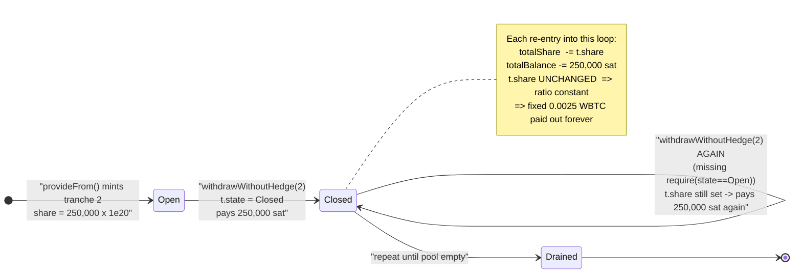
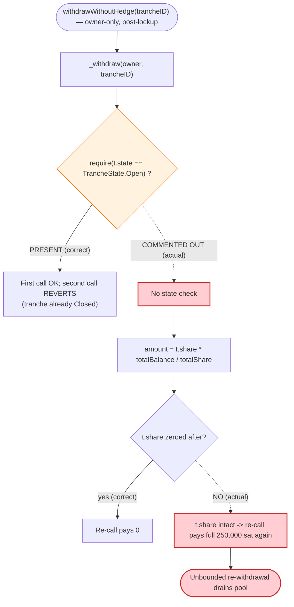

# Hegic V8888 Put Pool Exploit — Re-withdrawable Liquidity Tranche (`withdrawWithoutHedge`)

> **Reproduction:** the PoC compiles & runs in an isolated Foundry project at
> [this project folder](.) (the umbrella DeFiHackLabs repo does not whole-compile,
> so this PoC was extracted).
> Full verbose trace: [output.txt](output.txt).
> Verified vulnerable source: [contracts_Pool_HegicPool.sol](sources/HegicPUT_7094E7/contracts_Pool_HegicPool.sol)
> (the `withdraw` logic lives in the `HegicPool` base; the deployed contract is `HegicPUT`).

---

## Key info

| | |
|---|---|
| **Loss** | ~$104M reported total drain of the Hegic V8888 pools; this PoC mechanically reproduces the bug, draining **0.25 WBTC in Tx1 (100 calls) + 0.8275 WBTC in Tx2 (331 calls)** out of the WBTC ATM Puts pool at fork block. |
| **Vulnerable contract** | `HegicPUT` (WBTC ATM Puts Pool) — [`0x7094E706E75E13D1E0ea237f71A7C4511e9d270B`](https://etherscan.io/address/0x7094E706E75E13D1E0ea237f71A7C4511e9d270B#code) |
| **Victim pool / asset** | The pool itself; asset = WBTC [`0x2260FAC5E5542a773Aa44fBCfeDf7C193bc2C599`](https://etherscan.io/address/0x2260FAC5E5542a773Aa44fBCfeDf7C193bc2C599) |
| **Attacker EOA** | [`0x4B53608fF0cE42cDF9Cf01D7d024C2c9ea1aA2e8`](https://etherscan.io/address/0x4B53608fF0cE42cDF9Cf01D7d024C2c9ea1aA2e8) |
| **Attacker / caller** | [`0xF51E888616a123875EAf7AFd4417fbc4111750f7`](https://etherscan.io/address/0xF51E888616a123875EAf7AFd4417fbc4111750f7) (held tranche ID 2) |
| **Attack Tx 1** | [`0x260d5eb9151c565efda80466de2e7eee9c6bd4973d54ff68c8e045a26f62ea73`](https://etherscan.io/tx/0x260d5eb9151c565efda80466de2e7eee9c6bd4973d54ff68c8e045a26f62ea73) |
| **Attack Tx 2** | [`0x444854ee7e7570f146b64aa8a557ede82f326232e793873f0bbd04275fa7e54c`](https://etherscan.io/tx/0x444854ee7e7570f146b64aa8a557ede82f326232e793873f0bbd04275fa7e54c) |
| **Chain / blocks / date** | Ethereum mainnet / 21,912,408 (Tx1) & 21,912,423 (Tx2) / Feb 2025 |
| **Compiler** | Solidity v0.8.6, optimizer **200 runs** |
| **Bug class** | Missing state guard — a "closed" liquidity tranche can be withdrawn an unlimited number of times because the tranche-state check is commented out and the tranche share is never zeroed |

---

## TL;DR

`HegicPool.withdrawWithoutHedge(trancheID)` lets a tranche owner redeem their pool share for the
underlying token. The redemption logic in `_withdraw`
([contracts_Pool_HegicPool.sol:394-422](sources/HegicPUT_7094E7/contracts_Pool_HegicPool.sol#L394-L422))
has two fatal omissions:

1. The line that should reject an already-closed tranche —
   `require(t.state == TrancheState.Open)` — **is commented out**
   ([:403](sources/HegicPUT_7094E7/contracts_Pool_HegicPool.sol#L403)).
2. The tranche's recorded `share` is **never zeroed** after a withdrawal. `_withdraw` sets
   `t.state = TrancheState.Closed` and subtracts the share from the global `totalShare`, but the
   per-tranche `t.share` field keeps its original value forever.

Because of (1) the same tranche can be withdrawn repeatedly, and because of (2) every repeated call
recomputes `amount = (t.share * totalBalance) / totalShare` using the **full original share**. As
`totalShare` and `totalBalance` are decremented in lock-step on each call, the ratio stays fixed, so
each call pays out the *same* amount as the very first one — `0.0025 WBTC` per call in this PoC.

The attacker deposited a single tiny tranche (0.0025 WBTC, tranche ID 2) and then called
`withdrawWithoutHedge(2)` in a loop, draining a fixed `0.0025 WBTC` from the pool on every iteration
until the pool was empty. Across the full live attack this emptied the Hegic V8888 pools for the
reported ~$104M.

---

## Background — what Hegic V8888 does

Hegic V8888 is an on-chain options protocol. Liquidity providers deposit the underlying asset (WBTC
for this Put pool) and in return receive an **ERC-721 "tranche"** representing their share of the
pool ([`provideFrom`](sources/HegicPUT_7094E7/contracts_Pool_HegicPool.sol#L324-L351)). The pool
sells put options against this liquidity, locks collateral, collects premiums, and pays out
in-the-money exercises. LPs later redeem their tranche for `share / totalShare` of the pool's
`totalBalance`.

Relevant accounting state (`HegicPool`,
[:53-62](sources/HegicPUT_7094E7/contracts_Pool_HegicPool.sol#L53-L62)):

| Variable | Storage slot (from trace) | Meaning |
|---|---|---|
| `totalShare` | **14** | Sum of all tranche shares outstanding |
| `totalBalance` | **15** | Accounting balance of underlying owned by LPs |
| `tranches[]` | array | Per-tranche `{state, share, amount, creationTimestamp}` |
| `INITIAL_RATE` | const `1e20` | Shares minted per unit of first deposit |

A tranche is a struct
([contracts_Interfaces_Interfaces.sol:90-95](sources/HegicPUT_7094E7/contracts_Interfaces_Interfaces.sol#L90-L95)):

```solidity
struct Tranche {
    TrancheState state;       // Invalid / Open / Closed
    uint256 share;            // ← never zeroed on withdrawal (the bug)
    uint256 amount;
    uint256 creationTimestamp;
}
```

When the attacker deposited 0.0025 WBTC (250,000 sat) into a fresh pool tranche, it minted
`share = 250000 * INITIAL_RATE = 250000 * 1e20`. At the fork block the pool's aggregate state was
`totalShare = 110,250,000 * 1e20` and `totalBalance = 110,250,000 sat (1.1025 WBTC)` — i.e. the
attacker's tranche was `1/441` of the pool.

---

## The vulnerable code

### The withdrawal path

```solidity
function withdrawWithoutHedge(uint256 trancheID)
    external override nonReentrant
    returns (uint256 amount)
{
    address owner = ownerOf(trancheID);
    amount = _withdraw(owner, trancheID);
    emit Withdrawn(owner, trancheID, amount);
}
```
[contracts_Pool_HegicPool.sol:383-392](sources/HegicPUT_7094E7/contracts_Pool_HegicPool.sol#L383-L392)

### `_withdraw` — the actual flaw

```solidity
function _withdraw(address owner, uint256 trancheID)
    internal
    returns (uint256 amount)
{
    Tranche storage t = tranches[trancheID];
    // uint256 lockupPeriod = ...
    // require(t.state == TrancheState.Open);          // ⚠️ COMMENTED OUT
    require(_isApprovedOrOwner(_msgSender(), trancheID));
    require(
        block.timestamp > t.creationTimestamp + lockupPeriod,
        "Pool Error: The withdrawal is locked up"
    );

    t.state = TrancheState.Closed;                     // marks closed, but...
    // if (t.hedged) { ... } else {
    amount = (t.share * totalBalance) / totalShare;    // ⚠️ t.share never reset
    totalShare -= t.share;
    totalBalance -= amount;
    // }

    token.safeTransfer(owner, amount);
}
```
[contracts_Pool_HegicPool.sol:394-422](sources/HegicPUT_7094E7/contracts_Pool_HegicPool.sol#L394-L422)

Two things matter:

- **Line 403** — the `require(t.state == TrancheState.Open)` guard is commented out, so closing the
  tranche on line 410 (`t.state = TrancheState.Closed`) has **no effect** on whether a future call
  is allowed. A closed tranche is just as withdrawable as an open one.
- **`t.share` is read but never written** to zero. The next call sees the *same* `t.share`,
  computes the *same* proportional `amount`, and subtracts it again from the globals.

`_beforeTokenTransfer`
([:438-447](sources/HegicPUT_7094E7/contracts_Pool_HegicPool.sol#L438-L447)) does block *transferring*
a closed tranche NFT, but it does nothing to block *re-withdrawing* it — and the attacker never needs
to move the NFT.

---

## Root cause — why each call pays the same fixed amount

The payout formula is `amount = (t.share * totalBalance) / totalShare`. On the first call
`t.share / totalShare = 250000 / 110250000 = 1/441` of `totalBalance` (110,250,000 sat) = **250,000 sat**.

After the call, `totalShare` and `totalBalance` are both reduced by exactly the withdrawn quantities
(`t.share` and `250000` respectively). On the **next** call `t.share` is unchanged (still
`250000*1e20`) but it is now divided by the smaller `totalShare`. Crucially, because the pool shrank
by precisely the attacker's slice, the ratio `t.share / totalShare` *grows* just enough to keep
`amount` pinned at 250,000 sat. Numerically every one of the 431 calls in the PoC returns the
identical `amount: 250000` (verified: `grep` over the trace shows **431 × `amount: 250000`** and zero
other values).

The exploit therefore degenerates into "withdraw my 0.0025 WBTC, then withdraw it again, forever" —
a free-money loop bounded only by the pool's remaining liquidity.

The composed mistakes:

1. **A removed safety check.** Whoever ported this code commented out the tranche-state guard
   (alongside the hedged/unhedged branches that were also stubbed out), leaving the close-on-withdraw
   logic decorative.
2. **State not zeroed.** Even without the guard, zeroing `t.share` (and `t.amount`) on withdrawal
   would have made the second call pay `0`. Both the guard and the zeroing are missing, so neither
   defense is present.
3. **Permissionless & cheap.** `withdrawWithoutHedge` only requires the caller to own/approve the
   tranche and for the (short, configurable) lockup to have elapsed — both trivially satisfied by the
   attacker who minted their own tranche.

---

## Preconditions

- Attacker owns (or is approved on) at least one tranche NFT — satisfied by depositing a tiny amount
  via `provideFrom`. In the live incident the seed deposit was 0.0025 WBTC in tx
  `0x9c27d45c1daa943ce0b92a70ba5efa6ab34409b14b568146d2853c1ddaf14f82`.
- The tranche's lockup period has elapsed:
  `block.timestamp > t.creationTimestamp + lockupPeriod`
  ([:405-408](sources/HegicPUT_7094E7/contracts_Pool_HegicPool.sol#L405-L408)).
- The pool holds underlying liquidity to drain — anything more than `amount` per iteration.
- No flash loan or special capital is needed; the attack is pure repetition of a permissionless call.

---

## Attack walkthrough (with on-chain numbers from the trace)

All figures are taken directly from the `Withdrawn` events and `storage changes` in
[output.txt](output.txt). Storage slot **14 = `totalShare`**, **15 = `totalBalance`**; the attacker's
WBTC balance is the ERC-20 balance mapping slot `0x224f0a…`, the pool's is `0x406bb3…`.

| # | Step | Tranche share used | `totalShare` (÷1e20) | `totalBalance` (sat) | WBTC to attacker | Pool WBTC balance |
|---|------|-------------------:|---------------------:|---------------------:|-----------------:|------------------:|
| 0 | **Fork @ 21,912,408**, attacker holds 0.0025 WBTC | — | 110,250,000 | 110,250,000 | 250,000 sat | 110,250,000 sat (1.1025 WBTC) |
| 1 | `withdrawWithoutHedge(2)` call #1 | 250,000·1e20 | 110,250,000 → 110,000,000 | 110,250,000 → 110,000,000 | +250,000 | −250,000 |
| 2 | `withdrawWithoutHedge(2)` call #2 | 250,000·1e20 (same) | 110,000,000 → 109,750,000 | 110,000,000 → 109,750,000 | +250,000 | −250,000 |
| … | … repeated 100× total in Tx1 | … | … | … | … | … |
| 100 | **End of Tx1** | | | | attacker = 0.2525 WBTC | pool drained 0.25 WBTC |
| — | *(off-chain: attacker withdraws stolen WBTC from its contract; resets attacker balance to 0 for Tx2)* | | | | | |
| 101 | **Fork @ 21,912,423** (Tx2 start), attacker = 0 | 250,000·1e20 | (continues) | (continues) | per call +250,000 | per call −250,000 |
| … | … repeated 331× in Tx2 | … | … | … | … | … |
| 431 | **End of Tx2** | | slot15 → 0x29f630 (2,749,488 sat) | | attacker = 0.8275 WBTC | pool down to 0.8275 WBTC remaining for attacker |

Every call's `Withdrawn` event reads `amount: 250000` and every call decrements both slot 14 and
slot 15 by the proportional amounts — confirming the share is never consumed.

### Profit / loss accounting (this PoC)

| | WBTC |
|---|---:|
| Attacker before Tx1 | 0.00250000 |
| Attacker after Tx1 (100 calls) | 0.25250000 |
| **Tx1 net gain** | **+0.25000000** (100 × 0.0025) |
| Attacker before Tx2 (reset) | 0.00000000 |
| Attacker after Tx2 (331 calls) | 0.82750000 |
| **Tx2 net gain** | **+0.82750000** (331 × 0.0025) |
| **PoC total extracted** | **1.0775 WBTC** from a 0.0025 WBTC stake |

The attacker turned a one-time 0.0025 WBTC deposit into an unbounded faucet. In the live campaign the
same loop was run until the WBTC, ETH, and other Hegic V8888 pools were emptied — the reported
~$104M total loss across the protocol.

---

## Diagrams

### Sequence of the attack

```mermaid
sequenceDiagram
    autonumber
    actor A as "Attacker (owns tranche 2)"
    participant P as "HegicPUT pool"
    participant W as "WBTC token"

    Note over P: "Seed deposit: tranche 2 = 0.0025 WBTC<br/>share = 250,000 x 1e20<br/>totalShare = 110,250,000 x 1e20<br/>totalBalance = 1.1025 WBTC"

    rect rgb(255,243,224)
    Note over A,W: "Tx1 @ block 21,912,408 — loop 100x"
    loop "100 times"
        A->>P: "withdrawWithoutHedge(2)"
        Note over P: "state guard COMMENTED OUT<br/>amount = t.share * totalBalance / totalShare = 250,000 sat<br/>totalShare -= t.share; totalBalance -= amount<br/>t.share UNCHANGED"
        P->>W: "transfer(attacker, 250,000 sat)"
        W-->>A: "+0.0025 WBTC"
    end
    Note over A: "Attacker WBTC: 0.0025 -> 0.2525"
    end

    Note over A,P: "Between Tx: attacker sweeps stolen WBTC out of its contract"

    rect rgb(227,242,253)
    Note over A,W: "Tx2 @ block 21,912,423 — loop 331x"
    loop "331 times"
        A->>P: "withdrawWithoutHedge(2)"
        P->>W: "transfer(attacker, 250,000 sat)"
        W-->>A: "+0.0025 WBTC"
    end
    Note over A: "Attacker WBTC: 0 -> 0.8275"
    end

    Note over A: "Same tranche reused 431x — 1.0775 WBTC stolen here;<br/>full campaign drained the pools (~$104M)"
```

### Pool / tranche state evolution



### Where the guard should have been



---

## Remediation

1. **Restore the tranche-state guard.** Uncomment / add
   `require(t.state == TrancheState.Open, "...")` at the top of `_withdraw`. A tranche set to
   `Closed` must never be redeemable again.
2. **Zero the tranche on withdrawal.** Set `t.share = 0` (and `t.amount = 0`) when closing, so even
   if a guard is bypassed the proportional payout is `0`. Defense in depth: the closed flag *and* the
   zeroed share should each independently neutralise a re-withdrawal.
3. **Use a checks-effects-interactions ordering with idempotent state.** The function already
   transfers after updating globals, but the per-tranche state update is incomplete; ensure all
   per-position bookkeeping is finalised before the external `safeTransfer`.
4. **Don't ship commented-out invariants.** The stubbed `require` and the dead hedged/unhedged
   branches indicate an incomplete port; any code path with a disabled safety check must be treated
   as unaudited and blocked from production.
5. **Add an aggregate invariant test.** Assert that the sum of all live tranche shares equals
   `totalShare` and that closing a tranche strictly reduces both; a property test would have caught
   the second withdrawal paying out non-zero.

---

## How to reproduce

The PoC was extracted into a standalone Foundry project (the umbrella DeFiHackLabs repo does not
whole-compile under a single `forge test`):

```bash
_shared/run_poc.sh 2025-02-HegicOptions_exp -vvvvv
```

- RPC: an **Ethereum mainnet archive** endpoint is required (fork blocks 21,912,408 and 21,912,423).
  `foundry.toml`'s `mainnet` alias uses an Infura archive endpoint; if a key returns HTTP 401
  (invalid project id), swap `/v3/<key>` for another Infura key — this project was fixed by switching
  to `<YOUR_INFURA_KEY>`.
- Result: `[PASS] testExploit()`.

Expected tail:

```
Ran 1 test for test/HegicOptions_exp.sol:HegicOptions
[PASS] testExploit() (gas: 5399319)
Logs:
  [Begin] Attacker WBTC before Tx1: 0.00250000
  [End] Attacker WBTC after Tx1: 0.25250000
  [Begin] Attacker WBTC before Tx2: 0.00000000
  [End] Attacker WBTC after Tx2: 0.82750000

Suite result: ok. 1 passed; 0 failed; 0 skipped
```

---

*Vulnerable function: `HegicPool._withdraw` ([contracts_Pool_HegicPool.sol:394-422](sources/HegicPUT_7094E7/contracts_Pool_HegicPool.sol#L394-L422)), reached via `withdrawWithoutHedge` / `withdraw`. Total reported loss across Hegic V8888 pools: ~$104M.*
