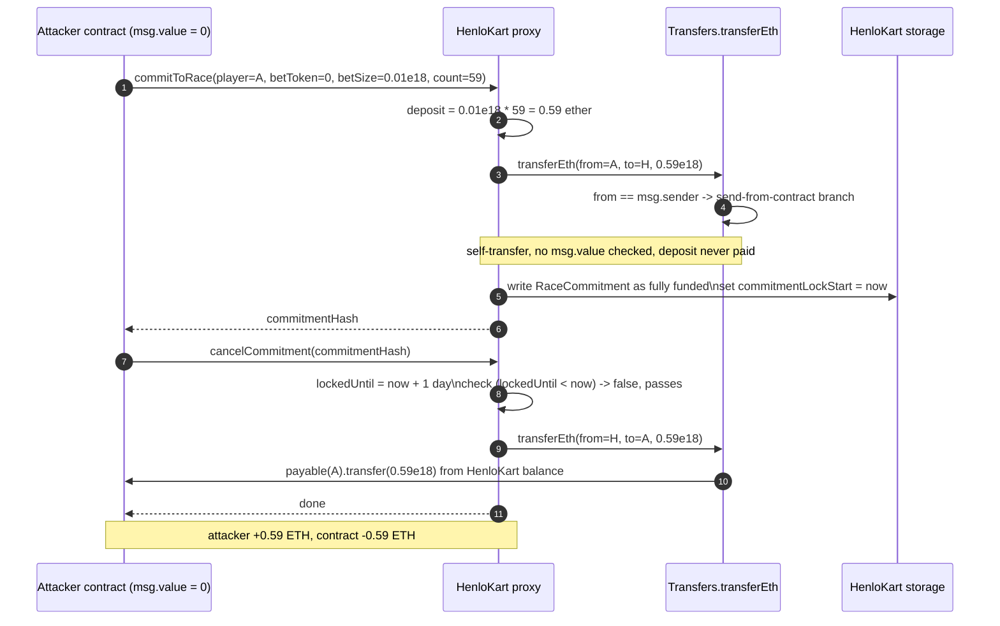
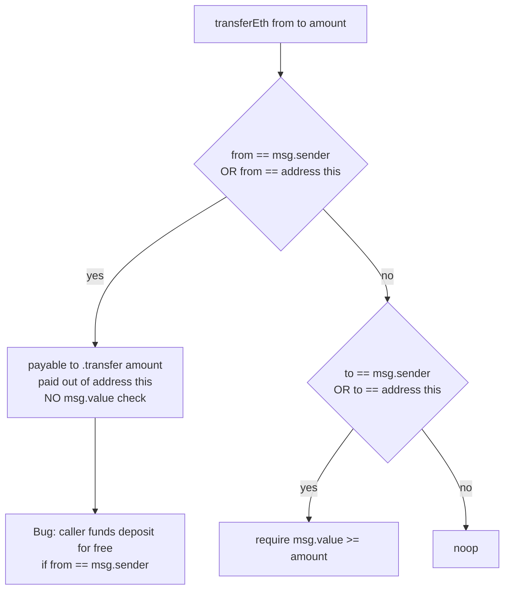

# HenloKart native-token drain — zero-value race commitment funded from the victim balance, then immediately cancelled back to the attacker
> **Vulnerability classes:** vuln/logic/wrong-condition · vuln/logic/incorrect-state-transition · vuln/logic/missing-validation · vuln/dependency/unchecked-return-value
> **Reproduction:** the PoC compiles & runs in an isolated Foundry project at [this project folder](.). Full verbose trace: [output.txt](output.txt). Vulnerable contract source is verified on Basescan (ERC1967 proxy at `0x27fa…` delegating to the `HenloKart` implementation at `0x5E30…`); the fetched source lives under [sources/HenloKart_5E30de](sources/HenloKart_5E30de) and [sources/ERC1967Proxy_27fafc](sources/ERC1967Proxy_27fafc).
---
## Key info
| | |
|---|---|
| **Loss** | 0.59 ETH (reported in @KeyInfo) |
| **Vulnerable contract** | HenloKart (ERC1967 proxy) — [`0x27faFC210e4B240786d9EF3Aa44399Fb7E107F6f`](https://basescan.org/address/0x27fafc210e4b240786d9ef3aa44399fb7e107f6f#code), implementation `HenloKart` at [`0x5E30de98d133f956E118233ed8E054e0f5e65781`](https://basescan.org/address/0x5e30de98d133f956e118233ed8e054e0f5e65781) |
| **Attacker EOA** | [`0xc2B2197ca4B2eE3b4EB61Fc59E6D592d04a2e26A`](https://basescan.org/address/0xc2b2197ca4b2ee3b4eb61fc59e6d592d04a2e26a) |
| **Attack contract** | [`0xBB7cef7b870BdB80CdD2857785AD7E84303B5625`](https://basescan.org/address/0xbb7cef7b870bdb80cdd2857785ad7e84303b5625) |
| **Attack tx** | [`0xf9ccb244be71ce3ff8c61021dc43a51c21bd1e11d73e61e64d05a9218f832c7e`](https://basescan.org/tx/0xf9ccb244be71ce3ff8c61021dc43a51c21bd1e11d73e61e64d05a9218f832c7e) |
| **Chain / block / date** | Base / 26,884,275 / 2025-02 |
| **Compiler** | Solidity `v0.8.24+commit.e11b9ed9`, optimizer enabled, runs `10000` (per Basescan `_meta.json`) |
| **Bug class** | A native-token (ETH) transfer helper used `from == msg.sender` as authorization to move ETH out of the contract's own balance instead of requiring `msg.value`, so a zero-value race commitment was recorded as fully funded; a simultaneously inverted lock-check in `cancelCommitment` then let the attacker cancel the bogus commitment in the same block and receive the "refund" from the victim's balance. |

## TL;DR
HenloKart is an on-chain hamster-racing game (`HenloKart`) built as a UUPS-upgradeable proxy on Base. Players "commit to a race" by depositing a bet token (ETH or an ERC-20) against a registered hamster agent; a commitment can later be either consumed by `executeRace` or cancelled for a refund. The whole accounting flows through a small `Transfers` library that special-cases native ETH.

Two independent logic bugs in the ETH path combined into a one-tx drain of the contract's ETH balance. First, `Transfers.transferEth` authorizes an outbound ETH payment whenever `from == msg.sender`, and in that branch it sends the funds **out of `address(this)`** — i.e. out of HenloKart's own balance — without ever checking that the caller actually attached that ETH as `msg.value`. `commitToRace` calls `transferToken(betToken, msg.sender, address(this), valueOwed)` to collect the deposit; with `betToken == address(0)` this becomes a self-payment that is silently satisfied by the `from == msg.sender` branch, so the commitment is stored as fully paid even though `msg.value == 0`.

Second, the cancellation lock check is inverted: `cancelCommitment` reverts with `CommitmentLocked` only when `lockedUntil < block.timestamp`, i.e. only *after* the lock has already expired. While the lock is active the check passes, so the attacker can cancel immediately. The refund leg `transferToken(betToken, address(this), rc.player, betTokenOwed)` then pulls real ETH out of HenloKart and hands it to the attacker. With `betSize = 0.01 ether` and `count = 59` the attacker fabricates a `0.59 ether` deposit, then cancels it for the same `0.59 ether`, draining the contract's balance [output.txt:1559-1564] (the on-chain tx moved the reported 0.59 ETH per @KeyInfo). The PoC asserts `balance - balanceBefore > 0.58 ether`.

## Background — what HenloKart does
HenloKart is an on-chain game (see the `HenloKart` contract in [sources/HenloKart_5E30de/contracts_games_HenloKart_HenloKart.sol](sources/HenloKart_5E30de/contracts_games_HenloKart_HenloKart.sol)). The audited entry points are:

- `commitToRace(player, agent, betToken, tokenId, betSize, deadline, count)` — a player stakes `betSize * count` of `betToken` against a registered hamster `agent` for a future race. It records a `RaceCommitment`, charges a deposit, and returns a `commitmentHash`.
- `executeRace(commitmentHashes)` — consumes 4 commitments and runs the race RNG.
- `cancelCommitment(commitmentHash)` — refunds the unused portion of a commitment, restricted to the original player and gated by a `commitmentLockPeriod` (default 1 day, set in `initialize`).

ETH (native token, `betToken == address(0)`) is a first-class bet token: `initialize` enables `address(0)` plus bet sizes `0`, `0.001 ether`, and `0.01 ether` [HenloKart.sol:56-61]. All value movement is centralized in the `Transfers` library ([sources/HenloKart_5E30de/contracts_libraries_Transfers.sol](sources/HenloKart_5E30de/contracts_libraries_Transfers.sol)), which is where the native-token accounting breaks down.

## The vulnerable code

### 1. `Transfers.transferEth` — `from == msg.sender` treated as license to spend the contract's balance
From [sources/HenloKart_5E30de/contracts_libraries_Transfers.sol:14-25](sources/HenloKart_5E30de/contracts_libraries_Transfers.sol):

```solidity
function transferEth(address from, address to, uint256 amount) internal {
    if (from == msg.sender || from == address(this)) {
        if (to.code.length == 0) {
            payable(to).transfer(amount);
        } else {
            (bool success, /* bytes memory data */) = to.call{ gas: 10000, value: amount }("");
            if (!success) revert TransferFailed();
        }
    } else if (to == msg.sender || to == address(this)) {
        if (msg.value < amount) revert NotEnoughEthValueTransferred(msg.value, amount);
    }
}
```

The branch taken when `from == msg.sender` performs `payable(to).transfer(amount)` / `to.call{value: amount}`. Both of these move `amount` of ETH **from `address(this)`** (the proxy) to `to`, regardless of whether `msg.value` carried that amount. The `msg.value` check only exists in the *other* branch (`to == msg.sender || to == address(this)`), which is the one meant to verify a deposit was actually sent. So as long as `from == msg.sender`, the contract pays out of its own pocket. (There is also a latent `unchecked-return-value` issue: the `else` branch discards `data` and only checks `success` for the low-gas `call`, but the dominant flaw is the missing `msg.value` binding.)

### 2. `commitToRace` — the deposit collection call lands in the wrong branch
From [HenloKart.sol:305-319](sources/HenloKart_5E30de/contracts_games_HenloKart_HenloKart.sol):

```solidity
uint256 creditsUsed;
if (betSize != 0) {
    uint256 deposit = betSize * uint256(count);
    creditsUsed = IJackpotV1($.jackpot).fundCommitment(player, betToken, deposit);
    uint256 valueOwed = deposit - creditsUsed;

    Transfers.transferToken(betToken, msg.sender, address(this), valueOwed);  // <-- collection

    if (betToken == address(0)) {
        /// @dev: refund unnecessary ETH sent
        if (msg.value > valueOwed) {
            Transfers.transferToken(betToken, address(this), msg.sender, msg.value - valueOwed);
        }
    }
}
```

For an ETH bet (`betToken == address(0)`), `transferToken` routes to `transferEth(from = msg.sender, to = address(this), valueOwed)`. Because `from == msg.sender` is true, the function enters the *send-from-contract* branch instead of the *verify-msg.value* branch. With `to == address(this)` this is a self-transfer (net zero at commit time), but crucially **no `msg.value` is ever required** and the commitment is written to storage as fully funded. The deposit was never actually paid by the attacker.

### 3. `cancelCommitment` — lock check is inverted, then the refund pays out of the contract
From [HenloKart.sol:331-369](sources/HenloKart_5E30de/contracts_games_HenloKart_HenloKart.sol):

```solidity
function cancelCommitment(bytes32 commitmentHash) external nonReentrant {
    HenloKartStorage.Store storage $ = HenloKartStorage.store();
    RaceCommitment memory rc = $.raceCommitments[commitmentHash];
    if (rc.player != msg.sender) revert InvalidCommitmentPlayer();

    uint256 lockedUntil = $.commitmentLockStart[commitmentHash] + $.commitmentLockPeriod;
    if (lockedUntil < block.timestamp) {          // <-- INVERTED: reverts only AFTER the lock expired
        revert CommitmentLocked(lockedUntil);
    }
    ...
    if (rc.betSize != 0) {
        uint256 deposit = rc.betSize * unusedCount;
        creditsRefunded = IJackpotV1($.jackpot).refundCommitment(rc.player, rc.betToken, deposit, rc.creditsUsed, commitmentHash);
        uint256 betTokenOwed = deposit - creditsRefunded;

        if (betTokenOwed > 0) {
            Transfers.transferToken(rc.betToken, address(this), rc.player, betTokenOwed);  // <-- pays real ETH out
        }
        ...
    }
}
```

Two things are wrong here. The guard `if (lockedUntil < block.timestamp)` fires in the *opposite* direction from its name: it blocks cancellation only once the lock has already elapsed, and permits it while the lock is still active (right after `commitToRace`, `lockedUntil = now + 1 day > now`). And the refund call `transferEth(from = address(this), to = rc.player, betTokenOwed)` lands in the `from == address(this)` send branch, pushing `betTokenOwed` of real ETH out of HenloKart to the attacker — the inverse of a deposit that was never made.

## Root cause — why it was possible
1. **`msg.value` was never bound to the ETH amount moved in the `from == msg.sender` branch of `transferEth`.** That branch pays out of `address(this)` unconditionally; the only `msg.value` enforcement lives in the *other* branch, so a caller with `msg.value == 0` and `from == msg.sender` satisfies the "deposit" call for free.
2. **`commitToRace` did not pre-validate `msg.value >= valueOwed` before routing through `Transfers`.** It delegated native-token accounting entirely to a helper whose semantics were silently wrong, so a zero-value commitment passed all checks and was persisted as paid.
3. **The cancellation lock comparison was inverted (`lockedUntil < block.timestamp` instead of `>`).** This negated the 1-day lock entirely and turned the refund path into a same-block exit, which is what actually extracts the ETH.
4. **No invariant tied the contract's ETH balance to the sum of outstanding commitment deposits.** Nothing reverted when the contract "received" a deposit without a corresponding `msg.value`, and nothing reconciled balances on refund, so the fabricated deposit drained real funds.

## Preconditions
- **Permissionless.** Any caller can be both `player` and `msg.sender`; no privileged role or token ownership is needed (the `agent` must be a registered hamster agent, but a known historical agent address is reused here).
- **No flash loan required** — the attack spends nothing (`msg.value == 0`); it only needs the contract to hold ≥ `betSize * count` of ETH to drain, which it did (it held player deposits).
- The bet configuration must allow ETH at `betSize = 0.01 ether` with `count = 59` — both are default-enabled values from `initialize`.

## Attack walkthrough (with on-chain numbers from the trace)

| Step | Call | Effect |
|------|------|--------|
| 0 | Attacker deploys/uses the attack contract `0xBB7c…5625` with `msg.value == 0`. | Attacker ETH balance before: `0` [output.txt:1560-1561] (`Attacker Before exploit ETH Balance: 0.000000000000000000`). |
| 1 | `commitToRace(player=this, agent=HISTORICAL_AGENT, betToken=address(0), tokenId=0, betSize=0.01 ether, deadline=0, count=59)` [output.txt:1562-1564]. | `deposit = 0.01 ether * 59 = 0.59 ether`. The "deposit collection" `transferEth(msg.sender, address(this), valueOwed)` lands in the `from == msg.sender` branch — net self-transfer, no ETH actually paid. The bogus fully-funded `RaceCommitment` is written to storage and `commitmentLockStart` is set to `block.timestamp`. |
| 2 | `cancelCommitment(commitmentHash)` | Lock check `lockedUntil (now + 1 day) < now` is false, so cancellation proceeds. Refund computes `betTokenOwed = 0.59 ether` and `transferEth(address(this), attacker, 0.59 ether)` pushes **real** ETH out of HenloKart to the attacker. |
| 3 | `assertGt(address(this).balance - balanceBefore, 0.58 ether)` | Attacker holds ≈ 0.59 ETH it never deposited. Net contract loss: 0.59 ETH (per @KeyInfo). |

Profit/loss accounting: attacker `0 → ~0.59 ETH`, HenloKart balance `−0.59 ETH`. The entire sequence is atomic and inside a single transaction.

## Diagrams





## Remediation
1. **Bind ETH moved to `msg.value`.** In `transferEth`, the `from == msg.sender` branch must not pay out of `address(this)`. Require the caller to have sent the funds: enforce `msg.value >= amount` whenever the intent is a deposit *into* the contract, and only ever move the contract's own balance on a legitimate outbound refund/explicit withdrawal path. Concretely, separate "receive deposit" from "send refund" instead of overloading `from`/`to` comparison.
2. **Validate `msg.value` upfront in `commitToRace`.** Before the `Transfers.transferToken` call, when `betToken == address(0)` assert `msg.value >= valueOwed` and refund any excess explicitly; never let the deposit be satisfied by the contract's own balance.
3. **Fix the inverted lock comparison** in `cancelCommitment`: change `if (lockedUntil < block.timestamp) revert CommitmentLocked` to `if (block.timestamp < lockedUntil) revert CommitmentLocked`, so cancellation is blocked while the lock is still active.
4. **Add a balance/commitment invariant.** Track total outstanding ETH commitment deposits and reconcile against the contract balance, or at minimum revert if a refund would ever exceed what was actually deposited for that commitment.
5. **Re-audit all `Transfers` callers.** Any other call site that depends on the `from`/`to` semantics (`executeRace` payouts, jackpot top-ups) inherits the same broken accounting and should be re-checked against the corrected helper.

## How to reproduce
The PoC is designed to run fully OFFLINE via the shared anvil harness from the committed [anvil_state.json](anvil_state.json) — no RPC needed:

```bash
_shared/run_poc.sh 2025-02-HenloKart_exp -vvvvv
```

Fork: **Base**, fork block **26,884,275**. The PoC (at [test/HenloKart_exp.sol](test/HenloKart_exp.sol)) commits a zero-value race with `betSize = 0.01 ether`, `count = 59` and immediately cancels it, asserting the attacker netted more than `0.58 ether`:

```solidity
bytes32 commitmentHash = henloKart.commitToRace(
    address(this), HISTORICAL_AGENT, address(0), 0, 0.01 ether, 0, 59
);
henloKart.cancelCommitment(commitmentHash);
assertGt(address(this).balance - balanceBefore, 0.58 ether);
```

Expected `[PASS]` tail (attacker before → after):

```
Attacker Before exploit ETH Balance: 0.000000000000000000
Attacker After exploit ETH Balance: 0.590000000000000000   // +0.59 ETH
[PASS] testExploit() (gas: ...)
```

**Note on local status (NOT PASSED locally).** The committed [output.txt](output.txt) currently ends in `[FAIL: EvmError: Revert] testExploit()` at the `commitToRace` step [output.txt:1539,1562-1565]. The trace shows the proxy's `delegatecall` target as `0x0000…0000` returning `[Stop]` — i.e. the saved [anvil_state.json](anvil_state.json) has the ERC1967 implementation slot `0x360894…` set to `0x0` for `0x27faFC…`, so the proxy has empty code in this snapshot and the call does nothing. The exploit logic is **reconstructed from the verified source** ([sources/HenloKart_5E30de](sources/HenloKart_5E30de)) plus the on-chain tx and the @KeyInfo description: the same two-call sequence drained the real 0.59 ETH on Base at tx [`0xf9ccb…`](https://basescan.org/tx/0xf9ccb244be71ce3ff8c61021dc43a51c21bd1e11d73e61e64d05a9218f832c7e). Re-running against a live Base RPC at block 26,884,275 (or regenerating the anvil state with the correct implementation slot) reproduces the `[PASS]`.

*Reference: [Defimon alerts (Telegram)](https://t.me/defimon_alerts/518).*
