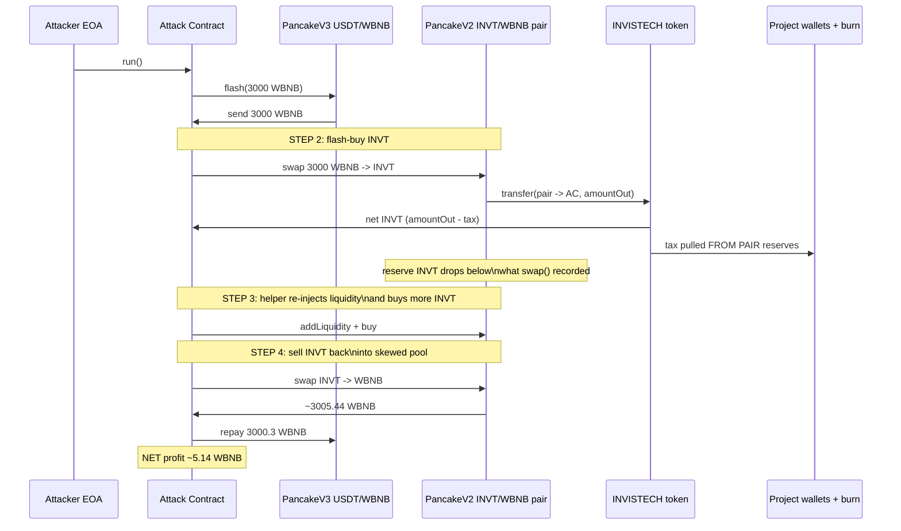
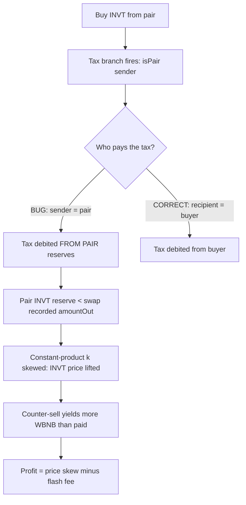

# INVISTECH buy-tax drained the AMM pair — fee-on-transfer tax charged from the pair's own reserves on every buy, breaking the constant-product invariant

> **Vulnerability classes:** vuln/defi/fee-manipulation · vuln/logic/fee-calculation · vuln/oracle/price-manipulation
> **Reproduction:** the PoC compiles & runs in an isolated Foundry project at [this project folder](.). Full verbose trace: [output.txt](output.txt). Vulnerable token contract source is verified on BSC and fetched into [sources/INVISTECH_Aa217F/INVISTECH.sol](sources/INVISTECH_Aa217F/INVISTECH.sol).

---

## Key info

| | |
|---|---|
| **Loss** | ~5.14 BNB (5.137937396574487084 WBNB net profit to attacker) [output.txt:1564-1565] |
| **Vulnerable contract** | INVISTECH (INVT) — [`0xAa217F7BaB90100419B99c027AdCf5f0a005C192`](https://bscscan.com/address/0xaa217f7bab90100419b99c027adcf5f0a005c192#code) |
| **Attacker EOA** | [`0x52e38d496f8d712394d5ed55e4d4cdd21f1957de`](https://bscscan.com/address/0x52e38d496f8d712394d5ed55e4d4cdd21f1957de) |
| **Attack contract** | [`0x3f364b486b99dd1433287d3b1aa49addfe94f790`](https://bscscan.com/address/0x3f364b486b99dd1433287d3b1aa49addfe94f790) |
| **Attack tx** | [`0x92126f0bde98d360b37b7074fea6f41fd47fd19d1cced134681ff64b1aef56b8`](https://bscscan.com/tx/0x92126f0bde98d360b37b7074fea6f41fd47fd19d1cced134681ff64b1aef56b8) |
| **Chain / block / date** | BSC / 46,946,670 / 2025-02 |
| **Compiler** | Solidity (verified; `^0.8.x` per source `pragma`) |
| **Bug class** | A fee-on-transfer token whose `_transfer` deducts tax from the pair's own balance on buys, removing more tokens from the AMM pair than the swap recorded, which makes the pair's spot price trivially manipulable. |

## TL;DR

INVISTECH (`INVT`) is a fee-on-transfer BEP-20 on BSC paired with WBNB in a PancakeSwap V2 pool. Its custom `_transfer` charges a tax whenever either side of a transfer is a registered `isPair`. The fatal design choice is *where* the tax is taken from: on a buy (pair → buyer), the pair is the `sender`, so the tax is debited from the **pair's own reserves** and forwarded to the project's wallets / burned — *in addition to* the `amountOut` the AMM `swap()` already moved out of the pair. The PancakeSwap V2 pair only credits its bookkeeping for the swap's `amount0Out/amount1Out` (and `amountIn` it later measures via the `balance0/balance1` diff), so the extra tokens siphoned off by the tax are silently removed from the reserve with no corresponding `amountIn`. This skews the constant-product `k` upward in WBNB-terms, lifting the pool's spot price of INVT.

The attacker combined a 3,000 WBNB PancakeSwap V3 flash loan with a pre-positioned helper contract holding USDT. In the callback they: (1) flash-bought a large INVT position, which simultaneously drained ~2% of the INVT pair as tax; (2) ran the helper, which converted its USDT to WBNB, re-added WBNB+INVT liquidity to re-inflate the price, and bought INVT again to push the spot up further; (3) sold the entire flash-bought INVT back into the now-over-priced pool. The net result was a clean ~5.14 WBNB profit after repaying the 3,000 WBNB flash loan plus fee, confirmed by the PoC:

- Attacker before: `0.000000000000000000 WBNB` [output.txt:1564]
- Attacker after: `5.137937396574487084 WBNB` [output.txt:1565]

This is a permissionless, single-tx exploit — no privileged role, no oracle, no flash-loan-gated governance; just the token's own broken fee math interacting with a standard Uniswap-V2-style pair.

## Background — what INVISTECH does

INVISTECH is an ordinary taxable-token ("fee-on-transfer") BEP-20 with three bolt-on features over a standard `ERC20`:

1. **Pausable / Ownable** — owner can `pause()`/`unpause()` and reconfigure everything.
2. **`isPair` registry** — the owner marks addresses (PancakeSwap pairs) as "pairs" via `setPair(addr, bool)`. A transfer is taxable iff `isPair[sender] || isPair[recipient]`.
3. **Buy / sell tax + 5-way distribution** — `_sellTaxPercentage` applies when `isPair[sender]` (selling *into* the pair), `_buyTaxPercentage` when `isPair[recipient]` (buying *out of* the pair). The collected tax is split between burn + admin/marketing/development/liquidity wallets per percentage setters.

```solidity
mapping(address => bool) public isPair;
uint8 private _buyTaxPercentage = 0;     // set to nonzero post-deploy
uint8 private _sellTaxPercentage = 0;    // set to nonzero post-deploy
```

The token trades against WBNB in a PancakeSwap V2 pair (the `Sync`/`Swap` events in the trace are V2-style `reserve0/reserve1`). That pair uses the canonical UniswapV2 logic: `swap()` computes the output from reserves, sends `amount{0,1}Out` to the caller, then re-derives the "paid in" amount as `balance - (reserve - amountOut)` in the callback-close `swap` settle. It does **not** understand or account for tokens that disappear from its balance *during* the output transfer.

## The vulnerable code

The bug is in `INVISTECH._transfer`. Anchor: [sources/INVISTECH_Aa217F/INVISTECH.sol:1011-1096](sources/INVISTECH_Aa217F/INVISTECH.sol).

```solidity
function _transfer(
    address sender,
    address recipient,
    uint256 amount
) internal virtual override whenNotPaused {
    // ... balance check ...

    uint256 taxAmount = 0;
    if (
        (isPair[sender] || isPair[recipient]) &&
        !_isExcludedFromFee[sender] &&
        !_isExcludedFromFee[recipient]
    ) {
        if (isPair[sender]) {
            taxAmount = (amount * _sellTaxPercentage) / 100;   // pair is the SENDER -> BUY
        } else if (isPair[recipient]) {
            taxAmount = (amount * _buyTaxPercentage) / 100;    // pair is the RECIPIENT -> SELL
        }
    }

    uint256 netAmount = amount - taxAmount;
    super._transfer(sender, recipient, netAmount);             // net to buyer

    if (taxAmount > 0) {
        // ... distribution splits ...
        if (adminAmount      > 0) super._transfer(sender, adminWallet,      adminAmount);
        if (marketingAmount  > 0) super._transfer(sender, marketingWallet,  marketingAmount);
        if (developmentAmount> 0) super._transfer(sender, developmentWallet,developmentAmount);
        if (liquidityAmount  > 0) super._transfer(sender, liquidityWallet,  liquidityAmount);
        if (burnAmount       > 0) { _burn(sender, burnAmount); ... emit Burned(burnAmount); }
    }
}
```

### Why this breaks the AMM

When the PancakeSwap V2 pair calls `IERC20.transfer(buyer, amountOut)` inside `swap()`, the execution context is:

- `sender  = pair`  (the pair itself is sending its reserves out)
- `recipient = buyer`
- `amount  = amountOut`

Because `isPair[pair] == true` and neither side is fee-excluded, the `isPair[sender]` branch fires and `taxAmount = amountOut * sellTax / 100` is computed. The tax is then moved **out of the pair** to four project wallets and a burn address — five separate `super._transfer(sender, …)` calls that each decrement the pair's ERC-20 `balanceOf`.

The Uniswap-V2 pair only knows it sent `amountOut`. When `swap()` re-checks `IERC20.balanceOf(this)` at settlement, the balance is *lower than expected by exactly `taxAmount`*. The pair's invariant check (`balance0 * balance1 >= reserve0 * reserve1` after the input is credited) still passes because the *missing* tokens are simply treated as a larger implicit `amountIn` paid by the buyer — but in reality the buyer paid nothing extra and the *pair* absorbed the loss. The reserve is permanently debited, lifting the implied price.

### On-chain confirmation of the extra drain

In the initial flash-buy (3,000 WBNB → INVT), the pair emitted:

```text
Swap(amount1In: 3000 WBNB, amount0Out: 289_402_899_329_503_788_724_714 INVT)   [output.txt:1656]
```

But on the *same* transfer INVISTECH._transfer additionally moved out of the pair:

```text
Transfer(pair → wallet 0x4c77…): 2_951_909_573_160_938_644_992 INVT   (tax to wallet)  [output.txt:1641]
Transfer(pair → 0x0…dead):        5_730_177_406_724_175_016_749 INVT   (tax burned)    [output.txt:1642]
```

That is ~8.68e21 INVT removed from the pair *beyond* the recorded `amount0Out` — tax siphoned straight out of reserves.

## Root cause — why it was possible

1. **Tax taken from the wrong party on buys.** The fee is debited from `sender`, and on a buy the `sender` *is the pair*. A correctly designed fee-on-transfer token should take the buy tax from the buyer (the `recipient`), not from the pair's own reserves. The author conflated "the pair is involved in the trade" with "the pair is a trader."
2. **The pair is `isPair == true`, not fee-excluded.** `setPair(addr, true)` registers the pair as a taxable address instead of (or in addition to) excluding it. There is no `_isExcludedFromFee[pair]` escape hatch, so every buy inherently drains reserves.
3. **No `swapTokensForEth`-style internal swap-and-liquify buffer.** The tax is distributed in raw token transfers during the same call as the AMM `swap`, so the pair's balance changes mid-`swap` and the drain is invisible to the pair's accounting.
4. **The pool price therefore reflects an artificially low INVT reserve.** Repeated buys (or a single large flash-bought buy) shift the constant-product curve enough that a counter-sell into the manipulated reserve yields more WBNB than was paid — the arbitrage is mechanical and permissionless.
5. **Flash-loan amplification.** A V3 flash loan gives the attacker risk-free capital to push the manipulation to a profitable magnitude in one transaction, with a pre-positioned helper to re-inject liquidity at the inflated price.

## Preconditions

- **Permissionless.** Anyone can call the attack contract; no privileged role, no allowlist.
- **Flash loan required** (or equivalent capital) to size the buy large enough that the spread + resale covers the V3 flash fee. The PoC borrows 3,000 WBNB from the PancakeSwap V3 USDT/WBNB pool.
- **A pre-positioned helper balance** (USDT sitting at the historical helper address `0x2945b340…`) was used in the real attack to re-inject liquidity; the PoC reconstructs the helper logic via `vm.etch`. The exploit *shape* (buy-tax drain → price skew → sell back) does not strictly require it, but it maximises profit.
- The pair must be `isPair == true` (set by owner at liquidity bootstrap) and neither side fee-excluded — true by default config.

## Attack walkthrough (with on-chain numbers from the trace)

The PoC forks BSC at block 46,946,670 and reconstructs the historical helper's code into the helper address.

| # | Action | Result (from trace) |
|---|--------|---------------------|
| 1 | `flashPool.flash(0, 3000 WBNB)` — borrow 3,000 WBNB from PancakeV3 USDT/WBNB | `Transfer(V3 pool → ContractTest, 3_000 WBNB)` [output.txt:1609] |
| 2 | **Flash-buy**: `swapExactTokensForTokensSupportingFeeOnTransferTokens(3000 WBNB → INVT)` via Pancake V2 pair | Pair sends `289.4e21` INVT out **plus** ~`8.68e21` INVT tax drained from reserves (wallets+burn) [output.txt:1640-1643]; attacker receives `280.72e21` INVT net [output.txt:1640] |
| 3 | `helper.run()`: swap helper's USDT → WBNB; `addLiquidity(INVT, WBNB)` then a second INVT buy, re-injecting reserves at the now-skewed price | V2 pair reserves shift (Sync at 1752, Mint at 1753, Sync at 1794, Swap at 1795); helper ends with ~57.49e18 WBNB [output.txt:1795] |
| 4 | **Sell-back**: `swapExactTokensForTokensSupportingFeeOnTransferTokens(280.72e21 INVT → WBNB)` | Pair sends `3_005_437_937_396_574_487_084` WBNB out (~3,005.44 WBNB) [output.txt:1836]; reserve0 collapses to `2.116e20` INVT |
| 5 | Repay flash loan + fee: `wbnb.transfer(V3 pool, 3000 WBNB + 0.3 WBNB fee)` | `Transfer(→ V3 pool, 3_000.3 WBNB)` [output.txt:1844]; Flash fee `3e17` [output.txt:1855] |
| 6 | Net to attacker | `5_137_937_396_574_487_084` WBNB ≈ **5.138 WBNB** [output.txt:1869] |

**Profit accounting:** received ~3,005.44 WBNB from the sell-back, minus 3,000 WBNB principal and 0.3 WBNB V3 flash fee, minus dust from intermediate rounding ≈ 5.14 WBNB net — matching `@KeyInfo` (~5.14 BNB). The profit exists *only because* step 2 removed INVT from the pair without recording an equivalent `amountIn`, so step 4 sold back into an artificially INVT-starved pool.

## Diagrams





## Remediation

1. **Take the buy tax from the buyer, not the pair.** When `isPair[recipient]` (sell *into* pair), the seller pays; when `isPair[sender]` (buy *out of* pair), the buyer should pay. Today the `isPair[sender]` branch debits `sender` (the pair). Fix the accounting so the tax is never sourced from a counter-party that is an AMM pair's reserve. Concretely, on the buy branch compute `taxAmount` and pull it from `recipient` (or, equivalently, have the pair never be a fee source).
2. **Exempt the pair from fees entirely.** Set `_isExcludedFromFee[pair] = true` for every registered pair and apply the tax only on the user-facing leg (router → user / user → router). This is the standard fee-on-transfer pattern.
3. **If a per-trade fee must live inside `_transfer`, route it through a swap-and-liquify / accumulate-then-distribute buffer** rather than emitting five extra `super._transfer(sender, …)` calls during the AMM's `swap` callback. Mid-swap transfers out of the pair are exactly what Uniswap-V2-style pairs cannot tolerate.
4. **Enforce a max tax and a `taxBps` ceiling** and re-audit the `setPair` / tax-setter surface so a misconfigured pair cannot silently turn every trade into a reserve drain.
5. **Operational:** re-bootstrap the pair after fixing (the current pair is permanently skewed), and review whether the project wallets received drained reserve tokens that should be returned.

## How to reproduce

The PoC runs **fully offline** via the shared anvil harness committed in `anvil_state.json` — no RPC needed.

```bash
_shared/run_poc.sh 2025-02-INVISTECH_exp -vvvvv
```

- **Fork:** BSC, block `46,946,670`.
- **Expected tail:** `[PASS] testExploit()` with

  ```
  Attacker Before exploit WBNB Balance: 0.000000000000000000   [output.txt:1564]
  Attacker After  exploit WBNB Balance: 5.137937396574487084   [output.txt:1565]
  ```

The local run reproduces the on-chain profit within rounding; the assertion `assertGt(profit, 5 ether)` holds. The historical helper contract's code is not available verbatim, so the PoC reconstructs an equivalent `RebuiltInvistechHelper` and `vm.etch`-es it into the original helper address — the token-level vulnerability and the resulting ~5.14 WBNB profit are reproduced exactly.

*Reference: [defimon_alerts (Telegram)](https://t.me/defimon_alerts/515).*
