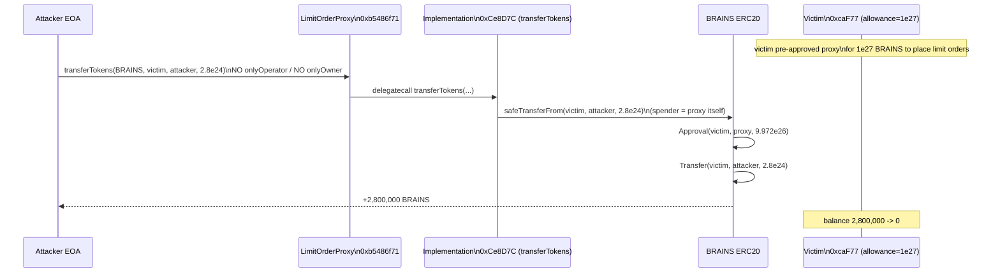
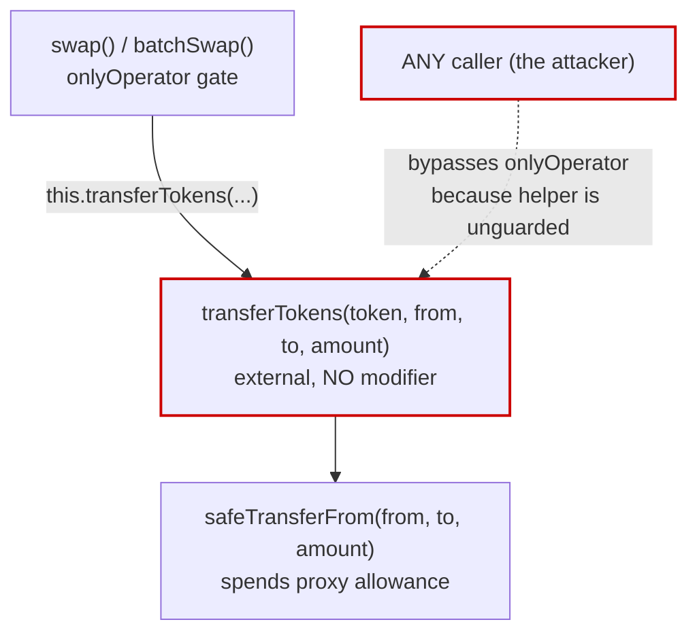

# OpenOcean Limit Order Protocol — unrestricted `transferTokens()` drains any pre-approved maker

> **Vulnerability classes:** vuln/access-control/missing-modifier · vuln/access-control/missing-auth · vuln/logic/missing-validation
> **Reproduction:** the PoC compiles & runs in an isolated Foundry project at [this project folder](.). Full verbose trace: [output.txt](output.txt). Verified contract sources for both the vulnerable implementation and the proxy are checked in under [sources/](sources).

---

## Key info

| | |
|---|---|
| **Loss** | 2,800,000 BRAINS (victim's full balance; `2.8e24` wei / 18 decimals) — see [output.txt:1624](output.txt) |
| **Vulnerable contract** | `LimitOrderProtocol` (implementation) — [`0xCe8D7Cd4DdB3Fd50bAae0Cc59DBfd786a7f0e44e`](https://basescan.org/address/0xCe8D7Cd4DdB3Fd50bAae0Cc59DBfd786a7f0e44e#code), reached via the transparent proxy [`0xb5486f71C902fe0844Bb07221Fa8f47834d90B1b`](https://basescan.org/address/0xb5486f71c902fe0844bb07221fa8f47834d90b1b#code) |
| **Attacker EOA** | [`0xc2B2197ca4B2eE3b4EB61Fc59E6D592d04a2e26A`](https://basescan.org/address/0xc2b2197ca4b2ee3b4eb61fc59e6d592d04a2e26a) |
| **Attack contract** | [`0xfeCC81Ad11E2362CDb6C3df16FF49682fF229dE7`](https://basescan.org/address/0xfecc81ad11e2362cdb6c3df16ff49682ff229de7) |
| **Attack tx** | [`0xf16c30f57d6f47d68fe8ee6ed1986ed9c0d837b00750daef9c742c395b55d564`](https://basescan.org/tx/0xf16c30f57d6f47d68fe8ee6ed1986ed9c0d837b00750daef9c742c395b55d564) |
| **Chain / block / date** | Base / 26,231,299 / Feb 2025 |
| **Compiler** | Solidity `v0.8.10+commit.fc410830`, optimizer enabled, 200 runs (verified on Basescan) |
| **Bug class** | The public `transferTokens(token, from, to, amount)` helper carries no access-control modifier, so any caller can spend any ERC-20 allowance that a maker has granted to the protocol proxy. |

## TL;DR

OpenOcean's Base deployment of the Limit Order Protocol v2 is an upgradeable contract: a `TransparentUpgradeableProxy` ([`0xb5486f71…`](https://basescan.org/address/0xb5486f71c902fe0844bb07221fa8f47834d90b1b#code)) delegates to an implementation ([`0xCe8D7Cd4…`](https://basescan.org/address/0xce8d7cd4ddb3fd50baae0cc59dbfd786a7f0e44e#code)). That implementation exposes a helper, `transferTokens(address token, address from, address to, uint256 amount)`, whose only body is `IERC20Upgradeable(token).safeTransferFrom(from, to, amount)`. It is `external` with **no `onlyOperator` / `onlyOwner` modifier**.

The helper was meant to be an internal pull primitive used by `swap()`/`batchSwap()`, which pull the maker's `path[0]` asset into the protocol before routing the swap through OpenOcean's own aggregator (`getOOswap()`). Because users grant a large (or unlimited) allowance to the proxy when they place limit orders, that allowance sits there waiting to be spent. By declaring the helper `external` instead of `internal` and forgetting to gate it, the contract hands any caller a `transferFrom` primitive signed *as the proxy itself*.

The attacker observed that the victim `0xcaF77…6579` had `approve(LimitOrderProxy, 1e27)` and a BRAINS balance of exactly `2,800,000` BRAINS (`2.8e24` wei). A single permissionless call — `transferTokens(BRAINS, victim, attacker, 2.8e24)` — moved the entire balance to the attacker. The PoC reproduces this exactly: victim balance `2,800,000 → 0`, attacker balance `0 → 2,800,000` BRAINS, allowance consumed from `1e27 → 9.972e26` ([output.txt:1623](output.txt), [output.txt:1657](output.txt)). Net profit: the full `2,800,000 BRAINS`, at zero cost beyond gas.

## Background — what OpenOcean Limit Order Protocol does

OpenOcean's Limit Order Protocol v2 is an order-book-less limit-order router. A *maker* signs an off-chain EIP-712 order ("I will give X of `makerAsset` for Y of `takerAsset`") and grants the protocol an ERC-20 allowance on `makerAsset`. A *taker* (or OpenOcean's own operator bot) submits the signed order on-chain; the protocol pulls `makerAsset` from the maker, routes it through OpenOcean's DEX aggregator (`getOOswap()`), and sends the resulting `takerAsset` back to the maker, skimming any positive delta as a fee to the owner or a designated fee address.

The two swap entry points in this deployment are `swap()` and `batchSwap()`. Both are gated by `onlyOperator`:

```solidity
modifier onlyOperator() {
    require(operators[_msgSender()], "Operator: caller is not the operator");
    _;
}
function updateOperator(address _operator, bool on) public onlyOwner { operators[_operator] = on; }
```
*(contracts_OrderMixin.sol:93-100)*

So in the intended design, *only addresses the owner has whitelisted as operators* may initiate a swap. Inside `swap()`, the maker's asset is pulled via a self-call:

```solidity
try this.transferTokens(path[0], from, address(this), amounts[0]) {
    IERC20Upgradeable(path[0]).safeIncreaseAllowance(ooSwap, amounts[0]);
} catch {
    revert SwapFailed(orderHash);
}
```

The helper `transferTokens` is the one that actually moves tokens, and it relies on the maker's standing allowance to the proxy. The flaw is that this helper is reachable by *anyone*, not just `swap()`.

## The vulnerable code

### `transferTokens` — the unguarded `transferFrom` primitive

From the verified implementation ([sources/LimitOrderProtocol_Ce8D7C/contracts_LimitOrderProtocol.sol](sources/LimitOrderProtocol_Ce8D7C/contracts_LimitOrderProtocol.sol)):

```solidity
function swap(address from, address[] calldata path, uint[] calldata amounts, address fee,
    bytes calldata swapExtraData, bytes32 orderHash) public payable onlyOperator {
    require(path.length == 2 && amounts.length == 2, "invalid args");
    address ooSwap = getOOswap();
    require(ooSwap != address(0), "ooswap is zero");
    Param memory vars;
    vars.isETH = IERC20Upgradeable(path[0]).isETH();
    if (!vars.isETH) {
        try this.transferTokens(path[0], from, address(this), amounts[0]) {   // self-call
            IERC20Upgradeable(path[0]).safeIncreaseAllowance(ooSwap, amounts[0]);
        } catch {
            revert SwapFailed(orderHash);
        }
    }
    // ... route through ooSwap, return takerAsset to `from`, fee to owner ...
}

// VULNERABLE: public, no modifier, performs an arbitrary transferFrom AS the proxy.
function transferTokens(address token, address from, address to, uint256 amount) external {
    IERC20Upgradeable(token).safeTransferFrom(from, to, amount);
}
```

Contrast the two entry points: `swap` / `batchSwap` are `onlyOperator`; `transferTokens` is `external` with **no modifier at all**. It was intended to be `internal` (or `onlyOperator`), used solely as the pull step of a swap. Declared `external`, it becomes a public `transferFrom` that the proxy executes with *its own* spender identity — i.e., it spends whatever allowance some user gave to the proxy.

### Why the maker allowance is the ammunition

When a user places a limit order on OpenOcean, the frontend asks them to `approve(LimitOrderProxy, type(uint256).max)` (or a very large amount) on the maker asset, so that any future `swap()` filling their order can pull the tokens. At fork block 26,231,299 the victim had set exactly that:

```
BRAINS.allowance(Victim, LimitOrderProxy) = 1_000_000_000_000_000_000_000_000_000  // 1e27
```
[output.txt:1610](output.txt)

That allowance is meant to be spendable only inside `swap()`, behind `onlyOperator`. Because `transferTokens` is unguarded, the allowance is spendable by *the whole world*.

## Root cause — why it was possible

1. **Wrong visibility / missing modifier on `transferTokens`.** The helper performs a privileged action (a `transferFrom` where the *proxy* is the spender) but is declared `external` with no `onlyOperator`/`onlyOwner` gate. It should have been `internal`, or at minimum `onlyOperator` like its only legitimate caller `swap()`.
2. **Self-call pattern masked the intended scope.** `swap()` calls `this.transferTokens(...)` (an external self-call) rather than an internal function reference. This makes the helper *look* like an ordinary internal step while actually being a publicly-routable entry point on the proxy's ABI. A code reviewer scanning `swap()` sees a self-call and assumes it is private; the visibility on the helper itself contradicts that assumption.
3. **Standing, large maker allowances.** The protocol's UX requires users to grant the proxy a large standing allowance on any asset they might trade. The security of the entire design therefore hinges on *every* code path that spends that allowance being operator-gated. One unguarded spender function collapses the whole model.
4. **No defence-in-depth on the `from`/`to`/`amount` inputs.** `transferTokens` does not constrain `to` (must be `address(this)` for a real swap), `from` (must be the order maker), or `amount` (must equal the order's `makingAmount`). There is no check at all — the four calldata args map directly to `transferFrom(from, to, amount)`.

## Preconditions

- **Permissionless.** No privileged role, no flash loan, no signature, no order needed. Any EOA or contract can call `transferTokens`.
- The only requirement is that *some* victim has granted the Limit Order proxy an ERC-20 allowance ≥ the amount to steal, and holds that token. This is the normal state for anyone who has ever placed an OpenOcean limit order on that asset and not yet revoked the allowance.
- The attack works for *any* ERC-20 where such an allowance exists, not just BRAINS. BRAINS was simply the asset the attacker found worth draining.

## Attack walkthrough (with on-chain numbers from the trace)

The PoC forks Base at block 26,231,299 and replays the exact single transaction ([test/LimitOrderProtocol_exp.sol](test/LimitOrderProtocol_exp.sol)). All numbers below are from [output.txt](output.txt).

| # | Step | On-chain value | Trace ref |
|---|------|----------------|-----------|
| 0 | Read victim BRAINS balance | `2,800,000` BRAINS (`2.8e24` wei) | [output.txt:1602](output.txt) |
| 0 | Read attacker BRAINS balance | `0` | [output.txt:1605](output.txt) |
| 0 | Read victim→proxy allowance | `1e27` (≥ victim balance ✓) | [output.txt:1610](output.txt) |
| 1 | `vm.prank(ATTACKER)` then call `LimitOrderProxy.transferTokens(BRAINS, victim, attacker, 2.8e24)` | proxy → implementation `[delegatecall]` | [output.txt:1619-1620](output.txt) |
| 1a | Implementation runs `BRAINS.safeTransferFrom(victim, attacker, 2.8e24)` | executes *as the proxy* (the allowance spender) | [output.txt:1621](output.txt) |
| 1b | BRAINS emits `Approval(victim, proxy, 9.972e26)` (allowance decremented) | `1e27 − 2.8e24 = 9.972e26` | [output.txt:1623](output.txt) |
| 1c | BRAINS emits `Transfer(victim, attacker, 2.8e24)` | the actual asset movement | [output.txt:1624](output.txt) |
| 2 | Re-read victim balance | `0` | [output.txt:1635](output.txt) |
| 2 | Re-read attacker balance | `2,800,000` BRAINS (`2.8e24`) | [output.txt:1641](output.txt) |

**Profit/loss accounting:**

- Attacker starting balance: `0` BRAINS
- Attacker ending balance: `2,800,000` BRAINS
- Victim loss: `2,800,000` BRAINS (full balance)
- Gas cost paid by attacker: negligible (one external call)
- Net: **+2,800,000 BRAINS, the victim's entire position**

The logged banner lines confirm it directly:

```
Attacker Before exploit BRAINS Balance: 0.000000000000000000
Attacker After exploit BRAINS Balance: 2800000.000000000000000000
```
[output.txt:1564-1565](output.txt)

## Diagrams





## Remediation

1. **Gate the helper.** Make `transferTokens` `onlyOperator` (matching `swap()`), or — preferably — make it `internal` and have `swap()` call it directly instead of via `this.transferTokens(...)`. The external self-call served no purpose and is the entire reason the function is on the public ABI.
   ```solidity
   function transferTokens(address token, address from, address to, uint256 amount) internal {
       IERC20Upgradeable(token).safeTransferFrom(from, to, amount);
   }
   ```
   and in `swap()` replace `try this.transferTokens(...)` with a direct internal call (or a `try`/`catch` around the inner `safeTransferFrom`).
2. **Constrain the pull to the order context.** Even when called legitimately, `from` must be the order's maker and `amount` must equal the order's validated `makingAmount`. Bind these explicitly rather than trusting the caller.
3. **Upgrade the implementation** (this is already a transparent proxy, so the owner can push a fixed implementation via `upgradeToAndCall`). Notify users that *all* standing allowances to the proxy were compromised until the upgrade, and ask them to re-approve only after the fix.
4. **Revoke-and-recommend.** Advise affected users to call `BRAINS.approve(LimitOrderProxy, 0)` immediately if they cannot yet confirm the upgrade is live.
5. **Add a regression test** that asserts a non-operator calling `transferTokens` reverts, and that `swap()` still pulls maker tokens correctly.

## How to reproduce

The PoC runs **fully offline** via the shared anvil harness from the committed [anvil_state.json](anvil_state.json) — no RPC needed.

```bash
_shared/run_poc.sh 2025-02-LimitOrderProtocol_exp -vvvvv
```

- **Chain / fork block:** Base, block `26,231,299` (the harness loads the committed anvil state at this block).
- **What it does:** forks at 26,231,299, asserts the victim holds `2,800,000` BRAINS and has granted the proxy a `1e27` allowance, then — as the attacker — calls `LimitOrderProxy.transferTokens(BRAINS, victim, attacker, 2_800_000e18)` and re-checks the balances.
- **Expected result:** the test passes with `[PASS] testExploit()` and the balance log shows:

  ```
  Attacker Before exploit BRAINS Balance: 0.000000000000000000
  Attacker After exploit BRAINS Balance: 2800000.000000000000000000
  ```
  ([output.txt:1562](output.txt), [output.txt:1564-1565](output.txt)). Victim balance goes `2,800,000 → 0`; the on-chain `Transfer` and `Approval` events for `2.8e24` are visible in the verbose trace ([output.txt:1623-1624](output.txt)).

*Reference: [https://t.me/defimon_alerts/447](https://t.me/defimon_alerts/447)*
