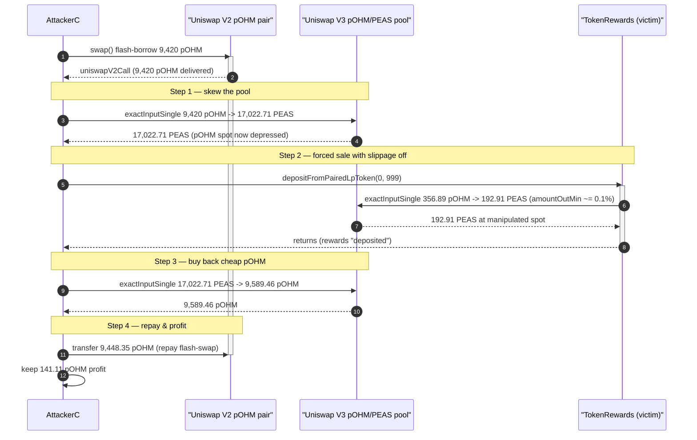
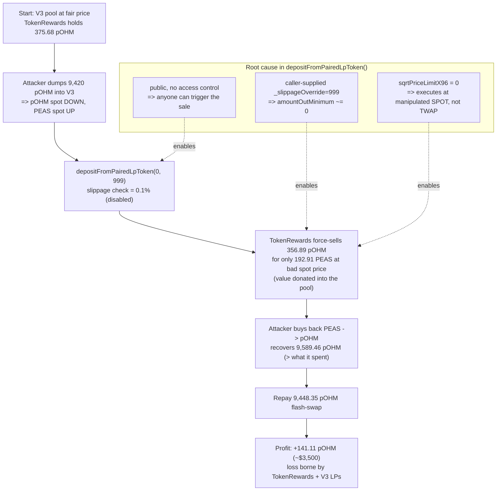

# Peapods Finance Exploit — Permissionless `depositFromPairedLpToken()` Forced Swap at Manipulated Spot Price

> **Reproduction:** the PoC compiles & runs in an isolated Foundry project at
> [this project folder](.) (the main DeFiHackLabs repo contains many unrelated
> PoCs that do not compile together, so this one was extracted).
> Full verbose trace: [output.txt](output.txt).
> Verified vulnerable source: [contracts_TokenRewards.sol](sources/TokenRewards_7d48D6/contracts_TokenRewards.sol).

---

## Key info

| | |
|---|---|
| **Loss** | ~$3,500 — **141.11 pOHM** drained from the protocol's `TokenRewards` contract + the pOHM/PEAS Uniswap V3 pool |
| **Vulnerable contract** | `TokenRewards` — [`0x7d48D6D775FaDA207291B37E3eaA68Cc865bf9Eb`](https://etherscan.io/address/0x7d48D6D775FaDA207291B37E3eaA68Cc865bf9Eb#code) |
| **Vulnerable function** | `depositFromPairedLpToken(uint256, uint256)` — public, no access control, caller-controlled slippage |
| **Victim pool** | pOHM/PEAS Uniswap V3 1% pool — `0x5207BC61c2717EE9C385B93d3B8BeeA159ddF02E` |
| **Tokens** | `pOHM` (WeightedIndex pod) `0x88E08adB69f2618adF1A3FF6CC43c671612D1ca4`; `PEAS` `0x02f92800F57BCD74066F5709F1Daa1A4302Df875` |
| **Flash-swap source** | pOHM/? Uniswap V2 pair — `0x80e9C48ec41AF7a0Ed6Cf4f3ac979f3538021608` |
| **Attacker EOA** | [`0xedee6379fe90bd9b85d8d0b767d4a6deb0dc9dcf`](https://etherscan.io/address/0xedee6379fe90bd9b85d8d0b767d4a6deb0dc9dcf) |
| **Attack tx** | [`0x2c1a19982aa88bee8a5d9a5dfeb406f2bfe1cfc1213f20e91d91ce3b55c86cc5`](https://etherscan.io/tx/0x2c1a19982aa88bee8a5d9a5dfeb406f2bfe1cfc1213f20e91d91ce3b55c86cc5) |
| **Chain / block / date** | Ethereum mainnet / 21,800,591 / Feb 2025 |
| **Compiler** | Solidity `^0.8.19` |
| **Bug class** | Permissionless forced swap + spot-vs-TWAP slippage bypass (caller-controlled `_slippageOverride`) |
| **Post-mortem** | https://blog.solidityscan.com/peapods-finance-hack-analysis-bdc5432107a5 |

---

## TL;DR

Peapods `TokenRewards` periodically converts the **paired LP token** it accumulates (here `pOHM`)
into the **rewards token** (`PEAS`) and distributes the proceeds to stakers. That conversion lives
in `depositFromPairedLpToken()`
([contracts_TokenRewards.sol:128-206](sources/TokenRewards_7d48D6/contracts_TokenRewards.sol#L128-L206)),
which has two fatal properties:

1. **It is `public` and unguarded** — *anyone* can call it at any time and force the contract to
   market-sell its entire `pOHM` balance into the pOHM/PEAS Uniswap V3 pool.
2. **The caller chooses the slippage** — the second argument `_slippageOverride` is used directly as
   the swap's tolerance
   ([:173-186](sources/TokenRewards_7d48D6/contracts_TokenRewards.sol#L173-L186)). The exploit passes
   `999`, which sets `amountOutMinimum = _amountOut * (1000 - 999) / 1000`, i.e. **0.1 % of the
   expected output** — slippage protection is effectively switched off.

Because the swap executes at the **live spot price** of the V3 pool while slippage is disabled, an
attacker who first skews that spot price can make `TokenRewards` dump its `pOHM` at a deliberately
bad rate, then capture the value on the other side of the same pool — all atomically inside a
single flash-swap callback. No price-oracle staleness check, no TWAP-bounded execution, no access
control stand in the way.

The attacker:

1. **Flash-swaps** 9,420 pOHM out of the Uniswap **V2** pair (repaid at the end of the callback).
2. **Sells** those 9,420 pOHM → 17,022.71 PEAS into the **V3** pool, pushing the pOHM spot price
   down (cheap pOHM) and the PEAS spot price up.
3. **Calls `depositFromPairedLpToken(0, 999)`** — `TokenRewards`, holding 375.68 pOHM, is forced to
   sell ~356.89 pOHM into the *same* now-skewed V3 pool for only 192.91 PEAS, with slippage
   neutralised by the `999` override. This adds pOHM to / removes PEAS from the pool on the
   attacker's behalf at a price the protocol would never have accepted.
4. **Buys back** by selling the 17,022.71 PEAS → 9,589.46 pOHM out of the pool. Thanks to the
   forced sale in step 3, the attacker reclaims **more pOHM than it spent**.
5. **Repays** 9,448.35 pOHM to the V2 pair and walks away with the remainder.

Net result: **+141.11 pOHM (~$3,500)** to the attacker, paid for by `TokenRewards`' treasury and the
V3 pool's LPs.

---

## Background — what Peapods / `TokenRewards` does

Peapods Finance wraps assets into "pods" — index tokens (`WeightedIndex`, here trading as **pOHM**).
Each pod has an associated `StakingPoolToken` and a **`TokenRewards`** contract that streams yield to
people who stake the pod's LP. `TokenRewards` is paired against a `PAIRED_LP_TOKEN` (the pod token,
pOHM) and pays out a `rewardsToken` (the protocol governance token, **PEAS**).

Over time the protocol's fee machinery (`DecentralizedIndex._feeSwap` →
`ITokenRewards.depositFromPairedLpToken`,
[contracts_DecentralizedIndex.sol:189-222](sources/WeightedIndex_88E08a/contracts_DecentralizedIndex.sol#L189-L222))
deposits accumulated **pOHM** into `TokenRewards`. `TokenRewards` must then convert that pOHM into
PEAS so it can be distributed. It does so by swapping pOHM → PEAS through the **Uniswap V3 1% pool**
and crediting the resulting PEAS to stakers via `_depositRewards`
([contracts_TokenRewards.sol:217-240](sources/TokenRewards_7d48D6/contracts_TokenRewards.sol#L217-L240)).

The intended design is that this conversion is a *routine maintenance* operation with a small (1 %)
slippage guard derived from a TWAP price. The implementation, however, lets any external caller
trigger that conversion and dictate its slippage — turning protocol maintenance into an
attacker-controlled forced market sell.

On-chain state at the fork block (read from the trace):

| Value | Amount |
|---|---|
| `TokenRewards` pOHM balance at attack time | 375.68 pOHM ([:1672-1673](output.txt#L1672)) |
| pOHM swapped after admin fee | 356.89 pOHM ([:1701](output.txt#L1701)) |
| `yieldAdmin` / `yieldBurn` fees | 500 / 500 bps (5 % each) ([:1676-1679](output.txt#L1676)) |
| V3 pool fee tier | 10000 = 1 % |
| TWAP interval used for slippage | 600 s (`observe([600, 0])`) ([:1687-1688](output.txt#L1687)) |

---

## The vulnerable code

`TokenRewards.depositFromPairedLpToken`
([contracts_TokenRewards.sol:128-206](sources/TokenRewards_7d48D6/contracts_TokenRewards.sol#L128-L206)):

```solidity
function depositFromPairedLpToken(
    uint256 _amountTknDepositing,
    uint256 _slippageOverride          // <-- caller-controlled slippage
) public override {                     // <-- PUBLIC, no access control
    require(PAIRED_LP_TOKEN != rewardsToken, 'LPREWSAME');
    ...
    uint256 _amountTkn = IERC20(PAIRED_LP_TOKEN).balanceOf(address(this)); // sells the WHOLE balance
    require(_amountTkn > 0, 'NEEDTKN');
    ...
    // price comes from a TWAP oracle (sqrtPriceX96FromPoolAndInterval over 600s)
    uint160 _rewardsSqrtPriceX96 = V3_TWAP_UTILS.sqrtPriceX96FromPoolAndInterval(_pool);
    uint256 _rewardsPriceX96     = V3_TWAP_UTILS.priceX96FromSqrtPriceX96(_rewardsSqrtPriceX96);
    uint256 _amountOut = _token0 == PAIRED_LP_TOKEN
        ? (_rewardsPriceX96 * _amountTkn) / FixedPoint96.Q96
        : (_amountTkn * FixedPoint96.Q96) / _rewardsPriceX96;
    ...
    uint256 _slippage = _slippageOverride > 0     // <-- attacker passes 999
        ? _slippageOverride
        : _rewardsSwapSlippage;                   // default 10 (=1%)
    try
        ISwapRouter(V3_ROUTER).exactInputSingle(
            ISwapRouter.ExactInputSingleParams({
                tokenIn: PAIRED_LP_TOKEN,
                tokenOut: rewardsToken,
                fee: REWARDS_POOL_FEE,
                recipient: address(this),
                deadline: block.timestamp,
                amountIn: _amountTkn,
                // (1000 - 999)/1000 = 0.1% of the TWAP-expected output -> no protection
                amountOutMinimum: (_amountOut * (1000 - _slippage)) / 1000,
                sqrtPriceLimitX96: 0               // <-- swap runs to the manipulated SPOT price
            })
        )
    { ... _depositRewards(...); }
    catch { ... }
}
```

Two independent design flaws compound:

- **Caller-controlled slippage** ([:173-186](sources/TokenRewards_7d48D6/contracts_TokenRewards.sol#L173-L186)).
  The `_slippageOverride` parameter is trusted verbatim. Passing `999` reduces the minimum-out check
  to 0.1 % of the expected amount, so the swap will succeed at essentially *any* execution price.
- **TWAP guard but spot execution, no price-limit** ([:162-187](sources/TokenRewards_7d48D6/contracts_TokenRewards.sol#L162-L187)).
  `amountOutMinimum` is computed from a 600 s TWAP, but `sqrtPriceLimitX96 = 0` lets the Uniswap V3
  swap walk the pool all the way to the *current spot price*. With the slippage check neutered, the
  TWAP value is never actually enforced — the swap clears at whatever spot the attacker created
  moments earlier in the same transaction.

Because the function sells the **entire** `PAIRED_LP_TOKEN` balance
([:140](sources/TokenRewards_7d48D6/contracts_TokenRewards.sol#L140)) and anyone can call it, an
attacker can synchronise a pre-skew of the pool with this forced sale and harvest the difference.

---

## Root cause

`depositFromPairedLpToken` lets an **untrusted caller** both *trigger* a market sell of the
protocol's treasury and *choose how much price impact is acceptable*. The slippage protection that
should have bounded the execution price to the TWAP is rendered inert by the attacker-supplied
`_slippageOverride = 999`. With `sqrtPriceLimitX96 = 0`, the swap then executes against the live
spot price of the V3 pool — a price the attacker can move at will within the same transaction.

In short: **protocol value is sold at an attacker-determined price, on an attacker-determined
trigger, with attacker-determined slippage.** The forced sale donates favourable inventory into the
pool that the attacker immediately recaptures via its own round-trip swap.

---

## Preconditions

1. `TokenRewards` is holding a non-trivial `PAIRED_LP_TOKEN` (pOHM) balance — true here (375.68 pOHM),
   it accumulates from normal protocol fee flow.
2. A pOHM/PEAS Uniswap V3 pool exists whose spot price can be moved by a flash-swap-sized trade —
   true; the 1 % pool was shallow relative to the attacker's borrowed 9,420 pOHM.
3. `depositFromPairedLpToken` is callable by anyone with a caller-chosen slippage — true (it is
   `public` and trusts `_slippageOverride`).
4. A flash-swap / flash-loan source of pOHM to fund the price skew — the Uniswap V2 pOHM pair
   provided it (and was repaid in-callback).

No privileged role, no governance, no time delay required.

---

## Step-by-step attack walkthrough

All numbers below are ground-truth from [output.txt](output.txt) at block 21,800,590 (fork = attack
block − 1). Token amounts are 18-decimals.

| # | Action | Call / evidence | Amount |
|---|--------|-----------------|--------|
| 1 | Flash-swap pOHM out of the V2 pair (callback `uniswapV2Call`) | [:1598](output.txt#L1598) | 9,420.0 pOHM borrowed |
| 2 | Approve + swap pOHM → PEAS on V3 (skews spot: pOHM cheap) | [:1611-1670](output.txt#L1611) | 9,420.0 pOHM → **17,022.71 PEAS** |
| 3 | Call `TokenRewards.depositFromPairedLpToken(0, 999)` | [:1671](output.txt#L1671) | — |
| 3a | TokenRewards reads its pOHM balance (whole balance is sold) | [:1672-1673](output.txt#L1672) | 375.68 pOHM held |
| 3b | TokenRewards computes TWAP price (600 s) for slippage | [:1686-1691](output.txt#L1686) | TWAP only — never enforced |
| 3c | TokenRewards force-sells pOHM → PEAS at skewed spot; slippage neutered by `999` | [:1701-1728](output.txt#L1701) | **356.89 pOHM → 192.91 PEAS** |
| 3d | Admin fee + burn of rewards | [:1731-1755](output.txt#L1731) | 18.78 pOHM admin, 9.65 PEAS burned |
| 4 | Attacker swaps PEAS → pOHM on V3 (buys back cheap pOHM) | [:1763-1825](output.txt#L1763) | 17,022.71 PEAS → **9,589.46 pOHM** |
| 5 | Repay the V2 flash-swap | [:1826-1828](output.txt#L1826) | 9,448.35 pOHM returned |
| 6 | Sweep profit to attacker EOA | [:1851-1857](output.txt#L1851) | **141.11 pOHM** |

Why the round-trip is profitable: in step 2 the attacker pays 9,420 pOHM and receives 17,022.71
PEAS. Normally selling those 17,022.71 PEAS straight back (step 4) would return *less* than 9,420
pOHM (V3 fees + curvature). But the forced sale in step 3c injects 356.89 pOHM into the pool and
removes 192.91 PEAS at the manipulated price — effectively adding pOHM inventory and depleting PEAS
inventory at a rate the protocol set against itself. That moves the buy-back price in the attacker's
favour, so step 4 returns 9,589.46 pOHM — enough to repay the 9,448.35 pOHM flash-swap and keep
141.11 pOHM.

---

## Profit / loss accounting

AttackerC token flows (from the trace; all 18-dec):

| Leg | pOHM in | pOHM out | PEAS in | PEAS out |
|-----|--------:|---------:|--------:|---------:|
| Flash-swap borrow (V2) | 9,420.000000 | | | |
| pOHM → PEAS (V3, step 2) | | 9,420.000000 | 17,022.705134 | |
| PEAS → pOHM (V3, step 4) | 9,589.458958 | | | 17,022.705134 |
| Repay V2 flash-swap | | 9,448.345035 | | |
| **Totals** | **19,009.458958** | **18,868.345035** | **17,022.705134** | **17,022.705134** |

```
Net pOHM = 19,009.458958 − 18,868.345035 = 141.113923 pOHM
```

PEAS nets to zero. Final attacker balance confirmed by the test:

```
Before balance of pOHM: 0.000000000000000000
After  balance of pOHM: 141.113923030647830889
```

At ≈ $24.80 / pOHM this is ≈ **$3,500**, consistent with the PoC header. The loss is borne by
`TokenRewards` (which sold 356.89 pOHM for only 192.91 PEAS, a value-destroying trade) and the V3
pool's liquidity providers.

---

## Diagrams

### Attack sequence



### Pool / value evolution



---

## Remediation

1. **Restrict who can trigger the conversion.** `depositFromPairedLpToken` should not be callable by
   arbitrary externals to force a treasury market-sell. Gate it to the index fund / staking
   machinery (the `onlyTrackingToken`-style modifier already used elsewhere) or to a trusted keeper.
2. **Do not trust caller-supplied slippage.** Remove `_slippageOverride`, or bound it to a small
   protocol-defined maximum (e.g. ≤ a few percent). Never let a caller set 99.9 % tolerance.
3. **Enforce the TWAP price on execution, not just on the min-out math.** Pass a real
   `amountOutMinimum` derived from the TWAP *and* a `sqrtPriceLimitX96` so the swap cannot clear far
   from the time-averaged price. A spot vs. TWAP deviation check (revert if spot is more than X%
   from TWAP) closes the manipulation window.
4. **Cap per-call sale size / add a cooldown.** Selling the entire balance in one unguarded call
   maximises the attacker's leverage; chunking and rate-limiting reduce single-transaction impact.
5. Consider routing the conversion through an aggregator/MEV-protected path rather than a single
   shallow 1 % V3 pool.

---

## How to reproduce

```bash
_shared/run_poc.sh 2025-02-PeapodsFinance_exp -vvvvv
```

Expected tail:

```
  Before balance of pOHM: 0.000000000000000000
  After balance of pOHM: 141.113923030647830889
[PASS] testExploit() (gas: 1503056)
Suite result: ok. 1 passed; 0 failed; 0 skipped
```

The test forks Ethereum mainnet at block `21_800_591 - 1` (see
[test/PeapodsFinance_exp.sol](test/PeapodsFinance_exp.sol#L25)) and replays the exploit end-to-end.
Full trace: [output.txt](output.txt).
