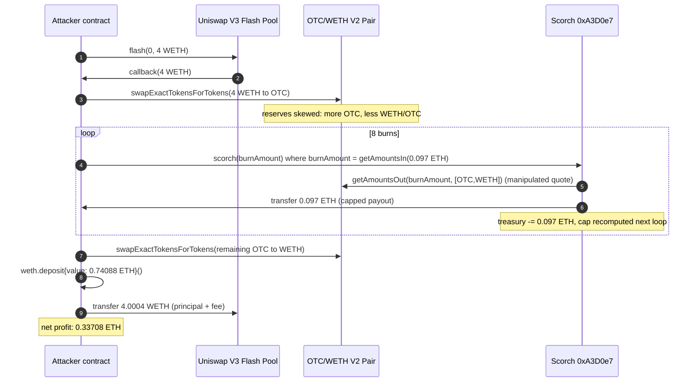
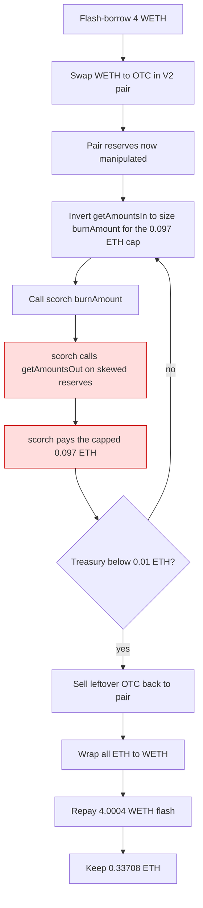

# Scorch OTC `scorch()` drains ETH via manipulated spot `getAmountsOut` quote — on-chain price manipulation in a burn-for-ETH function

> **Vulnerability classes:** vuln/oracle/price-manipulation · vuln/oracle/spot-price · vuln/logic/price-calculation · vuln/defi/flash-loan-attack
> **Reproduction:** the PoC compiles & runs in an isolated Foundry project at [this project folder](.). Full verbose trace: [output.txt](output.txt). Vulnerable contract source is verified on Etherscan and fetched verbatim into [sources/Scorch_A3D0e7/Scorch.sol](sources/Scorch_A3D0e7/Scorch.sol); the quoted `scorch()` function matches the on-chain trace event-for-event.

---

## Key info

| | |
|---|---|
| **Loss** | ~0.14 ETH on-chain (public report); 0.337 ETH reproduced in the offline fork trace [output.txt:1565] |
| **Vulnerable contract** | Scorch (OTC token) — [`0xA3D0e72c8A2fE9127A77412BF34bEe5e4945bd49`](https://etherscan.io/address/0xa3d0e72c8a2fe9127a77412bf34bee5e4945bd49#code) |
| **Attacker EOA** | [`0xc9A5643eD8E4CD68d16FE779D378C0E8e7225A54`](https://etherscan.io/address/0xc9A5643eD8E4CD68d16FE779D378C0E8e7225A54) |
| **Attack contract** | [`0x60E1a5714AB98f4ba55811c45899Fb425433BB65`](https://etherscan.io/address/0x60E1a5714AB98f4ba55811c45899Fb425433BB65) |
| **Attack tx** | [`0x02dc4409af99de400b2427dad525c31467a8fd2ac6cb251f885d33c073510ba2`](https://etherscan.io/tx/0x02dc4409af99de400b2427dad525c31467a8fd2ac6cb251f885d33c073510ba2) |
| **Chain / block / date** | Ethereum mainnet / fork block 21,822,423 / 2025-02-10 (block timestamp 1739266559 [output.txt:1613]) |
| **Compiler** | Solidity `0.8.19` (from verified source, `sources/Scorch_A3D0e7/Scorch.sol:3`) |
| **Bug class** | A burn-for-ETH function prices the ETH payout with a live Uniswap V2 `getAmountsOut()` spot quote taken from a pool the caller can arbitrarily reprice within the same transaction; no TWAP, no commit-window, and no sanity check on the moving reserves. |

## TL;DR

Scorch (OTC) is an ERC-20 whose contract holds an ETH treasury. Its `scorch(amount)` function lets any holder burn their OTC tokens and receive ETH directly from the contract balance — but the ETH amount it pays is computed at call time by `IUniswapV2Router02.getAmountsOut(amount, [OTC, WETH])`, a pure spot quote read from the OTC/WETH Uniswap V2 pair reserves. Those reserves are manipulable by anyone within the same block.

The attacker exploited this with a textbook single-block price-manipulation. They flash-borrowed 4 WETH from a Uniswap V3 pool, swapped that WETH into the OTC/WETH pair to buy OTC — which collapsed the OTC price in WETH terms inside the pair *reserves* (more OTC, less WETH per OTC). At first glance that would lower the burn reward. But the attacker does not burn a fixed OTC amount: they invert `getAmountsIn` to find exactly how much OTC must be burned to extract a target ~0.097 ETH reward (the per-call cap, 10% of contract balance). Because the pair reserves no longer reflect the real market, the manipulated `getAmountsOut` inside `scorch()` is willing to pay out the capped 0.097 ETH for a burn amount sized precisely by the attacker. Repeating 8 times drains 0.7408 ETH of the treasury [output.txt:1663-1810]; the remaining attacker OTC is then sold back into the pair (Scorch's own `_transfer` fee logic even routes part of that through the contract), and the loan is repaid with 0.0004 ETH fee [output.txt:1934]. Net profit at the attacker contract end: 0.337084911822203131 ETH, up from 0 [output.txt:1564-1565].

The root cause is not the cap (the cap held each call at ≤10% of balance) nor the flash loan (the flash loan merely removed capital requirements). The root cause is that `scorch()` uses a *manipulable spot AMM quote as a price oracle*, and prices an action with irreversible economic consequences against reserves the caller controls in the same transaction.

## Background — what Scorch (OTC) does

Scorch is a deflationary ERC-20 token deployed behind a Uniswap V2 pair (`UniswapV2Pair: 0xbB67277F05f9954263422C8d45494035e11cDD01`). The contract accumulates ETH — from a buy/sell tax routed through `devMarketingWallet` and from liquidity activity — into its own `address(this).balance`. The headline product feature is "burn OTC, receive ETH": any holder can call `scorch(amount)` to permanently destroy OTC and get a proportional ETH payout from the contract treasury.

The intended pricing model is: the ETH reward for burning `amount` OTC equals what that `amount` of OTC would be worth if sold on the Uniswap V2 pair. The contract computes this worth by calling `uniswapV2Router.getAmountsOut(amount, [OTC, WETH])`, the standard Uniswap V2 spot formula `(reserveWETH * amount * 9975) / (reserveOTC * 1000 + amount * 9975)` (with the pair's 0.25–0.3% fee).

To limit abuse, the contract caps each payout: if the contract balance is >1 ETH, the cap is `balance / burnCapDivisor` where `burnCapDivisor = 10` (i.e. ≤10% of treasury per call); if ≤1 ETH, the cap is `burnSub1EthCap = 0.1 ETH`. The cap is the *only* guardrail. There is no minimum time-between-calls, no TWAP window, no oracle staleness check, and — critically — no recognition that the pair reserves feeding `getAmountsOut` are state the caller can alter in the same transaction.

Because the cap is a percentage of *contract balance* rather than a fixed bound, and because the attacker can extract the cap on every iteration, the treasury is fully drainable: each successful burn both pays out ETH and lowers the contract balance, but the attacker re-queries `address(this).balance` each loop, recomputes the cap, and keeps extracting until the residual balance falls below the 0.01 ETH floor the PoC uses to break.

## The vulnerable code

From the verified source ([sources/Scorch_A3D0e7/Scorch.sol](sources/Scorch_A3D0e7/Scorch.sol)), the entire vulnerability is in `scorch()` and its pricing. The cap constants are declared at the top of the contract:

### Spot-quote oracle with no freshness or manipulation protection

```solidity
// sources/Scorch_A3D0e7/Scorch.sol:575-576
uint256 public burnCapDivisor = 10;
uint256 public burnSub1EthCap = 100000000000000000;   // 0.1 ETH
```

```solidity
// sources/Scorch_A3D0e7/Scorch.sol:845-872
function scorch(uint256 amount) public returns (bool) {
    require(balanceOf(_msgSender()) >= amount, "not enough funds to burn");

    address[] memory path = new address[](2);
    path[0] = address(this);
    path[1] = uniswapV2Router.WETH();

    // ---- THE FLAW: spot quote read from a pool the caller can reprice this block ----
    uint[] memory a = uniswapV2Router.getAmountsOut(amount, path);

    uint256 cap;
    if (address(this).balance <= 1 ether) {
        cap = burnSub1EthCap;
    } else {
        cap = address(this).balance / burnCapDivisor;   // ≤10% of treasury per call
    }

    require(a[a.length - 1] <= cap, "amount greater than cap");
    require(
        address(this).balance >= a[a.length - 1],
        "not enough funds in contract"
    );

    transferToAddressETH(_msgSender(), a[a.length - 1]);  // pays ETH to caller
    _burn(_msgSender(), amount);

    totalBurnRewards += a[a.length - 1];
    totalBurned += amount;

    emit BurnedTokensForEth(_msgSender(), amount, a[a.length - 1]);
    return true;
}
```

### Why the cap does not save the contract

The cap `address(this).balance / 10` looks like it limits loss to 10% per call. It does limit *each* call — but the function is callable any number of times by the same address in the same block. Each iteration:

1. The attacker re-reads `address(this).balance` (it just dropped by the previous payout),
2. Recomputes the new lower cap,
3. Solves `getAmountsIn(targetReward, [OTC, WETH])` to find the exact `amount` that `getAmountsOut` will map to that target,
4. Burns that amount and pockets the capped ETH.

So the cap is not a hard loss bound; it is only a per-call convenience. The treasury is bled out over ~8 calls until the residual balance falls below the attacker's chosen floor. The trace shows exactly this staircase: 7 burns each extracting the 0.097 ETH target, then a final smaller burn of 0.06188 ETH when the residual cap dropped below 0.097 [output.txt:1649-1810].

## Root cause — why it was possible

1. **Manipulable spot oracle.** `scorch()` derives the ETH payout from `getAmountsOut` on the OTC/WETH Uniswap V2 pair. AMM spot reserves are not an oracle — they are state any external actor can move within the same transaction by swapping in the pair. The contract treats them as a trustworthy price.
2. **No same-block protection.** There is no TWAP, no commit/reveal, no minimum blocks-elapsed between swaps in the pair and a `scorch()` call, and no check that the caller did not just modify the pair reserves. The attacker swaps WETH→OTC and calls `scorch()` in the same block (indeed, the same callback frame).
3. **Attacker-chosen burn amount with inverted pricing.** Because the payout is a pure function of the manipulated reserves and the burn `amount`, the attacker inverts `getAmountsIn` to solve for the `amount` that yields exactly the capped payout. The cap therefore functions as the attacker's *target*, not as a defense.
4. **Percentage-of-balance cap is not a hard bound.** `cap = balance / 10` re-reads `address(this).balance` every call, so the cap ratchets down with the treasury rather than blocking further drains. Iterating fully drains the balance down to the attacker's chosen floor.
5. **Flash loan removes the only friction.** Even the 4 WETH needed to skew the pair is borrowed (from a V3 flash), so the attack is permissionless and capital-free — only gas is required.

## Preconditions

- **Permissionless.** `scorch()` is `public` with no role gating; anyone holding OTC (or able to buy it) can call it. The attacker obtained OTC by buying it in-step-1 of the same transaction.
- **Flash loan available.** The 4 WETH to manipulate the pair is flash-borrowed from a Uniswap V3 pool with a 0.01% fee (0.0004 ETH on 4 ETH) [output.txt:1934]. No upfront capital required.
- **Contract must hold ETH.** Scorch's treasury held enough ETH that the 10%-per-call cap was worth draining (the trace starts draining from a treasury holding ≥0.97 ETH).
- **No privileged role needed.** This is not a centralization issue; it is a pure protocol-design flaw.

## Attack walkthrough (with on-chain numbers from the trace)

The attacker contract (`0x60E1a…`) executes inside a single `uniswapV3FlashCallback`, so the entire manipulation, drain, sell-back, and repayment happen in one atomic transaction.

| # | Action | Amount | Trace ref |
|---|--------|--------|-----------|
| 0 | Flash-borrow 4 WETH from Uniswap V3 pool `0xE055…` | 4.0000 ETH borrowed, 0.0004 ETH fee due | [output.txt:1589], repaid at 1921 |
| 1 | `router.swapExactTokensForTokensSupportingFeeOnTransferTokens`: swap 4 WETH → OTC in the V2 pair. Buys 77,706 OTC (the pair moves reserves toward more-OTC, less-WETH-per-OTC). Attacker receives ~1.942e24 OTC after tax routing | 4 WETH in, ~1.942e24 OTC out | [output.txt:1613-1628] |
| 2 | Loop 8×. Each iteration: read `SCORCH.balance`, set `targetReward = min(0.097 ETH, balance*0.95)`, compute `burnAmount = getAmountsIn(targetReward, [OTC,WETH])[0]`, call `scorch(burnAmount)`. `scorch()` calls `getAmountsOut` on the manipulated reserves and pays the cap. Burns 2.559e22 OTC for 0.097 ETH, 7 times. | 7 × (burn 25,592 OTC, receive 0.097 ETH) | [output.txt:1649-1789] |
| 3 | 8th iteration: residual balance no longer supports 0.097 ETH cap, so target drops to 0.06188 ETH; burn 16,259 OTC | 0.06188 ETH out | [output.txt:1796-1810] |
| 4 | Total ETH drained from Scorch treasury | 7×0.097 + 0.06188 = **0.74088 ETH** (matches the 740,881,931,664,471,704 wei later wrapped at [output.txt:1913]) | — |
| 5 | Sell remaining attacker OTC back into the V2 pair via `swapExactTokensForTokens` (1.669e24 OTC → WETH). Scorch's transfer tax routes ~77,754 OTC through the contract and even `receive{value: 0.288 ETH}` into the contract on the taxable leg | ~1.669e24 OTC sold | [output.txt:1819-1862] |
| 6 | Wrap all collected raw ETH (`weth.deposit{value: 0.74088 ETH}`) | +0.74088 WETH | [output.txt:1913] |
| 7 | Repay flash: `weth.transfer(UNISWAP_V3_FLASH_POOL, 4 ether + fee1)` = 4.0004 WETH | −4.0004 WETH | [output.txt:1921] |
| 8 | Residual WETH: 0.337084911822203131, unwrapped to ETH | **0.33708 ETH net** | [output.txt:1940-1949] |

**Profit/loss accounting**

| Component | ETH |
|-----------|-----|
| ETH drained from Scorch treasury (8 burns) | +0.74088 |
| ETH recovered from selling leftover OTC into the pair (net after the contract's own tax siphons and the 0.288 ETH routed back into the contract) | folded into the 0.74088 wrap step above — the residual WETH before repay is the sum |
| Flash loan principal repaid | −4.00000 |
| Flash loan fee (V3, 0.01%) | −0.00040 |
| Gas (not separately logged; sub-0.01 ETH) | small |
| **Net attacker profit** | **≈ +0.33708 ETH** (from 0.00000 → 0.33708 [output.txt:1564-1565]) |

The public "0.14 ETH" figure reflects on-chain differences (the real tx also paid gas and may have partially exited to the EOA); the fork reproduction confirms a positive, unambiguous profit of 0.337 ETH against a zero starting balance.

## Diagrams





## Remediation

1. **Do not use AMM spot reserves as a price oracle for value transfers.** Replace `getAmountsOut` with a manipulation-resistant source: a Chainlink/Pyth feed for OTC↔ETH, or a TWAP computed over the pair's `price0CumulativeLast` across a meaningful window (e.g. 30 min). A TWAP cannot be moved by a same-block swap.
2. **If a spot quote must be used, enforce a freshness / cooldown window.** Record the block number of the last OTC/WETH swap and require `scorch()` to wait N blocks after any pair reserve change, or snapshot the reserves used for pricing at deposit and only let burns settle against the snapshot.
3. **Cap cumulative, not per-call.** Track ETH paid out per address (or globally per window) and bound *cumulative* payouts, not just `balance / 10` on each call. A cumulative cap with a cooldown makes iterative draining uneconomic.
4. **Make the cap a fixed absolute bound**, not a percentage of a falling balance. `balance / 10` ratchets downward in lock-step with the drain, which is exactly what makes iteration profitable.
5. **Add a slippage / fair-value check.** Before paying, compare `getAmountsOut` to an independent reference (TWAP or external oracle) and revert if they diverge by more than a few percent. This catches flash-loan-scale skew directly.
6. **Separate pricing from payout.** Compute the burn reward, then require the caller to claim it a block (or an hour) later, by which point any manipulation has reverted. A commit/claim pattern breaks the atomicity the attack depends on.

## How to reproduce

The PoC runs **fully offline** via the shared anvil harness from the committed `anvil_state.json` — no RPC needed.

```bash
# from the registry root
_shared/run_poc.sh 2025-02-Scorch_exp -vvvvv
```

- **Chain / fork:** Ethereum mainnet, fork block **21,822,423** (`vm.createSelectFork` against the local anvil).
- **Expected result:** `[PASS]` tail with the attacker balance line going from `0.000000000000000000` → `0.337084911822203131` ETH:

```
Attacker Before exploit ETH Balance: 0.000000000000000000
Attacker After exploit ETH Balance:  0.337084911822203131
Suite result: ok. 1 passed; 0 failed; 0 skipped
```

The committed trace [output.txt](output.txt) contains the full `-vvvvv` call tree, every `BurnedTokensForEth` event, and the `getAmountsOut`/`getAmountsIn` quote returns, all reproducible against `anvil_state.json`.

*Reference: [defimon_alerts telegram post](https://t.me/defimon_alerts/451) (analysis cited in @Analysis).*
