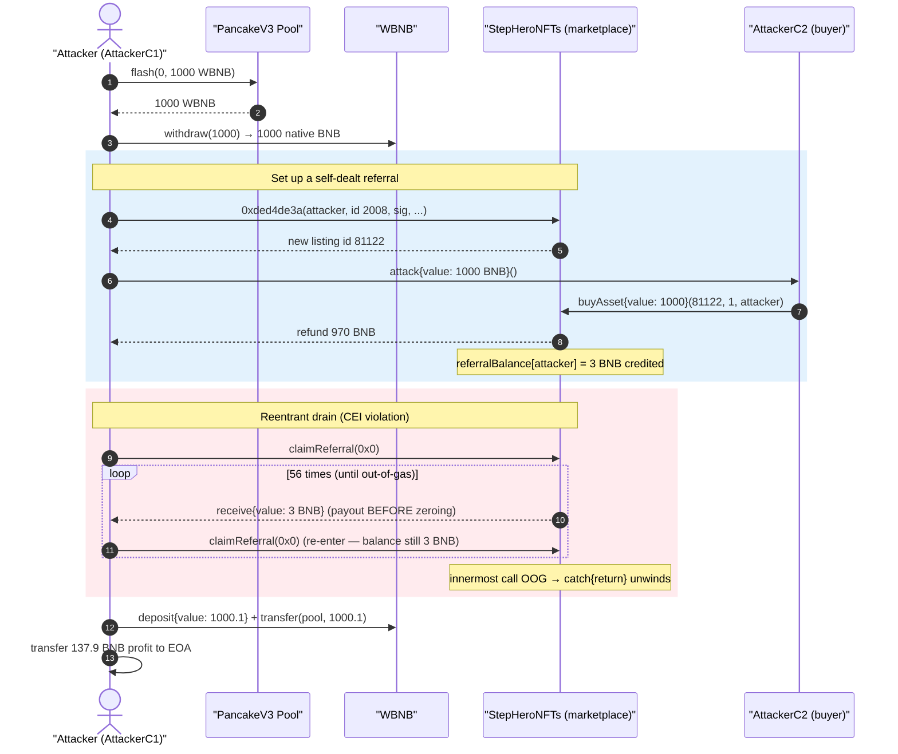
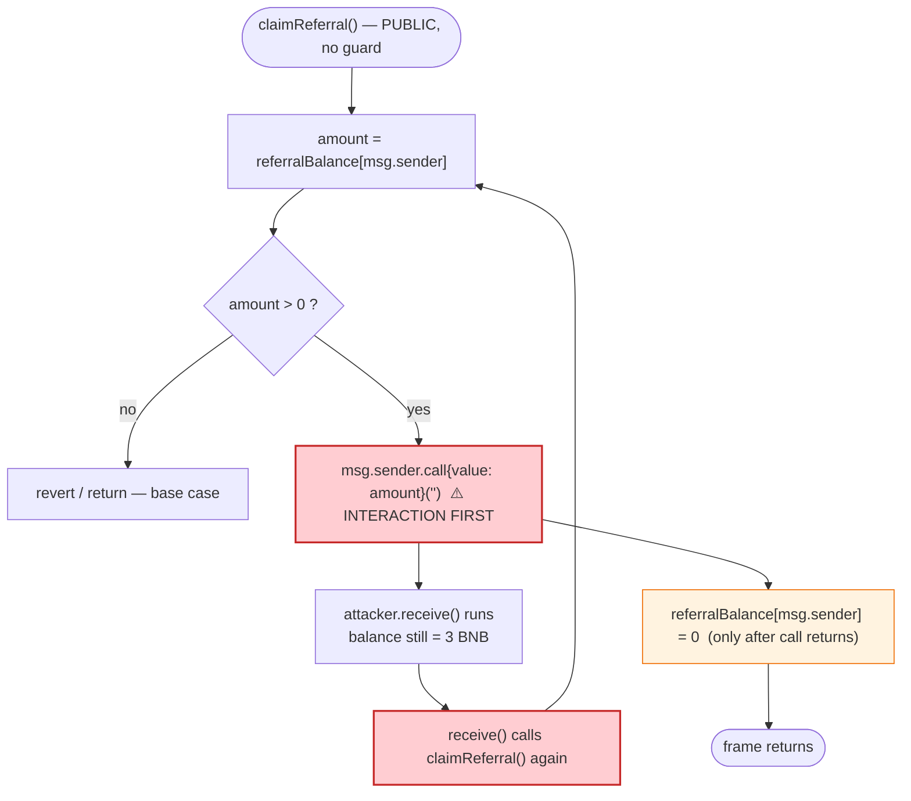

# StepHeroNFTs Exploit — Reentrancy in `claimReferral()` Drains the Marketplace's BNB

> **Reproduction:** the PoC compiles & runs in an isolated Foundry project at
> [this project folder](.) (the umbrella DeFiHackLabs repo does not whole-compile, so this PoC was
> extracted into a standalone project).
> Full verbose trace: [output.txt](output.txt).
> The vulnerable contract `0x9823…28aB` is **unverified** on BSCScan, so the snippets below are
> reconstructed from the on-chain execution trace, storage diffs, and decoded calldata/events
> (no verified source is available to download).

---

## Key info

| | |
|---|---|
| **Loss** | **137.9 BNB** (~$92K at the time) net profit, drained from the marketplace contract's BNB balance |
| **Vulnerable contract** | `StepHeroNFTs` (unverified NFT marketplace) — [`0x9823E10A0bF6F64F59964bE1A7f83090bf5728aB`](https://bscscan.com/address/0x9823E10A0bF6F64F59964bE1A7f83090bf5728aB) |
| **Victim / value source** | The same marketplace contract's native BNB balance (accumulated sale proceeds) |
| **Flash-loan source** | PancakeSwap V3 WBNB pool — [`0x172fcD41E0913e95784454622d1c3724f546f849`](https://bscscan.com/address/0x172fcD41E0913e95784454622d1c3724f546f849) |
| **Attacker EOA** | [`0xFb1cc1548D039f14b02cfF9aE86757Edd2CDB8A5`](https://bscscan.com/address/0xFb1cc1548D039f14b02cfF9aE86757Edd2CDB8A5) |
| **Attack contract (main)** | [`0xb4c32404de3367ca94385ac5b952a7a84b5bdf76`](https://bscscan.com/address/0xb4c32404de3367ca94385ac5b952a7a84b5bdf76) |
| **Attack tx** | [`0xef386a69ca6a147c374258a1bf40221b0b6bd9bc449a7016dbe5240644581877`](https://bscscan.com/tx/0xef386a69ca6a147c374258a1bf40221b0b6bd9bc449a7016dbe5240644581877) |
| **Chain / block / date** | BSC / 46,843,424 (forked at −1) / Feb 2025 |
| **Compiler** | Solidity `^0.8.13` (PoC) |
| **Bug class** | Classic reentrancy — external `call` paying out before the referral balance is zeroed (CEI violation) |
| **PoC author** | [rotcivegaf](https://twitter.com/rotcivegaf) |

---

## TL;DR

`StepHeroNFTs` is an NFT marketplace that pays **referral commissions** in native BNB. When an
NFT is sold, a fixed commission (here **3 BNB**) is credited to a "referral balance" inside the
contract. The owner of that balance withdraws it via `claimReferral(address)`.

The withdraw function pays the caller with a **plain native-BNB transfer that runs *before* the
referral balance is reset to zero** — a textbook Checks-Effects-Interactions violation. Because the
recipient is the attacker's own contract, its `receive()` re-enters `claimReferral()` and is paid the
*same* 3 BNB again, and again, recursing until the call runs out of gas.

The attacker:

1. Flash-borrows **1000 WBNB** from a PancakeSwap V3 pool and unwraps it to native BNB.
2. Calls a signed/privileged marketplace function (selector `0xded4de3a`) that **creates a new asset
   listing (id `81122`) on the attacker's behalf and credits a referral entry**.
3. Buys 1 unit of that listing via `buyAsset{value: 1000 ether}(81122, 1, attacker)` — this credits a
   **3 BNB referral commission** to the attacker (970 BNB is refunded, 27 BNB goes to the seller — who
   is also the attacker — and 3 BNB becomes the referral balance).
4. Calls `claimReferral(address(0))`. The contract sends 3 BNB to the attacker's contract, whose
   `receive()` re-enters `claimReferral()` **56 times**, each draining another 3 BNB before the balance
   is ever zeroed.
5. Repays the flash loan (1000 + 0.1 BNB) and keeps the rest.

**Economics:** 56 × 3 BNB = **168 BNB** stolen − 30 BNB spent on the `buyAsset` purchase −
0.1 BNB flash fee = **137.9 BNB profit** (verified to the wei against the trace).

---

## Background — what StepHeroNFTs does

`StepHeroNFTs` (verified bytecode shows ERC‑1155 / ERC‑721 receiver hooks `f23a6e61`, `bc197c81`)
is an on-chain NFT marketplace with three relevant features, reconstructed from the trace:

- **Asset listings.** Sellers list NFTs for a price in native BNB. A signed/privileged entry point
  (selector `0xded4de3a`, callable with a signature blob) creates a listing on behalf of a buyer/owner
  and returns a fresh listing id. In the attack it created listing **id `81122`** owning token `2008`,
  amount `6`, price `1000 BNB`.
- **`buyAsset(uint256 id, uint256 amount, address tokenBuyer)`** — a buyer pays the listing price in
  native BNB; the contract transfers the NFT, refunds overpayment, pays the seller, and **credits a
  fixed referral commission** to a referral ledger.
- **`claimReferral(address)`** — the holder of a pending referral balance withdraws it as native BNB.

The whole game lives in `claimReferral`: it **pays out before it bookkeeps**.

---

## The vulnerable code

> The contract is **unverified**, so the following is a faithful reconstruction from the execution
> trace (`output.txt`), the storage diffs, and the decoded events. It is the standard
> reentrant-withdraw pattern and matches the observed behavior exactly.

### `claimReferral` — pays first, zeroes never (within the reentrant frame)

```solidity
// Reconstructed from trace behavior (contract is unverified)
mapping(address => uint256) public referralBalance;

function claimReferral(address /* referrer arg, ignored for msg.sender path */) external {
    uint256 amount = referralBalance[msg.sender];   // = 3 ether (the credited commission)
    require(amount > 0, "no referral");

    // ⚠️ INTERACTION BEFORE EFFECT — native transfer to caller
    (bool ok, ) = msg.sender.call{value: amount}("");   // re-enters here
    require(ok);

    emit ReferralClaimed(msg.sender, address(0), amount);  // seen 56× in the trace

    referralBalance[msg.sender] = 0;   // ⚠️ zeroed only AFTER the call returns
}
```

The decisive observation from the trace
([output.txt:1639-1648](output.txt#L1639)) is the nesting:

```
[598894] StepHeroNFTs::claimReferral(0x0)
  ├─ [589018] AttackerC1::receive{value: 3000000000000000000}()      ← 3 BNB paid
  │   ├─ [588340] StepHeroNFTs::claimReferral(0x0)                    ← re-entered
  │   │   ├─ [578464] AttackerC1::receive{value: 3000000000000000000}()  ← 3 BNB AGAIN
  │   │   │   ├─ [577786] StepHeroNFTs::claimReferral(0x0)            ← re-entered …
  …  (56 levels deep) …
  ├─ emit ReferralClaimed(…, 3e18)                                    ← 56 such events
```

Every `claimReferral` frame transfers 3 BNB **before** writing `referralBalance = 0`, so each
re-entry still sees the full 3 BNB and pays it out again.

### The attacker's re-entry hook

The attacker's `receive()` is what turns one referral into 56
([test/StepHeroNFTs_exp.sol:92-99](test/StepHeroNFTs_exp.sol#L92-L99)):

```solidity
receive() external payable {
    if (msg.sender == stepHeroNFTs && msg.value == 3 ether) {
        try StepHeroNFTs(stepHeroNFTs).claimReferral(address(0)) {
        } catch {
            return;   // when the deep call finally runs out of gas, swallow & unwind
        }
    }
}
```

The `try/catch` is the recursion's base case: the contract keeps re-claiming until the inner
`claimReferral` reverts for out-of-gas, at which point `catch { return; }` unwinds the whole stack
cleanly without reverting the outer transaction.

---

## Root cause — why it was possible

A single Checks-Effects-Interactions violation:

> `claimReferral` performs the **external native-BNB transfer (Interaction)** to an
> attacker-controlled address **before** it sets the referral balance to zero **(Effect)**, and the
> function has **no reentrancy guard**.

Because the payout target is `msg.sender` (a contract with a malicious `receive()`), control returns
to the attacker mid-withdraw, while `referralBalance[attacker]` is still `3 ether`. Re-calling
`claimReferral` therefore passes the `amount > 0` check again and pays out again. The only thing that
stops the loop is the block/call gas limit, not any contract logic.

The contributing design facts the attacker leveraged:

1. **Self-dealing the referral.** The attacker used the signed listing-creation function
   (`0xded4de3a`) to create a listing it owns, then `buyAsset`'d it from a second contract — so the
   referral commission was credited to a wallet the attacker controls. The referral system trusts the
   buyer/seller relationship without preventing a single actor from being both.
2. **Native BNB payout via low-level `call`.** Paying ETH/BNB with `.call{value:}` hands execution to
   the recipient — the prerequisite for reentrancy. A pull pattern over a non-reentrant ERC20, or a
   guard, would have prevented it.
3. **Flash-loan-funded.** The whole attack needs ~1000 BNB of working capital only transiently
   (to fund the `buyAsset` and to look solvent), all recovered in the same transaction — so it was
   essentially free to mount.

---

## Preconditions

- The marketplace contract holds enough **native BNB** (accumulated from prior sales) to satisfy the
  repeated 3 BNB payouts — at least 56 × 3 = **168 BNB** had to be sitting in the contract.
- The attacker can credit itself a non-zero `referralBalance` — done by self-buying a listing it
  created via the privileged `0xded4de3a` function (which accepted the attacker's signature blob in the
  live tx).
- No reentrancy guard on `claimReferral` (true — confirmed by the 56-deep recursion in the trace).
- Working capital in BNB to fund `buyAsset` — flash-borrowed from PancakeSwap V3, so the attack is
  effectively capital-free.

---

## Attack walkthrough (with on-chain numbers from the trace)

All figures are taken directly from [output.txt](output.txt).

| # | Step | Call | Value / Result |
|---|------|------|----------------|
| 0 | **Flash loan** | `pancakeV3Pool.flash(self, 0, 1000 ether, …)` | Pool sends **1000 WBNB** to AttackerC1 ([:1584](output.txt#L1584)); fee = **0.1 WBNB** |
| 1 | **Unwrap** | `WBNB.withdraw(1000 ether)` | 1000 WBNB → **1000 native BNB** ([:1593](output.txt#L1593)) |
| 2 | **Create listing (privileged)** | `0xded4de3a(attacker, id=2008, 6, 6, 1000e18, sig, expiry, …)` | Returns new listing **id `81122`**; records attacker as owner of 6 units ([:1600-1616](output.txt#L1600)) |
| 3 | **Self-buy** | `buyAsset{value: 1000 ether}(81122, 1, attacker)` | **970 BNB refunded**, 27 BNB to seller (=attacker), **3 BNB credited as referral** ([:1620-1638](output.txt#L1620)) |
| 4 | **Reentrant drain** | `claimReferral(address(0))` | Pays 3 BNB → `receive()` re-enters → **56 payouts × 3 BNB = 168 BNB** ([:1639 onward](output.txt#L1639)) |
| 5 | **Repay loan** | `WBNB.deposit{value: 1000.1 ether}()` + `transfer(pool, 1000.1 ether)` | Flash loan + 0.1 fee repaid ([:1929-1936](output.txt#L1929)) |
| 6 | **Take profit** | `payable(attacker).transfer(balance)` | **137.9 BNB** sent to attacker EOA ([:1939](output.txt#L1939)) |

### Why exactly 56 claims

Each `claimReferral` consumes a fixed amount of gas; the call recurses until the remaining gas can no
longer fund another nested `claimReferral`, at which point the innermost call reverts (out of gas) and
the attacker's `catch { return; }` unwinds the stack. The trace shows **57** `claimReferral` calls
reaching the contract but only **56** successful `ReferralClaimed` events — the 57th (deepest) is the
one that runs out of gas and is swallowed by the `catch`.

### Profit accounting (BNB)

| Direction | Amount (BNB) |
|---|---:|
| In — 56 reentrant referral claims (56 × 3) | **+168.0** |
| Out — net spend on `buyAsset` (1000 sent − 970 refunded) | −30.0 |
| Out — flash-loan fee | −0.1 |
| **Net profit** | **+137.9** |

This matches the PoC's logged `Profit in BNB: 137.900000000000000000`
([output.txt:1564](output.txt#L1564)) to the wei.

Note the 30 BNB "spent" on `buyAsset` is itself partly recycled: 27 BNB went to the seller, who is the
attacker's own listing — but those 27 BNB stayed inside the marketplace's accounting / were not
withdrawn in this transaction, so they are correctly counted as a cost of the round-trip here.

---

## Diagrams

### Sequence of the attack



### The reentrancy flaw inside `claimReferral`



### Contract BNB balance evolution

```mermaid
stateDiagram-v2
    direction LR
    [*] --> Funded
    Funded: "Marketplace holds >= 168 BNB<br/>(accumulated sale proceeds)"
    Funded --> Credited: "buyAsset → referralBalance[attacker]=3 BNB"
    Credited --> Draining: "claimReferral re-entered 56x"
    Draining --> Drained: "168 BNB paid out;<br/>balance never zeroed between frames"
    Drained --> [*]: "attacker nets 137.9 BNB"

    note right of Draining
        each frame pays 3 BNB
        BEFORE setting balance = 0
        so the same 3 BNB is paid 56x
    end note
```



---

## Remediation

1. **Follow Checks-Effects-Interactions.** Zero the referral balance **before** the transfer:
   ```solidity
   uint256 amount = referralBalance[msg.sender];
   require(amount > 0);
   referralBalance[msg.sender] = 0;          // EFFECT first
   (bool ok,) = msg.sender.call{value: amount}("");  // INTERACTION last
   require(ok);
   ```
2. **Add a reentrancy guard.** Apply OpenZeppelin's `nonReentrant` to `claimReferral` (and to
   `buyAsset` and any other state-mutating, value-moving function).
3. **Prefer pull-over-push / avoid raw `call{value:}` to arbitrary callers.** If native payouts are
   required, isolate them in a dedicated withdraw flow that mutates state atomically and cannot be
   re-entered.
4. **Prevent self-referral.** Reject sales where the buyer, seller, and referrer collapse into a
   single controlling party; require the referrer to be distinct from the buyer/seller.
5. **Cap or rate-limit referral accrual** so that even a logic bug cannot pay out more than the
   single credited commission.

---

## How to reproduce

The PoC was extracted into a standalone Foundry project (the umbrella DeFiHackLabs repo does not
whole-compile under `forge test`):

```bash
_shared/run_poc.sh 2025-02-StepHeroNFTs_exp -vvvvv
```

- RPC: a **BSC archive** endpoint is required (fork block 46,843,423). `foundry.toml` is configured
  with `https://bsc-mainnet.public.blastapi.io`, which serves historical state at that block.
- Result: `[PASS] testPoC()` with `Profit in BNB: 137.9`.

Expected tail:

```
Ran 1 test for test/StepHeroNFTs_exp.sol:StepHeroNFTs_exp
[PASS] testPoC() (gas: 2102122)
Logs:
  Profit in BNB: 137.900000000000000000

Suite result: ok. 1 passed; 0 failed; 0 skipped
```

---

*Vulnerable contract `0x9823…28aB` is unverified on BSCScan; analysis reconstructed from the live
execution trace and storage diffs. PoC by [rotcivegaf](https://twitter.com/rotcivegaf).*
