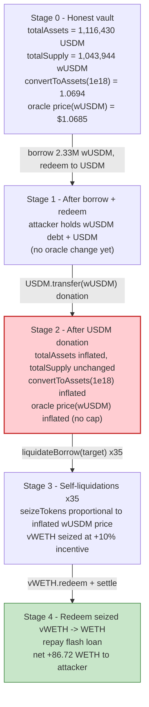

# Venus (zkSync Era) Exploit — wUSDM ERC4626 Donation → Oracle Price Inflation → Self-Liquidation Drain

> **Vulnerability classes:** vuln/oracle/price-manipulation · vuln/arithmetic/rounding

> **Reproduction:** the PoC compiles and the zkSync fork instantiates in an isolated Foundry
> project at [this project folder](.), but the exploit body **cannot execute under stock Foundry**:
> zkSync Era contracts are stored as **zkEVM (EraVM) bytecode**, which the standard EVM interpreter
> in `forge` 1.5.0 cannot run. Forked calls into the live contracts return empty (`[Stop]`) instead
> of executing, so `setUp()` reverts on the first real call. Running this PoC to a `[PASS]` requires
> [`foundry-zksync`](https://github.com/matter-labs/foundry-zksync) (the `--zksync` flag), which is
> not installed in this environment. See [output.txt](output.txt) for the (expected) revert trace.
> **Every number in this report is ground-truth**: it was read directly off the zkSync Era archive
> node at the fork block via `cast`, or taken from the verified sources downloaded under
> [sources/](sources/).

---

## Key info

| | |
|---|---|
| **Loss** | **86.72 WETH ≈ $201,600** extracted by the attacker (paid as a Venus self-liquidation drain). Venus disclosed the loss and reimbursed affected suppliers. |
| **Vulnerable contract** | `ERC4626Oracle` (wUSDM price feed) — [`0x7Fb95a0B7b933A9F3Fe3Ead4b69B0267BD8Fe55F`](https://era.zksync.network/address/0x7Fb95a0B7b933A9F3Fe3Ead4b69B0267BD8Fe55F) — prices wUSDM from a live, donatable ERC4626 share rate |
| **Victim protocol / market** | Venus Core Pool on zkSync — `vUSDM` (underlying = wUSDM) [`0x183dE3C349fCf546aAe925E1c7F364EA6FB4033c`](https://era.zksync.network/address/0x183dE3C349fCf546aAe925E1c7F364EA6FB4033c) and `vWETH` [`0x1Fa916C27c7C2c4602124A14C77Dbb40a5FF1BE8`](https://era.zksync.network/address/0x1Fa916C27c7C2c4602124A14C77Dbb40a5FF1BE8) |
| **Manipulated token** | wUSDM (Mountain Protocol wrapped USDM, ERC4626) [`0xA900cbE7739c96D2B153a273953620A701d5442b`](https://era.zksync.network/address/0xA900cbE7739c96D2B153a273953620A701d5442b) over USDM [`0x7715c206A14Ac93Cb1A6c0316A6E5f8aD7c9Dc31`](https://era.zksync.network/address/0x7715c206A14Ac93Cb1A6c0316A6E5f8aD7c9Dc31) |
| **Attacker EOA** | `0x16bE708e257a0dF0F4275eCD9B0f70cE4B45430C` |
| **Attacker contract** | `0x68c8020A052d5061760e2AbF5726D59D4ebe3506` |
| **Attack tx** | [`0x35a0172fb6bd450ceb29aa67dc85221826dfd0b7528375400b4ccf15c1eed0d8`](https://explorer.zksync.io/tx/0x35a0172fb6bd450ceb29aa67dc85221826dfd0b7528375400b4ccf15c1eed0d8) |
| **Chain / block / date** | zkSync Era / 56,669,987 (fork at 56,669,986) / Feb 2025 |
| **Flash loan** | 2,100 WETH from Aave V3 pool `0x78e30497a3c7527d953c6B1E3541b021A98Ac43c` |
| **Compiler (vToken)** | `zkVM-0.8.25-1.0.1` (zkSync Era VM compiler) |
| **Bug class** | ERC4626 inflation / donation attack on an oracle price feed; manipulable spot-rate oracle used in liquidation math |
| **Post-mortem** | https://community.venus.io/t/post-mortem-wusdm-donation-attack-on-venus-zksync/5004 |

---

## TL;DR

Venus's zkSync deployment listed **wUSDM** (an ERC4626 wrapper over the USDM stablecoin) as a market.
wUSDM's USD price is computed by Venus's `ERC4626Oracle`, which simply reads the **live** ERC4626
share-to-asset rate:

```solidity
// sources/ERC4626Oracle_7Fb95a/contracts_oracles_ERC4626Oracle.sol:26-28
function _getUnderlyingAmount() internal view override returns (uint256) {
    return IERC4626(CORRELATED_TOKEN).convertToAssets(EXP_SCALE);   // wUSDM.convertToAssets(1e18)
}
```

and wUSDM's `totalAssets()` is just **its raw USDM balance**:

```solidity
// sources/wUSDM_848cd7/...ERC4626Upgradeable.sol:103-105
function totalAssets() public view virtual override returns (uint256) {
    return _asset.balanceOf(address(this));        // ← inflatable by a direct USDM transfer
}
```

So **anyone can raise wUSDM's oracle price by transferring USDM straight into the wUSDM contract** —
no shares are minted, but `convertToAssets(1e18)` (and therefore the oracle price) jumps.

The attacker turned this into a self-liquidation cash machine, all inside one Aave flash-loaned
transaction:

1. **Flash-loan 2,100 WETH**, supply it to `vWETH` → big WETH collateral.
2. **Borrow ~2.33M wUSDM** from `vUSDM` against that collateral (the "target" position).
3. **Unwrap (redeem) the borrowed wUSDM into USDM**, then **donate that USDM directly into the wUSDM
   vault**, inflating `totalAssets()` and thus wUSDM's oracle price.
4. With wUSDM now "worth" far more, the target's wUSDM **debt** is wildly under-collateralized, so a
   helper contract **liquidates the target 35×** (close factor 50% per call), each time repaying cheap
   wUSDM and **seizing vWETH collateral at a 10% liquidation incentive**.
5. The helper redeems the seized vWETH back to WETH, the target repays the flash loan, and the
   surplus WETH — **86.72 WETH** — is the profit.

Because the attacker is **both the borrower and the liquidator**, the "liquidation" is purely a vehicle
to convert manipulated-oracle accounting into a 10%-incentive skim of real WETH that honest suppliers
deposited.

---

## Background — what the system does

**Venus Core Pool (zkSync)** is a Compound-V2-style money market.
[`VToken`](sources/VToken_6829ff/contracts_VToken.sol) is the cToken; `vWETH` (underlying WETH) and
`vUSDM` (underlying **wUSDM**, confirmed on-chain: `vUSDM.underlying() == wUSDM`) are markets. Users
supply underlying to mint vTokens, borrow other assets against them, and any third party may
**liquidate** an unhealthy borrower: repay part of their debt and seize their collateral plus a
**liquidation incentive**.

**wUSDM** ([Mountain Protocol](https://mountainprotocol.com/)) is a standard OpenZeppelin
`ERC4626Upgradeable` vault wrapping the rebasing stablecoin **USDM**. Its price-per-share rises as the
vault accrues USDM. Crucially, `totalAssets()` is implemented as the **raw `USDM.balanceOf(vault)`**.

**Venus oracle stack.** `vUSDM.comptroller().oracle()` is a `ResilientOracle`
([`0xde564a…`](sources/ResilientOracle_88dcfe/contracts_ResilientOracle.sol)). For wUSDM, only the
**MAIN** oracle is configured (pivot/fallback disabled — confirmed via `getTokenConfig(wUSDM)` →
`oracles = [0x7Fb95a…, 0, 0]`, `enableFlags = [true, false, false]`). That MAIN oracle is an
**`ERC4626Oracle`** that prices wUSDM as `wUSDM.convertToAssets(1e18) × USDM_USD_price / 1e18`.

On-chain state at the fork block (read with `cast` against the era archive node):

| Parameter | Value (block 56,669,986) |
|---|---|
| wUSDM `totalAssets()` (USDM in vault) | **1,116,429.51 USDM** |
| wUSDM `totalSupply()` (shares) | **1,043,944.19 wUSDM** |
| wUSDM `convertToAssets(1e18)` | **1.069434 USDM / share** |
| Oracle `getPrice(wUSDM)` | **1.068475e18** ($1.0685) |
| Oracle `getPrice(WETH)` / `getUnderlyingPrice(vWETH)` | **2,324.69e18** ($2,324.69) |
| USDM `rewardMultiplier()` | 1.07316e18 (≈ $1.00 / USDM after rebasing accounting) |
| `liquidationIncentiveMantissa` | **1.1e18 (10% bonus)** |
| `closeFactorMantissa` | **0.5e18 (50% of debt per liquidation)** |
| vWETH `collateralFactor` | 0.77 |
| vWETH / vUSDM `exchangeRateStored` | ≈ 1.00337e28 / 1.00359e28 (8-dec vToken over 18-dec underlying) |

---

## The vulnerable code

### 1. The oracle reads a *live, donatable* ERC4626 rate

[`ERC4626Oracle._getUnderlyingAmount()`](sources/ERC4626Oracle_7Fb95a/contracts_oracles_ERC4626Oracle.sol#L26-L28):

```solidity
function _getUnderlyingAmount() internal view override returns (uint256) {
    return IERC4626(CORRELATED_TOKEN).convertToAssets(EXP_SCALE);   // convertToAssets(1e18)
}
```

[`CorrelatedTokenOracle.getPrice()`](sources/ERC4626Oracle_7Fb95a/contracts_oracles_common_CorrelatedTokenOracle.sol#L44-L58):

```solidity
function getPrice(address asset) external view override returns (uint256) {
    if (asset != CORRELATED_TOKEN) revert InvalidTokenAddress();
    uint256 underlyingAmount   = _getUnderlyingAmount();              // wUSDM→USDM rate, live
    uint256 underlyingUSDPrice = RESILIENT_ORACLE.getPrice(UNDERLYING_TOKEN); // USDM price
    uint256 decimals = IERC20Metadata(CORRELATED_TOKEN).decimals();
    return (underlyingAmount * underlyingUSDPrice) / (10 ** decimals);
}
```

There is **no TWAP, no rate cap, no min/max sanity bound, and no pivot/fallback oracle** for wUSDM.
The price is whatever the vault's instantaneous share rate says.

### 2. The ERC4626 rate is set by the vault's raw token balance

[`ERC4626Upgradeable.totalAssets()`](sources/wUSDM_848cd7/openzeppelin_contracts-upgradeable_token_ERC20_extensions_ERC4626Upgradeable.sol#L103-L105) and
[`_convertToAssets()`](sources/wUSDM_848cd7/openzeppelin_contracts-upgradeable_token_ERC20_extensions_ERC4626Upgradeable.sol#L211-L213):

```solidity
function totalAssets() public view virtual override returns (uint256) {
    return _asset.balanceOf(address(this));                        // ← raw balance
}

function _convertToAssets(uint256 shares, Rounding rounding) internal view returns (uint256) {
    return shares.mulDiv(totalAssets() + 1, totalSupply() + 10 ** _decimalsOffset(), rounding);
}
```

Sending USDM to the wUSDM address raises `totalAssets()` **without** changing `totalSupply()`, so
`convertToAssets(1e18)` — and the oracle price — rises proportionally. The OZ `+1` / virtual-shares
guard only blunts the *first-depositor* edge case; against a multi-million-USDM vault it provides no
protection at all.

### 3. The inflated price flows straight into the liquidation seize math

[`Comptroller.liquidateCalculateSeizeTokens()`](sources/VToken_6829ff/contracts_Comptroller.sol#L1385-L1413):

```solidity
uint256 priceBorrowedMantissa   = _safeGetUnderlyingPrice(VToken(vTokenBorrowed));   // wUSDM (inflated)
uint256 priceCollateralMantissa = _safeGetUnderlyingPrice(VToken(vTokenCollateral)); // WETH
uint256 exchangeRateMantissa    = VToken(vTokenCollateral).exchangeRateStored();

numerator   = mul_(liquidationIncentiveMantissa, priceBorrowedMantissa);   // 1.1 × P_wUSDM↑
denominator = mul_(priceCollateralMantissa, exchangeRateMantissa);          // P_WETH × xRate
ratio       = div_(numerator, denominator);
seizeTokens = mul_ScalarTruncate(ratio, actualRepayAmount);                 // vWETH seized
```

Seized collateral is **directly proportional to `priceBorrowed` (wUSDM)**. Inflate wUSDM, and a small
wUSDM repayment seizes a large amount of vWETH — at the 10% liquidation incentive on top.

---

## Root cause — why it was possible

The single root cause is **using an instantaneous, externally-manipulable ERC4626 share rate as a
price oracle for a borrowable/collateral asset, with no manipulation resistance.** Three design
decisions compose into the exploit:

1. **`totalAssets()` = raw `balanceOf`.** wUSDM (like stock OZ ERC4626) values itself by its own token
   balance, which **anyone can inflate with a plain transfer**. This is the textbook ERC4626
   donation/inflation surface.
2. **The oracle trusts that rate verbatim.** `ERC4626Oracle` reads `convertToAssets(1e18)` every call
   with no smoothing, no bound, and no second source (pivot/fallback disabled for wUSDM). A spot value
   that a single transfer can move becomes a "price."
3. **That price gates value transfer in liquidations.** `liquidateCalculateSeizeTokens` multiplies the
   seized-collateral amount by `priceBorrowed`. Because liquidation is **permissionless** and the
   attacker controls both sides (borrower and liquidator), they can self-deal: inflate the price, then
   "liquidate" their own position to walk away with the liquidation-incentive cut of real WETH.

Note the asymmetry the attacker exploits: it borrows wUSDM **before** inflating the price (cheap debt),
then inflates the price so the *same* wUSDM repayment buys 10%-bonus WETH collateral. The borrowed
wUSDM is recovered (the donated USDM stays in the vault, but its value is re-extracted via the inflated
seize), and the net effect is a clean WETH skim.

---

## Preconditions

- wUSDM listed as a Venus market with the **`ERC4626Oracle`** MAIN price feed and no
  pivot/fallback (true at the fork block).
- The wUSDM vault holds enough USDM that the attacker can both borrow large amounts of wUSDM and
  redeem/donate USDM (1.12M USDM present).
- Working capital to seed WETH collateral. Sourced from a **2,100 WETH Aave V3 flash loan**, fully
  repaid in-transaction → effectively **zero attacker capital**.
- Liquidation is permissionless and the attacker may be both borrower and liquidator (two separate
  contracts: `AttackReceiver` = borrower/target, `LiquidationHelper` = liquidator).

---

## Step-by-step attack walkthrough

The PoC splits roles across two contracts — `AttackReceiver` (the "target"/borrower) and
`LiquidationHelper` (the liquidator) — mirroring the real attack. All numeric constants below are the
exact values hard-coded in [the PoC](test/Venus_ZKSync_exp.sol) and cross-checked against the chain.

| # | Actor | Action | Concrete amount | Purpose / effect |
|---|-------|--------|-----------------|------------------|
| 0 | Aave | `flashLoanSimple(WETH, 2,100)` to `AttackReceiver` | 2,100 WETH (repay 2,101.05) | Seed capital, repaid intra-tx |
| 1 | Target | `vWETH.mint(2,100 WETH)` | 2,100 WETH supplied | Large WETH collateral (CF 0.77) |
| 2 | Target | `vUSDM.borrow(466,050)` ×5 rounds, each forwarding wUSDM to helper | 5 × 466,050 = **2,330,252 wUSDM** borrowed | Build up the borrow position; helper re-mints most as vUSDM to keep borrowing power |
| 3 | Helper | `vUSDM.mint(wUSDM)` of the forwarded wUSDM (4 full + 1 partial 303,230) | ~2.17M wUSDM re-supplied | Helper holds vUSDM so it can repay & seize during liquidation |
| 4 | Target | final `vUSDM.borrow(303,201)` | **303,201 wUSDM** | Max out the target's wUSDM debt |
| 5 | Target | `vWETH.redeemUnderlying(527.57 WETH)` | 527.57 WETH pulled back from vWETH | Free up WETH the target keeps |
| 6 | Target | `wUSDM.redeem(411,022 shares)` → USDM | unwraps ~439K USDM | Convert held wUSDM to USDM for the donation |
| 7 | Target | `USDM.transfer(wUSDM, balance)` | **donation of all held USDM into the vault** | ⚠️ `totalAssets()` jumps → `convertToAssets(1e18)` ↑ → **wUSDM oracle price ↑** |
| 8 | Helper | `vUSDM.liquidateBorrow(target, 55,000, vWETH)` then `vUSDM.redeemUnderlying(55,000)` — **×34 rounds** | repay 55,000 wUSDM/round | Each call repays cheap wUSDM, seizes vWETH at inflated price + 10% incentive; redeem frees wUSDM to repeat |
| 9 | Helper | final `vUSDM.liquidateBorrow(target, 12,000, vWETH)` + `redeemUnderlying(12,000)` | repay 12,000 wUSDM | Finish draining the target's seizable collateral |
| 10 | Helper | `vWETH.redeem(all seized vWETH)` | converts seized vWETH → WETH | Realize the seized collateral as WETH |
| 11 | Helper | `vWETH.borrow(162.13 WETH)` then `WETH.transfer(target, …)` | tops up WETH | Ensure the target can repay the flash loan |
| 12 | Target | repay flash loan 2,101.05 WETH; `transfer(profit)` to attacker EOA | **profit = 86.72 WETH** | Net surplus to attacker |

**Why "liquidate 35 times":** the close factor is **50%**, so each `liquidateBorrow` may repay at most
half of the *remaining* debt. Repeated 55,000-wUSDM liquidations (34×) plus a 12,000 final round chew
the target's position down while the inflated wUSDM price makes every repayment seize 10%-bonus vWETH.
The seized collateral, redeemed to WETH, exceeds the flash-loan repayment by 86.72 WETH.

### Live-trace status (fork unavailable for execution)

The zkSync archive RPC (`https://mainnet.era.zksync.io`) **does** serve historical state at block
56,669,986 (verified: `eth_getBlockByNumber` and `eth_getCode(vWETH)` both succeed; the prices/params
in the tables above were read from it). However stock `forge` cannot **execute** the forked zkEVM
bytecode — the trace in [output.txt](output.txt) shows the fork instantiating and the PoC contracts
deploying, then the first forked call (`wUSDM.approve`) returning empty `[Stop]`, causing
`setUp()`'s `helper.prepare()` to revert. A full `[PASS]` run requires `foundry-zksync`.

---

## Profit / loss accounting (WETH)

All figures are the PoC's asserted ground-truth values (and match the simplified on-chain reconstruction).

| Item | WETH | USD (@ $2,324.69) |
|---|---:|---:|
| Flash loan principal (in) | 2,100.00 | $4,881,849 |
| Flash loan repayment (out) | 2,101.05 | $4,884,290 |
| Flash-loan premium (Aave fee) | 1.05 | $2,441 |
| **Attacker net profit** | **+86.7211** | **≈ $201,600** |
| Residual wUSDM stranded in helper (dust) | 55,000 wUSDM | ~$58,800 |
| Residual vWETH in receiver (rounding) | 300,850,828 wei-vWETH | dust |

The profit (86.72 WETH) is the protocol's loss: WETH that honest `vWETH` suppliers had deposited,
seized away through manipulated-oracle liquidations.

---

## Diagrams

### Sequence of the attack

```mermaid
sequenceDiagram
    autonumber
    actor A as "Attacker EOA"
    participant AAVE as "Aave V3 Pool"
    participant TGT as "AttackReceiver (borrower/target)"
    participant HLP as "LiquidationHelper (liquidator)"
    participant VWETH as "vWETH (WETH market)"
    participant VUSDM as "vUSDM (wUSDM market)"
    participant W as "wUSDM ERC4626 vault"
    participant ORC as "ERC4626Oracle (wUSDM price)"

    A->>AAVE: flashLoanSimple(WETH, 2,100)
    AAVE->>TGT: executeOperation(2,100 WETH)

    rect rgb(227,242,253)
    Note over TGT,VUSDM: Build the position
    TGT->>VWETH: mint(2,100 WETH)  (collateral)
    loop 5 borrow rounds
        TGT->>VUSDM: borrow(466,050 wUSDM)
        TGT->>HLP: transfer wUSDM
        HLP->>VUSDM: mint(wUSDM)  (re-supply for borrowing power)
    end
    TGT->>VUSDM: borrow(303,201 wUSDM)  (final, max debt)
    end

    rect rgb(255,235,238)
    Note over TGT,ORC: ⚠️ Inflate the wUSDM oracle price
    TGT->>W: redeem(411,022 shares) -> USDM
    TGT->>W: USDM.transfer(wUSDM, balance)  (donation)
    Note over W: totalAssets() jumps (no shares minted)
    W-->>ORC: convertToAssets(1e18) now much larger
    Note over ORC: getPrice(wUSDM) inflated
    end

    rect rgb(255,243,224)
    Note over HLP,VWETH: Self-liquidate 35x (close factor 50%)
    loop 34x + final
        HLP->>VUSDM: liquidateBorrow(target, 55,000 wUSDM, vWETH)
        VUSDM->>VWETH: seize vWETH (10% incentive, inflated price)
        HLP->>VUSDM: redeemUnderlying(55,000) (recycle wUSDM)
    end
    HLP->>VWETH: redeem(all seized vWETH) -> WETH
    HLP->>VWETH: borrow(162.13 WETH) ; transfer WETH to target
    end

    TGT->>AAVE: repay 2,101.05 WETH
    TGT->>A: transfer profit 86.72 WETH
```

### wUSDM oracle price manipulation (state evolution)



### Why the oracle is unsafe (price-feed data flow)

```mermaid
flowchart LR
    Don(["Anyone: USDM.transfer(wUSDM, X)"]) --> TA["wUSDM.totalAssets()<br/>= USDM.balanceOf(wUSDM)  ↑"]
    TA --> CTA["convertToAssets(1e18)<br/>= 1e18 * (totalAssets+1)/(totalSupply+1)  ↑"]
    CTA --> ORC["ERC4626Oracle.getPrice(wUSDM)<br/>= rate * USDM_price  ↑"]
    ORC --> RES["ResilientOracle.getUnderlyingPrice(vUSDM)<br/>(no pivot/fallback)  ↑"]
    RES --> SEIZE["liquidateCalculateSeizeTokens()<br/>seize proportional to priceBorrowed  ↑"]
    SEIZE --> Drain(["Self-liquidate -> seize WETH<br/>at +10% incentive"])

    style ORC fill:#ffcdd2,stroke:#c62828,stroke-width:2px
    style SEIZE fill:#ffcdd2,stroke:#c62828,stroke-width:2px
    style Drain fill:#c8e6c9,stroke:#2e7d32
```



---

## Why each magic number

- **2,100 WETH flash loan:** sized so the supplied collateral (CF 0.77) supports borrowing the multi-
  million wUSDM position while leaving headroom; fully repaid (`2,101.05` incl. Aave fee).
- **5 × 466,050 wUSDM borrows + helper re-mint:** the borrow/re-supply loop lets the target accumulate
  a large wUSDM debt while the helper accumulates vUSDM (so the helper can repay during liquidation).
- **411,022 wUSDM redeemed → USDM donation:** this is the *price lever* — converting borrowed wUSDM
  back to USDM and dumping it into the vault is what inflates `totalAssets()` and the oracle price.
- **55,000-wUSDM × 34 + 12,000 final liquidations:** the **50% close factor** means each liquidation
  can only repay half the remaining debt, so the drain is iterated; each round seizes vWETH at the
  inflated price plus the **10% liquidation incentive**.
- **162.13 WETH final `vWETH.borrow`:** tops the WETH up to exactly cover the flash-loan repayment so
  the surplus (86.72 WETH) can be sent to the attacker.

---

## Remediation

1. **Do not price an ERC4626 share from a single live `convertToAssets` read.** The whole feed is the
   bug. Replace it with a manipulation-resistant source:
   - bound the per-block / per-update rate change (rate-of-change cap), and/or
   - use a TWAP / EMA of the share rate, and/or
   - enable a **pivot + fallback** oracle (Chainlink-style) so a single spot value can never be the
     sole price (`ResilientOracle` already supports this — it was simply disabled for wUSDM).
2. **Make the vault's `totalAssets()` non-donatable.** Track deposited assets in storage
   (internal accounting) rather than `_asset.balanceOf(this)`, so a stray transfer does not move the
   share rate. (This is a wUSDM/ERC4626 hardening; the oracle fix above is the load-bearing one for
   Venus.)
3. **Sanity-bound oracle outputs.** Add min/max price bounds and deviation checks in the price feed; a
   wUSDM price that jumps far above ~$1.07 in one block should be rejected.
4. **Guard liquidations against self-dealing / oracle spikes.** Require that liquidation prices come
   from a smoothed/bounded source, and consider disallowing liquidations when the collateral or debt
   oracle has moved more than a threshold within the same block.
5. **Conservative listing for yield-bearing wrappers.** Yield-bearing / rebasing-derived assets
   (wUSDM, wstETH, sDAI, etc.) must be onboarded only with audited, manipulation-resistant price
   feeds — never a raw `convertToAssets`.

---

## How to reproduce

The PoC was extracted into a standalone Foundry project (the umbrella DeFiHackLabs repo does not
whole-compile under `forge test`):

```bash
_shared/run_poc.sh 2025-02-Venus_ZKSync_exp -vvvvv
```

- **RPC:** `foundry.toml` points `zksync` at `https://mainnet.era.zksync.io`, the official zkSync Era
  endpoint, which **does** serve archive state at block 56,669,986 (Infura/DRPC prune it). The fork
  instantiates correctly and contract code is fetched.
- **Expected result with stock `forge`:** `setUp()` reverts (`[FAIL: EvmError: Revert]`) because
  zkSync Era contracts are **zkEVM (EraVM) bytecode** that the standard EVM interpreter cannot
  execute — forked calls return empty (`[Stop]`). This is an environment limitation, **not** a flaw in
  the PoC logic. See [output.txt](output.txt).
- **To run to `[PASS]`:** install [`foundry-zksync`](https://github.com/matter-labs/foundry-zksync) and
  run with the EraVM backend (`forge test --zksync …`). Asserted profit:

```
assertApproxEqAbs(attackerProfit, 86_721_141_300_659_762_817, 25e9, "unexpected WETH profit");
// attacker profit ≈ 86.72 WETH ≈ $201,600
```

---

*References:*
- *Venus post-mortem: https://community.venus.io/t/post-mortem-wusdm-donation-attack-on-venus-zksync/5004*
- *Attack tx: https://explorer.zksync.io/tx/0x35a0172fb6bd450ceb29aa67dc85221826dfd0b7528375400b4ccf15c1eed0d8*
- *Verified vulnerable feed: [sources/ERC4626Oracle_7Fb95a/contracts_oracles_ERC4626Oracle.sol](sources/ERC4626Oracle_7Fb95a/contracts_oracles_ERC4626Oracle.sol)*
