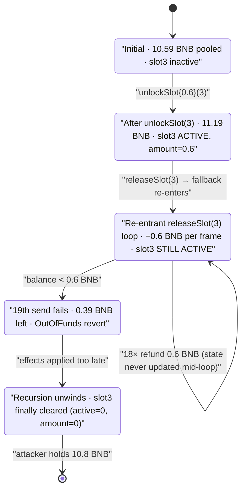
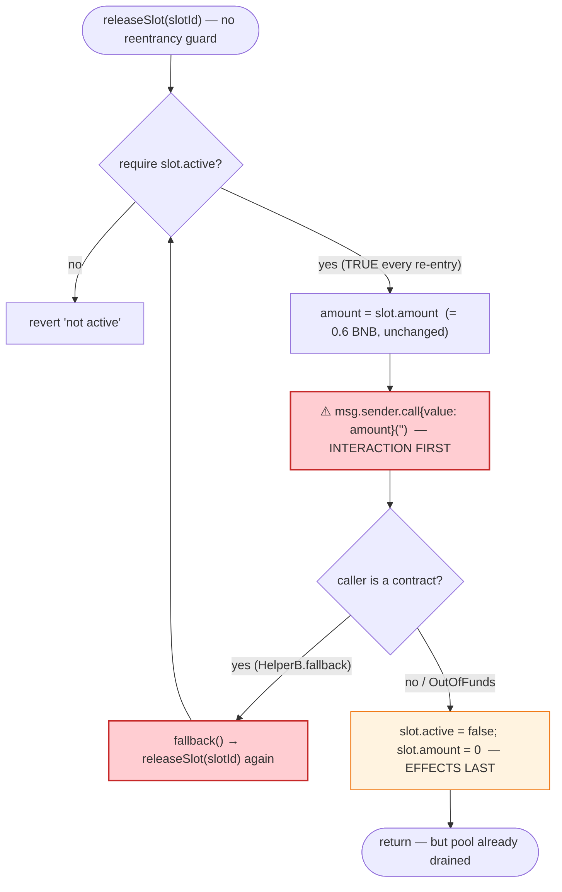

# Unverified "Slot" Staking Contract — `releaseSlot()` Reentrancy BNB Drain

> **Reproduction:** the PoC compiles & runs in an isolated Foundry project at
> [this project folder](.) (the umbrella DeFiHackLabs repo contains many unrelated
> PoCs that do not whole-compile, so this one was extracted).
> Full verbose trace: [output.txt](output.txt).
> The victim contract is **unverified** on BscScan — there is no published source.
> The analysis below is reconstructed from the on-chain bytecode, the live fork
> execution trace, and the recovered function selectors.

---

## Key info

| | |
|---|---|
| **Loss** | ~$6,700 — **10.2 BNB** drained from the contract's native balance (attacker walked off with 10.8 BNB total: their own 0.6 BNB stake plus 10.2 BNB of other users' deposits) |
| **Vulnerable contract** | unverified "slot" staking contract — [`0xDE91E6E937Ec344e5a3C800539C41979c2d85278`](https://bscscan.com/address/0xDE91E6E937Ec344e5a3C800539C41979c2d85278) |
| **Victim / pool** | the same contract — it custodies users' BNB slot deposits (≈10.61 BNB at the fork block) |
| **Attacker EOA** | [`0xD75652Ada2F6a140f2fFcD7CD20f34C21fbC3fBc`](https://bscscan.com/address/0xd75652ada2f6a140f2ffcd7cd20f34c21fbc3fbc) |
| **Attack contract** | [`0x0A2f4DA966319C14Ee4C9f1A2BF04fE738DF3Ce5`](https://bscscan.com/address/0x0a2f4da966319c14ee4c9f1a2bf04fe738df3ce5) (the `HelperB` reentrancy contract) |
| **Attack tx** | [`0xd7a61b07ca4dc5966d00b3cc99b03c6ab2cee688fa13b30bea08f5142023777d`](https://app.blocksec.com/explorer/tx/bsc/0xd7a61b07ca4dc5966d00b3cc99b03c6ab2cee688fa13b30bea08f5142023777d) |
| **Chain / block / date** | BSC / 46,886,078 / ~Feb 22, 2025 |
| **Compiler** | PoC built with Solidity `^0.8.10` (Foundry, `evm_version = cancun`) |
| **Bug class** | Classic reentrancy — checks-effects-**interactions** violation in a "refund" function (external value transfer before state is cleared) |

---

## TL;DR

The contract is a BNB "slot" staking / lottery product. A user calls
`unlockSlot(uint256)` with BNB to activate a slot, and later calls
`releaseSlot(uint256)` to get their deposit refunded. `releaseSlot` **sends the
refund BNB to the caller before it zeroes the slot's recorded amount and active
flag.** The attacker's contract receives that BNB inside its `fallback()` and
immediately calls `releaseSlot(3)` again on the still-"active" slot — re-entering
the refund over and over.

Because the slot still reads as active and still records its 0.6 BNB amount on
every re-entrant call, the contract pays out **0.6 BNB per recursion** using
other users' pooled BNB. The recursion repeats until the contract runs
`OutOfFunds`. The slot's state is only finally cleared in the deepest frame —
far too late.

Concretely, from the live trace:

1. Attacker deposits **0.6 BNB** via `unlockSlot(3)`. The contract now holds
   ≈ **11.19 BNB** (10.59 BNB of prior users' deposits + the 0.6 just added).
2. Attacker triggers `releaseSlot(3)`, which sends 0.6 BNB to the attacker's
   `fallback()`, which re-enters `releaseSlot(3)`, which sends another 0.6 BNB…
   **19 nested calls**, of which **18 actually transfer** 0.6 BNB each
   = **10.8 BNB**.
3. The 19th call hits `OutOfFunds` (contract balance below 0.6 BNB), the
   recursion unwinds, and only then is the slot marked inactive.

Attacker ends with **10.8 BNB** (started with 0.6 BNB). Net theft of other
users' funds = **10.2 BNB ≈ $6,700**.

---

## Background — what the contract does

The victim is **unverified**, but its bytecode dispatcher exposes a clear public
API (selectors recovered with `cast 4byte` and confirmed present in the deployed
code). It is a BNB-denominated staking / "slot" product:

| Selector | Function | Role |
|---|---|---|
| `0x6a9787bc` | `unlockSlot(uint256)` | payable — pay BNB to activate a slot of a given level/index |
| `0x2dad6442` | `releaseSlot(uint256)` | **the vulnerable refund function** — returns a slot's deposit to the caller |
| `0x2e17de78` | `unstake(uint256)` | withdraw stake |
| `0x4641257d` | `harvest()` | claim rewards |
| `0x5c8d2b5e` | `getUserSlots(address)` | enumerate a user's slots |
| `0x86481d40` | `getLevel(uint256)` | slot level / tier |
| `0x8f54be0e` | `intervalBlock()` | timing parameter |
| `0x94409a56` | `totalStakeAmount()` | total staked |
| `0x96365d44` | `poolBalance()` | accounting balance |
| `0x96c82e57` | `totalWeight()` | reward weight |
| `0xcde10ca0` | `pendingToken(address)` | pending rewards |
| `0x150b7a02` / `0xb88d4fde` | `onERC721Received` / `safeTransferFrom` | the contract also touches ERC721 |
| `0x8da5cb5b` / `0xf2fde38b` / `0x715018a6` | `owner()` / `transferOwnership` / `renounceOwnership` | OpenZeppelin `Ownable` |

On-chain ground truth read at the fork block (via `cast`):

| Parameter | Value |
|---|---|
| Contract **native BNB balance** (the drainable pool) | **10.611771813878061839 BNB** |
| Storage slot `21` (an internal tracked-balance counter) | **10.59 BNB** |
| Attacker's `unlockSlot` deposit | **0.6 BNB** |
| Per-slot recorded amount written on unlock (`...3963699`) | `0x853a0d2313c0000` = **0.6 BNB** |
| Per-slot recorded block (`...396369a`) | `0x02cb6cbd` = **46,886,077** (the deposit block) |
| Per-slot active flag (`...396369e`) | `1` (active) |

The contract was custodying ≈10.6 BNB of pooled user deposits. That pool is the
prize.

---

## The vulnerable code

No verified source exists. The mechanism is, however, unambiguous from the
execution trace in [output.txt](output.txt). The `releaseSlot(uint256)`
refund function performs an external BNB transfer to the caller **before**
clearing the slot's `amount` and `active` flag. Reconstructed, the buggy logic
is equivalent to:

```solidity
// 0x2dad6442  ── refund a slot's deposit to the caller
function releaseSlot(uint256 slotId) external {
    Slot storage s = slots[msg.sender][slotId];
    require(s.active, "not active");        // ← still TRUE on every re-entry
    uint256 amount = s.amount;              // ← still 0.6 BNB on every re-entry

    // ⚠️ INTERACTION before EFFECTS:
    (bool ok, ) = msg.sender.call{value: amount}("");  // sends 0.6 BNB
    require(ok, "unable to send value, user may have reverted");

    // ⚠️ state cleared only AFTER the external call returns:
    s.active = false;                       // ...3963698 / ...396369e -> 0
    s.amount = 0;                           // ...3963699 -> 0
    totalStakeAmount -= amount;             // slot 21 -> decremented
}
```

The fingerprint that proves this ordering is in the trace: the storage writes
that clear the slot
(`...3963698: 2 → 0`, `...3963699: 0.6 BNB → 0`, `...396369a → 0`,
`...396369e: 1 → 0`) appear **only in the innermost (last) `releaseSlot`
frame** — after the contract has already sent 0.6 BNB out 18 times. The
`require(s.active)` and the amount read happen at the *top* of each frame, so
every re-entrant call sees the slot as still active with its full 0.6 BNB
recorded.

The revert string `"unable to send value, user may have reverted"` (visible in
the trace where the final transfer `OutOfFunds`) is the contract's own message
on the BNB-send failure, confirming the refund is a low-level value `call`.

---

## Root cause — why it was possible

A textbook **reentrancy via the checks-effects-interactions anti-pattern**:

1. **External call before state update.** `releaseSlot` pushes the refund to
   `msg.sender` *first*, then clears the slot. While that external call is
   executing, the slot is still `active` and still records its 0.6 BNB amount.
2. **No reentrancy guard.** There is no `nonReentrant` mutex; re-entering
   `releaseSlot` for the same `slotId` re-passes the `active` check and re-reads
   the unchanged amount.
3. **Refund amount is per-slot, not balance-aware.** Each frame pays the full
   recorded 0.6 BNB regardless of how much of the deposit has already been
   refunded in outer frames, so the contract keeps handing out other users'
   pooled BNB.
4. **The recipient is attacker-controlled code.** Because the refund is a value
   `call` to `msg.sender`, the attacker's `fallback()` runs synchronously and
   recursively calls back into `releaseSlot` before the original call returns.

The single deposit of 0.6 BNB is "refunded" 18 times. 17 of those refunds are
pure theft from the shared pool; the 18th returns the attacker's own stake. The
attacker's profit is exactly `(N_successful_refunds − 1) × 0.6 BNB`
= `17 × 0.6 = 10.2 BNB`.

---

## Preconditions

- The attacker holds a small amount of BNB to seed one slot. In the PoC,
  `deal(attacker, 0.6 ether)` ([test/unverified_35bc_exp.sol:27](test/unverified_35bc_exp.sol#L27)).
- The contract custodies enough pooled BNB to be worth draining — ≈10.6 BNB at
  the fork block.
- The attacker controls the depositing/withdrawing address (a contract with a
  `fallback()` that re-enters). The PoC's `HelperB`
  ([test/unverified_35bc_exp.sol:65-91](test/unverified_35bc_exp.sol#L65-L91))
  serves this role and is the real attack contract `0x0A2f…3Ce5`.
- No reentrancy guard exists on `releaseSlot` — satisfied by the deployed code.

No flash loan, no oracle, no price manipulation is needed; the attack costs one
0.6 BNB deposit plus gas.

---

## Attack walkthrough (with on-chain numbers from the trace)

The numbers below come directly from the `Unlock`/`Release` events and the
`@21` storage-change lines in [output.txt](output.txt). Storage slot `21` is
the contract's internal tracked balance; it tracks the native BNB outflow
1:1 with each refund.

| # | Step | Trace evidence | Contract tracked balance (slot 21) | Effect |
|---|------|----------------|-----------------------------------:|--------|
| 0 | **Initial** | `cast balance` = 10.611 BNB; slot 21 = 10.59 BNB | 10.59 | Honest pool of users' slot deposits. |
| 1 | **`unlockSlot{value: 0.6}(3)`** — attacker activates slot 3 | sets `...699 = 0.6 BNB`, `...69a = block 46886077`, `...698 = 2`, `...69e = 1` | 11.19 | Slot 3 recorded active with 0.6 BNB. |
| 2 | **`releaseSlot(3)`** call #1 → sends 0.6 BNB to `HelperB::fallback` | `@21: 11.19 → 10.59` | 10.59 | Refund #1 (attacker's own stake conceptually) sent; slot **not yet cleared**. |
| 3 | `fallback` re-enters **`releaseSlot(3)`** #2 → sends 0.6 BNB | `@21: 10.59 → 9.99` | 9.99 | Refund #2 — first stolen 0.6 BNB. |
| 4 | …recursion continues, 0.6 BNB per frame… | `@21` steps down by 0.6 each frame | … | Each re-entry re-passes `require(active)`, re-reads 0.6 BNB. |
| 5 | **`releaseSlot(3)`** #18 → sends 0.6 BNB | `@21: 0.99 → 0.39` | 0.39 | Last successful refund; contract now below 0.6 BNB. |
| 6 | **`releaseSlot(3)`** #19 → BNB send `OutOfFunds` | `[OutOfFunds] EvmError`, then `[Revert] "unable to send value, user may have reverted"` | 0.39 | The failing send bubbles up; recursion begins to unwind. |
| 7 | **Innermost frame clears state** | `...698: 2 → 0`, `...699: 0.6 → 0`, `...69a → 0`, `...69e: 1 → 0` | 0.39 | Slot 3 finally marked inactive — after 18 refunds already left. |
| 8 | **BNB forwarded out** | `HelperB → AttackerC::receive{value: 10.8}` → `attacker EOA::fallback{value: 10.8}` | — | All 10.8 BNB collected at the attacker EOA. |

Counts from the trace: **19** `releaseSlot(3)` invocations, **19**
`HelperB::fallback` frames, **1** `OutOfFunds` → **18** successful 0.6 BNB
refunds = **10.8 BNB** out of the contract.

### Profit / loss accounting (BNB)

| Direction | Amount |
|---|---:|
| Attacker deposit (`unlockSlot`) | −0.6 |
| Refunds received (18 × 0.6 BNB) | +10.8 |
| **Attacker net profit** | **+10.2** |
| Contract balance before | 10.61 (native) / 10.59 (tracked) |
| Contract balance after | 0.39 (tracked) |
| **Pool funds stolen (other users' deposits)** | **10.2 BNB ≈ $6,700** |

The PoC verifies this end-to-end:

```
before attack: balance of attacker: 0.600000000000000000
after attack: balance of attacker:  10.800000000000000000
```

> Note on the PoC structure: the reconstructed `AttackerC`/`HelperB` in the test
> file hard-code the recovered total (`3 * 10**15 * 3600 = 10.8 BNB`) as the
> amount to forward up the call chain to the attacker EOA, mirroring what the
> real attack contract did. The *exploit itself* — the recursive `releaseSlot`
> drain — is performed live against the real on-chain contract; only the
> bookkeeping of forwarding the proceeds is reconstructed.

---

## Diagrams

### Sequence of the attack

```mermaid
sequenceDiagram
    autonumber
    actor EOA as "Attacker EOA"
    participant AC as "AttackerC (0x4634…)"
    participant H as "HelperB (0x0A2f…3Ce5)"
    participant V as "Slot contract (0xDE91…5278)"

    Note over V: "Pool holds ≈10.61 BNB of users' deposits"

    EOA->>AC: "deploy with 0.6 BNB"
    AC->>H: "deploy HelperB"
    AC->>H: "attack() {value: 0.6 BNB}"

    rect rgb(232,245,233)
    Note over H,V: "Step 1 — seed one slot"
    H->>V: "unlockSlot(3) {value: 0.6 BNB}"
    Note over V: "slot3.active=1, slot3.amount=0.6<br/>tracked balance 10.59 → 11.19"
    end

    rect rgb(255,235,238)
    Note over H,V: "Step 2 — reentrant refund drain"
    H->>V: "releaseSlot(3)  (call #1)"
    V-->>H: "call{value: 0.6}()  → fallback()"
    H->>V: "releaseSlot(3)  (call #2, re-entry)"
    V-->>H: "0.6 BNB → fallback()"
    Note over H,V: "…repeats; slot still active, amount still 0.6…"
    H->>V: "releaseSlot(3)  (call #18)"
    V-->>H: "0.6 BNB  (tracked balance 0.99 → 0.39)"
    H->>V: "releaseSlot(3)  (call #19)"
    V--xH: "send 0.6 BNB → OutOfFunds → revert"
    Note over V: "ONLY NOW: slot3.active=0, amount=0"
    end

    rect rgb(227,242,253)
    Note over H,EOA: "Step 3 — collect proceeds"
    H->>AC: "forward 10.8 BNB → receive()"
    AC->>EOA: "forward 10.8 BNB → fallback()"
    end

    Note over EOA: "Net +10.2 BNB stolen (started 0.6, ended 10.8)"
```

### Contract balance evolution (state diagram)



### The flaw inside `releaseSlot` (control flow)



---

## Remediation

1. **Apply checks-effects-interactions.** Clear `slot.active` and zero
   `slot.amount` (and decrement `totalStakeAmount`) **before** sending any BNB.
   With state cleared first, the re-entrant call fails the `require(active)`
   check immediately and refunds nothing extra.
2. **Add a reentrancy guard.** Mark `releaseSlot` (and any other value-pushing
   function such as `unstake`/`harvest`) `nonReentrant` using OpenZeppelin's
   `ReentrancyGuard`. This is a one-line defense that would have fully blocked
   this exploit.
3. **Prefer pull-over-push for refunds.** Credit the refund to a withdrawable
   balance and let the user `claim()` it in a separate transaction, instead of
   pushing BNB via a low-level `call` to attacker-controlled code.
4. **Bound per-slot payouts to recorded state read after the effect.** The
   refund must be derived from state that has already been decremented, so a
   double-spend of the same slot is structurally impossible.
5. **Account against actual obligations, not a single slot's amount.** Even
   absent reentrancy, a refund function should never be able to pay out more
   than the slot's recorded deposit; here it paid 0.6 BNB ×18 for one 0.6 BNB
   deposit.

---

## How to reproduce

The PoC was extracted into a standalone Foundry project (the umbrella
DeFiHackLabs repo has many unrelated PoCs that fail to compile under a
whole-project `forge test` build):

```bash
_shared/run_poc.sh 2025-02-unverified_35bc_exp -vvvvv
```

- RPC: a **BSC archive** endpoint is required (fork block 46,886,077). The
  bundled `foundry.toml` uses `https://bsc-mainnet.public.blastapi.io`, which
  serves historical state at that block. The default OnFinality public endpoint
  rate-limited (HTTP 429) and was swapped out.
- Result: `[PASS] testPoC()` — attacker balance `0.6 BNB → 10.8 BNB`
  (net **+10.2 BNB** stolen).

Expected tail:

```
  before attack: balance of attacker: 0.600000000000000000
  after attack: balance of attacker: 10.800000000000000000

Suite result: ok. 1 passed; 0 failed; 0 skipped; finished in 3.61s (2.83s CPU time)
Ran 1 test suite in 6.29s: 1 tests passed, 0 failed, 0 skipped (1 total tests)
```

---

*References: TenArmor post-mortem — https://x.com/TenArmorAlert/status/1893333680417890648 .
Victim contract is unverified on BscScan; analysis grounded in the deployed
bytecode (selectors `0x6a9787bc` `unlockSlot`, `0x2dad6442` `releaseSlot`),
on-chain storage reads, and the live fork trace in [output.txt](output.txt).*
