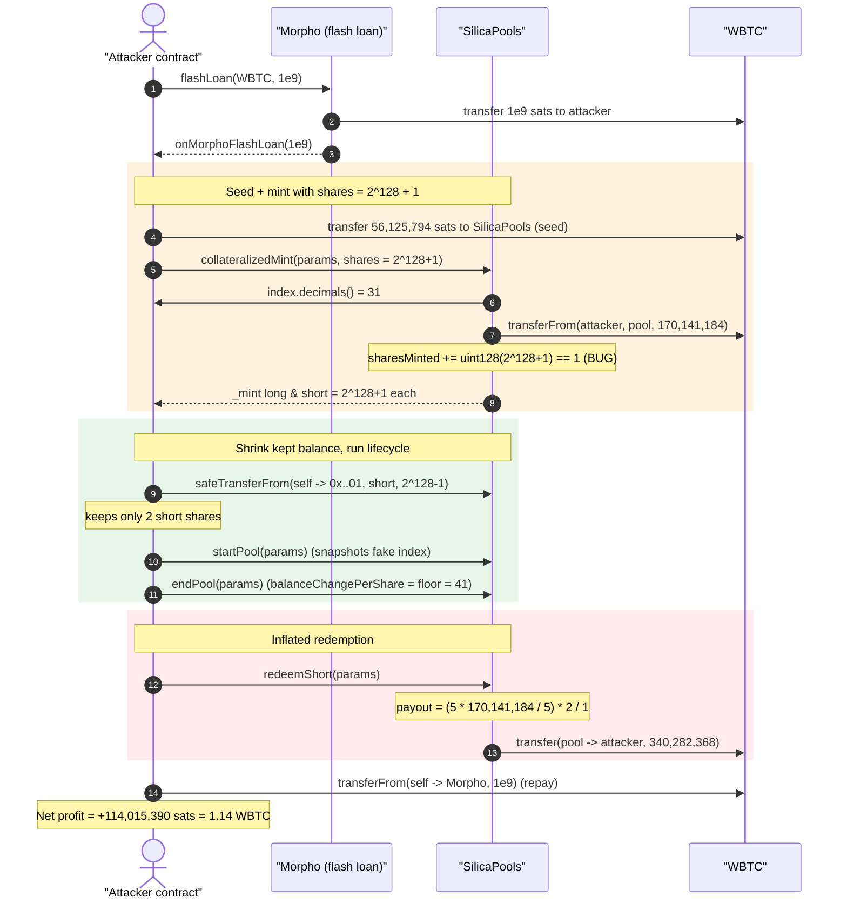
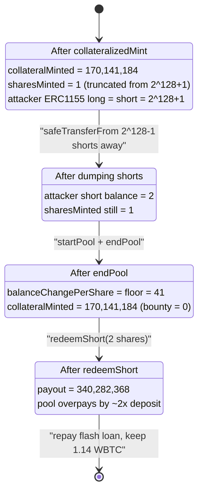
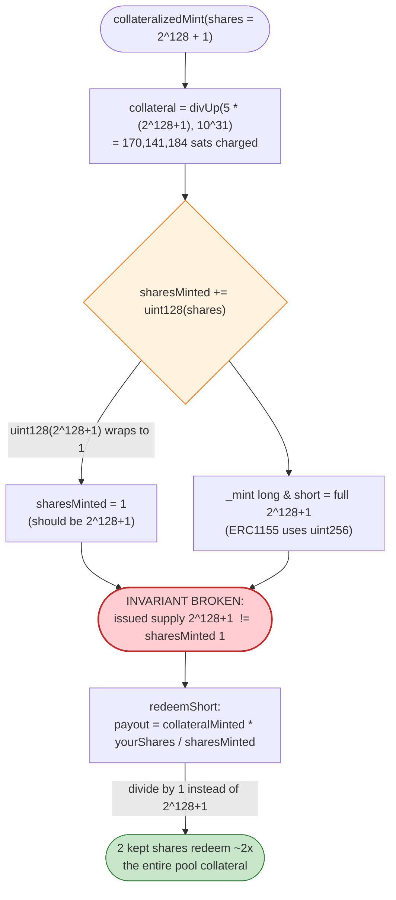

# Alkimiya SilicaPools Exploit — `uint128(shares)` Truncation Inflates Redemption Payout

> **Reproduction:** the PoC compiles & runs in an isolated Foundry project at
> [this project folder](.) (the umbrella DeFiHackLabs repo
> does not whole-compile, so this PoC was extracted).
> Full verbose trace: [output.txt](output.txt).
> Verified vulnerable source: [contracts_SilicaPools.sol](sources/SilicaPools_f3F84c/contracts_SilicaPools.sol).

---

## Key info

| | |
|---|---|
| **Loss** | ~$95.5K — **1.14015390 WBTC** drained from the SilicaPools contract |
| **Vulnerable contract** | `SilicaPools` — [`0xf3F84cE038442aE4c4dCB6A8Ca8baCd7F28c9bDe`](https://etherscan.io/address/0xf3f84ce038442ae4c4dcb6a8ca8bacd7f28c9bde#code) |
| **Victim** | The `SilicaPools` collateral pool (WBTC held by the contract) |
| **Attacker EOA** | `0xF6ffBa5cbF285824000daC0B9431032169672B6e` |
| **Attack contract** | [`0x80bf7db69556d9521c03461978b8fc731dbbd4e4`](https://etherscan.io/address/0x80bf7db69556d9521c03461978b8fc731dbbd4e4) |
| **MEV note** | Original tx was front-run by a MEV bot (`Yoink` `0xFDe0d1575Ed8E06FBf36256bcdfA1F359281455A`) |
| **Attack tx** | [`0x9b9a6dd05526a8a4b40e5e1a74a25df6ecccae6ee7bf045911ad89a1dd3f0814`](https://etherscan.io/tx/0x9b9a6dd05526a8a4b40e5e1a74a25df6ecccae6ee7bf045911ad89a1dd3f0814) |
| **Chain / block / date** | Ethereum mainnet / 22,146,340 / March 2025 |
| **Compiler** | Solidity v0.8.20, optimizer 200 runs |
| **Bug class** | Unsafe `uint256 → uint128` downcast desyncing accounting from issued ERC-1155 supply |

---

## TL;DR

`SilicaPools` issues paired ERC-1155 *long* and *short* tokens against collateral. The amount of
collateral and the per-pool `sharesMinted` accumulator are tracked in **`uint128`** storage fields,
but the ERC-1155 tokens themselves are minted with the **full `uint256` `shares`** value.

In `_collateralizedMint`, the contract does
[`sState.sharesMinted += uint128(shares)`](sources/SilicaPools_f3F84c/contracts_SilicaPools.sol#L837)
with a **raw, unchecked truncating cast** (the contract imports OpenZeppelin `SafeCast` but does not
use it here). By passing `shares = type(uint128).max + 2 = 2¹²⁸ + 1`, the attacker makes the
collateral charge tiny (only `collateral` overflows the modulus too) while:

- `_mint` issues the **full `2¹²⁸ + 1`** long and short ERC-1155 tokens to the attacker, but
- `sharesMinted` is recorded as `uint128(2¹²⁸ + 1) = 1`.

Redemption payout is computed as `… × userShareBalance / sharesMinted`
([`PoolMaths.shortPayout`](sources/SilicaPools_f3F84c/libraries_PoolMaths.sol#L42-L54)). With the
denominator artificially crushed to `1`, a tiny short balance redeems for **far more collateral than
was ever deposited** — draining the pool's WBTC.

The whole sequence runs inside a **Morpho flash loan** of 1,000 WBTC (1e9 sats) so the attacker needs
no upfront capital; the loan is repaid in the same transaction and the net **1.14 WBTC profit** is
the difference between the inflated redemption and the seed + collateral the attacker put in.

---

## Background — what SilicaPools does

`SilicaPools` ([source](sources/SilicaPools_f3F84c/contracts_SilicaPools.sol)) is Alkimiya's
on-chain market for *commodity/hashrate-style* payout pools. A pool is defined by a `PoolParams`
struct (`floor`, `cap`, an `index` oracle address, start/end timestamps, and a `payoutToken`). Users:

1. **`collateralizedMint`** — deposit `payoutToken` collateral and receive equal amounts of *long* and
   *short* ERC-1155 share tokens (token IDs derived from the pool hash).
2. **`startPool` / `endPool`** — snapshot the `index` benchmark at start and end (paying a keeper
   "bounty"); `endPool` computes `balanceChangePerShare`, which decides how the pooled collateral is
   split between long and short holders.
3. **`redeemLong` / `redeemShort`** — after the pool has ended, burn share tokens for a pro-rata slice
   of `collateralMinted`.

The per-pool accounting lives in a `PoolState` struct
([ISilicaPools.sol:165](sources/SilicaPools_f3F84c/interfaces_ISilicaPools.sol#L165)) packed into
3 storage slots, with `collateralMinted` and `sharesMinted` both `uint128`:

```solidity
struct PoolState {
    uint128 collateralMinted;  // collateral deposited for this pool
    uint128 sharesMinted;      // total long/short shares minted for this pool
    uint128 balanceChangePerShare;
    uint128 indexShares;
    uint128 indexInitialBalance;
    uint48  actualStartTimestamp;
    uint48  actualEndTimestamp;
}
```

The redemption math divides by `sharesMinted`. If issued ERC-1155 supply and `sharesMinted` ever
disagree, payouts become unbounded — which is exactly the bug.

The collateral charge is computed by
[`PoolMaths.collateral`](sources/SilicaPools_f3F84c/libraries_PoolMaths.sol#L26-L35):

```solidity
uint256 intermediateValue = (cap - floor) * shares;
return divUp(intermediateValue, 10 ** shareDecimals);
```

The attacker uses a **fake `index`** (their own attack contract) whose `decimals()` returns `31`, so
`10**31` is a huge divisor that keeps the actual collateral charge small even for `shares = 2¹²⁸ + 1`.

---

## The vulnerable code

### 1. Unsafe truncating cast of `shares` in `_collateralizedMint`

[contracts_SilicaPools.sol:807-845](sources/SilicaPools_f3F84c/contracts_SilicaPools.sol#L807-L845):

```solidity
function _collateralizedMint(
    PoolParams calldata poolParams,
    bytes32 orderHash,
    uint256 shares,                       // ← uint256, attacker-controlled
    address payer,
    address longRecipient,
    address shortRecipient
) internal {
    ...
    uint256 collateral = PoolMaths.collateral(true, poolParams.floor, poolParams.cap, shares, index.decimals());

    sState.collateralMinted += uint128(collateral);                 // (truncating cast #1)

    SafeERC20.safeTransferFrom(IERC20(poolParams.payoutToken), payer, address(this), collateral);
    ...
    sState.sharesMinted += uint128(shares);   // ⚠️ uint128(2¹²⁸+1) == 1  — THE BUG

    _mint(longRecipient,  toLongTokenId(poolHash),  shares, "");      // ⚠️ mints FULL 2¹²⁸+1
    _mint(shortRecipient, toShortTokenId(poolHash), shares, "");      // ⚠️ mints FULL 2¹²⁸+1
    ...
}
```

`shares` is cast with a **plain `uint128(...)`**, which in Solidity 0.8 silently *wraps* (the checked
arithmetic only protects `+`/`-`/`*`, not explicit casts). So `uint128(2¹²⁸ + 1) = 1` is recorded in
`sState.sharesMinted`, while the ERC-1155 `_mint` calls issue the **full** `2¹²⁸ + 1` tokens. The
issued supply and the accounting denominator now disagree by a factor of ~`2¹²⁸`.

Note the contract is fully aware of `SafeCast`: it imports and `using`s it at
[lines 18, 32-33](sources/SilicaPools_f3F84c/contracts_SilicaPools.sol#L18) — but the mint path uses a
raw cast instead of `shares.toUint128()`, which would have reverted.

### 2. Redemption divides by the corrupted `sharesMinted`

[PoolMaths.sol:42-54](sources/SilicaPools_f3F84c/libraries_PoolMaths.sol#L42-L54):

```solidity
function shortPayout(PoolParams memory shortParams, PoolState memory sState, uint256 shortSharesBalance)
    internal pure returns (uint256 payout)
{
    payout = (
        (
            (uint256(shortParams.cap - sState.balanceChangePerShare) * uint256(sState.collateralMinted))
                / uint256(shortParams.cap - shortParams.floor)
        ) * uint256(shortSharesBalance)
    ) / uint256(sState.sharesMinted);     // ← denominator == 1, not 2¹²⁸+1
}
```

The payout scales `collateralMinted × shortSharesBalance / sharesMinted`. The attacker keeps a *tiny*
short balance (`2`) but redeems against `sharesMinted = 1`, so:

`payout = (5 × 170,141,184 / 5) × 2 / 1 = 340,282,368 sats` — almost **double** the 170,141,184 sats of
collateral that was actually deposited for the pool.

---

## Root cause — why it was possible

The accounting model assumes one invariant: **`sharesMinted` equals the total issued ERC-1155 share
supply for the pool**, so that `payout = collateralMinted × yourShares / sharesMinted` conserves
collateral. The unsafe `uint128(shares)` cast lets an attacker break that invariant by choosing
`shares ≡ small (mod 2¹²⁸)` while minting `shares` real tokens. Concretely:

1. **Truncating downcast on a user-supplied value.** `uint128(shares)` wraps instead of reverting. The
   contract had `SafeCast` available and simply didn't apply it on the mint path.
2. **Asymmetric width between accounting and tokens.** `sharesMinted` is `uint128`, but ERC-1155
   balances are `uint256`. The mint records the full `uint256` while the denominator is truncated, so
   issued supply > recorded supply.
3. **Attacker-controlled `index` / `decimals`.** Because the pool's `index` is an arbitrary address,
   the attacker supplies their own contract returning `decimals() = 31`. The `10**31` divisor in
   `collateral()` keeps the deposit charge small (≈1.70 WBTC) even though `shares = 2¹²⁸ + 1`.
4. **Permissionless pool lifecycle.** Anyone can `collateralizedMint`, `startPool`, `endPool`, and
   `redeemShort` for a self-defined pool in a single transaction; `startPool`/`endPool` snapshot the
   attacker's fake index, which yields `balanceChangePerShare = floor = 41`, maximizing the short
   payout `(cap − bcps) = 5`.

The deposited collateral plus a small WBTC "seed" the attacker first transfers to the contract gives
the contract just enough WBTC to honor the inflated redemption; the surplus over what the attacker put
in is the profit.

---

## Preconditions

- A flash-loan source for WBTC. The PoC uses **Morpho** (`0xBBBB…FFCb`) `flashLoan(WBTC, 1e9, "")`,
  which charges **no fee**, so the loan is repaid 1:1 in the same call.
- Ability to define an arbitrary pool: the attacker sets `index = address(this)` and implements
  `decimals()=31`, `shares()=1`, `balance()=0` on the attack contract so `startPool`/`endPool` succeed
  and `balanceChangePerShare` clamps to `floor`.
- `targetStartTimestamp == targetEndTimestamp == block.timestamp`, so `startPool` and `endPool` can both
  be called immediately (no waiting; bounty is `0` since no grace period elapsed).
- Enough WBTC (from the flash loan) to (a) seed the contract and (b) pay the small mint collateral — both
  are recovered from the inflated redemption.

---

## Attack walkthrough (with on-chain numbers from the trace)

All figures are taken directly from [output.txt](output.txt). WBTC has 8 decimals (1 WBTC = 1e8 sats).
The attacker passes `shares = type(uint128).max + 2 = 2¹²⁸ + 1 = 340282366920938463463374607431768211457`.

| # | Step (trace line) | Call | Value (sats) | Effect on attacker / pool |
|---|---|---|---:|---|
| 0 | [1588](output.txt#L1588) | `Morpho.flashLoan(WBTC, 1e9)` | 1,000,000,000 | Attacker borrows 10 WBTC, no fee. |
| 1 | [1597](output.txt#L1597) | `WBTC.transfer(SilicaPools, 56_125_794)` | 56,125,794 | "Seed" so the contract holds enough WBTC to later overpay. |
| 2 | [1603](output.txt#L1603) | `collateralizedMint(poolParams, 0, 2¹²⁸+1, self, self)` | — | Mints long+short ERC-1155 of `2¹²⁸+1` each to attacker. |
| 2a | [1606](output.txt#L1606) | `WBTC.transferFrom(self → pool, 170_141_184)` | 170,141,184 | Real collateral charged: `divUp(5·(2¹²⁸+1), 10³¹) = 170,141,184` (≈1.70 WBTC). |
| 2b | [1837](sources/SilicaPools_f3F84c/contracts_SilicaPools.sol#L837) | `sharesMinted += uint128(2¹²⁸+1)` | — | **`sharesMinted` set to `1`** (truncated), not `2¹²⁸+1`. |
| 3 | [1633](output.txt#L1633) | `safeTransferFrom(self → 0x..01, shortId, 2¹²⁸−1)` | — | Attacker dumps `type(uint128).max` shorts, **keeps `2`**. |
| 4 | [1639](output.txt#L1639) | `startPool(poolParams)` | bounty 0 | Snapshots fake index (`shares()=1`, `balance()=0`). |
| 5 | [1657](output.txt#L1657) | `endPool(poolParams)` | bounty 0 | `balanceChangePerShare = clamp(floor,cap,0) = floor = 41`. |
| 6 | [1672](output.txt#L1672) | `redeemShort(poolParams)` | — | Burns the `2` short shares the attacker kept. |
| 6a | [1674](output.txt#L1674) | `WBTC.transfer(pool → self, 340_282_368)` | 340,282,368 | Payout `= (5·170,141,184/5)·2/1 = 340,282,368` (≈3.40 WBTC). |
| 7 | [1689](output.txt#L1689) | `WBTC.transferFrom(self → Morpho, 1e9)` | 1,000,000,000 | Repays flash loan. |
| 8 | [1698](output.txt#L1698) | `WBTC.balanceOf(self)` | 114,015,390 | **Profit: 1.14015390 WBTC.** |

The crux is step 6a: the attacker burns only **2** short shares but the payout formula uses
`sharesMinted = 1` as the divisor instead of the true `2¹²⁸ + 1`, so 2 shares redeem `2×` the entire
pool collateral.

### Profit accounting (WBTC sats)

| Direction | Item | Amount |
|---|---|---:|
| In (recovered) | `redeemShort` payout | +340,282,368 |
| Out | seed transfer to pool | −56,125,794 |
| Out | mint collateral (`transferFrom`) | −170,141,184 |
| — | flash loan in/out (1e9) | 0 (nets to zero) |
| **Net** | | **+114,015,390** |

`340,282,368 − 56,125,794 − 170,141,184 = 114,015,390` sats = **1.14015390 WBTC** — exactly the
balance the PoC prints.

---

## Diagrams

### Sequence of the attack



### Pool accounting state evolution



### Why the truncation breaks the conservation invariant



---

## Why each magic number

- **`shares = type(uint128).max + 2 = 2¹²⁸ + 1`** — the smallest value `> uint128` that truncates to a
  small number (`1`). It crushes `sharesMinted` to `1` while minting `2¹²⁸+1` real tokens.
- **`decimals() = 31`** (fake index) — makes the collateral divisor `10³¹`, keeping the mint charge to
  ≈1.70 WBTC (`divUp(5·(2¹²⁸+1), 10³¹) = 170,141,184`) instead of an astronomically large number.
- **`floor = 41`, `cap = 46`** — `cap − floor = 5` (the spread used in both numerator and
  denominator of `collateral`/`shortPayout`). With `balanceChangePerShare` clamped to `floor`,
  `cap − bcps = 5`, so the short side captures `5/5 = 100%` of `collateralMinted`.
- **seed `56,125,794`** — extra WBTC pre-funded to the pool so the contract's WBTC balance is enough to
  satisfy the `340,282,368` redemption. It is sized so that `redeem − seed − collateral` equals the
  attacker's profit.
- **keep `2` short shares** (dump `2¹²⁸−1`) — keeping `2` rather than `1` simply doubles the payout
  relative to the `1`-denominator (`payout ∝ shares / sharesMinted = 2/1`).

---

## Remediation

1. **Use checked casts on user-supplied widths.** Replace `uint128(shares)` and `uint128(collateral)`
   with `shares.toUint128()` / `collateral.toUint128()` (the contract already imports `SafeCast`). Any
   value `> type(uint128).max` then reverts instead of silently wrapping. This single change defeats
   the exploit.
2. **Keep accounting width equal to token width.** Store `sharesMinted` / `collateralMinted` as
   `uint256` (matching ERC-1155 balances), or enforce a hard `shares <= type(uint128).max` bound at the
   public `collateralizedMint` entry point so issued supply can never exceed what the accumulator can
   represent.
3. **Assert the conservation invariant.** After mint, `sharesMinted` must equal the sum of issued long
   (and short) supply; after redeem, `Σ payouts <= collateralMinted`. Add invariant checks / fuzz tests
   around `sharesMinted` vs. ERC-1155 `totalSupply` per token ID.
4. **Validate the `index` contract.** The pool's `index` is fully attacker-controlled here
   (`decimals`, `shares`, `balance` are all spoofed). Restrict pools to a whitelist of known indices,
   or bound `decimals()` to a sane range, so the collateral charge cannot be arbitrarily deflated.

---

## How to reproduce

The PoC was extracted into a standalone Foundry project (the umbrella DeFiHackLabs repo has several
unrelated PoCs that fail to compile under a whole-project `forge build`):

```bash
_shared/run_poc.sh 2025-03-Alkimiya_io_exp -vvvvv
```

- RPC: an **Ethereum mainnet archive** endpoint is required (fork block `22,146,339`). `foundry.toml`
  uses an Infura archive endpoint.
- Result: `[PASS] testPoC()` with `Profit: 114015390 WBTC` (= 1.14015390 WBTC).

Expected tail:

```
Ran 1 test for test/Alkimiya_io_exp.sol:Alkimiya_io_exp
[PASS] testPoC() (gas: 1126942)
Logs:
  Profit: 114015390 WBTC

Suite result: ok. 1 passed; 0 failed; 0 skipped
```

---

*References: PoC author [rotcivegaf](https://twitter.com/rotcivegaf); attack tx
[`0x9b9a6dd0…3f0814`](https://etherscan.io/tx/0x9b9a6dd05526a8a4b40e5e1a74a25df6ecccae6ee7bf045911ad89a1dd3f0814).*
