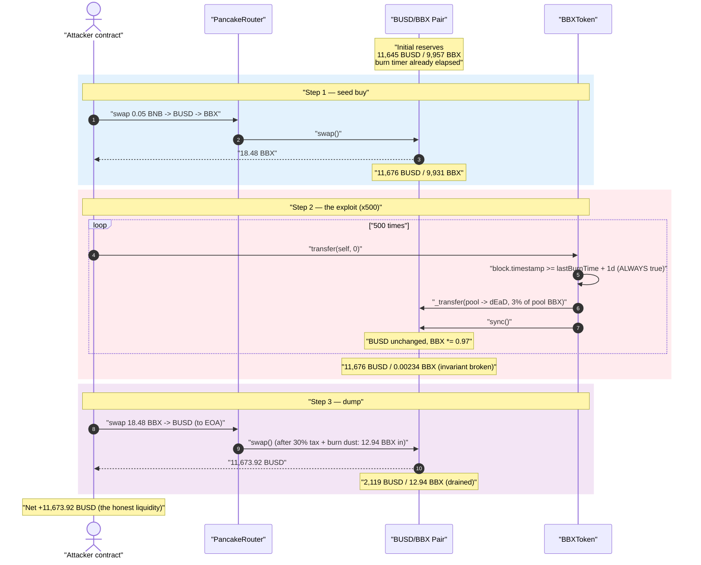
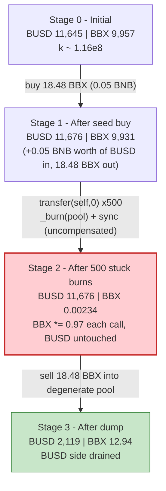
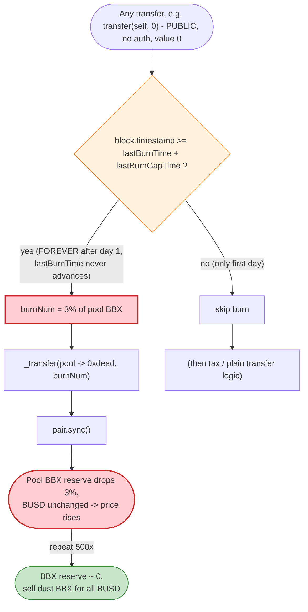
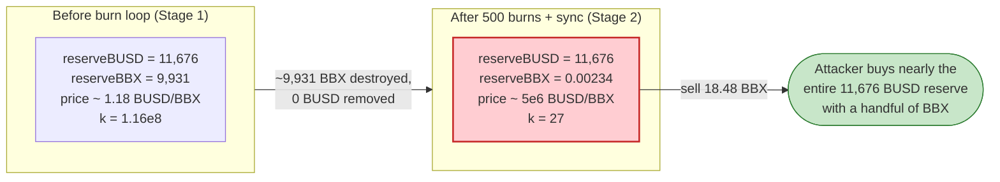

# BBX Token Exploit — Stuck Daily-Burn Repeatedly Drains the Pool's BBX Reserve

> **Vulnerability classes:** vuln/logic/state-update · vuln/oracle/price-manipulation

> **Reproduction:** the PoC compiles & runs in an isolated Foundry project at
> [this project folder](.) (the umbrella DeFiHackLabs repo contains several unrelated PoCs
> that do not whole-compile under `forge test`, so this one was extracted).
> Full verbose trace: [output.txt](output.txt).
> Verified vulnerable source: [BBXToken.sol](sources/BBXToken_67Ca34/BBXToken.sol).

---

## Key info

| | |
|---|---|
| **Loss** | **~11,673.92 BUSD** (≈ $11,902) drained from the BSC-USD/BBX PancakeSwap pair |
| **Vulnerable contract** | `BBXToken` — [`0x67Ca347e7B9387af4E81c36cCA4eAF080dcB33E9`](https://bscscan.com/address/0x67Ca347e7B9387af4E81c36cCA4eAF080dcB33E9#code) |
| **Victim pool** | PancakeSwap V2 BSC-USD / BBX pair — [`0x6051428B580f561B627247119EEd4D0483B8D28e`](https://bscscan.com/address/0x6051428B580f561B627247119EEd4D0483B8D28e) |
| **Attacker EOA** | [`0x8aea7516b3b6aabf474f8872c5e71c1a7907e69e`](https://bscscan.com/address/0x8aea7516b3b6aabf474f8872c5e71c1a7907e69e) |
| **Attacker contract** | [`0x0489E8433e4E74fB1ba938dF712c954DDEA93898`](https://bscscan.com/address/0x0489E8433e4E74fB1ba938dF712c954DDEA93898) |
| **Attack tx** | [`0x0dd486368444598610239b934dd9e8c6474a06d11380d1cfec4d91568b5ac581`](https://bscscan.com/tx/0x0dd486368444598610239b934dd9e8c6474a06d11380d1cfec4d91568b5ac581) |
| **Chain / block / date** | BSC / 47,626,726 (attack) / ~March 2025 |
| **Compiler** | Solidity v0.8.26, optimizer **disabled** (0 runs) |
| **Bug class** | Broken AMM invariant via an un-compensated, *unbounded* pool-reserve burn (stuck timer) |

---

## TL;DR

`BBXToken`'s `_transfer` override contains a "daily deflation" feature: once a day, it burns
`burnRate` (3%) of the liquidity pool's BBX balance directly out of the pair and then calls
`pair.sync()` ([BBXToken.sol:1074-1080](sources/BBXToken_67Ca34/BBXToken.sol#L1074-L1080)). This is an
*un-compensated* removal of one side of the pool's reserves — BBX is destroyed inside the pair with no
matching BUSD outflow, then the pair is forced to adopt the reduced balance as its new reserve.

The fatal flaw: **the timer that gates this burn (`lastBurnTime`) is never updated** after a burn. It
is set exactly once, in the constructor ([:1062](sources/BBXToken_67Ca34/BBXToken.sol#L1062)), and is
only ever read again ([:1075](sources/BBXToken_67Ca34/BBXToken.sol#L1075)). Once `lastBurnGapTime`
(1 day) has elapsed, the condition `block.timestamp >= lastBurnTime + lastBurnGapTime` is
**permanently true**, so *every single transfer* burns another 3% of the pool's BBX.

The attacker:

1. **Buys** a small amount of BBX (18.48 BBX) for itself with 0.05 BNB.
2. **Fires 500 zero-value self-transfers** `BBX.transfer(self, 0)`. Each one trips the stuck burn,
   destroying 3% of the pool's BBX and `sync()`ing — driving the pool's BBX reserve from ~9,931 BBX
   down to ~**0.00234 BBX** while the **BUSD reserve stays fixed at 11,676 BUSD**.
3. **Sells** its 18.48 BBX into the now-degenerate pool, where 18 BBX is worth almost the entire BUSD
   reserve, walking off with **11,673.92 BUSD**.

The whole exploit costs 0.05 BNB and recovers virtually all the honest BUSD liquidity.

---

## Background — what BBXToken does

`BBXToken` ([source](sources/BBXToken_67Ca34/BBXToken.sol)) is a standard OpenZeppelin ERC20 (v5-style
`_update`-based) with three bolted-on "tokenomics" features inside its `_transfer` override
([:1074-1111](sources/BBXToken_67Ca34/BBXToken.sol#L1074-L1111)):

- **Daily auto-burn** — on each transfer, if at least `lastBurnGapTime` has passed since `lastBurnTime`,
  burn `burnRate / 10000` of the *liquidity pool's* BBX balance to `0xdead` and `sync()` the pair.
- **Buy/sell tax** — 30% (`buyorsellTax = 3000`) tax split between a "community" wallet and a "pump"
  wallet whenever a transfer involves `liquidityPool` as sender or recipient.
- **Fee exclusions** — `isExcludedFromFee` addresses bypass the tax (but **not** the burn).

The relevant on-chain parameters at the fork block (read via the PoC's commented `console.log`s and
confirmed in source):

| Parameter | Value | Source |
|---|---|---|
| `burnRate` | **300** bps = **3%** of pool BBX per burn | [:1037](sources/BBXToken_67Ca34/BBXToken.sol#L1037) |
| `lastBurnGapTime` | **86,400 s** (1 day) | [:1039](sources/BBXToken_67Ca34/BBXToken.sol#L1039) |
| `lastBurnTime` | `1742375453` (set once in constructor) | [:1062](sources/BBXToken_67Ca34/BBXToken.sol#L1062) |
| `liquidityPool` | `0x6051…D28e` (the BSC-USD/BBX pair) | [:1063](sources/BBXToken_67Ca34/BBXToken.sol#L1063) |

In the victim pair, `token0 = BSC-USD (BUSD)` and `token1 = BBX`, so `reserve0 = BUSD`,
`reserve1 = BBX`. At the fork block the BBX pool held ~**11,645 BUSD** and ~**9,957 BBX**
([output.txt:69](output.txt) — `getReserves`).

---

## The vulnerable code

### 1. The burn draws from the pool and `sync()`s — and never updates the timer

```solidity
// BBXToken.sol:1074-1080
function _transfer(address from, address recipient, uint256 amount) internal override  {
    if (block.timestamp >= lastBurnTime + lastBurnGapTime) {   // ← timer gate
        uint256 totalNum = this.balanceOf(liquidityPool);      // pool's current BBX
        uint256 burnNum  = totalNum * burnRate / 10000;        // 3% of it
        super._transfer(liquidityPool, address(0xdead), burnNum); // ⚠️ destroy pool BBX
        IPancakePari(liquidityPool).sync();                    // ⚠️ force-adopt reduced reserve
    }
    // ⚠️ lastBurnTime is NEVER updated here
    ...
}
```

[BBXToken.sol:1074-1080](sources/BBXToken_67Ca34/BBXToken.sol#L1074-L1080)

### 2. `lastBurnTime` is write-once

A grep of the entire contract shows `lastBurnTime` is assigned exactly once — in the constructor — and
otherwise only read in the gate:

```solidity
// BBXToken.sol:1038   uint256 public lastBurnTime;
// BBXToken.sol:1062       lastBurnTime = block.timestamp;          // constructor, the ONLY write
// BBXToken.sol:1075       if (block.timestamp >= lastBurnTime + lastBurnGapTime) {   // the ONLY read
```

There is no `lastBurnTime = block.timestamp` (or `+= lastBurnGapTime`) after the burn. Compare this to
a correct daily-burn implementation, which advances the timestamp so the burn fires *at most once per
interval*. Here it fires on **every transfer, forever**, the moment the first interval lapses.

The owner setters `setBurnRate` / `setLastBurnGapTime`
([:1133-1139](sources/BBXToken_67Ca34/BBXToken.sol#L1133-L1139)) can change the rate and gap but cannot
fix the missing timer update.

---

## Root cause — why it was possible

A PancakeSwap/Uniswap-V2 pair prices its assets purely from `reserve0 / reserve1` and only enforces
`x·y ≥ k` *inside `swap()`*. `sync()` exists so the pair can "catch up" to its real token balances — it
trusts that those balances move only through `mint`/`burn`/`swap` or transfers it can reason about.

`BBXToken._transfer` weaponizes `sync()`:

> It **destroys** BBX held by the pair (`super._transfer(liquidityPool, 0xdead, burnNum)`) and then calls
> `pair.sync()`, telling the pair "your BBX reserve is now this much smaller." **No BUSD leaves the pair.**
> The product `k` collapses and the marginal price of BBX explodes — and because the timer never resets,
> the attacker can repeat the squeeze as many times as it wants for the price of gas.

Three composable mistakes turn a "tokenomics gimmick" into a critical, drainable bug:

1. **Burning from the pool is a value transfer to BBX holders.** Removing BBX from the pair without
   removing BUSD shifts the whole BUSD side toward whoever still holds BBX. The attacker arranges to be
   essentially the only meaningful BBX holder (18.48 BBX vs the pool's residual 0.00234 BBX).
2. **The burn is reachable by anyone, on any transfer.** No access control, no keeper role — a
   `transfer(self, 0)` (value `0`, no balance needed) is enough to trigger it. The 30% tax is bypassed
   because the burn block runs *before* the `from == liquidityPool` / `recipient == liquidityPool` tax
   branches, and a self-transfer touches neither branch.
3. **The timer is permanently stuck on.** Because `lastBurnTime` is never advanced, the 3%-per-burn
   compounds without bound. 500 burns of 3% leaves the pool with `0.97^500 ≈ 2.4e-7` of its BBX — i.e.
   the BBX reserve is annihilated while BUSD is untouched.

The geometric decay is visible directly in the trace's `Sync` events: BBX reserve goes
9,931 → 9,633 → 9,344 → 9,064 … (each ≈ 97% of the prior) all the way down to ~2.34e15 wei
([output.txt:114](output.txt) … [output.txt:9124](output.txt)), while `reserve0` (BUSD) is the
constant `11676041394256058662620` on every line.

---

## Preconditions

- At least one `lastBurnGapTime` (1 day) has elapsed since the contract's deployment, so the burn gate
  is open. In the live attack this was naturally true; the PoC reproduces it by forking at the create
  block and then `vm.warp(block.timestamp + 15 min)` *after* rolling forward to the attack block — the
  fork is already days past `lastBurnTime = 1742375453`.
- The BBX/BUSD pool exists with real BUSD liquidity (≈ 11,645 BUSD) and BBX is the pool's `liquidityPool`
  target — true by construction (`liquidityPool` is the pair).
- Trivial working capital: **0.05 BNB** to buy the seed BBX. No flash loan is needed; the entire profit
  is the pool's honest BUSD.

---

## Attack walkthrough (with on-chain numbers from the trace)

`token0 = BUSD (reserve0)`, `token1 = BBX (reserve1)`. All figures are taken directly from `Sync` /
`Swap` events in [output.txt](output.txt).

| # | Step | Pool BUSD reserve0 | Pool BBX reserve1 | Effect |
|---|------|-------------------:|------------------:|--------|
| 0 | **Initial** (fork) | 11,645.01 | 9,957.84 | Honest pool ([output.txt:69](output.txt)). |
| 1 | **Seed buy** — swap 0.05 BNB → BUSD → 18.48 BBX to attacker contract | 11,676.04 | 9,931.44 | Attacker now holds **18.48 BBX**; pool BBX after buy+tax ([output.txt:87](output.txt)). |
| 2 | **Burn loop, call #1** — `transfer(self,0)` ⇒ burn 3% of pool BBX (297.94 BBX → dEaD) + `sync()` | 11,676.04 | 9,633.49 | First squeeze ([output.txt:108-114](output.txt)). |
| 3 | **Burn loop, call #2** — burn 289.00 BBX + `sync()` | 11,676.04 | 9,344.49 | BUSD never moves ([output.txt:128-134](output.txt)). |
| … | **… 497 more burns**, each ≈ 97% of the prior BBX reserve | 11,676.04 | (geometric decay) | `0.97^n` shrinkage. |
| 4 | **Burn loop, call #500** — final `sync()` | 11,676.04 | **0.00234** (2.34e15 wei) | Pool BBX annihilated; BUSD intact ([output.txt:9124](output.txt)). |
| 5 | **Dump** — `swapExactTokensForTokens(18.48 BBX → BUSD)` to attacker EOA | 2,119.03 | 12.94 | 18 BBX buys 11,673.92 BUSD ([output.txt:9156](output.txt)). |

**Why a few BBX buys almost the whole pool:** after the loop, `reserveBBX ≈ 0.00234`,
`reserveBUSD = 11,676`. PancakeSwap's `getAmountOut` is
`out = (in·9975·reserveOut) / (reserveIn·10000 + in·9975)`. With the attacker's effective input
(`12.94 BBX` reaching the pair after the token's own 30% sell-tax + final 3% burn dust) vastly exceeding
`reserveIn ≈ 0.00234`, the formula returns nearly the entire `reserveOut` — here **11,673.92 of the
11,676 BUSD**.

Note the sell still pays the token's 30% tax: of the attacker's 18.48 BBX,
`1.85 BBX → community wallet`, `3.70 BBX → dividend wallet`, and only `12.94 BBX` reaches the pair
([output.txt:9159-9161](output.txt)). Even after that haircut, 12.94 BBX against a 0.00234 BBX reserve
empties the BUSD side.

### Profit / loss accounting

| Direction | Amount |
|---|---:|
| Spent — seed BNB to buy BBX | 0.05 BNB (≈ $30) |
| Received — BUSD from final dump | **11,673.92 BUSD** |
| **Net profit** | **≈ 11,673.92 BUSD** (PoC: `Profit in BUSD: 11673.922366781435539375`) |
| **Victim loss** | The pool's BUSD reserve: 11,676 → 2,119 BUSD (LPs lose ~9,557 BUSD of value; reported total loss ≈ 11,902 BUSD incl. fees/precursor activity) |

The PoC's final assertion logs `Profit in BUSD: 11673.92…` and the suite reports `[PASS]`
([output.txt:4](output.txt)).

---

## Diagrams

### Sequence of the attack



### Pool state evolution



### The flaw inside `_transfer`



### Why the burn is theft: constant-product before vs. after



---

## Remediation

1. **Advance the timer after every burn.** The minimal one-line fix for the immediate bug is to add
   `lastBurnTime = block.timestamp;` (or `lastBurnTime += lastBurnGapTime;`) right after the burn block,
   so the daily burn fires *at most once per interval* instead of on every transfer. This alone stops
   the unbounded compounding.
2. **Never burn from the liquidity pool.** Even a once-per-day pool burn + `sync()` is an
   un-compensated reserve deletion that any holder can sandwich for profit. A burn should only destroy
   tokens the protocol *owns* (its own balance / treasury). Removing
   `super._transfer(liquidityPool, 0xdead, burnNum)` + `IPancakePari(liquidityPool).sync()` eliminates
   the class entirely. If "deflation reaching the pool" is required, implement it as the protocol
   buying & burning from its own funds, not as a side-channel that deletes one reserve.
3. **Gate the burn behind a keeper/role**, not an arbitrary transfer. Tying a reserve-mutating action
   to *every* token transfer (including 0-value self-transfers that need no balance) makes it trivially
   spammable.
4. **Make `sync()`-after-balance-mutation impossible to weaponize.** If a token must adjust pool
   balances, route it through the pair's own `burn()` (LP redemption) so both reserves move together and
   `k` is preserved.
5. **Cap single-operation reserve impact.** Any operation that moves a pool reserve by more than a small
   percentage should revert; a routine that can take a pool's entire BBX reserve over a sequence of
   permissionless calls is a red flag.

---

## How to reproduce

The PoC was extracted into a standalone Foundry project (the umbrella DeFiHackLabs repo has several
unrelated PoCs that fail to compile under `forge test`'s whole-project build):

```bash
_shared/run_poc.sh 2025-03-BBXToken_exp -vvvvv
```

- RPC: a **BSC archive** endpoint is required (fork block ~47.6M). `foundry.toml` uses
  `https://bsc-mainnet.public.blastapi.io`, which serves historical state at that block; the default
  `https://bnb.api.onfinality.io/public` is rate-limited (HTTP 429) and was swapped out.
- Result: `[PASS] testExploit()` with `Profit in BUSD: 11673.922366781435539375`.

Expected tail:

```
Ran 1 test for test/BBXToken_exp.sol:BBXToken_exp
[PASS] testExploit() (gas: 10075802)
  Profit in BUSD: 11673.922366781435539375

Suite result: ok. 1 passed; 0 failed; 0 skipped
```

---

*References:*
- *Post-mortem: SolidityScan — https://blog.solidityscan.com/bbx-token-hack-analysis-f2e962c00ee5*
- *TenArmor — https://x.com/TenArmorAlert/status/1916312483792408688*
