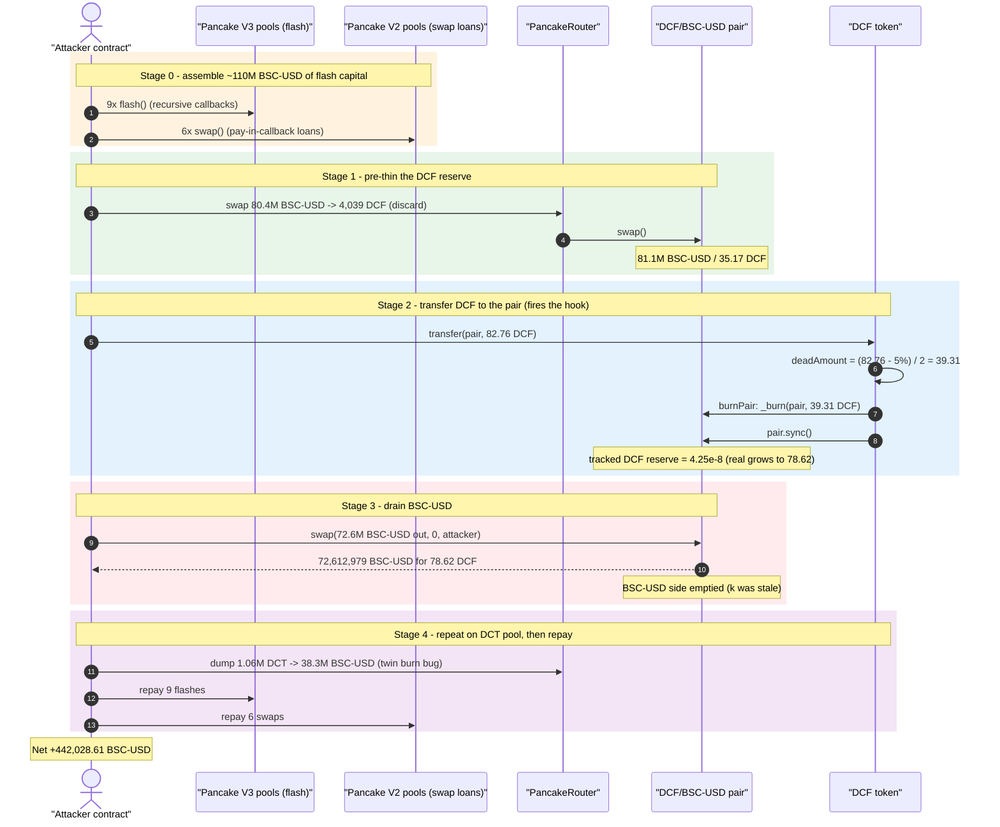
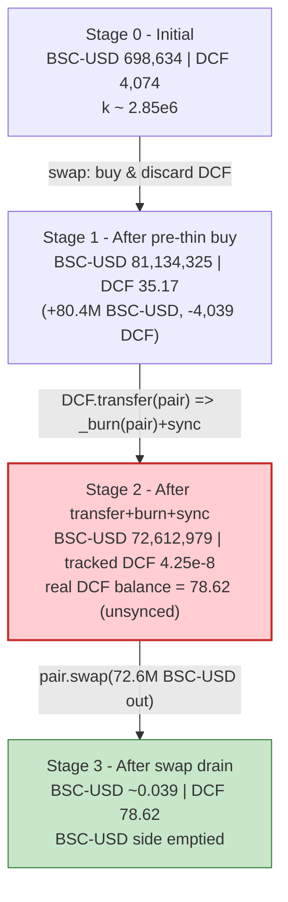
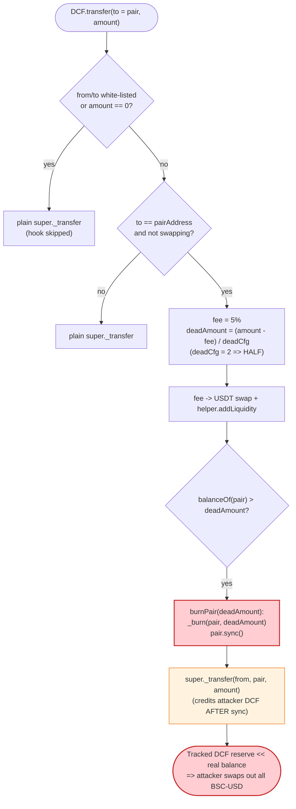
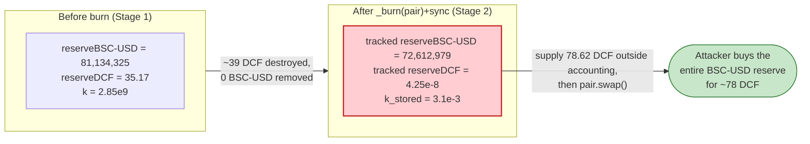

# DCF Token Exploit — Transfer-to-Pair Reserve Burn Inflates DCF Price

> **Vulnerability classes:** vuln/oracle/price-manipulation · vuln/defi/slippage

> **Reproduction:** the PoC compiles & runs in an isolated Foundry project at
> [this project folder](.) (the umbrella DeFiHackLabs repo contains many
> unrelated PoCs that do not compile together, so this one was extracted).
> Full verbose trace: [output.txt](output.txt).
> Verified vulnerable source: [contracts_DCF.sol](sources/DCF_A7e923/contracts_DCF.sol).

---

## Key info

| | |
|---|---|
| **Loss** | **~442,028 BSC-USD** (~$442K) drained from the DCF/BSC-USD and DCT/BSC-USD PancakeSwap pairs |
| **Vulnerable contract** | `DCF` token — [`0xA7e92345ddF541Aa5CF60feE2a0e721C50Ca1adb`](https://bscscan.com/address/0xA7e92345ddF541Aa5CF60feE2a0e721C50Ca1adb#code) |
| **Victim pools** | DCF/BSC-USD pair `0x8487f846d59F8FB4f1285C64086b47e2626C01B6` · DCT/BSC-USD pair `0x5aaC7375196e9eA76b1598ed4BE19B41fA5Ba651` |
| **Attacker EOA** | [`0x00c58434F247DFdCA49b9EE82f3013BAC96F60FF`](https://bscscan.com/address/0x00c58434f247dfdca49b9ee82f3013bac96f60ff) |
| **Attacker contract** | [`0x77ab960503659711498a4c0bc99a84e8d0a47589`](https://bscscan.com/address/0x77ab960503659711498a4c0bc99a84e8d0a47589) |
| **Attack tx** | [`0xb375932951c271606360b6bf4287d080c5601f4f59452b0484ea6c856defd6fd`](https://bscscan.com/tx/0xb375932951c271606360b6bf4287d080c5601f4f59452b0484ea6c856defd6fd) |
| **Chain / block / date** | BSC / 44,290,969 / ~Nov 24, 2024 |
| **Compiler** | DCF token: Solidity v0.8.27, optimizer disabled. PoC: `^0.8.15` |
| **Bug class** | Broken AMM `x·y=k` invariant via an un-compensated, attacker-sized burn of pool reserves + `sync()` |

> **Naming note:** the PoC and trace label `0x55d398326f99059fF775485246999027B3197955`
> as "BUSD", but that address is in fact **BSC-USD (Binance-Peg USDT)**. The DCF token
> internally calls it `USDT`. We use "BSC-USD" below.

---

## TL;DR

`DCF` is a "deflationary" ERC20. Its overridden `_transfer`
([contracts_DCF.sol:124-165](sources/DCF_A7e923/contracts_DCF.sol#L124-L165)) contains a hook
that fires whenever someone transfers DCF **to the liquidity pair**. In that branch it computes a
burn amount `deadAmount = (amount − 5% fee) / deadCfg` (with `deadCfg = 2`, i.e. **half of the
transferred amount**) and then calls `burnPair(deadAmount)`
([:181-186](sources/DCF_A7e923/contracts_DCF.sol#L181-L186)), which does:

```solidity
_burn(pairAddress, _deadAmount);     // ⚠️ destroys DCF held by the pair
IUniswapV2Pair(pairAddress).sync();  // ⚠️ forces the pair to accept the reduced balance
```

This is an **un-compensated removal of one side of the pool's reserves**: DCF is deleted from the
pair, no BSC-USD leaves, and `sync()` tells the pair "your DCF reserve is now this much smaller."
The constant-product invariant `x·y=k` collapses and DCF's marginal price explodes.

The fatal twist: the burn size is **controlled by the attacker** (it is half of whatever they
transfer), and the `super._transfer` that actually moves the attacker's DCF into the pair happens
**after** the burn+sync, leaving the pair's tracked reserve far below its real DCF balance. The
attacker then calls `pair.swap()` directly and walks off with essentially the entire BSC-USD reserve
in exchange for a few tens of DCF.

The attacker:

1. Borrows huge BSC-USD via PancakeSwap V3 `flash()` (9 pools) and recursive V2 `swap()` callbacks
   (6 pools) — ~110M BSC-USD of working capital.
2. Pre-thins the DCF/BSC-USD pool's DCF reserve (buys 4,039 DCF out → reserve ~35 DCF).
3. Transfers **82.76 DCF** to the pair. The `_transfer` hook burns **39.31 DCF** out of the pair
   (`_burn(pair) + sync()`), driving the tracked DCF reserve to **~4.25e-8 DCF** while the attacker's
   78.62 DCF lands in the pair *unsynced*.
4. Calls `DCF_pair.swap(72.6M BSC-USD out, …)` — the degenerate pool hands over **72.6M BSC-USD** for
   78.62 DCF.
5. Repeats the same idea on the DCT/BSC-USD pair (DCT shares the identical mechanism), pulls another
   ~38.3M BSC-USD, repays every flash loan/swap, and keeps **442,028.61 BSC-USD**.

---

## Background — what DCF does

`DCF` ([source](sources/DCF_A7e923/contracts_DCF.sol)) is an OpenZeppelin ERC20 with a "tax +
auto-liquidity + deflation" bundle bolted onto `_transfer`. A sibling `LiquidityHelper` contract
([:12-73](sources/DCF_A7e923/contracts_DCF.sol#L12-L73)) handles the auto-LP side, and a twin token
**DCT** (`0x56f46bD073E9978Eb6984C0c3e5c661407c3A447`, verified
[source](sources/DCT_56f46b)) implements the *same* transfer-to-pair burn logic — so both of its
pools were drainable too.

Relevant on-chain state at the fork block:

| Parameter | Value | Source |
|---|---|---|
| `deadCfg` | **2** → burn = ½ of net transfer | [:84](sources/DCF_A7e923/contracts_DCF.sol#L84) |
| sell fee | 5% | [:147](sources/DCF_A7e923/contracts_DCF.sol#L147) |
| DCF/BSC-USD pair token0 / token1 | BSC-USD / DCF | trace `getReserves`/`token0()` |
| Initial DCF pool reserves | **698,634 BSC-USD / 4,074 DCF** | [output.txt:235](output.txt) |
| DCT pool reserves (token0 BSC-USD) | ~30.4M BSC-USD / 1.0M+ DCT | [output.txt:276](output.txt) |

The whole attack rests on one fact: `deadAmount` (the burn) is a function of the **attacker's
transfer amount**, not of the pool's reserves, and the pair is `sync()`'d to the post-burn balance
before the attacker's own DCF is accounted for.

---

## The vulnerable code

### 1. The transfer-to-pair hook computes an attacker-controlled burn

```solidity
function _transfer(address from, address to, uint256 amount) internal override {
    ...
    if (amount == 0 || whiteAddress[from] || whiteAddress[to]) {
        super._transfer(from, to, amount);
        return;
    }
    if (from == pairAddress) { require(false, "buy error"); }   // buys via _transfer blocked

    // swap token for usdt  ──  fires when sending DCF *to the pair*
    if (to == pairAddress && !swapping) {
        swapping = true;
        uint256 fee = (amount * 5) / 100;                       // 5%
        uint256 deadAmount = (amount - fee) / deadCfg;          // ⚠️ HALF of net transfer
        amount -= fee;
        super._transfer(from, address(this), fee);

        uint256 initialUsdtBalance = IERC20(USDT).balanceOf(helperAddress);
        swapTokensForUSDT(fee, helperAddress);                  // dumps fee → USDT
        uint256 newUsdtBalance = IERC20(USDT).balanceOf(helperAddress) - initialUsdtBalance;
        liquidityHelper.addLiquidity(newUsdtBalance);           // auto-LP side effects
        swapping = false;
        if (balanceOf(pairAddress) > deadAmount) {
            burnPair(deadAmount);                               // ⚠️ burn from the pair
        }
    }

    // proceed transfer  ──  attacker's DCF lands in the pair AFTER the burn/sync
    super._transfer(from, to, amount);
}
```
[contracts_DCF.sol:124-165](sources/DCF_A7e923/contracts_DCF.sol#L124-L165)

### 2. `burnPair` destroys pool DCF and `sync()`s

```solidity
function burnPair(uint256 _deadAmount) private {
    if (_deadAmount > 0) {
        _burn(pairAddress, _deadAmount);     // ⚠️ removes DCF the pair owns
    }
    IUniswapV2Pair(pairAddress).sync();      // ⚠️ pair now trusts the reduced reserve
}
```
[contracts_DCF.sol:181-186](sources/DCF_A7e923/contracts_DCF.sol#L181-L186)

---

## Root cause — why it was possible

A Uniswap-V2 / PancakeSwap pair prices assets purely from its stored reserves and only enforces
`x·y ≥ k` *inside* `swap()`. `sync()` exists to let the pair "true up" its reserves to its real token
balances — it trusts that balances only move via mints/burns/swaps it can reason about.

`DCF` violates that trust catastrophically. Three composing flaws:

1. **It burns from the pool and `sync()`s.** `_burn(pairAddress, deadAmount)` deletes DCF the pair
   holds; `sync()` then makes the pair adopt the shrunken DCF reserve. No BSC-USD leaves, so `k`
   collapses and DCF's price spikes — a free, attacker-triggerable value transfer to whoever holds DCF.

2. **The burn amount is attacker-controlled.** `deadAmount = (amount − fee) / 2` scales with the
   *transferred* amount, not with the pool. The attacker pre-thins the DCF reserve to ~35 DCF, then
   transfers an amount whose half-burn exactly annihilates the pool's DCF reserve.

3. **Order-of-operations leaves the reserve stale.** `burnPair()` (burn + `sync()`) runs *before* the
   final `super._transfer(from, to, amount)` that actually credits the attacker's DCF to the pair. So
   after the hook the pair's *tracked* DCF reserve is ~4.25e-8 DCF while its *real* DCF balance is
   78.62 DCF. When the attacker then calls `pair.swap()` directly, the V2 `k`-check passes (the
   incoming 78.62 DCF dwarfs the tracked reserve) and releases nearly all of the 72.6M BSC-USD.

> In short: a single `DCF.transfer(pair, X)` lets the caller delete X/2 DCF from the pool while
> simultaneously supplying their own DCF *outside* the pool's accounting — collapsing the reserve and
> then buying the entire opposite reserve for a pittance.

The exact same logic exists in **DCT**, so the attacker repeated it on the DCT/BSC-USD pool for a
second tranche.

---

## Preconditions

- A DCF (or DCT) PancakeSwap V2 pair exists and holds meaningful BSC-USD liquidity (it did:
  ~698,634 BSC-USD in the DCF pool, ~30M in the DCT pool).
- The attacker is **not** white-listed (white addresses bypass the hook,
  [:134](sources/DCF_A7e923/contracts_DCF.sol#L134)) — true for any external attacker, which is
  exactly what makes the hook reachable.
- Working capital in BSC-USD to thin the pool's DCF/DCT reserve and to satisfy intermediate swaps.
  Fully recovered intra-transaction, hence **flash-loanable** — the PoC sources it from 9 PancakeSwap
  V3 `flash()` loans + 6 V2 `swap()`-callback "loans" and repays all of them at the end.

---

## Attack walkthrough (with on-chain numbers from the trace)

The DCF/BSC-USD pair's `token0 = BSC-USD`, `token1 = DCF`, so `reserve0 = BSC-USD`,
`reserve1 = DCF`. All figures are taken directly from `Sync`/`Swap`/`Transfer` events and
`getReserves` returns in [output.txt](output.txt).

| # | Step | DCF-pool BSC-USD | DCF-pool DCF | Effect | Trace |
|---|------|-----------------:|------------:|--------|-------|
| 0 | **Borrow capital** — 9× V3 `flash()` + 6× V2 `swap()` callbacks | — | — | ~110M BSC-USD on hand | [:35-209](output.txt) |
| 1 | **Initial honest pool** | 698,634 | 4,074 | Target liquidity. | [:235](output.txt) |
| 2 | **Pull attacker DCF** — `transferFrom(EOA → atk, 83.74 DCF)` | — | — | Seed DCF to spend later. | [:210](output.txt) |
| 3 | **Pre-thin buy** — swap 80,435,691 BSC-USD → 4,039 DCF (to a throwaway addr) | 81,134,325 | **35.17** | Pool DCF made scarce; BSC-USD loaded. | [:223-250](output.txt) |
| 4 | **DCT-side buy** — swap 29,919,669 BSC-USD → 1,062,693 DCT (to atk) | — | — | Loads atk with DCT for the 2nd drain; also pre-thins DCT pool. | [:264-303](output.txt) |
| 5 | **`DCF.transfer(pair, 82.76 DCF)`** triggers the hook | | | net 78.62 DCF after 5% fee; `deadAmount = 39.31` | [:312](output.txt) |
| 5a | hook auto-LP side-effects raise pool DCF to 39.31 | 72,612,979 | 39.31 | helper swap/addLiquidity churn. | [:332-473](output.txt) |
| 5b | **`burnPair(39.31)`** — `_burn(pair, 39.31)` + `sync()` | 72,612,979 | **4.25e-8** | ⚠️ tracked DCF reserve annihilated. | [:475-481](output.txt) |
| 5c | `super._transfer` credits atk's 78.62 DCF to the pair (no sync) | 72,612,979 | real 78.62 / **tracked 4.25e-8** | Pair under-counts its DCF. | [:485](output.txt) |
| 6 | **`DCF_pair.swap(72,612,978.99 BSC-USD out, 0, atk)`** | ~0.039 | 78.62 | ⚠️ entire BSC-USD reserve drained for 78.62 DCF. | [:493-505](output.txt) |
| 7 | **Drain DCT pool** — sell 1,062,693 DCT (+1 BSC-USD) → 38,302,987 BSC-USD via the twin DCT burn-on-transfer | — | — | Second tranche. | [:509-561](output.txt) |
| 8 | **Repay** all 9 V3 flashes + 6 V2 swaps in BSC-USD | — | — | 110,473,946 BSC-USD returned. | [:568-652](output.txt) |

**Why step 6 drains everything:** after step 5b the pair's stored `reserve1` (DCF) is ~4.25e-8 DCF,
but the pair actually holds 78.62 DCF (step 5c). PancakeSwap's `swap()` only checks
`balance0·balance1 ≥ reserve0·reserve1` (with fees). Because the real DCF balance (78.62) is ~1.8e9×
the stored reserve, the attacker can withdraw almost the entire BSC-USD side (72.6M) and the
post-swap product still clears the stale `k`. The attacker spent ~78.62 DCF to buy 72,612,979 BSC-USD.

### Profit accounting (BSC-USD)

| | Amount (BSC-USD) | Source |
|---|---:|---|
| DCF pool drain (`swap` out) | +72,612,978.99 | [output.txt:505](output.txt) |
| DCT pool drain (DCT → BSC-USD) | +38,302,987.02 | [output.txt:561](output.txt) |
| **Attacker BSC-USD before repayment** | **110,915,975.00** | [output.txt:566](output.txt) |
| Repay 9 V3 flash loans + 6 V2 swaps | −110,473,946.39 | [output.txt:568-652](output.txt) |
| **Net profit** | **+442,028.61** | matches PoC header "~442k" |

---

## Diagrams

### Sequence of the attack



### Pool state evolution (DCF/BSC-USD pair)



### The flaw inside `_transfer` / `burnPair`



### Why the burn is theft: constant-product before vs. after



---

## Remediation

1. **Never burn from the liquidity pool.** A token must only burn balances it owns (its own
   address / a treasury). Removing `_burn(pairAddress, …)` + `pair.sync()` from `burnPair`
   eliminates the bug entirely. "Deflation that reaches the pool" should be implemented as the
   protocol buying & burning from its own funds, not as a side-channel reserve deletion.
2. **Do not let a user-controlled transfer dictate pool-reserve changes.** `deadAmount` scales with
   the caller's transfer; even if a pool burn were desired it must be bounded by protocol parameters,
   not by arbitrary external input, and must never exceed a tiny fraction of reserves.
3. **Fix the ordering / use the pair's own `burn()`.** If the token must shrink pool liquidity, route
   it through `IUniswapV2Pair.burn()` (LP redemption) so *both* reserves move together and `k` is
   preserved — never `_burn(pair) + sync()`, which moves only one side.
4. **Treat `sync()` as adversarial.** Any token that calls `sync()` after mutating a pair's balance
   creates a window where stored reserves diverge from real balances; combined with a public transfer
   hook this is directly exploitable. Avoid token-side `sync()` calls entirely.
5. **Apply the same fixes to DCT.** The twin token carries an identical burn-on-transfer-to-pair
   mechanism and its pool was drained the same way in this attack.

---

## How to reproduce

The PoC was extracted into a standalone Foundry project (the umbrella DeFiHackLabs repo has many
unrelated PoCs that fail to compile under a single whole-project build):

```bash
_shared/run_poc.sh 2025-03-DCFToken_exp -vvvvv
```

- RPC: a **BSC archive** endpoint is required (fork block 44,290,969 is long-pruned on most public
  nodes). `foundry.toml` uses `https://bsc-mainnet.public.blastapi.io`, which serves historical state
  at that block. The default `onfinality` endpoint rate-limits (HTTP 429) and was swapped out.
- The PoC has no profit assertion — `testExploit()` simply runs `attack_Contract.exploit()` and
  **passes** if the full borrow → drain → repay sequence completes without reverting (it would revert
  if the repayments could not be covered). The net profit is read from the trace.

Expected tail:

```
Ran 1 test for test/DCFToken_exp.sol:DCFToken
[PASS] testExploit() (gas: 2110309)
Suite result: ok. 1 passed; 0 failed; 0 skipped; finished in 61.08s
```

---

*References:*
*Phalcon — https://x.com/Phalcon_xyz/status/1860890801909190664 ·*
*Lunaray analysis — https://lunaray.medium.com/dcf-hack-analysis-dbcd3589c6fc*
