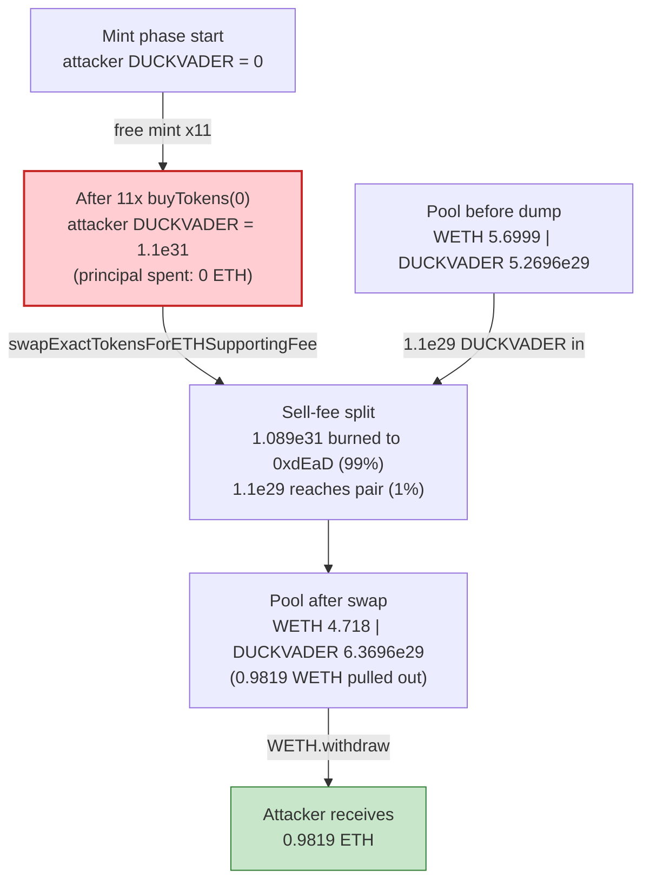
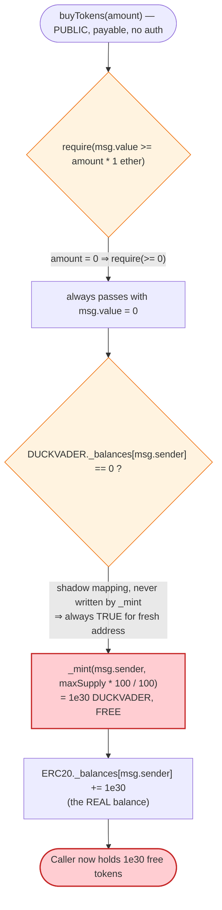

# DUCKVADER Exploit — Permissionless Free-Mint via Broken `buyTokens()` + Storage Shadowing

> **Reproduction:** the PoC compiles & runs in an isolated Foundry project at
> [this project folder](.) (the umbrella DeFiHackLabs repo contains many unrelated PoCs that
> do not compile together, so this one was extracted).
> Full verbose trace: [output.txt](output.txt).
> Verified vulnerable source: [Contract.sol](sources/DUCKVADER_aa8f35/Contract.sol).

---

## Key info

| | |
|---|---|
| **Loss** | ~5 ETH total in the live attack (200 mint-loops). The extracted PoC uses 10 loops and still nets **0.9819 ETH** by draining the DUCKVADER/WETH pool. |
| **Vulnerable contract** | `DUCKVADER` — [`0xaa8f35183478B8EcEd5619521Ac3Eb3886E98c56`](https://basescan.org/address/0xaa8f35183478b8eced5619521ac3eb3886e98c56#code) |
| **Victim pool** | DUCKVADER/WETH UniswapV2 pair — `0x5858CA3964458c29fD7EaC2c1bADa297b5d122Ab` |
| **Attacker EOA** | [`0x2383a550e40a61b41a89da6b91d8a4a2452270d0`](https://basescan.org/address/0x2383a550e40a61b41a89da6b91d8a4a2452270d0) |
| **Attacker contract** | [`0x652f9ac437a870ce273a0be9d7e7ee03043a91ff`](https://basescan.org/address/0x652f9ac437a870ce273a0be9d7e7ee03043a91ff) |
| **Attack tx** | [`0x9bb1401233bb9172ede2c3bfb924d5d406961e6c63dee1b11d5f3f79f558cae4`](https://basescan.org/tx/0x9bb1401233bb9172ede2c3bfb924d5d406961e6c63dee1b11d5f3f79f558cae4) |
| **Chain / block / date** | Base / 27,445,835 / 2025-03-11 |
| **Compiler** | Solidity v0.8.25, optimizer **off** (0 runs) |
| **Bug class** | Unauthenticated free token mint (broken payment check + storage-variable shadowing) |
| **Credit** | [@TenArmorAlert](https://x.com/TenArmorAlert/status/1899378096056201414) |

---

## TL;DR

`DUCKVADER`'s `buyTokens(uint256 amount)` is supposed to be a paid mint endpoint. It is catastrophically
broken in three independent ways
([Contract.sol:700-712](sources/DUCKVADER_aa8f35/Contract.sol#L700-L712)):

1. **The payment check is a no-op when `amount == 0`.** `require(msg.value >= amount * 1 ether)` becomes
   `require(msg.value >= 0)`, which any caller satisfies sending **0 ETH**.
2. **Every first-time caller is gifted the entire max supply.** When the contract's own
   shadow mapping `_balances[msg.sender] == 0`, it executes
   `_mint(msg.sender, (maxSupply * LIQUID_RATE) / MAX_PERCENTAGE)`. With `LIQUID_RATE = MAX_PERCENTAGE = 100`,
   that is `maxSupply = 1_000_000_000_000 * 1e18 = 1e30` tokens, minted **for free**.
3. **Storage-variable shadowing makes the gate permanently open.** `buyTokens` checks `DUCKVADER._balances`
   (a mapping re-declared at [:649](sources/DUCKVADER_aa8f35/Contract.sol#L649)), but `_mint` credits the
   *inherited* `ERC20._balances` ([ERC20.sol-derived `_mint`:519-528](sources/DUCKVADER_aa8f35/Contract.sol#L519-L528)).
   The two mappings are different storage slots, so `_mint` never updates the mapping `buyTokens` reads.
   Even calling `buyTokens` twice from the same address would re-mint — but the attacker simply uses a
   **fresh contract per mint** to keep things clean.

The attacker spins up 10 throwaway `AttackContract2` clones, each calling `buyTokens(0)` to receive a free
`1e30` DUCKVADER and forwarding it to the main attack contract, then calls `buyTokens(0)` once more directly
— **11 free mints, 1.1e31 DUCKVADER** in total. They then dump it into the live DUCKVADER/WETH UniswapV2
pool. The token charges a punishing **99% sell fee to the dead address**, so only 1% (`1.1e29`) actually
hits the pool — but that 1% is still vastly more value than the entire WETH side of the thin pool, so it
sweeps out **0.9819 WETH** which is unwrapped to ETH and sent to the attacker.

---

## Background — what DUCKVADER does

`DUCKVADER` ([source](sources/DUCKVADER_aa8f35/Contract.sol)) is a Base meme token
(`$DUCKVADER`, telegram `t.me/duckvaderbase`) built on standard OpenZeppelin `ERC20` + `Ownable`. On top of
the ERC20 it bolts on a handful of bespoke owner functions and one fatal public mint endpoint:

- **`buyTokens(uint256 amount) payable`** — intended as a "buy tokens with ETH" primitive
  ([:700-712](sources/DUCKVADER_aa8f35/Contract.sol#L700-L712)). As shown above, it neither charges for the
  mint nor tracks balances correctly.
- **`Contract_Creation` / `Airdrop`** — `onlyOwner` mint/airdrop helpers
  ([:713-735](sources/DUCKVADER_aa8f35/Contract.sol#L713-L735)).
- **A fee-on-transfer `_transfer` override** — when neither side is the owner and a transfer goes *to* the
  Uniswap pair (a "sell"), it charges `maxRuleLimit`% to the `deadAddress`
  ([:754-793](sources/DUCKVADER_aa8f35/Contract.sol#L754-L793)). At the fork block this sell fee was **99%**.
- **`maxSupply` is `1_000_000_000_000 * 10**decimals = 1e30`** ([:646](sources/DUCKVADER_aa8f35/Contract.sol#L646)),
  and the constructor already minted the full max supply to the deployer; `buyTokens` mints *another* full
  max supply to each fresh caller, inflating `totalSupply` without bound.

Relevant on-chain facts at the fork block (from the trace):

| Fact | Value |
|---|---|
| `maxSupply` | `1e30` (= 1,000,000,000,000 × 1e18) |
| Per-call free mint amount | `1e30` DUCKVADER (`maxSupply * 100 / 100`) |
| Sell fee (`maxRuleLimit`) | **99%** (1.089e31 of 1.1e31 burned to `0xdEaD` in the trace) |
| Pool reserves before dump (`getReserves`) | reserve0 (WETH) = **5.6999 WETH**, reserve1 (DUCKVADER) = 5.2696e29 |
| Pool DUCKVADER balance before dump | 6.3696e29 |

The pool's WETH reserve of only ~5.7 WETH is the whole prize: a free, unbounded mint dumped into a thin pool
extracts WETH up to (but not exceeding) that reserve.

---

## The vulnerable code

### 1. `buyTokens` — free, unauthenticated, full-supply mint

```solidity
// sources/DUCKVADER_aa8f35/Contract.sol:700-712
function buyTokens(uint256 amount) external payable {
    require(msg.value >= amount * 1 ether); // ① amount=0 ⇒ require(msg.value >= 0) ⇒ always true

    if (_balances[msg.sender] == 0){         // ② reads the SHADOW mapping (slot of DUCKVADER._balances)
        _mint(msg.sender, (maxSupply * LIQUID_RATE) / MAX_PERCENTAGE); // ③ mints full maxSupply = 1e30, FREE
    }

    uint256 newBalance = _balances[msg.sender];
    newBalance += amount;                    // amount=0 ⇒ no change
    _balances[msg.sender] = newBalance;      // only ever touches the SHADOW mapping

    emit Transfer(address(0), msg.sender, amount); // emits a bogus Transfer of `amount` (=0)
}
```

### 2. The shadowing — two different `_balances`

```solidity
// sources/DUCKVADER_aa8f35/Contract.sol:644-649
contract DUCKVADER is Ownable, ERC20 {
    uint256 public immutable maxSupply = 1_000_000_000_000 * (10 ** decimals());
    uint16 public constant LIQUID_RATE = 100;
    uint16 public constant MAX_PERCENTAGE = 100;
    mapping(address => uint256) public _balances; // ⚠️ re-declares a `_balances` that shadows nothing
                                                  //    of the ERC20 logic — a brand-new storage slot
```

`_mint` (inherited from the in-file ERC20) credits the *ERC20* `_balances`, not this one:

```solidity
// sources/DUCKVADER_aa8f35/Contract.sol:519-528  (ERC20._mint)
function _mint(address account, uint256 amount) internal virtual {
    require(account != address(0), "ERC20: mint to the zero address");
    _beforeTokenTransfer(address(0), account, amount);
    _totalSupply += amount;
    _balances[account] += amount;   // ← the ERC20 mapping; the actual balance used by transfer/balanceOf
    emit Transfer(address(0), account, amount);
    _afterTokenTransfer(address(0), account, amount);
}
```

Because `buyTokens` reads `DUCKVADER._balances` (always 0 for any address that never received a `buyTokens`
"deposit"), while `_mint` writes `ERC20._balances`, the `if (_balances[msg.sender] == 0)` guard is
**permanently true** for every fresh address. The attacker therefore only needs fresh addresses — trivially
obtained by deploying throwaway helper contracts.

### 3. The 99% sell fee (why only 1% reaches the pool)

```solidity
// sources/DUCKVADER_aa8f35/Contract.sol:772-789
if (uniswapV2Pair != address(0) && from != owner() && to != owner()) {
    uint256 _fee = 0;
    if (from == uniswapV2Pair) { _fee = minRuleLimit; }
    else if (to == uniswapV2Pair) {                    // a "sell"
        if (excludedFees[from] == true) { _fee = 0; }
        else { _fee = maxRuleLimit; }                  // == 99 at the fork block
    }
    if (_fee > 0) {
        uint256 _calculatedFee = amount * _fee / MAX_PERCENTAGE;
        _transferAmount = amount - _calculatedFee;
        super._transfer(from, deadAddress, _calculatedFee); // burns 99% to 0xdEaD
    }
}
```

This 99% sell tax is the only thing that limited the damage; the free-mint quantity was so absurdly large
(`1.1e31`) that even the surviving 1% (`1.1e29`) dwarfed the pool's DUCKVADER reserve.

---

## Root cause — why it was possible

The single root cause is that **`buyTokens` mints unbounded value for free**. Three compounding defects make
it exploitable by anyone:

1. **Degenerate payment check.** `require(msg.value >= amount * 1 ether)` ties the required payment to the
   `amount` argument, and `amount = 0` makes the requirement vacuous. The function is `payable` but never
   actually requires payment proportional to what it mints — and what it mints isn't even `amount`, it's the
   full `maxSupply`.

2. **Mint amount unrelated to input.** Regardless of `amount`, the first-time branch mints
   `maxSupply * LIQUID_RATE / MAX_PERCENTAGE = maxSupply = 1e30`. A "buy 0 tokens" call mints the entire max
   supply. There is no cap, no per-address limit, and no accounting of ETH received.

3. **Storage-variable shadowing defeats the one-time guard.** The `if (_balances[msg.sender] == 0)` check was
   presumably meant to mint only once per address. But because `DUCKVADER` re-declares `_balances` as a new
   mapping that `_mint` never touches, the guard is always satisfied. Even single-address re-entry would
   re-mint; using fresh addresses makes it deterministic.

In short: a public, `payable`, but effectively-free endpoint that mints the whole supply to whoever calls it
with `amount = 0`. The attacker just needs a liquid market to convert the minted tokens into ETH — which the
DUCKVADER/WETH UniswapV2 pool provided.

---

## Preconditions

- A liquid DUCKVADER/WETH (or DUCKVADER/anything-valuable) pool exists. At the fork block the
  DUCKVADER/WETH pair held ~5.7 WETH and ~6.37e29 DUCKVADER.
- `buyTokens` is callable (it is — public, no access control, no pause). No timing or state gate is needed.
- Working ETH only for gas; the mint itself costs **0 ETH** of principal. The attack is self-financing and
  not even flash-loan dependent.

---

## Attack walkthrough (with on-chain numbers from the trace)

All numbers below are taken directly from [output.txt](output.txt). The pool `0x5858CA…22Ab` has
`token0 = WETH (4200…0006)`, `token1 = DUCKVADER`, so `reserve0 = WETH`, `reserve1 = DUCKVADER`.

| # | Step | Trace ref | Result |
|---|------|-----------|--------|
| 0 | **Initial pool** | [output.txt:244](output.txt) | reserve0 (WETH) = 5.6999e18, reserve1 (DUCKVADER) = 5.2696e29 |
| 1 | **Free-mint ×10** — each fresh `AttackContract2` calls `buyTokens(0)`, gets `1e30` DUCKVADER, transfers it to the main attack contract | [output.txt:30-217](output.txt) | `totalSupply` (slot 3) grows by `1e30` per call; main contract accrues 10 × 1e30 |
| 2 | **Free-mint ×1 (direct)** — main attack contract calls `buyTokens(0)` itself | [output.txt:218-224](output.txt) | +1e30 ⇒ main contract holds **1.1e31 DUCKVADER** |
| 3 | **Approve router** for `type(uint256).max` | [output.txt:225-229](output.txt) | router allowance set |
| 4 | **`swapExactTokensForETHSupportingFeeOnTransferTokens(1.1e31, 0, [DUCKVADER, WETH], attacker)`** | [output.txt:232-276](output.txt) | see fee split below |
| 4a | — 99% sell fee burns to `0xdEaD` | [output.txt:234](output.txt) | **1.089e31** DUCKVADER → `0xdEaD` |
| 4b | — only 1% reaches the pair | [output.txt:235](output.txt) | **1.1e29** DUCKVADER → pool |
| 4c | — pair swaps it out | [output.txt:259](output.txt) | `amount1In = 1.1e29`, `amount0Out = 9.819e17` WETH |
| 5 | **WETH unwrapped to ETH** and sent to attacker EOA | [output.txt:267-274](output.txt) | **0.981901804907398327 ETH** withdrawn |

Final: attacker ETH balance `0 → 0.981901804907398327` ([output.txt:6-7](output.txt)). In the live
attack the attacker ran the mint loop ~200 times instead of 10, draining proportionally more of the pool
(reported ~5 ETH total).

### Profit accounting

| Item | Amount |
|---|---:|
| ETH spent on the mint (principal) | **0** (mints are free; only gas) |
| DUCKVADER minted (11 × `1e30`) | 1.1e31 |
| DUCKVADER burned by 99% sell fee | −1.089e31 → `0xdEaD` |
| DUCKVADER actually swapped | 1.1e29 |
| WETH received from pool | 0.981901804907398327 |
| **Net profit (this PoC, 10 loops)** | **+0.9819 ETH** |

The profit is bounded by the pool's WETH reserve (~5.7 WETH at fork). More mint-loops and/or larger pool
liquidity raise the take — the live incident extracted ~5 ETH.

---

## Diagrams

### Sequence of the attack

```mermaid
sequenceDiagram
    autonumber
    actor A as "Attacker contract"
    participant H as "AttackContract2 (fresh ×10)"
    participant T as "DUCKVADER token"
    participant R as "UniswapV2 Router"
    participant P as "DUCKVADER/WETH pair"

    Note over P: "Initial reserves<br/>WETH 5.6999 | DUCKVADER 5.2696e29"

    rect rgb(255,243,224)
    Note over A,T: "Steps 1-2 — 11 free mints"
    loop 10 fresh helpers
        A->>H: "new AttackContract2(); buy()"
        H->>T: "buyTokens(0)  (msg.value = 0)"
        T-->>H: "_mint 1e30 DUCKVADER (free)"
        H->>A: "transfer 1e30 DUCKVADER"
    end
    A->>T: "buyTokens(0)  (direct, +1e30)"
    Note over A: "holds 1.1e31 DUCKVADER"
    end

    rect rgb(255,235,238)
    Note over A,P: "Steps 3-5 — dump for ETH"
    A->>T: "approve(router, max)"
    A->>R: "swapExactTokensForETHSupportingFee(1.1e31)"
    R->>T: "transferFrom: 99% -> 0xdEaD, 1% (1.1e29) -> pair"
    R->>P: "swap()"
    P-->>R: "0.9819 WETH out"
    R->>R: "WETH.withdraw -> ETH"
    R-->>A: "0.9819 ETH"
    end

    Note over A: "Net +0.9819 ETH (principal cost = 0)"
```

### Pool / mint state evolution



### The flaw inside `buyTokens`



---

## Why each magic number

- **`amount = 0` in every `buyTokens` call:** makes the payment check `require(msg.value >= 0)` trivially
  true, so no ETH is needed. The branch still mints the full `maxSupply` regardless of `amount`.
- **10 helper loops (`times = 10`):** the PoC author reduced the live attacker's ~200 loops to 10 for a
  cheaper, faster reproduction. Each loop is a fresh address ⇒ a fresh `1e30` free mint.
- **`1e30` per mint:** `maxSupply * LIQUID_RATE / MAX_PERCENTAGE = (1e12 × 1e18) × 100 / 100 = 1e30`.
- **99% burned (`1.089e31` of `1.1e31`):** the token's `maxRuleLimit` sell fee was 99% at the fork block, so
  `super._transfer(from, deadAddress, amount * 99 / 100)` destroys 99% of the dumped tokens; only the
  remaining `1.1e29` reaches the pool.
- **`0.9819 WETH` out:** bounded by the pair's WETH reserve (~5.7 WETH); the `1.1e29` DUCKVADER input is far
  larger than the pool's DUCKVADER reserve, so the swap pulls a large fraction of the available WETH.

---

## Remediation

1. **Charge for the mint correctly, or remove `buyTokens` entirely.** If `buyTokens` is meant to be a paid
   primitive, the required payment must be derived from the *amount actually minted*, e.g.
   `require(msg.value == tokensToMint * pricePerTokenInWei)`, and the mint amount must equal what was paid
   for — not the entire `maxSupply`. As written, the function should simply be deleted; the constructor
   already minted the full supply.
2. **Never mint `maxSupply` to arbitrary callers.** Any user-reachable mint must respect a hard cap and a
   per-address allowance. Minting the entire supply to a first-time caller is never a legitimate behavior.
3. **Eliminate the storage shadowing.** Do not re-declare `mapping(address => uint256) public _balances` in a
   contract that inherits an ERC20 implementation owning its own `_balances`. Use the inherited
   `balanceOf()` for any "have they interacted before" logic, or a distinctly-named mapping
   (e.g. `userDeposits`). Shadowed state is a recurring source of "guard never triggers" bugs.
4. **Validate `msg.value` independently of caller-controlled multipliers.** Tying a `require` solely to a
   user-supplied `amount` (which can be 0) is equivalent to having no check at all.
5. **Sanity-cap mintable supply.** Enforce `totalSupply() + mintAmount <= maxSupply` in `_mint` paths so that
   no function can inflate supply beyond the declared maximum.

---

## How to reproduce

The PoC was extracted into a standalone Foundry project (the umbrella DeFiHackLabs repo has many unrelated
PoCs that fail to compile under one whole-project `forge test` build):

```bash
_shared/run_poc.sh 2025-03-DUCKVADER_exp -vvvvv
```

- RPC: a **Base archive** endpoint is required (the fork block 27,445,834 is from March 2025).
  `foundry.toml` uses `https://base.meowrpc.com`, which serves historical state at that block; the default
  Infura key lacks Base access (HTTP 401) and most other public Base RPCs prune state this old
  (`state ... is pruned` / free-tier rate limits).
- Result: `[PASS] testExploit()` with the attacker's ETH balance going `0 → 0.9819 ETH`.

Expected tail:

```
  Attacker Before exploit ETH Balance: 0.000000000000000000
  Attacker After exploit ETH Balance: 0.981901804907398327

Ran 1 test for test/DUCKVADER_exp.sol:DUCKVADER_exp
[PASS] testExploit() (gas: 3281923)
Suite result: ok. 1 passed; 0 failed; 0 skipped
```

---

*Reference: TenArmor alert — https://x.com/TenArmorAlert/status/1899378096056201414 (DUCKVADER, Base, ~5 ETH).*
